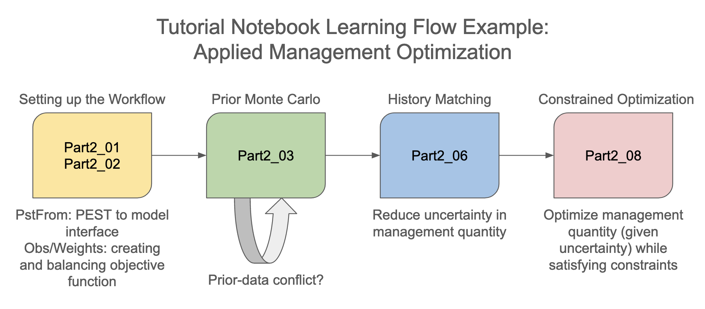

# Decision Support Modelling Notebooks

We have produced a series of tutorial notebooks to assist modellers in setting up and using model-partner software in ways that support the decision-support imperatives of data assimilation and uncertainty quantification. These tutorials provide an introduction to both the concepts and the practicalities of undertaking decision-support groundwater modelling with the PEST/PEST++ and pyEMU suites of software. Their aim is to provide examples of both “how to use” the software as well as “how to think” about using the software. 

## Notebook Contents

We have endeavoured to make these tutorials as accesible to as many people as possible. Workflows demonstrated herein are implemented programmaticaly in Python, employing functionality to interface with PEST/PEST++ available in pyEMU. However, concepts and the general approaches described are not limited to programmatic workflows. If you are interested in understanding how to implement pyEMU workflows, then you are encouraged to complete the jupyter notebooks yourself. If you just want to get a high-level understanding of decision-support modelling concepts and software, then you can simply read through the notebooks without having to run the code yourself. 

GMDSI has also produced a separate set of tutorials which demonstrate non-programmatic approaches to working with PEST/PEST++ available [here](https://gmdsi.org/education/tutorials/). 

## Pre-requisites (nice to have; not required)
 - Basic understanding of Python 
 - Basic understanding of Jupyter Notebooks
 - Basic understanding of MODFLOW 6

Familiarity with git would be a bonus, but not fundamental.

## Organization of the Tutorial Notebooks
The notebooks in the `tutorial` folder are organized in three main parts:
 - part 0: this is introductory background material that can be referred to for more detail on special topics. This includes the synthetic "freyberg" model used throughout the exercises, the `pyemu` python package that is used to interface with PEST++, and some of the mathematical concepts that come up throughout the tutorial notebooks. Note that the `part1_02_pest_setup/freyberg_pest_setup.ipynb` notebook provides valuable context that will help with understanding the `pyemu` introduction.
After completing this module, learners should be able to:
    - Describe the structure and components of the synthetic Freyberg model.
    - Apply the `pyemu` Python package to interface with PEST/PEST++.
    - Discuss the mathematical concepts that underpin the PEST/PEST++ software.

 - part 1: this part covers the Gauss-Levenberg Marquardt (GLM) approach to parameter estimation and associated uncertainty analysis. This was the foundation of the PEST software for multiple decades and the theory continues to resonate through newer techniques
After completing this module, learners should be able to:
    - Describe the GLM approach to parameter estimation.
    - Explain non-uniqueness, identifiability and equifinality in the context of decision-support modelling.
    - Construct a PEST control file and interface files.
    - Understand the effect of parameterization schemes on model predictive ability.
    - Explain the difference between linear and non-linear uncertainy analysis approaches and the value of each.

 - part 2: this part expands largely into ensemble-based parameter estimation and uncertainty analysis methods using PEST++. Advanced topics include management optimization (OPT and MOU) and sequential data assimilation (DA).
After completing this module, learners should be able to:
    - Construct a high-dimensional PEST control file and interface files.
    - Implement GLM and ensemble-based parameter estimation and uncertainty analysis workflows using PEST++ and associated tools.
    - Apply management optimization (OPT and MOU) and sequential data assimilation (DA) techniques to decision-support groundwater modelling problems.

**To run the Part 0 notebooks**
The part 0 notebooks can be run in any order and do not depend on each other. We recommend, in particular, the first 3 topics as background for the rest of the tutorials, but the remaining part 0 notebooks stand alone for more theoretical basis and a reference for topics covered later.

**To run the Part 1 notebooks**
The part 1 notebooks can also be run in any order and do not depend on each other.

**To run the Part 2 notebooks**

If you are going to go through the Part2 notebooks, you will need to run them in the following order:
 1. part2_01_pstfrom_pest_setup/freyberg_pstfrom_pest_setup.ipynb
 2. part2_02_obs_and_weights/freyberg_obs_and_weights.ipynb

From here you can optionally run each of the following sequences:

Prior Monte Carlo:
 1. part2_03_prior_monte_carlo/freyberg_prior_monte_carlo.ipynb

GLM and data worth:
 1. part2_04_glm/freyberg_glm_1.ipynb
 2. part2_05_fosm_and_dataworth/freyberg_fosm_and_dataworth.ipynb
 3. part2_04_glm/freyberg_glm_2.ipynb

PEST++IES:
 1. part2_06_ies/freyberg_ies_1_basics.ipynb
 2. part2_06_ies/freyberg_ies_2_localization.ipynb

PEST++DA:
 1. part2_07_da/freyberg_da_prep.ipynb
 2. part2_07_da/freyberg_da_run.ipynb

PEST++OPT: 
 1. part2_08_opt/freyberg_opt_1.ipynb
 2. part2_08_opt/freyberg_opt_2.ipynb

PEST++MOU: 
 1. part2_09_mou/freyberg_mou_1.ipynb
 2. part2_09_mou/freyberg_mou_2.ipynb
 
IMPORTANT NOTE: When running some of these notebooks, PEST++ undertakes parallel model runs for computational efficiency. These runs are coordinated using internet communication protocols (e.g. TCP/IP). As a result, it is common (but not universal) that the first time a set of parallel runs is launched, a Windows Defender (or similar popup on other operating systems) box appears warning the user. This box can simply be closed by clicking "cancel" and then the model runs should proceed without issue.

## Installation Instructions

**Download the course repository:**

You can do this in one of two ways. 
 - (1) (easier) Download the repo as a zip file from here: [GMDSI_notebooks](https://github.com/gmdsi/GMDSI_notebooks). Unzip the folder and work from there.
 - (2) (recommended; requires familiarity with git). Install git following directions here: [Git](https://git-scm.com/book/en/v2/Getting-Started-Installing-Git). Sign-up for a git-hub account, then clone the repo [GMDSI_notebooks](https://github.com/gmdsi/GMDSI_notebooks).

**Install Python and dependencies:**
 - If you have already installed Python using Anaconda, you can skip this step. If not, install [Anaconda](https://www.anaconda.com/products/individual) (or [Miniconda](https://docs.conda.io/en/latest/miniconda.html), if you prefer )
 - If you are using __Windows__: go to the start menu and open "Anaconda prompt". An anaconda command line window will open. On __Linux__ or __MacOS__, just use the standard terminal. Navigate to the course repo folder on your machine. You can accomplish this by typing "cd *your folder path*" and pressing < enter >. Replace *your folder path* with the path to the course material folder on your computer.
 - Next, type `conda env create -f environment.yml`. This will create an anaconda environment called "gmdsitut" and install the python dependencies required for this course. It may take a while. Should you wish, you can inspect the *environment.yml* file in the repo folder to see what dependecies are being installed.

**Start jupyter notebook**
You will need to do this step any time you wish to open one of the course notebooks.
To start up the jupyter notebook:
- Windows: open the Anaconda prompt and type `conda activate gmdsitut`
- Mac/Linux: open a termainal and type `conda activate gmdsitut`
- Then navigate to folder where you downloaded the course materials repo and type `jupyter notebook`
A jupyter notebook instance should start within the course repo flder. Using the browser, you can now navigate to the "notebooks" folder and open one.

# Contents and Instructional Design
The tutorial notebooks are structured into three main parts:

## Part 0: Introductory Background

> After completing this module, learners should be able to:
>   - Describe the structure and components of the synthetic Freyberg model.
>   - Apply the `pyemu` Python package to interface with PEST/PEST++.
>   - Discuss the mathematical concepts that underpin the PEST/PEST++ software.
> 

Part 0 serves as the foundation, providing essential background material. Learners are encouraged to reference notebooks in Part 0 to polish their understanding of concepts they encounter in Parts 1 and 2. Part 0 is not intended to be a comprehensive resource for all background material, but rather to establish a solid understanding of the basics. The explanations of mathematical concepts are intended to be accessible through visualization and descriptions related to everyday concepts and modelling concepts. 

Each notebook in Part 0 is standalone and covers a unique topic. These include:

  - Introduction to a synthetic model known as the "Freyberg" model [@freyberg]. This model is used as a consistent example throughout the tutorial exercises, allowing learners to apply concepts in a practical context.
  - An introduction to the `pyemu` Python package that is used to complement and interface with PEST/PEST++.
  - Explanation of fundamental mathematical concepts that are relevant and will be encountered throughout the tutorial notebooks.

Pre-requisites for Part 0 include a basic understanding of Python, Jupyter Notebooks, and MODFLOW 6 [@Langevin_MODFLOW_6_Modular_2022]. Familiarity with git is a bonus but not fundamental.

## Part 1: Introduction to ``PEST`` and the Gauss-Levenberg Marquardt Approach

> After completing this module, learners should be able to:
> 
> - Describe the GLM approach to parameter estimation.
> - Explain non-uniqueness, identifiability and equifinality in the context of decision-support > modelling.
> - Construct a ``PEST`` control file and interface files.
> - Understand the effect of parameterization schemes on model predictive ability.
> - Explain the difference between linear and non-linear uncertainty analysis approaches and > the value of each.

Part 1 focuses on the Gauss-Levenberg Marquardt (GLM) approach to parameter estimation and associated uncertainty analysis in a groundwater modelling context. This was the foundation of the ``PEST`` software for multiple decades and the theory continues to resonate through newer techniques.

Part 1 is designed to be accessible without strict sequential dependencies. Learners have the flexibility to explore its contents in any order that suits their preferences or needs. These include:

  - Introduction to concepts such as non-uniqueness, identifiability, and equifinality.
  - Introduction to the ``PEST`` control file and the PEST/PEST++ interface.
  - Exploring the challenges of parameterization schemes on predictive ability, as well as how to mitigate them.
  - Introducing first-order second-moment (FOSM) and prior Monte Carlo uncertainty analysis approaches.

 While Part 1 notebooks can be largely run in any order, the curriculum was initially designed to start with simple parameterization of a model and to build complexity intentionally throughout the progression of the sequence. The ramifications of simplification and the value of adding complexity are evaluated in the context of the performance of the model in forecasts made outside the parameter estimation conditions. This progression motivates the value of a highly parameterized approach which is the starting point for many new projects, as explored in Part 2.

Pre-requisites for Part 1 include a basic understanding of numerical groundwater modelling and familiarity with MODFLOW 6. Familiarity with Python and Jupyter Notebooks is assumed.

## Part 2: Python-based Decision-Support Modelling Workflows

> After completing this module, learners should be able to:
> 
> - Construct a high-dimensional ``PEST`` control file and interface files.
> - Implement GLM and ensemble-based parameter estimation and uncertainty analysis workflows > using ``PEST++`` and associated tools.
> - Apply management optimization and sequential data assimilation techniques to > decision-support groundwater modelling problems.

Part 2 expands on the foundational knowledge gained in Part 1 and delves into advanced topics related to ensemble-based parameter estimation, uncertainty analysis and optimization methods. These advanced topics include management optimization and sequential data assimilation. This approach and these advanced topics assume a highly parameterized approach, as motivated in Part 1. Topics are laid out in manner that reflects real-world workflows, with a focus on practical application of concepts and problem solving.

Part 2 is structured with a specific order for learners to follow to ensure a logical progression of topics, inline with a real-world applied workflow. Learners have the option to explore various sequences covering advanced topics, such as:

  - Prior Monte Carlo analysis
  - Highly parameterized Gauss-Levenberg Marquardt history matching and associated Data Worth analysis using First Order, Second Moment (FOSM) technique, 
  - Ensemble-based history matching and uncertainty analysis with the iterative ensemble smoother approach as implemented in ``PEST++IES``, 
  - Sequential data assimilation with ``PEST++DA``, and 
  - Single-objective and multi-objective optimization under uncertainty with ``PEST++OPT`` and ``PEST++MOU``.
 
Each of these sequences comprises multiple notebooks to be executed in a specified order. They demonstrate how to execute the workflow, interpret results, and apply the concepts to real-world problems.

In summary, the tutorial notebooks are organized to guide learners through a structured learning experience in the field of decision-support groundwater modelling. Part 0 provides foundational knowledge, while Parts 1 and 2 offer progressively advanced content. The authors attest that it is ideal to work through Parts 1 and 2 in their entirety, referring back to Part 0 for additional background. However, this amount of content requires a significant time commitment so, practically, many users will start with Part 2 and, hopefully, be able to apply the concepts to a problem of their own as they progress. In this practical case, users with a specific application or learning goal in mind may find it useful to curate notebooks from Part 2 into a comprehensive and demonstrative workflow. The flowchart below gives an example of a curated learning flow for a common decision support modelling application. Over time, referring back through Part 1 will provide a deeper understanding of some concepts and techniques taken for granted in the highly parameterized, largely ensemble-based approaches of Part 2.

  

Pre-requisites for Part 2 include a basic understanding of PEST/PEST++ and the ``PEST`` interface, as well as familiarity with the Freyberg model. Familiarity with Python and Jupyter Notebooks is assumed.

# Resources

A webinar hosted by GMDSI introducing the tutorial notebooks can be viewed [here](https://vimeo.com/856752189). During the webinar the authors provided an overview of the notebooks, as well as a demonstration of how to use them and introduced an [online self-guided course](https://gmdsi.org/blog/guided-self-study-course/).

The [GMDSI](https://gmdsi.org) web-page also hosts an extensive range of resources and educational material on decision support modelling. These include numerous instructional video lectures, webinar recordings, non-programmatic workflow tutorials, as well as worked example reports describing real-world applications. 

Software from the ``PEST`` suite can be downloaded from John Doherty's web page [here](https://www.pesthomepage.org/). The [user manual](https://www.pesthomepage.org/Downloads/PEST%20Manuals/PEST%20Manual.pdf) contains much useful information. The [PEST Book](https://pesthomepage.org/pest-book) is also a great resource for learning about the theory underpinning use of the software.

Software from the ``PEST++`` suite can be accessed from GitHub [repository](https://github.com/usgs/pestpp/tree/master). The [user manual](https://github.com/usgs/pestpp/blob/develop/documentation/pestpp_users_manual.md) contains much useful information, as well as theoretical background to the software. Further theoretical background is available in [@whitepestpp].

``pyemu`` can be accessed from the GitHub [repository](https://github.com/pypest/pyemu/tree/master). The repository contains several example Jupyter Notebooks. The tutorial notebooks discussed herein provide a more exhaustive and structured learning experience.

# Contributing

We welcome community contributions to this repository. If you would like to contribute, please fork the repository and submit a pull request. If you have any questions, or would like to discuss a contribution beforehand, please open a [discussion](https://github.com/gmdsi/GMDSI_notebooks/discussions). 

If you have a found a bug or would like to suggest a new feature or tutorial, please open an [issue](https://github.com/gmdsi/GMDSI_notebooks/issues).

 # Acknowledgments
 
These tutorials were originally developed with support from the U.S Geological Survey (USGS) and support from USGS continues. Continued development and support is funded by the Groundwater Modelling Decision Support Initiative (GMDSI). GMDSI is jointly funded by BHP and Rio Tinto.

# Reference
To reference this material, please use the following:

Hugman, R., White, J.T., Fienen, M.N., and Hunt, R.J., 2022, Parameter Estimation, Uncertainty Analysis, and Optimization with the PEST++ Family of codes: Tutorial Jupyter Notebooks: U.S. Geological Survey data release, https://doi.org/10.5066/P901F9G0.
