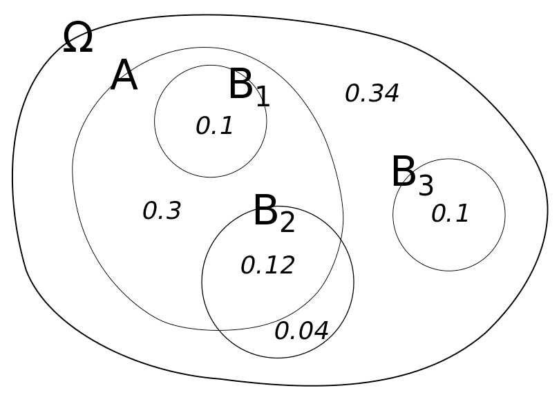
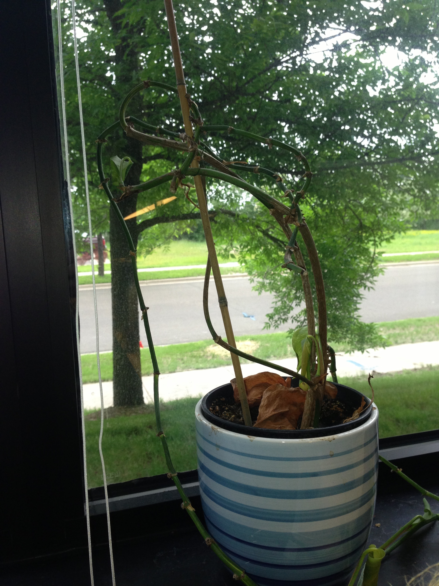
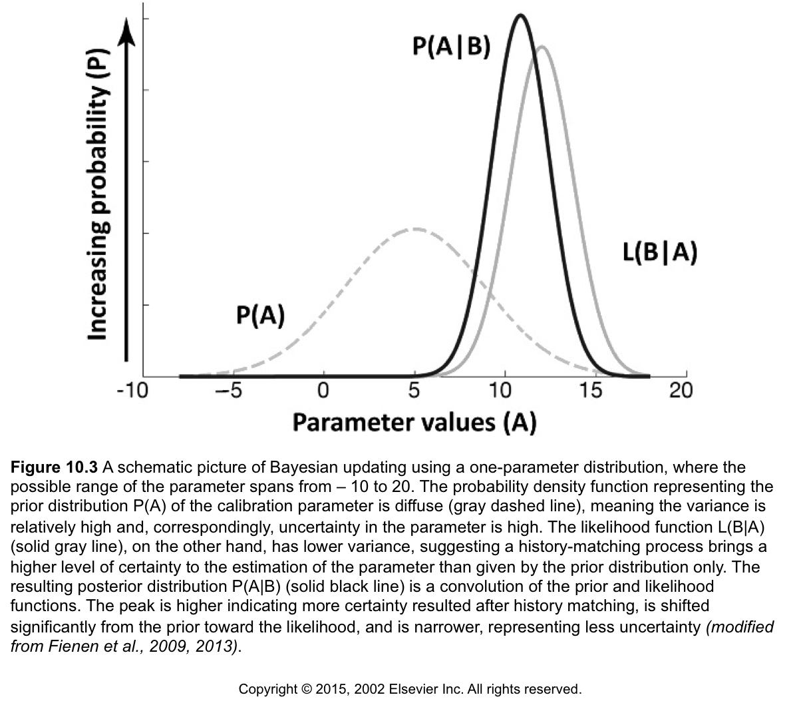
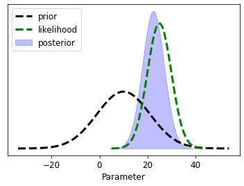
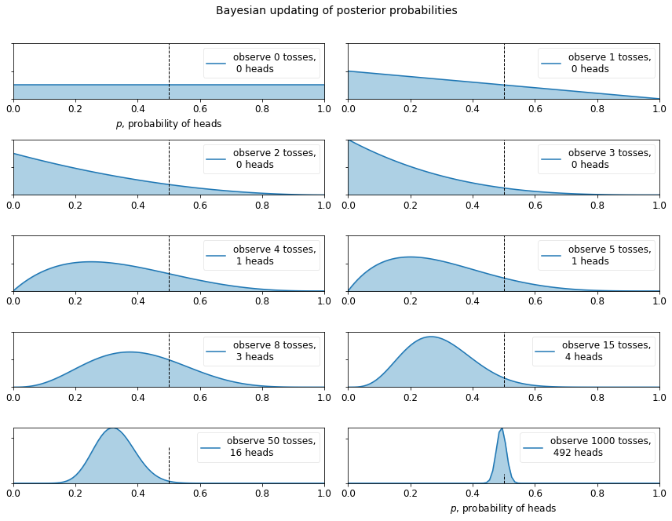

# Bayes' Theorem
> ### _"When the facts change, I change my mind. What do you do, sir?"_
> --John Maynard Keynes

Loosely, Bayes' Theorem can be interpreted as

$$P\left(\boldsymbol{\theta}|\textbf{d}\right)=\frac{P\left(\textbf{d}|\boldsymbol{\theta}\right) P\left> (\boldsymbol{\theta}\right)}{P\left(\textbf{d}\right)}$$
 
in which $\boldsymbol{\theta}$ are parameters and $\mathbf{d}$ are the data.

This is really just rearranging the law of conditional probabilities:

$$P\left(\boldsymbol{\theta}|\textbf{d}\right)P\left(\textbf{d}\right)=P\left(\textbf{d}|\boldsymbol{\theta}\right) P\left(\boldsymbol{\theta}\right)$$

_Um, what?_ Let's use pictures to make this easier to understand.

## A Venn diagram to explore conditional probabilities



By [Gnathan87 - Own work, CC0](https://commons.wikimedia.org/w/index.php?curid=15991401)


What is the probability of $A$ if we know we are in $B_1$? The equation for this is:

$$P\left(A|B_1\right)$$

It is easy to see that it is 100% or:

$$P\left(A|B_1\right)=1.0$$

Why? Because the $B_1$ circle is entirely within the $A$ circle. Therefore, if we know we are in $B_1$, then we must also be in $A$.

As a general rule, we can state 
$$P\left(A|B_1\right)=\frac{P\left(A\cap B_1\right)}{P\left(B_1\right)}$$

or, equivalently 
$$P\left(A\cap B_1\right)=P\left(A|B_1\right)P\left(B_1\right)$$

So what about $P\left(A|B_2\right)$?

$$P\left(A|B_2\right)=\frac{P\left(A\cap B_2\right)}{P\left(B_2\right)}=\frac{0.12}{0.12+0.04}=0.75$$

### Bayes Theorem

Now we can derive Bayes' theorem because joint probabilities are symmetrical. Switching notation to 
$\boldsymbol{\theta} \text{ and }\mathbf{d}$:

$$P\left(\boldsymbol{\theta}\cap \mathbf{d}\right)=P\left(\mathbf{d}\cap \boldsymbol{\theta}\right)$$

$$P\left(\boldsymbol{\theta}|\textbf{d}\right) P\left(\textbf{d}\right) = P\left(\textbf{d}|\boldsymbol{\theta}\right) P\left(\boldsymbol{\theta}\right)$$

With the tiniest little algebra, we get Bayes' theorem -- #boom#!

$$P\left(\boldsymbol{\theta}|\textbf{d}\right) = \frac{P\left(\textbf{d}|\boldsymbol{\theta}\right) P\left(\boldsymbol{\theta}\right)}{P\left(\textbf{d}\right)}$$


# So, what does this really mean?  

## A practical example

Let's play with a concrete example, one hinging on life, death, trust, and promises kept!





You have a plant at home, and you're going to go away for a week. If it gets watered, its probability of dying is 15%. If it doesn't get watered, it is 80% likely to die. You ask your partner to water it for you and you are 90% certain they will do it.

We can express this all in terms of probabilities and conditional probabilities.

### First a couple definitions:

$\theta_w$: partner waters the plant

$\theta_{nw}$: partner forgets to water the plant

$d_a$: plant is alive when we return 

$d_d$: plant is dead when we return

$\mathbf{d} = [d_a,d_d]$: a vector of all possible outcomes
 
$\boldsymbol{\theta} = [\theta_w,\theta_{nw}]$: a vector of all possible outcomes

Cool, so let's express what we know in probability equations:

$$P\left(d_d | \theta_w\right)=0.15$$
$$P\left(d_d | \theta_{nw}\right)=0.8$$
$$P\left(\theta_w\right)=0.9$$
$$P\left(\theta_{nw}\right)=0.1$$


And we can assign these as python variables to get our maths groove on:


```python

PDd_thw = 0.15
PDd_thnw = 0.8
Prior_thw = 0.9
Prior_thnw = 0.1

```

Now we can ask questions like, "what is the probability the plant is dead?"

To calculate, we add up all the conditional probabilities like this:

$$P\left(d_d\right) = P\left(d_d\cap\theta_w\right) + P\left(d_d\cap\theta_{nw}\right)$$

$$P\left(d_d\right) = P\left(d_d|\theta_w\right)P\left(\theta_w\right) + P\left(d_d|\theta_{nw}\right)P\left(\theta_{nw}\right)$$


```python

PDd = PDd_thw*Prior_thw + PDd_thnw*Prior_thnw
print ('Probability Plant is dead = {0:.3f}'.format(PDd))

```

    Probability Plant is dead = 0.215
    

Since we only have two discrete outcomes, the probability of the plant being alive is simply 

$$P\left(d_a\right)=1-P\left(d_d\right)$$


```python
PDa = 1-PDd
print ('Probability Plant is alive = {0:.3f}'.format(PDa))
```

    Probability Plant is alive = 0.785
    

Great! So we can incorporate all the possible arrangements of events to determine likely outcomes. But....what we are _really_ interested in is what we learn with partial information. This is where household harmony can be made or broken!

## Learning from information

We come home and see that the plant is dead (crumbs!). Who to blame? What is the probability that our partner forgot to water it? 

Mathematically, this is;
$$P\left(\theta_{nw} | d_d\right)$$

We can use Bayes' theorem to evaluate this new information (e.g. we have observed that the plant is dead)

$$P\left(\theta_{nw} | d_d\right) = \frac{P\left(d_d | \theta_{nw}\right) P\left(\theta_{nw}\right)}{P\left(d_d\right)}$$


```python
PthnwDd = PDd_thnw * Prior_thnw/ PDd
print ("Probability that partner failed to water the plant")
print("having seen it's dead is {0:.3f}".format(PthnwDd))
```

    Probability that partner failed to water the plant
    having seen it's dead is 0.372
    

Alternatively, we can see the converse: How likely did our partner water the plant given that it's alive?

$$P\left(\theta_w | d_a\right) = \frac{P\left(d_a | \theta_w\right) P\left(\theta_w\right)}{P\left(d_a\right)}$$


```python
PthwDa = (1-PDd_thw) * Prior_thw/ PDa
print ("Probability that partner did water the plant")
print ("having seen it's alive is {0:.3f}".format(PthwDa))
```

    Probability that partner did water the plant
    having seen it's alive is 0.975
    

How likely did our partner forget, given that we see it's alive?

$$P\left(\theta_{nw} | d_a\right) = \frac{P\left(d_a | \theta_{nw}\right) P\left(\theta_{nw}\right)}{P\left(d_a\right)}$$


```python
PthnwDa = (1-PDd_thnw) * Prior_thnw/ PDa
print ("Probability that partner forgot to water the plant")
print("having seen it's alive is {0:.3f}".format(PthnwDa))
```

    Probability that partner forgot to water the plant
    having seen it's alive is 0.025
    

### Continuous variables

Right then, but we are in the world of continuous variables, not simple discrete probabilities

This means that we end up with probability density functions rather than discrete probabilities and the denominator on the RHS gets tricky to evaluate (the total probability). Luckily, we are mostly concerned with finding the parameters that maximize the probability and less concerned with the probability itself.




This is a learning framework, where what we know at the end is a function of what we started with and what we _learned_ through a new experiment (model) or new information

$$\underbrace{P(\boldsymbol{\theta}|\textbf{d})}_{\substack{\text{posterior} \\ \text{pdf}}} \propto \underbrace{\mathcal{L}( \boldsymbol{\theta}| \textbf{d})}_{\substack{\text{likelihood} \\ \text{function}}} \underbrace{P(\boldsymbol{\theta})}_{\substack{\text{prior } \\ \text{pdf}}} $$


$$\underbrace{P(\boldsymbol{\theta}|\textbf{d})}_{\substack{\text{what we} \\ \text{know now}}} \propto \underbrace{\mathcal{L}(\boldsymbol{\theta} | \textbf{d})}_{\substack{\text{what we} \\ \text{learned}}} \underbrace{P(\boldsymbol{\theta})}_{\substack{\text{what we} \\ \text{knew}}} $$


## Let's look at an interactive example of how distributions behave


```python
import bayes_helper as bh
from ipywidgets import interact
```


```python
bh.plot_posterior(prior_mean=10, prior_std=11, likeli_mean = 25, likeli_std=5);
```

    findfont: Font family ['sans-serif'] not found. Falling back to DejaVu Sans.
    findfont: Generic family 'sans-serif' not found because none of the following families were found: Univers 57 Condensed
    


    

    


```python
interact(bh.plot_posterior,
         prior_mean=(1, 20., .5), likeli_mean=(1, 20, 1), 
         prior_std=(.1, 8, .1), likeli_std=(.1, 8, 2));
```

    D:\Workspace\hugm0001\anaconda\envs\gmdsitut\lib\site-packages\ipykernel\pylab\backend_inline.py:10: DeprecationWarning: `ipykernel.pylab.backend_inline` is deprecated, directly use `matplotlib_inline.backend_inline`
    


    interactive(children=(FloatSlider(value=10.5, description='prior_mean', max=20.0, min=1.0, step=0.5), FloatSli…


# The mandatory "coin-flipping example" 
> _Borrowed from **Bayesian Methods for Hackers**. The full Github repository is available [here](https://github.com/CamDavidsonPilon/Probabilistic-Programming-and-Bayesian-Methods-for-Hackers)_

We can start with an "ignorance" prior - equal probabilities of all outcomes (both, in the case---heads and tails). By flipping a coin we can observer outcomes, constantly updating and learning from each experiment.


```python
max_trials = 1000
# The code below can be passed over, as it is currently not important, plus it
# uses advanced topics we have not covered yet. 
import numpy as np
from matplotlib import pyplot as plt

fig = plt.figure(figsize=(12,9))

import scipy.stats as stats
dist = stats.beta
n_trials = [0, 1, 2, 3, 4, 5, 8, 15, 50, max_trials]
data = stats.bernoulli.rvs(0.5, size=n_trials[-1])
x = np.linspace(0, 1, 100)

# For the already prepared, I'm using Binomial's conj. prior.
for k, N in enumerate(n_trials):
    sx = plt.subplot(int(len(n_trials) / 2), 2, k + 1)
    plt.xlabel("$p$, probability of heads") \
        if k in [0, len(n_trials) - 1] else None
    plt.setp(sx.get_yticklabels(), visible=False)
    heads = data[:N].sum()
    y = dist.pdf(x, 1 + heads, 1 + N - heads)
    plt.plot(x, y, label="observe %d tosses,\n %d heads" % (N, heads))
    plt.fill_between(x, 0, y, color="#348ABD", alpha=0.4)
    plt.vlines(0.5, 0, 4, color="k", linestyles="--", lw=1)

    leg = plt.legend()
    leg.get_frame().set_alpha(0.4)
    plt.autoscale(tight=True)
plt.suptitle("Bayesian updating of posterior probabilities",
             y=1.02,
             fontsize=14)
plt.tight_layout();
```

    findfont: Font family ['sans-serif'] not found. Falling back to DejaVu Sans.
    findfont: Generic family 'sans-serif' not found because none of the following families were found: Univers 57 Condensed
    


    

    


The posterior probabilities are represented by the curves, and our uncertainty is proportional to the width of the curve. As the plot above shows, as we start to observe data our posterior probabilities start to shift and move around. Eventually, as we observe more and more data (coin-flips), our probabilities will tighten closer and closer around the true value of $p=0.5$ (marked by a dashed line). 

Notice that the plots are not always *peaked* at 0.5. There is no reason it should be: recall we assumed we did not have a prior opinion of what $p$ is. In fact, if we observe quite extreme data, say 8 flips and only 1 observed heads, our distribution would look very biased *away* from lumping around 0.5 (with no prior opinion, how confident would you feel betting on a fair coin after observing 8 tails and 1 head). As more data accumulates, we would see more and more probability being assigned at $p=0.5$, though never all of it.

