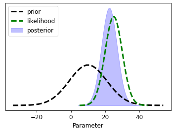

# Simple closed-form Bayes demo

In this very simple notebook, we can explore how Bayes equation works for a one-dimensional gaussian inference problem.


```python
import os
import sys
sys.path.insert(0,os.path.join("..", "..", "dependencies"))
import pyemu
import flopy
assert "dependencies" in flopy.__file__
assert "dependencies" in pyemu.__file__
from IPython.core.pylabtools import figsize
import numpy as np
from matplotlib import pyplot as plt
figsize(11, 6)
import bayes_helper as bh
from ipywidgets import interact
```

The function `bayes_helper.plot_posterior()` returns an interesting fig.  You pass it the first and second moments of the prior and likelihood functions.  It calculates the first and second posterior moments and then plots them up on a crude figure...


```python
bh.plot_posterior(prior_mean=10, prior_std=11, likeli_mean = 25, likeli_std=5)
```

    findfont: Font family ['sans-serif'] not found. Falling back to DejaVu Sans.
    findfont: Generic family 'sans-serif' not found because none of the following families were found: Univers 57 Condensed
    


    

    


We can also use the notebook machinery to make this interactive-ish....


```python
interact(bh.plot_posterior,
         prior_mean=(1, 20., .5), likeli_mean=(1, 20, 1), 
         prior_std=(.1, 8, .1), likeli_std=(.1, 8, 2));
```

    D:\Workspace\hugm0001\anaconda\lib\site-packages\ipykernel\pylab\backend_inline.py:11: DeprecationWarning: `ipykernel.pylab.backend_inline` is deprecated, directly use `matplotlib_inline.backend_inline`
    


    interactive(children=(FloatSlider(value=10.5, description='prior_mean', max=20.0, min=1.0, step=0.5), FloatSli…


Some experiements to try:
 - prior and likelihood have same standard deviation and same mean
 - prior and likelihood have same standard deviation and very different means
 - prior is very uncertain, likelihood is very certain
 - prior is very certain, likelihood is very uncertain


Conceptual understanding check:
 - where does the prior mean come from?
 - where does the prior standard deviation come from?
 - where does the likelihood mean come from?
 - where does the likelihood standard deviation come from?


```python

```
