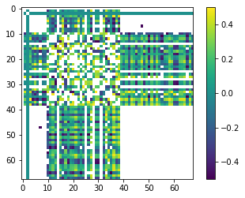

# Local Parameter Sensitivity and Identifiability

Sensitivity analysis maks use of a Joacoban matrix to determine statistical insights into a model. We have already discussed the Jacobian matrix in a few places. It is calculated by perturbing the parameter (usually 1%) and tracking what happens to each observation.  In a general form the sensitivity equation looks like eq. 9.7 Anderson et al. 2015:


This is key for derivative-based parameter estimation because, as we've seen, it allows us to efficiently compute upgraded parameters to try during the lambda search.  But the Jacobian matrix can give us insight about the model in and of itself.  

### Parameter Sensitivty

Recall that a Jacobian matrix stores parameter-to-observation sensitivities.  For each parameter-observation combination, we can see how much the observation value changes due to a small change in the parameter. If $y$ are the observations and $x$ are the parameters, the equation for the $i^th$ observation with respect to the $j^th$ parameter is:  
$$\frac{\partial y_i}{\partial x_j}$$
This can be approximated by finite differences as :  
$$\frac{\partial y_i}{\partial x_j}~\frac{y\left(x+\Delta x \right)-y\left(x\right)}{\Delta x}$$

___Insensitive parameters___ (i.e. parameters which are not informed by calibration) are defined as those which have sensitivity coefficients larger than a modeller specified value (Note: this is subjective! In practice, insensitive parameters are usually defined has having a sensitiveity coeficient two orders of magnitude lower than the most sensitive parameter.)


### Parameter Identifiability
Sensitivity analyses can mask other artifacts that affect calibration and uncertainty. A primary issues is correlation between parameters.  For example, we saw that in a heads-only calibration we can't estimate both recharge and hydraulic conductivity independently - the parameters are correlated so that an increase in one can be offset with an increase in the other.  To address this shortcoming, Doherty and Hunt (2009) show that singular value decomposition can extend the sensitivity insight into __*parameter identifiability*__.  Parameter identifiability combines parameter insensitivity and correlation information, and reflects the robustness with which particular parameter values in a model might be calibrated. That is, an identifiable parameter is both sensitive and relatively uncorrelated and thus is more likely to be estimated (identified) than an insensitive and/or correlated parameter. 

Parameter identifiability is considered a "linear method" in that it assumes the Jacobian matrix sensitivities hold over a range of reasonable parameter values.  It is able to address parameter correlation through singular value decomposition (SVD), exactly as we've seen earlier in this course.  Parameter identifiability ranges from 0 (perfectly unidentifiable with the observations available) to 1.0 (fully identifiable). So, we typically plot identifiability using a stacked bar chart which is comprised of the included singular value contributions. Another way to think of it: if a parameter is strongly in the SVD solution space (low singular value so above the cutoff) it will have a higher identifiability. However, as Doherty and Hunt (2009) point out, identifiability is qualitative in nature because the singular value cutoff is user specified.  

### Limitations

As has been mentioned a couple of times now, sensitivity and identifiability assumes that the relation between parameter and obsevration changes are linear. These sensitivities are tested for a single parameter set (i.e. the parameter values listed in the PEST control file). This parameter set can be before or after calibration (or any where in between). The undelying assumption is that the linear relation holds. 

In practice, this is rarely the case. Thus, sensitivities obtained during derivative-based parameter estimation is ___local___. It only holds up in the vicinity of the current parameters. That being said, it is a quick and computationaly efficient method to gain insight into the model and links between parameters and simualted outputs. 

An alternative is to employ _global_ sensitivity analysis methods, which we introduce in a subsequent notebook.

> __References:__
>
> - Doherty, John, and Randall J. Hunt. 2009. “Two Statistics for Evaluating Parameter Identifiability and Error Reduction.” Journal of Hydrology 366 (1–4): 119–27. doi:10.1016/j.jhydrol.2008.12.018.
> - Anderson, Mary P., William W. Woessner, and Randall J. Hunt. 2015. Applied Groundwater Modeling: Simulation of Flow and Advective Transport. Applied Groundwater Modeling. 2nd ed. Elsevier. https://linkinghub.elsevier.com/retrieve/pii/B9780080916385000018.

## Admin

We are going to pick up where the "Freyberg pilot points" tutorials left off. The cells bellow prepare the model and PEST files.


```python
import sys
import os
import warnings
warnings.filterwarnings("ignore")
warnings.filterwarnings("ignore", category=DeprecationWarning) 

import pandas as pd
import numpy as np
import matplotlib.pyplot as plt;

import shutil

sys.path.insert(0,os.path.join("..", "..", "dependencies"))
import pyemu
import flopy
assert "dependencies" in flopy.__file__
assert "dependencies" in pyemu.__file__
sys.path.insert(0,"..")
import herebedragons as hbd

plt.rcParams['font.size'] = 10
pyemu.plot_utils.font =10
```


```python
# folder containing original model files
org_d = os.path.join('..', '..', 'models', 'monthly_model_files_1lyr_newstress')
# a dir to hold a copy of the org model files
working_dir = os.path.join('freyberg_mf6')
if os.path.exists(working_dir):
    shutil.rmtree(working_dir)
shutil.copytree(org_d,working_dir)
# get executables
hbd.prep_bins(working_dir)
# get dependency folders
hbd.prep_deps(working_dir)
# run our convenience functions to prepare the PEST and model folder
hbd.prep_pest(working_dir)
# convenience function that builds a new control file with pilot point parameters for hk
hbd.add_ppoints(working_dir)
```

    ins file for heads.csv prepared.
    ins file for sfr.csv prepared.
    noptmax:0, npar_adj:1, nnz_obs:24
    written pest control file: freyberg_mf6\freyberg.pst
       could not remove start_datetime
    1 pars added from template file .\freyberg6.sfr_perioddata_1.txt.tpl
    6 pars added from template file .\freyberg6.wel_stress_period_data_10.txt.tpl
    0 pars added from template file .\freyberg6.wel_stress_period_data_11.txt.tpl
    0 pars added from template file .\freyberg6.wel_stress_period_data_12.txt.tpl
    0 pars added from template file .\freyberg6.wel_stress_period_data_2.txt.tpl
    0 pars added from template file .\freyberg6.wel_stress_period_data_3.txt.tpl
    0 pars added from template file .\freyberg6.wel_stress_period_data_4.txt.tpl
    0 pars added from template file .\freyberg6.wel_stress_period_data_5.txt.tpl
    0 pars added from template file .\freyberg6.wel_stress_period_data_6.txt.tpl
    0 pars added from template file .\freyberg6.wel_stress_period_data_7.txt.tpl
    0 pars added from template file .\freyberg6.wel_stress_period_data_8.txt.tpl
    0 pars added from template file .\freyberg6.wel_stress_period_data_9.txt.tpl
    starting interp point loop for 800 points
    took 1.982655 seconds
    1 pars dropped from template file freyberg_mf6\freyberg6.npf_k_layer1.txt.tpl
    29 pars added from template file .\hkpp.dat.tpl
    starting interp point loop for 800 points
    took 1.977726 seconds
    29 pars added from template file .\rchpp.dat.tpl
    noptmax:0, npar_adj:65, nnz_obs:37
    new control file: 'freyberg_pp.pst'
    

### Load the `pst` control file

Let's double check what parameters we have in this version of the model using `pyemu` (you can just look in the PEST control file too.).


```python
pst_name = "freyberg_pp.pst"
# load the pst
pst = pyemu.Pst(os.path.join(working_dir,pst_name))
# what parameter groups?
pst.par_groups
```


    ['porosity', 'rch0', 'rch1', 'strinf', 'wel', 'hk1', 'rchpp']


Which are adjustable?


```python
# what adjustable parameter groups?
pst.adj_par_groups
```


    ['strinf', 'wel', 'hk1', 'rchpp']


We have adjustable parameters that control SFR inflow rates, well pumping rates, hydraulic conductivity and recharge rates. Recall that by setting a parameter as "fixed" we are stating that we know it perfectly (should we though...?). Currently fixed parameters include porosity and future recharge.

For the sake of this tutorial, let's set all the parameters free:


```python
par = pst.parameter_data
#update paramter transform
par.loc[:, 'partrans'] = 'log'
#check adjustable parameter groups again
pst.adj_par_groups
```


    ['porosity', 'rch0', 'rch1', 'strinf', 'wel', 'hk1', 'rchpp']


## Calculate the Jacobian

First Let's calculate a single Jacobian by changing the NOPTMAX = -2.  This will need npar+1 runs. The Jacobian matrix we get is the local-scale sensitivity information


```python
# change noptmax
pst.control_data.noptmax = -2
# rewrite the contorl file!
pst.write(os.path.join(working_dir,pst_name))
```

    noptmax:-2, npar_adj:68, nnz_obs:37
    


```python
num_workers = 10
m_d = 'master_local'
pyemu.os_utils.start_workers(working_dir, # the folder which contains the "template" PEST dataset
                            'pestpp-glm', #the PEST software version we want to run
                            pst_name, # the control file to use with PEST
                            num_workers=num_workers, #how many agents to deploy
                            worker_root='.', #where to deploy the agent directories; relative to where python is running
                            master_dir=m_d, #the manager directory
                            )
```

# Sensitivity

Okay, let's examing the *local sensitivities* by looking at the local gradients of parameters with respect to observations (the Jacobian matrix from the PEST++ NOPTMAX = -2 run)

We'll use `pyemu` to do this:


```python
#read the jacoban matrix
jco = pyemu.Jco.from_binary(os.path.join(m_d,pst_name.replace(".pst",".jcb")))
jco_df = jco.to_dataframe()
# inspect the matrix as a dataframe
jco_df = jco_df.loc[pst.nnz_obs_names,:]
jco_df.head()
```


<div>
<style scoped>
    .dataframe tbody tr th:only-of-type {
        vertical-align: middle;
    }

    .dataframe tbody tr th {
        vertical-align: top;
    }

    .dataframe thead th {
        text-align: right;
    }
</style>
<table border="1" class="dataframe">
  <thead>
    <tr style="text-align: right;">
      <th></th>
      <th>ne1</th>
      <th>rch0</th>
      <th>rch1</th>
      <th>strinf</th>
      <th>wel5</th>
      <th>wel3</th>
      <th>wel2</th>
      <th>wel4</th>
      <th>wel0</th>
      <th>wel1</th>
      <th>...</th>
      <th>rch_i:32_j:17_zone:1.0</th>
      <th>rch_i:2_j:17_zone:1.0</th>
      <th>rch_i:22_j:2_zone:1.0</th>
      <th>rch_i:27_j:2_zone:1.0</th>
      <th>rch_i:22_j:12_zone:1.0</th>
      <th>rch_i:32_j:12_zone:1.0</th>
      <th>rch_i:12_j:17_zone:1.0</th>
      <th>rch_i:7_j:2_zone:1.0</th>
      <th>rch_i:7_j:17_zone:1.0</th>
      <th>rch_i:17_j:2_zone:1.0</th>
    </tr>
  </thead>
  <tbody>
    <tr>
      <th>gage-1:3652.5</th>
      <td>0.0</td>
      <td>5841.205981</td>
      <td>0.0</td>
      <td>1120.270879</td>
      <td>0.000000</td>
      <td>0.000000</td>
      <td>0.000000</td>
      <td>0.000000</td>
      <td>0.000000</td>
      <td>0.000000</td>
      <td>...</td>
      <td>220.487806</td>
      <td>228.270528</td>
      <td>161.600024</td>
      <td>171.733547</td>
      <td>238.729236</td>
      <td>201.639433</td>
      <td>240.762708</td>
      <td>176.319517</td>
      <td>233.832423</td>
      <td>169.624779</td>
    </tr>
    <tr>
      <th>gage-1:3683.5</th>
      <td>0.0</td>
      <td>6435.657399</td>
      <td>0.0</td>
      <td>1144.361274</td>
      <td>-120.824878</td>
      <td>-63.328247</td>
      <td>-243.792499</td>
      <td>-15.308866</td>
      <td>-241.879117</td>
      <td>-167.669361</td>
      <td>...</td>
      <td>240.753192</td>
      <td>268.165732</td>
      <td>169.644583</td>
      <td>178.352181</td>
      <td>260.887237</td>
      <td>217.386450</td>
      <td>275.172028</td>
      <td>193.237184</td>
      <td>271.628364</td>
      <td>181.377647</td>
    </tr>
    <tr>
      <th>gage-1:3712.5</th>
      <td>0.0</td>
      <td>7097.077428</td>
      <td>0.0</td>
      <td>1149.171568</td>
      <td>-208.255099</td>
      <td>-134.286346</td>
      <td>-361.950602</td>
      <td>-42.397402</td>
      <td>-372.891340</td>
      <td>-283.110736</td>
      <td>...</td>
      <td>282.870630</td>
      <td>307.759930</td>
      <td>172.678297</td>
      <td>181.892606</td>
      <td>293.654501</td>
      <td>248.666346</td>
      <td>317.577241</td>
      <td>197.296498</td>
      <td>313.073017</td>
      <td>185.631787</td>
    </tr>
    <tr>
      <th>gage-1:3743.5</th>
      <td>0.0</td>
      <td>7932.862636</td>
      <td>0.0</td>
      <td>1152.525457</td>
      <td>-269.555554</td>
      <td>-201.182368</td>
      <td>-434.848044</td>
      <td>-77.830036</td>
      <td>-455.575631</td>
      <td>-365.438861</td>
      <td>...</td>
      <td>331.992336</td>
      <td>356.581877</td>
      <td>177.606059</td>
      <td>188.181135</td>
      <td>334.154861</td>
      <td>285.656487</td>
      <td>369.250280</td>
      <td>203.128798</td>
      <td>363.746072</td>
      <td>191.958304</td>
    </tr>
    <tr>
      <th>gage-1:3773.5</th>
      <td>0.0</td>
      <td>8593.599442</td>
      <td>0.0</td>
      <td>1153.402937</td>
      <td>-310.231299</td>
      <td>-255.387502</td>
      <td>-483.416828</td>
      <td>-113.758463</td>
      <td>-509.916327</td>
      <td>-424.120710</td>
      <td>...</td>
      <td>364.964156</td>
      <td>392.737790</td>
      <td>183.785408</td>
      <td>196.353881</td>
      <td>364.893232</td>
      <td>311.643036</td>
      <td>406.855466</td>
      <td>210.089888</td>
      <td>400.851338</td>
      <td>198.936449</td>
    </tr>
  </tbody>
</table>
<p>5 rows × 68 columns</p>
</div>


We can see that some parameters (e.g. `rch0`) have a large effect on the observations used for calibration.  The future recharge (`rch1`) has no effect on the calibration observations, but that makes sense as none of the calibration observations are in that future stress period!

## How about Composite Scaled Sensitivities
As can be seen above, parameter sensitivity for any given parameter is split among all the observations in the Jacobian matrix, but the parameter sensitivity that is most important for parameter estimation is the *total* parameter sensitivity, which reflects contributions from all the observations.  

How to sum the individual sensitivities in the Jacobian matrix in the most meaningful way?  In the traditional, overdetermined regression world, CSS was a popular metric. CSS is Composite Scaled Sensitivitity. It sums the observation *weighted* sensitivity to report a single number for each parameter.

In Hill and Tiedeman (2007) this is calculated as: 
$${css_{j}=\sqrt{\left(\sum_{i-1}^{ND}\left(\frac{\partial y'_{i}}{\partial b_{j}}\right)\left|b_{j}\right|\sqrt{w_{ii}}\right)/ND}}$$

In PEST and PEST++, it is calculated slightly differently in that scaling by the parameter values happens automatically when the parameter is subjected to a log-transform (and we can see above that all our parameters are logged). This is due to a correction that must be made in calculating the Jacobian matrix and follows from the chain rule of derivatives.  Seems somewhat academic, but let's compare the two.

Let's instantiate a `Schur` object (see the "intro to fosm" tutorials) to calculate the sensitivities.


```python
# instantiate schur
sc = pyemu.Schur(jco=os.path.join(m_d,pst_name.replace(".pst",".jcb")))

# calcualte the parameter CSS
css_df = sc.get_par_css_dataframe()
css_df.sort_values(by='pest_css', ascending=False).plot(kind='bar', figsize=(13,3))
plt.yscale('log')
```


    

    


Note that the reltive ranks of the `hk` parameters agree between the two...but no so for the `rchpp` ilot point parameters, nor the `rch0` parameter. According to `pest_css` the `rch0` is the most sensitive. Not so for the `hill_css`.  Why might this be?

> hint: what is the initial value of `rch0`?  What is the log of that initial value?  

###  Okay, let's look at just the PEST CSS and rank/plot it:

What does this show us? It shows which parameters have the greatest effect on the _objective function_. In other words,  sensitive parameters are those which are informed by observation data. They will be affected by calibration.

Parameters which are _insensitive_ (e.g. `rch1` and `ne1`), are not affected by calibration. Why? Because we have no observation data that affects them. Makes sense: `rch1` is recharge in the future, `ne1` is not informed by head or flow data - the only observations we have.


```python
plt.figure(figsize=(12,3))
ax = css_df['pest_css'].sort_values(ascending=False).plot(kind='bar')
ax.set_yscale('log')
```


    

    


## So how do these parameter sensitivities affect the forecasts?  

Recall that the sensitivity is calculated by differencing the two model outputs, so any model output can have a sensitivity calculated even if we don't have a measured value.  So, because we included the forecasts as observations we have sensitivities for them in our Jacobian matrix.  Let's use `pyemu` to pull just these forecasts!


```python
jco_fore_df = sc.forecasts.to_dataframe()
jco_fore_df.head()
```


<div>
<style scoped>
    .dataframe tbody tr th:only-of-type {
        vertical-align: middle;
    }

    .dataframe tbody tr th {
        vertical-align: top;
    }

    .dataframe thead th {
        text-align: right;
    }
</style>
<table border="1" class="dataframe">
  <thead>
    <tr style="text-align: right;">
      <th></th>
      <th>headwater:4383.5</th>
      <th>tailwater:4383.5</th>
      <th>trgw-0-9-1:4383.5</th>
      <th>part_time</th>
    </tr>
  </thead>
  <tbody>
    <tr>
      <th>ne1</th>
      <td>0.000000</td>
      <td>0.000000</td>
      <td>0.000000</td>
      <td>10743.664245</td>
    </tr>
    <tr>
      <th>rch0</th>
      <td>-915.373459</td>
      <td>-564.544215</td>
      <td>5.340906</td>
      <td>-1046.833537</td>
    </tr>
    <tr>
      <th>rch1</th>
      <td>-2091.812821</td>
      <td>-1539.075668</td>
      <td>5.172705</td>
      <td>-401.726184</td>
    </tr>
    <tr>
      <th>strinf</th>
      <td>2.990537</td>
      <td>8.439942</td>
      <td>0.030474</td>
      <td>-18.054907</td>
    </tr>
    <tr>
      <th>wel5</th>
      <td>10.105829</td>
      <td>21.877808</td>
      <td>-0.043456</td>
      <td>-47.648042</td>
    </tr>
  </tbody>
</table>
</div>


Note that porosity is 0.0, except for the travel time forecast (`part_time`), which makes sense.  

Perhaps less obvious is `rch0` - why does it have sensitivity when all the forecasts are in the period that has `rch1` recharge? Well what happened in the past will affect the future...

### Consider posterior covariance and parameter correlation

Again, use `pyemu` to construct a posterior parameter covariance matrix:


```python
covar = pyemu.Cov(sc.xtqx.x, names=sc.xtqx.row_names)
covar.df().head()
```


<div>
<style scoped>
    .dataframe tbody tr th:only-of-type {
        vertical-align: middle;
    }

    .dataframe tbody tr th {
        vertical-align: top;
    }

    .dataframe thead th {
        text-align: right;
    }
</style>
<table border="1" class="dataframe">
  <thead>
    <tr style="text-align: right;">
      <th></th>
      <th>ne1</th>
      <th>rch0</th>
      <th>rch1</th>
      <th>strinf</th>
      <th>wel5</th>
      <th>wel3</th>
      <th>wel2</th>
      <th>wel4</th>
      <th>wel0</th>
      <th>wel1</th>
      <th>...</th>
      <th>rch_i:32_j:17_zone:1.0</th>
      <th>rch_i:2_j:17_zone:1.0</th>
      <th>rch_i:22_j:2_zone:1.0</th>
      <th>rch_i:27_j:2_zone:1.0</th>
      <th>rch_i:22_j:12_zone:1.0</th>
      <th>rch_i:32_j:12_zone:1.0</th>
      <th>rch_i:12_j:17_zone:1.0</th>
      <th>rch_i:7_j:2_zone:1.0</th>
      <th>rch_i:7_j:17_zone:1.0</th>
      <th>rch_i:17_j:2_zone:1.0</th>
    </tr>
  </thead>
  <tbody>
    <tr>
      <th>ne1</th>
      <td>0.0</td>
      <td>0.000000e+00</td>
      <td>0.000000e+00</td>
      <td>0.000000e+00</td>
      <td>0.000000e+00</td>
      <td>0.000000e+00</td>
      <td>0.000000e+00</td>
      <td>0.000000e+00</td>
      <td>0.000000e+00</td>
      <td>0.000000e+00</td>
      <td>...</td>
      <td>0.000000e+00</td>
      <td>0.000000e+00</td>
      <td>0.000000e+00</td>
      <td>0.000000e+00</td>
      <td>0.000000e+00</td>
      <td>0.000000e+00</td>
      <td>0.000000e+00</td>
      <td>0.000000e+00</td>
      <td>0.000000e+00</td>
      <td>0.000000e+00</td>
    </tr>
    <tr>
      <th>rch0</th>
      <td>0.0</td>
      <td>1.719625e+04</td>
      <td>1.810695e-52</td>
      <td>2.555628e+03</td>
      <td>-6.783684e+02</td>
      <td>-6.724618e+02</td>
      <td>-1.028452e+03</td>
      <td>-4.222311e+02</td>
      <td>-1.073359e+03</td>
      <td>-9.430636e+02</td>
      <td>...</td>
      <td>5.877640e+02</td>
      <td>6.794441e+02</td>
      <td>4.933025e+02</td>
      <td>5.225856e+02</td>
      <td>6.698941e+02</td>
      <td>5.495180e+02</td>
      <td>6.840297e+02</td>
      <td>5.619582e+02</td>
      <td>6.801790e+02</td>
      <td>5.135518e+02</td>
    </tr>
    <tr>
      <th>rch1</th>
      <td>0.0</td>
      <td>1.810695e-52</td>
      <td>3.310813e-52</td>
      <td>5.616738e-53</td>
      <td>-5.715799e-54</td>
      <td>-1.127573e-53</td>
      <td>-6.630929e-54</td>
      <td>-1.285323e-53</td>
      <td>-6.368659e-54</td>
      <td>-9.227413e-54</td>
      <td>...</td>
      <td>1.425093e-54</td>
      <td>3.042063e-54</td>
      <td>1.010563e-53</td>
      <td>9.151096e-54</td>
      <td>4.022032e-54</td>
      <td>2.977386e-54</td>
      <td>2.348003e-54</td>
      <td>1.235553e-53</td>
      <td>2.578004e-54</td>
      <td>1.145960e-53</td>
    </tr>
    <tr>
      <th>strinf</th>
      <td>0.0</td>
      <td>2.555628e+03</td>
      <td>5.616738e-53</td>
      <td>4.244482e+02</td>
      <td>-1.107656e+02</td>
      <td>-1.053190e+02</td>
      <td>-1.681681e+02</td>
      <td>-6.071951e+01</td>
      <td>-1.758415e+02</td>
      <td>-1.547466e+02</td>
      <td>...</td>
      <td>8.932119e+01</td>
      <td>1.025931e+02</td>
      <td>6.979899e+01</td>
      <td>7.401507e+01</td>
      <td>1.012322e+02</td>
      <td>8.267088e+01</td>
      <td>1.045795e+02</td>
      <td>7.958081e+01</td>
      <td>1.034567e+02</td>
      <td>7.379336e+01</td>
    </tr>
    <tr>
      <th>wel5</th>
      <td>0.0</td>
      <td>-6.783684e+02</td>
      <td>-5.715799e-54</td>
      <td>-1.107656e+02</td>
      <td>3.373046e+01</td>
      <td>3.380922e+01</td>
      <td>5.037216e+01</td>
      <td>2.104357e+01</td>
      <td>5.249801e+01</td>
      <td>4.679896e+01</td>
      <td>...</td>
      <td>-2.270078e+01</td>
      <td>-2.647943e+01</td>
      <td>-1.980311e+01</td>
      <td>-2.110747e+01</td>
      <td>-2.662822e+01</td>
      <td>-2.154104e+01</td>
      <td>-2.688474e+01</td>
      <td>-2.160801e+01</td>
      <td>-2.663027e+01</td>
      <td>-2.049266e+01</td>
    </tr>
  </tbody>
</table>
<p>5 rows × 68 columns</p>
</div>


For covariance, very small numbers reflect that the parameter doesn't covary with another.  (Does it make sense that `rch1` does not covary with other parameters?)


### We can visualize the correlation betwen the two parameters using a correlation coefficient


```python
R = covar.to_pearson()
plt.imshow(R.df(), interpolation='nearest', cmap='viridis')
plt.colorbar()
```


    <matplotlib.colorbar.Colorbar at 0x21f83b62cd0>


    

    


As expected, the parameters are correlated perfectly to themselves (1.0 along the yellow diagonal) buth they also can have appreciable correlation to each other, both positively and negatively.

#### Inspect correlation for a single parameter

Using pilot point `hk_i:12_j:12_zone:1.0`, let's look only at the parameters that have correlation > 0.5


```python
cpar = 'hk_i:12_j:12_zone:1.0'
R.df().loc[cpar][np.abs(R.df().loc[cpar])>.5]
```


    hk_i:7_j:12_zone:1.0     0.968990
    hk_i:2_j:7_zone:1.0      0.933603
    hk_i:17_j:2_zone:1.0     0.593429
    hk_i:12_j:17_zone:1.0    0.728918
    hk_i:27_j:2_zone:1.0     0.747418
    hk_i:7_j:7_zone:1.0      0.940472
    hk_i:12_j:12_zone:1.0    1.000000
    hk_i:17_j:12_zone:1.0    0.737877
    hk_i:2_j:12_zone:1.0     0.959114
    hk_i:7_j:17_zone:1.0     0.973001
    hk_i:2_j:2_zone:1.0     -0.560843
    hk_i:17_j:17_zone:1.0    0.520214
    hk_i:2_j:17_zone:1.0     0.988199
    hk_i:12_j:2_zone:1.0     0.902478
    Name: hk_i:12_j:12_zone:1.0, dtype: float64


Saying parameters are correlated is really saying that when a parameter changes it has a similar effect on the observations as the other parameter(s). So in this case that means that when `hk_i:12_j:12_zone:1.0` increases it has a similar effect on observations as increasing `hk_i:2_j:12_zone:1.0`.  If we add a new observation type (or less powerfully, an observation at a new location) we can break the correlation.  And we've seen this:  adding a flux observation broke the correlation between R and K!

We can use this `pyemu` picture to interrogate the correlation - here we say plot this but cut out all that correlations under 0.5.  Play with this by putting other numbers between 0.3 and 1.0 and re-run the block below.


```python
R_plot = R.as_2d.copy()
R_plot[np.abs(R_plot)>0.5] = np.nan
plt.imshow(R_plot, interpolation='nearest', cmap='viridis')
plt.colorbar();
```


    

    


In practice, correlation >0.95 or so becomes a problem for obtainning a unique solution to the parameter estimation problem. (A problem which can be avoided with regularization.)

# Identifiability

Parameter identifiability combines parameter insensitivity and correlation information, and reflects the robustness with which particular parameter values in a model might be calibrated. That is, an identifiable parameter is both sensitive and relatively uncorrelated and thus is more likely to be estimated (identified) than an insensitive and/or correlated parameter. 

One last cool concept about identifiability the Doherty and Hunt (2009) point out: Because parameter identifiability uses the Jacobian matrix it is the *sensitivity* that matters, not the actual value specified. This means you can enter *hypothetical observations* to the existing observations, re-run the Jacobian matrix, and then re-plot identifiability. In this way identifiability becomes a quick but qualitative way to look at the worth of future data collection - an underused aspect of our modeling!   

To look at identifiability we will need to create an `ErrVar` object in `pyemu`


```python
ev = pyemu.ErrVar(jco=os.path.join(m_d,pst_name.replace(".pst",".jcb")))
```

We can get a dataframe of identifiability for any singular value cutoff (`singular_value` in the cell below). (recall that the minimum number of singular values will the number of non-zero observations; SVD regularization)


```python
pst.nnz_obs
```


    37


Try playing around with `singular_value` in the cell below:


```python
singular_value= 37

id_df = ev.get_identifiability_dataframe(singular_value=singular_value).sort_values(by='ident', ascending=False)
id_df.head()
```


<div>
<style scoped>
    .dataframe tbody tr th:only-of-type {
        vertical-align: middle;
    }

    .dataframe tbody tr th {
        vertical-align: top;
    }

    .dataframe thead th {
        text-align: right;
    }
</style>
<table border="1" class="dataframe">
  <thead>
    <tr style="text-align: right;">
      <th></th>
      <th>right_sing_vec_1</th>
      <th>right_sing_vec_2</th>
      <th>right_sing_vec_3</th>
      <th>right_sing_vec_4</th>
      <th>right_sing_vec_5</th>
      <th>right_sing_vec_6</th>
      <th>right_sing_vec_7</th>
      <th>right_sing_vec_8</th>
      <th>right_sing_vec_9</th>
      <th>right_sing_vec_10</th>
      <th>...</th>
      <th>right_sing_vec_29</th>
      <th>right_sing_vec_30</th>
      <th>right_sing_vec_31</th>
      <th>right_sing_vec_32</th>
      <th>right_sing_vec_33</th>
      <th>right_sing_vec_34</th>
      <th>right_sing_vec_35</th>
      <th>right_sing_vec_36</th>
      <th>right_sing_vec_37</th>
      <th>ident</th>
    </tr>
  </thead>
  <tbody>
    <tr>
      <th>rch0</th>
      <td>0.932378</td>
      <td>1.316588e-02</td>
      <td>0.005903</td>
      <td>0.007991</td>
      <td>0.000812</td>
      <td>0.000609</td>
      <td>0.000015</td>
      <td>0.026758</td>
      <td>0.001542</td>
      <td>0.000247</td>
      <td>...</td>
      <td>0.000013</td>
      <td>0.000011</td>
      <td>0.000008</td>
      <td>0.000003</td>
      <td>0.000012</td>
      <td>0.000002</td>
      <td>0.000003</td>
      <td>0.000025</td>
      <td>0.000004</td>
      <td>0.999948</td>
    </tr>
    <tr>
      <th>strinf</th>
      <td>0.020741</td>
      <td>2.305790e-01</td>
      <td>0.006274</td>
      <td>0.109774</td>
      <td>0.540635</td>
      <td>0.001327</td>
      <td>0.017827</td>
      <td>0.013370</td>
      <td>0.004200</td>
      <td>0.018371</td>
      <td>...</td>
      <td>0.000947</td>
      <td>0.000005</td>
      <td>0.001093</td>
      <td>0.000014</td>
      <td>0.000115</td>
      <td>0.000149</td>
      <td>0.001975</td>
      <td>0.000619</td>
      <td>0.000213</td>
      <td>0.995883</td>
    </tr>
    <tr>
      <th>wel4</th>
      <td>0.000564</td>
      <td>6.897222e-07</td>
      <td>0.148021</td>
      <td>0.048598</td>
      <td>0.000400</td>
      <td>0.362244</td>
      <td>0.001291</td>
      <td>0.044568</td>
      <td>0.015191</td>
      <td>0.017385</td>
      <td>...</td>
      <td>0.001077</td>
      <td>0.003035</td>
      <td>0.009988</td>
      <td>0.000156</td>
      <td>0.002629</td>
      <td>0.001476</td>
      <td>0.007095</td>
      <td>0.000422</td>
      <td>0.000477</td>
      <td>0.980652</td>
    </tr>
    <tr>
      <th>rch_i:2_j:7_zone:1.0</th>
      <td>0.001488</td>
      <td>4.154581e-02</td>
      <td>0.002563</td>
      <td>0.063259</td>
      <td>0.000684</td>
      <td>0.003269</td>
      <td>0.361813</td>
      <td>0.015770</td>
      <td>0.014034</td>
      <td>0.027443</td>
      <td>...</td>
      <td>0.000753</td>
      <td>0.052757</td>
      <td>0.002842</td>
      <td>0.006321</td>
      <td>0.000134</td>
      <td>0.000472</td>
      <td>0.000382</td>
      <td>0.000110</td>
      <td>0.010223</td>
      <td>0.978339</td>
    </tr>
    <tr>
      <th>wel1</th>
      <td>0.002835</td>
      <td>3.365628e-02</td>
      <td>0.081648</td>
      <td>0.057850</td>
      <td>0.059161</td>
      <td>0.016663</td>
      <td>0.020086</td>
      <td>0.110854</td>
      <td>0.019189</td>
      <td>0.068539</td>
      <td>...</td>
      <td>0.010471</td>
      <td>0.004439</td>
      <td>0.003617</td>
      <td>0.001581</td>
      <td>0.000712</td>
      <td>0.003628</td>
      <td>0.012728</td>
      <td>0.000625</td>
      <td>0.001982</td>
      <td>0.963266</td>
    </tr>
  </tbody>
</table>
<p>5 rows × 38 columns</p>
</div>


It's easy to  visualize parameter _identifiability_  as stacked bar charts. Here we are looking at the identifiability with `singular_value` number of singular vectors:


```python
id = pyemu.plot_utils.plot_id_bar(id_df, figsize=(14,4))
```


    

    


However, it can be more meaningful to look at a singular value cutoff:


```python
id = pyemu.plot_utils.plot_id_bar(id_df, nsv=10, figsize=(14,4))
```


    

    


# Display Spatially

It can be usefull to display sensitivities or identifiabilities spatially. Pragmatically this can be acomplished by assigning sensitivity/identifiability values to pilot points (as if they were parameter values) and then interpolating to the model grid.

The next cells do this in the background for the `hk1` pilot parameter identifiability.


```python
# get the identifiability values of rthe hk1 pilot points
hkpp_parnames = par.loc[par.pargp=='hk1'].parnme.tolist()
ident_vals = id_df.loc[ hkpp_parnames, 'ident'].values
```


```python
# use the conveninec function to interpolate to and then plot on the model grid
hbd.plot_arr2grid(ident_vals, working_dir)
```

       could not remove start_datetime
    


    

    


We can do the same for sensitivity:


```python
# and the same for sensitivity CSS
css_hk = css_df.loc[ hkpp_parnames, 'pest_css'].values
# use the conveninec function to interpolate to and then plot on the model grid
hbd.plot_arr2grid(css_hk, working_dir, title='Sensitivity')
```

       could not remove start_datetime
    


    

    


# So what?

So what is this usefull for? Well if we have a very long-running model and many adjstable parameters - _and if we really need to use derivative-based parameter estimation methods (i.e. PEST++GLM)_ - we could now identify parameters that can be fixed and/or omitted during parameter estimation (but not uncertainty analysis!). 

Looking at forecast-to-parameter sensitivities can also inform us of which parameters matter for our forecast. If a a parameter doesnt affect a forecast, then we are less concerned with it. If it does...then we may wish to give it more attention. These methods provide usefull tools for assessing details of model construction and their impact on decision-support forecasts of interest (e.g. assessing whether a boundary condition affects a forecast).


But! As has been mentioned - these methods are _local_ and assume a linear relation between parameter and observation changes. As we have seen, this is usualy not the case. A more robust measure of parameter sensitivity requires the use of global sensitivity analysis methods, discussed in the next tutorial.
