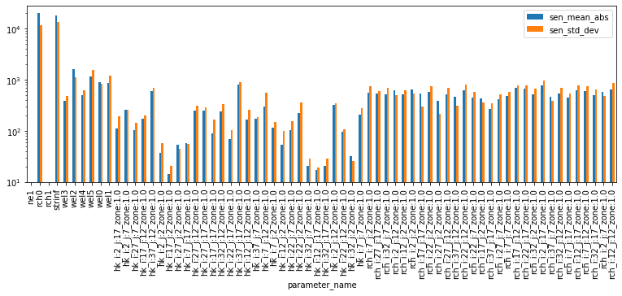
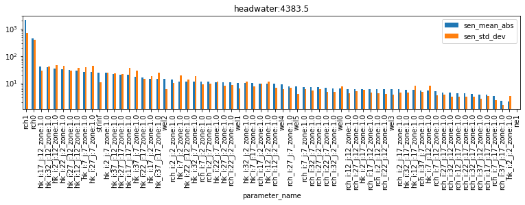
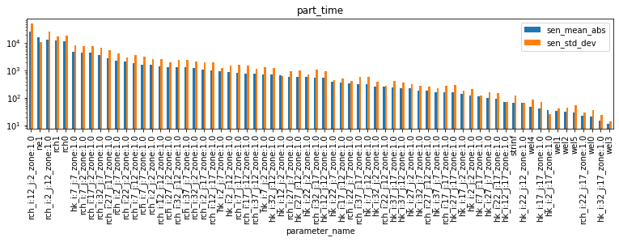

# Global Sensitivity Analysis (GSA)

Sensitivity methods we've looked at so far only evaluate the "local" sensitivity at a single set of parameter values.  For example, the Jacobian matrix represents perturbations to a single set of parameter values.  This local view can be a problem in cases when our inverse problem is nonlinear (i.e. most cases), which means the parameter sensitivities can change depending on what the parameter value is. 

### What if we looked at more than one set of parameter values?

In contrast, Global Sensitivity Analyses are statistical approaches that characterize how model parameters affect model outputs over a __wide range__ of acceptable parameter values. GSA aims for greater robustness and information provision than local sensitivity analysis based on partial derivatives of model outputs with respect to model parameters. Because local sensitivity analysis is limited to a single point in parameter space, the information it produces is frequently insufficient to support an understanding of the behaviour of nonlinear models whose outputs depend on complicated and parameter-value-dependent combinations of model parameters.

Some GSA methods provide general information about the variability of the sensitivities and have relatively low computational requirements, whereas others provide detailed information on nonlinear behavior and interactions between parameters at the expense of larger computational requirements. For a complete introduction to GSA theory and methods, see [Saltelli et al (2004)](http://www.andreasaltelli.eu/file/repository/SALTELLI_2004_Sensitivity_Analysis_in_Practice.pdf) and [Saltelli et al (2008)](https://onlinelibrary.wiley.com/doi/book/10.1002/9780470725184).


[Saltelli et al (2004)](http://www.andreasaltelli.eu/file/repository/SALTELLI_2004_Sensitivity_Analysis_in_Practice.pdf) provide an overview of the "settings" in which sensitivity analysis can be usefully employed. Of these, in an environmental modelling context the following are highlighted:

1. Identifying non-influencial parameters (also known as "screening") is usefull in the process of simplifying complex models (or parameterisation schemes). Non-influencial parameters are those that do not influence the model output of interest (whether it be a forecast or the measurment objective function). These are parameters which can be fixed at any given value, without signifincatly influencing the output of interest. If necessary, they can be omitted from model design or parameter estimation, in an effort to reduce computational burden.

2. Identifying parameters, and the interactions between parameters, which are important for a forecast of interest. This is perhaps one of the most common uses of sensitivity analysis. Assuming that all uncertain parameters are susceptible to determination (at the same cost per parameter). A sensitivity analysis can aid in idnetifying the parameter that is most deserving of better experimental measurement in order to reduce the forecast uncertainty the most.

3. Mapping parameter-to-output response. Often decision-support modelling is interested in avoiding an undesired outcome for some forecast of interest. Sensitivity analysis can be employed to assess which parameters (or parameter combinations) are most responsible for producing output in the region of interest. In other words, which parameter (and parameter values) are most likely to result in a "bad thing" happening? This can become usefull in a hypothesis-testing workflow.


## GSA with PEST++

[PEST++SEN](https://github.com/usgs/pestpp/blob/master/documentation/pestpp_users_manual.md#7-pestpp-sen) currently supports two GSA meth­ods. These are:

 - the __Method of Morris__ (Morris, 1991), with extensions proposed by Campolongo et al (2005), and
 - the __Method of Sobol__ (Sobol, 2001).

In this tutorial we'll focus on the __Method of Morris__ because it is computationally more efficient. But this efficiency comes with a tradeoff: the Method of Morris only provides estimates of the _mean_ and _variance_ of the sensitivity distribution for each parameter. Because of the lack of complete description of the parameter nonlinearity and interactions between parameters, the Method of Morris can be used as a _screening-level_ tool to identify the most important parameters for the observations tested. This screening can be followed by application of a more comprehensive tool, such as the Method of Sobol, which further characterizes the effects of parameter nonlinearity and inter-parameter interactions. 


### Method of Morris

As described in Saltelli et all (2004), the guiding philosophy of the Morris method is to determine which parameters may be considered to have effects which are (a) negligible, (b) linear and additive, or (c) non-linear or correlated with other parameters. The experimental plan proposed by Morris is composed of individually randomised 'one-at-a-time' experiments; the impact of changing one factor at a time is evaluated in turn. The Method of Morris is referred to as a “one-at-a-time” method because each parameter is perturbed sequentially to compute sensitivities - making it ideally suited for parallel computing. 

> Many parameters evaluated = lots of computer time. Luckily we can use [PEST++SEN](https://github.com/usgs/pestpp/blob/master/documentation/pestpp_users_manual.md#7-pestpp-sen) to run GSA in parallel. 

The method samples the sensitivity of a given parameter at several locations over the range of reasonable parameter space (__defined by the parameter bounds in the PEST Control file__) and then provides two measures of parameter sensitivity: the mean (__μ__) and the standard deviation (__σ__) of the resulting sensitivity distribution. The mean, __μ__, captures the overall effect of a parameter on the model output of interest; the standard deviation, __σ__, measures a parameter’s sensitivity across the range of acceptable parameter values, this being an indicator of how nonlinear a given parameter is and (or) how the parameter interacts with other parameters. It is important to note that the Method of Morris __cannot distinguish__ between parameter nonlinearity and parameter interactions because only the standard deviation of parameter sensitivity is available. 


## The Current Tutorial

In this notebook we will undertake GSA of the Freyberg model that employs pilot points as a parameterisation device. We will use the same model and PEST setup as in the "freyberg_1_local_sensitivty" tutorial ntoebook, and employ the Method of Morris.

### Admin

First the usual admin of preparing folders and constructing the model and PEST datasets.


```python
import sys
import os
import warnings
warnings.filterwarnings("ignore")
warnings.filterwarnings("ignore", category=DeprecationWarning) 

import pandas as pd
import numpy as np
import matplotlib.pyplot as plt;

import shutil

sys.path.insert(0,os.path.join("..", "..", "dependencies"))
import pyemu
import flopy
assert "dependencies" in flopy.__file__
assert "dependencies" in pyemu.__file__
sys.path.insert(0,"..")
import herebedragons as hbd

plt.rcParams['font.size'] = 10
pyemu.plot_utils.font =10
```


```python
# folder containing original model files
org_d = os.path.join('..', '..', 'models', 'monthly_model_files_1lyr_newstress')
# a dir to hold a copy of the org model files
working_dir = os.path.join('freyberg_mf6')
if os.path.exists(working_dir):
    shutil.rmtree(working_dir)
shutil.copytree(org_d,working_dir)
# get executables
hbd.prep_bins(working_dir)
# get dependency folders
hbd.prep_deps(working_dir)
# run our convenience functions to prepare the PEST and model folder
hbd.prep_pest(working_dir)
# convenience function that builds a new control file with pilot point parameters for hk
hbd.add_ppoints(working_dir)
```

    ins file for heads.csv prepared.
    ins file for sfr.csv prepared.
    noptmax:0, npar_adj:1, nnz_obs:24
    written pest control file: freyberg_mf6\freyberg.pst
       could not remove start_datetime
    1 pars added from template file .\freyberg6.sfr_perioddata_1.txt.tpl
    6 pars added from template file .\freyberg6.wel_stress_period_data_10.txt.tpl
    0 pars added from template file .\freyberg6.wel_stress_period_data_11.txt.tpl
    0 pars added from template file .\freyberg6.wel_stress_period_data_12.txt.tpl
    0 pars added from template file .\freyberg6.wel_stress_period_data_2.txt.tpl
    0 pars added from template file .\freyberg6.wel_stress_period_data_3.txt.tpl
    0 pars added from template file .\freyberg6.wel_stress_period_data_4.txt.tpl
    0 pars added from template file .\freyberg6.wel_stress_period_data_5.txt.tpl
    0 pars added from template file .\freyberg6.wel_stress_period_data_6.txt.tpl
    0 pars added from template file .\freyberg6.wel_stress_period_data_7.txt.tpl
    0 pars added from template file .\freyberg6.wel_stress_period_data_8.txt.tpl
    0 pars added from template file .\freyberg6.wel_stress_period_data_9.txt.tpl
    starting interp point loop for 800 points
    took 2.006187 seconds
    1 pars dropped from template file freyberg_mf6\freyberg6.npf_k_layer1.txt.tpl
    29 pars added from template file .\hkpp.dat.tpl
    starting interp point loop for 800 points
    took 2.01223 seconds
    29 pars added from template file .\rchpp.dat.tpl
    noptmax:0, npar_adj:65, nnz_obs:37
    new control file: 'freyberg_pp.pst'
    

### Load the `pst` control file

Let's double check what parameters we have in this version of the model using `pyemu` (you can just look in the PEST control file too.).

We have adjustable parameters that control SFR inflow rates, well pumping rates, hydraulic conductivity and recharge rates. Recall that by setting a parameter as "fixed" we are stating that we know it perfectly (should we though...?). Currently fixed parameters include porosity and future recharge.

For the sake of this tutorial, and as we did in the "local sensitivity" tutorial, let's set all the parameters free:


```python
pst_name = "freyberg_pp.pst"
# load the pst
pst = pyemu.Pst(os.path.join(working_dir,pst_name))
#update parameter data
par = pst.parameter_data
#update paramter transform
par.loc[:, 'partrans'] = 'log'
```


```python
# rewrite the contorl file!
pst.write(os.path.join(working_dir,pst_name))
```

    noptmax:0, npar_adj:68, nnz_obs:37
    

# Global Sensitivity

Unlike in the local sensitivty tutorial, we are no longer reliant on the exitence of a Jacobian matrix. 

However, to implement the Method of Morris we need to run the model a certain number of times for each adjustable parameter.   By default (no extra settings), PEST++SEN will run the Method of Morris with 4 discretization points for each parameter, plus the 4 new starting points from the intial conditions (4 runs). Effectively this will take 4 times as much computational time as calcualting a Jacobian matrix would. 

Fortunately, we can run it in parallel.

As usual, make sure to specify the number of agents to use. This value must be assigned according to the capacity of youmachine:


```python
num_workers = 6
```


```python
# the master directory
m_d='master_gsa'
```


```python
pyemu.os_utils.start_workers(working_dir, # the folder which contains the "template" PEST dataset
                            'pestpp-sen', #the PEST software version we want to run
                            pst_name, # the control file to use with PEST
                            num_workers=num_workers, #how many agents to deploy
                            worker_root='.', #where to deploy the agent directories; relative to where python is running
                            master_dir=m_d, #the manager directory
                            )
```

## GSA results

Let's look at a table and plot of the GSA results.  In this case we are looking at the mean sensitivity, and the standard deviation of the sensitivity as we change the starting value in the parameter space.  

> If the __mean sensitivity is high__ it shows that parameter has higher sensitivity across the parameter space.  

>If the __standard deviation is low__, then the linear assumptions of FOSM holds (that is, the sensitivity is the similar regardless of starting value).  

### Parameter Sensitvities

PES++SEN has written an output file with the extension `*.msn`. This file lists method of Morris outputs (μ, μ* and σ) for each adjustable parameter. The model-generated quantity for which these provide sensitivity measures is the objective function. 


```python
df = pd.read_csv(os.path.join(m_d,pst_name.replace(".pst",".msn")), index_col='parameter_name')
df.head()
```


<div>
<style scoped>
    .dataframe tbody tr th:only-of-type {
        vertical-align: middle;
    }

    .dataframe tbody tr th {
        vertical-align: top;
    }

    .dataframe thead th {
        text-align: right;
    }
</style>
<table border="1" class="dataframe">
  <thead>
    <tr style="text-align: right;">
      <th></th>
      <th>n_samples</th>
      <th>sen_mean</th>
      <th>sen_mean_abs</th>
      <th>sen_std_dev</th>
    </tr>
    <tr>
      <th>parameter_name</th>
      <th></th>
      <th></th>
      <th></th>
      <th></th>
    </tr>
  </thead>
  <tbody>
    <tr>
      <th>ne1</th>
      <td>4</td>
      <td>0.0000</td>
      <td>0.000</td>
      <td>0.000</td>
    </tr>
    <tr>
      <th>rch0</th>
      <td>4</td>
      <td>19922.5000</td>
      <td>19922.500</td>
      <td>11555.900</td>
    </tr>
    <tr>
      <th>rch1</th>
      <td>4</td>
      <td>0.0000</td>
      <td>0.000</td>
      <td>0.000</td>
    </tr>
    <tr>
      <th>strinf</th>
      <td>4</td>
      <td>-17888.8000</td>
      <td>17888.800</td>
      <td>13399.400</td>
    </tr>
    <tr>
      <th>wel3</th>
      <td>4</td>
      <td>63.5243</td>
      <td>390.783</td>
      <td>488.348</td>
    </tr>
  </tbody>
</table>
</div>


```python
df.loc[:,["sen_mean_abs","sen_std_dev"]].plot(kind="bar", figsize=(13,4))
plt.yscale('log');
```


    

    


Where mean absolute sensitivity ($μ*$) - blue bars - is large, shows that the parameter is sensitive across parameter space. The parameters `rch0` and `strinf` stand out. This is logical, as it is reasonable that they both have a singificant control on the systems' water budget (reminder: these parameters are global recharge and stream inflow rates). 

Other parameters which are notable are `ne1` (porosity) and `rch1` (recharge in the future). Sensitivities for these are non-existent. Is this reasoanble? In this case - yes. Why? Becasue we have no observations in the calibration dataset that inform these parameters. We have no measurments in the future which might provide information on rechareg (because it is the future..), and we have no measurments of transport or flow velocities which might infrm porosity.

This means that, from a ___parameter estimation___ perspective, these two parameter groups are not important. If we aare concerned with computational cost, we could potentialy omit them from parameter esitmation. However! These results tell us nothing about their importance from a forecast perspecitve. So we may still need to include them during uncertainty analysis.


The standard deviation ($σ$) - orange bars - is large everywhere. This is a sign that parameters are suffering from:

1. non-linearity and/or
2. correlation/interaction with other parameters

The Method of Morris cannot distinguish between the two! Recall from the local sensitivity tutorial that we saw many of these parameters were correlated - but not all!

So, if non-linearity is an issue - should we be using FOSM to undertake uncertainty analysis? Perhaps not, as it relies on the assumption of a linear relation between parameter and observation changes.

### Forecast Sensitivities

Decision-support modelling always brings us back to our forecasts. As discussed above, identifying parameters, and the interactions between parameters, which are important for a forecast of interest can  aid decision-support modelling design. 


PES++SEN has written an output file with the extension `*.mio`. This file records μ, μ* and σ for all model outputs (i.e., observations) featured in the “observation data” section of the PEST control file.

We can load it and inspect sensitivities for our forecast observations. The cell below produces bar-plots  displaying parameter μ* and σ for each forecast.


```python
df_pred_sen = pd.read_csv(os.path.join(m_d,pst_name.replace(".pst",".mio")),skipinitialspace=True)
for forecast in pst.forecast_names:
    tmp_df = df_pred_sen.loc[df_pred_sen.observation_name==forecast].sort_values(by='sen_mean_abs', ascending=False)
    tmp_df.plot(x="parameter_name",y=["sen_mean_abs","sen_std_dev"],kind="bar", figsize=(13,2.5))
    plt.title(forecast)
    plt.yscale('log');
```


    

    


    

    


    

    


    

    


As you can see, different forecasts are sensitive to different parameters. Note, for example, that the `part_time` (particle travel time) forecast is sensitive to `ne1` (porostity) parameters, however none of the other forecasts are. Almost all forecasts are sensitive to recharge (`rch0` and `rch1`), and so on. By ranking sensitivities in this fashion, we can identify which parameters to focus on to reduce forecast uncertainty. We can also identify parameters which can be omitted (or "simplified"), if they have little or no effect on the forecast of interest (e.g. porosity on the `headwater` forecast).

As we saw above for parameters, once again σ is very high (for almost all parameters...). This suggests either non-lienarity and/or parameter interactions. Relying on linear methods for uncertainty analysis is therefore compromised. Ideally we should employ non-linear methods, as will be discussed in the subsequent tutorial.
