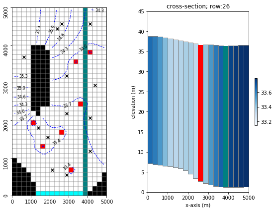
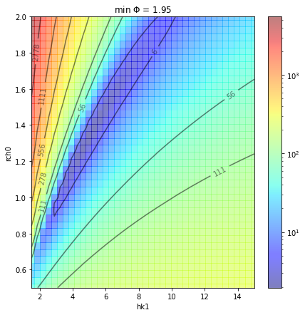
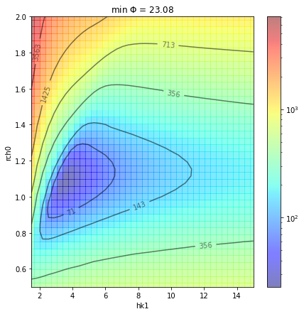
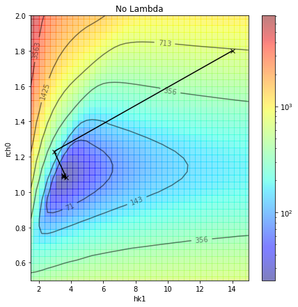
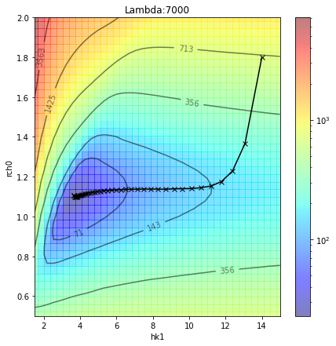
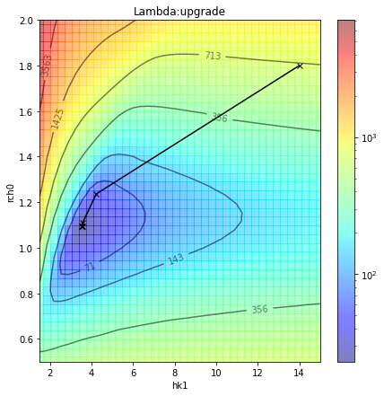

---
layout: default
title: GLM and the Objective Function Response Surface
parent: Introduction to Theory, Concepts and PEST Mechanic
nav_order: 6
---
                    ---
layout: default
title: GLM and the Objective Function Response Surface
parent: Introduction to Theory, Concepts and PEST Mechanic
nav_order: 6
math: mathjax3
---

# Gauss-Levenberg-Marquardt (GLM) algorithm

The Gauss-Levenberg-Marquart (GLM) method is a derivative-based method used to search the objective function surface for its minimum value. It assumes that simulated values of observation targets vary continuously in response to changes in calibration-adjusted model parameters. 

However, certain combinations of parameters can provide similar fits to calibration data (as we saw in the "freyberg k and r" tutorial, in which we attempt to calibrate a model with two correlated parameters). This phenomenon is refered to as non-uniqueness. For a two-parameter case, this can be visualized as a "valley" in the objective function surface. In such cases, there is no single "minimum" value for the objective function. 

Nevertheless, PEST(++) may obtain a solution to an ill-posed inverse problem and even fit the calibration dataset very well. This occurs due to the addition of the Marquardt lambda to the diagonal of the $X^{t}QX$ matrix and enables the achievement of a set of parameters which minimize the objective function. However, this parameter set will not be unique. Changing observation weights, initial parameter values, or a different Marquardt lambda selection strategy, may result in an entirely different set of parameters which also minimize the objective function.

In practice, this can be avoided by ensuring a well-posed inverse problem. In simple terms, this requires having a greater number of sources of calibration data than the number of adjustable parameters. As we saw in the "freyberg k, r and flux obsevrations" tutorial, one option is to include multiple types of observation data which inform different parameter types. (As we will see further on, regularisation provides another.)

In this tutorial we are going to visualize the "objective function surface" and how the parameter ugrade process moves across it. 

### Admin
We have provided some pre-cooked PEST dataset files, wraped around the modified Freyberg model. This is the same dataset introduced in the "freyberg_pest_setup" and "freyberg_k" notebooks. 

The functions in the next cell import required dependencies and prepare a folder for you. This folder contains the model files and a preliminary PEST setup. Run the cells, then inspect the new folder named "freyberg_k" which has been created in your tutorial directory. (Just press `shift+enter` to run the cells). 


```python
import sys
import os
import warnings
warnings.filterwarnings("ignore")
warnings.filterwarnings("ignore", category=DeprecationWarning) 

import pandas as pd
import numpy as np
import matplotlib.pyplot as plt;
import shutil

sys.path.insert(0,os.path.join("..", "..", "dependencies"))
import pyemu
import flopy
assert "dependencies" in flopy.__file__
assert "dependencies" in pyemu.__file__
sys.path.insert(0,"..")
import herebedragons as hbd
import response_surface as resurf

plt.rcParams['font.size'] = 10
pyemu.plot_utils.font =10
```

    D:\Workspace\hugm0001\github\GMDSI_notebooks_fork\tutorials\part1_6_glm_response_surface\response_surface.py:89: DeprecationWarning: invalid escape sequence \P
    


```python
# folder containing original model files
org_d = os.path.join('..', '..', 'models', 'monthly_model_files_1lyr_newstress')
# a dir to hold a copy of the org model files
tmp_d = os.path.join('freyberg_mf6')

runflag= True

if runflag==False:
    print('Assuming PEST++SWP has bene run already and the folder with files is available')
else:
    if os.path.exists(tmp_d):
        shutil.rmtree(tmp_d)
    shutil.copytree(org_d,tmp_d)
    # get executables
    hbd.prep_bins(tmp_d)
    # get dependency folders
    hbd.prep_deps(tmp_d)
    # run our convenience functions to prepare the PEST and model folder
    hbd.prep_pest(tmp_d)
```

    ins file for heads.csv prepared.
    ins file for sfr.csv prepared.
    noptmax:0, npar_adj:1, nnz_obs:24
    written pest control file: freyberg_mf6\freyberg.pst
    

### Reminder - the modified-Freyberg model
Just a quick reminder of what the model looks like and what we are doing. 

It is a one-layer model. A river runs north-south, represented with the SFR package (green cells in the figure). On the southern border there is a GHB (cyan cells). No-flow cells are shown in black. Pumping wells are shown with red cells. 

Time-series of measured heads are available at the locations marked with black X's. River flux is also measured at three locations (headwater, tailwater and gage; not displayed).

The simulation starts with a steady state stress period, followed by twelve transient stress periods. These represent the historic period, for which measured data are available.

A subsequent twelve transient stress periods representing a period in the future. Modelling is undertaken to assess selected forecasts during the simulated period.


```python
hbd.plot_freyberg(tmp_d)
```


    

    


### The PEST Control File

You may  wish to explore the `freyberg_mf6` folder which has been created in the tutorial directory. In it you will find a PEST control file named `freyberg.pst`.

Let's use `pyemu` to load the PEST control file and check some details. 


```python
pst = pyemu.Pst(os.path.join(tmp_d, 'freyberg.pst'))
pst.par_names
```


    ['hk1', 'ne1', 'rch0', 'rch1']


```python
par = pst.parameter_data
par
```


<div>
<style scoped>
    .dataframe tbody tr th:only-of-type {
        vertical-align: middle;
    }

    .dataframe tbody tr th {
        vertical-align: top;
    }

    .dataframe thead th {
        text-align: right;
    }
</style>
<table border="1" class="dataframe">
  <thead>
    <tr style="text-align: right;">
      <th></th>
      <th>parnme</th>
      <th>partrans</th>
      <th>parchglim</th>
      <th>parval1</th>
      <th>parlbnd</th>
      <th>parubnd</th>
      <th>pargp</th>
      <th>scale</th>
      <th>offset</th>
      <th>extra</th>
      <th>dercom</th>
    </tr>
    <tr>
      <th>parnme</th>
      <th></th>
      <th></th>
      <th></th>
      <th></th>
      <th></th>
      <th></th>
      <th></th>
      <th></th>
      <th></th>
      <th></th>
      <th></th>
    </tr>
  </thead>
  <tbody>
    <tr>
      <th>hk1</th>
      <td>hk1</td>
      <td>log</td>
      <td>factor</td>
      <td>5.00</td>
      <td>0.050</td>
      <td>500.00</td>
      <td>hk</td>
      <td>1.0</td>
      <td>0.0</td>
      <td>NaN</td>
      <td>1.0</td>
    </tr>
    <tr>
      <th>ne1</th>
      <td>ne1</td>
      <td>fixed</td>
      <td>factor</td>
      <td>0.01</td>
      <td>0.005</td>
      <td>0.02</td>
      <td>porosity</td>
      <td>1.0</td>
      <td>0.0</td>
      <td>NaN</td>
      <td>1.0</td>
    </tr>
    <tr>
      <th>rch0</th>
      <td>rch0</td>
      <td>fixed</td>
      <td>factor</td>
      <td>1.00</td>
      <td>0.500</td>
      <td>2.00</td>
      <td>rch0</td>
      <td>1.0</td>
      <td>0.0</td>
      <td>NaN</td>
      <td>1.0</td>
    </tr>
    <tr>
      <th>rch1</th>
      <td>rch1</td>
      <td>fixed</td>
      <td>factor</td>
      <td>1.00</td>
      <td>0.500</td>
      <td>2.00</td>
      <td>rch1</td>
      <td>1.0</td>
      <td>0.0</td>
      <td>NaN</td>
      <td>1.0</td>
    </tr>
  </tbody>
</table>
</div>


We shall explore the effect of having two adjustable parameters: `hk1` and `rch0`. As we saw previsouly, these two parameters are correlated. If we use only head observations for calibration we are unable to achive a unique solution. 

(We shall change `hk1` parameter bounds just to make visualization easier.)


```python
par.loc['rch0', 'partrans'] = 'log'
par.loc['hk1', 'parlbnd'] = 1.5
par.loc['hk1', 'parubnd'] = 15
```

Re-write the control file:


```python
pst.write(os.path.join(tmp_d, 'freyberg.pst'))
```

    noptmax:0, npar_adj:2, nnz_obs:24
    

The `response_surface.py` file in the tutorial folder contains a few functions to run PEST++SWP and make plots. These run PEST++SWP a few hundred times for a combination of `hk1` and `rch0` values.


```python
if runflag==False:
    print('Assuming PEST++SWP has bene run already and the folder with files is available')
else:
    resurf.run_respsurf(par_names=['hk1','rch0'])
```

    noptmax:0, npar_adj:2, nnz_obs:24
    

Make a plot of the response surface for `hk1` (x-axis) and `rch0` (y-axis). The colored contours indicate the objective function value for each combination of these two parameters. 

As you can see, a long eliptical "valley" of optimal values is formed (grey zone). Parameter combinations in this zone all result in equivlent levels of "good fit".


```python
fig, ax, resp_surf = resurf.plot_response_surface(cmap='jet', figsize=(7,7)) #maxresp=1e3,
```


    

    


### Add Flux Observations

As we did in the "freyberg k, r and flux obs" tutorial, we know add a second set of observation data. These are measurments of stream flow. We now have observations of head and observations of stream flow


```python
pst = pyemu.Pst(os.path.join(tmp_d, 'freyberg.pst'))
```


```python
# set weights to gage-1 observations during calibratin period
obs = pst.observation_data
obs_times = obs.loc[~obs['gage-1'].isnull(), 'gage-1'].astype(float).values
calib_times = [str(i) for i in obs_times if i<4018.5]
obs.loc[obs['gage-1'].isin(calib_times), 'weight'] = 0.003
```

Re-write the ocntrol file.


```python
pst.write(os.path.join(tmp_d, 'freyberg.pst'))
```

    noptmax:0, npar_adj:2, nnz_obs:36
    

Run PEST++SWP again to recalcualte the response surface.


```python
if runflag==False:
    print('Assuming PEST++SWP has been run already and the folder with files is available')
else:
    resurf.run_respsurf(par_names=['hk1','rch0'])
```

    noptmax:0, npar_adj:2, nnz_obs:36
    

And plot it up again. Now we see the objective function surface funneling down to a single point. We have achieved a unique solution.


```python
fig, ax, resp_surf = resurf.plot_response_surface(cmap='jet', figsize=(7,7)) #maxresp=1e3,
```


    

    


# Understanding Lambda's

When used to undertake highly parameterized inversion, PESTPP-GLM implements theory and methodologies that are programmed into PEST. However, many implementation details have been improved. In order to explain these details, it is necessary to present some theory. This theory employs matrices and vectors. These are used to describe the linearized inverse problem on which so-called “gradient methods” are based. Through repeated linearization of the inverse problem over successive iterations, these methods achieve their purpose of model calibration, notwithstanding the nonlinear relationship that exists between model outputs and model parameters. 

Nonlinear model behaviour is also accommodated by introducing a so-called "Marquardt lambda" to these equations. Employing a nonzero lambda tweaks the direction of parameter improvement so that it is more aligned with the objective function gradient. This increases the efficiency of early iterations of the inversion process when implemented in conjunction with a nonlinear model.

If Lambdas are high, then the parameter estimation process updates parameter values accodring to the objective function gradient. If they are small (or zero), parameter upgrades receive a greater influence from the $J^{t}QJ$ matrix. 

Highy non-linear problems, in particular, benefit from high lambdas at the start of the parameter estimation process. This accomodates non-elipticity of the objective function surface, avoiding sending the parameter estimation process in the "wrong direction" and wasting computation time. 

However, as the objective function minimum is approached, the process becomes more eficient if smaller lambdas are used. This avoids the phenomenon known as "hemstictching", in which parameter upgrades jump-across small, thin "valleys" in the objective function surface. 

See the PEST Book (Doherty, 2015) for more details.


### No Lambda

Let's visualize the effect of lambda values on the upgrade process. First, with no lambda added to the parameter upgrade equations.


```python
# turn off the Maquardt lambda
pst.pestpp_options['lambdas']=0.0
pst.pestpp_options['lambda_scale_fac']=1.0
pst.pestpp_options['upgrade_augment']='False'
```

Initial parameter values specify where the parameter estimation process "starts":


```python
# to make a more compeling plot
pst.parameter_data.loc['hk1', 'parval1'] = 14
pst.parameter_data.loc['rch0', 'parval1'] = 1.8
```

Write and run:


```python
pst.control_data.noptmax=250
pst.write(os.path.join(tmp_d, 'freyberg.nolam.pst'))

if runflag==True:
    pyemu.os_utils.run('pestpp-glm freyberg.nolam.pst', cwd=tmp_d)
```

    noptmax:250, npar_adj:2, nnz_obs:36
    

Plot the response surface:


```python
fig, ax, resp_surf = resurf.plot_response_surface(cmap='jet', figsize=(7,7)) #maxresp=1e3,
pars, obfun = resurf.add_trajectory_to_plot(fig, ax, 'No Lambda', pst_name='freyberg.nolam.pst')
```


    

    


### Moderate Lambda


```python
# turn off the Maquardt lambda
pst.pestpp_options['lambdas']=700.0
pst.pestpp_options['lambda_scale_fac']=1.0
pst.pestpp_options['upgrade_augment']='False'

pst.write(os.path.join(tmp_d, 'freyberg.lam700.pst'))
if runflag==True:
    pyemu.os_utils.run('pestpp-glm freyberg.lam700.pst', cwd=tmp_d)
```

    noptmax:250, npar_adj:2, nnz_obs:36
    


```python
fig, ax, resp_surf = resurf.plot_response_surface(cmap='jet', figsize=(7,7)) #maxresp=1e3,
pars, obfun = resurf.add_trajectory_to_plot(fig, ax, 'Lambda:700', pst_name='freyberg.lam700.pst')
```


    

    


### Large Lambda


```python
# turn off the Maquardt lambda
pst.pestpp_options['lambdas']=7000.0
pst.pestpp_options['lambda_scale_fac']=1.0
pst.pestpp_options['upgrade_augment']='False'

pst.write(os.path.join(tmp_d, 'freyberg.lam7000.pst'))
if runflag==True:
    pyemu.os_utils.run('pestpp-glm freyberg.lam7000.pst', cwd=tmp_d)
```

    noptmax:250, npar_adj:2, nnz_obs:36
    


```python
fig, ax, resp_surf = resurf.plot_response_surface(cmap='jet', figsize=(7,7)) #maxresp=1e3,
pars, obfun = resurf.add_trajectory_to_plot(fig, ax, 'Lambda:7000', pst_name='freyberg.lam7000.pst')
```


    

    


### Normal PEST(++) Behaviour

In practice, PEST and PEST++ can search for the optimum parameter upgrade vector at each iteartion. PEST(++) calculates upgrade vectors, each based on a different value of lambda. The one which results in the larges objective function decrease is used to calculate parameters for the next iteration. 


```python
# turn off the Maquardt lambda
pst.pestpp_options['lambdas']= [0.1, 1, 10,100]
pst.pestpp_options['lambda_scale_fac']=[0.9, 0.8, 0.7, 0.5]
pst.pestpp_options['upgrade_augment']='True'

pst.write(os.path.join(tmp_d, 'freyberg.pst'))
if runflag==True:
    pyemu.os_utils.run('pestpp-glm freyberg.pst', cwd=tmp_d)
```

    noptmax:250, npar_adj:2, nnz_obs:36
    


```python
fig, ax, resp_surf = resurf.plot_response_surface(cmap='jet', figsize=(7,7)) #maxresp=1e3,
pars, obfun = resurf.add_trajectory_to_plot(fig, ax, 'Lambda:upgrade', pst_name='freyberg.pst')
```


    

    

