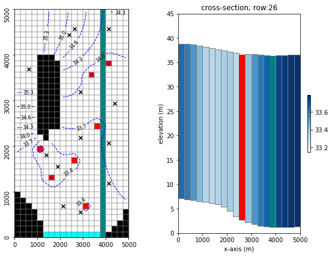
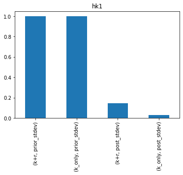
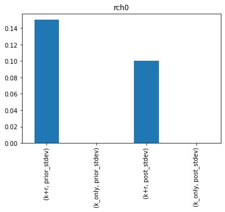
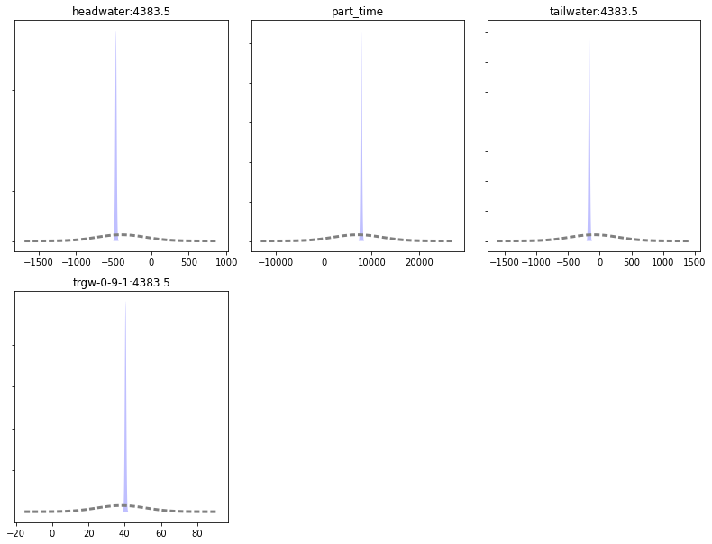
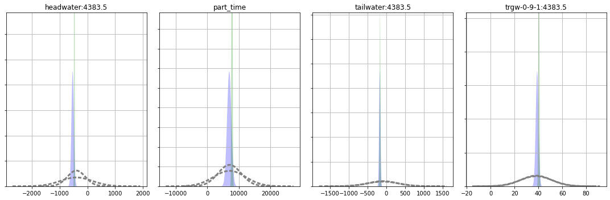
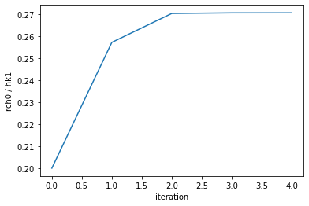
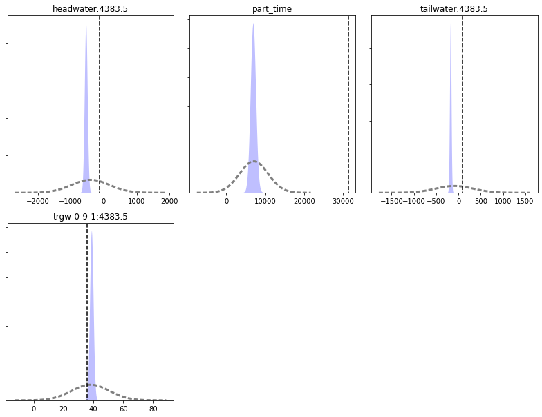

# History Match Freyberg using K and Recharge

This notebook continues where the `freyberg_k.ipynb` notebook left off. In the previous notebook we calibrated the Freyberg model by adjusting a single parameter - `K`. We were able to obtain excelent fits with measured heads, and _aparently_ forecast uncertainties were very very low. This was of course __wrong__, as we will see over the course of the next few tutorials.

In this tutorial we introduce the concepts of non-uniqueness and parameter correlation. We will repeat the same calibration and uncertainty analysis but with two adjustable parameters - hydraulic conductivity (`K`) and recharge (`rch0`). 

In the previous tutorial, recharge parameters were fixed. Remember that when a parameter is fixed (e.g. not adjustable during calibration or uncertainty analysis), this implies that it is perfectly known. Rarely, if ever, is a parameter value perfectly known. Recharge in particular. Recharge is hard ot measure int he field and diffcult to upscale to a model domain. It is never perfectly known and should be included in the parameter estimation process. Let's get to it.

### Admin
We have provided some pre-cooked PEST dataset files, wraped around the modified Freyberg model. This is the same dataset introduced in the "freyberg_pest_setup" and "freyberg_k" notebooks. 

The functions in the next cell import required dependencies and prepare a folder for you. This folder contains the model files and a preliminary PEST setup. Run the cells, then inspect the new folder named "freyberg_k" which has been created in your tutorial directory. (Just press `shift+enter` to run the cells). 


```python
import sys
import os
import warnings
warnings.filterwarnings("ignore")
warnings.filterwarnings("ignore", category=DeprecationWarning) 

import pandas as pd
import numpy as np
import matplotlib.pyplot as plt;
import shutil

sys.path.insert(0,os.path.join("..", "..", "dependencies"))
import pyemu
import flopy
assert "dependencies" in flopy.__file__
assert "dependencies" in pyemu.__file__
sys.path.insert(0,"..")
import herebedragons as hbd

plt.rcParams['font.size'] = 10
pyemu.plot_utils.font =10
```


```python
# folder containing original model files
org_d = os.path.join('..', '..', 'models', 'monthly_model_files_1lyr_newstress')
# a dir to hold a copy of the org model files
tmp_d = os.path.join('freyberg_mf6')
if os.path.exists(tmp_d):
    shutil.rmtree(tmp_d)
shutil.copytree(org_d,tmp_d)
# get executables
hbd.prep_bins(tmp_d)
# get dependency folders
hbd.prep_deps(tmp_d)
# run our convenience functions to prepare the PEST and model folder
hbd.prep_pest(tmp_d)
```

    ins file for heads.csv prepared.
    ins file for sfr.csv prepared.
    noptmax:0, npar_adj:1, nnz_obs:24
    written pest control file: freyberg_mf6\freyberg.pst
    


    <pyemu.pst.pst_handler.Pst at 0x167fe946ac0>


### Reminder - the modified-Freyberg model
Just a quick reminder of what the model looks like and what we are doing. 

It is a one-layer model. A river runs north-south, represented with the SFR package (green cells in the figure). On the southern border there is a GHB (cyan cells). No-flow cells are shown in black. Pumping wells are shown with red cells. 

Time-series of measured heads are available at the locations marked with black X's. River flux is also measured at three locations (headwater, tailwater and gage; not displayed).

The simulation starts with a steady state stress period, followed by twelve transient stress periods. These represent the historic period, for which measured data are available.

A subsequent twelve transient stress periods representing a period in the future. Modelling is undertaken to assess selected forecasts during the simulated period.


```python
hbd.plot_freyberg(tmp_d)
```


    

    


### The PEST Control File

You may  wish to explore the `freyberg_mf6` folder which has been created in the tutorial directory. In it you will find a PEST control file named `freyberg.pst`.

Let's use `pyemu` to load the PEST control file and check some details. 


```python
pst = pyemu.Pst(os.path.join(tmp_d, 'freyberg.pst'))
```

Let's check what parameters are listed in the control file:


```python
pst.par_names
```


    ['hk1', 'ne1', 'rch0', 'rch1']


Which of these are adjustable?


```python
pst.adj_par_names
```


    ['hk1']


So only `hk1` is adjustable. We want to make `rch0` adjustable as well. (`rch0` is a factor by which mean historical recharge is multiplied.)

We can do so by chaging the parameter transfrom in the `parameter data` section of the onctrol file:


```python
par = pst.parameter_data
par.head()
```


<div>
<style scoped>
    .dataframe tbody tr th:only-of-type {
        vertical-align: middle;
    }

    .dataframe tbody tr th {
        vertical-align: top;
    }

    .dataframe thead th {
        text-align: right;
    }
</style>
<table border="1" class="dataframe">
  <thead>
    <tr style="text-align: right;">
      <th></th>
      <th>parnme</th>
      <th>partrans</th>
      <th>parchglim</th>
      <th>parval1</th>
      <th>parlbnd</th>
      <th>parubnd</th>
      <th>pargp</th>
      <th>scale</th>
      <th>offset</th>
      <th>extra</th>
      <th>dercom</th>
    </tr>
    <tr>
      <th>parnme</th>
      <th></th>
      <th></th>
      <th></th>
      <th></th>
      <th></th>
      <th></th>
      <th></th>
      <th></th>
      <th></th>
      <th></th>
      <th></th>
    </tr>
  </thead>
  <tbody>
    <tr>
      <th>hk1</th>
      <td>hk1</td>
      <td>log</td>
      <td>factor</td>
      <td>5.00</td>
      <td>0.050</td>
      <td>500.00</td>
      <td>hk</td>
      <td>1.0</td>
      <td>0.0</td>
      <td>NaN</td>
      <td>1.0</td>
    </tr>
    <tr>
      <th>ne1</th>
      <td>ne1</td>
      <td>fixed</td>
      <td>factor</td>
      <td>0.01</td>
      <td>0.005</td>
      <td>0.02</td>
      <td>porosity</td>
      <td>1.0</td>
      <td>0.0</td>
      <td>NaN</td>
      <td>1.0</td>
    </tr>
    <tr>
      <th>rch0</th>
      <td>rch0</td>
      <td>fixed</td>
      <td>factor</td>
      <td>1.00</td>
      <td>0.500</td>
      <td>2.00</td>
      <td>rch0</td>
      <td>1.0</td>
      <td>0.0</td>
      <td>NaN</td>
      <td>1.0</td>
    </tr>
    <tr>
      <th>rch1</th>
      <td>rch1</td>
      <td>fixed</td>
      <td>factor</td>
      <td>1.00</td>
      <td>0.500</td>
      <td>2.00</td>
      <td>rch1</td>
      <td>1.0</td>
      <td>0.0</td>
      <td>NaN</td>
      <td>1.0</td>
    </tr>
  </tbody>
</table>
</div>


Change `partrans` of the `rch0` parameter to `log`:


```python
par.loc['rch0', 'partrans'] = 'log'
par.head()
```


<div>
<style scoped>
    .dataframe tbody tr th:only-of-type {
        vertical-align: middle;
    }

    .dataframe tbody tr th {
        vertical-align: top;
    }

    .dataframe thead th {
        text-align: right;
    }
</style>
<table border="1" class="dataframe">
  <thead>
    <tr style="text-align: right;">
      <th></th>
      <th>parnme</th>
      <th>partrans</th>
      <th>parchglim</th>
      <th>parval1</th>
      <th>parlbnd</th>
      <th>parubnd</th>
      <th>pargp</th>
      <th>scale</th>
      <th>offset</th>
      <th>extra</th>
      <th>dercom</th>
    </tr>
    <tr>
      <th>parnme</th>
      <th></th>
      <th></th>
      <th></th>
      <th></th>
      <th></th>
      <th></th>
      <th></th>
      <th></th>
      <th></th>
      <th></th>
      <th></th>
    </tr>
  </thead>
  <tbody>
    <tr>
      <th>hk1</th>
      <td>hk1</td>
      <td>log</td>
      <td>factor</td>
      <td>5.00</td>
      <td>0.050</td>
      <td>500.00</td>
      <td>hk</td>
      <td>1.0</td>
      <td>0.0</td>
      <td>NaN</td>
      <td>1.0</td>
    </tr>
    <tr>
      <th>ne1</th>
      <td>ne1</td>
      <td>fixed</td>
      <td>factor</td>
      <td>0.01</td>
      <td>0.005</td>
      <td>0.02</td>
      <td>porosity</td>
      <td>1.0</td>
      <td>0.0</td>
      <td>NaN</td>
      <td>1.0</td>
    </tr>
    <tr>
      <th>rch0</th>
      <td>rch0</td>
      <td>log</td>
      <td>factor</td>
      <td>1.00</td>
      <td>0.500</td>
      <td>2.00</td>
      <td>rch0</td>
      <td>1.0</td>
      <td>0.0</td>
      <td>NaN</td>
      <td>1.0</td>
    </tr>
    <tr>
      <th>rch1</th>
      <td>rch1</td>
      <td>fixed</td>
      <td>factor</td>
      <td>1.00</td>
      <td>0.500</td>
      <td>2.00</td>
      <td>rch1</td>
      <td>1.0</td>
      <td>0.0</td>
      <td>NaN</td>
      <td>1.0</td>
    </tr>
  </tbody>
</table>
</div>


We can now re-write the control file with the updated parameter data section:


```python
pst.write(os.path.join(tmp_d, 'freyberg_k_r.pst'))
```

    noptmax:0, npar_adj:2, nnz_obs:24
    

Run PEST once, to check everything is copacetic:


```python
pyemu.os_utils.run("pestpp-glm freyberg_k_r.pst",cwd=tmp_d)
```

Let's just check that it worked by loading the control file again and checking results:


```python
pst = pyemu.Pst(os.path.join(tmp_d, 'freyberg_k_r.pst'))
assert pst.phi, "Something ain't right cap'n"
pst.phi
```


    29.203134704019217


Awesome, good to go. We can set `NOPTMAX` to 20 and let PEST loose. We are actualy going to do this twice. Once with `K` and `rch0` adjustable ( `freyberg_k_r.pst` ) and once with only `k` adjustable (`freyberg_k.pst`). The latter is a repeat of the previous tutorial. We will do it again just so that we can compare outcomes.


```python
pst.control_data.noptmax = 20
pst.write(os.path.join(tmp_d, 'freyberg_k_r.pst'))
```

    noptmax:20, npar_adj:2, nnz_obs:24
    


```python
pst = pyemu.Pst(os.path.join(tmp_d, 'freyberg.pst'))
pst.control_data.noptmax = 20
pst.write(os.path.join(tmp_d, 'freyberg_k.pst'))
```

    noptmax:20, npar_adj:1, nnz_obs:24
    

### Run PEST

Okay, let's run this thing. 

Because we call a program from within the Jupyter Notebook you have to look at the terminal window that you used to start the notebook to see the screen report of the run.  So, when executing this next block look at your terminal window to see the run.  It will say "Simulation complete..." when finished.

> Note: And/or wait until the standard out reports a "0" below this next block (=when the run is finished) before going on.


```python
# use pyemu to run a command line, run pestpp on the pst file defined on the import
pyemu.os_utils.run("pestpp-glm freyberg_k.pst", cwd=tmp_d)
```


```python
# use pyemu to run a command line, run pestpp on the pst file defined on the import
pyemu.os_utils.run("pestpp-glm freyberg_k_r.pst", cwd=tmp_d)
```

## Explore Results

PEST writes lots of usefull information to the `*.rec` file. It also outputs a series of other useful files. What outputs are recorded depends on which version of PEST or PEST++ is being used. Here we will use PEST++GLM. The following section will demonstrate usefull information that can be found in some of the outputs. Throughout subsequent tutorials we will address others.

### Objective Function
First let's look at the measurement objective function (Phi), which is calculated using the sum of squared weighted residuals.  First we'll look at a table, then plots.


```python
# make a dataframe "df_obj" that shows the contents of the pst file casename with the extension .iobj
# .iobj = PEST++ output file that has the objective function by iteration 
df_obj_k = pd.read_csv(os.path.join(tmp_d, "freyberg_k.iobj"),index_col=0)
df_obj_k_r = pd.read_csv(os.path.join(tmp_d, "freyberg_k_r.iobj"),index_col=0)
```

Let's compare the proress in Phi for both cases:


```python
# plot out the dataframe that was shown as a table above
plt.rcParams["font.size"] = 10

fig, ax = plt.subplots()
df_obj_k.loc[:,["total_phi","model_runs_completed"]].plot(y='total_phi', ax=ax, label='k')
df_obj_k_r.loc[:,["total_phi","model_runs_completed"]].plot(y='total_phi', ax=ax, label='k+r');
```


    

    


Looks like giving PEST more "flexibility" (i.e. more parmaters) allows it to get a better fit with measured data. (the Phi obtained by `k+r` is lower).

### What about the parameter uncertainties? 

Read in the parameter uncertainty `*.csv` files which PEST++GLM wrote:


```python
df_paru_k = pd.read_csv(os.path.join(tmp_d, "freyberg_k.par.usum.csv"),index_col=0)
df_paru_k
```


<div>
<style scoped>
    .dataframe tbody tr th:only-of-type {
        vertical-align: middle;
    }

    .dataframe tbody tr th {
        vertical-align: top;
    }

    .dataframe thead th {
        text-align: right;
    }
</style>
<table border="1" class="dataframe">
  <thead>
    <tr style="text-align: right;">
      <th></th>
      <th>prior_mean</th>
      <th>prior_stdev</th>
      <th>prior_lower_bound</th>
      <th>prior_upper_bound</th>
      <th>post_mean</th>
      <th>post_stdev</th>
      <th>post_lower_bound</th>
      <th>post_upper_bound</th>
    </tr>
    <tr>
      <th>name</th>
      <th></th>
      <th></th>
      <th></th>
      <th></th>
      <th></th>
      <th></th>
      <th></th>
      <th></th>
    </tr>
  </thead>
  <tbody>
    <tr>
      <th>hk1</th>
      <td>0.69897</td>
      <td>1</td>
      <td>-1.30103</td>
      <td>2.69897</td>
      <td>0.505884</td>
      <td>0.029466</td>
      <td>0.446952</td>
      <td>0.564816</td>
    </tr>
  </tbody>
</table>
</div>


```python
df_paru_k_r = pd.read_csv(os.path.join(tmp_d, "freyberg_k_r.par.usum.csv"),index_col=0)
df_paru_k_r
```


<div>
<style scoped>
    .dataframe tbody tr th:only-of-type {
        vertical-align: middle;
    }

    .dataframe tbody tr th {
        vertical-align: top;
    }

    .dataframe thead th {
        text-align: right;
    }
</style>
<table border="1" class="dataframe">
  <thead>
    <tr style="text-align: right;">
      <th></th>
      <th>prior_mean</th>
      <th>prior_stdev</th>
      <th>prior_lower_bound</th>
      <th>prior_upper_bound</th>
      <th>post_mean</th>
      <th>post_stdev</th>
      <th>post_lower_bound</th>
      <th>post_upper_bound</th>
    </tr>
    <tr>
      <th>name</th>
      <th></th>
      <th></th>
      <th></th>
      <th></th>
      <th></th>
      <th></th>
      <th></th>
      <th></th>
    </tr>
  </thead>
  <tbody>
    <tr>
      <th>hk1</th>
      <td>0.69897</td>
      <td>1.000000</td>
      <td>-1.30103</td>
      <td>2.69897</td>
      <td>0.688363</td>
      <td>0.144337</td>
      <td>0.399689</td>
      <td>0.977037</td>
    </tr>
    <tr>
      <th>rch0</th>
      <td>0.00000</td>
      <td>0.150515</td>
      <td>-0.30103</td>
      <td>0.30103</td>
      <td>0.120730</td>
      <td>0.100419</td>
      <td>-0.080109</td>
      <td>0.321568</td>
    </tr>
  </tbody>
</table>
</div>


Hmm - Recharge prior uncertainty = 0.00000?  No, it's not 0.0 - recall that when we log-transformed this parameter, so its uncertainty is reported as logarithms.  So, 10^0 = 1, which is what we see for an initial value in the PEST control file. 

How does the uncertainty reduction for `hk1` change when `rch0` is included? Its easier to see if we plot them. Here's the posterior and prior standard deviation for the new K+R (left) next the to K only results (right):


```python
df_paru_concat = pd.concat([df_paru_k_r,df_paru_k],join="outer",axis=1,keys=["k+r","k_only"])
df_paru_concat.sort_index(inplace=True,axis=1)
for pname in df_paru_concat.index:
    ax = df_paru_concat.loc[pname,(slice(None),("prior_stdev","post_stdev"))].plot(kind="bar")
    ax.set_title(pname)
    plt.show()
```


    

    


    

    


Damn...so `hk1` uncertainty increases if we include `rch0`.  

## Forecasts
Let's look at the forecast uncertainties. First for the singe parameter, `k` case. 
Sweet - nice and tight 


```python
df_predu_k = pd.read_csv(os.path.join(tmp_d, "freyberg_k.pred.usum.csv"),index_col=0)
df_predu_k.loc[:,"reduction"] = 100.0 *  (1.0 - (df_predu_k.post_stdev / df_predu_k.prior_stdev))

figs, axes = pyemu.plot_utils.plot_summary_distributions(df_predu_k,subplots=True)
figs[0].tight_layout()
```


    

    


And now for the 2 parameter case (`k+r`). Let's compare it to the `k`-only run (shown in green in the plot below). Some forecast uncertainties have increased (the distribution is shorter and wider).


```python
df_predu_k_r = pd.read_csv(os.path.join(tmp_d, "freyberg_k_r.pred.usum.csv"),index_col=0)
df_predu_k_r.loc[:,"reduction"] = 100.0 *  (1.0 - (df_predu_k_r.post_stdev / df_predu_k_r.prior_stdev))

i=1
fig = plt.figure(figsize=(15,5))
for forecast in df_predu_k_r.index:
    ax = fig.add_subplot(1,4,i)
    i+=1
    pyemu.plot_utils.plot_summary_distributions(df_predu_k_r.loc[[forecast],:],ax=ax)
    pyemu.plot_utils.plot_summary_distributions(df_predu_k.loc[[forecast],:],ax=ax,pt_color='g')
    ax.set_title(forecast)
    ax.grid()
fig.tight_layout()
```


    

    


So...which forecasts are influenced by the ``rch_0`` parameter? The higher and narrower the peak the more certain we are - did the uncertainty decrease or increase when we added the second parameter?

Which forecasts had little change? Why do you think that is?

And which case (``K`` or ``K+R``) provides the more robust uncertainty estimate?

## Hold up!

Look at this slightly modified version of the groundwater governing equation from Anderson et al. (2015) below.  Is this problem well posed? That is, if recharge increased (represented by an increase in $W^*$) *and* at the same time K increased (represented by an increase in q) could they offset each other so that the righthand side stays the same? What is this called? Yeah, that's right: non-uniqueness.

 
  
 
 
 Recall the Bravo et al. (2002) trough when calibrating K and R with only heads:
 
  
  


### Let's look at the correlation of our two parameters

In the next cell we will use `pyemu.Schur` object. (See the "intro to pyemu" and "intro to FOSM" tutorials for more details.)


```python
sc = pyemu.Schur(os.path.join(tmp_d, "freyberg_k_r.jcb"))
cov = pyemu.Cov(sc.xtqx.x, names=sc.pst.adj_par_names)
R = cov.to_pearson()
R.df()
```


<div>
<style scoped>
    .dataframe tbody tr th:only-of-type {
        vertical-align: middle;
    }

    .dataframe tbody tr th {
        vertical-align: top;
    }

    .dataframe thead th {
        text-align: right;
    }
</style>
<table border="1" class="dataframe">
  <thead>
    <tr style="text-align: right;">
      <th></th>
      <th>hk1</th>
      <th>rch0</th>
    </tr>
  </thead>
  <tbody>
    <tr>
      <th>hk1</th>
      <td>1.000000</td>
      <td>-0.987643</td>
    </tr>
    <tr>
      <th>rch0</th>
      <td>-0.987643</td>
      <td>1.000000</td>
    </tr>
  </tbody>
</table>
</div>


Wow - correlated.  Recall that Hill and Tiedeman (2007) suggest that correlation > 0.95 or so is not estimable. Even though estimating both R and K using only head observations is not possible because of this correlation, PEST++ gave you an answer.  

So how did PEST++ deal with this intractable correlation? Let's check how paramter values changed throught the PEST run. Parameter values per iteration are recorded in the `freyberg_k_r.ipar` file.


```python
ipar = pd.read_csv(os.path.join(tmp_d, 'freyberg_k_r.ipar'))
ipar
```


<div>
<style scoped>
    .dataframe tbody tr th:only-of-type {
        vertical-align: middle;
    }

    .dataframe tbody tr th {
        vertical-align: top;
    }

    .dataframe thead th {
        text-align: right;
    }
</style>
<table border="1" class="dataframe">
  <thead>
    <tr style="text-align: right;">
      <th></th>
      <th>iteration</th>
      <th>hk1</th>
      <th>ne1</th>
      <th>rch0</th>
      <th>rch1</th>
    </tr>
  </thead>
  <tbody>
    <tr>
      <th>0</th>
      <td>0</td>
      <td>5.00000</td>
      <td>0.01</td>
      <td>1.00000</td>
      <td>1</td>
    </tr>
    <tr>
      <th>1</th>
      <td>1</td>
      <td>5.05697</td>
      <td>0.01</td>
      <td>1.30061</td>
      <td>1</td>
    </tr>
    <tr>
      <th>2</th>
      <td>2</td>
      <td>4.94950</td>
      <td>0.01</td>
      <td>1.33807</td>
      <td>1</td>
    </tr>
    <tr>
      <th>3</th>
      <td>3</td>
      <td>4.87936</td>
      <td>0.01</td>
      <td>1.32047</td>
      <td>1</td>
    </tr>
    <tr>
      <th>4</th>
      <td>4</td>
      <td>4.89034</td>
      <td>0.01</td>
      <td>1.32352</td>
      <td>1</td>
    </tr>
  </tbody>
</table>
</div>


Let's check the ratio of `hk1` to `rch0`:


```python
ipar.loc[:, 'ratio'] = ipar.rch0 / ipar.hk1
ipar.ratio.plot()
plt.ylabel('rch0 / hk1')
plt.xlabel('iteration');
```


    

    


So PEST++ found a combination of `hk1` and `rch0` that provide an "optimal" fit. It then continues to test changes in parameter values; however, it retains the ratio between these correlated parameters. As this results in no improvement of Phi, PEST halts operation (in this case afetr 3 iterations of no improvement).

Effectively, PEST has detemrined the optimal ratio of these two parameters. But not necessarily their "correct" absolute values.

## Last point

Do you believe that the forecast values are optimal, or even defensible?  Should we believe the forecast uncertainty either? Let's again look at the forecasts with the "Truth" (dashed black lines in the plot below).


```python
figs, axes = pyemu.plot_utils.plot_summary_distributions(df_predu_k_r,subplots=True)
for ax in axes:
    fname = ax.get_title().lower()
    ylim = ax.get_ylim()
    v = pst.observation_data.loc[fname,"obsval"]
    ax.plot([v,v],ylim,"k--")
    ax.set_ylim(0, ylim[-1])
figs[0].tight_layout()
```


    

    


Yikes - very much missing the truth. Uncertainty analysis is still 
## #failing!
