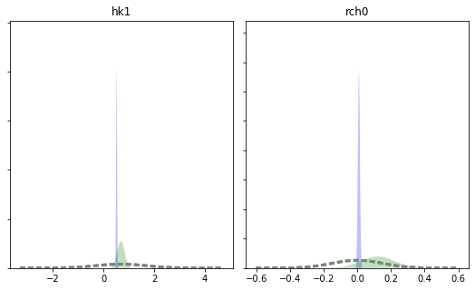
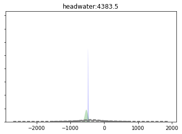
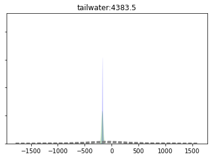
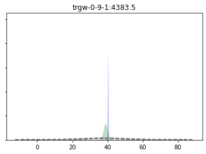
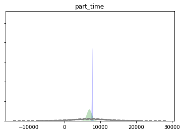
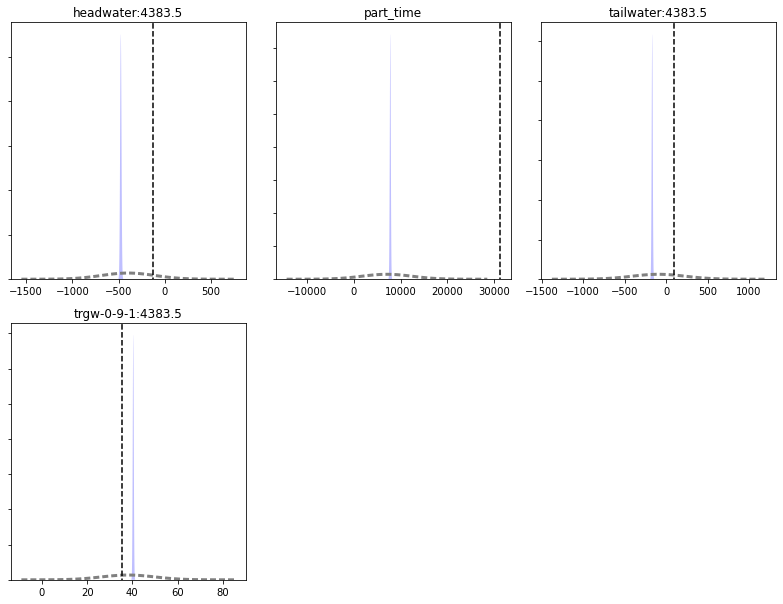
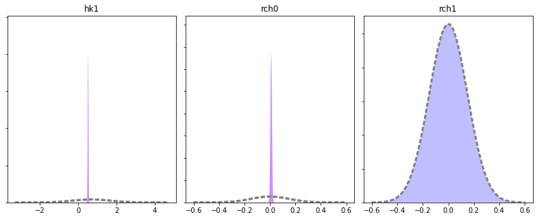
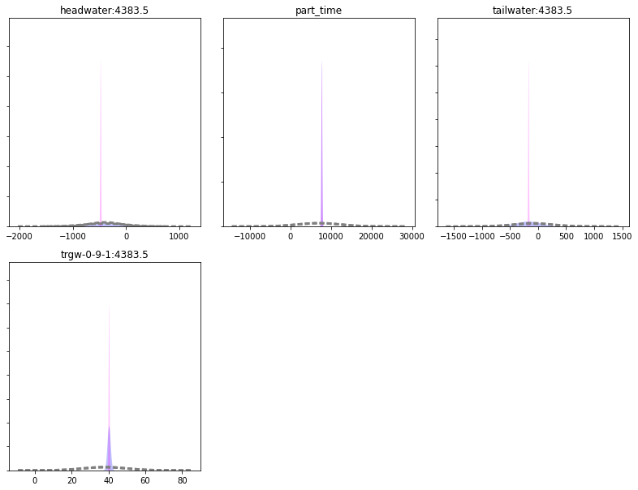
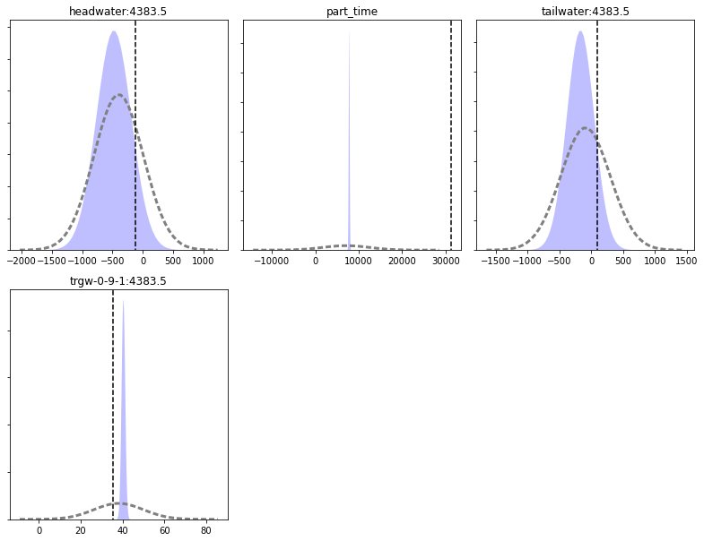

# History match the Freyberg model using a two parameters ``K`` and ``R`` using head and flux observations

#### Where are we on the Goldilocks complexity curve? 


The runs so far were intended to be greatly oversimplified so as to be a starting point for adding complexity. However, when we added just __*one more parameter*__ for a total of 2 parameters uncertainty for some forecasts got appreciably __worse__.  And these parameters cover the entire model domain, which is unrealistic for the natural world!  Are we past the "sweetspot" and should avoid any additional complexity even if our model looks nothing like reality?  

Adding parameters in and of itself is not the real problem.  Rather, it is adding parameters that influence forecasts but which are unconstrained by observations so that they are free to wiggle and ripple uncertainty to our forcasts.  If observations are added that help constrain the parameters, the forecast observation will be more certain. That is, the natural flip side of adding parameters is constraining them, with data (first line of defense) or soft-knowledge and problem dimension reduciton (SVD).  

Anderson et al. (2015) suggest that at a minimum groundwater models be history matched to heads and fluxes.  There is a flux observation in our PEST control file, but it was given zero weight.  Let's see what happens if we move our model to the minimum calibration critera of Anderson et al.

#### Objectives for this notebook are to:
1) Add a flux observation to the measurement objective function of our Freyberg model
2) Explore the effect of adding the observation to history matching, parameter uncertainty, and forecast uncertainty

### Admin
We have provided some pre-cooked PEST dataset files, wraped around the modified Freyberg model. This is the same dataset introduced in the "freyberg_pest_setup" and "freyberg_k" notebooks. 

The functions in the next cell import required dependencies and prepare a folder for you. This folder contains the model files and a preliminary PEST setup. Run the cells, then inspect the new folder named "freyberg_k" which has been created in your tutorial directory. (Just press `shift+enter` to run the cells). 


```python
import sys
import os
import warnings
warnings.filterwarnings("ignore")
warnings.filterwarnings("ignore", category=DeprecationWarning) 

import pandas as pd
import numpy as np
import matplotlib.pyplot as plt;

import shutil

sys.path.insert(0,os.path.join("..", "..", "dependencies"))
import pyemu
import flopy
assert "dependencies" in flopy.__file__
assert "dependencies" in pyemu.__file__
sys.path.insert(0,"..")
import herebedragons as hbd

plt.rcParams['font.size'] = 10
pyemu.plot_utils.font =10
```


```python
# folder containing original model files
org_d = os.path.join('..', '..', 'models', 'monthly_model_files_1lyr_newstress')
# a dir to hold a copy of the org model files
tmp_d = os.path.join('freyberg_mf6')
if os.path.exists(tmp_d):
    shutil.rmtree(tmp_d)
shutil.copytree(org_d,tmp_d)
# get executables
hbd.prep_bins(tmp_d)
# get dependency folders
hbd.prep_deps(tmp_d)
# run our convenience functions to prepare the PEST and model folder
hbd.prep_pest(tmp_d)
```

    ins file for heads.csv prepared.
    ins file for sfr.csv prepared.
    noptmax:0, npar_adj:1, nnz_obs:24
    written pest control file: freyberg_mf6\freyberg.pst
    


    <pyemu.pst.pst_handler.Pst at 0x166678c3490>


Load the PEST control file:


```python
pst = pyemu.Pst(os.path.join(tmp_d,'freyberg.pst'))
```

Before we get started, just run PEST++ to repeat the last tutorial. We do this to have access to files for comparison.

As we did in the last tutorial, set `rch0` parameter transform to `log` and update NOPTMAX to 20:


```python
#update paramter transform
par = pst.parameter_data
par.loc['rch0', 'partrans'] = 'log'
# update noptmax
pst.control_data.noptmax = 20
# write
pst.write(os.path.join(tmp_d, 'freyberg_k_r.pst'))
# run pestpp
pyemu.os_utils.run("pestpp-glm freyberg_k_r.pst", cwd=tmp_d)
```

    noptmax:20, npar_adj:2, nnz_obs:24
    

### Let's look at all observations in the PEST run


```python
# echo the observation data
pst.observation_data.head()
```


<div>
<style scoped>
    .dataframe tbody tr th:only-of-type {
        vertical-align: middle;
    }

    .dataframe tbody tr th {
        vertical-align: top;
    }

    .dataframe thead th {
        text-align: right;
    }
</style>
<table border="1" class="dataframe">
  <thead>
    <tr style="text-align: right;">
      <th></th>
      <th>obsnme</th>
      <th>obsval</th>
      <th>weight</th>
      <th>obgnme</th>
      <th>extra</th>
      <th>gage-1</th>
      <th>headwater</th>
      <th>tailwater</th>
      <th>trgw-0-13-10</th>
      <th>trgw-0-15-16</th>
      <th>...</th>
      <th>trgw-0-2-9</th>
      <th>trgw-0-21-10</th>
      <th>trgw-0-22-15</th>
      <th>trgw-0-24-4</th>
      <th>trgw-0-26-6</th>
      <th>trgw-0-29-15</th>
      <th>trgw-0-3-8</th>
      <th>trgw-0-33-7</th>
      <th>trgw-0-34-10</th>
      <th>trgw-0-9-1</th>
    </tr>
    <tr>
      <th>obsnme</th>
      <th></th>
      <th></th>
      <th></th>
      <th></th>
      <th></th>
      <th></th>
      <th></th>
      <th></th>
      <th></th>
      <th></th>
      <th></th>
      <th></th>
      <th></th>
      <th></th>
      <th></th>
      <th></th>
      <th></th>
      <th></th>
      <th></th>
      <th></th>
      <th></th>
    </tr>
  </thead>
  <tbody>
    <tr>
      <th>gage-1:3652.5</th>
      <td>gage-1:3652.5</td>
      <td>2943.238710</td>
      <td>0.0</td>
      <td>gage-1</td>
      <td>NaN</td>
      <td>3652.5</td>
      <td>NaN</td>
      <td>NaN</td>
      <td>NaN</td>
      <td>NaN</td>
      <td>...</td>
      <td>NaN</td>
      <td>NaN</td>
      <td>NaN</td>
      <td>NaN</td>
      <td>NaN</td>
      <td>NaN</td>
      <td>NaN</td>
      <td>NaN</td>
      <td>NaN</td>
      <td>NaN</td>
    </tr>
    <tr>
      <th>gage-1:3683.5</th>
      <td>gage-1:3683.5</td>
      <td>2815.377509</td>
      <td>0.0</td>
      <td>gage-1</td>
      <td>NaN</td>
      <td>3683.5</td>
      <td>NaN</td>
      <td>NaN</td>
      <td>NaN</td>
      <td>NaN</td>
      <td>...</td>
      <td>NaN</td>
      <td>NaN</td>
      <td>NaN</td>
      <td>NaN</td>
      <td>NaN</td>
      <td>NaN</td>
      <td>NaN</td>
      <td>NaN</td>
      <td>NaN</td>
      <td>NaN</td>
    </tr>
    <tr>
      <th>gage-1:3712.5</th>
      <td>gage-1:3712.5</td>
      <td>2749.121657</td>
      <td>0.0</td>
      <td>gage-1</td>
      <td>NaN</td>
      <td>3712.5</td>
      <td>NaN</td>
      <td>NaN</td>
      <td>NaN</td>
      <td>NaN</td>
      <td>...</td>
      <td>NaN</td>
      <td>NaN</td>
      <td>NaN</td>
      <td>NaN</td>
      <td>NaN</td>
      <td>NaN</td>
      <td>NaN</td>
      <td>NaN</td>
      <td>NaN</td>
      <td>NaN</td>
    </tr>
    <tr>
      <th>gage-1:3743.5</th>
      <td>gage-1:3743.5</td>
      <td>2816.797640</td>
      <td>0.0</td>
      <td>gage-1</td>
      <td>NaN</td>
      <td>3743.5</td>
      <td>NaN</td>
      <td>NaN</td>
      <td>NaN</td>
      <td>NaN</td>
      <td>...</td>
      <td>NaN</td>
      <td>NaN</td>
      <td>NaN</td>
      <td>NaN</td>
      <td>NaN</td>
      <td>NaN</td>
      <td>NaN</td>
      <td>NaN</td>
      <td>NaN</td>
      <td>NaN</td>
    </tr>
    <tr>
      <th>gage-1:3773.5</th>
      <td>gage-1:3773.5</td>
      <td>2892.313705</td>
      <td>0.0</td>
      <td>gage-1</td>
      <td>NaN</td>
      <td>3773.5</td>
      <td>NaN</td>
      <td>NaN</td>
      <td>NaN</td>
      <td>NaN</td>
      <td>...</td>
      <td>NaN</td>
      <td>NaN</td>
      <td>NaN</td>
      <td>NaN</td>
      <td>NaN</td>
      <td>NaN</td>
      <td>NaN</td>
      <td>NaN</td>
      <td>NaN</td>
      <td>NaN</td>
    </tr>
  </tbody>
</table>
<p>5 rows × 21 columns</p>
</div>


Wow!  that's a lot of observations.  Why so many?  Answer:  we are "carrying" lots of model outputs that may be of interest to us later __(not just places and times where we have actual measurements)__.  These outputs include forecasts as well as *"potential" observation* locations we will use in dataworth analysis (more on that later)

But, the calibration only uses observations where you assign weights.  Let's get a listing of just those.


```python
# filter the output based on non-zero weights
pst.observation_data.loc[pst.nnz_obs_names,:].head()
```


<div>
<style scoped>
    .dataframe tbody tr th:only-of-type {
        vertical-align: middle;
    }

    .dataframe tbody tr th {
        vertical-align: top;
    }

    .dataframe thead th {
        text-align: right;
    }
</style>
<table border="1" class="dataframe">
  <thead>
    <tr style="text-align: right;">
      <th></th>
      <th>obsnme</th>
      <th>obsval</th>
      <th>weight</th>
      <th>obgnme</th>
      <th>extra</th>
      <th>gage-1</th>
      <th>headwater</th>
      <th>tailwater</th>
      <th>trgw-0-13-10</th>
      <th>trgw-0-15-16</th>
      <th>...</th>
      <th>trgw-0-2-9</th>
      <th>trgw-0-21-10</th>
      <th>trgw-0-22-15</th>
      <th>trgw-0-24-4</th>
      <th>trgw-0-26-6</th>
      <th>trgw-0-29-15</th>
      <th>trgw-0-3-8</th>
      <th>trgw-0-33-7</th>
      <th>trgw-0-34-10</th>
      <th>trgw-0-9-1</th>
    </tr>
    <tr>
      <th>obsnme</th>
      <th></th>
      <th></th>
      <th></th>
      <th></th>
      <th></th>
      <th></th>
      <th></th>
      <th></th>
      <th></th>
      <th></th>
      <th></th>
      <th></th>
      <th></th>
      <th></th>
      <th></th>
      <th></th>
      <th></th>
      <th></th>
      <th></th>
      <th></th>
      <th></th>
    </tr>
  </thead>
  <tbody>
    <tr>
      <th>trgw-0-26-6:3683.5</th>
      <td>trgw-0-26-6:3683.5</td>
      <td>37.168420</td>
      <td>1.0</td>
      <td>trgw-0-26-6</td>
      <td>NaN</td>
      <td>NaN</td>
      <td>NaN</td>
      <td>NaN</td>
      <td>NaN</td>
      <td>NaN</td>
      <td>...</td>
      <td>NaN</td>
      <td>NaN</td>
      <td>NaN</td>
      <td>NaN</td>
      <td>3683.5</td>
      <td>NaN</td>
      <td>NaN</td>
      <td>NaN</td>
      <td>NaN</td>
      <td>NaN</td>
    </tr>
    <tr>
      <th>trgw-0-26-6:3712.5</th>
      <td>trgw-0-26-6:3712.5</td>
      <td>37.116489</td>
      <td>1.0</td>
      <td>trgw-0-26-6</td>
      <td>NaN</td>
      <td>NaN</td>
      <td>NaN</td>
      <td>NaN</td>
      <td>NaN</td>
      <td>NaN</td>
      <td>...</td>
      <td>NaN</td>
      <td>NaN</td>
      <td>NaN</td>
      <td>NaN</td>
      <td>3712.5</td>
      <td>NaN</td>
      <td>NaN</td>
      <td>NaN</td>
      <td>NaN</td>
      <td>NaN</td>
    </tr>
    <tr>
      <th>trgw-0-26-6:3743.5</th>
      <td>trgw-0-26-6:3743.5</td>
      <td>37.182890</td>
      <td>1.0</td>
      <td>trgw-0-26-6</td>
      <td>NaN</td>
      <td>NaN</td>
      <td>NaN</td>
      <td>NaN</td>
      <td>NaN</td>
      <td>NaN</td>
      <td>...</td>
      <td>NaN</td>
      <td>NaN</td>
      <td>NaN</td>
      <td>NaN</td>
      <td>3743.5</td>
      <td>NaN</td>
      <td>NaN</td>
      <td>NaN</td>
      <td>NaN</td>
      <td>NaN</td>
    </tr>
    <tr>
      <th>trgw-0-26-6:3773.5</th>
      <td>trgw-0-26-6:3773.5</td>
      <td>37.283326</td>
      <td>1.0</td>
      <td>trgw-0-26-6</td>
      <td>NaN</td>
      <td>NaN</td>
      <td>NaN</td>
      <td>NaN</td>
      <td>NaN</td>
      <td>NaN</td>
      <td>...</td>
      <td>NaN</td>
      <td>NaN</td>
      <td>NaN</td>
      <td>NaN</td>
      <td>3773.5</td>
      <td>NaN</td>
      <td>NaN</td>
      <td>NaN</td>
      <td>NaN</td>
      <td>NaN</td>
    </tr>
    <tr>
      <th>trgw-0-26-6:3804.5</th>
      <td>trgw-0-26-6:3804.5</td>
      <td>37.274371</td>
      <td>1.0</td>
      <td>trgw-0-26-6</td>
      <td>NaN</td>
      <td>NaN</td>
      <td>NaN</td>
      <td>NaN</td>
      <td>NaN</td>
      <td>NaN</td>
      <td>...</td>
      <td>NaN</td>
      <td>NaN</td>
      <td>NaN</td>
      <td>NaN</td>
      <td>3804.5</td>
      <td>NaN</td>
      <td>NaN</td>
      <td>NaN</td>
      <td>NaN</td>
      <td>NaN</td>
    </tr>
  </tbody>
</table>
<p>5 rows × 21 columns</p>
</div>


#### Here we have only head calibration targets (calhead).  But it is recommended that we calibrate to heads and fluxes.  

Let's give the observation ``gage-1`` a non-zero weight.  You can do this in a text editor but we'll do it in the next block and see the report out for convenience. We chose a new weight of 0.05 for this problem, but we'll spend more time on the concepts involved with observation weighting in a later notebook.


```python
obs = pst.observation_data
obs.loc[(obs.obgnme=="gage-1") & (obs['gage-1'].astype(float)<=3804.5), "weight"] = 0.05 #super subjective
obs.loc[obs.obgnme=="gage-1"].head()
```


<div>
<style scoped>
    .dataframe tbody tr th:only-of-type {
        vertical-align: middle;
    }

    .dataframe tbody tr th {
        vertical-align: top;
    }

    .dataframe thead th {
        text-align: right;
    }
</style>
<table border="1" class="dataframe">
  <thead>
    <tr style="text-align: right;">
      <th></th>
      <th>obsnme</th>
      <th>obsval</th>
      <th>weight</th>
      <th>obgnme</th>
      <th>extra</th>
      <th>gage-1</th>
      <th>headwater</th>
      <th>tailwater</th>
      <th>trgw-0-13-10</th>
      <th>trgw-0-15-16</th>
      <th>...</th>
      <th>trgw-0-2-9</th>
      <th>trgw-0-21-10</th>
      <th>trgw-0-22-15</th>
      <th>trgw-0-24-4</th>
      <th>trgw-0-26-6</th>
      <th>trgw-0-29-15</th>
      <th>trgw-0-3-8</th>
      <th>trgw-0-33-7</th>
      <th>trgw-0-34-10</th>
      <th>trgw-0-9-1</th>
    </tr>
    <tr>
      <th>obsnme</th>
      <th></th>
      <th></th>
      <th></th>
      <th></th>
      <th></th>
      <th></th>
      <th></th>
      <th></th>
      <th></th>
      <th></th>
      <th></th>
      <th></th>
      <th></th>
      <th></th>
      <th></th>
      <th></th>
      <th></th>
      <th></th>
      <th></th>
      <th></th>
      <th></th>
    </tr>
  </thead>
  <tbody>
    <tr>
      <th>gage-1:3652.5</th>
      <td>gage-1:3652.5</td>
      <td>2943.238710</td>
      <td>0.05</td>
      <td>gage-1</td>
      <td>NaN</td>
      <td>3652.5</td>
      <td>NaN</td>
      <td>NaN</td>
      <td>NaN</td>
      <td>NaN</td>
      <td>...</td>
      <td>NaN</td>
      <td>NaN</td>
      <td>NaN</td>
      <td>NaN</td>
      <td>NaN</td>
      <td>NaN</td>
      <td>NaN</td>
      <td>NaN</td>
      <td>NaN</td>
      <td>NaN</td>
    </tr>
    <tr>
      <th>gage-1:3683.5</th>
      <td>gage-1:3683.5</td>
      <td>2815.377509</td>
      <td>0.05</td>
      <td>gage-1</td>
      <td>NaN</td>
      <td>3683.5</td>
      <td>NaN</td>
      <td>NaN</td>
      <td>NaN</td>
      <td>NaN</td>
      <td>...</td>
      <td>NaN</td>
      <td>NaN</td>
      <td>NaN</td>
      <td>NaN</td>
      <td>NaN</td>
      <td>NaN</td>
      <td>NaN</td>
      <td>NaN</td>
      <td>NaN</td>
      <td>NaN</td>
    </tr>
    <tr>
      <th>gage-1:3712.5</th>
      <td>gage-1:3712.5</td>
      <td>2749.121657</td>
      <td>0.05</td>
      <td>gage-1</td>
      <td>NaN</td>
      <td>3712.5</td>
      <td>NaN</td>
      <td>NaN</td>
      <td>NaN</td>
      <td>NaN</td>
      <td>...</td>
      <td>NaN</td>
      <td>NaN</td>
      <td>NaN</td>
      <td>NaN</td>
      <td>NaN</td>
      <td>NaN</td>
      <td>NaN</td>
      <td>NaN</td>
      <td>NaN</td>
      <td>NaN</td>
    </tr>
    <tr>
      <th>gage-1:3743.5</th>
      <td>gage-1:3743.5</td>
      <td>2816.797640</td>
      <td>0.05</td>
      <td>gage-1</td>
      <td>NaN</td>
      <td>3743.5</td>
      <td>NaN</td>
      <td>NaN</td>
      <td>NaN</td>
      <td>NaN</td>
      <td>...</td>
      <td>NaN</td>
      <td>NaN</td>
      <td>NaN</td>
      <td>NaN</td>
      <td>NaN</td>
      <td>NaN</td>
      <td>NaN</td>
      <td>NaN</td>
      <td>NaN</td>
      <td>NaN</td>
    </tr>
    <tr>
      <th>gage-1:3773.5</th>
      <td>gage-1:3773.5</td>
      <td>2892.313705</td>
      <td>0.05</td>
      <td>gage-1</td>
      <td>NaN</td>
      <td>3773.5</td>
      <td>NaN</td>
      <td>NaN</td>
      <td>NaN</td>
      <td>NaN</td>
      <td>...</td>
      <td>NaN</td>
      <td>NaN</td>
      <td>NaN</td>
      <td>NaN</td>
      <td>NaN</td>
      <td>NaN</td>
      <td>NaN</td>
      <td>NaN</td>
      <td>NaN</td>
      <td>NaN</td>
    </tr>
  </tbody>
</table>
<p>5 rows × 21 columns</p>
</div>


Re-write and run PEST++:


```python
pst.write(os.path.join(tmp_d, 'freyberg_k_r_flxo.pst'))
```

    noptmax:20, npar_adj:2, nnz_obs:24
    

Watch the terminal window where you launched this notebook to see the progress of PEST++.  Advance through the code blocks when you see a 0 returned.


```python
pyemu.os_utils.run("pestpp-glm freyberg_k_r_flxo.pst", cwd=tmp_d)
```

Let's explore the results, how did we do with fit (lowering PHI)?


```python
df_obj = pd.read_csv(os.path.join(tmp_d,"freyberg_k_r_flxo.iobj"),index_col=0)
df_obj
```


<div>
<style scoped>
    .dataframe tbody tr th:only-of-type {
        vertical-align: middle;
    }

    .dataframe tbody tr th {
        vertical-align: top;
    }

    .dataframe thead th {
        text-align: right;
    }
</style>
<table border="1" class="dataframe">
  <thead>
    <tr style="text-align: right;">
      <th></th>
      <th>model_runs_completed</th>
      <th>total_phi</th>
      <th>measurement_phi</th>
      <th>regularization_phi</th>
      <th>gage-1</th>
      <th>headwater</th>
      <th>particle</th>
      <th>tailwater</th>
      <th>trgw-0-13-10</th>
      <th>trgw-0-15-16</th>
      <th>...</th>
      <th>trgw-0-2-9</th>
      <th>trgw-0-21-10</th>
      <th>trgw-0-22-15</th>
      <th>trgw-0-24-4</th>
      <th>trgw-0-26-6</th>
      <th>trgw-0-29-15</th>
      <th>trgw-0-3-8</th>
      <th>trgw-0-33-7</th>
      <th>trgw-0-34-10</th>
      <th>trgw-0-9-1</th>
    </tr>
    <tr>
      <th>iteration</th>
      <th></th>
      <th></th>
      <th></th>
      <th></th>
      <th></th>
      <th></th>
      <th></th>
      <th></th>
      <th></th>
      <th></th>
      <th></th>
      <th></th>
      <th></th>
      <th></th>
      <th></th>
      <th></th>
      <th></th>
      <th></th>
      <th></th>
      <th></th>
      <th></th>
    </tr>
  </thead>
  <tbody>
    <tr>
      <th>0</th>
      <td>0</td>
      <td>573.988</td>
      <td>573.988</td>
      <td>0</td>
      <td>544.785</td>
      <td>0</td>
      <td>0</td>
      <td>0</td>
      <td>0</td>
      <td>0</td>
      <td>...</td>
      <td>0</td>
      <td>0</td>
      <td>0</td>
      <td>0</td>
      <td>18.35720</td>
      <td>0</td>
      <td>10.84590</td>
      <td>0</td>
      <td>0</td>
      <td>0</td>
    </tr>
    <tr>
      <th>1</th>
      <td>13</td>
      <td>476.353</td>
      <td>476.353</td>
      <td>0</td>
      <td>472.459</td>
      <td>0</td>
      <td>0</td>
      <td>0</td>
      <td>0</td>
      <td>0</td>
      <td>...</td>
      <td>0</td>
      <td>0</td>
      <td>0</td>
      <td>0</td>
      <td>1.16247</td>
      <td>0</td>
      <td>2.73091</td>
      <td>0</td>
      <td>0</td>
      <td>0</td>
    </tr>
    <tr>
      <th>2</th>
      <td>25</td>
      <td>475.745</td>
      <td>475.745</td>
      <td>0</td>
      <td>471.938</td>
      <td>0</td>
      <td>0</td>
      <td>0</td>
      <td>0</td>
      <td>0</td>
      <td>...</td>
      <td>0</td>
      <td>0</td>
      <td>0</td>
      <td>0</td>
      <td>1.18215</td>
      <td>0</td>
      <td>2.62491</td>
      <td>0</td>
      <td>0</td>
      <td>0</td>
    </tr>
    <tr>
      <th>3</th>
      <td>39</td>
      <td>472.614</td>
      <td>472.614</td>
      <td>0</td>
      <td>469.419</td>
      <td>0</td>
      <td>0</td>
      <td>0</td>
      <td>0</td>
      <td>0</td>
      <td>...</td>
      <td>0</td>
      <td>0</td>
      <td>0</td>
      <td>0</td>
      <td>1.85420</td>
      <td>0</td>
      <td>1.34019</td>
      <td>0</td>
      <td>0</td>
      <td>0</td>
    </tr>
  </tbody>
</table>
<p>4 rows × 21 columns</p>
</div>


Egads!  Our Phi is a bit larger!  Are we moving backwards? Oh wait, we added a new weighted observation, so we can't compare it directly to what we had with only head observations.

#### Okay, what did it do to our parameter uncertainty?

As a reminder, let's load in the parameter uncerainty from the previous calibration (in which we only used head observations).


```python
# make a dataframe from the old run that had K and R but head-only calibration
df_paru_base = pd.read_csv(os.path.join(tmp_d, "freyberg_k_r.par.usum.csv"),index_col=0)
# echo out the dataframe
df_paru_base
```


<div>
<style scoped>
    .dataframe tbody tr th:only-of-type {
        vertical-align: middle;
    }

    .dataframe tbody tr th {
        vertical-align: top;
    }

    .dataframe thead th {
        text-align: right;
    }
</style>
<table border="1" class="dataframe">
  <thead>
    <tr style="text-align: right;">
      <th></th>
      <th>prior_mean</th>
      <th>prior_stdev</th>
      <th>prior_lower_bound</th>
      <th>prior_upper_bound</th>
      <th>post_mean</th>
      <th>post_stdev</th>
      <th>post_lower_bound</th>
      <th>post_upper_bound</th>
    </tr>
    <tr>
      <th>name</th>
      <th></th>
      <th></th>
      <th></th>
      <th></th>
      <th></th>
      <th></th>
      <th></th>
      <th></th>
    </tr>
  </thead>
  <tbody>
    <tr>
      <th>hk1</th>
      <td>0.69897</td>
      <td>1.000000</td>
      <td>-1.30103</td>
      <td>2.69897</td>
      <td>0.688363</td>
      <td>0.144337</td>
      <td>0.399689</td>
      <td>0.977037</td>
    </tr>
    <tr>
      <th>rch0</th>
      <td>0.00000</td>
      <td>0.150515</td>
      <td>-0.30103</td>
      <td>0.30103</td>
      <td>0.120730</td>
      <td>0.100419</td>
      <td>-0.080109</td>
      <td>0.321568</td>
    </tr>
  </tbody>
</table>
</div>


OK, and now the new parameter uncertainty from the new calibration run (with added flux observations):


```python
df_paru = pd.read_csv(os.path.join(tmp_d,"freyberg_k_r_flxo.par.usum.csv"),index_col=0)
df_paru
```


<div>
<style scoped>
    .dataframe tbody tr th:only-of-type {
        vertical-align: middle;
    }

    .dataframe tbody tr th {
        vertical-align: top;
    }

    .dataframe thead th {
        text-align: right;
    }
</style>
<table border="1" class="dataframe">
  <thead>
    <tr style="text-align: right;">
      <th></th>
      <th>prior_mean</th>
      <th>prior_stdev</th>
      <th>prior_lower_bound</th>
      <th>prior_upper_bound</th>
      <th>post_mean</th>
      <th>post_stdev</th>
      <th>post_lower_bound</th>
      <th>post_upper_bound</th>
    </tr>
    <tr>
      <th>name</th>
      <th></th>
      <th></th>
      <th></th>
      <th></th>
      <th></th>
      <th></th>
      <th></th>
      <th></th>
    </tr>
  </thead>
  <tbody>
    <tr>
      <th>hk1</th>
      <td>0.69897</td>
      <td>1.000000</td>
      <td>-1.30103</td>
      <td>2.69897</td>
      <td>0.515927</td>
      <td>0.019887</td>
      <td>0.476153</td>
      <td>0.555700</td>
    </tr>
    <tr>
      <th>rch0</th>
      <td>0.00000</td>
      <td>0.150515</td>
      <td>-0.30103</td>
      <td>0.30103</td>
      <td>0.009627</td>
      <td>0.005952</td>
      <td>-0.002278</td>
      <td>0.021531</td>
    </tr>
  </tbody>
</table>
</div>


Let's plot these up like before and compare them side by side. Here are the prior (dahsed grey lines) and posterior standard deviations (blue is with flux observations; green is with only head observations):


```python
figs,axes = pyemu.plot_utils.plot_summary_distributions(df_paru,subplots=True)
for pname,ax in zip(pst.adj_par_names,axes):
    pyemu.plot_utils.plot_summary_distributions(df_paru_base.loc[[pname],:],ax=ax,pt_color="g")
figs[0].tight_layout()
```


    

    


So, the blue shaded areas are taller and thiner than the green. This implies that, from an uncertainty standpoint, including the flux observations has helped us learn alot about the recharge parameter. As recharge and `hk1` are correlated, this has in turn reduced uncertainty in `hk1`. #dividends

But, as usual, what about the forecast uncertainty?

### Forecasts

Let's look at our forecast uncertainty for both calibration runs. Load the original forecast uncetainties (head observations only):


```python
df_foreu_base = pd.read_csv(os.path.join(tmp_d,"freyberg_k_r.pred.usum.csv"),index_col=0)
df_foreu_base.loc[:,"reduction"] = 100.0 *  (1.0 - (df_foreu_base.post_stdev / df_foreu_base.prior_stdev))
df_foreu_base
```


<div>
<style scoped>
    .dataframe tbody tr th:only-of-type {
        vertical-align: middle;
    }

    .dataframe tbody tr th {
        vertical-align: top;
    }

    .dataframe thead th {
        text-align: right;
    }
</style>
<table border="1" class="dataframe">
  <thead>
    <tr style="text-align: right;">
      <th></th>
      <th>prior_mean</th>
      <th>prior_stdev</th>
      <th>prior_lower_bound</th>
      <th>prior_upper_bound</th>
      <th>post_mean</th>
      <th>post_stdev</th>
      <th>post_lower_bound</th>
      <th>post_upper_bound</th>
      <th>reduction</th>
    </tr>
    <tr>
      <th>name</th>
      <th></th>
      <th></th>
      <th></th>
      <th></th>
      <th></th>
      <th></th>
      <th></th>
      <th></th>
      <th></th>
    </tr>
  </thead>
  <tbody>
    <tr>
      <th>headwater:4383.5</th>
      <td>-397.5550</td>
      <td>573.5320</td>
      <td>-1544.6200</td>
      <td>749.5080</td>
      <td>-528.8310</td>
      <td>43.88620</td>
      <td>-616.6030</td>
      <td>-441.0580</td>
      <td>92.348082</td>
    </tr>
    <tr>
      <th>part_time</th>
      <td>7076.3100</td>
      <td>3655.2400</td>
      <td>-234.1850</td>
      <td>14386.8000</td>
      <td>6962.1600</td>
      <td>680.80500</td>
      <td>5600.5500</td>
      <td>8323.7700</td>
      <td>81.374547</td>
    </tr>
    <tr>
      <th>tailwater:4383.5</th>
      <td>-90.2950</td>
      <td>423.8540</td>
      <td>-938.0040</td>
      <td>757.4140</td>
      <td>-171.7500</td>
      <td>16.99620</td>
      <td>-205.7430</td>
      <td>-137.7580</td>
      <td>95.990081</td>
    </tr>
    <tr>
      <th>trgw-0-9-1:4383.5</th>
      <td>38.0999</td>
      <td>12.6383</td>
      <td>12.8233</td>
      <td>63.3765</td>
      <td>38.9516</td>
      <td>1.16461</td>
      <td>36.6224</td>
      <td>41.2808</td>
      <td>90.785074</td>
    </tr>
  </tbody>
</table>
</div>


And for the version with the flux observations:


```python
df_foreu = pd.read_csv(os.path.join(tmp_d,"freyberg_k_r_flxo.pred.usum.csv"),index_col=0)
df_foreu.loc[:,"reduction"] = 100.0 *  (1.0 - (df_foreu.post_stdev / df_foreu.prior_stdev))
df_foreu
```


<div>
<style scoped>
    .dataframe tbody tr th:only-of-type {
        vertical-align: middle;
    }

    .dataframe tbody tr th {
        vertical-align: top;
    }

    .dataframe thead th {
        text-align: right;
    }
</style>
<table border="1" class="dataframe">
  <thead>
    <tr style="text-align: right;">
      <th></th>
      <th>prior_mean</th>
      <th>prior_stdev</th>
      <th>prior_lower_bound</th>
      <th>prior_upper_bound</th>
      <th>post_mean</th>
      <th>post_stdev</th>
      <th>post_lower_bound</th>
      <th>post_upper_bound</th>
      <th>reduction</th>
    </tr>
    <tr>
      <th>name</th>
      <th></th>
      <th></th>
      <th></th>
      <th></th>
      <th></th>
      <th></th>
      <th></th>
      <th></th>
      <th></th>
    </tr>
  </thead>
  <tbody>
    <tr>
      <th>headwater:4383.5</th>
      <td>-397.5550</td>
      <td>288.5940</td>
      <td>-974.743</td>
      <td>179.6320</td>
      <td>-476.6180</td>
      <td>7.237970</td>
      <td>-491.094</td>
      <td>-462.1420</td>
      <td>97.491989</td>
    </tr>
    <tr>
      <th>part_time</th>
      <td>7076.3100</td>
      <td>5362.9400</td>
      <td>-3649.570</td>
      <td>17802.2000</td>
      <td>7792.5900</td>
      <td>107.409000</td>
      <td>7577.770</td>
      <td>8007.4100</td>
      <td>97.997199</td>
    </tr>
    <tr>
      <th>tailwater:4383.5</th>
      <td>-90.2950</td>
      <td>322.1640</td>
      <td>-734.623</td>
      <td>554.0330</td>
      <td>-167.7600</td>
      <td>6.452180</td>
      <td>-180.664</td>
      <td>-154.8550</td>
      <td>97.997237</td>
    </tr>
    <tr>
      <th>trgw-0-9-1:4383.5</th>
      <td>38.0999</td>
      <td>11.7889</td>
      <td>14.522</td>
      <td>61.6777</td>
      <td>40.3668</td>
      <td>0.228918</td>
      <td>39.909</td>
      <td>40.8247</td>
      <td>98.058190</td>
    </tr>
  </tbody>
</table>
</div>


Right then, let's plot these up together. Again, the original calibration forecast uncertainty are shaded in green. Forecast uncertaines from the version with head + flux observations are shaded in blue.


```python
for forecast in pst.forecast_names:
    ax1 = plt.subplot(111)
    pyemu.plot_utils.plot_summary_distributions(df_foreu.loc[[forecast],:],ax=ax1)
    pyemu.plot_utils.plot_summary_distributions(df_foreu_base.loc[[forecast],:],
                                             ax=ax1,pt_color='g')       
    ax1.set_title(forecast)
    plt.show()
figs[0].tight_layout()
```


    

    


    

    


    

    


    

    


As you can see, the information in the flux observations has reduced forecast uncertainty significantly for the `headwater`, but not so much for the `tailwater` forecast. So, at first glance we that the same model/observtion data set can make some forecasts better....but not others! i.e. calibration is sometimes worth it, sometimes it isnt.

But have we succeeded? Let's plot with the true forecast values:


```python
figs, axes = pyemu.plot_utils.plot_summary_distributions(df_foreu,subplots=True)
for ax in axes:
    fname = ax.get_title().lower()
    ylim = ax.get_ylim()
    v = pst.observation_data.loc[fname,"obsval"]
    ax.plot([v,v],ylim,"k--")
    ax.set_ylim(0,ylim[-1])
figs[0].tight_layout()
```


    

    


...._sigh_...still not winning.

### Hold up!

Isn't there a major flaw in our approach to uncertainty here? We freed `rch0` (which affects recharge in the calibration period). But we left the recharge in the forecast period (`rch1`) fixed - which is saying we know it perfectly. 

Damn...Ok...let's repeat all of the above but with `rch1` freed.


```python
par.loc['rch1', 'partrans'] = 'log'
# write
pst.write(os.path.join(tmp_d, 'freyberg_k_r_flxo.pst'))
# run pestpp
pyemu.os_utils.run("pestpp-glm freyberg_k_r_flxo.pst", cwd=tmp_d)
```

    noptmax:20, npar_adj:3, nnz_obs:24
    


```python
# get parameter uncertainty
df_paru_new = pd.read_csv(os.path.join(tmp_d,"freyberg_k_r_flxo.par.usum.csv"),index_col=0)
# get forecast uncertainty
df_foreu_new = pd.read_csv(os.path.join(tmp_d,"freyberg_k_r_flxo.pred.usum.csv"),index_col=0)
df_foreu_new
```


<div>
<style scoped>
    .dataframe tbody tr th:only-of-type {
        vertical-align: middle;
    }

    .dataframe tbody tr th {
        vertical-align: top;
    }

    .dataframe thead th {
        text-align: right;
    }
</style>
<table border="1" class="dataframe">
  <thead>
    <tr style="text-align: right;">
      <th></th>
      <th>prior_mean</th>
      <th>prior_stdev</th>
      <th>prior_lower_bound</th>
      <th>prior_upper_bound</th>
      <th>post_mean</th>
      <th>post_stdev</th>
      <th>post_lower_bound</th>
      <th>post_upper_bound</th>
    </tr>
    <tr>
      <th>name</th>
      <th></th>
      <th></th>
      <th></th>
      <th></th>
      <th></th>
      <th></th>
      <th></th>
      <th></th>
    </tr>
  </thead>
  <tbody>
    <tr>
      <th>headwater:4383.5</th>
      <td>-397.5550</td>
      <td>408.6910</td>
      <td>-1214.9400</td>
      <td>419.8270</td>
      <td>-476.6180</td>
      <td>289.473000</td>
      <td>-1055.5600</td>
      <td>102.3270</td>
    </tr>
    <tr>
      <th>part_time</th>
      <td>7076.3100</td>
      <td>5362.9400</td>
      <td>-3649.5700</td>
      <td>17802.2000</td>
      <td>7792.5900</td>
      <td>107.570000</td>
      <td>7577.4500</td>
      <td>8007.7300</td>
    </tr>
    <tr>
      <th>tailwater:4383.5</th>
      <td>-90.2950</td>
      <td>387.8120</td>
      <td>-865.9190</td>
      <td>685.3290</td>
      <td>-167.7600</td>
      <td>215.986000</td>
      <td>-599.7320</td>
      <td>264.2130</td>
    </tr>
    <tr>
      <th>trgw-0-9-1:4383.5</th>
      <td>38.0999</td>
      <td>11.8179</td>
      <td>14.4641</td>
      <td>61.7356</td>
      <td>40.3668</td>
      <td>0.858384</td>
      <td>38.6501</td>
      <td>42.0836</td>
    </tr>
  </tbody>
</table>
</div>


Check out the parameter uncertainties. This time, pink shaded areas are the previous calibration run (with `rch1` fixed), blue is the new run (all parameters freed).

The `hk1` and `rch0` parameter uncertainties are the same as before. Note that the `rch1` prior and posterior uncertainty is the same. Which makes sense...the observation data which we have contains no information that informs what recharge will be in the future (well..it might...but let's not get side tracked).


```python
figs,axes = pyemu.plot_utils.plot_summary_distributions(df_paru_new,subplots=True)
for pname,ax in zip(pst.adj_par_names,axes):
    if pname == "rch1":
        continue
    pyemu.plot_utils.plot_summary_distributions(df_paru.loc[[pname],:],ax=ax,pt_color="fuchsia")
plt.ylim(0)
figs[0].tight_layout()
```


    

    


So how does this new source of uncertainty ripple out to our forecasts? Plot up the forecast uncertainties. 


```python
figs,axes = pyemu.plot_utils.plot_summary_distributions(df_foreu_new,subplots=True)
for forecast,ax in zip(sorted(pst.forecast_names),axes):
    pyemu.plot_utils.plot_summary_distributions(df_foreu.loc[[forecast],:],ax=ax,pt_color="fuchsia")
figs[0].tight_layout()
```


    

    


Oh hello! Forecast uncertainty for the `headwater` and `tailwater` forecasts have increased alot (the `trgw` and `part_time` forecast did as well, but less noticeably). 

We see that the posterior for most forecasts is increased because of including future recharge uncertainty.  Intutitively, it makes sense because future recharge directly influences water levels and fluxes in the future.  And since calibration (history-matching) can't tell us anything about future recharge.  This means there is no data we can collect to reduce this source of uncertainty.

So..success? What do you think? Better...at least some truth values are bracketed by the predections but..._sigh_... still not.


```python
figs, axes = pyemu.plot_utils.plot_summary_distributions(df_foreu_new,subplots=True)
for ax in axes:
    fname = ax.get_title().lower()
    ylim = ax.get_ylim()
    v = pst.observation_data.loc[fname,"obsval"]
    ax.plot([v,v],ylim,"k--")
    ax.set_ylim(0,ylim[-1])
figs[0].tight_layout()
```


    

    

