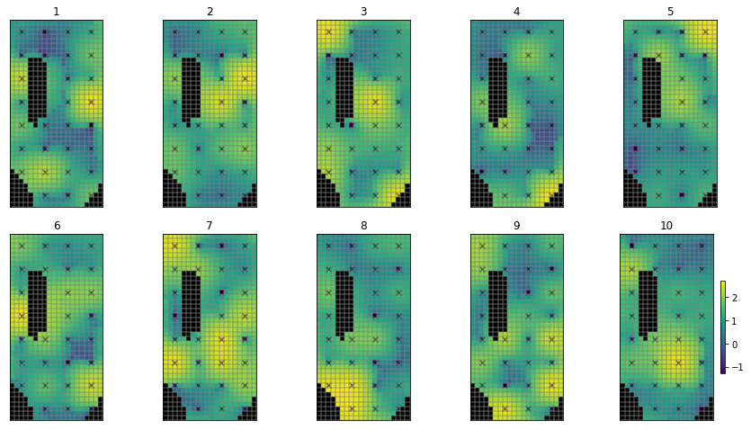
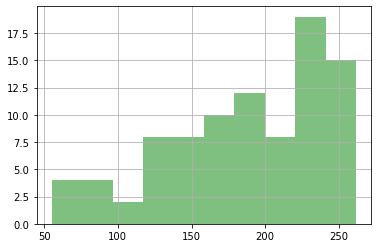

# NonLinear Uncertainty Analysis - Monte Carlo

As we've seen, First-Order-Second-Moment (FOSM) is quick and insightful.  But FOSM depends on an assumption that the relation between the model and the forecast uncertainty is linear.  But many times the world is nonlinear. Short cuts like FOSM need assumptions, but we can free ourselves by taking the brute force approach.  That is define the parameters that are important, provide the prior uncertainty, sample those parameters many times, run the model many times, and then summarize the results.  

On a more practical standpoint, the underlying theory for FOSM and why it results in shortcomings can be hard to explain to stakeholders.  Monte Carlo, however, is VERY straightforward, its computational brute force notwithstanding. 

Here's a flowchart from Anderson et al. (2015):


## The Current Tutorial

In this notebook we will:
1. Run Monte Carlo on the Freyberg model
2. Look at parameter and forecast uncertainty 
3. Look at the effect of prior parameter uncertainty covariance
4. Start thinking of the advantages and disadvantages of linear and nonlinear uncertainty methods

This notebook is going to be computationally tough and may tax your computer. So buckle up. 


### Admin

First the usual admin of preparing folders and constructing the model and PEST datasets.


```python
import sys
import os
import warnings
warnings.filterwarnings("ignore")
warnings.filterwarnings("ignore", category=DeprecationWarning) 

import pandas as pd
import numpy as np
import matplotlib.pyplot as plt;

import shutil

sys.path.insert(0,os.path.join("..", "..", "dependencies"))
import pyemu
import flopy
assert "dependencies" in flopy.__file__
assert "dependencies" in pyemu.__file__
sys.path.insert(0,"..")
import herebedragons as hbd

plt.rcParams['font.size'] = 10
pyemu.plot_utils.font =10
```


```python
# folder containing original model files
org_d = os.path.join('..', '..', 'models', 'monthly_model_files_1lyr_newstress')
# a dir to hold a copy of the org model files
working_dir = os.path.join('freyberg_mf6')
if os.path.exists(working_dir):
    shutil.rmtree(working_dir)
shutil.copytree(org_d,working_dir)
# get executables
hbd.prep_bins(working_dir)
# get dependency folders
hbd.prep_deps(working_dir)
# run our convenience functions to prepare the PEST and model folder
hbd.prep_pest(working_dir)
# convenience function that builds a new control file with pilot point parameters for hk
hbd.add_ppoints(working_dir)
```

    ins file for heads.csv prepared.
    ins file for sfr.csv prepared.
    noptmax:0, npar_adj:1, nnz_obs:24
    written pest control file: freyberg_mf6\freyberg.pst
       could not remove start_datetime
    1 pars added from template file .\freyberg6.sfr_perioddata_1.txt.tpl
    6 pars added from template file .\freyberg6.wel_stress_period_data_10.txt.tpl
    0 pars added from template file .\freyberg6.wel_stress_period_data_11.txt.tpl
    0 pars added from template file .\freyberg6.wel_stress_period_data_12.txt.tpl
    0 pars added from template file .\freyberg6.wel_stress_period_data_2.txt.tpl
    0 pars added from template file .\freyberg6.wel_stress_period_data_3.txt.tpl
    0 pars added from template file .\freyberg6.wel_stress_period_data_4.txt.tpl
    0 pars added from template file .\freyberg6.wel_stress_period_data_5.txt.tpl
    0 pars added from template file .\freyberg6.wel_stress_period_data_6.txt.tpl
    0 pars added from template file .\freyberg6.wel_stress_period_data_7.txt.tpl
    0 pars added from template file .\freyberg6.wel_stress_period_data_8.txt.tpl
    0 pars added from template file .\freyberg6.wel_stress_period_data_9.txt.tpl
    starting interp point loop for 800 points
    took 2.029215 seconds
    1 pars dropped from template file freyberg_mf6\freyberg6.npf_k_layer1.txt.tpl
    29 pars added from template file .\hkpp.dat.tpl
    starting interp point loop for 800 points
    took 2.012059 seconds
    29 pars added from template file .\rchpp.dat.tpl
    noptmax:0, npar_adj:65, nnz_obs:37
    new control file: 'freyberg_pp.pst'
    


Monte Carlo uses a lots and lots of forward runs so we don't want to make the mistake of burning the silicon for a PEST control file that is not right.  Here we make doubly sure that the control file has the recharge freed (not "fixed' in the PEST control file).  

### Load the `pst` control file

Let's double check what parameters we have in this version of the model using `pyemu` (you can just look in the PEST control file too.).

We have adjustable parameters that control SFR inflow rates, well pumping rates, hydraulic conductivity and recharge rates. Recall that by setting a parameter as "fixed" we are stating that we know it perfectly (should we though...?). Currently fixed parameters include porosity and future recharge.

For the sake of this tutorial, and as we did in the "sensitivity" tutorials, let's set all the parameters free:


```python
pst_name = "freyberg_pp.pst"
# load the pst
pst = pyemu.Pst(os.path.join(working_dir,pst_name))
#update parameter data
par = pst.parameter_data
#update parameter transform
par.loc[:, 'partrans'] = 'log'
```


```python
# check if the model runs
pst.control_data.noptmax=0
# rewrite the control file
pst.write(os.path.join(working_dir,pst_name))
# run the model once
pyemu.os_utils.run('pestpp-glm freyberg_pp.pst', cwd=working_dir)
```

    noptmax:0, npar_adj:68, nnz_obs:37
    

Reload the control file:


```python
pst = pyemu.Pst(os.path.join(working_dir,'freyberg_pp.pst'))
pst.phi
```


    131.79995788867873


# Monte Carlo

In it's simplest form, Monte Carlo boils down to: (1) "draw" many random samples of parameters from the prior probability distribution, (2) run the model, (3) look at the results.

So how do we "draw", or sample, parameters? (Think "draw" as in "drawing a card from a deck"). We need to randomly sample parameter values from a range. This range is defined by the _prior parameter probability distribution_. As we did for FOSM, let's assume that the bounds in the parameter data section define the range of a Gaussian (or normal) distribution, and that the initial values define the mean. 

### The Prior

We can use `pyemu` to sample parameter values from such a distribution. First, construct a covariance matrix from the parameter data in the `pst` control file:


```python
prior_cov = pyemu.Cov.from_parameter_data(pst)
```

What did we do there? We generated a covariance matrix from the parameter bound values. The next cell displays an image of the matrix. As you can see, all off-diagonal values are zero. Therefore no parameter correlation is accounted for. 

This covariance matrix is the _prior_ (before history matching) parameter covariance. 


```python
x = prior_cov.as_2d.copy()
x[x==0] = np.nan
plt.imshow(x)
plt.colorbar();
```


    

    


OK, let's now sample 500 parameter sets from the probability distribution described by this covariance matrix and the mean values (e.g. the initial parameter values in the `pst` control file).


```python
parensemble = pyemu.ParameterEnsemble.from_gaussian_draw(pst=pst,cov=prior_cov,num_reals=500,)
# ensure that the samples respect parameter bounds in the pst control file
parensemble.enforce()
```

Here's an example of the first 5 parameter sets of our 500 created by our draw ("draw" here is like "drawing" a card


```python
parensemble.head()
```


<div>
<style scoped>
    .dataframe tbody tr th:only-of-type {
        vertical-align: middle;
    }

    .dataframe tbody tr th {
        vertical-align: top;
    }

    .dataframe thead th {
        text-align: right;
    }
</style>
<table border="1" class="dataframe">
  <thead>
    <tr style="text-align: right;">
      <th></th>
      <th>ne1</th>
      <th>rch0</th>
      <th>rch1</th>
      <th>strinf</th>
      <th>wel2</th>
      <th>wel1</th>
      <th>wel4</th>
      <th>wel5</th>
      <th>wel0</th>
      <th>wel3</th>
      <th>...</th>
      <th>rch_i:22_j:7_zone:1.0</th>
      <th>rch_i:37_j:17_zone:1.0</th>
      <th>rch_i:17_j:2_zone:1.0</th>
      <th>rch_i:12_j:12_zone:1.0</th>
      <th>rch_i:22_j:17_zone:1.0</th>
      <th>rch_i:2_j:17_zone:1.0</th>
      <th>rch_i:27_j:7_zone:1.0</th>
      <th>rch_i:32_j:12_zone:1.0</th>
      <th>rch_i:2_j:2_zone:1.0</th>
      <th>rch_i:12_j:2_zone:1.0</th>
    </tr>
  </thead>
  <tbody>
    <tr>
      <th>0</th>
      <td>0.008576</td>
      <td>0.798390</td>
      <td>1.097442</td>
      <td>342.933067</td>
      <td>900.000000</td>
      <td>95.384015</td>
      <td>673.122041</td>
      <td>236.651598</td>
      <td>93.555705</td>
      <td>258.919768</td>
      <td>...</td>
      <td>1.545899</td>
      <td>0.967640</td>
      <td>0.765540</td>
      <td>0.879551</td>
      <td>1.064152</td>
      <td>1.094530</td>
      <td>1.587063</td>
      <td>1.764833</td>
      <td>0.699708</td>
      <td>0.969906</td>
    </tr>
    <tr>
      <th>1</th>
      <td>0.007612</td>
      <td>1.908030</td>
      <td>1.188849</td>
      <td>594.907106</td>
      <td>88.010442</td>
      <td>118.664153</td>
      <td>560.794560</td>
      <td>900.000000</td>
      <td>246.389133</td>
      <td>660.090196</td>
      <td>...</td>
      <td>1.470901</td>
      <td>1.380243</td>
      <td>1.047585</td>
      <td>0.910253</td>
      <td>0.688392</td>
      <td>0.921585</td>
      <td>0.984850</td>
      <td>1.211731</td>
      <td>0.994265</td>
      <td>2.000000</td>
    </tr>
    <tr>
      <th>2</th>
      <td>0.009936</td>
      <td>0.964648</td>
      <td>0.670542</td>
      <td>566.612120</td>
      <td>95.205141</td>
      <td>450.603288</td>
      <td>468.262566</td>
      <td>900.000000</td>
      <td>121.221073</td>
      <td>198.859473</td>
      <td>...</td>
      <td>1.504745</td>
      <td>1.025225</td>
      <td>0.824225</td>
      <td>1.357629</td>
      <td>1.061188</td>
      <td>0.805217</td>
      <td>1.426085</td>
      <td>1.235177</td>
      <td>0.720202</td>
      <td>0.742659</td>
    </tr>
    <tr>
      <th>3</th>
      <td>0.005000</td>
      <td>0.862611</td>
      <td>1.291555</td>
      <td>1949.739433</td>
      <td>134.206943</td>
      <td>213.220396</td>
      <td>900.000000</td>
      <td>900.000000</td>
      <td>65.534174</td>
      <td>900.000000</td>
      <td>...</td>
      <td>0.641770</td>
      <td>1.531370</td>
      <td>0.614023</td>
      <td>1.068229</td>
      <td>0.860114</td>
      <td>0.942771</td>
      <td>1.791559</td>
      <td>1.428844</td>
      <td>1.132330</td>
      <td>0.736988</td>
    </tr>
    <tr>
      <th>4</th>
      <td>0.011502</td>
      <td>1.170017</td>
      <td>0.649204</td>
      <td>582.673590</td>
      <td>328.172742</td>
      <td>56.132756</td>
      <td>654.640273</td>
      <td>263.797784</td>
      <td>886.917946</td>
      <td>301.128598</td>
      <td>...</td>
      <td>1.157887</td>
      <td>0.964998</td>
      <td>0.950426</td>
      <td>0.952610</td>
      <td>1.437834</td>
      <td>0.899621</td>
      <td>1.234873</td>
      <td>1.145106</td>
      <td>0.844422</td>
      <td>0.946133</td>
    </tr>
  </tbody>
</table>
<p>5 rows × 68 columns</p>
</div>


What does this look like in terms of spatially varying parameters? Let's just plot the hydraulic conductivity from one of these samples. (Note the log-transformed values of K):


```python
par = pst.parameter_data
parnmes = par.loc[par.pargp=='hk1'].parnme.values
pe_k = parensemble.loc[:,parnmes].copy()

# use the hbd convenienc function to plot several realisations
hbd.plot_ensemble_arr(pe_k, working_dir, 10)
```

       could not remove start_datetime
    return type uncaught, losing Ensemble type, returning DataFrame
    


    

    


That does not look very realistic. Do these look "right" (from a geologic stand point)? Lots of "random" variation (pilot points spatially near each other can have very different values)...not much structure...why? Because we have not specified any parameter correlation. Each pilot point is statistically independent. 

How do we express that in the prior? We need to express parameter spatial covariance with a geostatistical structure. Much the same as we did for regularization. Let's build a covariance matrix for pilot point parameters.

You should be familiar with these by now:


```python
v = pyemu.geostats.ExpVario(contribution=.25,a=3500,anisotropy=.8,bearing=1.0)
gs = pyemu.utils.geostats.GeoStruct(variograms=v)
```


```python
# get the pilot point parameter info
df_pp = pyemu.pp_utils.pp_tpl_to_dataframe(os.path.join(working_dir,"hkpp.dat.tpl"))
df_pp.head()
```


<div>
<style scoped>
    .dataframe tbody tr th:only-of-type {
        vertical-align: middle;
    }

    .dataframe tbody tr th {
        vertical-align: top;
    }

    .dataframe thead th {
        text-align: right;
    }
</style>
<table border="1" class="dataframe">
  <thead>
    <tr style="text-align: right;">
      <th></th>
      <th>name</th>
      <th>x</th>
      <th>y</th>
      <th>zone</th>
      <th>parnme</th>
    </tr>
  </thead>
  <tbody>
    <tr>
      <th>0</th>
      <td>pp_0000</td>
      <td>625.0</td>
      <td>9375.0</td>
      <td>1.0</td>
      <td>hk_i:2_j:2_zone:1.0</td>
    </tr>
    <tr>
      <th>1</th>
      <td>pp_0001</td>
      <td>1875.0</td>
      <td>9375.0</td>
      <td>1.0</td>
      <td>hk_i:2_j:7_zone:1.0</td>
    </tr>
    <tr>
      <th>2</th>
      <td>pp_0002</td>
      <td>3125.0</td>
      <td>9375.0</td>
      <td>1.0</td>
      <td>hk_i:2_j:12_zone:1.0</td>
    </tr>
    <tr>
      <th>3</th>
      <td>pp_0003</td>
      <td>4375.0</td>
      <td>9375.0</td>
      <td>1.0</td>
      <td>hk_i:2_j:17_zone:1.0</td>
    </tr>
    <tr>
      <th>4</th>
      <td>pp_0004</td>
      <td>625.0</td>
      <td>8125.0</td>
      <td>1.0</td>
      <td>hk_i:7_j:2_zone:1.0</td>
    </tr>
  </tbody>
</table>
</div>


```python
# construct the geostatistically informed covariance matrix for ppoint pars
cov = gs.covariance_matrix(df_pp.x,df_pp.y,df_pp.parnme)
# display
plt.imshow(cov.x,interpolation="nearest")
plt.colorbar()
cov.to_dataframe().head()
```


<div>
<style scoped>
    .dataframe tbody tr th:only-of-type {
        vertical-align: middle;
    }

    .dataframe tbody tr th {
        vertical-align: top;
    }

    .dataframe thead th {
        text-align: right;
    }
</style>
<table border="1" class="dataframe">
  <thead>
    <tr style="text-align: right;">
      <th></th>
      <th>hk_i:2_j:2_zone:1.0</th>
      <th>hk_i:2_j:7_zone:1.0</th>
      <th>hk_i:2_j:12_zone:1.0</th>
      <th>hk_i:2_j:17_zone:1.0</th>
      <th>hk_i:7_j:2_zone:1.0</th>
      <th>hk_i:7_j:7_zone:1.0</th>
      <th>hk_i:7_j:12_zone:1.0</th>
      <th>hk_i:7_j:17_zone:1.0</th>
      <th>hk_i:12_j:2_zone:1.0</th>
      <th>hk_i:12_j:12_zone:1.0</th>
      <th>...</th>
      <th>hk_i:27_j:7_zone:1.0</th>
      <th>hk_i:27_j:12_zone:1.0</th>
      <th>hk_i:27_j:17_zone:1.0</th>
      <th>hk_i:32_j:2_zone:1.0</th>
      <th>hk_i:32_j:7_zone:1.0</th>
      <th>hk_i:32_j:12_zone:1.0</th>
      <th>hk_i:32_j:17_zone:1.0</th>
      <th>hk_i:37_j:7_zone:1.0</th>
      <th>hk_i:37_j:12_zone:1.0</th>
      <th>hk_i:37_j:17_zone:1.0</th>
    </tr>
  </thead>
  <tbody>
    <tr>
      <th>hk_i:2_j:2_zone:1.0</th>
      <td>0.250000</td>
      <td>0.187865</td>
      <td>0.141173</td>
      <td>0.106085</td>
      <td>0.174922</td>
      <td>0.158515</td>
      <td>0.127735</td>
      <td>0.099030</td>
      <td>0.122390</td>
      <td>0.100508</td>
      <td>...</td>
      <td>0.041073</td>
      <td>0.038509</td>
      <td>0.034703</td>
      <td>0.029333</td>
      <td>0.028846</td>
      <td>0.027335</td>
      <td>0.025025</td>
      <td>0.020238</td>
      <td>0.019327</td>
      <td>0.017905</td>
    </tr>
    <tr>
      <th>hk_i:2_j:7_zone:1.0</th>
      <td>0.187865</td>
      <td>0.250000</td>
      <td>0.187865</td>
      <td>0.141173</td>
      <td>0.157961</td>
      <td>0.174922</td>
      <td>0.158515</td>
      <td>0.127735</td>
      <td>0.115596</td>
      <td>0.116078</td>
      <td>...</td>
      <td>0.041923</td>
      <td>0.041073</td>
      <td>0.038509</td>
      <td>0.028718</td>
      <td>0.029333</td>
      <td>0.028846</td>
      <td>0.027335</td>
      <td>0.020524</td>
      <td>0.020238</td>
      <td>0.019327</td>
    </tr>
    <tr>
      <th>hk_i:2_j:12_zone:1.0</th>
      <td>0.141173</td>
      <td>0.187865</td>
      <td>0.250000</td>
      <td>0.187865</td>
      <td>0.127129</td>
      <td>0.157961</td>
      <td>0.174922</td>
      <td>0.158515</td>
      <td>0.099806</td>
      <td>0.122390</td>
      <td>...</td>
      <td>0.040891</td>
      <td>0.041923</td>
      <td>0.041073</td>
      <td>0.027099</td>
      <td>0.028718</td>
      <td>0.029333</td>
      <td>0.028846</td>
      <td>0.020148</td>
      <td>0.020524</td>
      <td>0.020238</td>
    </tr>
    <tr>
      <th>hk_i:2_j:17_zone:1.0</th>
      <td>0.106085</td>
      <td>0.141173</td>
      <td>0.187865</td>
      <td>0.250000</td>
      <td>0.098518</td>
      <td>0.127129</td>
      <td>0.157961</td>
      <td>0.174922</td>
      <td>0.081563</td>
      <td>0.115596</td>
      <td>...</td>
      <td>0.038182</td>
      <td>0.040891</td>
      <td>0.041923</td>
      <td>0.024714</td>
      <td>0.027099</td>
      <td>0.028718</td>
      <td>0.029333</td>
      <td>0.019158</td>
      <td>0.020148</td>
      <td>0.020524</td>
    </tr>
    <tr>
      <th>hk_i:7_j:2_zone:1.0</th>
      <td>0.174922</td>
      <td>0.157961</td>
      <td>0.127129</td>
      <td>0.098518</td>
      <td>0.250000</td>
      <td>0.187865</td>
      <td>0.141173</td>
      <td>0.106085</td>
      <td>0.174922</td>
      <td>0.127735</td>
      <td>...</td>
      <td>0.058374</td>
      <td>0.053897</td>
      <td>0.047526</td>
      <td>0.041923</td>
      <td>0.041073</td>
      <td>0.038509</td>
      <td>0.034703</td>
      <td>0.028846</td>
      <td>0.027335</td>
      <td>0.025025</td>
    </tr>
  </tbody>
</table>
<p>5 rows × 29 columns</p>
</div>


    

    


```python
cov_df = cov.to_dataframe()
prior_cov = prior_cov.to_dataframe()
#update values for hk ppoint parameters
prior_cov.loc[cov_df.index.values, cov_df.columns] = cov_df.values
# make Cov object again
prior_cov = pyemu.Cov.from_dataframe(prior_cov)
```


```python
# display
plt.imshow(prior_cov.x,interpolation="nearest")
plt.colorbar()
```


    <matplotlib.colorbar.Colorbar at 0x1df6486b250>


    

    


Now re-sample using the geostatistically informed prior:


```python
parensemble = pyemu.ParameterEnsemble.from_gaussian_draw(pst=pst, cov=prior_cov, num_reals=500,)
# ensure that the samples respect parameter bounds in the pst control file
parensemble.enforce()
```

    drawing from group hk1
    drawing from group porosity
    drawing from group rch0
    drawing from group rch1
    drawing from group rchpp
    drawing from group strinf
    drawing from group wel
    

Here's an example of the first 5 parameter sets of our 500 created by our draw ("draw" here is like "drawing" a card


```python
parensemble.head()
```


<div>
<style scoped>
    .dataframe tbody tr th:only-of-type {
        vertical-align: middle;
    }

    .dataframe tbody tr th {
        vertical-align: top;
    }

    .dataframe thead th {
        text-align: right;
    }
</style>
<table border="1" class="dataframe">
  <thead>
    <tr style="text-align: right;">
      <th></th>
      <th>ne1</th>
      <th>rch0</th>
      <th>rch1</th>
      <th>strinf</th>
      <th>wel2</th>
      <th>wel1</th>
      <th>wel4</th>
      <th>wel5</th>
      <th>wel0</th>
      <th>wel3</th>
      <th>...</th>
      <th>rch_i:22_j:7_zone:1.0</th>
      <th>rch_i:37_j:17_zone:1.0</th>
      <th>rch_i:17_j:2_zone:1.0</th>
      <th>rch_i:12_j:12_zone:1.0</th>
      <th>rch_i:22_j:17_zone:1.0</th>
      <th>rch_i:2_j:17_zone:1.0</th>
      <th>rch_i:27_j:7_zone:1.0</th>
      <th>rch_i:32_j:12_zone:1.0</th>
      <th>rch_i:2_j:2_zone:1.0</th>
      <th>rch_i:12_j:2_zone:1.0</th>
    </tr>
  </thead>
  <tbody>
    <tr>
      <th>0</th>
      <td>0.009583</td>
      <td>0.636000</td>
      <td>1.208663</td>
      <td>296.866418</td>
      <td>109.590198</td>
      <td>143.473132</td>
      <td>900.000000</td>
      <td>347.261007</td>
      <td>148.383135</td>
      <td>90.848116</td>
      <td>...</td>
      <td>1.596587</td>
      <td>0.958090</td>
      <td>0.721037</td>
      <td>1.729436</td>
      <td>1.744553</td>
      <td>0.719409</td>
      <td>1.243979</td>
      <td>1.195635</td>
      <td>0.681879</td>
      <td>1.176365</td>
    </tr>
    <tr>
      <th>1</th>
      <td>0.012451</td>
      <td>2.000000</td>
      <td>1.358884</td>
      <td>401.349422</td>
      <td>164.705488</td>
      <td>900.000000</td>
      <td>386.662038</td>
      <td>76.166170</td>
      <td>900.000000</td>
      <td>69.328231</td>
      <td>...</td>
      <td>0.603213</td>
      <td>0.772045</td>
      <td>1.321382</td>
      <td>0.859291</td>
      <td>0.828841</td>
      <td>1.282602</td>
      <td>1.006906</td>
      <td>0.851859</td>
      <td>0.889863</td>
      <td>0.998289</td>
    </tr>
    <tr>
      <th>2</th>
      <td>0.009922</td>
      <td>1.966333</td>
      <td>1.142492</td>
      <td>245.576160</td>
      <td>421.100437</td>
      <td>110.117281</td>
      <td>145.506390</td>
      <td>201.207688</td>
      <td>510.979844</td>
      <td>900.000000</td>
      <td>...</td>
      <td>0.883169</td>
      <td>1.202958</td>
      <td>0.728151</td>
      <td>0.934369</td>
      <td>1.187185</td>
      <td>1.646549</td>
      <td>1.849163</td>
      <td>1.266836</td>
      <td>0.941629</td>
      <td>0.909086</td>
    </tr>
    <tr>
      <th>3</th>
      <td>0.007218</td>
      <td>0.588905</td>
      <td>0.567419</td>
      <td>626.098148</td>
      <td>71.219612</td>
      <td>900.000000</td>
      <td>355.428866</td>
      <td>227.579461</td>
      <td>156.658614</td>
      <td>207.097135</td>
      <td>...</td>
      <td>0.938810</td>
      <td>1.209241</td>
      <td>1.895610</td>
      <td>1.089464</td>
      <td>0.638541</td>
      <td>1.510416</td>
      <td>1.009344</td>
      <td>0.525180</td>
      <td>1.542154</td>
      <td>0.908281</td>
    </tr>
    <tr>
      <th>4</th>
      <td>0.008293</td>
      <td>0.922642</td>
      <td>1.029767</td>
      <td>476.002182</td>
      <td>44.652183</td>
      <td>795.533096</td>
      <td>21.292506</td>
      <td>900.000000</td>
      <td>544.941314</td>
      <td>826.396753</td>
      <td>...</td>
      <td>0.832306</td>
      <td>1.097875</td>
      <td>0.942772</td>
      <td>0.916822</td>
      <td>0.875572</td>
      <td>0.894957</td>
      <td>0.539972</td>
      <td>0.687725</td>
      <td>0.753373</td>
      <td>0.994329</td>
    </tr>
  </tbody>
</table>
<p>5 rows × 68 columns</p>
</div>


Now when we plot the spatially distributed parameters (`hk1`), it still doesn't look very "natural", but at least we can see some structure and points which are near to each other are more likely to be similar:


```python
pe_k = parensemble.loc[:,parnmes].copy()
# use the hbd convenienc function to plot several realisations
hbd.plot_ensemble_arr(pe_k, working_dir, 10)
```

       could not remove start_datetime
    return type uncaught, losing Ensemble type, returning DataFrame
    


    

    


Let's look at some of the distributions. Note that distributions are log-normal, because parameters in the `pst` are log-transformed:


```python
for pname in pst.par_names[:5]:
    ax = parensemble.loc[:,pname].hist(bins=20)
    print(parensemble.loc[:,pname].min(),parensemble.loc[:,pname].max(),parensemble.loc[:,pname].mean())
    ax.set_title(pname)
    plt.show()
```

    0.005 0.02 0.01067691804894108
    


    

    


    0.5 2.0 1.0730318679538804
    


    

    


    0.5 2.0 1.0685975451074596
    


    

    


    50.0 5000.0 773.0894942537367
    


    

    


    11.121848658985792 900.0 364.8164629415672
    


    

    


Notice anything funny? Compare these distributions to the upper/lower bounds in the `pst.parameter_data`. There seem to be many parameters "bunched up" at the bounds. This is due to the gaussian distribution being truncated at the parameter bounds.


```python
pst.parameter_data.head()
```


<div>
<style scoped>
    .dataframe tbody tr th:only-of-type {
        vertical-align: middle;
    }

    .dataframe tbody tr th {
        vertical-align: top;
    }

    .dataframe thead th {
        text-align: right;
    }
</style>
<table border="1" class="dataframe">
  <thead>
    <tr style="text-align: right;">
      <th></th>
      <th>parnme</th>
      <th>partrans</th>
      <th>parchglim</th>
      <th>parval1</th>
      <th>parlbnd</th>
      <th>parubnd</th>
      <th>pargp</th>
      <th>scale</th>
      <th>offset</th>
      <th>dercom</th>
      <th>extra</th>
      <th>i</th>
      <th>j</th>
      <th>zone</th>
    </tr>
    <tr>
      <th>parnme</th>
      <th></th>
      <th></th>
      <th></th>
      <th></th>
      <th></th>
      <th></th>
      <th></th>
      <th></th>
      <th></th>
      <th></th>
      <th></th>
      <th></th>
      <th></th>
      <th></th>
    </tr>
  </thead>
  <tbody>
    <tr>
      <th>ne1</th>
      <td>ne1</td>
      <td>log</td>
      <td>factor</td>
      <td>0.01</td>
      <td>0.005</td>
      <td>0.02</td>
      <td>porosity</td>
      <td>1.0</td>
      <td>0.0</td>
      <td>1</td>
      <td>NaN</td>
      <td>NaN</td>
      <td>NaN</td>
      <td>NaN</td>
    </tr>
    <tr>
      <th>rch0</th>
      <td>rch0</td>
      <td>log</td>
      <td>factor</td>
      <td>1.00</td>
      <td>0.500</td>
      <td>2.00</td>
      <td>rch0</td>
      <td>1.0</td>
      <td>0.0</td>
      <td>1</td>
      <td>NaN</td>
      <td>NaN</td>
      <td>NaN</td>
      <td>NaN</td>
    </tr>
    <tr>
      <th>rch1</th>
      <td>rch1</td>
      <td>log</td>
      <td>factor</td>
      <td>1.00</td>
      <td>0.500</td>
      <td>2.00</td>
      <td>rch1</td>
      <td>1.0</td>
      <td>0.0</td>
      <td>1</td>
      <td>NaN</td>
      <td>NaN</td>
      <td>NaN</td>
      <td>NaN</td>
    </tr>
    <tr>
      <th>strinf</th>
      <td>strinf</td>
      <td>log</td>
      <td>factor</td>
      <td>500.00</td>
      <td>50.000</td>
      <td>5000.00</td>
      <td>strinf</td>
      <td>1.0</td>
      <td>0.0</td>
      <td>1</td>
      <td>NaN</td>
      <td>NaN</td>
      <td>NaN</td>
      <td>NaN</td>
    </tr>
    <tr>
      <th>wel2</th>
      <td>wel2</td>
      <td>log</td>
      <td>factor</td>
      <td>300.00</td>
      <td>10.000</td>
      <td>900.00</td>
      <td>wel</td>
      <td>-1.0</td>
      <td>0.0</td>
      <td>1</td>
      <td>NaN</td>
      <td>NaN</td>
      <td>NaN</td>
      <td>NaN</td>
    </tr>
  </tbody>
</table>
</div>


### Run Monte Carlo

So we now have 500 different random samples of parameters. Let's run them! This is going to take some time, so let's do it in parallel using [PEST++SWP](https://github.com/usgs/pestpp/blob/master/documentation/pestpp_users_manual.md#10-pestpp-swp).

First write the ensemble to an external CSV file:


```python
parensemble.to_csv(os.path.join(working_dir,"sweep_in.csv"))
```

As usual, make sure to specify the number of agents to use. This value must be assigned according to the capacity of youmachine:


```python
num_workers = 10
```


```python
# the master directory
m_d='master_mc'
```

Run the next cell to call PEST++SWP. It'll take a while.


```python
pyemu.os_utils.start_workers(working_dir, # the folder which contains the "template" PEST dataset
                            'pestpp-swp', #the PEST software version we want to run
                            pst_name, # the control file to use with PEST
                            num_workers=num_workers, #how many agents to deploy
                            worker_root='.', #where to deploy the agent directories; relative to where python is running
                            master_dir=m_d, #the manager directory
                            )
```

Alright - let's see some MC results.  For these runs, what was the Phi?


```python
df_out = pd.read_csv(os.path.join(m_d,"sweep_out.csv"),index_col=0)
df_out.iloc[:,:] = df_out.iloc[:,:].astype(float)
df_out = df_out.loc[df_out.failed_flag==0,:] #drop any failed runs
df_out = df_out.loc[~df_out.le(-2.e10).any(axis=1)] #drop extreme values
df_out.columns = [c.lower() for c in df_out.columns]
df_out.head()
```


<div>
<style scoped>
    .dataframe tbody tr th:only-of-type {
        vertical-align: middle;
    }

    .dataframe tbody tr th {
        vertical-align: top;
    }

    .dataframe thead th {
        text-align: right;
    }
</style>
<table border="1" class="dataframe">
  <thead>
    <tr style="text-align: right;">
      <th></th>
      <th>input_run_id</th>
      <th>failed_flag</th>
      <th>phi</th>
      <th>meas_phi</th>
      <th>regul_phi</th>
      <th>gage-1</th>
      <th>headwater</th>
      <th>particle</th>
      <th>tailwater</th>
      <th>trgw-0-13-10</th>
      <th>...</th>
      <th>trgw-0-9-1:4108.5</th>
      <th>trgw-0-9-1:4138.5</th>
      <th>trgw-0-9-1:4169.5</th>
      <th>trgw-0-9-1:4199.5</th>
      <th>trgw-0-9-1:4230.5</th>
      <th>trgw-0-9-1:4261.5</th>
      <th>trgw-0-9-1:4291.5</th>
      <th>trgw-0-9-1:4322.5</th>
      <th>trgw-0-9-1:4352.5</th>
      <th>trgw-0-9-1:4383.5</th>
    </tr>
    <tr>
      <th>run_id</th>
      <th></th>
      <th></th>
      <th></th>
      <th></th>
      <th></th>
      <th></th>
      <th></th>
      <th></th>
      <th></th>
      <th></th>
      <th></th>
      <th></th>
      <th></th>
      <th></th>
      <th></th>
      <th></th>
      <th></th>
      <th></th>
      <th></th>
      <th></th>
      <th></th>
    </tr>
  </thead>
  <tbody>
    <tr>
      <th>0</th>
      <td>0.0</td>
      <td>0.0</td>
      <td>619.576222</td>
      <td>619.576222</td>
      <td>0.0</td>
      <td>474.232111</td>
      <td>0.0</td>
      <td>0.0</td>
      <td>0.0</td>
      <td>0.0</td>
      <td>...</td>
      <td>37.466570</td>
      <td>37.750637</td>
      <td>37.973004</td>
      <td>38.068521</td>
      <td>38.020843</td>
      <td>37.846665</td>
      <td>37.605281</td>
      <td>37.350871</td>
      <td>37.168975</td>
      <td>37.156842</td>
    </tr>
    <tr>
      <th>1</th>
      <td>1.0</td>
      <td>0.0</td>
      <td>4634.898463</td>
      <td>4634.898463</td>
      <td>0.0</td>
      <td>2769.610344</td>
      <td>0.0</td>
      <td>0.0</td>
      <td>0.0</td>
      <td>0.0</td>
      <td>...</td>
      <td>41.156702</td>
      <td>41.485288</td>
      <td>42.029705</td>
      <td>42.690176</td>
      <td>41.812960</td>
      <td>41.470349</td>
      <td>41.086245</td>
      <td>40.710035</td>
      <td>40.432904</td>
      <td>40.352933</td>
    </tr>
    <tr>
      <th>2</th>
      <td>2.0</td>
      <td>0.0</td>
      <td>2765.490874</td>
      <td>2765.490874</td>
      <td>0.0</td>
      <td>2446.710514</td>
      <td>0.0</td>
      <td>0.0</td>
      <td>0.0</td>
      <td>0.0</td>
      <td>...</td>
      <td>37.892667</td>
      <td>37.974050</td>
      <td>38.000180</td>
      <td>37.922830</td>
      <td>37.719802</td>
      <td>37.417057</td>
      <td>37.076874</td>
      <td>36.744300</td>
      <td>36.503167</td>
      <td>36.435266</td>
    </tr>
    <tr>
      <th>3</th>
      <td>3.0</td>
      <td>0.0</td>
      <td>989.876635</td>
      <td>989.876635</td>
      <td>0.0</td>
      <td>793.829044</td>
      <td>0.0</td>
      <td>0.0</td>
      <td>0.0</td>
      <td>0.0</td>
      <td>...</td>
      <td>36.248752</td>
      <td>36.296259</td>
      <td>36.317630</td>
      <td>36.286879</td>
      <td>36.190321</td>
      <td>36.037679</td>
      <td>35.858439</td>
      <td>35.673592</td>
      <td>35.527561</td>
      <td>35.462595</td>
    </tr>
    <tr>
      <th>4</th>
      <td>4.0</td>
      <td>0.0</td>
      <td>795.308698</td>
      <td>795.308698</td>
      <td>0.0</td>
      <td>609.907811</td>
      <td>0.0</td>
      <td>0.0</td>
      <td>0.0</td>
      <td>0.0</td>
      <td>...</td>
      <td>52.069763</td>
      <td>54.383517</td>
      <td>53.807098</td>
      <td>50.581377</td>
      <td>46.030802</td>
      <td>42.632138</td>
      <td>41.985583</td>
      <td>41.952356</td>
      <td>41.962384</td>
      <td>42.729573</td>
    </tr>
  </tbody>
</table>
<p>5 rows × 423 columns</p>
</div>


Wow, some are pretty large. What was Phi with the initial parameter values??


```python
pst.phi
```


    131.79995788867873


Let's plot Phi for all 500 runs:


```python
df_out.meas_phi.hist(bins=100);
```


    

    


Wow, some of those models are really REALLY bad fits to the observations.  So, when we only use our prior knowledge to sample the parameters we get a bunch of models with unacceptably Phi, and we can consider them not reasonable.  Therefore, we should NOT include them in our uncertainty analysis.


## Conditioning (a.k.a GLUE)

__IMPORTANT:__  this is super important - in this next block we are "conditioning" our Monte Carlo run by removing the bad runs based on a Phi cutoff. So here is where we choose which realizations we consider __good enough__ with respect to fitting the observation data. 

Those realizations with a phi bigger than our cutoff are out, no matter how close to the cutoff; those that are within the cutoff are all considered equally good regardless of how close to the cutoff they reside.

We started out with a Phi of:


```python
pst.phi
```


    131.79995788867873


Let's say any Phi below 2x `pst.phi` is acceptable (which is pretty poor by the way...):


```python
acceptable_phi = pst.phi * 2
good_enough = df_out.loc[df_out.phi<acceptable_phi].index.values
print("number of good enough realisations:", good_enough.shape[0])
```

    number of good enough realisations: 90
    

These are the run number of the 500 that met this cutoff.  Sheesh - that's very few!

Here is a __major problem with "rejection sampling" in high dimensions__: you have to run the model many many many many many times to find even a few realizations that fit the data acceptably well.  

With all these parameters, there are so many possible combinations, that very few realizations fit the data very well...we will address this problem later, so for now, let bump our "good enough" threshold to some realizations to plot.

Let's plot just these "good" ones:


```python
#ax = df_out.phi.hist(alpha=0.5)
df_out.loc[good_enough,"phi"].hist(color="g",alpha=0.5)
plt.show()
```


    

    


Now the payoff - using our good runs, let's make some probabilistic plots!  Here's our parameters

Gray blocks the full the range of the realizations.  These are within our bounds of reasonable given what we knew when we started, so those grey boxes represent our prior

The blue boxes show the runs that met our criteria, so that distribution represents our posterior


```python
for parnme in pst.par_names[:5]:
    ax = plt.subplot(111)
    parensemble.loc[:,parnme].hist(bins=10,alpha=0.5,color="0.5",ax=ax,)
    parensemble.loc[good_enough,parnme].hist(bins=10,alpha=0.5,color="b",ax=ax,)   
    ax.set_title(parnme)
    plt.ylabel('count')
    plt.tight_layout()
    plt.show()
```


    

    


    

    


    

    


    

    


    

    


Similar to the FOSM results, the future recharge (`rch1`) and porosity (`ne1`) are not influenced by calibration. The conditioned parameter values should cover the same range as unconditioned values. 

## Let's look at the forecasts

In the plots below, prior forecast distributions are shaded grey, posteriors are graded blue and the "true" value is shown as dashed black line.


```python
for forecast in pst.forecast_names:
    ax = plt.subplot(111)
    df_out.loc[:,forecast].hist(bins=10,alpha=0.5,color="0.5",ax=ax)
    df_out.loc[good_enough,forecast].hist(bins=10,alpha=0.5,color="b",ax=ax)
    v = pst.observation_data.loc[forecast,"obsval"]
    ylim = ax.get_ylim()
    ax.plot([v,v],ylim,"k--",lw=2.0)
    ax.set_ylabel('count')
    ax.set_title(forecast)
    plt.tight_layout()
    plt.show()
```


    

    


    

    


    

    


    

    


We see for some of the forecasts that the prior and posterior are similar - indicating that "calibration" hasn't helped reduce forecast uncertainty. That being said, given the issues noted above for high-dimensional conditioned-MC, the very very few realisations we are using here to assess the posterior make it a bit dubious.

And, as you can see, some of the true forecast values are not being covered by the posterior. So - failing.

Its hard to say how the posterior compares to the prior with so few "good enough" realizations.  To fix this problem, we have two choices:
 - run the model more times for Monte Carlo (!)
 - generate realizations that fix the data better before hand

# Advanced Monte Carlo - sampling from the linearized posterior

In the previous section, we saw that none of the realizations fit the observations anywhere close to ``phimlim`` because of the dimensionality of the pilot point problem.  

Here, we will use so linear algebra trickeration to "pre-condition" the realizations so that they have a better chance of fitting the observations. As we all know now, "linear algebra" = Jacobian!

First we need to run the calibration process to get the calibrated parameters and last Jacobian. Let's do that quick-sticks now. The next cell repeats what we did during the "freyberg regularization" tutorial. It can take a while.


```python
hbd.prep_mc(working_dir)
```

    getting CC matrix
    processing
    noptmax:20, npar_adj:68, nnz_obs:37
    


```python
%load_ext autoreload
%autoreload 2
```

    The autoreload extension is already loaded. To reload it, use:
      %reload_ext autoreload
    


```python
#new name
pst_name = "freyberg_reg.pst"
```


```python
m_d = 'master_amc'
```


```python
pyemu.os_utils.start_workers(working_dir, # the folder which contains the "template" PEST dataset
                            'pestpp-glm', #the PEST software version we want to run
                            pst_name, # the control file to use with PEST
                            num_workers=num_workers, #how many agents to deploy
                            worker_root='.', #where to deploy the agent directories; relative to where python is running
                            master_dir=m_d, #the manager directory
                            )
```


```python
pst = pyemu.Pst(os.path.join(m_d, pst_name))
```

###  ```schur``` bayesian monte carlo

Here, we will swap out the prior parameter covariance matrix ($\boldsymbol{\Sigma}_{\theta}$) for the FOSM-based posterior parameter covariance matrix ($\overline{\boldsymbol{\Sigma}}_{\theta}$).  Everything else is exactly the same (sounds like a NIN song).

First instantiate a the `pyemu.Schur` object:


```python
sc = pyemu.Schur(jco=os.path.join(m_d,pst_name.replace(".pst",".jcb")),
                pst=pst,
                parcov=prior_cov) # geostatistically informed prior covariance matrix we built earlier
```

Update the control file with the "best fit" parameters (e.g. the calibrated parameters). These values are the mean of the posterior parameter probability distribution.


```python
sc.pst.parrep(os.path.join(m_d,pst_name.replace(".pst",".parb")))
```

    parrep: updating noptmax to 0
    

Now we sample parameters from the linearized (because it is based on the linear analysis/FOSM derived posterior) posterior probability distribution. We obtain the mean of the distribution from the calibrated parameters (the parameter values of _minimum error variance_). We obtain the variance from the posterior parameter covariance matrix ($X^{t}QX$).


```python
sc.pst.parameter_data
```


<div>
<style scoped>
    .dataframe tbody tr th:only-of-type {
        vertical-align: middle;
    }

    .dataframe tbody tr th {
        vertical-align: top;
    }

    .dataframe thead th {
        text-align: right;
    }
</style>
<table border="1" class="dataframe">
  <thead>
    <tr style="text-align: right;">
      <th></th>
      <th>parnme</th>
      <th>partrans</th>
      <th>parchglim</th>
      <th>parval1</th>
      <th>parlbnd</th>
      <th>parubnd</th>
      <th>pargp</th>
      <th>scale</th>
      <th>offset</th>
      <th>dercom</th>
      <th>extra</th>
      <th>i</th>
      <th>j</th>
      <th>zone</th>
    </tr>
    <tr>
      <th>parnme</th>
      <th></th>
      <th></th>
      <th></th>
      <th></th>
      <th></th>
      <th></th>
      <th></th>
      <th></th>
      <th></th>
      <th></th>
      <th></th>
      <th></th>
      <th></th>
      <th></th>
    </tr>
  </thead>
  <tbody>
    <tr>
      <th>ne1</th>
      <td>ne1</td>
      <td>log</td>
      <td>factor</td>
      <td>0.01</td>
      <td>0.005</td>
      <td>0.02</td>
      <td>porosity</td>
      <td>1.0</td>
      <td>0.0</td>
      <td>1</td>
      <td>NaN</td>
      <td>NaN</td>
      <td>NaN</td>
      <td>NaN</td>
    </tr>
    <tr>
      <th>rch0</th>
      <td>rch0</td>
      <td>log</td>
      <td>factor</td>
      <td>1.00</td>
      <td>0.500</td>
      <td>2.00</td>
      <td>rch0</td>
      <td>1.0</td>
      <td>0.0</td>
      <td>1</td>
      <td>NaN</td>
      <td>NaN</td>
      <td>NaN</td>
      <td>NaN</td>
    </tr>
    <tr>
      <th>rch1</th>
      <td>rch1</td>
      <td>log</td>
      <td>factor</td>
      <td>1.00</td>
      <td>0.500</td>
      <td>2.00</td>
      <td>rch1</td>
      <td>1.0</td>
      <td>0.0</td>
      <td>1</td>
      <td>NaN</td>
      <td>NaN</td>
      <td>NaN</td>
      <td>NaN</td>
    </tr>
    <tr>
      <th>strinf</th>
      <td>strinf</td>
      <td>log</td>
      <td>factor</td>
      <td>500.00</td>
      <td>50.000</td>
      <td>5000.00</td>
      <td>strinf</td>
      <td>1.0</td>
      <td>0.0</td>
      <td>1</td>
      <td>NaN</td>
      <td>NaN</td>
      <td>NaN</td>
      <td>NaN</td>
    </tr>
    <tr>
      <th>wel2</th>
      <td>wel2</td>
      <td>log</td>
      <td>factor</td>
      <td>300.00</td>
      <td>10.000</td>
      <td>900.00</td>
      <td>wel</td>
      <td>-1.0</td>
      <td>0.0</td>
      <td>1</td>
      <td>NaN</td>
      <td>NaN</td>
      <td>NaN</td>
      <td>NaN</td>
    </tr>
    <tr>
      <th>...</th>
      <td>...</td>
      <td>...</td>
      <td>...</td>
      <td>...</td>
      <td>...</td>
      <td>...</td>
      <td>...</td>
      <td>...</td>
      <td>...</td>
      <td>...</td>
      <td>...</td>
      <td>...</td>
      <td>...</td>
      <td>...</td>
    </tr>
    <tr>
      <th>rch_i:2_j:17_zone:1.0</th>
      <td>rch_i:2_j:17_zone:1.0</td>
      <td>log</td>
      <td>factor</td>
      <td>1.00</td>
      <td>0.500</td>
      <td>2.00</td>
      <td>rchpp</td>
      <td>1.0</td>
      <td>0.0</td>
      <td>1</td>
      <td>NaN</td>
      <td>2</td>
      <td>17</td>
      <td>1.0</td>
    </tr>
    <tr>
      <th>rch_i:27_j:7_zone:1.0</th>
      <td>rch_i:27_j:7_zone:1.0</td>
      <td>log</td>
      <td>factor</td>
      <td>1.00</td>
      <td>0.500</td>
      <td>2.00</td>
      <td>rchpp</td>
      <td>1.0</td>
      <td>0.0</td>
      <td>1</td>
      <td>NaN</td>
      <td>27</td>
      <td>7</td>
      <td>1.0</td>
    </tr>
    <tr>
      <th>rch_i:32_j:12_zone:1.0</th>
      <td>rch_i:32_j:12_zone:1.0</td>
      <td>log</td>
      <td>factor</td>
      <td>1.00</td>
      <td>0.500</td>
      <td>2.00</td>
      <td>rchpp</td>
      <td>1.0</td>
      <td>0.0</td>
      <td>1</td>
      <td>NaN</td>
      <td>32</td>
      <td>12</td>
      <td>1.0</td>
    </tr>
    <tr>
      <th>rch_i:2_j:2_zone:1.0</th>
      <td>rch_i:2_j:2_zone:1.0</td>
      <td>log</td>
      <td>factor</td>
      <td>1.00</td>
      <td>0.500</td>
      <td>2.00</td>
      <td>rchpp</td>
      <td>1.0</td>
      <td>0.0</td>
      <td>1</td>
      <td>NaN</td>
      <td>2</td>
      <td>2</td>
      <td>1.0</td>
    </tr>
    <tr>
      <th>rch_i:12_j:2_zone:1.0</th>
      <td>rch_i:12_j:2_zone:1.0</td>
      <td>log</td>
      <td>factor</td>
      <td>1.00</td>
      <td>0.500</td>
      <td>2.00</td>
      <td>rchpp</td>
      <td>1.0</td>
      <td>0.0</td>
      <td>1</td>
      <td>NaN</td>
      <td>12</td>
      <td>2</td>
      <td>1.0</td>
    </tr>
  </tbody>
</table>
<p>68 rows × 14 columns</p>
</div>


```python
x = abs(sc.posterior_parameter.to_pearson().x)
x[x<0.01]=np.nan
plt.imshow(x)
plt.colorbar()
```


    <matplotlib.colorbar.Colorbar at 0x1df6a386b50>


    

    


```python
parensemble = pyemu.ParameterEnsemble.from_gaussian_draw(pst=sc.pst,
                                                        cov=sc.posterior_parameter, # posterior parameter covariance
                                                        num_reals=500,)
```

    drawing from group hk1
    drawing from group porosity
    drawing from group rch0
    drawing from group rch1
    drawing from group rchpp
    drawing from group strinf
    drawing from group wel
    

What do these look like?


```python
pe_k = parensemble.loc[:,parnmes].copy()
# use the hbd convenienc function to plot several realisations
hbd.plot_ensemble_arr(pe_k, working_dir, 10)
```

       could not remove start_datetime
    return type uncaught, losing Ensemble type, returning DataFrame
    


    

    


As before, write the file for PEST++SWP:


```python
parensemble.to_csv(os.path.join(working_dir,"sweep_in.csv"))
```

And run again:


```python
pyemu.os_utils.start_workers(working_dir, # the folder which contains the "template" PEST dataset
                            'pestpp-swp', #the PEST software version we want to run
                            pst_name, # the control file to use with PEST
                            num_workers=num_workers, #how many agents to deploy
                            worker_root='.', #where to deploy the agent directories; relative to where python is running
                            master_dir=m_d, #the manager directory
                            )
```

And pull in the results, just as before:


```python
df_out = pd.read_csv(os.path.join(m_d,"sweep_out.csv"),index_col=0,)
df_out.iloc[:,:] = df_out.iloc[:,:].astype(float)
df_out = df_out.loc[df_out.failed_flag==0,:] #drop any failed runs
df_out = df_out.loc[~df_out.le(-2.e10).any(axis=1)] #drop extreme values
df_out = df_out.loc[df_out.meas_phi<1e10] #drop extreme values
df_out.columns = [c.lower() for c in df_out.columns]
df_out.head()
```


<div>
<style scoped>
    .dataframe tbody tr th:only-of-type {
        vertical-align: middle;
    }

    .dataframe tbody tr th {
        vertical-align: top;
    }

    .dataframe thead th {
        text-align: right;
    }
</style>
<table border="1" class="dataframe">
  <thead>
    <tr style="text-align: right;">
      <th></th>
      <th>input_run_id</th>
      <th>failed_flag</th>
      <th>phi</th>
      <th>meas_phi</th>
      <th>regul_phi</th>
      <th>gage-1</th>
      <th>headwater</th>
      <th>particle</th>
      <th>tailwater</th>
      <th>trgw-0-13-10</th>
      <th>...</th>
      <th>trgw-0-9-1:4108.5</th>
      <th>trgw-0-9-1:4138.5</th>
      <th>trgw-0-9-1:4169.5</th>
      <th>trgw-0-9-1:4199.5</th>
      <th>trgw-0-9-1:4230.5</th>
      <th>trgw-0-9-1:4261.5</th>
      <th>trgw-0-9-1:4291.5</th>
      <th>trgw-0-9-1:4322.5</th>
      <th>trgw-0-9-1:4352.5</th>
      <th>trgw-0-9-1:4383.5</th>
    </tr>
    <tr>
      <th>run_id</th>
      <th></th>
      <th></th>
      <th></th>
      <th></th>
      <th></th>
      <th></th>
      <th></th>
      <th></th>
      <th></th>
      <th></th>
      <th></th>
      <th></th>
      <th></th>
      <th></th>
      <th></th>
      <th></th>
      <th></th>
      <th></th>
      <th></th>
      <th></th>
      <th></th>
    </tr>
  </thead>
  <tbody>
    <tr>
      <th>0</th>
      <td>0.0</td>
      <td>0.0</td>
      <td>NaN</td>
      <td>1322.291485</td>
      <td>NaN</td>
      <td>1222.341259</td>
      <td>0.0</td>
      <td>0.0</td>
      <td>0.0</td>
      <td>0.0</td>
      <td>...</td>
      <td>36.740411</td>
      <td>36.787046</td>
      <td>36.803979</td>
      <td>36.761189</td>
      <td>36.642000</td>
      <td>36.458180</td>
      <td>36.244836</td>
      <td>36.026991</td>
      <td>35.857205</td>
      <td>35.785682</td>
    </tr>
    <tr>
      <th>1</th>
      <td>1.0</td>
      <td>0.0</td>
      <td>NaN</td>
      <td>191.203343</td>
      <td>NaN</td>
      <td>178.238114</td>
      <td>0.0</td>
      <td>0.0</td>
      <td>0.0</td>
      <td>0.0</td>
      <td>...</td>
      <td>40.474222</td>
      <td>40.373511</td>
      <td>40.248546</td>
      <td>40.085575</td>
      <td>39.863805</td>
      <td>39.596139</td>
      <td>39.312541</td>
      <td>39.023315</td>
      <td>38.775840</td>
      <td>38.600468</td>
    </tr>
    <tr>
      <th>2</th>
      <td>2.0</td>
      <td>0.0</td>
      <td>NaN</td>
      <td>672.240682</td>
      <td>NaN</td>
      <td>627.197534</td>
      <td>0.0</td>
      <td>0.0</td>
      <td>0.0</td>
      <td>0.0</td>
      <td>...</td>
      <td>38.513961</td>
      <td>39.059952</td>
      <td>39.520749</td>
      <td>39.787939</td>
      <td>39.842868</td>
      <td>39.704403</td>
      <td>39.456068</td>
      <td>39.184804</td>
      <td>39.010760</td>
      <td>39.084157</td>
    </tr>
    <tr>
      <th>3</th>
      <td>3.0</td>
      <td>0.0</td>
      <td>NaN</td>
      <td>244.821079</td>
      <td>NaN</td>
      <td>215.568379</td>
      <td>0.0</td>
      <td>0.0</td>
      <td>0.0</td>
      <td>0.0</td>
      <td>...</td>
      <td>39.596341</td>
      <td>39.756774</td>
      <td>39.870106</td>
      <td>39.887863</td>
      <td>39.792020</td>
      <td>39.596463</td>
      <td>39.349100</td>
      <td>39.088784</td>
      <td>38.887460</td>
      <td>38.820092</td>
    </tr>
    <tr>
      <th>4</th>
      <td>4.0</td>
      <td>0.0</td>
      <td>NaN</td>
      <td>348.474546</td>
      <td>NaN</td>
      <td>267.460156</td>
      <td>0.0</td>
      <td>0.0</td>
      <td>0.0</td>
      <td>0.0</td>
      <td>...</td>
      <td>39.721842</td>
      <td>40.106007</td>
      <td>40.415270</td>
      <td>40.559689</td>
      <td>40.516298</td>
      <td>40.304765</td>
      <td>40.002072</td>
      <td>39.680998</td>
      <td>39.454527</td>
      <td>39.454623</td>
    </tr>
  </tbody>
</table>
<p>5 rows × 431 columns</p>
</div>


```python
df_out.meas_phi.hist(bins=100, )
```


    <AxesSubplot:>


    

    


Now we see, using the same Phi threshold we obtain a larger number of "good enough" parameter sets:


```python
good_enough = df_out.loc[df_out.meas_phi<acceptable_phi].index.values
print("number of good enough realisations:", good_enough.shape[0])
```

    number of good enough realisations: 197
    

So sampling from the linearized posterior improves the chances of getting parameters that fit the data.


```python
#ax = df_out.phi.hist(alpha=0.5)
df_out.loc[good_enough,"meas_phi"].hist(color="g",alpha=0.5)
plt.show()
```


    

    


Check the forecasts again. 

So although we are getting more "good enough" parameter sets, we are still failing to entirely capture the truth values of all forecasts (see "part_time" forecast). So our forecast posterior is overly narrow (non-conservative). 

Why? Because our uncertainty analysis is __not robust__ for all our forecasts, even with non-linear Monte Carlo. The parameterization scheme is still to coarse...


```python
for forecast in pst.forecast_names:
    ax = plt.subplot(111)
    df_out.loc[:,forecast].hist(bins=10,alpha=0.5,color="0.5",ax=ax)
    df_out.loc[good_enough,forecast].hist(bins=10,alpha=0.5,color="b",ax=ax)
    v = pst.observation_data.loc[forecast,"obsval"]
    ylim = ax.get_ylim()
    ax.plot([v,v],ylim,"k--",lw=2.0)
    ax.set_ylabel('count')
    ax.set_title(forecast)
    plt.tight_layout()
    plt.show()
```


    

    


    

    


    

    


    

    


What have we learnt? Even though we are avoiding the assumptions of linearity required for FOSM, and burning a lot more silicone, this does not guarantee that the uncertainty analysis is conservative. Why? Because we are not considering relevant sources of parameter uncertainty. We are not accounting for spatial variability of porosity...boundary condition parameters (e.g. GHB, WEL and STR parameters)...temporal variability of recharge and pumping rates...and so on. 

But we also saw that, with high-dimensional problems, these brute-force approaches to sampling the (non linear) posterior probability distribution get extremely computationally expensive. In the past, the Null-Space Monte Carlo [(Tonkin and Doherty, 2009)](https://agupubs.onlinelibrary.wiley.com/doi/10.1029/2007WR006678) provided an option that reduced the burden of calibration-constrained Monte Carlo. More recently, ensemble methods such as are avialble in [PEST++IES](https://github.com/usgs/pestpp/blob/master/documentation/pestpp_users_manual.md#9-pestpp-ies) provide an even more efficient option.

We cover the use of PEST++IES in Part2 of these tutorials, where we introduce workflows for a very high-dimensional prameterisation scheme. 
