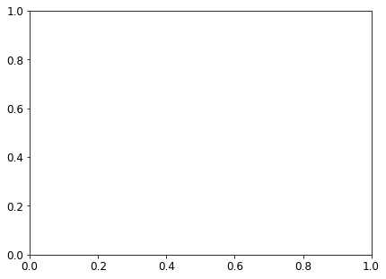
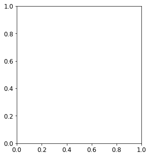

---
layout: default
title: Manual Trial-and-Error
parent: Introduction to Theory, Concepts and PEST Mechanic
nav_order: 1
---
                    ---
layout: default
title: Manual Trial-and-Error
parent: Introduction to Theory, Concepts and PEST Mechanic
nav_order: 1
math: mathjax3
---

# Manual Trial-and-Error

In the current notebook we will explore some concepts through manual history-matching (or trial-and-error). Many of these concepts are explained in greater detail in *Applied Groundwater Modeling (2nd edition)* by Anderson et al. (2015). Here, we will "manually" adjust model parameter values, run the model, and then compare model outputs to measured values. This process is repeated until the modeller is satisfied with the fit between measured and simulated values.

Before we go any further, allow us to highlight that trial-and-error history matching is rarely, if ever, sufficent in a decision-support modelling context. It can be a useful **first-step** for history-matching, mostly because it provides a modeller with insight about the site and a model's response to parameter changes. In this way, it helps to develop a modeller's "hydrosense" - the intuitive understanding of how a model behaves. It can also provide a quick form of quality control on both the model setup as well as the reasonableness of the conceptual model.

These benefits notwithstanding, trial-and-error history matching is cumbersome and highly subjective. It is inaplicable in highly-parameterized contexts (we will see why this is important in other tutorials). Comprehensive testing and identification of all insensitive and correlated parameters is not feasible, and it cannot ensure that the best quantifiable fit has been achieved. 

When undertaking decision-support modelling in practice, more rigorous, automated trial-and-error methodologies are employed. Such methods are the topics of subsequent tutorials.

**Key Point:** 
>Trial-and-error history-matching is may provide some "soft" benefit to the modeller. It does not replace automated parameter estimation.

**References:**

>Anderson, Mary P., William W. Woessner, and Randall J. Hunt. 2015. *Applied Groundwater Modeling*. Applied Groundwater Modeling. 2nd ed. Elsevier. doi:10.1016/B978-0-08-091638-5.00001-8.


### Admin

In the tutorial folder there is a file named `freyberg_trial_and_error.py`. It contains a series of functions that automate changing parameters, running the model and plotting outcomes. These make use of `flopy` and other libraries. You do not need to be familiar with these functions, only to follow along with what they are doing.


```python
import sys
import os
import warnings
warnings.filterwarnings("ignore")
warnings.filterwarnings("ignore", category=DeprecationWarning) 

import pandas as pd
import numpy as np
import matplotlib.pyplot as plt;
plt.rcParams.update({'font.size': 12})

import shutil

import freyberg_trial_and_error as te
#prepares some files for manunal trial and error
te.get_model()
```

    D:\Workspace\hugm0001\anaconda\lib\site-packages\fontTools\misc\py23.py:11: DeprecationWarning: The py23 module has been deprecated and will be removed in a future release. Please update your code.
    


    ---------------------------------------------------------------------------

    FileExistsError                           Traceback (most recent call last)

    Input In [1], in <cell line: 16>()
         14 import freyberg_trial_and_error as te
         15 #prepares some files for manunal trial and error
    ---> 16 te.get_model()
    

    File D:\Workspace\hugm0001\github\GMDSI_notebooks_fork\tutorials\part1_1_trial_and_error\freyberg_trial_and_error.py:45, in get_model()
         42     os.mkdir(sim_ws)
         44 # copy the original model folder across
    ---> 45 shutil.copytree(org_ws, sim_ws)
         47 hbd.prep_bins(sim_ws)
         49 pyemu.os_utils.run('mf6', cwd=sim_ws)
    

    File D:\Workspace\hugm0001\anaconda\lib\shutil.py:557, in copytree(src, dst, symlinks, ignore, copy_function, ignore_dangling_symlinks, dirs_exist_ok)
        555 with os.scandir(src) as itr:
        556     entries = list(itr)
    --> 557 return _copytree(entries=entries, src=src, dst=dst, symlinks=symlinks,
        558                  ignore=ignore, copy_function=copy_function,
        559                  ignore_dangling_symlinks=ignore_dangling_symlinks,
        560                  dirs_exist_ok=dirs_exist_ok)
    

    File D:\Workspace\hugm0001\anaconda\lib\shutil.py:458, in _copytree(entries, src, dst, symlinks, ignore, copy_function, ignore_dangling_symlinks, dirs_exist_ok)
        455 else:
        456     ignored_names = set()
    --> 458 os.makedirs(dst, exist_ok=dirs_exist_ok)
        459 errors = []
        460 use_srcentry = copy_function is copy2 or copy_function is copy
    

    File D:\Workspace\hugm0001\anaconda\lib\os.py:223, in makedirs(name, mode, exist_ok)
        221         return
        222 try:
    --> 223     mkdir(name, mode)
        224 except OSError:
        225     # Cannot rely on checking for EEXIST, since the operating system
        226     # could give priority to other errors like EACCES or EROFS
        227     if not exist_ok or not path.isdir(name):
    

    FileExistsError: [WinError 183] Cannot create a file when that file already exists: 'freyberg_mf6'


# Trial and Error

The `te.update_par()` function loads the modified Freyberg model (see the "freyberg intro to model" notebook), updates parameters, runs the model and then plots simulated values against measured values.

The function automates updates to:

- hydraulic conductivty (k)
- recharge

You can assign values of k to each layer through the respective `k1`,`k2` and `k3` arguments. You can adjust recharge by passing a value to the `rch_factor` argument. Recharge in the model is multipled by this factor. 

Scatter plots of measured *vs* simulated values of heads at observation wells and flows at the river are displayed. The root mean square error (RMSE) are also shown. Ideally, the aim of history-matching is to minimize RMSE.

Lastly, the model forecast of river headwater flux is compared to the "true" value. (Recall that we know the "truth" here because we generated it using the synthetic model. In the real-world, we don't know the "truth" beforehand...after all, that is why we are building a model in the first place!) 

For example:


```python
te.update_par(k1=1,     # K in layer 1
              rch_factor=0.35) # recharge is multiplied by rch_factor
```


    ---------------------------------------------------------------------------

    FileNotFoundError                         Traceback (most recent call last)

    Input In [2], in <cell line: 1>()
    ----> 1 te.update_par(k1=1,     # K in layer 1
          2               rch_factor=0.35)
    

    File D:\Workspace\hugm0001\github\GMDSI_notebooks_fork\tutorials\part1_1_trial_and_error\freyberg_trial_and_error.py:86, in update_par(k1, rch_factor, sfrplot)
         83 pyemu.os_utils.run("mf6",cwd=sim_ws)
         85 # plot results
    ---> 86 plot_simvsmeas(sim_ws, sfrplot)
         88 return
    

    File D:\Workspace\hugm0001\github\GMDSI_notebooks_fork\tutorials\part1_1_trial_and_error\freyberg_trial_and_error.py:107, in plot_simvsmeas(sim_ws, sfrplot)
        105 ax = fig.add_subplot(1,2+addcol,1)
        106 #meas = pd.read_csv(os.path.join(sim_ws, 'heads.meas.csv')).iloc[:12, 1:].values
    --> 107 obs_data = pd.read_csv(os.path.join(sim_ws, 'obs_data_ess.csv'))
        108 sim_heads = pd.read_csv(os.path.join(sim_ws, 'heads.csv'))
        110 head_sites=['TRGW-0-3-8', 'TRGW-0-26-6']
    

    File D:\Workspace\hugm0001\anaconda\lib\site-packages\pandas\util\_decorators.py:311, in deprecate_nonkeyword_arguments.<locals>.decorate.<locals>.wrapper(*args, **kwargs)
        305 if len(args) > num_allow_args:
        306     warnings.warn(
        307         msg.format(arguments=arguments),
        308         FutureWarning,
        309         stacklevel=stacklevel,
        310     )
    --> 311 return func(*args, **kwargs)
    

    File D:\Workspace\hugm0001\anaconda\lib\site-packages\pandas\io\parsers\readers.py:680, in read_csv(filepath_or_buffer, sep, delimiter, header, names, index_col, usecols, squeeze, prefix, mangle_dupe_cols, dtype, engine, converters, true_values, false_values, skipinitialspace, skiprows, skipfooter, nrows, na_values, keep_default_na, na_filter, verbose, skip_blank_lines, parse_dates, infer_datetime_format, keep_date_col, date_parser, dayfirst, cache_dates, iterator, chunksize, compression, thousands, decimal, lineterminator, quotechar, quoting, doublequote, escapechar, comment, encoding, encoding_errors, dialect, error_bad_lines, warn_bad_lines, on_bad_lines, delim_whitespace, low_memory, memory_map, float_precision, storage_options)
        665 kwds_defaults = _refine_defaults_read(
        666     dialect,
        667     delimiter,
       (...)
        676     defaults={"delimiter": ","},
        677 )
        678 kwds.update(kwds_defaults)
    --> 680 return _read(filepath_or_buffer, kwds)
    

    File D:\Workspace\hugm0001\anaconda\lib\site-packages\pandas\io\parsers\readers.py:575, in _read(filepath_or_buffer, kwds)
        572 _validate_names(kwds.get("names", None))
        574 # Create the parser.
    --> 575 parser = TextFileReader(filepath_or_buffer, **kwds)
        577 if chunksize or iterator:
        578     return parser
    

    File D:\Workspace\hugm0001\anaconda\lib\site-packages\pandas\io\parsers\readers.py:933, in TextFileReader.__init__(self, f, engine, **kwds)
        930     self.options["has_index_names"] = kwds["has_index_names"]
        932 self.handles: IOHandles | None = None
    --> 933 self._engine = self._make_engine(f, self.engine)
    

    File D:\Workspace\hugm0001\anaconda\lib\site-packages\pandas\io\parsers\readers.py:1217, in TextFileReader._make_engine(self, f, engine)
       1213     mode = "rb"
       1214 # error: No overload variant of "get_handle" matches argument types
       1215 # "Union[str, PathLike[str], ReadCsvBuffer[bytes], ReadCsvBuffer[str]]"
       1216 # , "str", "bool", "Any", "Any", "Any", "Any", "Any"
    -> 1217 self.handles = get_handle(  # type: ignore[call-overload]
       1218     f,
       1219     mode,
       1220     encoding=self.options.get("encoding", None),
       1221     compression=self.options.get("compression", None),
       1222     memory_map=self.options.get("memory_map", False),
       1223     is_text=is_text,
       1224     errors=self.options.get("encoding_errors", "strict"),
       1225     storage_options=self.options.get("storage_options", None),
       1226 )
       1227 assert self.handles is not None
       1228 f = self.handles.handle
    

    File D:\Workspace\hugm0001\anaconda\lib\site-packages\pandas\io\common.py:789, in get_handle(path_or_buf, mode, encoding, compression, memory_map, is_text, errors, storage_options)
        784 elif isinstance(handle, str):
        785     # Check whether the filename is to be opened in binary mode.
        786     # Binary mode does not support 'encoding' and 'newline'.
        787     if ioargs.encoding and "b" not in ioargs.mode:
        788         # Encoding
    --> 789         handle = open(
        790             handle,
        791             ioargs.mode,
        792             encoding=ioargs.encoding,
        793             errors=errors,
        794             newline="",
        795         )
        796     else:
        797         # Binary mode
        798         handle = open(handle, ioargs.mode)
    

    FileNotFoundError: [Errno 2] No such file or directory: 'freyberg_mf6\\obs_data_ess.csv'


    

    


### Do It Yourself

Experiment with changing values for `k1` and `rch_factor`. See if you can achieve a good fit between measured and simulated values of head and river flow (e.g. minimize RMSE). 

Whilst you are doing so, pay attention to the forecast of river flux. Does the forecast improve with a better fit for heads and/or SFR observations? Is it sensitive to some parameters more than others? 


```python
# change the parameter values untill you are happy with the fit
te.update_par(k1=8, rch_factor=1)
```


    ---------------------------------------------------------------------------

    FileNotFoundError                         Traceback (most recent call last)

    Input In [3], in <cell line: 2>()
          1 # change the parameter values untill you are happy with the fit
    ----> 2 te.update_par(k1=8, rch_factor=1)
    

    File D:\Workspace\hugm0001\github\GMDSI_notebooks_fork\tutorials\part1_1_trial_and_error\freyberg_trial_and_error.py:86, in update_par(k1, rch_factor, sfrplot)
         83 pyemu.os_utils.run("mf6",cwd=sim_ws)
         85 # plot results
    ---> 86 plot_simvsmeas(sim_ws, sfrplot)
         88 return
    

    File D:\Workspace\hugm0001\github\GMDSI_notebooks_fork\tutorials\part1_1_trial_and_error\freyberg_trial_and_error.py:107, in plot_simvsmeas(sim_ws, sfrplot)
        105 ax = fig.add_subplot(1,2+addcol,1)
        106 #meas = pd.read_csv(os.path.join(sim_ws, 'heads.meas.csv')).iloc[:12, 1:].values
    --> 107 obs_data = pd.read_csv(os.path.join(sim_ws, 'obs_data_ess.csv'))
        108 sim_heads = pd.read_csv(os.path.join(sim_ws, 'heads.csv'))
        110 head_sites=['TRGW-0-3-8', 'TRGW-0-26-6']
    

    File D:\Workspace\hugm0001\anaconda\lib\site-packages\pandas\util\_decorators.py:311, in deprecate_nonkeyword_arguments.<locals>.decorate.<locals>.wrapper(*args, **kwargs)
        305 if len(args) > num_allow_args:
        306     warnings.warn(
        307         msg.format(arguments=arguments),
        308         FutureWarning,
        309         stacklevel=stacklevel,
        310     )
    --> 311 return func(*args, **kwargs)
    

    File D:\Workspace\hugm0001\anaconda\lib\site-packages\pandas\io\parsers\readers.py:680, in read_csv(filepath_or_buffer, sep, delimiter, header, names, index_col, usecols, squeeze, prefix, mangle_dupe_cols, dtype, engine, converters, true_values, false_values, skipinitialspace, skiprows, skipfooter, nrows, na_values, keep_default_na, na_filter, verbose, skip_blank_lines, parse_dates, infer_datetime_format, keep_date_col, date_parser, dayfirst, cache_dates, iterator, chunksize, compression, thousands, decimal, lineterminator, quotechar, quoting, doublequote, escapechar, comment, encoding, encoding_errors, dialect, error_bad_lines, warn_bad_lines, on_bad_lines, delim_whitespace, low_memory, memory_map, float_precision, storage_options)
        665 kwds_defaults = _refine_defaults_read(
        666     dialect,
        667     delimiter,
       (...)
        676     defaults={"delimiter": ","},
        677 )
        678 kwds.update(kwds_defaults)
    --> 680 return _read(filepath_or_buffer, kwds)
    

    File D:\Workspace\hugm0001\anaconda\lib\site-packages\pandas\io\parsers\readers.py:575, in _read(filepath_or_buffer, kwds)
        572 _validate_names(kwds.get("names", None))
        574 # Create the parser.
    --> 575 parser = TextFileReader(filepath_or_buffer, **kwds)
        577 if chunksize or iterator:
        578     return parser
    

    File D:\Workspace\hugm0001\anaconda\lib\site-packages\pandas\io\parsers\readers.py:933, in TextFileReader.__init__(self, f, engine, **kwds)
        930     self.options["has_index_names"] = kwds["has_index_names"]
        932 self.handles: IOHandles | None = None
    --> 933 self._engine = self._make_engine(f, self.engine)
    

    File D:\Workspace\hugm0001\anaconda\lib\site-packages\pandas\io\parsers\readers.py:1217, in TextFileReader._make_engine(self, f, engine)
       1213     mode = "rb"
       1214 # error: No overload variant of "get_handle" matches argument types
       1215 # "Union[str, PathLike[str], ReadCsvBuffer[bytes], ReadCsvBuffer[str]]"
       1216 # , "str", "bool", "Any", "Any", "Any", "Any", "Any"
    -> 1217 self.handles = get_handle(  # type: ignore[call-overload]
       1218     f,
       1219     mode,
       1220     encoding=self.options.get("encoding", None),
       1221     compression=self.options.get("compression", None),
       1222     memory_map=self.options.get("memory_map", False),
       1223     is_text=is_text,
       1224     errors=self.options.get("encoding_errors", "strict"),
       1225     storage_options=self.options.get("storage_options", None),
       1226 )
       1227 assert self.handles is not None
       1228 f = self.handles.handle
    

    File D:\Workspace\hugm0001\anaconda\lib\site-packages\pandas\io\common.py:789, in get_handle(path_or_buf, mode, encoding, compression, memory_map, is_text, errors, storage_options)
        784 elif isinstance(handle, str):
        785     # Check whether the filename is to be opened in binary mode.
        786     # Binary mode does not support 'encoding' and 'newline'.
        787     if ioargs.encoding and "b" not in ioargs.mode:
        788         # Encoding
    --> 789         handle = open(
        790             handle,
        791             ioargs.mode,
        792             encoding=ioargs.encoding,
        793             errors=errors,
        794             newline="",
        795         )
        796     else:
        797         # Binary mode
        798         handle = open(handle, ioargs.mode)
    

    FileNotFoundError: [Errno 2] No such file or directory: 'freyberg_mf6\\obs_data_ess.csv'


    

    


### Non-Uniqueness and Correlated Parameters

So you may have found that values of `k1`=4, and `rch_factor`=1.1 provide a decent fit.

...but hold on! What's this? If we assign `k1`=10,  `rch_factor`=2, results look very similar. Oh dear.

So which one is correct? Well looking at the forecast...hmm...looks like neither is correct! 


```python
te.update_par(k1=4, rch_factor=1.1)
```


    ---------------------------------------------------------------------------

    FileNotFoundError                         Traceback (most recent call last)

    Input In [4], in <cell line: 1>()
    ----> 1 te.update_par(k1=4, rch_factor=1.1)
    

    File D:\Workspace\hugm0001\github\GMDSI_notebooks_fork\tutorials\part1_1_trial_and_error\freyberg_trial_and_error.py:86, in update_par(k1, rch_factor, sfrplot)
         83 pyemu.os_utils.run("mf6",cwd=sim_ws)
         85 # plot results
    ---> 86 plot_simvsmeas(sim_ws, sfrplot)
         88 return
    

    File D:\Workspace\hugm0001\github\GMDSI_notebooks_fork\tutorials\part1_1_trial_and_error\freyberg_trial_and_error.py:107, in plot_simvsmeas(sim_ws, sfrplot)
        105 ax = fig.add_subplot(1,2+addcol,1)
        106 #meas = pd.read_csv(os.path.join(sim_ws, 'heads.meas.csv')).iloc[:12, 1:].values
    --> 107 obs_data = pd.read_csv(os.path.join(sim_ws, 'obs_data_ess.csv'))
        108 sim_heads = pd.read_csv(os.path.join(sim_ws, 'heads.csv'))
        110 head_sites=['TRGW-0-3-8', 'TRGW-0-26-6']
    

    File D:\Workspace\hugm0001\anaconda\lib\site-packages\pandas\util\_decorators.py:311, in deprecate_nonkeyword_arguments.<locals>.decorate.<locals>.wrapper(*args, **kwargs)
        305 if len(args) > num_allow_args:
        306     warnings.warn(
        307         msg.format(arguments=arguments),
        308         FutureWarning,
        309         stacklevel=stacklevel,
        310     )
    --> 311 return func(*args, **kwargs)
    

    File D:\Workspace\hugm0001\anaconda\lib\site-packages\pandas\io\parsers\readers.py:680, in read_csv(filepath_or_buffer, sep, delimiter, header, names, index_col, usecols, squeeze, prefix, mangle_dupe_cols, dtype, engine, converters, true_values, false_values, skipinitialspace, skiprows, skipfooter, nrows, na_values, keep_default_na, na_filter, verbose, skip_blank_lines, parse_dates, infer_datetime_format, keep_date_col, date_parser, dayfirst, cache_dates, iterator, chunksize, compression, thousands, decimal, lineterminator, quotechar, quoting, doublequote, escapechar, comment, encoding, encoding_errors, dialect, error_bad_lines, warn_bad_lines, on_bad_lines, delim_whitespace, low_memory, memory_map, float_precision, storage_options)
        665 kwds_defaults = _refine_defaults_read(
        666     dialect,
        667     delimiter,
       (...)
        676     defaults={"delimiter": ","},
        677 )
        678 kwds.update(kwds_defaults)
    --> 680 return _read(filepath_or_buffer, kwds)
    

    File D:\Workspace\hugm0001\anaconda\lib\site-packages\pandas\io\parsers\readers.py:575, in _read(filepath_or_buffer, kwds)
        572 _validate_names(kwds.get("names", None))
        574 # Create the parser.
    --> 575 parser = TextFileReader(filepath_or_buffer, **kwds)
        577 if chunksize or iterator:
        578     return parser
    

    File D:\Workspace\hugm0001\anaconda\lib\site-packages\pandas\io\parsers\readers.py:933, in TextFileReader.__init__(self, f, engine, **kwds)
        930     self.options["has_index_names"] = kwds["has_index_names"]
        932 self.handles: IOHandles | None = None
    --> 933 self._engine = self._make_engine(f, self.engine)
    

    File D:\Workspace\hugm0001\anaconda\lib\site-packages\pandas\io\parsers\readers.py:1217, in TextFileReader._make_engine(self, f, engine)
       1213     mode = "rb"
       1214 # error: No overload variant of "get_handle" matches argument types
       1215 # "Union[str, PathLike[str], ReadCsvBuffer[bytes], ReadCsvBuffer[str]]"
       1216 # , "str", "bool", "Any", "Any", "Any", "Any", "Any"
    -> 1217 self.handles = get_handle(  # type: ignore[call-overload]
       1218     f,
       1219     mode,
       1220     encoding=self.options.get("encoding", None),
       1221     compression=self.options.get("compression", None),
       1222     memory_map=self.options.get("memory_map", False),
       1223     is_text=is_text,
       1224     errors=self.options.get("encoding_errors", "strict"),
       1225     storage_options=self.options.get("storage_options", None),
       1226 )
       1227 assert self.handles is not None
       1228 f = self.handles.handle
    

    File D:\Workspace\hugm0001\anaconda\lib\site-packages\pandas\io\common.py:789, in get_handle(path_or_buf, mode, encoding, compression, memory_map, is_text, errors, storage_options)
        784 elif isinstance(handle, str):
        785     # Check whether the filename is to be opened in binary mode.
        786     # Binary mode does not support 'encoding' and 'newline'.
        787     if ioargs.encoding and "b" not in ioargs.mode:
        788         # Encoding
    --> 789         handle = open(
        790             handle,
        791             ioargs.mode,
        792             encoding=ioargs.encoding,
        793             errors=errors,
        794             newline="",
        795         )
        796     else:
        797         # Binary mode
        798         handle = open(handle, ioargs.mode)
    

    FileNotFoundError: [Errno 2] No such file or directory: 'freyberg_mf6\\obs_data_ess.csv'


    

    


```python
te.update_par(k1=10,  rch_factor=2.0)
```


    ---------------------------------------------------------------------------

    FileNotFoundError                         Traceback (most recent call last)

    Input In [5], in <cell line: 1>()
    ----> 1 te.update_par(k1=10,  rch_factor=2.0)
    

    File D:\Workspace\hugm0001\github\GMDSI_notebooks_fork\tutorials\part1_1_trial_and_error\freyberg_trial_and_error.py:86, in update_par(k1, rch_factor, sfrplot)
         83 pyemu.os_utils.run("mf6",cwd=sim_ws)
         85 # plot results
    ---> 86 plot_simvsmeas(sim_ws, sfrplot)
         88 return
    

    File D:\Workspace\hugm0001\github\GMDSI_notebooks_fork\tutorials\part1_1_trial_and_error\freyberg_trial_and_error.py:107, in plot_simvsmeas(sim_ws, sfrplot)
        105 ax = fig.add_subplot(1,2+addcol,1)
        106 #meas = pd.read_csv(os.path.join(sim_ws, 'heads.meas.csv')).iloc[:12, 1:].values
    --> 107 obs_data = pd.read_csv(os.path.join(sim_ws, 'obs_data_ess.csv'))
        108 sim_heads = pd.read_csv(os.path.join(sim_ws, 'heads.csv'))
        110 head_sites=['TRGW-0-3-8', 'TRGW-0-26-6']
    

    File D:\Workspace\hugm0001\anaconda\lib\site-packages\pandas\util\_decorators.py:311, in deprecate_nonkeyword_arguments.<locals>.decorate.<locals>.wrapper(*args, **kwargs)
        305 if len(args) > num_allow_args:
        306     warnings.warn(
        307         msg.format(arguments=arguments),
        308         FutureWarning,
        309         stacklevel=stacklevel,
        310     )
    --> 311 return func(*args, **kwargs)
    

    File D:\Workspace\hugm0001\anaconda\lib\site-packages\pandas\io\parsers\readers.py:680, in read_csv(filepath_or_buffer, sep, delimiter, header, names, index_col, usecols, squeeze, prefix, mangle_dupe_cols, dtype, engine, converters, true_values, false_values, skipinitialspace, skiprows, skipfooter, nrows, na_values, keep_default_na, na_filter, verbose, skip_blank_lines, parse_dates, infer_datetime_format, keep_date_col, date_parser, dayfirst, cache_dates, iterator, chunksize, compression, thousands, decimal, lineterminator, quotechar, quoting, doublequote, escapechar, comment, encoding, encoding_errors, dialect, error_bad_lines, warn_bad_lines, on_bad_lines, delim_whitespace, low_memory, memory_map, float_precision, storage_options)
        665 kwds_defaults = _refine_defaults_read(
        666     dialect,
        667     delimiter,
       (...)
        676     defaults={"delimiter": ","},
        677 )
        678 kwds.update(kwds_defaults)
    --> 680 return _read(filepath_or_buffer, kwds)
    

    File D:\Workspace\hugm0001\anaconda\lib\site-packages\pandas\io\parsers\readers.py:575, in _read(filepath_or_buffer, kwds)
        572 _validate_names(kwds.get("names", None))
        574 # Create the parser.
    --> 575 parser = TextFileReader(filepath_or_buffer, **kwds)
        577 if chunksize or iterator:
        578     return parser
    

    File D:\Workspace\hugm0001\anaconda\lib\site-packages\pandas\io\parsers\readers.py:933, in TextFileReader.__init__(self, f, engine, **kwds)
        930     self.options["has_index_names"] = kwds["has_index_names"]
        932 self.handles: IOHandles | None = None
    --> 933 self._engine = self._make_engine(f, self.engine)
    

    File D:\Workspace\hugm0001\anaconda\lib\site-packages\pandas\io\parsers\readers.py:1217, in TextFileReader._make_engine(self, f, engine)
       1213     mode = "rb"
       1214 # error: No overload variant of "get_handle" matches argument types
       1215 # "Union[str, PathLike[str], ReadCsvBuffer[bytes], ReadCsvBuffer[str]]"
       1216 # , "str", "bool", "Any", "Any", "Any", "Any", "Any"
    -> 1217 self.handles = get_handle(  # type: ignore[call-overload]
       1218     f,
       1219     mode,
       1220     encoding=self.options.get("encoding", None),
       1221     compression=self.options.get("compression", None),
       1222     memory_map=self.options.get("memory_map", False),
       1223     is_text=is_text,
       1224     errors=self.options.get("encoding_errors", "strict"),
       1225     storage_options=self.options.get("storage_options", None),
       1226 )
       1227 assert self.handles is not None
       1228 f = self.handles.handle
    

    File D:\Workspace\hugm0001\anaconda\lib\site-packages\pandas\io\common.py:789, in get_handle(path_or_buf, mode, encoding, compression, memory_map, is_text, errors, storage_options)
        784 elif isinstance(handle, str):
        785     # Check whether the filename is to be opened in binary mode.
        786     # Binary mode does not support 'encoding' and 'newline'.
        787     if ioargs.encoding and "b" not in ioargs.mode:
        788         # Encoding
    --> 789         handle = open(
        790             handle,
        791             ioargs.mode,
        792             encoding=ioargs.encoding,
        793             errors=errors,
        794             newline="",
        795         )
        796     else:
        797         # Binary mode
        798         handle = open(handle, ioargs.mode)
    

    FileNotFoundError: [Errno 2] No such file or directory: 'freyberg_mf6\\obs_data_ess.csv'


    

    


One option is to use multiple types of observation data. Using heads & flows as calibration targets helps to constrain parameters which are informed by different sources of information. The same applies for secondary observations; e.g. vertical head differences for vertical conectivity and time-differences for storage or transport parameters.

See if accounting for the fit with stream gage data helps:


```python
te.update_par(k1=4, rch_factor=1.1, sfrplot=True)
```


    ---------------------------------------------------------------------------

    FileNotFoundError                         Traceback (most recent call last)

    Input In [6], in <cell line: 1>()
    ----> 1 te.update_par(k1=4, rch_factor=1.1, sfrplot=True)
    

    File D:\Workspace\hugm0001\github\GMDSI_notebooks_fork\tutorials\part1_1_trial_and_error\freyberg_trial_and_error.py:86, in update_par(k1, rch_factor, sfrplot)
         83 pyemu.os_utils.run("mf6",cwd=sim_ws)
         85 # plot results
    ---> 86 plot_simvsmeas(sim_ws, sfrplot)
         88 return
    

    File D:\Workspace\hugm0001\github\GMDSI_notebooks_fork\tutorials\part1_1_trial_and_error\freyberg_trial_and_error.py:107, in plot_simvsmeas(sim_ws, sfrplot)
        105 ax = fig.add_subplot(1,2+addcol,1)
        106 #meas = pd.read_csv(os.path.join(sim_ws, 'heads.meas.csv')).iloc[:12, 1:].values
    --> 107 obs_data = pd.read_csv(os.path.join(sim_ws, 'obs_data_ess.csv'))
        108 sim_heads = pd.read_csv(os.path.join(sim_ws, 'heads.csv'))
        110 head_sites=['TRGW-0-3-8', 'TRGW-0-26-6']
    

    File D:\Workspace\hugm0001\anaconda\lib\site-packages\pandas\util\_decorators.py:311, in deprecate_nonkeyword_arguments.<locals>.decorate.<locals>.wrapper(*args, **kwargs)
        305 if len(args) > num_allow_args:
        306     warnings.warn(
        307         msg.format(arguments=arguments),
        308         FutureWarning,
        309         stacklevel=stacklevel,
        310     )
    --> 311 return func(*args, **kwargs)
    

    File D:\Workspace\hugm0001\anaconda\lib\site-packages\pandas\io\parsers\readers.py:680, in read_csv(filepath_or_buffer, sep, delimiter, header, names, index_col, usecols, squeeze, prefix, mangle_dupe_cols, dtype, engine, converters, true_values, false_values, skipinitialspace, skiprows, skipfooter, nrows, na_values, keep_default_na, na_filter, verbose, skip_blank_lines, parse_dates, infer_datetime_format, keep_date_col, date_parser, dayfirst, cache_dates, iterator, chunksize, compression, thousands, decimal, lineterminator, quotechar, quoting, doublequote, escapechar, comment, encoding, encoding_errors, dialect, error_bad_lines, warn_bad_lines, on_bad_lines, delim_whitespace, low_memory, memory_map, float_precision, storage_options)
        665 kwds_defaults = _refine_defaults_read(
        666     dialect,
        667     delimiter,
       (...)
        676     defaults={"delimiter": ","},
        677 )
        678 kwds.update(kwds_defaults)
    --> 680 return _read(filepath_or_buffer, kwds)
    

    File D:\Workspace\hugm0001\anaconda\lib\site-packages\pandas\io\parsers\readers.py:575, in _read(filepath_or_buffer, kwds)
        572 _validate_names(kwds.get("names", None))
        574 # Create the parser.
    --> 575 parser = TextFileReader(filepath_or_buffer, **kwds)
        577 if chunksize or iterator:
        578     return parser
    

    File D:\Workspace\hugm0001\anaconda\lib\site-packages\pandas\io\parsers\readers.py:933, in TextFileReader.__init__(self, f, engine, **kwds)
        930     self.options["has_index_names"] = kwds["has_index_names"]
        932 self.handles: IOHandles | None = None
    --> 933 self._engine = self._make_engine(f, self.engine)
    

    File D:\Workspace\hugm0001\anaconda\lib\site-packages\pandas\io\parsers\readers.py:1217, in TextFileReader._make_engine(self, f, engine)
       1213     mode = "rb"
       1214 # error: No overload variant of "get_handle" matches argument types
       1215 # "Union[str, PathLike[str], ReadCsvBuffer[bytes], ReadCsvBuffer[str]]"
       1216 # , "str", "bool", "Any", "Any", "Any", "Any", "Any"
    -> 1217 self.handles = get_handle(  # type: ignore[call-overload]
       1218     f,
       1219     mode,
       1220     encoding=self.options.get("encoding", None),
       1221     compression=self.options.get("compression", None),
       1222     memory_map=self.options.get("memory_map", False),
       1223     is_text=is_text,
       1224     errors=self.options.get("encoding_errors", "strict"),
       1225     storage_options=self.options.get("storage_options", None),
       1226 )
       1227 assert self.handles is not None
       1228 f = self.handles.handle
    

    File D:\Workspace\hugm0001\anaconda\lib\site-packages\pandas\io\common.py:789, in get_handle(path_or_buf, mode, encoding, compression, memory_map, is_text, errors, storage_options)
        784 elif isinstance(handle, str):
        785     # Check whether the filename is to be opened in binary mode.
        786     # Binary mode does not support 'encoding' and 'newline'.
        787     if ioargs.encoding and "b" not in ioargs.mode:
        788         # Encoding
    --> 789         handle = open(
        790             handle,
        791             ioargs.mode,
        792             encoding=ioargs.encoding,
        793             errors=errors,
        794             newline="",
        795         )
        796     else:
        797         # Binary mode
        798         handle = open(handle, ioargs.mode)
    

    FileNotFoundError: [Errno 2] No such file or directory: 'freyberg_mf6\\obs_data_ess.csv'


    

    


### Structural Error

Can you find a parameter combination that results in a "correct" forecast? What do the corresponding fits with observation data look like? 


```python
te.update_par(k1=4, rch_factor=1.1, sfrplot=True)
```


    ---------------------------------------------------------------------------

    FileNotFoundError                         Traceback (most recent call last)

    Input In [7], in <cell line: 1>()
    ----> 1 te.update_par(k1=4, rch_factor=1.1, sfrplot=True)
    

    File D:\Workspace\hugm0001\github\GMDSI_notebooks_fork\tutorials\part1_1_trial_and_error\freyberg_trial_and_error.py:86, in update_par(k1, rch_factor, sfrplot)
         83 pyemu.os_utils.run("mf6",cwd=sim_ws)
         85 # plot results
    ---> 86 plot_simvsmeas(sim_ws, sfrplot)
         88 return
    

    File D:\Workspace\hugm0001\github\GMDSI_notebooks_fork\tutorials\part1_1_trial_and_error\freyberg_trial_and_error.py:107, in plot_simvsmeas(sim_ws, sfrplot)
        105 ax = fig.add_subplot(1,2+addcol,1)
        106 #meas = pd.read_csv(os.path.join(sim_ws, 'heads.meas.csv')).iloc[:12, 1:].values
    --> 107 obs_data = pd.read_csv(os.path.join(sim_ws, 'obs_data_ess.csv'))
        108 sim_heads = pd.read_csv(os.path.join(sim_ws, 'heads.csv'))
        110 head_sites=['TRGW-0-3-8', 'TRGW-0-26-6']
    

    File D:\Workspace\hugm0001\anaconda\lib\site-packages\pandas\util\_decorators.py:311, in deprecate_nonkeyword_arguments.<locals>.decorate.<locals>.wrapper(*args, **kwargs)
        305 if len(args) > num_allow_args:
        306     warnings.warn(
        307         msg.format(arguments=arguments),
        308         FutureWarning,
        309         stacklevel=stacklevel,
        310     )
    --> 311 return func(*args, **kwargs)
    

    File D:\Workspace\hugm0001\anaconda\lib\site-packages\pandas\io\parsers\readers.py:680, in read_csv(filepath_or_buffer, sep, delimiter, header, names, index_col, usecols, squeeze, prefix, mangle_dupe_cols, dtype, engine, converters, true_values, false_values, skipinitialspace, skiprows, skipfooter, nrows, na_values, keep_default_na, na_filter, verbose, skip_blank_lines, parse_dates, infer_datetime_format, keep_date_col, date_parser, dayfirst, cache_dates, iterator, chunksize, compression, thousands, decimal, lineterminator, quotechar, quoting, doublequote, escapechar, comment, encoding, encoding_errors, dialect, error_bad_lines, warn_bad_lines, on_bad_lines, delim_whitespace, low_memory, memory_map, float_precision, storage_options)
        665 kwds_defaults = _refine_defaults_read(
        666     dialect,
        667     delimiter,
       (...)
        676     defaults={"delimiter": ","},
        677 )
        678 kwds.update(kwds_defaults)
    --> 680 return _read(filepath_or_buffer, kwds)
    

    File D:\Workspace\hugm0001\anaconda\lib\site-packages\pandas\io\parsers\readers.py:575, in _read(filepath_or_buffer, kwds)
        572 _validate_names(kwds.get("names", None))
        574 # Create the parser.
    --> 575 parser = TextFileReader(filepath_or_buffer, **kwds)
        577 if chunksize or iterator:
        578     return parser
    

    File D:\Workspace\hugm0001\anaconda\lib\site-packages\pandas\io\parsers\readers.py:933, in TextFileReader.__init__(self, f, engine, **kwds)
        930     self.options["has_index_names"] = kwds["has_index_names"]
        932 self.handles: IOHandles | None = None
    --> 933 self._engine = self._make_engine(f, self.engine)
    

    File D:\Workspace\hugm0001\anaconda\lib\site-packages\pandas\io\parsers\readers.py:1217, in TextFileReader._make_engine(self, f, engine)
       1213     mode = "rb"
       1214 # error: No overload variant of "get_handle" matches argument types
       1215 # "Union[str, PathLike[str], ReadCsvBuffer[bytes], ReadCsvBuffer[str]]"
       1216 # , "str", "bool", "Any", "Any", "Any", "Any", "Any"
    -> 1217 self.handles = get_handle(  # type: ignore[call-overload]
       1218     f,
       1219     mode,
       1220     encoding=self.options.get("encoding", None),
       1221     compression=self.options.get("compression", None),
       1222     memory_map=self.options.get("memory_map", False),
       1223     is_text=is_text,
       1224     errors=self.options.get("encoding_errors", "strict"),
       1225     storage_options=self.options.get("storage_options", None),
       1226 )
       1227 assert self.handles is not None
       1228 f = self.handles.handle
    

    File D:\Workspace\hugm0001\anaconda\lib\site-packages\pandas\io\common.py:789, in get_handle(path_or_buf, mode, encoding, compression, memory_map, is_text, errors, storage_options)
        784 elif isinstance(handle, str):
        785     # Check whether the filename is to be opened in binary mode.
        786     # Binary mode does not support 'encoding' and 'newline'.
        787     if ioargs.encoding and "b" not in ioargs.mode:
        788         # Encoding
    --> 789         handle = open(
        790             handle,
        791             ioargs.mode,
        792             encoding=ioargs.encoding,
        793             errors=errors,
        794             newline="",
        795         )
        796     else:
        797         # Binary mode
        798         handle = open(handle, ioargs.mode)
    

    FileNotFoundError: [Errno 2] No such file or directory: 'freyberg_mf6\\obs_data_ess.csv'


    

    


So...is history-matching a lie? It seems to make our model worse at making a prediction! 

Well, in this case it does. This is because our model is *oversimplified*. We are introducing *structural error* by using a single parameter value for each model layer, ignoring the potential for parameter heterogeneity. We touched on this in the "intro to regression" notebook and we will revisit it again in other tutorials.

## Final Remarks

Hopefully after this gruelling exercise you have learnt the value (and lack-thereof) of manual trial-and-error history-matching. We have seen that:

1. Decisions on which parameters to change, in what order and by how much is subjective and will be subject to each modeller's biases. Thus trial-and-error history matching is not provide a transparent and reproducible process. Nor does it provide a quantifiable "best fit" for a given model.
2. Here we adjusted 4 parameters. As we saw, this *oversimplified* parameterisation introduced structural error, biasing our prediction. History-matching such a model can actually harm its usefullness to support a decision. Increasing the number of parameters reduces this propensity for bias. But handling more parameters manually quickly becomes an impossible task.
3. We saw that certain combinations of parameters can provide similar, or even equal, fits with measured data. Manually identifying parameter correlation is challenging, to say the least. And, once identified, a modeller is forced to (subjectively) choose which parameters to fix, and which to adjust.
4. Perhaps most importantly, once again we saw that a good fit with measured data does not equate to a correct prediction. To be usefull in a decision-support context, prediction uncertainty must be characterized.

