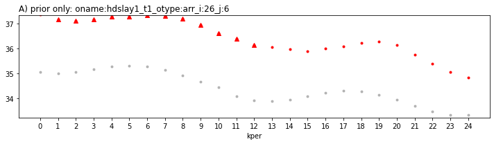
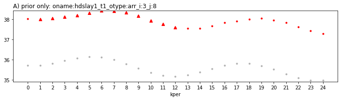

# Prepare for sequential data assimilation

Sequential state-parameter estimation is a whole new beast for the PEST world.  Every other tool in PEST and PEST++ operate on the concept of "batch" estimation, where the model is run forward for the full simulation period and PEST(++) simply calls the model and reads the results.  In sequential estimation, PESTPP-DA takes control of the advancing of simulation time.  This opens up some powerful new analyses but requires us to heavily modify the PEST interface and model itself.  This horrible notebook does that...

### The modified Freyberg PEST dataset

The modified Freyberg model is introduced in another tutorial notebook (see "freyberg intro to model"). The current notebook picks up following the "freyberg psfrom pest setup" notebook, in which a high-dimensional PEST dataset was constructed using `pyemu.PstFrom`. You may also wish to go through the "intro to pyemu" notebook beforehand.

The next couple of cells load necessary dependencies and call a convenience function to prepare the PEST dataset folder for you. This is the same dataset that was constructed during the "freyberg pstfrom pest setup" tutorial. Simply press `shift+enter` to run the cells.

### Admin

The next couple of cells load necessary dependencies and call a convenience function to prepare the PEST dataset folder for you. Simply press `shift+enter` to run the cells.


```python
import os
import shutil
from datetime import datetime
import warnings
warnings.filterwarnings("ignore")
warnings.filterwarnings("ignore", category=DeprecationWarning) 

import pandas as pd
import numpy as np
import matplotlib.pyplot as plt;


import sys
sys.path.insert(0,os.path.join("..", "..", "dependencies"))
import pyemu
import flopy
assert "dependencies" in flopy.__file__
assert "dependencies" in pyemu.__file__
sys.path.insert(0,"..")
import herebedragons as hbd


```


```python
# specify the temporary working folder
t_d = os.path.join('freyberg6_da_template')

org_t_d = os.path.join("..","part2_2_obs_and_weights","freyberg6_template")
if not os.path.exists(org_t_d):
    raise Exception("you need to run the '/part2_2_obs_and_weights/freyberg_obs_and_weights.ipynb' notebook")

if os.path.exists(t_d):
    shutil.rmtree(t_d)
shutil.copytree(org_t_d,t_d)
```


    'freyberg6_da_template'


## Modify the model itself

There are several modifications we need to make to both the model and pest interface in order to go from batch estimation to sequential estimation.  First, we need to make the model a single stress period model - PESTPP-DA will take control of the advancement of simulation time...


```python
with open(os.path.join(t_d,"freyberg6.tdis"),'w') as f:
    f.write("# new tdis written hastily at {0}\n]\n".format(datetime.now()))
    f.write("BEGIN options\n  TIME_UNITS days\nEND options\n\n")
    f.write("BEGIN dimensions\n  NPER 1\nEND dimensions\n\n")
    f.write("BEGIN perioddata\n  1.0  1 1.0\nEND perioddata\n\n")

          
```

Now, just make sure we havent done something dumb (er than usual):


```python
pyemu.os_utils.run("mf6",cwd=t_d)
```

# Now for the hard part: modifying the interface from batch to sequential

## This is going to be rough...

First, let's assign cycle numbers to the time-varying parameters and their template files.  The "cycle" concept is core to squential estimation with PESTPP-DA.  A cycle can be thought of as a unit of simulation time that we are interested in. In the PEST interface, a cycle defines a set of parameters and observations, so you can think of a cycle as a "sub-problem" in the PEST since - PESTPP-DA creates this subproblem under the hood for us. For a given cycle, we will "assimilate" all non-zero weighted obsevations in that cycle using the adjustable parameters and states in that cycle.  If a parameter/observation (and associated input/outputs files) are assigned a cycle value of -1, that means it applies to all cycles. 


```python
pst_path = os.path.join(t_d, 'freyberg_mf6.pst')
pst = pyemu.Pst(pst_path)
if "observed" not in pst.observation_data.columns:
    raise Exception("you need to run the '/part2_obs_and_weights/freyberg_obs_and_weights.ipynb' notebook")
```


```python
df = pst.model_input_data
df
```


<div>
<style scoped>
    .dataframe tbody tr th:only-of-type {
        vertical-align: middle;
    }

    .dataframe tbody tr th {
        vertical-align: top;
    }

    .dataframe thead th {
        text-align: right;
    }
</style>
<table border="1" class="dataframe">
  <thead>
    <tr style="text-align: right;">
      <th></th>
      <th>pest_file</th>
      <th>model_file</th>
    </tr>
  </thead>
  <tbody>
    <tr>
      <th>0</th>
      <td>npfklayer1gr_inst0_grid.csv.tpl</td>
      <td>mult\npfklayer1gr_inst0_grid.csv</td>
    </tr>
    <tr>
      <th>1</th>
      <td>npfklayer1pp_inst0pp.dat.tpl</td>
      <td>npfklayer1pp_inst0pp.dat</td>
    </tr>
    <tr>
      <th>2</th>
      <td>npfklayer1cn_inst0_constant.csv.tpl</td>
      <td>mult\npfklayer1cn_inst0_constant.csv</td>
    </tr>
    <tr>
      <th>3</th>
      <td>npfk33layer1gr_inst0_grid.csv.tpl</td>
      <td>mult\npfk33layer1gr_inst0_grid.csv</td>
    </tr>
    <tr>
      <th>4</th>
      <td>npfk33layer1pp_inst0pp.dat.tpl</td>
      <td>npfk33layer1pp_inst0pp.dat</td>
    </tr>
    <tr>
      <th>...</th>
      <td>...</td>
      <td>...</td>
    </tr>
    <tr>
      <th>146</th>
      <td>welgrd_inst24_grid.csv.tpl</td>
      <td>mult\welgrd_inst24_grid.csv</td>
    </tr>
    <tr>
      <th>147</th>
      <td>sfrcondgr_inst0_grid.csv.tpl</td>
      <td>mult\sfrcondgr_inst0_grid.csv</td>
    </tr>
    <tr>
      <th>148</th>
      <td>sfrcondcn_inst0_constant.csv.tpl</td>
      <td>mult\sfrcondcn_inst0_constant.csv</td>
    </tr>
    <tr>
      <th>149</th>
      <td>sfrgr_inst0_grid.csv.tpl</td>
      <td>mult\sfrgr_inst0_grid.csv</td>
    </tr>
    <tr>
      <th>150</th>
      <td>freyberg6.ic_strt_layer1.txt.tpl</td>
      <td>org\freyberg6.ic_strt_layer1.txt</td>
    </tr>
  </tbody>
</table>
<p>151 rows × 2 columns</p>
</div>


```python
df.loc[:,"cycle"] = -1
```

Here we want to assign the template file info associated with time-varying SFR parameters to the appropriate cycle - this includes resetting the actual model-input filename since we only have only stress period in the model now


```python
sfrdf = df.loc[df.pest_file.apply(lambda x: "sfr" in x and "cond" not in x),:]
sfrdf.loc[:,"inst"] = sfrdf.pest_file.apply(lambda x: int(x.split("inst")[1].split("_")[0]))
sfrdf.loc[:,"model_file"] = sfrdf.model_file.iloc[0]
sfrdf.head()
```


<div>
<style scoped>
    .dataframe tbody tr th:only-of-type {
        vertical-align: middle;
    }

    .dataframe tbody tr th {
        vertical-align: top;
    }

    .dataframe thead th {
        text-align: right;
    }
</style>
<table border="1" class="dataframe">
  <thead>
    <tr style="text-align: right;">
      <th></th>
      <th>pest_file</th>
      <th>model_file</th>
      <th>cycle</th>
      <th>inst</th>
    </tr>
  </thead>
  <tbody>
    <tr>
      <th>149</th>
      <td>sfrgr_inst0_grid.csv.tpl</td>
      <td>mult\sfrgr_inst0_grid.csv</td>
      <td>-1</td>
      <td>0</td>
    </tr>
  </tbody>
</table>
</div>


```python
df.loc[sfrdf.index,"cycle"] = sfrdf.inst.values
df.loc[sfrdf.index,"model_file"] = sfrdf.model_file.values

df.loc[sfrdf.index,:]
```


<div>
<style scoped>
    .dataframe tbody tr th:only-of-type {
        vertical-align: middle;
    }

    .dataframe tbody tr th {
        vertical-align: top;
    }

    .dataframe thead th {
        text-align: right;
    }
</style>
<table border="1" class="dataframe">
  <thead>
    <tr style="text-align: right;">
      <th></th>
      <th>pest_file</th>
      <th>model_file</th>
      <th>cycle</th>
    </tr>
  </thead>
  <tbody>
    <tr>
      <th>149</th>
      <td>sfrgr_inst0_grid.csv.tpl</td>
      <td>mult\sfrgr_inst0_grid.csv</td>
      <td>0</td>
    </tr>
  </tbody>
</table>
</div>


And the same for the template files associated with the WEL package time-varying parameters 


```python
weldf = df.loc[df.pest_file.str.contains('wel'),:]
df.loc[weldf.index,"cycle"] = weldf.pest_file.apply(lambda x: int(x.split("inst")[1].split("_")[0]))
grdf = weldf.loc[weldf.pest_file.str.contains("welgrd"),:]
df.loc[grdf.index,"model_file"] = grdf.model_file.iloc[0]
cndf = weldf.loc[weldf.pest_file.str.contains("welcst"),:]
df.loc[cndf.index,"model_file"] = cndf.model_file.iloc[0]

df.loc[weldf.index,:]
```


<div>
<style scoped>
    .dataframe tbody tr th:only-of-type {
        vertical-align: middle;
    }

    .dataframe tbody tr th {
        vertical-align: top;
    }

    .dataframe thead th {
        text-align: right;
    }
</style>
<table border="1" class="dataframe">
  <thead>
    <tr style="text-align: right;">
      <th></th>
      <th>pest_file</th>
      <th>model_file</th>
      <th>cycle</th>
    </tr>
  </thead>
  <tbody>
    <tr>
      <th>97</th>
      <td>welcst_inst0_constant.csv.tpl</td>
      <td>mult\welcst_inst0_constant.csv</td>
      <td>0</td>
    </tr>
    <tr>
      <th>98</th>
      <td>welgrd_inst0_grid.csv.tpl</td>
      <td>mult\welgrd_inst0_grid.csv</td>
      <td>0</td>
    </tr>
    <tr>
      <th>99</th>
      <td>welcst_inst1_constant.csv.tpl</td>
      <td>mult\welcst_inst0_constant.csv</td>
      <td>1</td>
    </tr>
    <tr>
      <th>100</th>
      <td>welgrd_inst1_grid.csv.tpl</td>
      <td>mult\welgrd_inst0_grid.csv</td>
      <td>1</td>
    </tr>
    <tr>
      <th>101</th>
      <td>welcst_inst2_constant.csv.tpl</td>
      <td>mult\welcst_inst0_constant.csv</td>
      <td>2</td>
    </tr>
    <tr>
      <th>102</th>
      <td>welgrd_inst2_grid.csv.tpl</td>
      <td>mult\welgrd_inst0_grid.csv</td>
      <td>2</td>
    </tr>
    <tr>
      <th>103</th>
      <td>welcst_inst3_constant.csv.tpl</td>
      <td>mult\welcst_inst0_constant.csv</td>
      <td>3</td>
    </tr>
    <tr>
      <th>104</th>
      <td>welgrd_inst3_grid.csv.tpl</td>
      <td>mult\welgrd_inst0_grid.csv</td>
      <td>3</td>
    </tr>
    <tr>
      <th>105</th>
      <td>welcst_inst4_constant.csv.tpl</td>
      <td>mult\welcst_inst0_constant.csv</td>
      <td>4</td>
    </tr>
    <tr>
      <th>106</th>
      <td>welgrd_inst4_grid.csv.tpl</td>
      <td>mult\welgrd_inst0_grid.csv</td>
      <td>4</td>
    </tr>
    <tr>
      <th>107</th>
      <td>welcst_inst5_constant.csv.tpl</td>
      <td>mult\welcst_inst0_constant.csv</td>
      <td>5</td>
    </tr>
    <tr>
      <th>108</th>
      <td>welgrd_inst5_grid.csv.tpl</td>
      <td>mult\welgrd_inst0_grid.csv</td>
      <td>5</td>
    </tr>
    <tr>
      <th>109</th>
      <td>welcst_inst6_constant.csv.tpl</td>
      <td>mult\welcst_inst0_constant.csv</td>
      <td>6</td>
    </tr>
    <tr>
      <th>110</th>
      <td>welgrd_inst6_grid.csv.tpl</td>
      <td>mult\welgrd_inst0_grid.csv</td>
      <td>6</td>
    </tr>
    <tr>
      <th>111</th>
      <td>welcst_inst7_constant.csv.tpl</td>
      <td>mult\welcst_inst0_constant.csv</td>
      <td>7</td>
    </tr>
    <tr>
      <th>112</th>
      <td>welgrd_inst7_grid.csv.tpl</td>
      <td>mult\welgrd_inst0_grid.csv</td>
      <td>7</td>
    </tr>
    <tr>
      <th>113</th>
      <td>welcst_inst8_constant.csv.tpl</td>
      <td>mult\welcst_inst0_constant.csv</td>
      <td>8</td>
    </tr>
    <tr>
      <th>114</th>
      <td>welgrd_inst8_grid.csv.tpl</td>
      <td>mult\welgrd_inst0_grid.csv</td>
      <td>8</td>
    </tr>
    <tr>
      <th>115</th>
      <td>welcst_inst9_constant.csv.tpl</td>
      <td>mult\welcst_inst0_constant.csv</td>
      <td>9</td>
    </tr>
    <tr>
      <th>116</th>
      <td>welgrd_inst9_grid.csv.tpl</td>
      <td>mult\welgrd_inst0_grid.csv</td>
      <td>9</td>
    </tr>
    <tr>
      <th>117</th>
      <td>welcst_inst10_constant.csv.tpl</td>
      <td>mult\welcst_inst0_constant.csv</td>
      <td>10</td>
    </tr>
    <tr>
      <th>118</th>
      <td>welgrd_inst10_grid.csv.tpl</td>
      <td>mult\welgrd_inst0_grid.csv</td>
      <td>10</td>
    </tr>
    <tr>
      <th>119</th>
      <td>welcst_inst11_constant.csv.tpl</td>
      <td>mult\welcst_inst0_constant.csv</td>
      <td>11</td>
    </tr>
    <tr>
      <th>120</th>
      <td>welgrd_inst11_grid.csv.tpl</td>
      <td>mult\welgrd_inst0_grid.csv</td>
      <td>11</td>
    </tr>
    <tr>
      <th>121</th>
      <td>welcst_inst12_constant.csv.tpl</td>
      <td>mult\welcst_inst0_constant.csv</td>
      <td>12</td>
    </tr>
    <tr>
      <th>122</th>
      <td>welgrd_inst12_grid.csv.tpl</td>
      <td>mult\welgrd_inst0_grid.csv</td>
      <td>12</td>
    </tr>
    <tr>
      <th>123</th>
      <td>welcst_inst13_constant.csv.tpl</td>
      <td>mult\welcst_inst0_constant.csv</td>
      <td>13</td>
    </tr>
    <tr>
      <th>124</th>
      <td>welgrd_inst13_grid.csv.tpl</td>
      <td>mult\welgrd_inst0_grid.csv</td>
      <td>13</td>
    </tr>
    <tr>
      <th>125</th>
      <td>welcst_inst14_constant.csv.tpl</td>
      <td>mult\welcst_inst0_constant.csv</td>
      <td>14</td>
    </tr>
    <tr>
      <th>126</th>
      <td>welgrd_inst14_grid.csv.tpl</td>
      <td>mult\welgrd_inst0_grid.csv</td>
      <td>14</td>
    </tr>
    <tr>
      <th>127</th>
      <td>welcst_inst15_constant.csv.tpl</td>
      <td>mult\welcst_inst0_constant.csv</td>
      <td>15</td>
    </tr>
    <tr>
      <th>128</th>
      <td>welgrd_inst15_grid.csv.tpl</td>
      <td>mult\welgrd_inst0_grid.csv</td>
      <td>15</td>
    </tr>
    <tr>
      <th>129</th>
      <td>welcst_inst16_constant.csv.tpl</td>
      <td>mult\welcst_inst0_constant.csv</td>
      <td>16</td>
    </tr>
    <tr>
      <th>130</th>
      <td>welgrd_inst16_grid.csv.tpl</td>
      <td>mult\welgrd_inst0_grid.csv</td>
      <td>16</td>
    </tr>
    <tr>
      <th>131</th>
      <td>welcst_inst17_constant.csv.tpl</td>
      <td>mult\welcst_inst0_constant.csv</td>
      <td>17</td>
    </tr>
    <tr>
      <th>132</th>
      <td>welgrd_inst17_grid.csv.tpl</td>
      <td>mult\welgrd_inst0_grid.csv</td>
      <td>17</td>
    </tr>
    <tr>
      <th>133</th>
      <td>welcst_inst18_constant.csv.tpl</td>
      <td>mult\welcst_inst0_constant.csv</td>
      <td>18</td>
    </tr>
    <tr>
      <th>134</th>
      <td>welgrd_inst18_grid.csv.tpl</td>
      <td>mult\welgrd_inst0_grid.csv</td>
      <td>18</td>
    </tr>
    <tr>
      <th>135</th>
      <td>welcst_inst19_constant.csv.tpl</td>
      <td>mult\welcst_inst0_constant.csv</td>
      <td>19</td>
    </tr>
    <tr>
      <th>136</th>
      <td>welgrd_inst19_grid.csv.tpl</td>
      <td>mult\welgrd_inst0_grid.csv</td>
      <td>19</td>
    </tr>
    <tr>
      <th>137</th>
      <td>welcst_inst20_constant.csv.tpl</td>
      <td>mult\welcst_inst0_constant.csv</td>
      <td>20</td>
    </tr>
    <tr>
      <th>138</th>
      <td>welgrd_inst20_grid.csv.tpl</td>
      <td>mult\welgrd_inst0_grid.csv</td>
      <td>20</td>
    </tr>
    <tr>
      <th>139</th>
      <td>welcst_inst21_constant.csv.tpl</td>
      <td>mult\welcst_inst0_constant.csv</td>
      <td>21</td>
    </tr>
    <tr>
      <th>140</th>
      <td>welgrd_inst21_grid.csv.tpl</td>
      <td>mult\welgrd_inst0_grid.csv</td>
      <td>21</td>
    </tr>
    <tr>
      <th>141</th>
      <td>welcst_inst22_constant.csv.tpl</td>
      <td>mult\welcst_inst0_constant.csv</td>
      <td>22</td>
    </tr>
    <tr>
      <th>142</th>
      <td>welgrd_inst22_grid.csv.tpl</td>
      <td>mult\welgrd_inst0_grid.csv</td>
      <td>22</td>
    </tr>
    <tr>
      <th>143</th>
      <td>welcst_inst23_constant.csv.tpl</td>
      <td>mult\welcst_inst0_constant.csv</td>
      <td>23</td>
    </tr>
    <tr>
      <th>144</th>
      <td>welgrd_inst23_grid.csv.tpl</td>
      <td>mult\welgrd_inst0_grid.csv</td>
      <td>23</td>
    </tr>
    <tr>
      <th>145</th>
      <td>welcst_inst24_constant.csv.tpl</td>
      <td>mult\welcst_inst0_constant.csv</td>
      <td>24</td>
    </tr>
    <tr>
      <th>146</th>
      <td>welgrd_inst24_grid.csv.tpl</td>
      <td>mult\welgrd_inst0_grid.csv</td>
      <td>24</td>
    </tr>
  </tbody>
</table>
</div>


And the same for the template files associated with the RCH package time-varying parameters


```python
rchdf = df.loc[df.pest_file.apply(lambda x: "rch" in x and "tcn" in x),:]
df.loc[rchdf.index,"cycle"] = rchdf.pest_file.apply(lambda x: int(x.split("tcn")[0].split("_")[-1])-1)
df.loc[rchdf.index,"model_file"] = rchdf.model_file.iloc[0]
df.loc[rchdf.index,:].head()
```


<div>
<style scoped>
    .dataframe tbody tr th:only-of-type {
        vertical-align: middle;
    }

    .dataframe tbody tr th {
        vertical-align: top;
    }

    .dataframe thead th {
        text-align: right;
    }
</style>
<table border="1" class="dataframe">
  <thead>
    <tr style="text-align: right;">
      <th></th>
      <th>pest_file</th>
      <th>model_file</th>
      <th>cycle</th>
    </tr>
  </thead>
  <tbody>
    <tr>
      <th>68</th>
      <td>rch_recharge_1tcn_inst0_constant.csv.tpl</td>
      <td>mult\rch_recharge_1tcn_inst0_constant.csv</td>
      <td>0</td>
    </tr>
    <tr>
      <th>69</th>
      <td>rch_recharge_2tcn_inst0_constant.csv.tpl</td>
      <td>mult\rch_recharge_1tcn_inst0_constant.csv</td>
      <td>1</td>
    </tr>
    <tr>
      <th>70</th>
      <td>rch_recharge_3tcn_inst0_constant.csv.tpl</td>
      <td>mult\rch_recharge_1tcn_inst0_constant.csv</td>
      <td>2</td>
    </tr>
    <tr>
      <th>71</th>
      <td>rch_recharge_4tcn_inst0_constant.csv.tpl</td>
      <td>mult\rch_recharge_1tcn_inst0_constant.csv</td>
      <td>3</td>
    </tr>
    <tr>
      <th>72</th>
      <td>rch_recharge_5tcn_inst0_constant.csv.tpl</td>
      <td>mult\rch_recharge_1tcn_inst0_constant.csv</td>
      <td>4</td>
    </tr>
  </tbody>
</table>
</div>


and for rch pp and grd:


```python
df.loc[df.pest_file.apply(lambda x: "rch" in x ),:]
```


<div>
<style scoped>
    .dataframe tbody tr th:only-of-type {
        vertical-align: middle;
    }

    .dataframe tbody tr th {
        vertical-align: top;
    }

    .dataframe thead th {
        text-align: right;
    }
</style>
<table border="1" class="dataframe">
  <thead>
    <tr style="text-align: right;">
      <th></th>
      <th>pest_file</th>
      <th>model_file</th>
      <th>cycle</th>
    </tr>
  </thead>
  <tbody>
    <tr>
      <th>18</th>
      <td>rchrecharge1gr_inst0_grid.csv.tpl</td>
      <td>mult\rchrecharge1gr_inst0_grid.csv</td>
      <td>-1</td>
    </tr>
    <tr>
      <th>19</th>
      <td>rchrecharge1pp_inst0pp.dat.tpl</td>
      <td>rchrecharge1pp_inst0pp.dat</td>
      <td>-1</td>
    </tr>
    <tr>
      <th>20</th>
      <td>rchrecharge2gr_inst0_grid.csv.tpl</td>
      <td>mult\rchrecharge2gr_inst0_grid.csv</td>
      <td>-1</td>
    </tr>
    <tr>
      <th>21</th>
      <td>rchrecharge2pp_inst0pp.dat.tpl</td>
      <td>rchrecharge2pp_inst0pp.dat</td>
      <td>-1</td>
    </tr>
    <tr>
      <th>22</th>
      <td>rchrecharge3gr_inst0_grid.csv.tpl</td>
      <td>mult\rchrecharge3gr_inst0_grid.csv</td>
      <td>-1</td>
    </tr>
    <tr>
      <th>...</th>
      <td>...</td>
      <td>...</td>
      <td>...</td>
    </tr>
    <tr>
      <th>88</th>
      <td>rch_recharge_21tcn_inst0_constant.csv.tpl</td>
      <td>mult\rch_recharge_1tcn_inst0_constant.csv</td>
      <td>20</td>
    </tr>
    <tr>
      <th>89</th>
      <td>rch_recharge_22tcn_inst0_constant.csv.tpl</td>
      <td>mult\rch_recharge_1tcn_inst0_constant.csv</td>
      <td>21</td>
    </tr>
    <tr>
      <th>90</th>
      <td>rch_recharge_23tcn_inst0_constant.csv.tpl</td>
      <td>mult\rch_recharge_1tcn_inst0_constant.csv</td>
      <td>22</td>
    </tr>
    <tr>
      <th>91</th>
      <td>rch_recharge_24tcn_inst0_constant.csv.tpl</td>
      <td>mult\rch_recharge_1tcn_inst0_constant.csv</td>
      <td>23</td>
    </tr>
    <tr>
      <th>92</th>
      <td>rch_recharge_25tcn_inst0_constant.csv.tpl</td>
      <td>mult\rch_recharge_1tcn_inst0_constant.csv</td>
      <td>24</td>
    </tr>
  </tbody>
</table>
<p>75 rows × 3 columns</p>
</div>


```python
rchgrdf = df.loc[df.pest_file.apply(lambda x: "rch" in x and "gr" in x),:]
df.loc[rchgrdf.index,"cycle"] = rchgrdf.pest_file.apply(lambda x: int(x.split("gr")[0].split("rchrecharge")[-1])-1)
df.loc[rchgrdf.index,"model_file"] = rchgrdf.model_file.iloc[0]
df.loc[rchgrdf.index,:].head()
```


<div>
<style scoped>
    .dataframe tbody tr th:only-of-type {
        vertical-align: middle;
    }

    .dataframe tbody tr th {
        vertical-align: top;
    }

    .dataframe thead th {
        text-align: right;
    }
</style>
<table border="1" class="dataframe">
  <thead>
    <tr style="text-align: right;">
      <th></th>
      <th>pest_file</th>
      <th>model_file</th>
      <th>cycle</th>
    </tr>
  </thead>
  <tbody>
    <tr>
      <th>18</th>
      <td>rchrecharge1gr_inst0_grid.csv.tpl</td>
      <td>mult\rchrecharge1gr_inst0_grid.csv</td>
      <td>0</td>
    </tr>
    <tr>
      <th>20</th>
      <td>rchrecharge2gr_inst0_grid.csv.tpl</td>
      <td>mult\rchrecharge1gr_inst0_grid.csv</td>
      <td>1</td>
    </tr>
    <tr>
      <th>22</th>
      <td>rchrecharge3gr_inst0_grid.csv.tpl</td>
      <td>mult\rchrecharge1gr_inst0_grid.csv</td>
      <td>2</td>
    </tr>
    <tr>
      <th>24</th>
      <td>rchrecharge4gr_inst0_grid.csv.tpl</td>
      <td>mult\rchrecharge1gr_inst0_grid.csv</td>
      <td>3</td>
    </tr>
    <tr>
      <th>26</th>
      <td>rchrecharge5gr_inst0_grid.csv.tpl</td>
      <td>mult\rchrecharge1gr_inst0_grid.csv</td>
      <td>4</td>
    </tr>
  </tbody>
</table>
</div>


```python
rchppdf = df.loc[df.pest_file.apply(lambda x: "rch" in x and "pp" in x),:]
df.loc[rchppdf.index,"cycle"] = rchppdf.pest_file.apply(lambda x: int(x.split("pp")[0].split("rchrecharge")[-1])-1)
df.loc[rchppdf.index,"model_file"] = rchppdf.model_file.iloc[0]
df.loc[rchppdf.index,:].head()
```


<div>
<style scoped>
    .dataframe tbody tr th:only-of-type {
        vertical-align: middle;
    }

    .dataframe tbody tr th {
        vertical-align: top;
    }

    .dataframe thead th {
        text-align: right;
    }
</style>
<table border="1" class="dataframe">
  <thead>
    <tr style="text-align: right;">
      <th></th>
      <th>pest_file</th>
      <th>model_file</th>
      <th>cycle</th>
    </tr>
  </thead>
  <tbody>
    <tr>
      <th>19</th>
      <td>rchrecharge1pp_inst0pp.dat.tpl</td>
      <td>rchrecharge1pp_inst0pp.dat</td>
      <td>0</td>
    </tr>
    <tr>
      <th>21</th>
      <td>rchrecharge2pp_inst0pp.dat.tpl</td>
      <td>rchrecharge1pp_inst0pp.dat</td>
      <td>1</td>
    </tr>
    <tr>
      <th>23</th>
      <td>rchrecharge3pp_inst0pp.dat.tpl</td>
      <td>rchrecharge1pp_inst0pp.dat</td>
      <td>2</td>
    </tr>
    <tr>
      <th>25</th>
      <td>rchrecharge4pp_inst0pp.dat.tpl</td>
      <td>rchrecharge1pp_inst0pp.dat</td>
      <td>3</td>
    </tr>
    <tr>
      <th>27</th>
      <td>rchrecharge5pp_inst0pp.dat.tpl</td>
      <td>rchrecharge1pp_inst0pp.dat</td>
      <td>4</td>
    </tr>
  </tbody>
</table>
</div>


Now we need to set the cycle numbers for the parmaeters themselves - good luck doing this with recarrays!


```python
par = pst.parameter_data
par.loc[:,"cycle"] = -1
```

time-varying well parameters - the parmaeter instance ("inst") value assigned by `PstFrom` correspond to the zero-based stress period number, so we can just use that as the cycle value - nice!


```python
wpar = par.loc[par.parnme.str.contains("wel"),:]
par.loc[wpar.index,"cycle"] = wpar.inst.astype(int)
```

Same for sfr time-varying parameters:


```python
spar = par.loc[par.parnme.apply(lambda x: "sfr" in x and "cond" not in x),:]
par.loc[spar.index,"cycle"] = spar.inst.astype(int)
```

And the same for time-varying recharge parameters


```python
rpar = par.loc[par.parnme.apply(lambda x: "rch" in x and "tcn" in x),:]
par.loc[rpar.index,"cycle"] = rpar.parnme.apply(lambda x: int(x.split("tcn")[0].split("_")[-1])-1)


rgrpar = par.loc[par.parnme.apply(lambda x: "rch" in x and "gr" in x),:]
par.loc[rgrpar.index,"cycle"] = rgrpar.parnme.apply(lambda x: int(x.split("gr")[0].split("rchrecharge")[-1])-1)


rpppar = par.loc[par.parnme.apply(lambda x: "rch" in x and "pp" in x),:]
par.loc[rpppar.index,"cycle"] = rpppar.parnme.apply(lambda x: int(x.split("pp")[0].split("rchrecharge")[-1])-1)

```

Now we need to add a special parameter that will be used to control the length of the stress period that the single-stress-period model will simulate.  As usual, we do this with a template file:


```python
with open(os.path.join(t_d,"freyberg6.tdis.tpl"),'w') as f:
    f.write("ptf ~\n")
    f.write("# new tdis written hastily at {0}\n]\n".format(datetime.now()))
    f.write("BEGIN options\n  TIME_UNITS days\nEND options\n\n")
    f.write("BEGIN dimensions\n  NPER 1\nEND dimensions\n\n")
    f.write("BEGIN perioddata\n  ~  perlen  ~  1 1.0\nEND perioddata\n\n")
```


```python
pst.add_parameters(os.path.join(t_d,"freyberg6.tdis.tpl"),pst_path=".")
```

    1 pars added from template file .\freyberg6.tdis.tpl
    


<div>
<style scoped>
    .dataframe tbody tr th:only-of-type {
        vertical-align: middle;
    }

    .dataframe tbody tr th {
        vertical-align: top;
    }

    .dataframe thead th {
        text-align: right;
    }
</style>
<table border="1" class="dataframe">
  <thead>
    <tr style="text-align: right;">
      <th></th>
      <th>parnme</th>
      <th>partrans</th>
      <th>parchglim</th>
      <th>parval1</th>
      <th>parlbnd</th>
      <th>parubnd</th>
      <th>pargp</th>
      <th>scale</th>
      <th>offset</th>
      <th>dercom</th>
    </tr>
  </thead>
  <tbody>
    <tr>
      <th>perlen</th>
      <td>perlen</td>
      <td>log</td>
      <td>factor</td>
      <td>1.0</td>
      <td>1.100000e-10</td>
      <td>1.100000e+10</td>
      <td>pargp</td>
      <td>1.0</td>
      <td>0.0</td>
      <td>1</td>
    </tr>
  </tbody>
</table>
</div>


Let's also add a dummy parameter that is the cycle number - this will be written into the working dir at runtime and can help us get our pre and post processors going for sequential estimation


```python
tpl_file = os.path.join(t_d,"cycle.dat.tpl")
with open(tpl_file,'w') as f:
    f.write("ptf ~\n")
    f.write("cycle_num ~  cycle_num   ~\n")
pst.add_parameters(tpl_file,pst_path=".")
```

    1 pars added from template file .\cycle.dat.tpl
    


<div>
<style scoped>
    .dataframe tbody tr th:only-of-type {
        vertical-align: middle;
    }

    .dataframe tbody tr th {
        vertical-align: top;
    }

    .dataframe thead th {
        text-align: right;
    }
</style>
<table border="1" class="dataframe">
  <thead>
    <tr style="text-align: right;">
      <th></th>
      <th>parnme</th>
      <th>partrans</th>
      <th>parchglim</th>
      <th>parval1</th>
      <th>parlbnd</th>
      <th>parubnd</th>
      <th>pargp</th>
      <th>scale</th>
      <th>offset</th>
      <th>dercom</th>
    </tr>
  </thead>
  <tbody>
    <tr>
      <th>cycle_num</th>
      <td>cycle_num</td>
      <td>log</td>
      <td>factor</td>
      <td>1.0</td>
      <td>1.100000e-10</td>
      <td>1.100000e+10</td>
      <td>pargp</td>
      <td>1.0</td>
      <td>0.0</td>
      <td>1</td>
    </tr>
  </tbody>
</table>
</div>


```python
pst.parameter_data.loc["perlen","partrans"] = "fixed"
pst.parameter_data.loc["perlen","cycle"] = -1
pst.parameter_data.loc["cycle_num","partrans"] = "fixed"
pst.parameter_data.loc["cycle_num","cycle"] = -1
pst.model_input_data.loc[pst.model_input_data.index[-2],"cycle"] = -1
pst.model_input_data.loc[pst.model_input_data.index[-1],"cycle"] = -1
pst.model_input_data.tail()
```


<div>
<style scoped>
    .dataframe tbody tr th:only-of-type {
        vertical-align: middle;
    }

    .dataframe tbody tr th {
        vertical-align: top;
    }

    .dataframe thead th {
        text-align: right;
    }
</style>
<table border="1" class="dataframe">
  <thead>
    <tr style="text-align: right;">
      <th></th>
      <th>pest_file</th>
      <th>model_file</th>
      <th>cycle</th>
    </tr>
  </thead>
  <tbody>
    <tr>
      <th>148</th>
      <td>sfrcondcn_inst0_constant.csv.tpl</td>
      <td>mult\sfrcondcn_inst0_constant.csv</td>
      <td>-1.0</td>
    </tr>
    <tr>
      <th>149</th>
      <td>sfrgr_inst0_grid.csv.tpl</td>
      <td>mult\sfrgr_inst0_grid.csv</td>
      <td>0.0</td>
    </tr>
    <tr>
      <th>150</th>
      <td>freyberg6.ic_strt_layer1.txt.tpl</td>
      <td>org\freyberg6.ic_strt_layer1.txt</td>
      <td>-1.0</td>
    </tr>
    <tr>
      <th>.\freyberg6.tdis.tpl</th>
      <td>.\freyberg6.tdis.tpl</td>
      <td>.\freyberg6.tdis</td>
      <td>-1.0</td>
    </tr>
    <tr>
      <th>.\cycle.dat.tpl</th>
      <td>.\cycle.dat.tpl</td>
      <td>.\cycle.dat</td>
      <td>-1.0</td>
    </tr>
  </tbody>
</table>
</div>


Since `perlen` needs to change over cycles (month to month), we a way to tell PESTPP-DA to change it.  We could setup separate parameters and template for each cycle (e.g. `perlen_0`,`perlen_1`,`perlen_2`, etc, for cycle 0,1,2, etc), but this is cumbersome.  Instead, we can use a parameter cycle table to specific the value of the `perlen` parameter for each cycle (only fixed parameters can be treated this way...):


```python
sim = flopy.mf6.MFSimulation.load(sim_ws=org_t_d,load_only=["dis"])
org_perlen = sim.tdis.perioddata.array["perlen"]
org_perlen
```

    loading simulation...
      loading simulation name file...
      loading tdis package...
      loading model gwf6...
        loading package dis...
        skipping package ic...
        skipping package npf...
        skipping package sto...
        skipping package oc...
        skipping package wel...
        skipping package rch...
        skipping package ghb...
        skipping package sfr...
        skipping package obs...
        skipping package ims6...
    


    array([3652.5,   31. ,   29. ,   31. ,   30. ,   31. ,   30. ,   31. ,
             31. ,   30. ,   31. ,   30. ,   31. ,   31. ,   28. ,   31. ,
             30. ,   31. ,   30. ,   31. ,   31. ,   30. ,   31. ,   30. ,
             31. ])


```python
df = pd.DataFrame({"perlen":org_perlen},index=np.arange(org_perlen.shape[0]))
df.loc[:,"cycle_num"] = df.index.values
df
```


<div>
<style scoped>
    .dataframe tbody tr th:only-of-type {
        vertical-align: middle;
    }

    .dataframe tbody tr th {
        vertical-align: top;
    }

    .dataframe thead th {
        text-align: right;
    }
</style>
<table border="1" class="dataframe">
  <thead>
    <tr style="text-align: right;">
      <th></th>
      <th>perlen</th>
      <th>cycle_num</th>
    </tr>
  </thead>
  <tbody>
    <tr>
      <th>0</th>
      <td>3652.5</td>
      <td>0</td>
    </tr>
    <tr>
      <th>1</th>
      <td>31.0</td>
      <td>1</td>
    </tr>
    <tr>
      <th>2</th>
      <td>29.0</td>
      <td>2</td>
    </tr>
    <tr>
      <th>3</th>
      <td>31.0</td>
      <td>3</td>
    </tr>
    <tr>
      <th>4</th>
      <td>30.0</td>
      <td>4</td>
    </tr>
    <tr>
      <th>5</th>
      <td>31.0</td>
      <td>5</td>
    </tr>
    <tr>
      <th>6</th>
      <td>30.0</td>
      <td>6</td>
    </tr>
    <tr>
      <th>7</th>
      <td>31.0</td>
      <td>7</td>
    </tr>
    <tr>
      <th>8</th>
      <td>31.0</td>
      <td>8</td>
    </tr>
    <tr>
      <th>9</th>
      <td>30.0</td>
      <td>9</td>
    </tr>
    <tr>
      <th>10</th>
      <td>31.0</td>
      <td>10</td>
    </tr>
    <tr>
      <th>11</th>
      <td>30.0</td>
      <td>11</td>
    </tr>
    <tr>
      <th>12</th>
      <td>31.0</td>
      <td>12</td>
    </tr>
    <tr>
      <th>13</th>
      <td>31.0</td>
      <td>13</td>
    </tr>
    <tr>
      <th>14</th>
      <td>28.0</td>
      <td>14</td>
    </tr>
    <tr>
      <th>15</th>
      <td>31.0</td>
      <td>15</td>
    </tr>
    <tr>
      <th>16</th>
      <td>30.0</td>
      <td>16</td>
    </tr>
    <tr>
      <th>17</th>
      <td>31.0</td>
      <td>17</td>
    </tr>
    <tr>
      <th>18</th>
      <td>30.0</td>
      <td>18</td>
    </tr>
    <tr>
      <th>19</th>
      <td>31.0</td>
      <td>19</td>
    </tr>
    <tr>
      <th>20</th>
      <td>31.0</td>
      <td>20</td>
    </tr>
    <tr>
      <th>21</th>
      <td>30.0</td>
      <td>21</td>
    </tr>
    <tr>
      <th>22</th>
      <td>31.0</td>
      <td>22</td>
    </tr>
    <tr>
      <th>23</th>
      <td>30.0</td>
      <td>23</td>
    </tr>
    <tr>
      <th>24</th>
      <td>31.0</td>
      <td>24</td>
    </tr>
  </tbody>
</table>
</div>


```python
df.T.to_csv(os.path.join(t_d,"par_cycle_table.csv"))
pst.pestpp_options["da_parameter_cycle_table"] = "par_cycle_table.csv"
```

### Observation data

Now for the observation data - yuck!  In the existing PEST interface, we include simulated GW level values in all active cells as observations, but then we also used the MF6 head obs process to make it easier for us to get the obs v sim process setup.  Here, we will ditch the MF6 head obs process and just rely on the arrays of simulated GW levels - these will be included in every cycle.  The arrays of simulated groundwater level in every active model cell will serve two roles: outputs to compare with data for assimilation (at specific locations in space and time) and also as dynamic states that will be linked to the initial head parameters - this is where things will get really exciting...


```python
obs = pst.observation_data
obs
```


<div>
<style scoped>
    .dataframe tbody tr th:only-of-type {
        vertical-align: middle;
    }

    .dataframe tbody tr th {
        vertical-align: top;
    }

    .dataframe thead th {
        text-align: right;
    }
</style>
<table border="1" class="dataframe">
  <thead>
    <tr style="text-align: right;">
      <th></th>
      <th>obsnme</th>
      <th>obsval</th>
      <th>weight</th>
      <th>obgnme</th>
      <th>oname</th>
      <th>otype</th>
      <th>usecol</th>
      <th>time</th>
      <th>i</th>
      <th>j</th>
      <th>totim</th>
      <th>observed</th>
    </tr>
    <tr>
      <th>obsnme</th>
      <th></th>
      <th></th>
      <th></th>
      <th></th>
      <th></th>
      <th></th>
      <th></th>
      <th></th>
      <th></th>
      <th></th>
      <th></th>
      <th></th>
    </tr>
  </thead>
  <tbody>
    <tr>
      <th>oname:hds_otype:lst_usecol:trgw-0-13-10_time:3652.5</th>
      <td>oname:hds_otype:lst_usecol:trgw-0-13-10_time:3652.5</td>
      <td>35.870909</td>
      <td>0.0</td>
      <td>oname:hds_otype:lst_usecol:trgw-0-13-10</td>
      <td>hds</td>
      <td>lst</td>
      <td>trgw-0-13-10</td>
      <td>3652.5</td>
      <td>NaN</td>
      <td>NaN</td>
      <td>NaN</td>
      <td>NaN</td>
    </tr>
    <tr>
      <th>oname:hds_otype:lst_usecol:trgw-0-13-10_time:3683.5</th>
      <td>oname:hds_otype:lst_usecol:trgw-0-13-10_time:3683.5</td>
      <td>35.791150</td>
      <td>0.0</td>
      <td>oname:hds_otype:lst_usecol:trgw-0-13-10</td>
      <td>hds</td>
      <td>lst</td>
      <td>trgw-0-13-10</td>
      <td>3683.5</td>
      <td>NaN</td>
      <td>NaN</td>
      <td>NaN</td>
      <td>NaN</td>
    </tr>
    <tr>
      <th>oname:hds_otype:lst_usecol:trgw-0-13-10_time:3712.5</th>
      <td>oname:hds_otype:lst_usecol:trgw-0-13-10_time:3712.5</td>
      <td>35.784015</td>
      <td>0.0</td>
      <td>oname:hds_otype:lst_usecol:trgw-0-13-10</td>
      <td>hds</td>
      <td>lst</td>
      <td>trgw-0-13-10</td>
      <td>3712.5</td>
      <td>NaN</td>
      <td>NaN</td>
      <td>NaN</td>
      <td>NaN</td>
    </tr>
    <tr>
      <th>oname:hds_otype:lst_usecol:trgw-0-13-10_time:3743.5</th>
      <td>oname:hds_otype:lst_usecol:trgw-0-13-10_time:3743.5</td>
      <td>35.818347</td>
      <td>0.0</td>
      <td>oname:hds_otype:lst_usecol:trgw-0-13-10</td>
      <td>hds</td>
      <td>lst</td>
      <td>trgw-0-13-10</td>
      <td>3743.5</td>
      <td>NaN</td>
      <td>NaN</td>
      <td>NaN</td>
      <td>NaN</td>
    </tr>
    <tr>
      <th>oname:hds_otype:lst_usecol:trgw-0-13-10_time:3773.5</th>
      <td>oname:hds_otype:lst_usecol:trgw-0-13-10_time:3773.5</td>
      <td>35.884582</td>
      <td>0.0</td>
      <td>oname:hds_otype:lst_usecol:trgw-0-13-10</td>
      <td>hds</td>
      <td>lst</td>
      <td>trgw-0-13-10</td>
      <td>3773.5</td>
      <td>NaN</td>
      <td>NaN</td>
      <td>NaN</td>
      <td>NaN</td>
    </tr>
    <tr>
      <th>...</th>
      <td>...</td>
      <td>...</td>
      <td>...</td>
      <td>...</td>
      <td>...</td>
      <td>...</td>
      <td>...</td>
      <td>...</td>
      <td>...</td>
      <td>...</td>
      <td>...</td>
      <td>...</td>
    </tr>
    <tr>
      <th>oname:hdstd_otype:lst_usecol:trgw-0-9-1_time:4322.5</th>
      <td>oname:hdstd_otype:lst_usecol:trgw-0-9-1_time:4322.5</td>
      <td>-0.927476</td>
      <td>0.0</td>
      <td>oname:hdstd_otype:lst_usecol:trgw-0-9-1</td>
      <td>hdstd</td>
      <td>lst</td>
      <td>trgw-0-9-1</td>
      <td>4322.5</td>
      <td>NaN</td>
      <td>NaN</td>
      <td>NaN</td>
      <td>NaN</td>
    </tr>
    <tr>
      <th>oname:hdstd_otype:lst_usecol:trgw-0-9-1_time:4352.5</th>
      <td>oname:hdstd_otype:lst_usecol:trgw-0-9-1_time:4352.5</td>
      <td>-1.116548</td>
      <td>0.0</td>
      <td>oname:hdstd_otype:lst_usecol:trgw-0-9-1</td>
      <td>hdstd</td>
      <td>lst</td>
      <td>trgw-0-9-1</td>
      <td>4352.5</td>
      <td>NaN</td>
      <td>NaN</td>
      <td>NaN</td>
      <td>NaN</td>
    </tr>
    <tr>
      <th>oname:hdstd_otype:lst_usecol:trgw-0-9-1_time:4383.5</th>
      <td>oname:hdstd_otype:lst_usecol:trgw-0-9-1_time:4383.5</td>
      <td>-1.159104</td>
      <td>0.0</td>
      <td>oname:hdstd_otype:lst_usecol:trgw-0-9-1</td>
      <td>hdstd</td>
      <td>lst</td>
      <td>trgw-0-9-1</td>
      <td>4383.5</td>
      <td>NaN</td>
      <td>NaN</td>
      <td>NaN</td>
      <td>NaN</td>
    </tr>
    <tr>
      <th>part_status</th>
      <td>part_status</td>
      <td>5.000000</td>
      <td>0.0</td>
      <td>part</td>
      <td>NaN</td>
      <td>NaN</td>
      <td>NaN</td>
      <td>NaN</td>
      <td>NaN</td>
      <td>NaN</td>
      <td>NaN</td>
      <td>NaN</td>
    </tr>
    <tr>
      <th>part_time</th>
      <td>part_time</td>
      <td>31272.297940</td>
      <td>0.0</td>
      <td>part</td>
      <td>NaN</td>
      <td>NaN</td>
      <td>NaN</td>
      <td>NaN</td>
      <td>NaN</td>
      <td>NaN</td>
      <td>NaN</td>
      <td>NaN</td>
    </tr>
  </tbody>
</table>
<p>21252 rows × 12 columns</p>
</div>


```python
pst.model_output_data
```


<div>
<style scoped>
    .dataframe tbody tr th:only-of-type {
        vertical-align: middle;
    }

    .dataframe tbody tr th {
        vertical-align: top;
    }

    .dataframe thead th {
        text-align: right;
    }
</style>
<table border="1" class="dataframe">
  <thead>
    <tr style="text-align: right;">
      <th></th>
      <th>pest_file</th>
      <th>model_file</th>
    </tr>
  </thead>
  <tbody>
    <tr>
      <th>0</th>
      <td>heads.csv.ins</td>
      <td>heads.csv</td>
    </tr>
    <tr>
      <th>1</th>
      <td>sfr.csv.ins</td>
      <td>sfr.csv</td>
    </tr>
    <tr>
      <th>2</th>
      <td>hdslay1_t1.txt.ins</td>
      <td>hdslay1_t1.txt</td>
    </tr>
    <tr>
      <th>3</th>
      <td>hdslay1_t10.txt.ins</td>
      <td>hdslay1_t10.txt</td>
    </tr>
    <tr>
      <th>4</th>
      <td>hdslay1_t11.txt.ins</td>
      <td>hdslay1_t11.txt</td>
    </tr>
    <tr>
      <th>5</th>
      <td>hdslay1_t12.txt.ins</td>
      <td>hdslay1_t12.txt</td>
    </tr>
    <tr>
      <th>6</th>
      <td>hdslay1_t13.txt.ins</td>
      <td>hdslay1_t13.txt</td>
    </tr>
    <tr>
      <th>7</th>
      <td>hdslay1_t14.txt.ins</td>
      <td>hdslay1_t14.txt</td>
    </tr>
    <tr>
      <th>8</th>
      <td>hdslay1_t15.txt.ins</td>
      <td>hdslay1_t15.txt</td>
    </tr>
    <tr>
      <th>9</th>
      <td>hdslay1_t16.txt.ins</td>
      <td>hdslay1_t16.txt</td>
    </tr>
    <tr>
      <th>10</th>
      <td>hdslay1_t17.txt.ins</td>
      <td>hdslay1_t17.txt</td>
    </tr>
    <tr>
      <th>11</th>
      <td>hdslay1_t18.txt.ins</td>
      <td>hdslay1_t18.txt</td>
    </tr>
    <tr>
      <th>12</th>
      <td>hdslay1_t19.txt.ins</td>
      <td>hdslay1_t19.txt</td>
    </tr>
    <tr>
      <th>13</th>
      <td>hdslay1_t2.txt.ins</td>
      <td>hdslay1_t2.txt</td>
    </tr>
    <tr>
      <th>14</th>
      <td>hdslay1_t20.txt.ins</td>
      <td>hdslay1_t20.txt</td>
    </tr>
    <tr>
      <th>15</th>
      <td>hdslay1_t21.txt.ins</td>
      <td>hdslay1_t21.txt</td>
    </tr>
    <tr>
      <th>16</th>
      <td>hdslay1_t22.txt.ins</td>
      <td>hdslay1_t22.txt</td>
    </tr>
    <tr>
      <th>17</th>
      <td>hdslay1_t23.txt.ins</td>
      <td>hdslay1_t23.txt</td>
    </tr>
    <tr>
      <th>18</th>
      <td>hdslay1_t24.txt.ins</td>
      <td>hdslay1_t24.txt</td>
    </tr>
    <tr>
      <th>19</th>
      <td>hdslay1_t25.txt.ins</td>
      <td>hdslay1_t25.txt</td>
    </tr>
    <tr>
      <th>20</th>
      <td>hdslay1_t3.txt.ins</td>
      <td>hdslay1_t3.txt</td>
    </tr>
    <tr>
      <th>21</th>
      <td>hdslay1_t4.txt.ins</td>
      <td>hdslay1_t4.txt</td>
    </tr>
    <tr>
      <th>22</th>
      <td>hdslay1_t5.txt.ins</td>
      <td>hdslay1_t5.txt</td>
    </tr>
    <tr>
      <th>23</th>
      <td>hdslay1_t6.txt.ins</td>
      <td>hdslay1_t6.txt</td>
    </tr>
    <tr>
      <th>24</th>
      <td>hdslay1_t7.txt.ins</td>
      <td>hdslay1_t7.txt</td>
    </tr>
    <tr>
      <th>25</th>
      <td>hdslay1_t8.txt.ins</td>
      <td>hdslay1_t8.txt</td>
    </tr>
    <tr>
      <th>26</th>
      <td>hdslay1_t9.txt.ins</td>
      <td>hdslay1_t9.txt</td>
    </tr>
    <tr>
      <th>27</th>
      <td>inc.csv.ins</td>
      <td>inc.csv</td>
    </tr>
    <tr>
      <th>28</th>
      <td>cum.csv.ins</td>
      <td>cum.csv</td>
    </tr>
    <tr>
      <th>29</th>
      <td>sfr.tdiff.csv.ins</td>
      <td>sfr.tdiff.csv</td>
    </tr>
    <tr>
      <th>30</th>
      <td>heads.tdiff.csv.ins</td>
      <td>heads.tdiff.csv</td>
    </tr>
    <tr>
      <th>31</th>
      <td>.\freyberg_mp.mpend.ins</td>
      <td>.\freyberg_mp.mpend</td>
    </tr>
  </tbody>
</table>
</div>


Unfortunately, there is not an easy way to carry the particle-based forecasts, so let's drop those...


```python
pst.drop_observations(os.path.join(t_d,"freyberg_mp.mpend.ins"),pst_path=".")
```

    2 obs dropped from instruction file freyberg6_da_template\freyberg_mp.mpend.ins
    


<div>
<style scoped>
    .dataframe tbody tr th:only-of-type {
        vertical-align: middle;
    }

    .dataframe tbody tr th {
        vertical-align: top;
    }

    .dataframe thead th {
        text-align: right;
    }
</style>
<table border="1" class="dataframe">
  <thead>
    <tr style="text-align: right;">
      <th></th>
      <th>obsnme</th>
      <th>obsval</th>
      <th>weight</th>
      <th>obgnme</th>
      <th>oname</th>
      <th>otype</th>
      <th>usecol</th>
      <th>time</th>
      <th>i</th>
      <th>j</th>
      <th>totim</th>
      <th>observed</th>
    </tr>
    <tr>
      <th>obsnme</th>
      <th></th>
      <th></th>
      <th></th>
      <th></th>
      <th></th>
      <th></th>
      <th></th>
      <th></th>
      <th></th>
      <th></th>
      <th></th>
      <th></th>
    </tr>
  </thead>
  <tbody>
    <tr>
      <th>part_status</th>
      <td>part_status</td>
      <td>5.00000</td>
      <td>0.0</td>
      <td>part</td>
      <td>NaN</td>
      <td>NaN</td>
      <td>NaN</td>
      <td>NaN</td>
      <td>NaN</td>
      <td>NaN</td>
      <td>NaN</td>
      <td>NaN</td>
    </tr>
    <tr>
      <th>part_time</th>
      <td>part_time</td>
      <td>31272.29794</td>
      <td>0.0</td>
      <td>part</td>
      <td>NaN</td>
      <td>NaN</td>
      <td>NaN</td>
      <td>NaN</td>
      <td>NaN</td>
      <td>NaN</td>
      <td>NaN</td>
      <td>NaN</td>
    </tr>
  </tbody>
</table>
</div>


Same for temporal-based difference observations....


```python
pst.drop_observations(os.path.join(t_d,"sfr.tdiff.csv.ins"),pst_path=".")
```

    75 obs dropped from instruction file freyberg6_da_template\sfr.tdiff.csv.ins
    


<div>
<style scoped>
    .dataframe tbody tr th:only-of-type {
        vertical-align: middle;
    }

    .dataframe tbody tr th {
        vertical-align: top;
    }

    .dataframe thead th {
        text-align: right;
    }
</style>
<table border="1" class="dataframe">
  <thead>
    <tr style="text-align: right;">
      <th></th>
      <th>obsnme</th>
      <th>obsval</th>
      <th>weight</th>
      <th>obgnme</th>
      <th>oname</th>
      <th>otype</th>
      <th>usecol</th>
      <th>time</th>
      <th>i</th>
      <th>j</th>
      <th>totim</th>
      <th>observed</th>
    </tr>
    <tr>
      <th>obsnme</th>
      <th></th>
      <th></th>
      <th></th>
      <th></th>
      <th></th>
      <th></th>
      <th></th>
      <th></th>
      <th></th>
      <th></th>
      <th></th>
      <th></th>
    </tr>
  </thead>
  <tbody>
    <tr>
      <th>oname:sfrtd_otype:lst_usecol:tailwater_time:4291.5</th>
      <td>oname:sfrtd_otype:lst_usecol:tailwater_time:4291.5</td>
      <td>763.611075</td>
      <td>0.0</td>
      <td>oname:sfrtd_otype:lst_usecol:tailwater</td>
      <td>sfrtd</td>
      <td>lst</td>
      <td>tailwater</td>
      <td>4291.5</td>
      <td>NaN</td>
      <td>NaN</td>
      <td>NaN</td>
      <td>NaN</td>
    </tr>
    <tr>
      <th>oname:sfrtd_otype:lst_usecol:headwater_time:4261.5</th>
      <td>oname:sfrtd_otype:lst_usecol:headwater_time:4261.5</td>
      <td>521.638114</td>
      <td>0.0</td>
      <td>oname:sfrtd_otype:lst_usecol:headwater</td>
      <td>sfrtd</td>
      <td>lst</td>
      <td>headwater</td>
      <td>4261.5</td>
      <td>NaN</td>
      <td>NaN</td>
      <td>NaN</td>
      <td>NaN</td>
    </tr>
    <tr>
      <th>oname:sfrtd_otype:lst_usecol:tailwater_time:3896.5</th>
      <td>oname:sfrtd_otype:lst_usecol:tailwater_time:3896.5</td>
      <td>214.280986</td>
      <td>0.0</td>
      <td>oname:sfrtd_otype:lst_usecol:tailwater</td>
      <td>sfrtd</td>
      <td>lst</td>
      <td>tailwater</td>
      <td>3896.5</td>
      <td>NaN</td>
      <td>NaN</td>
      <td>NaN</td>
      <td>NaN</td>
    </tr>
    <tr>
      <th>oname:sfrtd_otype:lst_usecol:gage-1_time:4291.5</th>
      <td>oname:sfrtd_otype:lst_usecol:gage-1_time:4291.5</td>
      <td>-624.138351</td>
      <td>0.0</td>
      <td>oname:sfrtd_otype:lst_usecol:gage-1</td>
      <td>sfrtd</td>
      <td>lst</td>
      <td>gage-1</td>
      <td>4291.5</td>
      <td>NaN</td>
      <td>NaN</td>
      <td>NaN</td>
      <td>NaN</td>
    </tr>
    <tr>
      <th>oname:sfrtd_otype:lst_usecol:gage-1_time:4352.5</th>
      <td>oname:sfrtd_otype:lst_usecol:gage-1_time:4352.5</td>
      <td>-1076.300260</td>
      <td>0.0</td>
      <td>oname:sfrtd_otype:lst_usecol:gage-1</td>
      <td>sfrtd</td>
      <td>lst</td>
      <td>gage-1</td>
      <td>4352.5</td>
      <td>NaN</td>
      <td>NaN</td>
      <td>NaN</td>
      <td>NaN</td>
    </tr>
    <tr>
      <th>...</th>
      <td>...</td>
      <td>...</td>
      <td>...</td>
      <td>...</td>
      <td>...</td>
      <td>...</td>
      <td>...</td>
      <td>...</td>
      <td>...</td>
      <td>...</td>
      <td>...</td>
      <td>...</td>
    </tr>
    <tr>
      <th>oname:sfrtd_otype:lst_usecol:tailwater_time:4169.5</th>
      <td>oname:sfrtd_otype:lst_usecol:tailwater_time:4169.5</td>
      <td>86.478368</td>
      <td>0.0</td>
      <td>oname:sfrtd_otype:lst_usecol:tailwater</td>
      <td>sfrtd</td>
      <td>lst</td>
      <td>tailwater</td>
      <td>4169.5</td>
      <td>NaN</td>
      <td>NaN</td>
      <td>NaN</td>
      <td>NaN</td>
    </tr>
    <tr>
      <th>oname:sfrtd_otype:lst_usecol:headwater_time:3712.5</th>
      <td>oname:sfrtd_otype:lst_usecol:headwater_time:3712.5</td>
      <td>-6.567037</td>
      <td>0.0</td>
      <td>oname:sfrtd_otype:lst_usecol:headwater</td>
      <td>sfrtd</td>
      <td>lst</td>
      <td>headwater</td>
      <td>3712.5</td>
      <td>NaN</td>
      <td>NaN</td>
      <td>NaN</td>
      <td>NaN</td>
    </tr>
    <tr>
      <th>oname:sfrtd_otype:lst_usecol:tailwater_time:3712.5</th>
      <td>oname:sfrtd_otype:lst_usecol:tailwater_time:3712.5</td>
      <td>-40.318049</td>
      <td>0.0</td>
      <td>oname:sfrtd_otype:lst_usecol:tailwater</td>
      <td>sfrtd</td>
      <td>lst</td>
      <td>tailwater</td>
      <td>3712.5</td>
      <td>NaN</td>
      <td>NaN</td>
      <td>NaN</td>
      <td>NaN</td>
    </tr>
    <tr>
      <th>oname:sfrtd_otype:lst_usecol:tailwater_time:4138.5</th>
      <td>oname:sfrtd_otype:lst_usecol:tailwater_time:4138.5</td>
      <td>140.925056</td>
      <td>0.0</td>
      <td>oname:sfrtd_otype:lst_usecol:tailwater</td>
      <td>sfrtd</td>
      <td>lst</td>
      <td>tailwater</td>
      <td>4138.5</td>
      <td>NaN</td>
      <td>NaN</td>
      <td>NaN</td>
      <td>NaN</td>
    </tr>
    <tr>
      <th>oname:sfrtd_otype:lst_usecol:tailwater_time:4383.5</th>
      <td>oname:sfrtd_otype:lst_usecol:tailwater_time:4383.5</td>
      <td>1027.656254</td>
      <td>0.0</td>
      <td>oname:sfrtd_otype:lst_usecol:tailwater</td>
      <td>sfrtd</td>
      <td>lst</td>
      <td>tailwater</td>
      <td>4383.5</td>
      <td>NaN</td>
      <td>NaN</td>
      <td>NaN</td>
      <td>NaN</td>
    </tr>
  </tbody>
</table>
<p>75 rows × 12 columns</p>
</div>


```python
pst.drop_observations(os.path.join(t_d,"heads.tdiff.csv.ins"),pst_path=".")
```

    325 obs dropped from instruction file freyberg6_da_template\heads.tdiff.csv.ins
    


<div>
<style scoped>
    .dataframe tbody tr th:only-of-type {
        vertical-align: middle;
    }

    .dataframe tbody tr th {
        vertical-align: top;
    }

    .dataframe thead th {
        text-align: right;
    }
</style>
<table border="1" class="dataframe">
  <thead>
    <tr style="text-align: right;">
      <th></th>
      <th>obsnme</th>
      <th>obsval</th>
      <th>weight</th>
      <th>obgnme</th>
      <th>oname</th>
      <th>otype</th>
      <th>usecol</th>
      <th>time</th>
      <th>i</th>
      <th>j</th>
      <th>totim</th>
      <th>observed</th>
    </tr>
    <tr>
      <th>obsnme</th>
      <th></th>
      <th></th>
      <th></th>
      <th></th>
      <th></th>
      <th></th>
      <th></th>
      <th></th>
      <th></th>
      <th></th>
      <th></th>
      <th></th>
    </tr>
  </thead>
  <tbody>
    <tr>
      <th>oname:hdstd_otype:lst_usecol:trgw-0-15-16_time:4352.5</th>
      <td>oname:hdstd_otype:lst_usecol:trgw-0-15-16_time:4352.5</td>
      <td>-0.513916</td>
      <td>0.0</td>
      <td>oname:hdstd_otype:lst_usecol:trgw-0-15-16</td>
      <td>hdstd</td>
      <td>lst</td>
      <td>trgw-0-15-16</td>
      <td>4352.5</td>
      <td>NaN</td>
      <td>NaN</td>
      <td>NaN</td>
      <td>NaN</td>
    </tr>
    <tr>
      <th>oname:hdstd_otype:lst_usecol:trgw-0-33-7_time:4169.5</th>
      <td>oname:hdstd_otype:lst_usecol:trgw-0-33-7_time:4169.5</td>
      <td>-0.282181</td>
      <td>0.0</td>
      <td>oname:hdstd_otype:lst_usecol:trgw-0-33-7</td>
      <td>hdstd</td>
      <td>lst</td>
      <td>trgw-0-33-7</td>
      <td>4169.5</td>
      <td>NaN</td>
      <td>NaN</td>
      <td>NaN</td>
      <td>NaN</td>
    </tr>
    <tr>
      <th>oname:hdstd_otype:lst_usecol:trgw-0-15-16_time:4322.5</th>
      <td>oname:hdstd_otype:lst_usecol:trgw-0-15-16_time:4322.5</td>
      <td>-0.469672</td>
      <td>0.0</td>
      <td>oname:hdstd_otype:lst_usecol:trgw-0-15-16</td>
      <td>hdstd</td>
      <td>lst</td>
      <td>trgw-0-15-16</td>
      <td>4322.5</td>
      <td>NaN</td>
      <td>NaN</td>
      <td>NaN</td>
      <td>NaN</td>
    </tr>
    <tr>
      <th>oname:hdstd_otype:lst_usecol:trgw-0-2-9_time:4291.5</th>
      <td>oname:hdstd_otype:lst_usecol:trgw-0-2-9_time:4291.5</td>
      <td>-0.391259</td>
      <td>0.0</td>
      <td>oname:hdstd_otype:lst_usecol:trgw-0-2-9</td>
      <td>hdstd</td>
      <td>lst</td>
      <td>trgw-0-2-9</td>
      <td>4291.5</td>
      <td>NaN</td>
      <td>NaN</td>
      <td>NaN</td>
      <td>NaN</td>
    </tr>
    <tr>
      <th>oname:hdstd_otype:lst_usecol:trgw-0-33-7_time:3804.5</th>
      <td>oname:hdstd_otype:lst_usecol:trgw-0-33-7_time:3804.5</td>
      <td>0.243985</td>
      <td>0.0</td>
      <td>oname:hdstd_otype:lst_usecol:trgw-0-33-7</td>
      <td>hdstd</td>
      <td>lst</td>
      <td>trgw-0-33-7</td>
      <td>3804.5</td>
      <td>NaN</td>
      <td>NaN</td>
      <td>NaN</td>
      <td>NaN</td>
    </tr>
    <tr>
      <th>...</th>
      <td>...</td>
      <td>...</td>
      <td>...</td>
      <td>...</td>
      <td>...</td>
      <td>...</td>
      <td>...</td>
      <td>...</td>
      <td>...</td>
      <td>...</td>
      <td>...</td>
      <td>...</td>
    </tr>
    <tr>
      <th>oname:hdstd_otype:lst_usecol:trgw-0-9-1_time:4383.5</th>
      <td>oname:hdstd_otype:lst_usecol:trgw-0-9-1_time:4383.5</td>
      <td>-1.159104</td>
      <td>0.0</td>
      <td>oname:hdstd_otype:lst_usecol:trgw-0-9-1</td>
      <td>hdstd</td>
      <td>lst</td>
      <td>trgw-0-9-1</td>
      <td>4383.5</td>
      <td>NaN</td>
      <td>NaN</td>
      <td>NaN</td>
      <td>NaN</td>
    </tr>
    <tr>
      <th>oname:hdstd_otype:lst_usecol:trgw-0-26-6_time:3712.5</th>
      <td>oname:hdstd_otype:lst_usecol:trgw-0-26-6_time:3712.5</td>
      <td>-0.259308</td>
      <td>20.0</td>
      <td>oname:hdstd_otype:lst_usecol:trgw-0-26-6</td>
      <td>hdstd</td>
      <td>lst</td>
      <td>trgw-0-26-6</td>
      <td>3712.5</td>
      <td>NaN</td>
      <td>NaN</td>
      <td>NaN</td>
      <td>1.0</td>
    </tr>
    <tr>
      <th>oname:hdstd_otype:lst_usecol:trgw-0-15-16_time:3926.5</th>
      <td>oname:hdstd_otype:lst_usecol:trgw-0-15-16_time:3926.5</td>
      <td>-0.255721</td>
      <td>0.0</td>
      <td>oname:hdstd_otype:lst_usecol:trgw-0-15-16</td>
      <td>hdstd</td>
      <td>lst</td>
      <td>trgw-0-15-16</td>
      <td>3926.5</td>
      <td>NaN</td>
      <td>NaN</td>
      <td>NaN</td>
      <td>NaN</td>
    </tr>
    <tr>
      <th>oname:hdstd_otype:lst_usecol:trgw-0-29-15_time:3652.5</th>
      <td>oname:hdstd_otype:lst_usecol:trgw-0-29-15_time:3652.5</td>
      <td>0.000000</td>
      <td>0.0</td>
      <td>oname:hdstd_otype:lst_usecol:trgw-0-29-15</td>
      <td>hdstd</td>
      <td>lst</td>
      <td>trgw-0-29-15</td>
      <td>3652.5</td>
      <td>NaN</td>
      <td>NaN</td>
      <td>NaN</td>
      <td>NaN</td>
    </tr>
    <tr>
      <th>oname:hdstd_otype:lst_usecol:trgw-0-29-15_time:3865.5</th>
      <td>oname:hdstd_otype:lst_usecol:trgw-0-29-15_time:3865.5</td>
      <td>0.022906</td>
      <td>0.0</td>
      <td>oname:hdstd_otype:lst_usecol:trgw-0-29-15</td>
      <td>hdstd</td>
      <td>lst</td>
      <td>trgw-0-29-15</td>
      <td>3865.5</td>
      <td>NaN</td>
      <td>NaN</td>
      <td>NaN</td>
      <td>NaN</td>
    </tr>
  </tbody>
</table>
<p>325 rows × 12 columns</p>
</div>


Here is where we will drop the MF6 head obs type observations - remember, we will instead rely on the arrays of simulated GW levels


```python
hdf = pst.drop_observations(os.path.join(t_d,"heads.csv.ins"),pst_path=".")

#sdf = pst.drop_observations(os.path.join(t_d,"sfr.csv.ins"),pst_path=".")
```

    325 obs dropped from instruction file freyberg6_da_template\heads.csv.ins
    


```python
#[i for i in pst.model_output_data.model_file if i.startswith('hdslay')]
```


```python
pst.model_output_data
```


<div>
<style scoped>
    .dataframe tbody tr th:only-of-type {
        vertical-align: middle;
    }

    .dataframe tbody tr th {
        vertical-align: top;
    }

    .dataframe thead th {
        text-align: right;
    }
</style>
<table border="1" class="dataframe">
  <thead>
    <tr style="text-align: right;">
      <th></th>
      <th>pest_file</th>
      <th>model_file</th>
    </tr>
  </thead>
  <tbody>
    <tr>
      <th>1</th>
      <td>sfr.csv.ins</td>
      <td>sfr.csv</td>
    </tr>
    <tr>
      <th>2</th>
      <td>hdslay1_t1.txt.ins</td>
      <td>hdslay1_t1.txt</td>
    </tr>
    <tr>
      <th>3</th>
      <td>hdslay1_t10.txt.ins</td>
      <td>hdslay1_t10.txt</td>
    </tr>
    <tr>
      <th>4</th>
      <td>hdslay1_t11.txt.ins</td>
      <td>hdslay1_t11.txt</td>
    </tr>
    <tr>
      <th>5</th>
      <td>hdslay1_t12.txt.ins</td>
      <td>hdslay1_t12.txt</td>
    </tr>
    <tr>
      <th>6</th>
      <td>hdslay1_t13.txt.ins</td>
      <td>hdslay1_t13.txt</td>
    </tr>
    <tr>
      <th>7</th>
      <td>hdslay1_t14.txt.ins</td>
      <td>hdslay1_t14.txt</td>
    </tr>
    <tr>
      <th>8</th>
      <td>hdslay1_t15.txt.ins</td>
      <td>hdslay1_t15.txt</td>
    </tr>
    <tr>
      <th>9</th>
      <td>hdslay1_t16.txt.ins</td>
      <td>hdslay1_t16.txt</td>
    </tr>
    <tr>
      <th>10</th>
      <td>hdslay1_t17.txt.ins</td>
      <td>hdslay1_t17.txt</td>
    </tr>
    <tr>
      <th>11</th>
      <td>hdslay1_t18.txt.ins</td>
      <td>hdslay1_t18.txt</td>
    </tr>
    <tr>
      <th>12</th>
      <td>hdslay1_t19.txt.ins</td>
      <td>hdslay1_t19.txt</td>
    </tr>
    <tr>
      <th>13</th>
      <td>hdslay1_t2.txt.ins</td>
      <td>hdslay1_t2.txt</td>
    </tr>
    <tr>
      <th>14</th>
      <td>hdslay1_t20.txt.ins</td>
      <td>hdslay1_t20.txt</td>
    </tr>
    <tr>
      <th>15</th>
      <td>hdslay1_t21.txt.ins</td>
      <td>hdslay1_t21.txt</td>
    </tr>
    <tr>
      <th>16</th>
      <td>hdslay1_t22.txt.ins</td>
      <td>hdslay1_t22.txt</td>
    </tr>
    <tr>
      <th>17</th>
      <td>hdslay1_t23.txt.ins</td>
      <td>hdslay1_t23.txt</td>
    </tr>
    <tr>
      <th>18</th>
      <td>hdslay1_t24.txt.ins</td>
      <td>hdslay1_t24.txt</td>
    </tr>
    <tr>
      <th>19</th>
      <td>hdslay1_t25.txt.ins</td>
      <td>hdslay1_t25.txt</td>
    </tr>
    <tr>
      <th>20</th>
      <td>hdslay1_t3.txt.ins</td>
      <td>hdslay1_t3.txt</td>
    </tr>
    <tr>
      <th>21</th>
      <td>hdslay1_t4.txt.ins</td>
      <td>hdslay1_t4.txt</td>
    </tr>
    <tr>
      <th>22</th>
      <td>hdslay1_t5.txt.ins</td>
      <td>hdslay1_t5.txt</td>
    </tr>
    <tr>
      <th>23</th>
      <td>hdslay1_t6.txt.ins</td>
      <td>hdslay1_t6.txt</td>
    </tr>
    <tr>
      <th>24</th>
      <td>hdslay1_t7.txt.ins</td>
      <td>hdslay1_t7.txt</td>
    </tr>
    <tr>
      <th>25</th>
      <td>hdslay1_t8.txt.ins</td>
      <td>hdslay1_t8.txt</td>
    </tr>
    <tr>
      <th>26</th>
      <td>hdslay1_t9.txt.ins</td>
      <td>hdslay1_t9.txt</td>
    </tr>
    <tr>
      <th>27</th>
      <td>inc.csv.ins</td>
      <td>inc.csv</td>
    </tr>
    <tr>
      <th>28</th>
      <td>cum.csv.ins</td>
      <td>cum.csv</td>
    </tr>
  </tbody>
</table>
</div>


Now for some really nasty hackery:  we are going to modify the remaining stress-period-based instruction files to only include one row of instructions (since we only have one stress period now):


```python
sfrdf = None
for ins_file in pst.model_output_data.pest_file:
    if ins_file.startswith("hdslay") and ins_file.endswith("_t1.txt.ins"):
        print('not dropping:', ins_file)
        continue
    elif ins_file.startswith("hdslay"):
        df = pst.drop_observations(os.path.join(t_d,ins_file),pst_path=".")
        print('dropping:',ins_file)
    else:
        lines = open(os.path.join(t_d,ins_file),'r').readlines()
        df = pst.drop_observations(os.path.join(t_d,ins_file),pst_path=".")
        if ins_file == "sfr.csv.ins":
            sfrdf = df
        with open(os.path.join(t_d,ins_file),'w') as f:
            for line in lines[:3]:
                f.write(line.replace("_totim:3652.5","").replace("_time:3652.5",""))
        pst.add_observations(os.path.join(t_d,ins_file),pst_path=".")
assert sfrdf is not None
```

    75 obs dropped from instruction file freyberg6_da_template\sfr.csv.ins
    3 obs added from instruction file freyberg6_da_template\.\sfr.csv.ins
    not dropping: hdslay1_t1.txt.ins
    800 obs dropped from instruction file freyberg6_da_template\hdslay1_t10.txt.ins
    dropping: hdslay1_t10.txt.ins
    800 obs dropped from instruction file freyberg6_da_template\hdslay1_t11.txt.ins
    dropping: hdslay1_t11.txt.ins
    800 obs dropped from instruction file freyberg6_da_template\hdslay1_t12.txt.ins
    dropping: hdslay1_t12.txt.ins
    800 obs dropped from instruction file freyberg6_da_template\hdslay1_t13.txt.ins
    dropping: hdslay1_t13.txt.ins
    800 obs dropped from instruction file freyberg6_da_template\hdslay1_t14.txt.ins
    dropping: hdslay1_t14.txt.ins
    800 obs dropped from instruction file freyberg6_da_template\hdslay1_t15.txt.ins
    dropping: hdslay1_t15.txt.ins
    800 obs dropped from instruction file freyberg6_da_template\hdslay1_t16.txt.ins
    dropping: hdslay1_t16.txt.ins
    800 obs dropped from instruction file freyberg6_da_template\hdslay1_t17.txt.ins
    dropping: hdslay1_t17.txt.ins
    800 obs dropped from instruction file freyberg6_da_template\hdslay1_t18.txt.ins
    dropping: hdslay1_t18.txt.ins
    800 obs dropped from instruction file freyberg6_da_template\hdslay1_t19.txt.ins
    dropping: hdslay1_t19.txt.ins
    800 obs dropped from instruction file freyberg6_da_template\hdslay1_t2.txt.ins
    dropping: hdslay1_t2.txt.ins
    800 obs dropped from instruction file freyberg6_da_template\hdslay1_t20.txt.ins
    dropping: hdslay1_t20.txt.ins
    800 obs dropped from instruction file freyberg6_da_template\hdslay1_t21.txt.ins
    dropping: hdslay1_t21.txt.ins
    800 obs dropped from instruction file freyberg6_da_template\hdslay1_t22.txt.ins
    dropping: hdslay1_t22.txt.ins
    800 obs dropped from instruction file freyberg6_da_template\hdslay1_t23.txt.ins
    dropping: hdslay1_t23.txt.ins
    800 obs dropped from instruction file freyberg6_da_template\hdslay1_t24.txt.ins
    dropping: hdslay1_t24.txt.ins
    800 obs dropped from instruction file freyberg6_da_template\hdslay1_t25.txt.ins
    dropping: hdslay1_t25.txt.ins
    800 obs dropped from instruction file freyberg6_da_template\hdslay1_t3.txt.ins
    dropping: hdslay1_t3.txt.ins
    800 obs dropped from instruction file freyberg6_da_template\hdslay1_t4.txt.ins
    dropping: hdslay1_t4.txt.ins
    800 obs dropped from instruction file freyberg6_da_template\hdslay1_t5.txt.ins
    dropping: hdslay1_t5.txt.ins
    800 obs dropped from instruction file freyberg6_da_template\hdslay1_t6.txt.ins
    dropping: hdslay1_t6.txt.ins
    800 obs dropped from instruction file freyberg6_da_template\hdslay1_t7.txt.ins
    dropping: hdslay1_t7.txt.ins
    800 obs dropped from instruction file freyberg6_da_template\hdslay1_t8.txt.ins
    dropping: hdslay1_t8.txt.ins
    800 obs dropped from instruction file freyberg6_da_template\hdslay1_t9.txt.ins
    dropping: hdslay1_t9.txt.ins
    225 obs dropped from instruction file freyberg6_da_template\inc.csv.ins
    9 obs added from instruction file freyberg6_da_template\.\inc.csv.ins
    225 obs dropped from instruction file freyberg6_da_template\cum.csv.ins
    9 obs added from instruction file freyberg6_da_template\.\cum.csv.ins
    


```python
[i for i in pst.model_output_data.model_file if i.startswith('hdslay')]
```


    ['hdslay1_t1.txt']


```python
pst.model_output_data
```


<div>
<style scoped>
    .dataframe tbody tr th:only-of-type {
        vertical-align: middle;
    }

    .dataframe tbody tr th {
        vertical-align: top;
    }

    .dataframe thead th {
        text-align: right;
    }
</style>
<table border="1" class="dataframe">
  <thead>
    <tr style="text-align: right;">
      <th></th>
      <th>pest_file</th>
      <th>model_file</th>
    </tr>
  </thead>
  <tbody>
    <tr>
      <th>2</th>
      <td>hdslay1_t1.txt.ins</td>
      <td>hdslay1_t1.txt</td>
    </tr>
    <tr>
      <th>.\sfr.csv.ins</th>
      <td>.\sfr.csv.ins</td>
      <td>.\sfr.csv</td>
    </tr>
    <tr>
      <th>.\inc.csv.ins</th>
      <td>.\inc.csv.ins</td>
      <td>.\inc.csv</td>
    </tr>
    <tr>
      <th>.\cum.csv.ins</th>
      <td>.\cum.csv.ins</td>
      <td>.\cum.csv</td>
    </tr>
  </tbody>
</table>
</div>


### Assigning observation values and weights

Time to work out a mapping from the MF6 head obs data (that have the actual head observations and weight we want) to the array based GW level observations.  We will again use a special set of PESTPP-DA specific options to help us here.  Since the observed value of GW level and the weights change through time (e.g. across cycles) but we are recording the array-based GW level observations every cycle, we need a way to tell PESTPP-DA to use specific `obsval`s and `weight`s for a given cycle.  `da_observation_cycle_table` and `da_weight_cycle_table` to the rescue!


```python
hdf.loc[:,"k"] = hdf.usecol.apply(lambda x: int(x.split("-")[1]))
hdf.loc[:,"i"] = hdf.usecol.apply(lambda x: int(x.split("-")[2]))
hdf.loc[:,"j"] = hdf.usecol.apply(lambda x: int(x.split("-")[3]))
hdf.loc[:,"time"] = hdf.time.astype(float)
```


```python
sites = hdf.usecol.unique()
sites.sort()
sites
```


    array(['trgw-0-13-10', 'trgw-0-15-16', 'trgw-0-2-15', 'trgw-0-2-9',
           'trgw-0-21-10', 'trgw-0-22-15', 'trgw-0-24-4', 'trgw-0-26-6',
           'trgw-0-29-15', 'trgw-0-3-8', 'trgw-0-33-7', 'trgw-0-34-10',
           'trgw-0-9-1'], dtype=object)


In this code bit, we will process each MF6 head obs record (which includes `obsval` and `weight` for each stress period at each L-R-C location) and align that with corresponding (L-R-C) array-based GW level observation.  Then just collate those records into obs and weight cycle table. Note: we only want to include sites that have at least one non-zero weighted observation.  easy as!


```python
pst.try_parse_name_metadata()
obs = pst.observation_data
hdsobs = obs.loc[obs.obsnme.str.contains("hdslay"),:].copy()
hdsobs.loc[:,"i"] = hdsobs.i.astype(int)
hdsobs.loc[:,"j"] = hdsobs.j.astype(int)
hdsobs.loc[:,"k"] = hdsobs.oname.apply(lambda x: int(x[-1])-1)
odata = {}
wdata = {}
alldata = {}
for site in sites:
    sdf = hdf.loc[hdf.usecol==site,:].copy()
    #print(sdf.weight)
    
    sdf.sort_values(by="time",inplace=True)
    k,i,j = sdf.k.iloc[0],sdf.i.iloc[0],sdf.j.iloc[0]
    hds = hdsobs.loc[hdsobs.apply(lambda x: x.i==i and x.j==j and x.k==k,axis=1),:].copy()
    #assert hds.shape[0] == 1,site
    obname = hds.obsnme.iloc[0]
    print(obname)
    alldata[obname] = sdf.obsval.values
    if sdf.weight.sum() == 0:
        continue
    odata[obname] = sdf.obsval.values
    wdata[obname] = sdf.weight.values
    #print(site)
        
```

    oname:hdslay1_t1_otype:arr_i:13_j:10
    oname:hdslay1_t1_otype:arr_i:15_j:16
    oname:hdslay1_t1_otype:arr_i:2_j:15
    oname:hdslay1_t1_otype:arr_i:2_j:9
    oname:hdslay1_t1_otype:arr_i:21_j:10
    oname:hdslay1_t1_otype:arr_i:22_j:15
    oname:hdslay1_t1_otype:arr_i:24_j:4
    oname:hdslay1_t1_otype:arr_i:26_j:6
    oname:hdslay1_t1_otype:arr_i:29_j:15
    oname:hdslay1_t1_otype:arr_i:3_j:8
    oname:hdslay1_t1_otype:arr_i:33_j:7
    oname:hdslay1_t1_otype:arr_i:34_j:10
    oname:hdslay1_t1_otype:arr_i:9_j:1
    

Same for the SFR "gage-1" observations


```python
sfrobs = obs.loc[obs.obsnme.str.contains("oname:sfr"),:].copy()
sites = sfrdf.usecol.unique()
sites.sort()
sites
```


    array(['gage-1', 'headwater', 'tailwater'], dtype=object)


```python
for site in sites:
    sdf = sfrdf.loc[sfrdf.usecol==site,:].copy()
    sdf.loc[:,"time"] = sdf.time.astype(float)
    
    sdf.sort_values(by="time",inplace=True)
    sfr = sfrobs.loc[sfrobs.usecol==site,:].copy()
    assert sfr.shape[0] == 1,sfr
    alldata[sfr.obsnme.iloc[0]] = sdf.obsval.values
    if sdf.weight.sum() == 0:
        continue
    odata[sfr.obsnme.iloc[0]] = sdf.obsval.values
    wdata[sfr.obsnme.iloc[0]] = sdf.weight.values
        
```


```python
odata
```


    {'oname:hdslay1_t1_otype:arr_i:26_j:6': array([37.37579735, 37.16842   , 37.11648902, 37.18288989, 37.2833259 ,
            37.27437069, 37.32503752, 37.30045718, 37.19973692, 36.96003489,
            36.62773169, 36.38546166, 36.15639389, 36.05551502, 35.9824022 ,
            35.90634064, 36.00712317, 36.09014604, 36.21793727, 36.27164531,
            36.14572625, 35.76941979, 35.3847477 , 35.05523616, 34.83315186]),
     'oname:hdslay1_t1_otype:arr_i:3_j:8': array([38.03089161, 38.00653921, 38.04337371, 38.11740414, 38.18983354,
            38.31031867, 38.41870941, 38.40334492, 38.33715027, 38.17189276,
            37.93310723, 37.76423918, 37.60864426, 37.5570131 , 37.55944374,
            37.66604557, 37.82963659, 37.89926704, 38.00474126, 38.05612211,
            37.96052079, 37.83164058, 37.6172957 , 37.43898054, 37.29323628]),
     'oname:sfr_otype:lst_usecol:gage-1': array([2943.23871013, 2815.37750875, 2749.121657  , 2816.79763997,
            2892.31370464, 3023.24777662, 3034.11784435, 2982.12739629,
            2910.84597621, 2648.80056779, 2428.73248953, 2204.18333133,
            2006.66562883, 2077.4457815 , 2136.33542386, 2302.3991308 ,
            2504.02806217, 2714.29060409, 2729.00883514, 2763.70167476,
            2553.33891424, 2319.10035891, 2032.23075637, 1866.93845011,
            1627.58049053])}


### Buidling the observation and weight cycle tables

Since we have observations at the same spatial locations across cycles, but we have only one "observation" (and there for `obsval` and `weight`) for that location in the control file.  So we can use the pestpp-da specific options: the observation and weight cycle table.

Form the obs cycle table as a dataframe:


```python
df = pd.DataFrame(odata)
df.index.name = "cycle"
df
```


<div>
<style scoped>
    .dataframe tbody tr th:only-of-type {
        vertical-align: middle;
    }

    .dataframe tbody tr th {
        vertical-align: top;
    }

    .dataframe thead th {
        text-align: right;
    }
</style>
<table border="1" class="dataframe">
  <thead>
    <tr style="text-align: right;">
      <th></th>
      <th>oname:hdslay1_t1_otype:arr_i:26_j:6</th>
      <th>oname:hdslay1_t1_otype:arr_i:3_j:8</th>
      <th>oname:sfr_otype:lst_usecol:gage-1</th>
    </tr>
    <tr>
      <th>cycle</th>
      <th></th>
      <th></th>
      <th></th>
    </tr>
  </thead>
  <tbody>
    <tr>
      <th>0</th>
      <td>37.375797</td>
      <td>38.030892</td>
      <td>2943.238710</td>
    </tr>
    <tr>
      <th>1</th>
      <td>37.168420</td>
      <td>38.006539</td>
      <td>2815.377509</td>
    </tr>
    <tr>
      <th>2</th>
      <td>37.116489</td>
      <td>38.043374</td>
      <td>2749.121657</td>
    </tr>
    <tr>
      <th>3</th>
      <td>37.182890</td>
      <td>38.117404</td>
      <td>2816.797640</td>
    </tr>
    <tr>
      <th>4</th>
      <td>37.283326</td>
      <td>38.189834</td>
      <td>2892.313705</td>
    </tr>
    <tr>
      <th>5</th>
      <td>37.274371</td>
      <td>38.310319</td>
      <td>3023.247777</td>
    </tr>
    <tr>
      <th>6</th>
      <td>37.325038</td>
      <td>38.418709</td>
      <td>3034.117844</td>
    </tr>
    <tr>
      <th>7</th>
      <td>37.300457</td>
      <td>38.403345</td>
      <td>2982.127396</td>
    </tr>
    <tr>
      <th>8</th>
      <td>37.199737</td>
      <td>38.337150</td>
      <td>2910.845976</td>
    </tr>
    <tr>
      <th>9</th>
      <td>36.960035</td>
      <td>38.171893</td>
      <td>2648.800568</td>
    </tr>
    <tr>
      <th>10</th>
      <td>36.627732</td>
      <td>37.933107</td>
      <td>2428.732490</td>
    </tr>
    <tr>
      <th>11</th>
      <td>36.385462</td>
      <td>37.764239</td>
      <td>2204.183331</td>
    </tr>
    <tr>
      <th>12</th>
      <td>36.156394</td>
      <td>37.608644</td>
      <td>2006.665629</td>
    </tr>
    <tr>
      <th>13</th>
      <td>36.055515</td>
      <td>37.557013</td>
      <td>2077.445781</td>
    </tr>
    <tr>
      <th>14</th>
      <td>35.982402</td>
      <td>37.559444</td>
      <td>2136.335424</td>
    </tr>
    <tr>
      <th>15</th>
      <td>35.906341</td>
      <td>37.666046</td>
      <td>2302.399131</td>
    </tr>
    <tr>
      <th>16</th>
      <td>36.007123</td>
      <td>37.829637</td>
      <td>2504.028062</td>
    </tr>
    <tr>
      <th>17</th>
      <td>36.090146</td>
      <td>37.899267</td>
      <td>2714.290604</td>
    </tr>
    <tr>
      <th>18</th>
      <td>36.217937</td>
      <td>38.004741</td>
      <td>2729.008835</td>
    </tr>
    <tr>
      <th>19</th>
      <td>36.271645</td>
      <td>38.056122</td>
      <td>2763.701675</td>
    </tr>
    <tr>
      <th>20</th>
      <td>36.145726</td>
      <td>37.960521</td>
      <td>2553.338914</td>
    </tr>
    <tr>
      <th>21</th>
      <td>35.769420</td>
      <td>37.831641</td>
      <td>2319.100359</td>
    </tr>
    <tr>
      <th>22</th>
      <td>35.384748</td>
      <td>37.617296</td>
      <td>2032.230756</td>
    </tr>
    <tr>
      <th>23</th>
      <td>35.055236</td>
      <td>37.438981</td>
      <td>1866.938450</td>
    </tr>
    <tr>
      <th>24</th>
      <td>34.833152</td>
      <td>37.293236</td>
      <td>1627.580491</td>
    </tr>
  </tbody>
</table>
</div>


```python
df.T.to_csv(os.path.join(t_d,"obs_cycle_table.csv"))
pst.pestpp_options["da_observation_cycle_table"] = "obs_cycle_table.csv"
```

Prep for the weight cycle table also.  As a safety check, PESTPP-DA requires any observation quantity that ever has a non-zero weight for any cycle to have a non-zero weight in `* observation data` (this weight value is not used, its more of just a flag).


```python
obs = pst.observation_data
obs.loc[:,"weight"] = 0
obs.loc[:,"cycle"] = -1
df = pd.DataFrame(wdata)
df.index.name = "cycle"
wsum = df.sum()
wsum = wsum.loc[wsum>0]
print(wsum)
obs.loc[wsum.index,"weight"] = 1.0

df.T.to_csv(os.path.join(t_d,"weight_cycle_table.csv"))
pst.pestpp_options["da_weight_cycle_table"] = "weight_cycle_table.csv"
df
```

    oname:hdslay1_t1_otype:arr_i:26_j:6    120.000000
    oname:hdslay1_t1_otype:arr_i:3_j:8     120.000000
    oname:sfr_otype:lst_usecol:gage-1        0.045002
    dtype: float64
    


<div>
<style scoped>
    .dataframe tbody tr th:only-of-type {
        vertical-align: middle;
    }

    .dataframe tbody tr th {
        vertical-align: top;
    }

    .dataframe thead th {
        text-align: right;
    }
</style>
<table border="1" class="dataframe">
  <thead>
    <tr style="text-align: right;">
      <th></th>
      <th>oname:hdslay1_t1_otype:arr_i:26_j:6</th>
      <th>oname:hdslay1_t1_otype:arr_i:3_j:8</th>
      <th>oname:sfr_otype:lst_usecol:gage-1</th>
    </tr>
    <tr>
      <th>cycle</th>
      <th></th>
      <th></th>
      <th></th>
    </tr>
  </thead>
  <tbody>
    <tr>
      <th>0</th>
      <td>0.0</td>
      <td>0.0</td>
      <td>0.000000</td>
    </tr>
    <tr>
      <th>1</th>
      <td>10.0</td>
      <td>10.0</td>
      <td>0.003552</td>
    </tr>
    <tr>
      <th>2</th>
      <td>10.0</td>
      <td>10.0</td>
      <td>0.003638</td>
    </tr>
    <tr>
      <th>3</th>
      <td>10.0</td>
      <td>10.0</td>
      <td>0.003550</td>
    </tr>
    <tr>
      <th>4</th>
      <td>10.0</td>
      <td>10.0</td>
      <td>0.003457</td>
    </tr>
    <tr>
      <th>5</th>
      <td>10.0</td>
      <td>10.0</td>
      <td>0.003308</td>
    </tr>
    <tr>
      <th>6</th>
      <td>10.0</td>
      <td>10.0</td>
      <td>0.003296</td>
    </tr>
    <tr>
      <th>7</th>
      <td>10.0</td>
      <td>10.0</td>
      <td>0.003353</td>
    </tr>
    <tr>
      <th>8</th>
      <td>10.0</td>
      <td>10.0</td>
      <td>0.003435</td>
    </tr>
    <tr>
      <th>9</th>
      <td>10.0</td>
      <td>10.0</td>
      <td>0.003775</td>
    </tr>
    <tr>
      <th>10</th>
      <td>10.0</td>
      <td>10.0</td>
      <td>0.004117</td>
    </tr>
    <tr>
      <th>11</th>
      <td>10.0</td>
      <td>10.0</td>
      <td>0.004537</td>
    </tr>
    <tr>
      <th>12</th>
      <td>10.0</td>
      <td>10.0</td>
      <td>0.004983</td>
    </tr>
    <tr>
      <th>13</th>
      <td>0.0</td>
      <td>0.0</td>
      <td>0.000000</td>
    </tr>
    <tr>
      <th>14</th>
      <td>0.0</td>
      <td>0.0</td>
      <td>0.000000</td>
    </tr>
    <tr>
      <th>15</th>
      <td>0.0</td>
      <td>0.0</td>
      <td>0.000000</td>
    </tr>
    <tr>
      <th>16</th>
      <td>0.0</td>
      <td>0.0</td>
      <td>0.000000</td>
    </tr>
    <tr>
      <th>17</th>
      <td>0.0</td>
      <td>0.0</td>
      <td>0.000000</td>
    </tr>
    <tr>
      <th>18</th>
      <td>0.0</td>
      <td>0.0</td>
      <td>0.000000</td>
    </tr>
    <tr>
      <th>19</th>
      <td>0.0</td>
      <td>0.0</td>
      <td>0.000000</td>
    </tr>
    <tr>
      <th>20</th>
      <td>0.0</td>
      <td>0.0</td>
      <td>0.000000</td>
    </tr>
    <tr>
      <th>21</th>
      <td>0.0</td>
      <td>0.0</td>
      <td>0.000000</td>
    </tr>
    <tr>
      <th>22</th>
      <td>0.0</td>
      <td>0.0</td>
      <td>0.000000</td>
    </tr>
    <tr>
      <th>23</th>
      <td>0.0</td>
      <td>0.0</td>
      <td>0.000000</td>
    </tr>
    <tr>
      <th>24</th>
      <td>0.0</td>
      <td>0.0</td>
      <td>0.000000</td>
    </tr>
  </tbody>
</table>
</div>


Nothing to see here...let's save `alldata` to help us plot the results of PESTPP-DA later WRT forecasts and un-assimilated observations


```python
df = pd.DataFrame(alldata)
df.index.name = "cycle"
df.to_csv(os.path.join(t_d,"alldata.csv"))
```

### The state mapping between pars and obs

Ok, now for our next trick...

We need to tell PESTPP-DA that we want to use dynamic states.  This is tricky concept for us "batch" people, but conceptually, these states allow PESTPP-DA to coherently advance the model in time.  Just like MF6 would take the final simulated GW levels at the end of stress period and set them as the starting heads for the next stress, so too must PESTPP-DA. Otherwise, there would be no temporal coherence in the simulated results.  What is exciting about this is that PESTPP-DA also has the opportunity to "estimate" the start heads for each cycle, along with the other parameters.  Algorithmically, PESTPP-DA sees these "states" just as any other parameter to estimate for a given cycle.  Conceptually, treating the initial states for each cycle as uncertain and therefore adjustable, is one way to explicitly acknowledge that the model is "imperfect" and therefore the initial conditions for each cycle are "imperfect" e.g. uncertain!  How cool!

The way we tell PESTPP-DA about the dynamic state linkage between observations and parameters is by either giving the parameters and observations identical names, or by adding a column to the `* observation data` dataframe that names the parameter that the observation links to.  We will do the latter here - this column must be named "state_par_link":


```python
obs = pst.observation_data
obs.loc[:,"state_par_link"] = ""
hdsobs = obs.loc[obs.obsnme.str.contains("hdslay"),:].copy()
hdsobs.loc[:,"i"] = hdsobs.i.astype(int)
hdsobs.loc[:,"j"] = hdsobs.j.astype(int)
hdsobs.loc[:,"k"] = hdsobs.oname.apply(lambda x: int(x[-1])-1)
hdsobs.loc[:,"kij"] = hdsobs.apply(lambda x: (x.k,x.i,x.j),axis=1)
```


```python
par = pst.parameter_data
strtpar = par.loc[par.parnme.str.contains("strt"),:].copy()
strtpar.loc[:,"i"] = strtpar.i.astype(int)
strtpar.loc[:,"j"] = strtpar.j.astype(int)
strtpar.loc[:,"k"] = strtpar.pname.apply(lambda x: int(x[-1])-1)
strtpar.loc[:,"kij"] = strtpar.apply(lambda x: (x.k,x.i,x.j),axis=1)
spl = {kij:name for kij,name in zip(strtpar.kij,strtpar.parnme)}
```


```python
obs.loc[hdsobs.obsnme,"state_par_link"] = hdsobs.kij.apply(lambda x: spl.get(x,""))
```


```python
obs.loc[hdsobs.obsnme,:]
```


<div>
<style scoped>
    .dataframe tbody tr th:only-of-type {
        vertical-align: middle;
    }

    .dataframe tbody tr th {
        vertical-align: top;
    }

    .dataframe thead th {
        text-align: right;
    }
</style>
<table border="1" class="dataframe">
  <thead>
    <tr style="text-align: right;">
      <th></th>
      <th>obsnme</th>
      <th>obsval</th>
      <th>weight</th>
      <th>obgnme</th>
      <th>oname</th>
      <th>otype</th>
      <th>usecol</th>
      <th>time</th>
      <th>i</th>
      <th>j</th>
      <th>totim</th>
      <th>observed</th>
      <th>cycle</th>
      <th>state_par_link</th>
    </tr>
  </thead>
  <tbody>
    <tr>
      <th>oname:hdslay1_t1_otype:arr_i:0_j:0</th>
      <td>oname:hdslay1_t1_otype:arr_i:0_j:0</td>
      <td>3.643619e+01</td>
      <td>0</td>
      <td>hdslay1_t1</td>
      <td>hdslay1</td>
      <td>arr</td>
      <td>NaN</td>
      <td>NaN</td>
      <td>0</td>
      <td>0</td>
      <td>NaN</td>
      <td>NaN</td>
      <td>-1</td>
      <td>pname:icstrtlayer1_inst:0_ptype:gr_pstyle:d_i:0_j:0_x:125.00_y:9875.00_zone:1</td>
    </tr>
    <tr>
      <th>oname:hdslay1_t1_otype:arr_i:0_j:1</th>
      <td>oname:hdslay1_t1_otype:arr_i:0_j:1</td>
      <td>3.641381e+01</td>
      <td>0</td>
      <td>hdslay1_t1</td>
      <td>hdslay1</td>
      <td>arr</td>
      <td>NaN</td>
      <td>NaN</td>
      <td>0</td>
      <td>1</td>
      <td>NaN</td>
      <td>NaN</td>
      <td>-1</td>
      <td>pname:icstrtlayer1_inst:0_ptype:gr_pstyle:d_i:0_j:1_x:375.00_y:9875.00_zone:1</td>
    </tr>
    <tr>
      <th>oname:hdslay1_t1_otype:arr_i:0_j:10</th>
      <td>oname:hdslay1_t1_otype:arr_i:0_j:10</td>
      <td>3.547531e+01</td>
      <td>0</td>
      <td>hdslay1_t1</td>
      <td>hdslay1</td>
      <td>arr</td>
      <td>NaN</td>
      <td>NaN</td>
      <td>0</td>
      <td>10</td>
      <td>NaN</td>
      <td>NaN</td>
      <td>-1</td>
      <td>pname:icstrtlayer1_inst:0_ptype:gr_pstyle:d_i:0_j:10_x:2625.00_y:9875.00_zone:1</td>
    </tr>
    <tr>
      <th>oname:hdslay1_t1_otype:arr_i:0_j:11</th>
      <td>oname:hdslay1_t1_otype:arr_i:0_j:11</td>
      <td>3.532646e+01</td>
      <td>0</td>
      <td>hdslay1_t1</td>
      <td>hdslay1</td>
      <td>arr</td>
      <td>NaN</td>
      <td>NaN</td>
      <td>0</td>
      <td>11</td>
      <td>NaN</td>
      <td>NaN</td>
      <td>-1</td>
      <td>pname:icstrtlayer1_inst:0_ptype:gr_pstyle:d_i:0_j:11_x:2875.00_y:9875.00_zone:1</td>
    </tr>
    <tr>
      <th>oname:hdslay1_t1_otype:arr_i:0_j:12</th>
      <td>oname:hdslay1_t1_otype:arr_i:0_j:12</td>
      <td>3.517048e+01</td>
      <td>0</td>
      <td>hdslay1_t1</td>
      <td>hdslay1</td>
      <td>arr</td>
      <td>NaN</td>
      <td>NaN</td>
      <td>0</td>
      <td>12</td>
      <td>NaN</td>
      <td>NaN</td>
      <td>-1</td>
      <td>pname:icstrtlayer1_inst:0_ptype:gr_pstyle:d_i:0_j:12_x:3125.00_y:9875.00_zone:1</td>
    </tr>
    <tr>
      <th>...</th>
      <td>...</td>
      <td>...</td>
      <td>...</td>
      <td>...</td>
      <td>...</td>
      <td>...</td>
      <td>...</td>
      <td>...</td>
      <td>...</td>
      <td>...</td>
      <td>...</td>
      <td>...</td>
      <td>...</td>
      <td>...</td>
    </tr>
    <tr>
      <th>oname:hdslay1_t1_otype:arr_i:9_j:5</th>
      <td>oname:hdslay1_t1_otype:arr_i:9_j:5</td>
      <td>1.000000e+30</td>
      <td>0</td>
      <td>hdslay1_t1</td>
      <td>hdslay1</td>
      <td>arr</td>
      <td>NaN</td>
      <td>NaN</td>
      <td>9</td>
      <td>5</td>
      <td>NaN</td>
      <td>NaN</td>
      <td>-1</td>
      <td></td>
    </tr>
    <tr>
      <th>oname:hdslay1_t1_otype:arr_i:9_j:6</th>
      <td>oname:hdslay1_t1_otype:arr_i:9_j:6</td>
      <td>1.000000e+30</td>
      <td>0</td>
      <td>hdslay1_t1</td>
      <td>hdslay1</td>
      <td>arr</td>
      <td>NaN</td>
      <td>NaN</td>
      <td>9</td>
      <td>6</td>
      <td>NaN</td>
      <td>NaN</td>
      <td>-1</td>
      <td></td>
    </tr>
    <tr>
      <th>oname:hdslay1_t1_otype:arr_i:9_j:7</th>
      <td>oname:hdslay1_t1_otype:arr_i:9_j:7</td>
      <td>1.000000e+30</td>
      <td>0</td>
      <td>hdslay1_t1</td>
      <td>hdslay1</td>
      <td>arr</td>
      <td>NaN</td>
      <td>NaN</td>
      <td>9</td>
      <td>7</td>
      <td>NaN</td>
      <td>NaN</td>
      <td>-1</td>
      <td></td>
    </tr>
    <tr>
      <th>oname:hdslay1_t1_otype:arr_i:9_j:8</th>
      <td>oname:hdslay1_t1_otype:arr_i:9_j:8</td>
      <td>3.520035e+01</td>
      <td>0</td>
      <td>hdslay1_t1</td>
      <td>hdslay1</td>
      <td>arr</td>
      <td>NaN</td>
      <td>NaN</td>
      <td>9</td>
      <td>8</td>
      <td>NaN</td>
      <td>NaN</td>
      <td>-1</td>
      <td>pname:icstrtlayer1_inst:0_ptype:gr_pstyle:d_i:9_j:8_x:2125.00_y:7625.00_zone:1</td>
    </tr>
    <tr>
      <th>oname:hdslay1_t1_otype:arr_i:9_j:9</th>
      <td>oname:hdslay1_t1_otype:arr_i:9_j:9</td>
      <td>3.513403e+01</td>
      <td>0</td>
      <td>hdslay1_t1</td>
      <td>hdslay1</td>
      <td>arr</td>
      <td>NaN</td>
      <td>NaN</td>
      <td>9</td>
      <td>9</td>
      <td>NaN</td>
      <td>NaN</td>
      <td>-1</td>
      <td>pname:icstrtlayer1_inst:0_ptype:gr_pstyle:d_i:9_j:9_x:2375.00_y:7625.00_zone:1</td>
    </tr>
  </tbody>
</table>
<p>800 rows × 14 columns</p>
</div>


One last thing: we need to modify the multiplier-parameter process since we now have a single-stress-period model.  This is required if you are using `PstFrom`:


```python
df = pd.read_csv(os.path.join(t_d,"mult2model_info.csv"),index_col=0)
ifiles = set(pst.model_input_data.model_file.tolist())
#print(df.mlt_file.unique())
new_df = df.loc[df.mlt_file.apply(lambda x: pd.isna(x) or x in ifiles),:]
#new_df.shape,df.shape
#new_df.to_csv(os.path.join(t_d,"mult2model_info.csv"))
new_df
```


<div>
<style scoped>
    .dataframe tbody tr th:only-of-type {
        vertical-align: middle;
    }

    .dataframe tbody tr th {
        vertical-align: top;
    }

    .dataframe thead th {
        text-align: right;
    }
</style>
<table border="1" class="dataframe">
  <thead>
    <tr style="text-align: right;">
      <th></th>
      <th>org_file</th>
      <th>model_file</th>
      <th>use_cols</th>
      <th>index_cols</th>
      <th>fmt</th>
      <th>sep</th>
      <th>head_rows</th>
      <th>upper_bound</th>
      <th>lower_bound</th>
      <th>operator</th>
      <th>mlt_file</th>
      <th>zone_file</th>
      <th>fac_file</th>
      <th>pp_file</th>
      <th>pp_fill_value</th>
      <th>pp_lower_limit</th>
      <th>pp_upper_limit</th>
      <th>zero_based</th>
    </tr>
  </thead>
  <tbody>
    <tr>
      <th>0</th>
      <td>org\freyberg6.npf_k_layer1.txt</td>
      <td>freyberg6.npf_k_layer1.txt</td>
      <td>NaN</td>
      <td>NaN</td>
      <td>free</td>
      <td>NaN</td>
      <td>0</td>
      <td>100</td>
      <td>0.01</td>
      <td>m</td>
      <td>mult\npfklayer1gr_inst0_grid.csv</td>
      <td>npfklayer1gr_inst0_grid.csv.zone</td>
      <td>NaN</td>
      <td>NaN</td>
      <td>NaN</td>
      <td>NaN</td>
      <td>NaN</td>
      <td>False</td>
    </tr>
    <tr>
      <th>2</th>
      <td>org\freyberg6.npf_k_layer1.txt</td>
      <td>freyberg6.npf_k_layer1.txt</td>
      <td>NaN</td>
      <td>NaN</td>
      <td>free</td>
      <td>NaN</td>
      <td>0</td>
      <td>100</td>
      <td>0.01</td>
      <td>m</td>
      <td>mult\npfklayer1cn_inst0_constant.csv</td>
      <td>npfklayer1cn_inst0_constant.csv.zone</td>
      <td>NaN</td>
      <td>NaN</td>
      <td>NaN</td>
      <td>NaN</td>
      <td>NaN</td>
      <td>False</td>
    </tr>
    <tr>
      <th>3</th>
      <td>org\freyberg6.npf_k33_layer1.txt</td>
      <td>freyberg6.npf_k33_layer1.txt</td>
      <td>NaN</td>
      <td>NaN</td>
      <td>free</td>
      <td>NaN</td>
      <td>0</td>
      <td>1000.0</td>
      <td>0.0001</td>
      <td>m</td>
      <td>mult\npfk33layer1gr_inst0_grid.csv</td>
      <td>npfk33layer1gr_inst0_grid.csv.zone</td>
      <td>NaN</td>
      <td>NaN</td>
      <td>NaN</td>
      <td>NaN</td>
      <td>NaN</td>
      <td>False</td>
    </tr>
    <tr>
      <th>5</th>
      <td>org\freyberg6.npf_k33_layer1.txt</td>
      <td>freyberg6.npf_k33_layer1.txt</td>
      <td>NaN</td>
      <td>NaN</td>
      <td>free</td>
      <td>NaN</td>
      <td>0</td>
      <td>1000.0</td>
      <td>0.0001</td>
      <td>m</td>
      <td>mult\npfk33layer1cn_inst0_constant.csv</td>
      <td>npfk33layer1cn_inst0_constant.csv.zone</td>
      <td>NaN</td>
      <td>NaN</td>
      <td>NaN</td>
      <td>NaN</td>
      <td>NaN</td>
      <td>False</td>
    </tr>
    <tr>
      <th>6</th>
      <td>org\freyberg6.sto_sy_layer1.txt</td>
      <td>freyberg6.sto_sy_layer1.txt</td>
      <td>NaN</td>
      <td>NaN</td>
      <td>free</td>
      <td>NaN</td>
      <td>0</td>
      <td>0.4</td>
      <td>0.01</td>
      <td>m</td>
      <td>mult\stosylayer1gr_inst0_grid.csv</td>
      <td>stosylayer1gr_inst0_grid.csv.zone</td>
      <td>NaN</td>
      <td>NaN</td>
      <td>NaN</td>
      <td>NaN</td>
      <td>NaN</td>
      <td>False</td>
    </tr>
    <tr>
      <th>8</th>
      <td>org\freyberg6.sto_sy_layer1.txt</td>
      <td>freyberg6.sto_sy_layer1.txt</td>
      <td>NaN</td>
      <td>NaN</td>
      <td>free</td>
      <td>NaN</td>
      <td>0</td>
      <td>0.4</td>
      <td>0.01</td>
      <td>m</td>
      <td>mult\stosylayer1cn_inst0_constant.csv</td>
      <td>stosylayer1cn_inst0_constant.csv.zone</td>
      <td>NaN</td>
      <td>NaN</td>
      <td>NaN</td>
      <td>NaN</td>
      <td>NaN</td>
      <td>False</td>
    </tr>
    <tr>
      <th>9</th>
      <td>org\freyberg_mp.ne_layer1.txt</td>
      <td>freyberg_mp.ne_layer1.txt</td>
      <td>NaN</td>
      <td>NaN</td>
      <td>free</td>
      <td>NaN</td>
      <td>0</td>
      <td>0.4</td>
      <td>0.01</td>
      <td>m</td>
      <td>mult\nelayer1gr_inst0_grid.csv</td>
      <td>nelayer1gr_inst0_grid.csv.zone</td>
      <td>NaN</td>
      <td>NaN</td>
      <td>NaN</td>
      <td>NaN</td>
      <td>NaN</td>
      <td>False</td>
    </tr>
    <tr>
      <th>11</th>
      <td>org\freyberg_mp.ne_layer1.txt</td>
      <td>freyberg_mp.ne_layer1.txt</td>
      <td>NaN</td>
      <td>NaN</td>
      <td>free</td>
      <td>NaN</td>
      <td>0</td>
      <td>0.4</td>
      <td>0.01</td>
      <td>m</td>
      <td>mult\nelayer1cn_inst0_constant.csv</td>
      <td>nelayer1cn_inst0_constant.csv.zone</td>
      <td>NaN</td>
      <td>NaN</td>
      <td>NaN</td>
      <td>NaN</td>
      <td>NaN</td>
      <td>False</td>
    </tr>
    <tr>
      <th>12</th>
      <td>org\freyberg_mp.ne_layer2.txt</td>
      <td>freyberg_mp.ne_layer2.txt</td>
      <td>NaN</td>
      <td>NaN</td>
      <td>free</td>
      <td>NaN</td>
      <td>0</td>
      <td>0.4</td>
      <td>0.01</td>
      <td>m</td>
      <td>mult\nelayer2gr_inst0_grid.csv</td>
      <td>nelayer2gr_inst0_grid.csv.zone</td>
      <td>NaN</td>
      <td>NaN</td>
      <td>NaN</td>
      <td>NaN</td>
      <td>NaN</td>
      <td>False</td>
    </tr>
    <tr>
      <th>14</th>
      <td>org\freyberg_mp.ne_layer2.txt</td>
      <td>freyberg_mp.ne_layer2.txt</td>
      <td>NaN</td>
      <td>NaN</td>
      <td>free</td>
      <td>NaN</td>
      <td>0</td>
      <td>0.4</td>
      <td>0.01</td>
      <td>m</td>
      <td>mult\nelayer2cn_inst0_constant.csv</td>
      <td>nelayer2cn_inst0_constant.csv.zone</td>
      <td>NaN</td>
      <td>NaN</td>
      <td>NaN</td>
      <td>NaN</td>
      <td>NaN</td>
      <td>False</td>
    </tr>
    <tr>
      <th>15</th>
      <td>org\freyberg_mp.ne_layer3.txt</td>
      <td>freyberg_mp.ne_layer3.txt</td>
      <td>NaN</td>
      <td>NaN</td>
      <td>free</td>
      <td>NaN</td>
      <td>0</td>
      <td>0.4</td>
      <td>0.01</td>
      <td>m</td>
      <td>mult\nelayer3gr_inst0_grid.csv</td>
      <td>nelayer3gr_inst0_grid.csv.zone</td>
      <td>NaN</td>
      <td>NaN</td>
      <td>NaN</td>
      <td>NaN</td>
      <td>NaN</td>
      <td>False</td>
    </tr>
    <tr>
      <th>17</th>
      <td>org\freyberg_mp.ne_layer3.txt</td>
      <td>freyberg_mp.ne_layer3.txt</td>
      <td>NaN</td>
      <td>NaN</td>
      <td>free</td>
      <td>NaN</td>
      <td>0</td>
      <td>0.4</td>
      <td>0.01</td>
      <td>m</td>
      <td>mult\nelayer3cn_inst0_constant.csv</td>
      <td>nelayer3cn_inst0_constant.csv.zone</td>
      <td>NaN</td>
      <td>NaN</td>
      <td>NaN</td>
      <td>NaN</td>
      <td>NaN</td>
      <td>False</td>
    </tr>
    <tr>
      <th>18</th>
      <td>org\freyberg6.rch_recharge_1.txt</td>
      <td>freyberg6.rch_recharge_1.txt</td>
      <td>NaN</td>
      <td>NaN</td>
      <td>free</td>
      <td>NaN</td>
      <td>0</td>
      <td>0.001</td>
      <td>0</td>
      <td>m</td>
      <td>mult\rchrecharge1gr_inst0_grid.csv</td>
      <td>rchrecharge1gr_inst0_grid.csv.zone</td>
      <td>NaN</td>
      <td>NaN</td>
      <td>NaN</td>
      <td>NaN</td>
      <td>NaN</td>
      <td>False</td>
    </tr>
    <tr>
      <th>68</th>
      <td>org\freyberg6.rch_recharge_1.txt</td>
      <td>freyberg6.rch_recharge_1.txt</td>
      <td>NaN</td>
      <td>NaN</td>
      <td>free</td>
      <td>NaN</td>
      <td>0</td>
      <td>0.001</td>
      <td>0</td>
      <td>m</td>
      <td>mult\rch_recharge_1tcn_inst0_constant.csv</td>
      <td>rch_recharge_1tcn_inst0_constant.csv.zone</td>
      <td>NaN</td>
      <td>NaN</td>
      <td>NaN</td>
      <td>NaN</td>
      <td>NaN</td>
      <td>False</td>
    </tr>
    <tr>
      <th>93</th>
      <td>org\freyberg6.ghb_stress_period_data_1.txt</td>
      <td>freyberg6.ghb_stress_period_data_1.txt</td>
      <td>[4]</td>
      <td>[0, 1, 2]</td>
      <td>free</td>
      <td></td>
      <td>0</td>
      <td>[100.0]</td>
      <td>[0.01]</td>
      <td>m</td>
      <td>mult\ghbcondgr_inst0_grid.csv</td>
      <td>NaN</td>
      <td>NaN</td>
      <td>NaN</td>
      <td>NaN</td>
      <td>NaN</td>
      <td>NaN</td>
      <td>False</td>
    </tr>
    <tr>
      <th>94</th>
      <td>org\freyberg6.ghb_stress_period_data_1.txt</td>
      <td>freyberg6.ghb_stress_period_data_1.txt</td>
      <td>[4]</td>
      <td>[0, 1, 2]</td>
      <td>free</td>
      <td></td>
      <td>0</td>
      <td>[100.0]</td>
      <td>[0.01]</td>
      <td>m</td>
      <td>mult\ghbcondcn_inst0_constant.csv</td>
      <td>NaN</td>
      <td>NaN</td>
      <td>NaN</td>
      <td>NaN</td>
      <td>NaN</td>
      <td>NaN</td>
      <td>False</td>
    </tr>
    <tr>
      <th>95</th>
      <td>org\freyberg6.ghb_stress_period_data_1.txt</td>
      <td>freyberg6.ghb_stress_period_data_1.txt</td>
      <td>[3]</td>
      <td>[0, 1, 2]</td>
      <td>free</td>
      <td></td>
      <td>0</td>
      <td>[42.0]</td>
      <td>[32.5]</td>
      <td>a</td>
      <td>mult\ghbheadgr_inst0_grid.csv</td>
      <td>NaN</td>
      <td>NaN</td>
      <td>NaN</td>
      <td>NaN</td>
      <td>NaN</td>
      <td>NaN</td>
      <td>False</td>
    </tr>
    <tr>
      <th>96</th>
      <td>org\freyberg6.ghb_stress_period_data_1.txt</td>
      <td>freyberg6.ghb_stress_period_data_1.txt</td>
      <td>[3]</td>
      <td>[0, 1, 2]</td>
      <td>free</td>
      <td></td>
      <td>0</td>
      <td>[42.0]</td>
      <td>[32.5]</td>
      <td>a</td>
      <td>mult\ghbheadcn_inst0_constant.csv</td>
      <td>NaN</td>
      <td>NaN</td>
      <td>NaN</td>
      <td>NaN</td>
      <td>NaN</td>
      <td>NaN</td>
      <td>False</td>
    </tr>
    <tr>
      <th>97</th>
      <td>org\freyberg6.wel_stress_period_data_1.txt</td>
      <td>freyberg6.wel_stress_period_data_1.txt</td>
      <td>[3]</td>
      <td>[0, 1, 2]</td>
      <td>free</td>
      <td></td>
      <td>0</td>
      <td>[1e+30]</td>
      <td>[-1e+30]</td>
      <td>m</td>
      <td>mult\welcst_inst0_constant.csv</td>
      <td>NaN</td>
      <td>NaN</td>
      <td>NaN</td>
      <td>NaN</td>
      <td>NaN</td>
      <td>NaN</td>
      <td>False</td>
    </tr>
    <tr>
      <th>98</th>
      <td>org\freyberg6.wel_stress_period_data_1.txt</td>
      <td>freyberg6.wel_stress_period_data_1.txt</td>
      <td>[3]</td>
      <td>[0, 1, 2]</td>
      <td>free</td>
      <td></td>
      <td>0</td>
      <td>[1e+30]</td>
      <td>[-1e+30]</td>
      <td>m</td>
      <td>mult\welgrd_inst0_grid.csv</td>
      <td>NaN</td>
      <td>NaN</td>
      <td>NaN</td>
      <td>NaN</td>
      <td>NaN</td>
      <td>NaN</td>
      <td>False</td>
    </tr>
    <tr>
      <th>147</th>
      <td>org\freyberg6.sfr_packagedata.txt</td>
      <td>freyberg6.sfr_packagedata.txt</td>
      <td>[9]</td>
      <td>[0, 2, 3]</td>
      <td>free</td>
      <td></td>
      <td>0</td>
      <td>[100.0]</td>
      <td>[0.001]</td>
      <td>m</td>
      <td>mult\sfrcondgr_inst0_grid.csv</td>
      <td>NaN</td>
      <td>NaN</td>
      <td>NaN</td>
      <td>NaN</td>
      <td>NaN</td>
      <td>NaN</td>
      <td>False</td>
    </tr>
    <tr>
      <th>148</th>
      <td>org\freyberg6.sfr_packagedata.txt</td>
      <td>freyberg6.sfr_packagedata.txt</td>
      <td>[9]</td>
      <td>[0, 2, 3]</td>
      <td>free</td>
      <td></td>
      <td>0</td>
      <td>[100.0]</td>
      <td>[0.001]</td>
      <td>m</td>
      <td>mult\sfrcondcn_inst0_constant.csv</td>
      <td>NaN</td>
      <td>NaN</td>
      <td>NaN</td>
      <td>NaN</td>
      <td>NaN</td>
      <td>NaN</td>
      <td>False</td>
    </tr>
    <tr>
      <th>149</th>
      <td>org\freyberg6.sfr_perioddata_1.txt</td>
      <td>freyberg6.sfr_perioddata_1.txt</td>
      <td>[2]</td>
      <td>[0]</td>
      <td>free</td>
      <td></td>
      <td>0</td>
      <td>[1e+30]</td>
      <td>[-1e+30]</td>
      <td>m</td>
      <td>mult\sfrgr_inst0_grid.csv</td>
      <td>NaN</td>
      <td>NaN</td>
      <td>NaN</td>
      <td>NaN</td>
      <td>NaN</td>
      <td>NaN</td>
      <td>False</td>
    </tr>
    <tr>
      <th>150</th>
      <td>org\freyberg6.ic_strt_layer1.txt</td>
      <td>freyberg6.ic_strt_layer1.txt</td>
      <td>NaN</td>
      <td>NaN</td>
      <td>free</td>
      <td>NaN</td>
      <td>0</td>
      <td>1e+30</td>
      <td>-1e+30</td>
      <td>d</td>
      <td>NaN</td>
      <td>freyberg6.ic_strt_layer1.txt.zone</td>
      <td>NaN</td>
      <td>NaN</td>
      <td>NaN</td>
      <td>NaN</td>
      <td>NaN</td>
      <td>False</td>
    </tr>
  </tbody>
</table>
</div>


```python
df.loc[:,"cycle"] = -1
```


```python
sfr = df.loc[df.model_file.str.contains("sfr_perioddata"),:].copy()
df.loc[sfr.index,"cycle"] = sfr.model_file.apply(lambda x: int(x.split("_")[-1].split(".")[0])-1)
df.loc[sfr.index.values[1:],"model_file"] = sfr.model_file.iloc[0]
df.loc[sfr.index]

```


<div>
<style scoped>
    .dataframe tbody tr th:only-of-type {
        vertical-align: middle;
    }

    .dataframe tbody tr th {
        vertical-align: top;
    }

    .dataframe thead th {
        text-align: right;
    }
</style>
<table border="1" class="dataframe">
  <thead>
    <tr style="text-align: right;">
      <th></th>
      <th>org_file</th>
      <th>model_file</th>
      <th>use_cols</th>
      <th>index_cols</th>
      <th>fmt</th>
      <th>sep</th>
      <th>head_rows</th>
      <th>upper_bound</th>
      <th>lower_bound</th>
      <th>operator</th>
      <th>mlt_file</th>
      <th>zone_file</th>
      <th>fac_file</th>
      <th>pp_file</th>
      <th>pp_fill_value</th>
      <th>pp_lower_limit</th>
      <th>pp_upper_limit</th>
      <th>zero_based</th>
      <th>cycle</th>
    </tr>
  </thead>
  <tbody>
    <tr>
      <th>149</th>
      <td>org\freyberg6.sfr_perioddata_1.txt</td>
      <td>freyberg6.sfr_perioddata_1.txt</td>
      <td>[2]</td>
      <td>[0]</td>
      <td>free</td>
      <td></td>
      <td>0</td>
      <td>[1e+30]</td>
      <td>[-1e+30]</td>
      <td>m</td>
      <td>mult\sfrgr_inst0_grid.csv</td>
      <td>NaN</td>
      <td>NaN</td>
      <td>NaN</td>
      <td>NaN</td>
      <td>NaN</td>
      <td>NaN</td>
      <td>False</td>
      <td>0</td>
    </tr>
  </tbody>
</table>
</div>


```python
rch = df.loc[df.model_file.str.contains("rch"),:]
df.loc[rch.index,"cycle"] = rch.model_file.apply(lambda x: int(x.split('_')[-1].split(".")[0])-1)
df.loc[rch.index.values[1:],"model_file"] = rch.model_file.iloc[0]
```


```python
wel = df.loc[df.model_file.str.contains("wel"),:].copy()
df.loc[wel.index,"cycle"] = wel.model_file.apply(lambda x: int(x.split('_')[-1].split(".")[0])-1)
df.loc[wel.index.values[1:],"model_file"] = wel.model_file.iloc[0]
```


```python
df.loc[wel.index]
```


<div>
<style scoped>
    .dataframe tbody tr th:only-of-type {
        vertical-align: middle;
    }

    .dataframe tbody tr th {
        vertical-align: top;
    }

    .dataframe thead th {
        text-align: right;
    }
</style>
<table border="1" class="dataframe">
  <thead>
    <tr style="text-align: right;">
      <th></th>
      <th>org_file</th>
      <th>model_file</th>
      <th>use_cols</th>
      <th>index_cols</th>
      <th>fmt</th>
      <th>sep</th>
      <th>head_rows</th>
      <th>upper_bound</th>
      <th>lower_bound</th>
      <th>operator</th>
      <th>mlt_file</th>
      <th>zone_file</th>
      <th>fac_file</th>
      <th>pp_file</th>
      <th>pp_fill_value</th>
      <th>pp_lower_limit</th>
      <th>pp_upper_limit</th>
      <th>zero_based</th>
      <th>cycle</th>
    </tr>
  </thead>
  <tbody>
    <tr>
      <th>97</th>
      <td>org\freyberg6.wel_stress_period_data_1.txt</td>
      <td>freyberg6.wel_stress_period_data_1.txt</td>
      <td>[3]</td>
      <td>[0, 1, 2]</td>
      <td>free</td>
      <td></td>
      <td>0</td>
      <td>[1e+30]</td>
      <td>[-1e+30]</td>
      <td>m</td>
      <td>mult\welcst_inst0_constant.csv</td>
      <td>NaN</td>
      <td>NaN</td>
      <td>NaN</td>
      <td>NaN</td>
      <td>NaN</td>
      <td>NaN</td>
      <td>False</td>
      <td>0</td>
    </tr>
    <tr>
      <th>98</th>
      <td>org\freyberg6.wel_stress_period_data_1.txt</td>
      <td>freyberg6.wel_stress_period_data_1.txt</td>
      <td>[3]</td>
      <td>[0, 1, 2]</td>
      <td>free</td>
      <td></td>
      <td>0</td>
      <td>[1e+30]</td>
      <td>[-1e+30]</td>
      <td>m</td>
      <td>mult\welgrd_inst0_grid.csv</td>
      <td>NaN</td>
      <td>NaN</td>
      <td>NaN</td>
      <td>NaN</td>
      <td>NaN</td>
      <td>NaN</td>
      <td>False</td>
      <td>0</td>
    </tr>
    <tr>
      <th>99</th>
      <td>org\freyberg6.wel_stress_period_data_2.txt</td>
      <td>freyberg6.wel_stress_period_data_1.txt</td>
      <td>[3]</td>
      <td>[0, 1, 2]</td>
      <td>free</td>
      <td></td>
      <td>0</td>
      <td>[1e+30]</td>
      <td>[-1e+30]</td>
      <td>m</td>
      <td>mult\welcst_inst1_constant.csv</td>
      <td>NaN</td>
      <td>NaN</td>
      <td>NaN</td>
      <td>NaN</td>
      <td>NaN</td>
      <td>NaN</td>
      <td>False</td>
      <td>1</td>
    </tr>
    <tr>
      <th>100</th>
      <td>org\freyberg6.wel_stress_period_data_2.txt</td>
      <td>freyberg6.wel_stress_period_data_1.txt</td>
      <td>[3]</td>
      <td>[0, 1, 2]</td>
      <td>free</td>
      <td></td>
      <td>0</td>
      <td>[1e+30]</td>
      <td>[-1e+30]</td>
      <td>m</td>
      <td>mult\welgrd_inst1_grid.csv</td>
      <td>NaN</td>
      <td>NaN</td>
      <td>NaN</td>
      <td>NaN</td>
      <td>NaN</td>
      <td>NaN</td>
      <td>False</td>
      <td>1</td>
    </tr>
    <tr>
      <th>101</th>
      <td>org\freyberg6.wel_stress_period_data_3.txt</td>
      <td>freyberg6.wel_stress_period_data_1.txt</td>
      <td>[3]</td>
      <td>[0, 1, 2]</td>
      <td>free</td>
      <td></td>
      <td>0</td>
      <td>[1e+30]</td>
      <td>[-1e+30]</td>
      <td>m</td>
      <td>mult\welcst_inst2_constant.csv</td>
      <td>NaN</td>
      <td>NaN</td>
      <td>NaN</td>
      <td>NaN</td>
      <td>NaN</td>
      <td>NaN</td>
      <td>False</td>
      <td>2</td>
    </tr>
    <tr>
      <th>102</th>
      <td>org\freyberg6.wel_stress_period_data_3.txt</td>
      <td>freyberg6.wel_stress_period_data_1.txt</td>
      <td>[3]</td>
      <td>[0, 1, 2]</td>
      <td>free</td>
      <td></td>
      <td>0</td>
      <td>[1e+30]</td>
      <td>[-1e+30]</td>
      <td>m</td>
      <td>mult\welgrd_inst2_grid.csv</td>
      <td>NaN</td>
      <td>NaN</td>
      <td>NaN</td>
      <td>NaN</td>
      <td>NaN</td>
      <td>NaN</td>
      <td>False</td>
      <td>2</td>
    </tr>
    <tr>
      <th>103</th>
      <td>org\freyberg6.wel_stress_period_data_4.txt</td>
      <td>freyberg6.wel_stress_period_data_1.txt</td>
      <td>[3]</td>
      <td>[0, 1, 2]</td>
      <td>free</td>
      <td></td>
      <td>0</td>
      <td>[1e+30]</td>
      <td>[-1e+30]</td>
      <td>m</td>
      <td>mult\welcst_inst3_constant.csv</td>
      <td>NaN</td>
      <td>NaN</td>
      <td>NaN</td>
      <td>NaN</td>
      <td>NaN</td>
      <td>NaN</td>
      <td>False</td>
      <td>3</td>
    </tr>
    <tr>
      <th>104</th>
      <td>org\freyberg6.wel_stress_period_data_4.txt</td>
      <td>freyberg6.wel_stress_period_data_1.txt</td>
      <td>[3]</td>
      <td>[0, 1, 2]</td>
      <td>free</td>
      <td></td>
      <td>0</td>
      <td>[1e+30]</td>
      <td>[-1e+30]</td>
      <td>m</td>
      <td>mult\welgrd_inst3_grid.csv</td>
      <td>NaN</td>
      <td>NaN</td>
      <td>NaN</td>
      <td>NaN</td>
      <td>NaN</td>
      <td>NaN</td>
      <td>False</td>
      <td>3</td>
    </tr>
    <tr>
      <th>105</th>
      <td>org\freyberg6.wel_stress_period_data_5.txt</td>
      <td>freyberg6.wel_stress_period_data_1.txt</td>
      <td>[3]</td>
      <td>[0, 1, 2]</td>
      <td>free</td>
      <td></td>
      <td>0</td>
      <td>[1e+30]</td>
      <td>[-1e+30]</td>
      <td>m</td>
      <td>mult\welcst_inst4_constant.csv</td>
      <td>NaN</td>
      <td>NaN</td>
      <td>NaN</td>
      <td>NaN</td>
      <td>NaN</td>
      <td>NaN</td>
      <td>False</td>
      <td>4</td>
    </tr>
    <tr>
      <th>106</th>
      <td>org\freyberg6.wel_stress_period_data_5.txt</td>
      <td>freyberg6.wel_stress_period_data_1.txt</td>
      <td>[3]</td>
      <td>[0, 1, 2]</td>
      <td>free</td>
      <td></td>
      <td>0</td>
      <td>[1e+30]</td>
      <td>[-1e+30]</td>
      <td>m</td>
      <td>mult\welgrd_inst4_grid.csv</td>
      <td>NaN</td>
      <td>NaN</td>
      <td>NaN</td>
      <td>NaN</td>
      <td>NaN</td>
      <td>NaN</td>
      <td>False</td>
      <td>4</td>
    </tr>
    <tr>
      <th>107</th>
      <td>org\freyberg6.wel_stress_period_data_6.txt</td>
      <td>freyberg6.wel_stress_period_data_1.txt</td>
      <td>[3]</td>
      <td>[0, 1, 2]</td>
      <td>free</td>
      <td></td>
      <td>0</td>
      <td>[1e+30]</td>
      <td>[-1e+30]</td>
      <td>m</td>
      <td>mult\welcst_inst5_constant.csv</td>
      <td>NaN</td>
      <td>NaN</td>
      <td>NaN</td>
      <td>NaN</td>
      <td>NaN</td>
      <td>NaN</td>
      <td>False</td>
      <td>5</td>
    </tr>
    <tr>
      <th>108</th>
      <td>org\freyberg6.wel_stress_period_data_6.txt</td>
      <td>freyberg6.wel_stress_period_data_1.txt</td>
      <td>[3]</td>
      <td>[0, 1, 2]</td>
      <td>free</td>
      <td></td>
      <td>0</td>
      <td>[1e+30]</td>
      <td>[-1e+30]</td>
      <td>m</td>
      <td>mult\welgrd_inst5_grid.csv</td>
      <td>NaN</td>
      <td>NaN</td>
      <td>NaN</td>
      <td>NaN</td>
      <td>NaN</td>
      <td>NaN</td>
      <td>False</td>
      <td>5</td>
    </tr>
    <tr>
      <th>109</th>
      <td>org\freyberg6.wel_stress_period_data_7.txt</td>
      <td>freyberg6.wel_stress_period_data_1.txt</td>
      <td>[3]</td>
      <td>[0, 1, 2]</td>
      <td>free</td>
      <td></td>
      <td>0</td>
      <td>[1e+30]</td>
      <td>[-1e+30]</td>
      <td>m</td>
      <td>mult\welcst_inst6_constant.csv</td>
      <td>NaN</td>
      <td>NaN</td>
      <td>NaN</td>
      <td>NaN</td>
      <td>NaN</td>
      <td>NaN</td>
      <td>False</td>
      <td>6</td>
    </tr>
    <tr>
      <th>110</th>
      <td>org\freyberg6.wel_stress_period_data_7.txt</td>
      <td>freyberg6.wel_stress_period_data_1.txt</td>
      <td>[3]</td>
      <td>[0, 1, 2]</td>
      <td>free</td>
      <td></td>
      <td>0</td>
      <td>[1e+30]</td>
      <td>[-1e+30]</td>
      <td>m</td>
      <td>mult\welgrd_inst6_grid.csv</td>
      <td>NaN</td>
      <td>NaN</td>
      <td>NaN</td>
      <td>NaN</td>
      <td>NaN</td>
      <td>NaN</td>
      <td>False</td>
      <td>6</td>
    </tr>
    <tr>
      <th>111</th>
      <td>org\freyberg6.wel_stress_period_data_8.txt</td>
      <td>freyberg6.wel_stress_period_data_1.txt</td>
      <td>[3]</td>
      <td>[0, 1, 2]</td>
      <td>free</td>
      <td></td>
      <td>0</td>
      <td>[1e+30]</td>
      <td>[-1e+30]</td>
      <td>m</td>
      <td>mult\welcst_inst7_constant.csv</td>
      <td>NaN</td>
      <td>NaN</td>
      <td>NaN</td>
      <td>NaN</td>
      <td>NaN</td>
      <td>NaN</td>
      <td>False</td>
      <td>7</td>
    </tr>
    <tr>
      <th>112</th>
      <td>org\freyberg6.wel_stress_period_data_8.txt</td>
      <td>freyberg6.wel_stress_period_data_1.txt</td>
      <td>[3]</td>
      <td>[0, 1, 2]</td>
      <td>free</td>
      <td></td>
      <td>0</td>
      <td>[1e+30]</td>
      <td>[-1e+30]</td>
      <td>m</td>
      <td>mult\welgrd_inst7_grid.csv</td>
      <td>NaN</td>
      <td>NaN</td>
      <td>NaN</td>
      <td>NaN</td>
      <td>NaN</td>
      <td>NaN</td>
      <td>False</td>
      <td>7</td>
    </tr>
    <tr>
      <th>113</th>
      <td>org\freyberg6.wel_stress_period_data_9.txt</td>
      <td>freyberg6.wel_stress_period_data_1.txt</td>
      <td>[3]</td>
      <td>[0, 1, 2]</td>
      <td>free</td>
      <td></td>
      <td>0</td>
      <td>[1e+30]</td>
      <td>[-1e+30]</td>
      <td>m</td>
      <td>mult\welcst_inst8_constant.csv</td>
      <td>NaN</td>
      <td>NaN</td>
      <td>NaN</td>
      <td>NaN</td>
      <td>NaN</td>
      <td>NaN</td>
      <td>False</td>
      <td>8</td>
    </tr>
    <tr>
      <th>114</th>
      <td>org\freyberg6.wel_stress_period_data_9.txt</td>
      <td>freyberg6.wel_stress_period_data_1.txt</td>
      <td>[3]</td>
      <td>[0, 1, 2]</td>
      <td>free</td>
      <td></td>
      <td>0</td>
      <td>[1e+30]</td>
      <td>[-1e+30]</td>
      <td>m</td>
      <td>mult\welgrd_inst8_grid.csv</td>
      <td>NaN</td>
      <td>NaN</td>
      <td>NaN</td>
      <td>NaN</td>
      <td>NaN</td>
      <td>NaN</td>
      <td>False</td>
      <td>8</td>
    </tr>
    <tr>
      <th>115</th>
      <td>org\freyberg6.wel_stress_period_data_10.txt</td>
      <td>freyberg6.wel_stress_period_data_1.txt</td>
      <td>[3]</td>
      <td>[0, 1, 2]</td>
      <td>free</td>
      <td></td>
      <td>0</td>
      <td>[1e+30]</td>
      <td>[-1e+30]</td>
      <td>m</td>
      <td>mult\welcst_inst9_constant.csv</td>
      <td>NaN</td>
      <td>NaN</td>
      <td>NaN</td>
      <td>NaN</td>
      <td>NaN</td>
      <td>NaN</td>
      <td>False</td>
      <td>9</td>
    </tr>
    <tr>
      <th>116</th>
      <td>org\freyberg6.wel_stress_period_data_10.txt</td>
      <td>freyberg6.wel_stress_period_data_1.txt</td>
      <td>[3]</td>
      <td>[0, 1, 2]</td>
      <td>free</td>
      <td></td>
      <td>0</td>
      <td>[1e+30]</td>
      <td>[-1e+30]</td>
      <td>m</td>
      <td>mult\welgrd_inst9_grid.csv</td>
      <td>NaN</td>
      <td>NaN</td>
      <td>NaN</td>
      <td>NaN</td>
      <td>NaN</td>
      <td>NaN</td>
      <td>False</td>
      <td>9</td>
    </tr>
    <tr>
      <th>117</th>
      <td>org\freyberg6.wel_stress_period_data_11.txt</td>
      <td>freyberg6.wel_stress_period_data_1.txt</td>
      <td>[3]</td>
      <td>[0, 1, 2]</td>
      <td>free</td>
      <td></td>
      <td>0</td>
      <td>[1e+30]</td>
      <td>[-1e+30]</td>
      <td>m</td>
      <td>mult\welcst_inst10_constant.csv</td>
      <td>NaN</td>
      <td>NaN</td>
      <td>NaN</td>
      <td>NaN</td>
      <td>NaN</td>
      <td>NaN</td>
      <td>False</td>
      <td>10</td>
    </tr>
    <tr>
      <th>118</th>
      <td>org\freyberg6.wel_stress_period_data_11.txt</td>
      <td>freyberg6.wel_stress_period_data_1.txt</td>
      <td>[3]</td>
      <td>[0, 1, 2]</td>
      <td>free</td>
      <td></td>
      <td>0</td>
      <td>[1e+30]</td>
      <td>[-1e+30]</td>
      <td>m</td>
      <td>mult\welgrd_inst10_grid.csv</td>
      <td>NaN</td>
      <td>NaN</td>
      <td>NaN</td>
      <td>NaN</td>
      <td>NaN</td>
      <td>NaN</td>
      <td>False</td>
      <td>10</td>
    </tr>
    <tr>
      <th>119</th>
      <td>org\freyberg6.wel_stress_period_data_12.txt</td>
      <td>freyberg6.wel_stress_period_data_1.txt</td>
      <td>[3]</td>
      <td>[0, 1, 2]</td>
      <td>free</td>
      <td></td>
      <td>0</td>
      <td>[1e+30]</td>
      <td>[-1e+30]</td>
      <td>m</td>
      <td>mult\welcst_inst11_constant.csv</td>
      <td>NaN</td>
      <td>NaN</td>
      <td>NaN</td>
      <td>NaN</td>
      <td>NaN</td>
      <td>NaN</td>
      <td>False</td>
      <td>11</td>
    </tr>
    <tr>
      <th>120</th>
      <td>org\freyberg6.wel_stress_period_data_12.txt</td>
      <td>freyberg6.wel_stress_period_data_1.txt</td>
      <td>[3]</td>
      <td>[0, 1, 2]</td>
      <td>free</td>
      <td></td>
      <td>0</td>
      <td>[1e+30]</td>
      <td>[-1e+30]</td>
      <td>m</td>
      <td>mult\welgrd_inst11_grid.csv</td>
      <td>NaN</td>
      <td>NaN</td>
      <td>NaN</td>
      <td>NaN</td>
      <td>NaN</td>
      <td>NaN</td>
      <td>False</td>
      <td>11</td>
    </tr>
    <tr>
      <th>121</th>
      <td>org\freyberg6.wel_stress_period_data_13.txt</td>
      <td>freyberg6.wel_stress_period_data_1.txt</td>
      <td>[3]</td>
      <td>[0, 1, 2]</td>
      <td>free</td>
      <td></td>
      <td>0</td>
      <td>[1e+30]</td>
      <td>[-1e+30]</td>
      <td>m</td>
      <td>mult\welcst_inst12_constant.csv</td>
      <td>NaN</td>
      <td>NaN</td>
      <td>NaN</td>
      <td>NaN</td>
      <td>NaN</td>
      <td>NaN</td>
      <td>False</td>
      <td>12</td>
    </tr>
    <tr>
      <th>122</th>
      <td>org\freyberg6.wel_stress_period_data_13.txt</td>
      <td>freyberg6.wel_stress_period_data_1.txt</td>
      <td>[3]</td>
      <td>[0, 1, 2]</td>
      <td>free</td>
      <td></td>
      <td>0</td>
      <td>[1e+30]</td>
      <td>[-1e+30]</td>
      <td>m</td>
      <td>mult\welgrd_inst12_grid.csv</td>
      <td>NaN</td>
      <td>NaN</td>
      <td>NaN</td>
      <td>NaN</td>
      <td>NaN</td>
      <td>NaN</td>
      <td>False</td>
      <td>12</td>
    </tr>
    <tr>
      <th>123</th>
      <td>org\freyberg6.wel_stress_period_data_14.txt</td>
      <td>freyberg6.wel_stress_period_data_1.txt</td>
      <td>[3]</td>
      <td>[0, 1, 2]</td>
      <td>free</td>
      <td></td>
      <td>0</td>
      <td>[1e+30]</td>
      <td>[-1e+30]</td>
      <td>m</td>
      <td>mult\welcst_inst13_constant.csv</td>
      <td>NaN</td>
      <td>NaN</td>
      <td>NaN</td>
      <td>NaN</td>
      <td>NaN</td>
      <td>NaN</td>
      <td>False</td>
      <td>13</td>
    </tr>
    <tr>
      <th>124</th>
      <td>org\freyberg6.wel_stress_period_data_14.txt</td>
      <td>freyberg6.wel_stress_period_data_1.txt</td>
      <td>[3]</td>
      <td>[0, 1, 2]</td>
      <td>free</td>
      <td></td>
      <td>0</td>
      <td>[1e+30]</td>
      <td>[-1e+30]</td>
      <td>m</td>
      <td>mult\welgrd_inst13_grid.csv</td>
      <td>NaN</td>
      <td>NaN</td>
      <td>NaN</td>
      <td>NaN</td>
      <td>NaN</td>
      <td>NaN</td>
      <td>False</td>
      <td>13</td>
    </tr>
    <tr>
      <th>125</th>
      <td>org\freyberg6.wel_stress_period_data_15.txt</td>
      <td>freyberg6.wel_stress_period_data_1.txt</td>
      <td>[3]</td>
      <td>[0, 1, 2]</td>
      <td>free</td>
      <td></td>
      <td>0</td>
      <td>[1e+30]</td>
      <td>[-1e+30]</td>
      <td>m</td>
      <td>mult\welcst_inst14_constant.csv</td>
      <td>NaN</td>
      <td>NaN</td>
      <td>NaN</td>
      <td>NaN</td>
      <td>NaN</td>
      <td>NaN</td>
      <td>False</td>
      <td>14</td>
    </tr>
    <tr>
      <th>126</th>
      <td>org\freyberg6.wel_stress_period_data_15.txt</td>
      <td>freyberg6.wel_stress_period_data_1.txt</td>
      <td>[3]</td>
      <td>[0, 1, 2]</td>
      <td>free</td>
      <td></td>
      <td>0</td>
      <td>[1e+30]</td>
      <td>[-1e+30]</td>
      <td>m</td>
      <td>mult\welgrd_inst14_grid.csv</td>
      <td>NaN</td>
      <td>NaN</td>
      <td>NaN</td>
      <td>NaN</td>
      <td>NaN</td>
      <td>NaN</td>
      <td>False</td>
      <td>14</td>
    </tr>
    <tr>
      <th>127</th>
      <td>org\freyberg6.wel_stress_period_data_16.txt</td>
      <td>freyberg6.wel_stress_period_data_1.txt</td>
      <td>[3]</td>
      <td>[0, 1, 2]</td>
      <td>free</td>
      <td></td>
      <td>0</td>
      <td>[1e+30]</td>
      <td>[-1e+30]</td>
      <td>m</td>
      <td>mult\welcst_inst15_constant.csv</td>
      <td>NaN</td>
      <td>NaN</td>
      <td>NaN</td>
      <td>NaN</td>
      <td>NaN</td>
      <td>NaN</td>
      <td>False</td>
      <td>15</td>
    </tr>
    <tr>
      <th>128</th>
      <td>org\freyberg6.wel_stress_period_data_16.txt</td>
      <td>freyberg6.wel_stress_period_data_1.txt</td>
      <td>[3]</td>
      <td>[0, 1, 2]</td>
      <td>free</td>
      <td></td>
      <td>0</td>
      <td>[1e+30]</td>
      <td>[-1e+30]</td>
      <td>m</td>
      <td>mult\welgrd_inst15_grid.csv</td>
      <td>NaN</td>
      <td>NaN</td>
      <td>NaN</td>
      <td>NaN</td>
      <td>NaN</td>
      <td>NaN</td>
      <td>False</td>
      <td>15</td>
    </tr>
    <tr>
      <th>129</th>
      <td>org\freyberg6.wel_stress_period_data_17.txt</td>
      <td>freyberg6.wel_stress_period_data_1.txt</td>
      <td>[3]</td>
      <td>[0, 1, 2]</td>
      <td>free</td>
      <td></td>
      <td>0</td>
      <td>[1e+30]</td>
      <td>[-1e+30]</td>
      <td>m</td>
      <td>mult\welcst_inst16_constant.csv</td>
      <td>NaN</td>
      <td>NaN</td>
      <td>NaN</td>
      <td>NaN</td>
      <td>NaN</td>
      <td>NaN</td>
      <td>False</td>
      <td>16</td>
    </tr>
    <tr>
      <th>130</th>
      <td>org\freyberg6.wel_stress_period_data_17.txt</td>
      <td>freyberg6.wel_stress_period_data_1.txt</td>
      <td>[3]</td>
      <td>[0, 1, 2]</td>
      <td>free</td>
      <td></td>
      <td>0</td>
      <td>[1e+30]</td>
      <td>[-1e+30]</td>
      <td>m</td>
      <td>mult\welgrd_inst16_grid.csv</td>
      <td>NaN</td>
      <td>NaN</td>
      <td>NaN</td>
      <td>NaN</td>
      <td>NaN</td>
      <td>NaN</td>
      <td>False</td>
      <td>16</td>
    </tr>
    <tr>
      <th>131</th>
      <td>org\freyberg6.wel_stress_period_data_18.txt</td>
      <td>freyberg6.wel_stress_period_data_1.txt</td>
      <td>[3]</td>
      <td>[0, 1, 2]</td>
      <td>free</td>
      <td></td>
      <td>0</td>
      <td>[1e+30]</td>
      <td>[-1e+30]</td>
      <td>m</td>
      <td>mult\welcst_inst17_constant.csv</td>
      <td>NaN</td>
      <td>NaN</td>
      <td>NaN</td>
      <td>NaN</td>
      <td>NaN</td>
      <td>NaN</td>
      <td>False</td>
      <td>17</td>
    </tr>
    <tr>
      <th>132</th>
      <td>org\freyberg6.wel_stress_period_data_18.txt</td>
      <td>freyberg6.wel_stress_period_data_1.txt</td>
      <td>[3]</td>
      <td>[0, 1, 2]</td>
      <td>free</td>
      <td></td>
      <td>0</td>
      <td>[1e+30]</td>
      <td>[-1e+30]</td>
      <td>m</td>
      <td>mult\welgrd_inst17_grid.csv</td>
      <td>NaN</td>
      <td>NaN</td>
      <td>NaN</td>
      <td>NaN</td>
      <td>NaN</td>
      <td>NaN</td>
      <td>False</td>
      <td>17</td>
    </tr>
    <tr>
      <th>133</th>
      <td>org\freyberg6.wel_stress_period_data_19.txt</td>
      <td>freyberg6.wel_stress_period_data_1.txt</td>
      <td>[3]</td>
      <td>[0, 1, 2]</td>
      <td>free</td>
      <td></td>
      <td>0</td>
      <td>[1e+30]</td>
      <td>[-1e+30]</td>
      <td>m</td>
      <td>mult\welcst_inst18_constant.csv</td>
      <td>NaN</td>
      <td>NaN</td>
      <td>NaN</td>
      <td>NaN</td>
      <td>NaN</td>
      <td>NaN</td>
      <td>False</td>
      <td>18</td>
    </tr>
    <tr>
      <th>134</th>
      <td>org\freyberg6.wel_stress_period_data_19.txt</td>
      <td>freyberg6.wel_stress_period_data_1.txt</td>
      <td>[3]</td>
      <td>[0, 1, 2]</td>
      <td>free</td>
      <td></td>
      <td>0</td>
      <td>[1e+30]</td>
      <td>[-1e+30]</td>
      <td>m</td>
      <td>mult\welgrd_inst18_grid.csv</td>
      <td>NaN</td>
      <td>NaN</td>
      <td>NaN</td>
      <td>NaN</td>
      <td>NaN</td>
      <td>NaN</td>
      <td>False</td>
      <td>18</td>
    </tr>
    <tr>
      <th>135</th>
      <td>org\freyberg6.wel_stress_period_data_20.txt</td>
      <td>freyberg6.wel_stress_period_data_1.txt</td>
      <td>[3]</td>
      <td>[0, 1, 2]</td>
      <td>free</td>
      <td></td>
      <td>0</td>
      <td>[1e+30]</td>
      <td>[-1e+30]</td>
      <td>m</td>
      <td>mult\welcst_inst19_constant.csv</td>
      <td>NaN</td>
      <td>NaN</td>
      <td>NaN</td>
      <td>NaN</td>
      <td>NaN</td>
      <td>NaN</td>
      <td>False</td>
      <td>19</td>
    </tr>
    <tr>
      <th>136</th>
      <td>org\freyberg6.wel_stress_period_data_20.txt</td>
      <td>freyberg6.wel_stress_period_data_1.txt</td>
      <td>[3]</td>
      <td>[0, 1, 2]</td>
      <td>free</td>
      <td></td>
      <td>0</td>
      <td>[1e+30]</td>
      <td>[-1e+30]</td>
      <td>m</td>
      <td>mult\welgrd_inst19_grid.csv</td>
      <td>NaN</td>
      <td>NaN</td>
      <td>NaN</td>
      <td>NaN</td>
      <td>NaN</td>
      <td>NaN</td>
      <td>False</td>
      <td>19</td>
    </tr>
    <tr>
      <th>137</th>
      <td>org\freyberg6.wel_stress_period_data_21.txt</td>
      <td>freyberg6.wel_stress_period_data_1.txt</td>
      <td>[3]</td>
      <td>[0, 1, 2]</td>
      <td>free</td>
      <td></td>
      <td>0</td>
      <td>[1e+30]</td>
      <td>[-1e+30]</td>
      <td>m</td>
      <td>mult\welcst_inst20_constant.csv</td>
      <td>NaN</td>
      <td>NaN</td>
      <td>NaN</td>
      <td>NaN</td>
      <td>NaN</td>
      <td>NaN</td>
      <td>False</td>
      <td>20</td>
    </tr>
    <tr>
      <th>138</th>
      <td>org\freyberg6.wel_stress_period_data_21.txt</td>
      <td>freyberg6.wel_stress_period_data_1.txt</td>
      <td>[3]</td>
      <td>[0, 1, 2]</td>
      <td>free</td>
      <td></td>
      <td>0</td>
      <td>[1e+30]</td>
      <td>[-1e+30]</td>
      <td>m</td>
      <td>mult\welgrd_inst20_grid.csv</td>
      <td>NaN</td>
      <td>NaN</td>
      <td>NaN</td>
      <td>NaN</td>
      <td>NaN</td>
      <td>NaN</td>
      <td>False</td>
      <td>20</td>
    </tr>
    <tr>
      <th>139</th>
      <td>org\freyberg6.wel_stress_period_data_22.txt</td>
      <td>freyberg6.wel_stress_period_data_1.txt</td>
      <td>[3]</td>
      <td>[0, 1, 2]</td>
      <td>free</td>
      <td></td>
      <td>0</td>
      <td>[1e+30]</td>
      <td>[-1e+30]</td>
      <td>m</td>
      <td>mult\welcst_inst21_constant.csv</td>
      <td>NaN</td>
      <td>NaN</td>
      <td>NaN</td>
      <td>NaN</td>
      <td>NaN</td>
      <td>NaN</td>
      <td>False</td>
      <td>21</td>
    </tr>
    <tr>
      <th>140</th>
      <td>org\freyberg6.wel_stress_period_data_22.txt</td>
      <td>freyberg6.wel_stress_period_data_1.txt</td>
      <td>[3]</td>
      <td>[0, 1, 2]</td>
      <td>free</td>
      <td></td>
      <td>0</td>
      <td>[1e+30]</td>
      <td>[-1e+30]</td>
      <td>m</td>
      <td>mult\welgrd_inst21_grid.csv</td>
      <td>NaN</td>
      <td>NaN</td>
      <td>NaN</td>
      <td>NaN</td>
      <td>NaN</td>
      <td>NaN</td>
      <td>False</td>
      <td>21</td>
    </tr>
    <tr>
      <th>141</th>
      <td>org\freyberg6.wel_stress_period_data_23.txt</td>
      <td>freyberg6.wel_stress_period_data_1.txt</td>
      <td>[3]</td>
      <td>[0, 1, 2]</td>
      <td>free</td>
      <td></td>
      <td>0</td>
      <td>[1e+30]</td>
      <td>[-1e+30]</td>
      <td>m</td>
      <td>mult\welcst_inst22_constant.csv</td>
      <td>NaN</td>
      <td>NaN</td>
      <td>NaN</td>
      <td>NaN</td>
      <td>NaN</td>
      <td>NaN</td>
      <td>False</td>
      <td>22</td>
    </tr>
    <tr>
      <th>142</th>
      <td>org\freyberg6.wel_stress_period_data_23.txt</td>
      <td>freyberg6.wel_stress_period_data_1.txt</td>
      <td>[3]</td>
      <td>[0, 1, 2]</td>
      <td>free</td>
      <td></td>
      <td>0</td>
      <td>[1e+30]</td>
      <td>[-1e+30]</td>
      <td>m</td>
      <td>mult\welgrd_inst22_grid.csv</td>
      <td>NaN</td>
      <td>NaN</td>
      <td>NaN</td>
      <td>NaN</td>
      <td>NaN</td>
      <td>NaN</td>
      <td>False</td>
      <td>22</td>
    </tr>
    <tr>
      <th>143</th>
      <td>org\freyberg6.wel_stress_period_data_24.txt</td>
      <td>freyberg6.wel_stress_period_data_1.txt</td>
      <td>[3]</td>
      <td>[0, 1, 2]</td>
      <td>free</td>
      <td></td>
      <td>0</td>
      <td>[1e+30]</td>
      <td>[-1e+30]</td>
      <td>m</td>
      <td>mult\welcst_inst23_constant.csv</td>
      <td>NaN</td>
      <td>NaN</td>
      <td>NaN</td>
      <td>NaN</td>
      <td>NaN</td>
      <td>NaN</td>
      <td>False</td>
      <td>23</td>
    </tr>
    <tr>
      <th>144</th>
      <td>org\freyberg6.wel_stress_period_data_24.txt</td>
      <td>freyberg6.wel_stress_period_data_1.txt</td>
      <td>[3]</td>
      <td>[0, 1, 2]</td>
      <td>free</td>
      <td></td>
      <td>0</td>
      <td>[1e+30]</td>
      <td>[-1e+30]</td>
      <td>m</td>
      <td>mult\welgrd_inst23_grid.csv</td>
      <td>NaN</td>
      <td>NaN</td>
      <td>NaN</td>
      <td>NaN</td>
      <td>NaN</td>
      <td>NaN</td>
      <td>False</td>
      <td>23</td>
    </tr>
    <tr>
      <th>145</th>
      <td>org\freyberg6.wel_stress_period_data_25.txt</td>
      <td>freyberg6.wel_stress_period_data_1.txt</td>
      <td>[3]</td>
      <td>[0, 1, 2]</td>
      <td>free</td>
      <td></td>
      <td>0</td>
      <td>[1e+30]</td>
      <td>[-1e+30]</td>
      <td>m</td>
      <td>mult\welcst_inst24_constant.csv</td>
      <td>NaN</td>
      <td>NaN</td>
      <td>NaN</td>
      <td>NaN</td>
      <td>NaN</td>
      <td>NaN</td>
      <td>False</td>
      <td>24</td>
    </tr>
    <tr>
      <th>146</th>
      <td>org\freyberg6.wel_stress_period_data_25.txt</td>
      <td>freyberg6.wel_stress_period_data_1.txt</td>
      <td>[3]</td>
      <td>[0, 1, 2]</td>
      <td>free</td>
      <td></td>
      <td>0</td>
      <td>[1e+30]</td>
      <td>[-1e+30]</td>
      <td>m</td>
      <td>mult\welgrd_inst24_grid.csv</td>
      <td>NaN</td>
      <td>NaN</td>
      <td>NaN</td>
      <td>NaN</td>
      <td>NaN</td>
      <td>NaN</td>
      <td>False</td>
      <td>24</td>
    </tr>
  </tbody>
</table>
</div>


```python
df.loc[df.cycle!=-1,["org_file","model_file","cycle"]]
```


<div>
<style scoped>
    .dataframe tbody tr th:only-of-type {
        vertical-align: middle;
    }

    .dataframe tbody tr th {
        vertical-align: top;
    }

    .dataframe thead th {
        text-align: right;
    }
</style>
<table border="1" class="dataframe">
  <thead>
    <tr style="text-align: right;">
      <th></th>
      <th>org_file</th>
      <th>model_file</th>
      <th>cycle</th>
    </tr>
  </thead>
  <tbody>
    <tr>
      <th>18</th>
      <td>org\freyberg6.rch_recharge_1.txt</td>
      <td>freyberg6.rch_recharge_1.txt</td>
      <td>0</td>
    </tr>
    <tr>
      <th>19</th>
      <td>org\freyberg6.rch_recharge_1.txt</td>
      <td>freyberg6.rch_recharge_1.txt</td>
      <td>0</td>
    </tr>
    <tr>
      <th>20</th>
      <td>org\freyberg6.rch_recharge_2.txt</td>
      <td>freyberg6.rch_recharge_1.txt</td>
      <td>1</td>
    </tr>
    <tr>
      <th>21</th>
      <td>org\freyberg6.rch_recharge_2.txt</td>
      <td>freyberg6.rch_recharge_1.txt</td>
      <td>1</td>
    </tr>
    <tr>
      <th>22</th>
      <td>org\freyberg6.rch_recharge_3.txt</td>
      <td>freyberg6.rch_recharge_1.txt</td>
      <td>2</td>
    </tr>
    <tr>
      <th>...</th>
      <td>...</td>
      <td>...</td>
      <td>...</td>
    </tr>
    <tr>
      <th>143</th>
      <td>org\freyberg6.wel_stress_period_data_24.txt</td>
      <td>freyberg6.wel_stress_period_data_1.txt</td>
      <td>23</td>
    </tr>
    <tr>
      <th>144</th>
      <td>org\freyberg6.wel_stress_period_data_24.txt</td>
      <td>freyberg6.wel_stress_period_data_1.txt</td>
      <td>23</td>
    </tr>
    <tr>
      <th>145</th>
      <td>org\freyberg6.wel_stress_period_data_25.txt</td>
      <td>freyberg6.wel_stress_period_data_1.txt</td>
      <td>24</td>
    </tr>
    <tr>
      <th>146</th>
      <td>org\freyberg6.wel_stress_period_data_25.txt</td>
      <td>freyberg6.wel_stress_period_data_1.txt</td>
      <td>24</td>
    </tr>
    <tr>
      <th>149</th>
      <td>org\freyberg6.sfr_perioddata_1.txt</td>
      <td>freyberg6.sfr_perioddata_1.txt</td>
      <td>0</td>
    </tr>
  </tbody>
</table>
<p>126 rows × 3 columns</p>
</div>


```python
df.to_csv(os.path.join(t_d,"mult2model_info.global.csv"))
```


```python
shutil.copy2("prep_mult.py",os.path.join(t_d,"prep_mult.py"))
```


    'freyberg6_da_template\\prep_mult.py'


```python
lines = open(os.path.join(t_d,"forward_run.py"),'r').readlines()
with open(os.path.join(t_d,"forward_run.py"),'w') as f:
    for line in lines:
        if "apply_list_and_array_pars" in line:
            f.write("    pyemu.os_utils.run('python prep_mult.py')\n")
        f.write(line)
```

# OMG that was brutal


```python
pst.pestpp_options.pop("forecasts",None)
pst.control_data.noptmax = 0
pst.write(os.path.join(t_d,"freyberg_mf6.pst"),version=2)
pyemu.os_utils.run("pestpp-da freyberg_mf6.pst",cwd=t_d)
```

    noptmax:0, npar_adj:23786, nnz_obs:3
    

Wow, that takes a lot longer...this is the price of sequential estimation...


```python
files = [f for f in os.listdir(t_d) if ".base.obs.csv" in f]
files.sort()
print(files)
pr_oes = {int(f.split(".")[1]):pd.read_csv(os.path.join(t_d,f),index_col=0) for f in files[:-1]}

```

    ['freyberg_mf6.0.base.obs.csv', 'freyberg_mf6.1.base.obs.csv', 'freyberg_mf6.10.base.obs.csv', 'freyberg_mf6.11.base.obs.csv', 'freyberg_mf6.12.base.obs.csv', 'freyberg_mf6.13.base.obs.csv', 'freyberg_mf6.14.base.obs.csv', 'freyberg_mf6.15.base.obs.csv', 'freyberg_mf6.16.base.obs.csv', 'freyberg_mf6.17.base.obs.csv', 'freyberg_mf6.18.base.obs.csv', 'freyberg_mf6.19.base.obs.csv', 'freyberg_mf6.2.base.obs.csv', 'freyberg_mf6.20.base.obs.csv', 'freyberg_mf6.21.base.obs.csv', 'freyberg_mf6.22.base.obs.csv', 'freyberg_mf6.23.base.obs.csv', 'freyberg_mf6.24.base.obs.csv', 'freyberg_mf6.3.base.obs.csv', 'freyberg_mf6.4.base.obs.csv', 'freyberg_mf6.5.base.obs.csv', 'freyberg_mf6.6.base.obs.csv', 'freyberg_mf6.7.base.obs.csv', 'freyberg_mf6.8.base.obs.csv', 'freyberg_mf6.9.base.obs.csv', 'freyberg_mf6.base.obs.csv']
    


```python
otab = pd.read_csv(os.path.join(t_d,"obs_cycle_table.csv"),index_col=0)
wtab = pd.read_csv(os.path.join(t_d,"weight_cycle_table.csv"),index_col=0)
ad_df = pd.read_csv(os.path.join(t_d,"alldata.csv"),index_col=0)
```


```python
obs = pst.observation_data
nzobs = obs.loc[pst.nnz_obs_names,:]
nzobs
```


<div>
<style scoped>
    .dataframe tbody tr th:only-of-type {
        vertical-align: middle;
    }

    .dataframe tbody tr th {
        vertical-align: top;
    }

    .dataframe thead th {
        text-align: right;
    }
</style>
<table border="1" class="dataframe">
  <thead>
    <tr style="text-align: right;">
      <th></th>
      <th>obsnme</th>
      <th>obsval</th>
      <th>weight</th>
      <th>obgnme</th>
      <th>oname</th>
      <th>otype</th>
      <th>usecol</th>
      <th>time</th>
      <th>i</th>
      <th>j</th>
      <th>totim</th>
      <th>observed</th>
      <th>cycle</th>
      <th>state_par_link</th>
    </tr>
  </thead>
  <tbody>
    <tr>
      <th>oname:hdslay1_t1_otype:arr_i:26_j:6</th>
      <td>oname:hdslay1_t1_otype:arr_i:26_j:6</td>
      <td>35.06628</td>
      <td>1</td>
      <td>hdslay1_t1</td>
      <td>hdslay1</td>
      <td>arr</td>
      <td>NaN</td>
      <td>NaN</td>
      <td>26</td>
      <td>6</td>
      <td>NaN</td>
      <td>NaN</td>
      <td>-1</td>
      <td>pname:icstrtlayer1_inst:0_ptype:gr_pstyle:d_i:26_j:6_x:1625.00_y:3375.00_zone:1</td>
    </tr>
    <tr>
      <th>oname:hdslay1_t1_otype:arr_i:3_j:8</th>
      <td>oname:hdslay1_t1_otype:arr_i:3_j:8</td>
      <td>35.71549</td>
      <td>1</td>
      <td>hdslay1_t1</td>
      <td>hdslay1</td>
      <td>arr</td>
      <td>NaN</td>
      <td>NaN</td>
      <td>3</td>
      <td>8</td>
      <td>NaN</td>
      <td>NaN</td>
      <td>-1</td>
      <td>pname:icstrtlayer1_inst:0_ptype:gr_pstyle:d_i:3_j:8_x:2125.00_y:9125.00_zone:1</td>
    </tr>
    <tr>
      <th>oname:sfr_otype:lst_usecol:gage-1</th>
      <td>oname:sfr_otype:lst_usecol:gage-1</td>
      <td>4065.54321</td>
      <td>1</td>
      <td>obgnme</td>
      <td>sfr</td>
      <td>lst</td>
      <td>gage-1</td>
      <td>NaN</td>
      <td>NaN</td>
      <td>NaN</td>
      <td>NaN</td>
      <td>NaN</td>
      <td>-1</td>
      <td></td>
    </tr>
  </tbody>
</table>
</div>


```python

```


```python
for o in pst.nnz_obs_names:
    fig,axes = plt.subplots(1,1,figsize=(10,3))
    axes=[axes]
    for kper,oe in pr_oes.items():
        axes[0].scatter([kper]*oe.shape[0],oe.loc[:,o].values,marker=".",c="0.5",alpha=0.5)

    ovals = otab.loc[o,:].values
    wvals = wtab.loc[o,:].values
    ylim = axes[0].get_ylim()

 
    xlim = axes[0].get_xlim()

    ovals[wvals==0] = np.nan
    axes[0].scatter(otab.columns.values,ovals,marker='^',c='r')
    oval_lim = (np.nanmin(ovals),np.nanmax(ovals))
    d = [ylim, (np.nanmin(ovals),np.nanmax(ovals))]
    ylim =  min(d, key = lambda t: t[1])[0], max(d, key = lambda t: t[1])[-1]
    axes[0].set_ylim(ylim)
    axes[0].set_xlim(xlim)
    axes[0].set_title("A) prior only: "+o,loc="left")
    axes[0].set_xlabel("kper")

    
    avals = ad_df.loc[:,o]
    axes[0].scatter(ad_df.index.values,avals,marker='.',c='r')

    plt.tight_layout()
```


    

    


    

    


    

    

