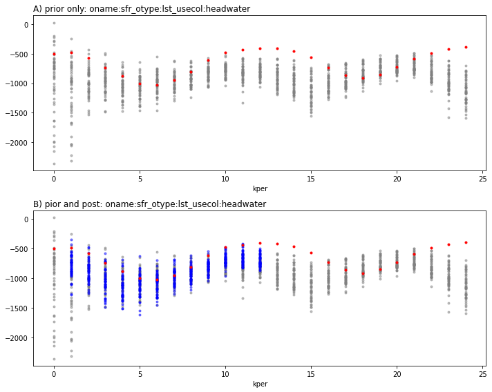

# Run this beast!


```python

import os
import shutil
from datetime import datetime
import warnings
warnings.filterwarnings("ignore")
warnings.filterwarnings("ignore", category=DeprecationWarning) 
import pyemu
import pandas as pd
import numpy as np
import matplotlib.pyplot as plt;
import flopy

import sys
sys.path.append("..")
# import pre-prepared convenience functions
import herebedragons as hbd
```


```python
# specify the temporary working folder
t_d = os.path.join('freyberg6_da_template')

if not os.path.exists(t_d):
    raise Exception("you need to run the 'freyberg_da_prep.ipynb' notebook")


```


```python
pst = pyemu.Pst(os.path.join(t_d,"freyberg_mf6.pst"))
```


```python
pst.pestpp_options['ies_parameter_ensemble'] = 'prior_pe.jcb'
pst.pestpp_options["ies_num_reals"] = 50
num_workers = 10
pst.control_data.noptmax = 3
pst.write(os.path.join(t_d, 'freyberg_mf6.pst'))
m_d = os.path.join('master_da')
```

    noptmax:3, npar_adj:12013, nnz_obs:5
    


```python
pyemu.os_utils.start_workers(t_d, # the folder which contains the "template" PEST dataset
                            'pestpp-da', #the PEST software version we want to run
                            'freyberg_mf6.pst', # the control file to use with PEST
                            num_workers=num_workers, #how many agents to deploy
                            worker_root='.', #where to deploy the agent directories; relative to where python is running
                            master_dir=m_d, #the manager directory
                            )
```


    ---------------------------------------------------------------------------

    Exception                                 Traceback (most recent call last)

    Input In [5], in <cell line: 1>()
    ----> 1 pyemu.os_utils.start_workers(t_d, # the folder which contains the "template" PEST dataset
          2                             'pestpp-da', #the PEST software version we want to run
          3                             'freyberg_mf6.pst', # the control file to use with PEST
          4                             num_workers=num_workers, #how many agents to deploy
          5                             worker_root='.', #where to deploy the agent directories; relative to where python is running
          6                             master_dir=m_d, #the manager directory
          7                             )
    

    File D:\github\pyemu\pyemu\utils\os_utils.py:362, in start_workers(worker_dir, exe_rel_path, pst_rel_path, num_workers, worker_root, port, rel_path, local, cleanup, master_dir, verbose, silent_master, reuse_master)
        360 ret_val = master_p.returncode
        361 if ret_val != 0:
    --> 362     raise Exception("start_workers() master returned non-zero: {0}".format(ret_val))
    

    Exception: start_workers() master returned non-zero: 3221226356


Like you probably have realized, all things get more complicated with sequential estimation, this includes post processing as well...

Let's load the global obs ensembles


```python
files = [f for f in os.listdir(m_d) if ".0.obs.csv" in f]
pr_oes = {int(f.split(".")[1]):pd.read_csv(os.path.join(m_d,f),index_col=0) for f in files}
print(files)
```

    []
    


```python
files = [f for f in os.listdir(m_d) if ".{0}.obs.csv".format(pst.control_data.noptmax) in f]
pt_oes = {int(f.split(".")[1]):pd.read_csv(os.path.join(m_d,f),index_col=0) for f in files}
```


```python
otab = pd.read_csv(os.path.join(m_d,"obs_cycle_table.csv"),index_col=0)
wtab = pd.read_csv(os.path.join(m_d,"weight_cycle_table.csv"),index_col=0)
```


```python
obs = pst.observation_data
obs = obs.loc[pst.nnz_obs_names,:]
obs
```


<div>
<style scoped>
    .dataframe tbody tr th:only-of-type {
        vertical-align: middle;
    }

    .dataframe tbody tr th {
        vertical-align: top;
    }

    .dataframe thead th {
        text-align: right;
    }
</style>
<table border="1" class="dataframe">
  <thead>
    <tr style="text-align: right;">
      <th></th>
      <th>obsnme</th>
      <th>obsval</th>
      <th>weight</th>
      <th>obgnme</th>
      <th>oname</th>
      <th>otype</th>
      <th>usecol</th>
      <th>time</th>
      <th>i</th>
      <th>j</th>
      <th>totim</th>
      <th>observed</th>
      <th>cycle</th>
      <th>state_par_link</th>
    </tr>
    <tr>
      <th>obsnme</th>
      <th></th>
      <th></th>
      <th></th>
      <th></th>
      <th></th>
      <th></th>
      <th></th>
      <th></th>
      <th></th>
      <th></th>
      <th></th>
      <th></th>
      <th></th>
      <th></th>
    </tr>
  </thead>
  <tbody>
    <tr>
      <th>oname:hdslay1_t1_otype:arr_i:26_j:6</th>
      <td>oname:hdslay1_t1_otype:arr_i:26_j:6</td>
      <td>34.251600</td>
      <td>1.0</td>
      <td>hdslay1_t1</td>
      <td>hdslay1</td>
      <td>arr</td>
      <td>NaN</td>
      <td>NaN</td>
      <td>26</td>
      <td>6</td>
      <td>NaN</td>
      <td>NaN</td>
      <td>-1</td>
      <td>pname:icstrtlayer1_inst:0_ptype:gr_pstyle:d_i:26_j:6_x:1625.00_y:3375.00_zone:1</td>
    </tr>
    <tr>
      <th>oname:hdslay1_t1_otype:arr_i:3_j:8</th>
      <td>oname:hdslay1_t1_otype:arr_i:3_j:8</td>
      <td>34.736740</td>
      <td>1.0</td>
      <td>hdslay1_t1</td>
      <td>hdslay1</td>
      <td>arr</td>
      <td>NaN</td>
      <td>NaN</td>
      <td>3</td>
      <td>8</td>
      <td>NaN</td>
      <td>NaN</td>
      <td>-1</td>
      <td>pname:icstrtlayer1_inst:0_ptype:gr_pstyle:d_i:3_j:8_x:2125.00_y:9125.00_zone:1</td>
    </tr>
    <tr>
      <th>oname:hdslay3_t1_otype:arr_i:26_j:6</th>
      <td>oname:hdslay3_t1_otype:arr_i:26_j:6</td>
      <td>34.245570</td>
      <td>1.0</td>
      <td>hdslay3_t1</td>
      <td>hdslay3</td>
      <td>arr</td>
      <td>NaN</td>
      <td>NaN</td>
      <td>26</td>
      <td>6</td>
      <td>NaN</td>
      <td>NaN</td>
      <td>-1</td>
      <td>pname:icstrtlayer3_inst:0_ptype:gr_pstyle:d_i:26_j:6_x:1625.00_y:3375.00_zone:1</td>
    </tr>
    <tr>
      <th>oname:hdslay3_t1_otype:arr_i:3_j:8</th>
      <td>oname:hdslay3_t1_otype:arr_i:3_j:8</td>
      <td>34.730210</td>
      <td>1.0</td>
      <td>hdslay3_t1</td>
      <td>hdslay3</td>
      <td>arr</td>
      <td>NaN</td>
      <td>NaN</td>
      <td>3</td>
      <td>8</td>
      <td>NaN</td>
      <td>NaN</td>
      <td>-1</td>
      <td>pname:icstrtlayer3_inst:0_ptype:gr_pstyle:d_i:3_j:8_x:2125.00_y:9125.00_zone:1</td>
    </tr>
    <tr>
      <th>oname:sfr_otype:lst_usecol:gage-1</th>
      <td>oname:sfr_otype:lst_usecol:gage-1</td>
      <td>3691.573065</td>
      <td>1.0</td>
      <td>obgnme</td>
      <td>sfr</td>
      <td>lst</td>
      <td>gage-1</td>
      <td>NaN</td>
      <td>NaN</td>
      <td>NaN</td>
      <td>NaN</td>
      <td>NaN</td>
      <td>-1</td>
      <td>NaN</td>
    </tr>
  </tbody>
</table>
</div>


```python
ad_df = pd.read_csv(os.path.join(t_d,"alldata.csv"),index_col=0)
ad_df
```


<div>
<style scoped>
    .dataframe tbody tr th:only-of-type {
        vertical-align: middle;
    }

    .dataframe tbody tr th {
        vertical-align: top;
    }

    .dataframe thead th {
        text-align: right;
    }
</style>
<table border="1" class="dataframe">
  <thead>
    <tr style="text-align: right;">
      <th></th>
      <th>oname:hdslay1_t1_otype:arr_i:13_j:10</th>
      <th>oname:hdslay1_t1_otype:arr_i:15_j:16</th>
      <th>oname:hdslay1_t1_otype:arr_i:2_j:15</th>
      <th>oname:hdslay1_t1_otype:arr_i:2_j:9</th>
      <th>oname:hdslay1_t1_otype:arr_i:21_j:10</th>
      <th>oname:hdslay1_t1_otype:arr_i:22_j:15</th>
      <th>oname:hdslay1_t1_otype:arr_i:24_j:4</th>
      <th>oname:hdslay1_t1_otype:arr_i:26_j:6</th>
      <th>oname:hdslay1_t1_otype:arr_i:29_j:15</th>
      <th>oname:hdslay1_t1_otype:arr_i:3_j:8</th>
      <th>...</th>
      <th>oname:hdslay3_t1_otype:arr_i:24_j:4</th>
      <th>oname:hdslay3_t1_otype:arr_i:26_j:6</th>
      <th>oname:hdslay3_t1_otype:arr_i:29_j:15</th>
      <th>oname:hdslay3_t1_otype:arr_i:3_j:8</th>
      <th>oname:hdslay3_t1_otype:arr_i:33_j:7</th>
      <th>oname:hdslay3_t1_otype:arr_i:34_j:10</th>
      <th>oname:hdslay3_t1_otype:arr_i:9_j:1</th>
      <th>oname:sfr_otype:lst_usecol:gage-1</th>
      <th>oname:sfr_otype:lst_usecol:headwater</th>
      <th>oname:sfr_otype:lst_usecol:tailwater</th>
    </tr>
    <tr>
      <th>cycle</th>
      <th></th>
      <th></th>
      <th></th>
      <th></th>
      <th></th>
      <th></th>
      <th></th>
      <th></th>
      <th></th>
      <th></th>
      <th></th>
      <th></th>
      <th></th>
      <th></th>
      <th></th>
      <th></th>
      <th></th>
      <th></th>
      <th></th>
      <th></th>
      <th></th>
    </tr>
  </thead>
  <tbody>
    <tr>
      <th>0</th>
      <td>34.190167</td>
      <td>34.038046</td>
      <td>34.202978</td>
      <td>34.558594</td>
      <td>34.213346</td>
      <td>33.999689</td>
      <td>34.719783</td>
      <td>34.644013</td>
      <td>33.993860</td>
      <td>34.571747</td>
      <td>...</td>
      <td>34.717087</td>
      <td>34.565496</td>
      <td>33.996285</td>
      <td>34.579985</td>
      <td>34.461322</td>
      <td>34.197752</td>
      <td>35.033637</td>
      <td>1998.425564</td>
      <td>-498.657479</td>
      <td>-928.744788</td>
    </tr>
    <tr>
      <th>1</th>
      <td>34.178076</td>
      <td>34.037024</td>
      <td>34.201006</td>
      <td>34.539065</td>
      <td>34.208079</td>
      <td>34.000762</td>
      <td>34.699563</td>
      <td>34.554179</td>
      <td>33.996101</td>
      <td>34.580241</td>
      <td>...</td>
      <td>34.697410</td>
      <td>34.566638</td>
      <td>33.998267</td>
      <td>34.551542</td>
      <td>34.459599</td>
      <td>34.201044</td>
      <td>34.999638</td>
      <td>1914.074438</td>
      <td>-480.627621</td>
      <td>-945.713159</td>
    </tr>
    <tr>
      <th>2</th>
      <td>34.203032</td>
      <td>34.067095</td>
      <td>34.231292</td>
      <td>34.542735</td>
      <td>34.255435</td>
      <td>34.041182</td>
      <td>34.774182</td>
      <td>34.639517</td>
      <td>34.052414</td>
      <td>34.559523</td>
      <td>...</td>
      <td>34.772820</td>
      <td>34.636888</td>
      <td>34.054619</td>
      <td>34.534734</td>
      <td>34.563183</td>
      <td>34.293254</td>
      <td>35.012982</td>
      <td>2047.803833</td>
      <td>-571.683292</td>
      <td>-1106.916683</td>
    </tr>
    <tr>
      <th>3</th>
      <td>34.274843</td>
      <td>34.133093</td>
      <td>34.284466</td>
      <td>34.587875</td>
      <td>34.362326</td>
      <td>34.115102</td>
      <td>34.931566</td>
      <td>34.797994</td>
      <td>34.138846</td>
      <td>34.614963</td>
      <td>...</td>
      <td>34.930103</td>
      <td>34.795909</td>
      <td>34.140918</td>
      <td>34.676304</td>
      <td>34.716963</td>
      <td>34.419109</td>
      <td>35.085834</td>
      <td>2538.185281</td>
      <td>-739.883524</td>
      <td>-1347.110742</td>
    </tr>
    <tr>
      <th>4</th>
      <td>34.345650</td>
      <td>34.191746</td>
      <td>34.330344</td>
      <td>34.654845</td>
      <td>34.461362</td>
      <td>34.176560</td>
      <td>35.089206</td>
      <td>34.923169</td>
      <td>34.205158</td>
      <td>34.651341</td>
      <td>...</td>
      <td>35.086986</td>
      <td>34.928128</td>
      <td>34.207755</td>
      <td>34.667008</td>
      <td>34.848538</td>
      <td>34.519032</td>
      <td>35.189924</td>
      <td>2840.455384</td>
      <td>-877.451526</td>
      <td>-1538.393982</td>
    </tr>
    <tr>
      <th>5</th>
      <td>34.412400</td>
      <td>34.236129</td>
      <td>34.360848</td>
      <td>34.723370</td>
      <td>34.546029</td>
      <td>34.223131</td>
      <td>35.224844</td>
      <td>35.080453</td>
      <td>34.250541</td>
      <td>34.761283</td>
      <td>...</td>
      <td>35.222193</td>
      <td>35.036811</td>
      <td>34.254503</td>
      <td>34.763171</td>
      <td>34.957656</td>
      <td>34.602102</td>
      <td>35.300896</td>
      <td>3088.591379</td>
      <td>-1000.540323</td>
      <td>-1679.921087</td>
    </tr>
    <tr>
      <th>6</th>
      <td>34.442383</td>
      <td>34.250920</td>
      <td>34.366792</td>
      <td>34.767757</td>
      <td>34.582506</td>
      <td>34.237063</td>
      <td>35.309185</td>
      <td>35.122988</td>
      <td>34.264507</td>
      <td>34.788279</td>
      <td>...</td>
      <td>35.305931</td>
      <td>35.103545</td>
      <td>34.269131</td>
      <td>34.793168</td>
      <td>35.016808</td>
      <td>34.631032</td>
      <td>35.378755</td>
      <td>3244.631271</td>
      <td>-1023.508893</td>
      <td>-1725.451745</td>
    </tr>
    <tr>
      <th>7</th>
      <td>34.423859</td>
      <td>34.222210</td>
      <td>34.336185</td>
      <td>34.775132</td>
      <td>34.555534</td>
      <td>34.206814</td>
      <td>35.299420</td>
      <td>35.111435</td>
      <td>34.227300</td>
      <td>34.820600</td>
      <td>...</td>
      <td>35.295507</td>
      <td>35.121364</td>
      <td>34.232676</td>
      <td>34.817475</td>
      <td>34.984534</td>
      <td>34.594366</td>
      <td>35.403683</td>
      <td>2933.983091</td>
      <td>-949.697752</td>
      <td>-1628.449183</td>
    </tr>
    <tr>
      <th>8</th>
      <td>34.372714</td>
      <td>34.168259</td>
      <td>34.286994</td>
      <td>34.748232</td>
      <td>34.475454</td>
      <td>34.145636</td>
      <td>35.189195</td>
      <td>34.983462</td>
      <td>34.151048</td>
      <td>34.789937</td>
      <td>...</td>
      <td>35.184365</td>
      <td>35.013067</td>
      <td>34.155867</td>
      <td>34.766657</td>
      <td>34.845319</td>
      <td>34.475016</td>
      <td>35.370553</td>
      <td>2592.891596</td>
      <td>-811.236047</td>
      <td>-1394.757801</td>
    </tr>
    <tr>
      <th>9</th>
      <td>34.292691</td>
      <td>34.098608</td>
      <td>34.230834</td>
      <td>34.698392</td>
      <td>34.344787</td>
      <td>34.057948</td>
      <td>34.969614</td>
      <td>34.800076</td>
      <td>34.039893</td>
      <td>34.697605</td>
      <td>...</td>
      <td>34.963892</td>
      <td>34.757677</td>
      <td>34.043125</td>
      <td>34.727177</td>
      <td>34.595855</td>
      <td>34.265692</td>
      <td>35.285271</td>
      <td>2006.872411</td>
      <td>-609.062026</td>
      <td>-1042.584554</td>
    </tr>
    <tr>
      <th>10</th>
      <td>34.215142</td>
      <td>34.038531</td>
      <td>34.190713</td>
      <td>34.637500</td>
      <td>34.225035</td>
      <td>33.987762</td>
      <td>34.728872</td>
      <td>34.513390</td>
      <td>33.947304</td>
      <td>34.691141</td>
      <td>...</td>
      <td>34.723894</td>
      <td>34.491410</td>
      <td>33.949288</td>
      <td>34.682819</td>
      <td>34.365448</td>
      <td>34.092161</td>
      <td>35.171902</td>
      <td>1627.954594</td>
      <td>-473.798267</td>
      <td>-763.107322</td>
    </tr>
    <tr>
      <th>11</th>
      <td>34.172972</td>
      <td>34.007476</td>
      <td>34.168587</td>
      <td>34.582283</td>
      <td>34.150860</td>
      <td>33.948102</td>
      <td>34.554467</td>
      <td>34.405574</td>
      <td>33.897052</td>
      <td>34.622222</td>
      <td>...</td>
      <td>34.550797</td>
      <td>34.401332</td>
      <td>33.898870</td>
      <td>34.639777</td>
      <td>34.233601</td>
      <td>34.011732</td>
      <td>35.054750</td>
      <td>1492.098144</td>
      <td>-435.920135</td>
      <td>-624.066713</td>
    </tr>
    <tr>
      <th>12</th>
      <td>34.144985</td>
      <td>33.994103</td>
      <td>34.162153</td>
      <td>34.534287</td>
      <td>34.105242</td>
      <td>33.930063</td>
      <td>34.456455</td>
      <td>34.356307</td>
      <td>33.884325</td>
      <td>34.572168</td>
      <td>...</td>
      <td>34.454374</td>
      <td>34.339198</td>
      <td>33.885915</td>
      <td>34.559814</td>
      <td>34.191983</td>
      <td>33.991714</td>
      <td>34.946527</td>
      <td>1417.882893</td>
      <td>-402.982197</td>
      <td>-604.565976</td>
    </tr>
    <tr>
      <th>13</th>
      <td>34.130311</td>
      <td>34.001623</td>
      <td>34.181145</td>
      <td>34.501250</td>
      <td>34.109612</td>
      <td>33.947669</td>
      <td>34.480402</td>
      <td>34.359981</td>
      <td>33.926770</td>
      <td>34.508663</td>
      <td>...</td>
      <td>34.479364</td>
      <td>34.338827</td>
      <td>33.927978</td>
      <td>34.546429</td>
      <td>34.272153</td>
      <td>34.065107</td>
      <td>34.889253</td>
      <td>1608.666422</td>
      <td>-411.019141</td>
      <td>-741.025853</td>
    </tr>
    <tr>
      <th>14</th>
      <td>34.141640</td>
      <td>34.028691</td>
      <td>34.217241</td>
      <td>34.501466</td>
      <td>34.156746</td>
      <td>33.990227</td>
      <td>34.591483</td>
      <td>34.437760</td>
      <td>33.995513</td>
      <td>34.503467</td>
      <td>...</td>
      <td>34.590644</td>
      <td>34.479768</td>
      <td>33.996423</td>
      <td>34.485530</td>
      <td>34.411515</td>
      <td>34.175573</td>
      <td>34.904697</td>
      <td>1867.786737</td>
      <td>-458.973647</td>
      <td>-934.468495</td>
    </tr>
    <tr>
      <th>15</th>
      <td>34.184853</td>
      <td>34.073785</td>
      <td>34.259222</td>
      <td>34.532658</td>
      <td>34.245331</td>
      <td>34.052044</td>
      <td>34.749882</td>
      <td>34.612741</td>
      <td>34.072185</td>
      <td>34.569590</td>
      <td>...</td>
      <td>34.748538</td>
      <td>34.603659</td>
      <td>34.072963</td>
      <td>34.551632</td>
      <td>34.560565</td>
      <td>34.293271</td>
      <td>34.974194</td>
      <td>2206.529119</td>
      <td>-563.816811</td>
      <td>-1148.770785</td>
    </tr>
    <tr>
      <th>16</th>
      <td>34.264956</td>
      <td>34.138130</td>
      <td>34.307397</td>
      <td>34.594892</td>
      <td>34.361124</td>
      <td>34.124374</td>
      <td>34.926726</td>
      <td>34.785995</td>
      <td>34.151297</td>
      <td>34.601134</td>
      <td>...</td>
      <td>34.924962</td>
      <td>34.734212</td>
      <td>34.152620</td>
      <td>34.633834</td>
      <td>34.712070</td>
      <td>34.417232</td>
      <td>35.085265</td>
      <td>2550.212622</td>
      <td>-733.689484</td>
      <td>-1374.138897</td>
    </tr>
    <tr>
      <th>17</th>
      <td>34.335293</td>
      <td>34.185543</td>
      <td>34.333583</td>
      <td>34.658016</td>
      <td>34.451928</td>
      <td>34.172819</td>
      <td>35.077931</td>
      <td>34.929192</td>
      <td>34.201093</td>
      <td>34.680880</td>
      <td>...</td>
      <td>35.075651</td>
      <td>34.895127</td>
      <td>34.203768</td>
      <td>34.646553</td>
      <td>34.837479</td>
      <td>34.510973</td>
      <td>35.190761</td>
      <td>2844.177596</td>
      <td>-861.130256</td>
      <td>-1528.009918</td>
    </tr>
    <tr>
      <th>18</th>
      <td>34.377262</td>
      <td>34.206682</td>
      <td>34.339932</td>
      <td>34.705702</td>
      <td>34.502704</td>
      <td>34.192775</td>
      <td>35.178717</td>
      <td>34.975565</td>
      <td>34.219285</td>
      <td>34.729846</td>
      <td>...</td>
      <td>35.175839</td>
      <td>35.021240</td>
      <td>34.223535</td>
      <td>34.724268</td>
      <td>34.915148</td>
      <td>34.560346</td>
      <td>35.273490</td>
      <td>2971.340604</td>
      <td>-916.349780</td>
      <td>-1593.743380</td>
    </tr>
    <tr>
      <th>19</th>
      <td>34.365742</td>
      <td>34.185521</td>
      <td>34.312651</td>
      <td>34.713257</td>
      <td>34.486367</td>
      <td>34.169645</td>
      <td>35.185998</td>
      <td>34.985481</td>
      <td>34.190952</td>
      <td>34.755311</td>
      <td>...</td>
      <td>35.182518</td>
      <td>34.994867</td>
      <td>34.195525</td>
      <td>34.770802</td>
      <td>34.898600</td>
      <td>34.529571</td>
      <td>35.299002</td>
      <td>2753.935421</td>
      <td>-847.870373</td>
      <td>-1518.037954</td>
    </tr>
    <tr>
      <th>20</th>
      <td>34.328215</td>
      <td>34.140086</td>
      <td>34.265655</td>
      <td>34.690908</td>
      <td>34.420160</td>
      <td>34.115097</td>
      <td>35.093167</td>
      <td>34.914096</td>
      <td>34.120561</td>
      <td>34.715735</td>
      <td>...</td>
      <td>35.088692</td>
      <td>34.933625</td>
      <td>34.124815</td>
      <td>34.701078</td>
      <td>34.772579</td>
      <td>34.420677</td>
      <td>35.270638</td>
      <td>2454.784937</td>
      <td>-727.316574</td>
      <td>-1302.088683</td>
    </tr>
    <tr>
      <th>21</th>
      <td>34.267187</td>
      <td>34.083701</td>
      <td>34.215556</td>
      <td>34.647382</td>
      <td>34.318926</td>
      <td>34.045075</td>
      <td>34.904982</td>
      <td>34.722138</td>
      <td>34.025890</td>
      <td>34.679218</td>
      <td>...</td>
      <td>34.900068</td>
      <td>34.736309</td>
      <td>34.029209</td>
      <td>34.688618</td>
      <td>34.561794</td>
      <td>34.249921</td>
      <td>35.194898</td>
      <td>2051.619642</td>
      <td>-587.815539</td>
      <td>-1006.730838</td>
    </tr>
    <tr>
      <th>22</th>
      <td>34.213217</td>
      <td>34.040301</td>
      <td>34.182237</td>
      <td>34.597727</td>
      <td>34.223276</td>
      <td>33.988325</td>
      <td>34.697260</td>
      <td>34.555997</td>
      <td>33.947764</td>
      <td>34.602837</td>
      <td>...</td>
      <td>34.692730</td>
      <td>34.558994</td>
      <td>33.949989</td>
      <td>34.646588</td>
      <td>34.358726</td>
      <td>34.101192</td>
      <td>35.094586</td>
      <td>1708.835488</td>
      <td>-489.014606</td>
      <td>-767.664317</td>
    </tr>
    <tr>
      <th>23</th>
      <td>34.168649</td>
      <td>34.009097</td>
      <td>34.163096</td>
      <td>34.551473</td>
      <td>34.144868</td>
      <td>33.946871</td>
      <td>34.530640</td>
      <td>34.386541</td>
      <td>33.895668</td>
      <td>34.600532</td>
      <td>...</td>
      <td>34.526984</td>
      <td>34.364374</td>
      <td>33.897301</td>
      <td>34.580918</td>
      <td>34.222917</td>
      <td>34.004583</td>
      <td>34.991601</td>
      <td>1512.808236</td>
      <td>-425.098483</td>
      <td>-619.707340</td>
    </tr>
    <tr>
      <th>24</th>
      <td>34.138330</td>
      <td>33.991978</td>
      <td>34.155737</td>
      <td>34.513438</td>
      <td>34.099246</td>
      <td>33.926726</td>
      <td>34.439758</td>
      <td>34.276596</td>
      <td>33.878583</td>
      <td>34.510604</td>
      <td>...</td>
      <td>34.437509</td>
      <td>34.340205</td>
      <td>33.880084</td>
      <td>34.543530</td>
      <td>34.176363</td>
      <td>33.977405</td>
      <td>34.907659</td>
      <td>1419.775132</td>
      <td>-388.766627</td>
      <td>-586.379558</td>
    </tr>
  </tbody>
</table>
<p>25 rows × 29 columns</p>
</div>


```python
for o in pst.nnz_obs_names:
    fig,axes = plt.subplots(2,1,figsize=(10,8))
    
    for kper,oe in pr_oes.items():
        axes[0].scatter([kper]*oe.shape[0],oe.loc[:,o].values,marker=".",c="0.5",alpha=0.5)
        axes[1].scatter([kper]*oe.shape[0],oe.loc[:,o].values,marker=".",c="0.5",alpha=0.5)
    for kper,oe in pt_oes.items():
        axes[1].scatter([kper]*oe.shape[0],oe.loc[:,o].values,marker=".",c="b",alpha=0.5)
    
    ovals = otab.loc[o,:].values
    wvals = wtab.loc[o,:].values
    ylim = axes[1].get_ylim()
    xlim = axes[1].get_xlim()
    ovals[wvals==0] = np.nan
    axes[0].scatter(otab.columns.values,ovals,marker='^',c='r')
    axes[1].scatter(otab.columns.values,ovals,marker='^',c='r')
    axes[0].set_ylim(ylim)
    axes[0].set_xlim(xlim)
    axes[0].set_title("A) prior only: "+o,loc="left")
    axes[0].set_xlabel("kper")
    axes[1].set_ylim(ylim)
    axes[1].set_xlim(xlim)
    axes[1].set_title("B) pior and post: "+o,loc="left")
    axes[1].set_xlabel("kper")
    
    avals = ad_df.loc[:,o]
    axes[0].scatter(ad_df.index.values,avals,marker='.',c='r')
    axes[1].scatter(ad_df.index.values,avals,marker='.',c='r')
    
    plt.tight_layout()
    
```


    

    


    

    


    

    


    

    


    

    


```python
obs = pst.observation_data
forecasts = obs.loc[obs.obsnme.apply(lambda x: "headwater" in x or "tailwater" in x),"obsnme"]
forecasts
for o in forecasts:
    fig,axes = plt.subplots(2,1,figsize=(10,8))
    
    for kper,oe in pr_oes.items():
        axes[0].scatter([kper]*oe.shape[0],oe.loc[:,o].values,marker=".",c="0.5",alpha=0.5)
        axes[1].scatter([kper]*oe.shape[0],oe.loc[:,o].values,marker=".",c="0.5",alpha=0.5)
    for kper,oe in pt_oes.items():
        axes[1].scatter([kper]*oe.shape[0],oe.loc[:,o].values,marker=".",c="b",alpha=0.5)
    
    axes[0].set_title("A) prior only: "+o,loc="left")
    axes[0].set_xlabel("kper")
    axes[1].set_title("B) pior and post: "+o,loc="left")
    axes[1].set_xlabel("kper")
    
    avals = ad_df.loc[:,o]
    axes[0].scatter(ad_df.index.values,avals,marker='.',c='r')
    axes[1].scatter(ad_df.index.values,avals,marker='.',c='r')
    
    plt.tight_layout()
```


    

    


    

    


To help understand what is happening with PESTPP-DA (and to make sense of all the output files that PESTPP-DA generates), let's inspect the master dir:
