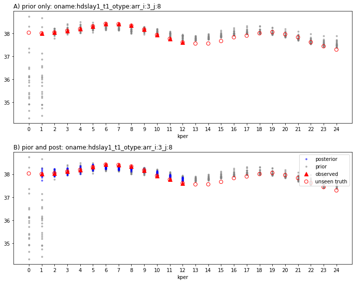
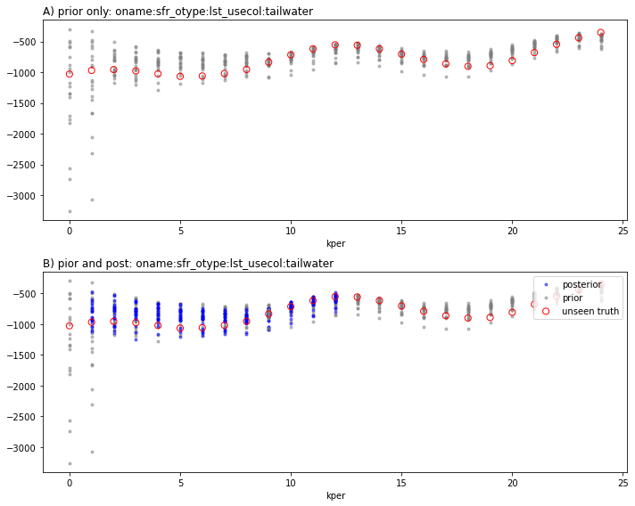

# PESTPP-DA - Generalized Data Assimilation with Ensemble Methods
## Run the beast!

Much Like PESTPP-IES, PESTPP-DA uses ensembles to approximates first-order relationships between inputs (i.e. parameters) and outputs (i.e. observations).  However, PESTPP-DA extends and generalizes the approach of PESTPP-IES (and all other tools in the PEST and PEST++) to the concept of an assimilation "cycle".  Each cycle represents a discrete inverse problems with (potentially) unique parameters and observations.  Most commonly, these cycles represent discrete time intervals, for example, a year.  During each cycle, the parameters active during the cycle are conditioned by assimilating observations active during the cycle. This is referred to as "sequential estimation".  The real mind twister is that the posterior at the end of each cycle is the prior for the next cycle...confused yet?  Conceptually and theorically, Bayes equation can be split out this way...

The assimilation engine used in each cycle by PESTPP-DA is the same engine used in PESTPP-IES:  the iterative ensemble method, using either the GLM algorithm of Chen and Oliver or the multiple data assimilation algorithm of Emmerick and Reynolds.  

To implement the cycle-based assimilation, users must add a cycle number to parameters (and template files) and observations (and instruction files) in the pest control file.  At runtime, PESTPP-DA does the incredibly painful process of forming a new "sub-problem" using these cycle numbers under the hood.  You are welcome!

But there is something more...if PESTPP-DA takes control of the time advancement process from the underlying simulation model, how do we form a coherent temporal evolution.  This is where the concept of "states" becomes critical.  A "state" is simply a simulated "state" of the system - in groundwater flow modeling, states are the simulated groundwater levels in each active model cell.  In a standard "batch" parameter estimation analysis (where we run the entire historic period at once and let MODFLOW "do its thing"), MODFLOW itself advances the states from stress period to stress period.  That is, the final simulated (hopefully converged) groundwater levels for each active cell at the end of the stress period 1 become the initial heads for stress period 2.  Ok, cool, so how do we make this work with PESTPP-DA where we have defined each stress period to be a cycle?  Well we have to now include the simulated water level in each active cell as an "observation" in the control file and we need to also add the initial groundwater level (i.e. the `strt` quantity in the MODFLOW world) for each active cell as a "parameter" in the control file.  And then we also need to tell PESTPP-DA how each of these state observations and state parameters map to each other - that is, how the observed state in model cell in layer 1/row 1/column 1 maps to the initial state parameter that is in layer 1/row 1/column 1.  Just some book keeping...right?  In this case, since we are using each stress period as an assimilation cycle, we have also changed the underlying model so that it is just a single stress-period...

So at this point, maybe you are thinking "WTF - this is insane.  Who would ever want to use sequential estimation".  Well, it turns out, if you are interested in making short-term, so-called "one-step-ahead" forecasts, sequential estimation is the optimal approach.  And that is because, just like we estimate parameters for things like HK and SS, we can also estimate the initial condition parameters!  WAT?!  That's right - we can estimate the initial groundwater levels in each active model cell for each cycle along with the static properties.  This results in the model being especially tuned at making a forecast related to the system behavior in the near term - these near-term forecasts depend as much on having the system state optimal as they do on having the properties optimal (maybe even more). So for short-term/near-term forecasts, if you have the groundwater levels nearly right, then you are probably going to do pretty well for forecasting something happening in the near future.  The combined form of estimation is referred to as "joint state-parameter estimation".  

In this example problem, we are estimating static properties during all cycles, as well as some cycle-specific forcing parameters like recharge and extraction rates, plus the initial groundwater level states.  With regard to the static properties, like HK and SS, the sequential estimation problem implies that the optimal static properties values may, and do, change for each cycle!  Thats because what is optimal for cycle 1 in terms of HK and SS differs from what is optimal for cycle 2.  This may cause some of you to question the validity of sequential estimation.  But from a Bayesian perspetive, its perfectly valid, and from the stand point of improved forecasting skill, its optimal.  


## The Current Tutorial

In the current notebook we are going to pick up after the horrific notebook that modifies the existing interface to one that is designed for sequential estimation - "freyberg_da_prep.ipynb". 

In this notebook, we will actually run PESTPP-DA for a sequential, joint state-parameter estimation problem where each monthly stress period in the original batch interface is now a discrete assimilation cycle.

### Admin

The next couple of cells load necessary dependencies and call a convenience function to prepare the PEST dataset folder for you. Simply press `shift+enter` to run the cells.


```python

import os
import shutil
from datetime import datetime
import warnings
warnings.filterwarnings("ignore")
warnings.filterwarnings("ignore", category=DeprecationWarning) 

import pandas as pd
import numpy as np
import matplotlib.pyplot as plt;
import sys
sys.path.insert(0,os.path.join("..", "..", "dependencies"))
import pyemu
import flopy
assert "dependencies" in flopy.__file__
assert "dependencies" in pyemu.__file__
sys.path.insert(0,"..")
import herebedragons as hbd


```


```python
# specify the temporary working folder
t_d = os.path.join('freyberg6_da_template')

if not os.path.exists(t_d):
    raise Exception("you need to run the 'freyberg_da_prep.ipynb' notebook")


```


```python
pst = pyemu.Pst(os.path.join(t_d,"freyberg_mf6.pst"))
```

For this simple fast running model, there is considerable overhead time related to the file and model interface operations that PESTPP-DA compared to the model runtime.  So, to make the notebook experience more enjoyable, let's limit the number of realizations, the number of iterations, and the lambdas we want to test (with less non-zero weighted observations per cycle, we should be ok to use less realizations related to spurious correlation?)


```python
pst.pestpp_options['ies_parameter_ensemble'] = 'prior_pe.jcb'
pst.pestpp_options["ies_num_reals"] = 20
pst.pestpp_options["ies_lambda_mults"] = [0.1,1.0]
pst.pestpp_options["lambda_scale_fac"] = 1.0
num_workers = 10
pst.control_data.noptmax = 2
pst.write(os.path.join(t_d, 'freyberg_mf6.pst'))
m_d = os.path.join('master_da')
```

    noptmax:2, npar_adj:23786, nnz_obs:3
    


```python
pyemu.os_utils.start_workers(t_d, # the folder which contains the "template" PEST dataset
                            'pestpp-da', #the PEST software version we want to run
                            'freyberg_mf6.pst', # the control file to use with PEST
                            num_workers=num_workers, #how many agents to deploy
                            worker_root='.', #where to deploy the agent directories; relative to where python is running
                            master_dir=m_d, #the manager directory
                            port=4269)
```

## Inspecting PESTPP-DA
Like you probably have realized, all things get more complicated with sequential estimation, this includes post processing as well...

Let's load the prior observation ensemble files for each cycle.  The naming strategy is `<case>.<cycle>.<iteration>.obs.csv` for cycle-specific observation ensembles and `<case>.<cycle>.<iteration>.par.csv` for parameter ensembles


```python
files = [f for f in os.listdir(m_d) if ".0.obs.csv" in f]
pr_oes = {int(f.split(".")[1]):pd.read_csv(os.path.join(m_d,f),index_col=0) for f in files}
print(files)
```

    ['freyberg_mf6.0.0.obs.csv', 'freyberg_mf6.1.0.obs.csv', 'freyberg_mf6.10.0.obs.csv', 'freyberg_mf6.11.0.obs.csv', 'freyberg_mf6.12.0.obs.csv', 'freyberg_mf6.13.0.obs.csv', 'freyberg_mf6.14.0.obs.csv', 'freyberg_mf6.15.0.obs.csv', 'freyberg_mf6.16.0.obs.csv', 'freyberg_mf6.17.0.obs.csv', 'freyberg_mf6.18.0.obs.csv', 'freyberg_mf6.19.0.obs.csv', 'freyberg_mf6.2.0.obs.csv', 'freyberg_mf6.20.0.obs.csv', 'freyberg_mf6.21.0.obs.csv', 'freyberg_mf6.22.0.obs.csv', 'freyberg_mf6.23.0.obs.csv', 'freyberg_mf6.24.0.obs.csv', 'freyberg_mf6.3.0.obs.csv', 'freyberg_mf6.4.0.obs.csv', 'freyberg_mf6.5.0.obs.csv', 'freyberg_mf6.6.0.obs.csv', 'freyberg_mf6.7.0.obs.csv', 'freyberg_mf6.8.0.obs.csv', 'freyberg_mf6.9.0.obs.csv']
    


```python
files = [f for f in os.listdir(m_d) if ".{0}.obs.csv".format(pst.control_data.noptmax) in f]
pt_oes = {int(f.split(".")[1]):pd.read_csv(os.path.join(m_d,f),index_col=0) for f in files}
```

Now load the obs and weight cycle tables so we can get the obsvals and weights for each cycle (since these change across the cycles)


```python
otab = pd.read_csv(os.path.join(m_d,"obs_cycle_table.csv"),index_col=0)
wtab = pd.read_csv(os.path.join(m_d,"weight_cycle_table.csv"),index_col=0)
```


```python
obs = pst.observation_data
obs = obs.loc[pst.nnz_obs_names,:]
obs
```


<div>
<style scoped>
    .dataframe tbody tr th:only-of-type {
        vertical-align: middle;
    }

    .dataframe tbody tr th {
        vertical-align: top;
    }

    .dataframe thead th {
        text-align: right;
    }
</style>
<table border="1" class="dataframe">
  <thead>
    <tr style="text-align: right;">
      <th></th>
      <th>obsnme</th>
      <th>obsval</th>
      <th>weight</th>
      <th>obgnme</th>
      <th>oname</th>
      <th>otype</th>
      <th>usecol</th>
      <th>time</th>
      <th>i</th>
      <th>j</th>
      <th>totim</th>
      <th>observed</th>
      <th>cycle</th>
      <th>state_par_link</th>
    </tr>
    <tr>
      <th>obsnme</th>
      <th></th>
      <th></th>
      <th></th>
      <th></th>
      <th></th>
      <th></th>
      <th></th>
      <th></th>
      <th></th>
      <th></th>
      <th></th>
      <th></th>
      <th></th>
      <th></th>
    </tr>
  </thead>
  <tbody>
    <tr>
      <th>oname:hdslay1_t1_otype:arr_i:26_j:6</th>
      <td>oname:hdslay1_t1_otype:arr_i:26_j:6</td>
      <td>35.06628</td>
      <td>1.0</td>
      <td>hdslay1_t1</td>
      <td>hdslay1</td>
      <td>arr</td>
      <td>NaN</td>
      <td>NaN</td>
      <td>26</td>
      <td>6</td>
      <td>NaN</td>
      <td>NaN</td>
      <td>-1</td>
      <td>pname:icstrtlayer1_inst:0_ptype:gr_pstyle:d_i:26_j:6_x:1625.00_y:3375.00_zone:1</td>
    </tr>
    <tr>
      <th>oname:hdslay1_t1_otype:arr_i:3_j:8</th>
      <td>oname:hdslay1_t1_otype:arr_i:3_j:8</td>
      <td>35.71549</td>
      <td>1.0</td>
      <td>hdslay1_t1</td>
      <td>hdslay1</td>
      <td>arr</td>
      <td>NaN</td>
      <td>NaN</td>
      <td>3</td>
      <td>8</td>
      <td>NaN</td>
      <td>NaN</td>
      <td>-1</td>
      <td>pname:icstrtlayer1_inst:0_ptype:gr_pstyle:d_i:3_j:8_x:2125.00_y:9125.00_zone:1</td>
    </tr>
    <tr>
      <th>oname:sfr_otype:lst_usecol:gage-1</th>
      <td>oname:sfr_otype:lst_usecol:gage-1</td>
      <td>4065.54321</td>
      <td>1.0</td>
      <td>obgnme</td>
      <td>sfr</td>
      <td>lst</td>
      <td>gage-1</td>
      <td>NaN</td>
      <td>NaN</td>
      <td>NaN</td>
      <td>NaN</td>
      <td>NaN</td>
      <td>-1</td>
      <td>NaN</td>
    </tr>
  </tbody>
</table>
</div>


This file was made during the PESTPP-DA prep process - it contains all of the observation values.  Its just to help with plotting here...


```python
ad_df = pd.read_csv(os.path.join(t_d,"alldata.csv"),index_col=0)
ad_df
```


<div>
<style scoped>
    .dataframe tbody tr th:only-of-type {
        vertical-align: middle;
    }

    .dataframe tbody tr th {
        vertical-align: top;
    }

    .dataframe thead th {
        text-align: right;
    }
</style>
<table border="1" class="dataframe">
  <thead>
    <tr style="text-align: right;">
      <th></th>
      <th>oname:hdslay1_t1_otype:arr_i:13_j:10</th>
      <th>oname:hdslay1_t1_otype:arr_i:15_j:16</th>
      <th>oname:hdslay1_t1_otype:arr_i:2_j:15</th>
      <th>oname:hdslay1_t1_otype:arr_i:2_j:9</th>
      <th>oname:hdslay1_t1_otype:arr_i:21_j:10</th>
      <th>oname:hdslay1_t1_otype:arr_i:22_j:15</th>
      <th>oname:hdslay1_t1_otype:arr_i:24_j:4</th>
      <th>oname:hdslay1_t1_otype:arr_i:26_j:6</th>
      <th>oname:hdslay1_t1_otype:arr_i:29_j:15</th>
      <th>oname:hdslay1_t1_otype:arr_i:3_j:8</th>
      <th>oname:hdslay1_t1_otype:arr_i:33_j:7</th>
      <th>oname:hdslay1_t1_otype:arr_i:34_j:10</th>
      <th>oname:hdslay1_t1_otype:arr_i:9_j:1</th>
      <th>oname:sfr_otype:lst_usecol:gage-1</th>
      <th>oname:sfr_otype:lst_usecol:headwater</th>
      <th>oname:sfr_otype:lst_usecol:tailwater</th>
    </tr>
    <tr>
      <th>cycle</th>
      <th></th>
      <th></th>
      <th></th>
      <th></th>
      <th></th>
      <th></th>
      <th></th>
      <th></th>
      <th></th>
      <th></th>
      <th></th>
      <th></th>
      <th></th>
      <th></th>
      <th></th>
      <th></th>
    </tr>
  </thead>
  <tbody>
    <tr>
      <th>0</th>
      <td>35.870909</td>
      <td>35.225406</td>
      <td>35.154473</td>
      <td>37.649638</td>
      <td>36.315296</td>
      <td>35.186416</td>
      <td>38.312605</td>
      <td>37.375797</td>
      <td>34.911906</td>
      <td>38.030892</td>
      <td>36.417483</td>
      <td>35.356669</td>
      <td>39.718763</td>
      <td>2943.238710</td>
      <td>-1380.821412</td>
      <td>-1027.631899</td>
    </tr>
    <tr>
      <th>1</th>
      <td>35.791150</td>
      <td>35.159654</td>
      <td>35.138944</td>
      <td>37.641441</td>
      <td>36.198279</td>
      <td>35.094393</td>
      <td>38.258406</td>
      <td>37.168420</td>
      <td>34.870534</td>
      <td>38.006539</td>
      <td>36.319846</td>
      <td>35.197236</td>
      <td>39.706751</td>
      <td>2815.377509</td>
      <td>-1279.568793</td>
      <td>-968.615438</td>
    </tr>
    <tr>
      <th>2</th>
      <td>35.784015</td>
      <td>35.147558</td>
      <td>35.144172</td>
      <td>37.664893</td>
      <td>36.148712</td>
      <td>35.068809</td>
      <td>38.235714</td>
      <td>37.116489</td>
      <td>34.850941</td>
      <td>38.043374</td>
      <td>36.290826</td>
      <td>35.189190</td>
      <td>39.751290</td>
      <td>2749.121657</td>
      <td>-1303.031069</td>
      <td>-955.946860</td>
    </tr>
    <tr>
      <th>3</th>
      <td>35.818347</td>
      <td>35.188581</td>
      <td>35.180062</td>
      <td>37.731148</td>
      <td>36.158534</td>
      <td>35.085324</td>
      <td>38.264459</td>
      <td>37.182890</td>
      <td>34.869098</td>
      <td>38.117404</td>
      <td>36.324629</td>
      <td>35.211390</td>
      <td>39.845569</td>
      <td>2816.797640</td>
      <td>-1336.271434</td>
      <td>-976.010625</td>
    </tr>
    <tr>
      <th>4</th>
      <td>35.884582</td>
      <td>35.258554</td>
      <td>35.237190</td>
      <td>37.838612</td>
      <td>36.218975</td>
      <td>35.137379</td>
      <td>38.334489</td>
      <td>37.283326</td>
      <td>34.919575</td>
      <td>38.189834</td>
      <td>36.407824</td>
      <td>35.275429</td>
      <td>39.978419</td>
      <td>2892.313705</td>
      <td>-1414.777659</td>
      <td>-1023.639404</td>
    </tr>
    <tr>
      <th>5</th>
      <td>35.938039</td>
      <td>35.314223</td>
      <td>35.291936</td>
      <td>37.949342</td>
      <td>36.280494</td>
      <td>35.185214</td>
      <td>38.441862</td>
      <td>37.274371</td>
      <td>34.967440</td>
      <td>38.310319</td>
      <td>36.482653</td>
      <td>35.338242</td>
      <td>40.115158</td>
      <td>3023.247777</td>
      <td>-1456.239757</td>
      <td>-1066.585479</td>
    </tr>
    <tr>
      <th>6</th>
      <td>35.951151</td>
      <td>35.310697</td>
      <td>35.312210</td>
      <td>38.019048</td>
      <td>36.275356</td>
      <td>35.175173</td>
      <td>38.490043</td>
      <td>37.325038</td>
      <td>34.964641</td>
      <td>38.418709</td>
      <td>36.435581</td>
      <td>35.299663</td>
      <td>40.214292</td>
      <td>3034.117844</td>
      <td>-1451.863806</td>
      <td>-1059.426794</td>
    </tr>
    <tr>
      <th>7</th>
      <td>35.924169</td>
      <td>35.253197</td>
      <td>35.285926</td>
      <td>38.013796</td>
      <td>36.241969</td>
      <td>35.141464</td>
      <td>38.459079</td>
      <td>37.300457</td>
      <td>34.916536</td>
      <td>38.403345</td>
      <td>36.370672</td>
      <td>35.269033</td>
      <td>40.227705</td>
      <td>2982.127396</td>
      <td>-1444.381421</td>
      <td>-1019.508540</td>
    </tr>
    <tr>
      <th>8</th>
      <td>35.858060</td>
      <td>35.176853</td>
      <td>35.232540</td>
      <td>37.941778</td>
      <td>36.169022</td>
      <td>35.082913</td>
      <td>38.343655</td>
      <td>37.199737</td>
      <td>34.848300</td>
      <td>38.337150</td>
      <td>36.267572</td>
      <td>35.196838</td>
      <td>40.133567</td>
      <td>2910.845976</td>
      <td>-1395.512377</td>
      <td>-953.345786</td>
    </tr>
    <tr>
      <th>9</th>
      <td>35.676171</td>
      <td>35.040165</td>
      <td>35.154886</td>
      <td>37.807816</td>
      <td>35.984356</td>
      <td>34.963673</td>
      <td>38.083175</td>
      <td>36.960035</td>
      <td>34.736010</td>
      <td>38.171893</td>
      <td>36.005986</td>
      <td>34.957335</td>
      <td>39.923351</td>
      <td>2648.800568</td>
      <td>-1265.329590</td>
      <td>-834.348619</td>
    </tr>
    <tr>
      <th>10</th>
      <td>35.472621</td>
      <td>34.903108</td>
      <td>35.075403</td>
      <td>37.638448</td>
      <td>35.759532</td>
      <td>34.839832</td>
      <td>37.758768</td>
      <td>36.627732</td>
      <td>34.608307</td>
      <td>37.933107</td>
      <td>35.687389</td>
      <td>34.751888</td>
      <td>39.648340</td>
      <td>2428.732490</td>
      <td>-1150.780346</td>
      <td>-715.259441</td>
    </tr>
    <tr>
      <th>11</th>
      <td>35.310410</td>
      <td>34.789369</td>
      <td>35.005094</td>
      <td>37.469468</td>
      <td>35.553880</td>
      <td>34.721565</td>
      <td>37.483274</td>
      <td>36.385462</td>
      <td>34.498016</td>
      <td>37.764239</td>
      <td>35.457525</td>
      <td>34.578873</td>
      <td>39.389699</td>
      <td>2204.183331</td>
      <td>-1043.420626</td>
      <td>-617.152607</td>
    </tr>
    <tr>
      <th>12</th>
      <td>35.226070</td>
      <td>34.718111</td>
      <td>34.944870</td>
      <td>37.314113</td>
      <td>35.410387</td>
      <td>34.632320</td>
      <td>34.141162</td>
      <td>36.156394</td>
      <td>34.417308</td>
      <td>37.608644</td>
      <td>35.368400</td>
      <td>34.484903</td>
      <td>39.180881</td>
      <td>2006.665629</td>
      <td>-962.412325</td>
      <td>-552.609597</td>
    </tr>
    <tr>
      <th>13</th>
      <td>35.259559</td>
      <td>34.727476</td>
      <td>34.926288</td>
      <td>37.237429</td>
      <td>35.356736</td>
      <td>34.608280</td>
      <td>32.509563</td>
      <td>36.055515</td>
      <td>34.410521</td>
      <td>37.557013</td>
      <td>35.428989</td>
      <td>34.548332</td>
      <td>39.097544</td>
      <td>2077.445781</td>
      <td>-972.006687</td>
      <td>-559.107047</td>
    </tr>
    <tr>
      <th>14</th>
      <td>35.345586</td>
      <td>34.804086</td>
      <td>34.958536</td>
      <td>37.257258</td>
      <td>35.395238</td>
      <td>34.648989</td>
      <td>30.814492</td>
      <td>35.982402</td>
      <td>34.465897</td>
      <td>37.559444</td>
      <td>35.518694</td>
      <td>34.648864</td>
      <td>39.130787</td>
      <td>2136.335424</td>
      <td>-1008.018271</td>
      <td>-617.123041</td>
    </tr>
    <tr>
      <th>15</th>
      <td>35.472703</td>
      <td>34.921278</td>
      <td>35.026238</td>
      <td>37.354955</td>
      <td>35.469871</td>
      <td>34.727491</td>
      <td>31.539518</td>
      <td>35.906341</td>
      <td>34.556080</td>
      <td>37.666046</td>
      <td>35.618497</td>
      <td>34.778443</td>
      <td>39.235923</td>
      <td>2302.399131</td>
      <td>-1110.163707</td>
      <td>-703.991003</td>
    </tr>
    <tr>
      <th>16</th>
      <td>35.591893</td>
      <td>35.038606</td>
      <td>35.104139</td>
      <td>37.480786</td>
      <td>35.571345</td>
      <td>34.825498</td>
      <td>31.214046</td>
      <td>36.007123</td>
      <td>34.647047</td>
      <td>37.829637</td>
      <td>35.718877</td>
      <td>34.884380</td>
      <td>39.356327</td>
      <td>2504.028062</td>
      <td>-1220.771398</td>
      <td>-790.664469</td>
    </tr>
    <tr>
      <th>17</th>
      <td>35.709788</td>
      <td>35.139644</td>
      <td>35.176334</td>
      <td>37.606571</td>
      <td>35.677304</td>
      <td>34.916191</td>
      <td>31.609564</td>
      <td>36.090146</td>
      <td>34.722959</td>
      <td>37.899267</td>
      <td>35.818824</td>
      <td>34.994036</td>
      <td>39.473497</td>
      <td>2714.290604</td>
      <td>-1322.478685</td>
      <td>-862.534831</td>
    </tr>
    <tr>
      <th>18</th>
      <td>35.782688</td>
      <td>35.185720</td>
      <td>35.212946</td>
      <td>37.685980</td>
      <td>35.754183</td>
      <td>34.971970</td>
      <td>33.126031</td>
      <td>36.217937</td>
      <td>34.759702</td>
      <td>38.004741</td>
      <td>35.901326</td>
      <td>35.080783</td>
      <td>39.549854</td>
      <td>2729.008835</td>
      <td>-1388.944008</td>
      <td>-902.363727</td>
    </tr>
    <tr>
      <th>19</th>
      <td>35.797269</td>
      <td>35.174268</td>
      <td>35.210047</td>
      <td>37.701027</td>
      <td>35.789112</td>
      <td>34.973671</td>
      <td>32.262024</td>
      <td>36.271645</td>
      <td>34.755506</td>
      <td>38.056122</td>
      <td>35.946065</td>
      <td>35.067391</td>
      <td>39.549814</td>
      <td>2763.701675</td>
      <td>-1375.824062</td>
      <td>-891.755828</td>
    </tr>
    <tr>
      <th>20</th>
      <td>35.694327</td>
      <td>35.071310</td>
      <td>35.155771</td>
      <td>37.634745</td>
      <td>35.675398</td>
      <td>34.886498</td>
      <td>31.652510</td>
      <td>36.145726</td>
      <td>34.681072</td>
      <td>37.960521</td>
      <td>35.842505</td>
      <td>34.931392</td>
      <td>39.435011</td>
      <td>2553.338914</td>
      <td>-1275.848544</td>
      <td>-808.585143</td>
    </tr>
    <tr>
      <th>21</th>
      <td>35.493411</td>
      <td>34.918669</td>
      <td>35.075663</td>
      <td>37.503035</td>
      <td>35.452017</td>
      <td>34.747907</td>
      <td>30.230326</td>
      <td>35.769420</td>
      <td>34.556543</td>
      <td>37.831641</td>
      <td>35.547270</td>
      <td>34.668455</td>
      <td>39.217345</td>
      <td>2319.100359</td>
      <td>-1123.761118</td>
      <td>-678.652743</td>
    </tr>
    <tr>
      <th>22</th>
      <td>35.269774</td>
      <td>34.762506</td>
      <td>34.991434</td>
      <td>37.335324</td>
      <td>35.181060</td>
      <td>34.601896</td>
      <td>30.085874</td>
      <td>35.384748</td>
      <td>34.409826</td>
      <td>37.617296</td>
      <td>35.173451</td>
      <td>34.417432</td>
      <td>38.941205</td>
      <td>2032.230756</td>
      <td>-998.679736</td>
      <td>-544.480660</td>
    </tr>
    <tr>
      <th>23</th>
      <td>35.098118</td>
      <td>34.639869</td>
      <td>34.918219</td>
      <td>37.166364</td>
      <td>34.954883</td>
      <td>34.468370</td>
      <td>29.326814</td>
      <td>35.055236</td>
      <td>34.287567</td>
      <td>37.438981</td>
      <td>34.911705</td>
      <td>34.221848</td>
      <td>38.680615</td>
      <td>1866.938450</td>
      <td>-877.064398</td>
      <td>-437.534042</td>
    </tr>
    <tr>
      <th>24</th>
      <td>34.978804</td>
      <td>34.543127</td>
      <td>34.857798</td>
      <td>37.023537</td>
      <td>34.771833</td>
      <td>34.353647</td>
      <td>27.748678</td>
      <td>34.833152</td>
      <td>34.189515</td>
      <td>37.293236</td>
      <td>34.737600</td>
      <td>34.059327</td>
      <td>38.473157</td>
      <td>1627.580491</td>
      <td>-773.978497</td>
      <td>-351.718301</td>
    </tr>
  </tbody>
</table>
</div>


```python
for o in pst.nnz_obs_names:
    fig,axes = plt.subplots(2,1,figsize=(10,8))
    
    for kper,oe in pr_oes.items():
        axes[0].scatter([kper]*oe.shape[0],oe.loc[:,o].values,marker=".",c="0.5",alpha=0.5)
        axes[1].scatter([kper]*oe.shape[0],oe.loc[:,o].values,marker=".",c="0.5",alpha=0.5)
    for kper,oe in pt_oes.items():
        axes[1].scatter([kper]*oe.shape[0],oe.loc[:,o].values,marker=".",c="b",alpha=0.5)
    axes[1].scatter([kper]*oe.shape[0],oe.loc[:,o].values,marker=".",c="b",alpha=0.5,label="posterior")
    axes[1].scatter([kper]*pr_oes[kper].shape[0],pr_oes[kper].loc[:,o].values,marker=".",c="0.5",alpha=0.5,label="prior")
    
    ovals = otab.loc[o,:].values
    wvals = wtab.loc[o,:].values
    ylim = axes[1].get_ylim()
    xlim = axes[1].get_xlim()
    ovals[wvals==0] = np.nan
    axes[0].scatter(otab.columns.values,ovals,marker='^',c='r',s=60,label="observed")
    axes[1].scatter(otab.columns.values,ovals,marker='^',c='r',s=60,label="observed")
    axes[0].set_ylim(ylim)
    axes[0].set_xlim(xlim)
    axes[0].set_title("A) prior only: "+o,loc="left")
    axes[0].set_xlabel("kper")
    axes[1].set_ylim(ylim)
    axes[1].set_xlim(xlim)
    axes[1].set_title("B) pior and post: "+o,loc="left")
    axes[1].set_xlabel("kper")
    
    avals = ad_df.loc[:,o]
    axes[0].scatter(ad_df.index.values,avals,marker='.',facecolor='none',edgecolor="r",s=200,label="unseen truth")
    axes[1].scatter(ad_df.index.values,avals,marker='.',facecolor='none',edgecolor="r",s=200,label="unseen truth")
    
    axes[1].legend(loc="upper right")
    plt.tight_layout()
    
```


    

    


    

    


    

    


These plots look very different dont they... What we are showing in each pair is the prior simulated results on top and then the prior and posterior simulted results on the bottom.   Red circles are truth values not used for conditioning (we usually dont have these...), the red triangles are obseravtions that were assimilated in a given cycle.  The reason we shows vertically stacked points instead of connected lines is because in the sequential estimation framework, the parameter and observation ensembles pertain only to the current cycle. Remembering that each "prior" simulated output ensemble is the forecast from the previous cycle to the current cycle without having "seen" any observations for the current cycle.  So we can see that after the first cycle with observations (cycle = 1), the model starts "tracking" the dynamics and it is pretty good a predicting the next cycles value.


```python
obs = pst.observation_data
forecasts = obs.loc[obs.obsnme.apply(lambda x: "headwater" in x or "tailwater" in x),"obsnme"]
forecasts
for o in forecasts:
    fig,axes = plt.subplots(2,1,figsize=(10,8))
    
    for kper,oe in pr_oes.items():
        axes[0].scatter([kper]*oe.shape[0],oe.loc[:,o].values,marker=".",c="0.5",alpha=0.5)
        axes[1].scatter([kper]*oe.shape[0],oe.loc[:,o].values,marker=".",c="0.5",alpha=0.5)
    for kper,oe in pt_oes.items():
        axes[1].scatter([kper]*oe.shape[0],oe.loc[:,o].values,marker=".",c="b",alpha=0.5)
    
    axes[1].scatter([kper]*oe.shape[0],oe.loc[:,o].values,marker=".",c="b",alpha=0.5,label="posterior")
    axes[1].scatter([kper]*pr_oes[kper].shape[0],pr_oes[kper].loc[:,o].values,marker=".",c="0.5",alpha=0.5,label="prior")
    
    
    axes[0].set_title("A) prior only: "+o,loc="left")
    axes[0].set_xlabel("kper")
    axes[1].set_title("B) pior and post: "+o,loc="left")
    axes[1].set_xlabel("kper")
    
    avals = ad_df.loc[:,o]
    axes[0].scatter(ad_df.index.values,avals,marker='.',facecolor='none',edgecolor="r",s=200,label="unseen truth")
    axes[1].scatter(ad_df.index.values,avals,marker='.',facecolor='none',edgecolor="r",s=200,label="unseen truth")
    
    axes[1].legend(loc="upper right")
    
    plt.tight_layout()
```


    

    


    

    


So thats pretty impressive right?  We are bracketing the sw/gw flux behavior for each cycle in the "one-step-ahead" sense (i.e. the prior plots).  And, for this single truth we are using, we also do pretty well through the 12-month/12-cycle forecast period (the last 12 cycles/months).  

Is PESTPP-DA worth the cost (in terms of cognitive load and increased computational burden)?  As always, "it depends"!
