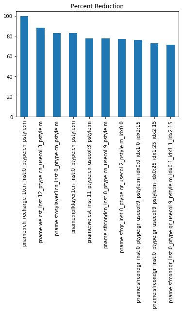
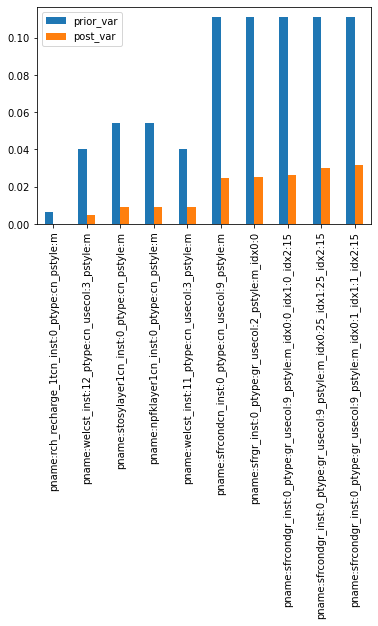
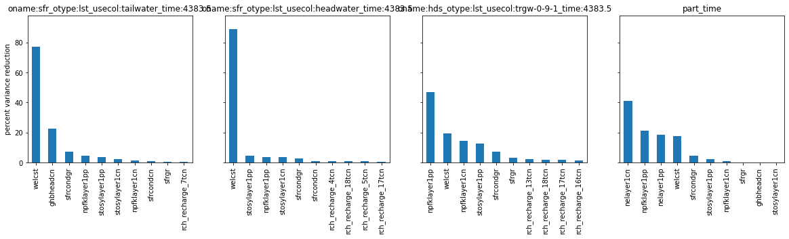
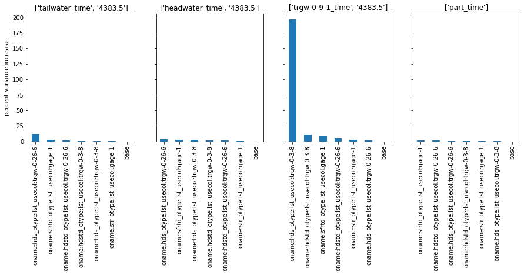
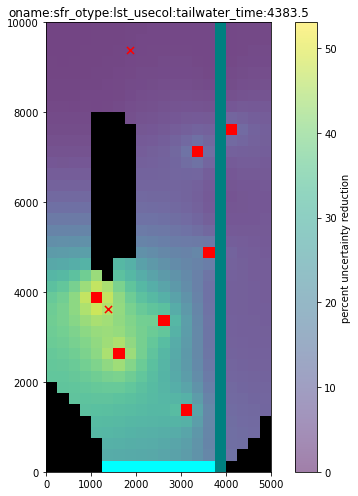
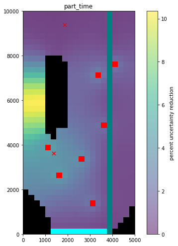
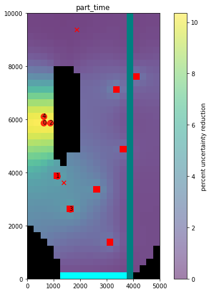

# FOSM, Data Worth and Related Assessments

Linear uncertainty analysis is also known as “first order second moment” (or FOSM) analysis. It provides approximate mathematical characterisation of prior predictive probability distributions, and of posterior parameter and predictive probability distributions. It has other uses as well. It can be used to demonstrate how the history-matching process bestows worth on data. It can also be deployed to track the flow of information from field measurements of system state to parameters, and ultimately from parameters to model predictions. It does all of these things by implementing Bayes equation under the following assumptions:

 - 	The prior probability distribution of parameters is multiGaussian. 
 - 	“Measurement noise” (including structural noise) is also characterized by a Gaussian probability distribution. 
 - 	The relationships between model outputs that correspond to measurements of system state and parameters employed by a model can be approximated by the action of a matrix on a vector.
 - 	Model outputs that correspond to predictions of management interest can be calculated using another matrix that acts on model parameters.

Ideally, linear analysis is undertaken after a model has been calibrated. However, if a model is truly linear (which it never is), the outcomes of linear analysis are independent of parameter values; they can therefore, in theory, be applied with a model that is endowed with user-supplied prior mean parameter values. 

If a model has undergone calibration, then minimum-error variance (i.e. calibrated) parameter values should be assigned to parameters as their initial values in the “parameter data” section of the PEST control file on which linear analysis is based. The Jacobian matrix should be calculated using these parameters. If the uncertainty of a prediction is being examined, then the model output that pertains to this prediction must be included as a (zero-weighted) “observation” in the PEST input dataset; sensitivities of this model output to model parameters will therefore appear in the Jacobian matrix. Alternatively, a separate prediction-only Jacobian matrix can be built based on a PEST control file that is dedicated to this purpose.

FOSM tasks may include:
 - approximate parameter and predictive uncertainty quantification;
 - data worth analysis;
 - identifying parameters that are most salient for forecasts of interest, 
 - identifying parameter contributions to predictive uncertainty and 
 - assessing parameter identifiability. 

Outcomes of these analyses can provide easily understood insights into what history-matching can and cannot achieve with the available information. These insights can be used to streamline the data assimlation process and guide further site characterisation studies. Of particular interest is data worth analysis. The worth of data is measured by their ability to reduce the uncertainties of model predictions that we care about. Because the equations on which FOSM relies do not require that an observation value already be known, data worth can be assessed on as-of-yet ungathered data. 


### The current tutorial
 
In this notebook, we will use outputs from previous notebooks (in particular `freyberg_glm_1.ipynb`) to eply first-order second-moment (FOSM) techniques to assess the flow of information from data to parameters and forecasts. In doing so we will asses the worth of existing and potential new data. "Worth" is framed here in the context of the extent to which the uncertainty surrounding a model prediction of management interest is reduced.  Given that these anayses can help target and optimize data acquisition strategies, this is a concept that really resonates with decision makers.

Note that in this tutorial, we will demonstrate FOSM applied __before__ calibration (i.e. as an optional intermediate step between the `freyberg_glm_1.ipynb` and `freyberg_glm_2.ipynb` notebooks), as several of these techniques can be a usefull tools that aid in the design of the calibration setup. However, they are equaly applicable __after__ calibration. In the `freyberg_glm_2.ipynb` notebook, some outcomes of post-calibration FOSM are discussed. 

Here we will be using functionality in `pyemu` to undertake FOSM. Similar analyses can be undertaken with the PREDUNC and PREDVAR suite of PEST utilities (see the [GMDSI](https://gmdsi.org/education/tutorials/) website for tutorials on these utilities). 

### Admin

Start off with the usual loading of dependencies and preparing model and PEST files. We will be continuing to work with the MODFLOW6 modified-Freyberg model (see "freyberg intro to model" notebook), and the high-dimensional PEST dataset prepared in the "freyberg_glm_1" notebook. For the purposes of this notebook, you do not require familiarity with previous notebooks (but it helps...). 

Simply run the next few cells by pressing `shift+enter`.


```python
import os
import warnings
warnings.filterwarnings("ignore")
warnings.filterwarnings("ignore", category=DeprecationWarning) 
import pandas as pd
import numpy as np
import matplotlib.pyplot as plt;


import shutil 
import scipy.stats as stats
import math

import sys
sys.path.append(os.path.join("..", "..", "dependencies"))
import pyemu
import flopy

plt.rcParams.update({'font.size': 10})
```

We are going to make use of the outcomes of the "freyberg_glm_1" tutorial, in which we ran `PEST++GLM` to calculate the Jacobian matrix prior to calibration. If you ran the notebook yourself, they should be recorded in the folder named "master_glm_1".

Let's start by specifying the folder path:


```python
m_d = os.path.join("..","part2_4_glm","master_glm_1")

# a check to see if the files are avilable
if not os.path.exists(m_d):
    raise Exception("you need to run the '/part2_4_glm/freyberg_glm_1.ipynb' notebook")
```

OK, now let's read in our PEST control file and take a peek, just to recall what is is we are working with:


```python
pst = pyemu.Pst(os.path.join(m_d,"freyberg_pp.pst"))
print('adjustable parameters:',pst.npar_adj,'\nnonzero observations:', pst.nnz_obs)
#pst.write_par_summary_table(filename="none")
```

    adjustable parameters: 391 
    nonzero observations: 144
    

### Getting ready for FOSM

We need three ingredients for FOSM:
 - parameter covariance matrix 
 - observation noise covariance matrix
 - jacobian matrix 

Let's start with the parameter covariance matrix. In this instance, our covariance matrix represents the prior parameter uncertainty. We prepared and recorded a prior covariance matrix when we constructed the PEST dataset (see the "pstfrom_pest_setup" tutorial). It is recorded in the file named `prior_cov.jcb`. 

Let's read it in a as a `pyemu.Cov` object:


```python
# read the file
cov = pyemu.Cov.from_binary(os.path.join(m_d,"prior_cov.jcb")).to_dataframe()

# the prior was constructed for the high-dimensional dataset; 
# but we had to drop lots of parameters to undertake GLM (see "freyberg_glm_1" tutorial)
# so we need to slice cov to get only adjustable parameter cols/rows
cov = cov.loc[pst.adj_par_names,pst.adj_par_names]
# and then rebuild it
cov = pyemu.Cov.from_dataframe(cov)
```

Take a quick peek:


```python
# let's inspect only
x = cov.x.copy()
x[x<1e-7] = np.nan
c = plt.imshow(x)
plt.colorbar()
```


    <matplotlib.colorbar.Colorbar at 0x1d91ae6df70>


    

    


The second ingredient we need is the jacobian matrix. In a previous tutorial, we ran `PEST++GLM` with the `fresyberg_pp.pst` control file to calculate the jacobian for intial parameter values and then stop (by setting `NOPTMAX` to -1). It is stored in the binary file named `freyberg_pp.jcb`.

Let's read it in as a `pyemu.Jco`:


```python
jco_file = os.path.join(m_d,"freyberg_pp.jcb")

jco = pyemu.Jco.from_binary(jco_file)
```

Lastly, we are still missing the noise covariance matrix. Unless instructed otherwise, `pyemu` will construct this matrix on-the-fly using weights in the PEST control file (and assuming that weights are the inverse of the standard deviation). 

Alternatively you can provide a user created (diagonal!) covariance matrix. In our case weights reflect measurement uncertainty. But just for the sake of demosntration, let's generate an observation covarance matrix from the control file (this is the same thing that `pyemu` would do in the background by default):


```python
obscov = pyemu.Cov.from_observation_data(pst)
```

The `Schur` object is one of the primary object for FOSM in pyEMU. It is the starting point for most things FOSM in the `pyemu` world. We are going to pass in our ingredients to instantiate a `Schur` object.

Now...`pyemu` is clever and does its best to reduce the amount of information you need to pass explicitly. Minimum requirements are the `Pst` and `Jco`. If not explicitly provided, the (diagonal) observation covariance matrix will be calculated from observation weights in `pst`. If present, forecasts will be populated from the list of `pst.forecast_names`.

However, here we will demonstrate by passing each ingredient explicitly:


```python
sc = pyemu.Schur(pst=pst, # the pest control file
                jco=jco, # the jacobian matrix
                parcov=cov, # the parameter covariance matrix; if not provided pyemu calculates from parameter bounds
                obscov=obscov, # the obs noise cov matrix; necessary if obs weights in the pst do not reflect uncertainty
                forecasts=pst.forecast_names # forecast observation names
                )

sc
```


    <pyemu.sc.Schur at 0x1d91cacfa00>


So that was easy...but maybe not the standard use case.  In many modeling analyses, there will be a separate scenario model - it is this model that will yield the forecast sensitivity vector(s) needed to map parameter uncertainty to _forecast_ uncertainty.  That is, you will need to run the scenario model once for each adjustble parameter to fill a separate jacobian -  jacobian that has the same columns as the obervation jacobian, but has rows that are the forecasts.  

In these cases you would have:
 1. a jacobian that pertains to the history matching model, and 
 2. a jacobian that pertains to the scenario model. 

For the purposes of FOSM, you would be interested in the sensitivities of history-matching observations recorded in (1) and sensitivities of forecast observations recorded in (2).

Now we didnt do that here - our model forward run includes both the history matching and scenario periods. So our jacobian already contains both sets of sensitivities. But we can "fake" it just for the sake of demonstration. Let's pretend that we have a second jacobian calculated using a scenario model:


```python
pretend_second_jco = pyemu.Jco.from_binary(jco_file)
```


Now we extract the forecast rows from the full jacobian:


```python
forecast_jco = pretend_second_jco.get(row_names=pst.forecast_names, drop=True)
```


```python
# shape: number of obs rows, number of par columns
forecast_jco.shape, jco.shape
```


    ((4, 391), (62223, 391))


```python
sc = pyemu.Schur(pst=pst, # the pest control file
                jco=jco, # the jacobian matrix
                parcov=cov, # the parameter covariance matrix; if not provided pyemu calculates from parameter bounds
                obscov=obscov, # the obs noise cov matrix; necessary if obs weights in the pst do not reflect uncertainty
                forecasts=forecast_jco.T # forecast sensitivity vectors
                )
```

Boom - easy! 

All computations are done and contained within `sc`.  We can now access different parts of `sc` depending on what FOSM-based analysis we wish to undertake.

### Posterior Parameter Uncertainty

Let's start by calculating the (approximate) __posterior__ parameter covariance matrix. Here, we are updating parameter covariance following notional calibration as represented by te Jacobian matrix and both prior parameter and observation noise covariance matrices. 

In other words, given prior parameter uncertainty (expressed by the prior `cov` matrix) and the inherent noise in measurments (expressed by the `obscov` matrix), we calculate the expected parameter uncertainty __after__ calibration. This assumes that calibration achieves a fit comensurate with measurement noise, parameter linearity, etc.

The posterior parameter covariance is stored as a `pyemu.Cov` object in the `sc.posterior_parameter` attribute:


```python
sc.posterior_parameter
```


    <pyemu.mat.mat_handler.Cov at 0x1d917206a60>


The diagonal of this matrix contains the posterior __variance__ for each parameter. The off-diagonals the parameter covariances. 


```python
# display a slice of the cov matrix
sc.posterior_parameter.to_dataframe().sort_index().sort_index(axis=1).iloc[0:3,0:3] 
```


<div>
<style scoped>
    .dataframe tbody tr th:only-of-type {
        vertical-align: middle;
    }

    .dataframe tbody tr th {
        vertical-align: top;
    }

    .dataframe thead th {
        text-align: right;
    }
</style>
<table border="1" class="dataframe">
  <thead>
    <tr style="text-align: right;">
      <th></th>
      <th>pname:ghbcondcn_inst:0_ptype:cn_usecol:4_pstyle:m</th>
      <th>pname:ghbheadcn_inst:0_ptype:cn_usecol:3_pstyle:a</th>
      <th>pname:nelayer1cn_inst:0_ptype:cn_pstyle:m</th>
    </tr>
  </thead>
  <tbody>
    <tr>
      <th>pname:ghbcondcn_inst:0_ptype:cn_usecol:4_pstyle:m</th>
      <td>0.094164</td>
      <td>0.036344</td>
      <td>0.000000</td>
    </tr>
    <tr>
      <th>pname:ghbheadcn_inst:0_ptype:cn_usecol:3_pstyle:a</th>
      <td>0.036344</td>
      <td>0.106820</td>
      <td>0.000000</td>
    </tr>
    <tr>
      <th>pname:nelayer1cn_inst:0_ptype:cn_pstyle:m</th>
      <td>0.000000</td>
      <td>0.000000</td>
      <td>0.054284</td>
    </tr>
  </tbody>
</table>
</div>


Let's make a little work of art - a plot of the posterior cov matrix. As expected, we see posterior variance along the diagonal and off-diagonals are symmetric:


```python
x = sc.posterior_parameter.x.copy()
x[x<1e-7] = np.nan
c = plt.imshow(x)
plt.colorbar(c)
```


    <matplotlib.colorbar.Colorbar at 0x1d91aa75310>


    

    


But...is calibration worth pursuing or not? Let's explore what the notional calibration is expected to do for parameter uncertainty. We accomplish this by comparing prior and posterior parameter uncertainty. Using `.get_parameter_summary()` makes this easy:


```python
par_sum = sc.get_parameter_summary().sort_values("percent_reduction",ascending=False)
par_sum.head()
```


<div>
<style scoped>
    .dataframe tbody tr th:only-of-type {
        vertical-align: middle;
    }

    .dataframe tbody tr th {
        vertical-align: top;
    }

    .dataframe thead th {
        text-align: right;
    }
</style>
<table border="1" class="dataframe">
  <thead>
    <tr style="text-align: right;">
      <th></th>
      <th>prior_var</th>
      <th>post_var</th>
      <th>percent_reduction</th>
    </tr>
  </thead>
  <tbody>
    <tr>
      <th>pname:sfrcondcn_inst:0_ptype:cn_usecol:9_pstyle:m</th>
      <td>0.111111</td>
      <td>0.017837</td>
      <td>83.946975</td>
    </tr>
    <tr>
      <th>pname:npfklayer3cn_inst:0_ptype:cn_pstyle:m</th>
      <td>0.054284</td>
      <td>0.010565</td>
      <td>80.537473</td>
    </tr>
    <tr>
      <th>pname:stosylayer1cn_inst:0_ptype:cn_pstyle:m</th>
      <td>0.054284</td>
      <td>0.012170</td>
      <td>77.580115</td>
    </tr>
    <tr>
      <th>pname:ghbheadcn_inst:0_ptype:cn_usecol:3_pstyle:a</th>
      <td>0.444444</td>
      <td>0.106820</td>
      <td>75.965389</td>
    </tr>
    <tr>
      <th>pname:welcst_inst:9_ptype:cn_usecol:3_pstyle:m</th>
      <td>0.040275</td>
      <td>0.010602</td>
      <td>73.675698</td>
    </tr>
  </tbody>
</table>
</div>


As the name suggests, the `percent_reduction` column in `par_sum` shows the  percentage decrease in uncertainty expected through calibration for each parameter.

For example, we can plot up the best ten:


```python
# we can plot up the top 10 uncertainty reductions
par_sum.iloc[0:10,:]['percent_reduction'].plot(kind='bar')
plt.title('Percent Reduction')
```


    Text(0.5, 1.0, 'Percent Reduction')


    

    


Alternatively we can compare the prior and posterior variances for the best ten:


```python
# we can plot up the prior and posterior variance 
# of the top 10 percent reductions
par_sum.iloc[0:10,:][['prior_var','post_var']].plot(kind='bar');
```


    

    


From the two plots above we can see that calibrating the model with available data definetly reduces uncertainty of some parameters. Some parameters are informed by observation data...however calibration does not afffect all parameters equally. 

Let's look at the other end of the spectrum - parameters for which there was little uncertainty reduction. Inspect the end of the parameter summary dataframe:


```python
par_sum.iloc[-5:,:]
```


<div>
<style scoped>
    .dataframe tbody tr th:only-of-type {
        vertical-align: middle;
    }

    .dataframe tbody tr th {
        vertical-align: top;
    }

    .dataframe thead th {
        text-align: right;
    }
</style>
<table border="1" class="dataframe">
  <thead>
    <tr style="text-align: right;">
      <th></th>
      <th>prior_var</th>
      <th>post_var</th>
      <th>percent_reduction</th>
    </tr>
  </thead>
  <tbody>
    <tr>
      <th>pname:nelayer1pp_inst:0_ptype:pp_pstyle:m_i:32_j:2_zone:1.0</th>
      <td>0.054284</td>
      <td>0.054284</td>
      <td>-4.440892e-14</td>
    </tr>
    <tr>
      <th>pname:nelayer3pp_inst:0_ptype:pp_pstyle:m_i:27_j:2_zone:1.0</th>
      <td>0.054284</td>
      <td>0.054284</td>
      <td>-4.440892e-14</td>
    </tr>
    <tr>
      <th>pname:nelayer2pp_inst:0_ptype:pp_pstyle:m_i:32_j:2_zone:1.0</th>
      <td>0.054284</td>
      <td>0.054284</td>
      <td>-4.440892e-14</td>
    </tr>
    <tr>
      <th>pname:nelayer1pp_inst:0_ptype:pp_pstyle:m_i:32_j:7_zone:1.0</th>
      <td>0.054284</td>
      <td>0.054284</td>
      <td>-6.661338e-14</td>
    </tr>
    <tr>
      <th>pname:nelayer2pp_inst:0_ptype:pp_pstyle:m_i:32_j:7_zone:1.0</th>
      <td>0.054284</td>
      <td>0.054284</td>
      <td>-6.661338e-14</td>
    </tr>
  </tbody>
</table>
</div>


Hmm - looks like there are some parameters which are not informed by calibration. Not surprising. For example, we are adjusting porosity values, but have no calibration observations which are affected by porosity...

Let's make a quick check of what parameter groups these un-informed parameters are part of:


```python
# get list of parnames with <1% uncert reduction; 1% is an arbitrary subjective choice...
uninf_par_names = par_sum.loc[par_sum['percent_reduction']<1].index.values

# get corresponding par group names
pst.parameter_data.loc[uninf_par_names, 'pargp'].unique()
```


    array(['npfklayer1pp', 'npfklayer2pp', 'sfrgr', 'welcst', 'npfklayer2cn',
           'stosslayer3pp', 'stosslayer3cn', 'stosslayer2cn', 'nelayer1pp',
           'nelayer2pp', 'nelayer3pp', 'nelayer1cn', 'rch_recharge_17tcn',
           'rch_recharge_16tcn', 'rch_recharge_23tcn', 'nelayer3cn',
           'rch_recharge_14tcn', 'rch_recharge_15tcn', 'rch_recharge_25tcn',
           'rch_recharge_24tcn', 'rch_recharge_22tcn', 'rch_recharge_20tcn',
           'rch_recharge_19tcn', 'nelayer2cn', 'rch_recharge_21tcn',
           'rch_recharge_18tcn'], dtype=object)


So, not too surprising to see porosity parameters groups, as well as parameters for recharge during the prediction period. Others, such as storage and permeability parameter groups, indicate that available observation data is not informative for the entire model domain.

When working with spatially ditributed parameters, it can be informative to map the distribution of uncertainty reduction. For example, let's use some `flopy` trickery to plot the % uncertainty reduction for a set of pilot point parameters:


```python
# choose a pilot point parmaeter group
pargp = 'npfklayer3pp'
```


```python
#get pars
hk_pars = pst.parameter_data.loc[pst.parameter_data.pargp==pargp]
hk_pars[['i','j']] = hk_pars[['i','j']].astype(int)
hk_parsum = par_sum.loc[hk_pars.parnme]
hk_parsum[['i','j']] = hk_pars.loc[hk_parsum.index.values, ['i','j']]

# load simulation
sim = flopy.mf6.MFSimulation.load(sim_ws=m_d, verbosity_level=0)
# load flow model
gwf = sim.get_model()

# plot
fig = plt.figure(figsize=(7, 7))
ax = fig.add_subplot(1, 1, 1, aspect='equal')
mm = flopy.plot.PlotMapView(model=gwf, ax=ax, layer=0)

# Plot grid 
mm.plot_grid(alpha=0.5)
mm.plot_inactive()
mm.plot_bc('ghb')
mm.plot_bc('sfr')

# plot ppoints and % unc reduction
pp_x = [gwf.modelgrid.xcellcenters[r-1,c-1] for r,c in hk_pars.loc[:,["i","j"]].values]
pp_y = [gwf.modelgrid.ycellcenters[r-1,c-1] for r,c in hk_pars.loc[:,["i","j"]].values]
scatter = ax.scatter(pp_x,pp_y,marker='o', s=hk_parsum.percent_reduction, c=hk_parsum.percent_reduction)
plt.colorbar(scatter,label="percent uncertainty reduction")

# plot head obsveration points
obs_ij = list(set([tuple(i.split('-')[-2:]) for i in pst.nnz_obs_groups if 'trgw' in i]))
obs_x = [gwf.modelgrid.xcellcenters[int(i)-1,int(j)-1] for i,j in obs_ij]
obs_y = [gwf.modelgrid.ycellcenters[int(i)-1,int(j)-1] for i,j in obs_ij]
ax.scatter(obs_x,obs_y,marker='x', c='red', s=50)


# Plot wells in layer 3
mm = flopy.plot.PlotMapView(model=gwf, ax=ax, layer=2)
mm.plot_bc('wel');
```


    

    


As expected, much of the uncertainty reduction for hydraulic conductivity is located around head observation wells (red crosses) and the SFR boundary - both of which we have observation data for. More importantly, we can see that uncertainty in the west is not reduced much. So our existing data does not provide much information on these areas. Parameter uncertainty here (and that of any forecasts that are affected by these parameters) will only be constrained by our expert knowledge (i.e. the prior parameter distribution).

## Forecast Uncertainty

So far we have seen that some parameter uncertainty will be reduced. Uncertainty for other parameters will not. That's great and all, but what we really care about are our forecast uncertainties. Do the parameters that are informed by calibration affect the forecast of interest? And will calibrating reduce the uncertainty of these forecast?

Let's examine the prior and posterior variance of our forecasts. Recall that they are recorded as observations in the `Pst` control file and also listed in the pest++ `forecast` control variable:


```python
forecasts = sc.pst.forecast_names
forecasts
```


    ['oname:sfr_otype:lst_usecol:tailwater_time:4383.5',
     'oname:sfr_otype:lst_usecol:headwater_time:4383.5',
     'oname:hds_otype:lst_usecol:trgw-0-9-1_time:4383.5',
     'part_time']


As before, `pyemu` has already done much of the heavy-lifting. We can get a summary of the forecast prior and posterior variances with `.get_forecast_summary()`:


```python
df = sc.get_forecast_summary()
df
```


<div>
<style scoped>
    .dataframe tbody tr th:only-of-type {
        vertical-align: middle;
    }

    .dataframe tbody tr th {
        vertical-align: top;
    }

    .dataframe thead th {
        text-align: right;
    }
</style>
<table border="1" class="dataframe">
  <thead>
    <tr style="text-align: right;">
      <th></th>
      <th>prior_var</th>
      <th>post_var</th>
      <th>percent_reduction</th>
    </tr>
  </thead>
  <tbody>
    <tr>
      <th>oname:sfr_otype:lst_usecol:tailwater_time:4383.5</th>
      <td>1.824192e+05</td>
      <td>5.956144e+04</td>
      <td>67.349137</td>
    </tr>
    <tr>
      <th>oname:sfr_otype:lst_usecol:headwater_time:4383.5</th>
      <td>1.035079e+05</td>
      <td>5.176013e+04</td>
      <td>49.994014</td>
    </tr>
    <tr>
      <th>oname:hds_otype:lst_usecol:trgw-0-9-1_time:4383.5</th>
      <td>2.648081e-01</td>
      <td>5.727902e-02</td>
      <td>78.369610</td>
    </tr>
    <tr>
      <th>part_time</th>
      <td>9.515619e+10</td>
      <td>3.327957e+10</td>
      <td>65.026369</td>
    </tr>
  </tbody>
</table>
</div>


And we can make a cheeky little plot of that. As you can see, unsurprisingly some forecasts benefit more from calibration than others. So, depending on the foreacst of interest, calibration may or may not be worthwhile...


```python
# get the forecast summary then make a bar chart of the percent_reduction column
fig = plt.figure()
ax = plt.subplot(111)
ax = df.percent_reduction.plot(kind='bar',ax=ax,grid=True)
ax.set_ylabel("percent uncertainy\nreduction from calibration")
ax.set_xlabel("forecast")
```


    Text(0.5, 0, 'forecast')


    

    


## Parameter contribution to forecast uncertainty

Information flows from observations to parameters and then out to forecasts. Information contained in observation data constrains parameter uncertainty, which in turn constrains forecast uncertainty. For a given forecast, we can evaluate which parameter contributes the most to uncertainty. This is accomplished by assuming a parameter (or group of parameters) is perfectly known and then assessing forecast uncertainty under that assumption. Comparing uncertainty obtained in this manner, to the forecast uncertainty under the base assumption (in which no parameter is perfectly known), the contribution from that parameter (or parameter group) is obtained. 

Now, this is a pretty big assumption - in practice a parameter is never perfectly known. Nevertheless, this metric can provide usefull insights into the flow of information from data to forecast uncertainty, which can help guide data assimilation design as well as future data collection efforts. 

In `pyemu` we can  evaluate parameter contributions to forecast uncertainty with groups of parameters by type using `.get_par_group_contribution()`:


```python
par_contrib = sc.get_par_group_contribution()
par_contrib.head()
```


<div>
<style scoped>
    .dataframe tbody tr th:only-of-type {
        vertical-align: middle;
    }

    .dataframe tbody tr th {
        vertical-align: top;
    }

    .dataframe thead th {
        text-align: right;
    }
</style>
<table border="1" class="dataframe">
  <thead>
    <tr style="text-align: right;">
      <th></th>
      <th>oname:sfr_otype:lst_usecol:tailwater_time:4383.5</th>
      <th>oname:sfr_otype:lst_usecol:headwater_time:4383.5</th>
      <th>oname:hds_otype:lst_usecol:trgw-0-9-1_time:4383.5</th>
      <th>part_time</th>
    </tr>
  </thead>
  <tbody>
    <tr>
      <th>base</th>
      <td>59561.437219</td>
      <td>51760.130357</td>
      <td>0.057279</td>
      <td>3.327957e+10</td>
    </tr>
    <tr>
      <th>ghbcondcn</th>
      <td>59560.166734</td>
      <td>51126.990125</td>
      <td>0.056605</td>
      <td>3.324723e+10</td>
    </tr>
    <tr>
      <th>ghbheadcn</th>
      <td>42231.382689</td>
      <td>50342.640087</td>
      <td>0.050911</td>
      <td>2.484017e+10</td>
    </tr>
    <tr>
      <th>nelayer1cn</th>
      <td>59561.437219</td>
      <td>51760.130357</td>
      <td>0.057279</td>
      <td>3.327605e+10</td>
    </tr>
    <tr>
      <th>nelayer1pp</th>
      <td>59561.437219</td>
      <td>51760.130357</td>
      <td>0.057279</td>
      <td>3.327728e+10</td>
    </tr>
  </tbody>
</table>
</div>


We can see the relatve contribution by normalizing to the base case (e.g. in which no parameters/groups are perfectly known):


```python
base = par_contrib.loc["base",:]
par_contrib = 100.0 * (base - par_contrib) / base
par_contrib.sort_index().head()
```


<div>
<style scoped>
    .dataframe tbody tr th:only-of-type {
        vertical-align: middle;
    }

    .dataframe tbody tr th {
        vertical-align: top;
    }

    .dataframe thead th {
        text-align: right;
    }
</style>
<table border="1" class="dataframe">
  <thead>
    <tr style="text-align: right;">
      <th></th>
      <th>oname:sfr_otype:lst_usecol:tailwater_time:4383.5</th>
      <th>oname:sfr_otype:lst_usecol:headwater_time:4383.5</th>
      <th>oname:hds_otype:lst_usecol:trgw-0-9-1_time:4383.5</th>
      <th>part_time</th>
    </tr>
  </thead>
  <tbody>
    <tr>
      <th>base</th>
      <td>0.000000e+00</td>
      <td>0.000000e+00</td>
      <td>0.000000e+00</td>
      <td>0.000000</td>
    </tr>
    <tr>
      <th>ghbcondcn</th>
      <td>2.133066e-03</td>
      <td>1.223220e+00</td>
      <td>1.177386e+00</td>
      <td>0.097191</td>
    </tr>
    <tr>
      <th>ghbheadcn</th>
      <td>2.909610e+01</td>
      <td>2.738576e+00</td>
      <td>1.111680e+01</td>
      <td>25.359096</td>
    </tr>
    <tr>
      <th>nelayer1cn</th>
      <td>-6.107943e-14</td>
      <td>0.000000e+00</td>
      <td>2.422839e-14</td>
      <td>0.010602</td>
    </tr>
    <tr>
      <th>nelayer1pp</th>
      <td>2.076701e-13</td>
      <td>-4.779404e-13</td>
      <td>-9.206790e-13</td>
      <td>0.006886</td>
    </tr>
  </tbody>
</table>
</div>


Now it is a simple matter to plot these up for each forecast. Remember! Parameter contributions to uncertainty are forecast specific. The plots below display the top ten parameter groups that contribute to each forecast's uncertainty. Note that different forecasts are affected by different parameters. 


```python
plt.figure(figsize=(15,4))
i=1
for forecast in par_contrib.columns:
    fore_df = par_contrib.loc[:,forecast].copy()
    fore_df.sort_values(inplace=True, ascending=False)
    ax = plt.subplot(1,4,i, sharey=ax)
    i+=1
    fore_df.iloc[:10].plot(kind="bar",color="tab:blue", ax =ax)
    ax.set_title(forecast)
    ax.set_ylabel("percent variance reduction")
#plt.tight_layout()
plt.show()
```


    

    


Understanding the links between parameters and forecast uncertainties can be usefull - in particular to gain insight into the system dynamics. But we are still missing a step to understand what _observation_ data affects the forecast. It is often more straightforward to quantify how observation information imapcts forecast uncertianty so that we can explore the worth of observation data directly.

# Data worth analysis

The worth of data is measured by their ability to reduce the uncertainties of model predictions that we care about. Linear analysis is particularly useful for exploring data worth. This is because the equations that it uses to calculate predictive uncertainty do not include terms that represent the actual values of observations or of parameters; only sensitivities of model outputs to parameters are required. Therefore, linear analysis can be used to assess the ability (or otherwise) of yet-ungathered data to reduce the uncertainties of decision-critical predictions.

This means that potential field measurements that correspond to one or many outputs of a model can be assessed for their worth. For example, it is possible to assess the worth of observations of head in every single model cell at every time step of a model run with a relatively small computational burden. This makes linear analysis a useful tool for designing and comparing strategies for data-collection, when data acquisition seeks to reduce the uncertainties of one or a number of decision-critical predictions. 

There are two main applications for data worth analysis:
 1.	ranking of the relative worth of existing observations by calculating predictive uncertainty with selected individual or combined observations removed from a calibration dataset. 
 2.	ranking of the relative worth of __potential__ new observations by calculating predictive uncertainty with selected individual or combined observations added to an existing calibration dataset.


## Data worth - evaluating existing observations

Here we identify which (existing) observations are most important to reducing the posterior uncertainty of a specific forecast. To acomplish this, we simply need to recalculate the Schur complement, but ignoring some of the observation sensitivities. 

Once again, `pyemu` makes this easy for us with the `get_removed_obs_importance()` method.  This method tests how important individual __non-zero__ observations are for reducing uncertainty for each forecast observation. By default, it tests all non-zero obsevrations in the control file and returns a `Dataframe`:


```python
df_worth = sc.get_removed_obs_importance()
df_worth.head()
```


<div>
<style scoped>
    .dataframe tbody tr th:only-of-type {
        vertical-align: middle;
    }

    .dataframe tbody tr th {
        vertical-align: top;
    }

    .dataframe thead th {
        text-align: right;
    }
</style>
<table border="1" class="dataframe">
  <thead>
    <tr style="text-align: right;">
      <th></th>
      <th>oname:sfr_otype:lst_usecol:tailwater_time:4383.5</th>
      <th>oname:sfr_otype:lst_usecol:headwater_time:4383.5</th>
      <th>oname:hds_otype:lst_usecol:trgw-0-9-1_time:4383.5</th>
      <th>part_time</th>
    </tr>
  </thead>
  <tbody>
    <tr>
      <th>base</th>
      <td>59561.437219</td>
      <td>51760.130357</td>
      <td>0.057279</td>
      <td>3.327957e+10</td>
    </tr>
    <tr>
      <th>oname:hds_otype:lst_usecol:trgw-0-26-6_time:3683.5</th>
      <td>59594.279086</td>
      <td>51762.585155</td>
      <td>0.057295</td>
      <td>3.330021e+10</td>
    </tr>
    <tr>
      <th>oname:hds_otype:lst_usecol:trgw-0-26-6_time:3712.5</th>
      <td>59625.580513</td>
      <td>51767.784214</td>
      <td>0.057298</td>
      <td>3.331757e+10</td>
    </tr>
    <tr>
      <th>oname:hds_otype:lst_usecol:trgw-0-26-6_time:3743.5</th>
      <td>59583.122220</td>
      <td>51787.525952</td>
      <td>0.057324</td>
      <td>3.332052e+10</td>
    </tr>
    <tr>
      <th>oname:hds_otype:lst_usecol:trgw-0-26-6_time:3773.5</th>
      <td>59565.198489</td>
      <td>51760.160861</td>
      <td>0.057279</td>
      <td>3.329369e+10</td>
    </tr>
  </tbody>
</table>
</div>


It may be more usefull to look at groupings of observations. For example, in our case we are dealing with time series of measurments at different locations. It may be more usefull to assess the worth of the entire time series of data, and not just each individual measurement. 

We can assess groupings of observations by passsing a dictionary with non-zero observation name lists as values. Let's first create such a dictionary. In our case, the time series of observations from each site is in a distinct observation group. So we can simply group observations by observation group name:


```python
obs_nz = sc.pst.observation_data.loc[pst.nnz_obs_names]
nn_obs_dict={}
for obsgp in pst.nnz_obs_groups:
    values = obs_nz.loc[obs_nz.obgnme==obsgp, 'obsnme'].tolist()
    nn_obs_dict[obsgp]=values
```

And now recalculate data worth using the dictionary:


```python
dw_rm = sc.get_removed_obs_importance(nn_obs_dict)
dw_rm.head()
```


<div>
<style scoped>
    .dataframe tbody tr th:only-of-type {
        vertical-align: middle;
    }

    .dataframe tbody tr th {
        vertical-align: top;
    }

    .dataframe thead th {
        text-align: right;
    }
</style>
<table border="1" class="dataframe">
  <thead>
    <tr style="text-align: right;">
      <th></th>
      <th>oname:sfr_otype:lst_usecol:tailwater_time:4383.5</th>
      <th>oname:sfr_otype:lst_usecol:headwater_time:4383.5</th>
      <th>oname:hds_otype:lst_usecol:trgw-0-9-1_time:4383.5</th>
      <th>part_time</th>
    </tr>
  </thead>
  <tbody>
    <tr>
      <th>base</th>
      <td>59561.437219</td>
      <td>51760.130357</td>
      <td>0.057279</td>
      <td>3.327957e+10</td>
    </tr>
    <tr>
      <th>oname:hds_otype:lst_usecol:trgw-0-26-6</th>
      <td>60113.601986</td>
      <td>51897.790606</td>
      <td>0.057567</td>
      <td>3.374088e+10</td>
    </tr>
    <tr>
      <th>oname:hds_otype:lst_usecol:trgw-0-3-8</th>
      <td>59979.646407</td>
      <td>51832.222435</td>
      <td>0.057743</td>
      <td>3.333433e+10</td>
    </tr>
    <tr>
      <th>oname:hds_otype:lst_usecol:trgw-2-26-6</th>
      <td>60225.324951</td>
      <td>51941.013331</td>
      <td>0.057600</td>
      <td>3.374710e+10</td>
    </tr>
    <tr>
      <th>oname:hds_otype:lst_usecol:trgw-2-3-8</th>
      <td>59904.408417</td>
      <td>51820.222115</td>
      <td>0.057856</td>
      <td>3.332904e+10</td>
    </tr>
  </tbody>
</table>
</div>


The `base` row contains the results of the Schur's complement calculation using all observations (so the forecast unceratainty assuming all observation data is used for calibration). Subsequently, there  is a row for each non-zero obsevration group. Each row lists forecast uncertainties calculated assuming that the observation group was __not__ used for history matching. 

We can normalize the importance of each row to the base case (i.e. the lowest uncertainty, or maximum uncertainty reduction), provinding a easy to interpret metric of importance. We can then quickly identify which observation/observation grouping are important for reducing forecast uncertainty:


```python
# let's normalize to make more meaningful comparisons of data worth (unctainty variance reduction)
base = dw_rm.loc["base",:]
dw_rm = 100 * (dw_rm  - base) / base
dw_rm.head()
```


<div>
<style scoped>
    .dataframe tbody tr th:only-of-type {
        vertical-align: middle;
    }

    .dataframe tbody tr th {
        vertical-align: top;
    }

    .dataframe thead th {
        text-align: right;
    }
</style>
<table border="1" class="dataframe">
  <thead>
    <tr style="text-align: right;">
      <th></th>
      <th>oname:sfr_otype:lst_usecol:tailwater_time:4383.5</th>
      <th>oname:sfr_otype:lst_usecol:headwater_time:4383.5</th>
      <th>oname:hds_otype:lst_usecol:trgw-0-9-1_time:4383.5</th>
      <th>part_time</th>
    </tr>
  </thead>
  <tbody>
    <tr>
      <th>base</th>
      <td>0.000000</td>
      <td>0.000000</td>
      <td>0.000000</td>
      <td>0.000000</td>
    </tr>
    <tr>
      <th>oname:hds_otype:lst_usecol:trgw-0-26-6</th>
      <td>0.927051</td>
      <td>0.265958</td>
      <td>0.502687</td>
      <td>1.386165</td>
    </tr>
    <tr>
      <th>oname:hds_otype:lst_usecol:trgw-0-3-8</th>
      <td>0.702148</td>
      <td>0.139281</td>
      <td>0.810356</td>
      <td>0.164537</td>
    </tr>
    <tr>
      <th>oname:hds_otype:lst_usecol:trgw-2-26-6</th>
      <td>1.114627</td>
      <td>0.349464</td>
      <td>0.560166</td>
      <td>1.404840</td>
    </tr>
    <tr>
      <th>oname:hds_otype:lst_usecol:trgw-2-3-8</th>
      <td>0.575828</td>
      <td>0.116097</td>
      <td>1.007899</td>
      <td>0.148646</td>
    </tr>
  </tbody>
</table>
</div>


Let's plot the ten most important observations for each forecast. 


```python
plt.figure(figsize=(15,4))
i=1
ax = None
for forecast in dw_rm.columns:
    ax = plt.subplot(1,4,i, sharey=ax)
    i+=1
    fore_df = dw_rm.loc[:,forecast].copy()
    fore_df.sort_values(inplace=True, ascending=False)
    fore_df.iloc[:10].plot(kind="bar",color="tab:blue", ax=ax)
    ax.set_title(forecast.split(':')[-2:])
    ax.set_ylabel("percent variance increase")
#plt.tight_layout()
plt.show()
```


    

    


We also have the option of calculating the worth of obsverations by taking a "base" condition of zero observations (i.e. no measurment information at all) and calculating the reduction in uncertainty by __adding__ observations to the dataset.

Here we are obtaining a measure of the worth of the observation __on its own__. This provides a metric of the absolute worth of information contained by the observation. The previous metric (of removed importance) provides a measure of the worth that the observation contributes to the _existing_ dataset; so how much more information do we gain by also including this observation. 

In summary, the importance calculated by __removing__ an observation from a dataset provides a measure of the extra information that the other observations in the dataset do not have. The importance calculated by __adding__ an observation to a base case of no observations, provides a measure of the total information content of that single observation (or group of observations).


```python
dw_ad = sc.get_added_obs_importance(nn_obs_dict)
base = dw_ad.loc["base",:]
dw_ad = 100 * (base - dw_ad) / base
plt.figure(figsize=(15,4))
i=1
ax=None
for forecast in dw_ad.columns:
    ax = plt.subplot(1,4,i, sharey=ax)
    i+=1
    fore_df_ad = dw_ad.loc[:,forecast].copy()
    fore_df_ad.sort_values(inplace=True, ascending=False)
    fore_df_ad.iloc[:20].plot(kind="bar",color="tab:blue", ax=ax)
    ax.set_title(forecast.split(':')[-2:])
    ax.set_ylabel("percent variance decrease")
#plt.tight_layout()
plt.show()
```


    

    


## Data worth - the value of potential new observations

This is where things get really cool. As previously mentioned, the equations on which FOSM is based do not rely on knowing the values of observations or parameters - only their sensitivities. This allows us to calculate the worth of as-of-yet uncollected data. 

Recall from the "pstfrom_pest_setup" tutorial that we included the simulated head in every cell at the end of every stress period as observations in our PEST dataset. (We included a function to extract these values from the MODFLOW6 generated outputs as part of the model forward run.) We have been "carrying" these zero-weighted observations all this time and thus obtained sensitivities for these observations when calcualiting the Jacobian (see the "freyberg_glm_1" tutorial). If we now assume some value of measurement noise (a non-zero weight in the control file), we can run a hypothetical "calibration" analysis using Schur complement. 

Cell-by-cell head observations are in the observation groups with names that start with `hdslay1`, `hdslay2` and `hdslay3`. Now, we could look at the data worth at each location at the end of each stress period. But, beware! Calculaling the Schur complement for all potential observation types and locations can take quite some time! You may need to sample from all availables outputs to speed things up.  

For the sake of this tutorial, let's focus on `hdslay3` groups: cell-by-cell heads in the bottom layer 3. Instead of evaluating the worth of observations at distinct times, let's look at the value of having *time series* of observations at each location. To do so we group head observations from each stress period at the same well and assess the worth of having this "group" of observations.

As we did previously, start by creating a dictionary of observations at each model cell:


```python
obs = sc.pst.observation_data

# get list of obs names; oname column to the rescue
obsnames = obs.loc[obs.oname=='hdslay3','obsnme'].tolist()
# get obs data for seelcted observations
obs_new = obs.loc[obs.oname=='hdslay3']
# assign spd number to new column to make life easier
obs_new['spd'] = obs_new.obsnme.apply(lambda x:int(x.split('_')[1].replace('t','')) )
# lets keep only the observations in the "future":
obs_new = obs_new.loc[obs_new.spd>12]
# get list of unique cell ij's so we can group them by cell
obs_new['ij'] = 'i:' + obs_new['i'] + '_j:' + obs_new['j']
cell_ij = list(set([tuple(i) for i in obs.loc[obs.oname=='hdslay3', ['i','j']].values]))

# prepare the dictionary; 
# keys==cell ij's; 
# values are corresponding observation names from each spd 
new_obs_dict={}
for ij in obs_new.ij.unique():
    names = obs_new.loc[obs_new.ij==ij, 'obsnme'].tolist()
    new_obs_dict[ij] = names

```

Now we repeat the analysis above with the new dictionary of potential new observations using the `get_added_obs_importance()` method.

An __important__ detail here: the potential new observation weights. 

Inherent to these analyses is the assumption that calibration will be able to achieve a fit with observation data that reflects measurement noise (and that the observation weight is equal to the inverse of the standard deviation of noise). We need to provide `pyemu` with the weights for these potential new observations. Weights need to reflect expected measurement noise. We do so by passing the a value to `reset_zero_weight` when calling `get_added_obs_importance()`.

Let's assign the same weight to all new obsevrations:


```python
new_obs_weight = 1/1 # 1/stdv_meas_noise
new_obs_weight
```


    1.0


Right then - here we go! This can take a while:


```python
from datetime import datetime
start = datetime.now()
df_worth_new= sc.get_added_obs_importance(base_obslist=sc.pst.nnz_obs_names,
                            obslist_dict=new_obs_dict,
                            reset_zero_weight=1.0)
print("took:",datetime.now() - start)
```

    took: 0:02:03.322775
    

As before, `get_added_obs_importance()` returns a dataframe with a column for each forecast, and a row for each potential new observation:


```python
df_worth_new.head()
```


<div>
<style scoped>
    .dataframe tbody tr th:only-of-type {
        vertical-align: middle;
    }

    .dataframe tbody tr th {
        vertical-align: top;
    }

    .dataframe thead th {
        text-align: right;
    }
</style>
<table border="1" class="dataframe">
  <thead>
    <tr style="text-align: right;">
      <th></th>
      <th>oname:sfr_otype:lst_usecol:tailwater_time:4383.5</th>
      <th>oname:sfr_otype:lst_usecol:headwater_time:4383.5</th>
      <th>oname:hds_otype:lst_usecol:trgw-0-9-1_time:4383.5</th>
      <th>part_time</th>
    </tr>
  </thead>
  <tbody>
    <tr>
      <th>base</th>
      <td>59561.437219</td>
      <td>51760.130357</td>
      <td>0.057279</td>
      <td>3.327957e+10</td>
    </tr>
    <tr>
      <th>i:0_j:0</th>
      <td>52561.223147</td>
      <td>46359.936960</td>
      <td>0.044070</td>
      <td>3.291755e+10</td>
    </tr>
    <tr>
      <th>i:0_j:1</th>
      <td>52608.688687</td>
      <td>46408.943986</td>
      <td>0.044257</td>
      <td>3.292824e+10</td>
    </tr>
    <tr>
      <th>i:0_j:10</th>
      <td>54802.136815</td>
      <td>48470.527202</td>
      <td>0.051199</td>
      <td>3.321296e+10</td>
    </tr>
    <tr>
      <th>i:0_j:11</th>
      <td>55254.781873</td>
      <td>48846.148062</td>
      <td>0.052073</td>
      <td>3.323746e+10</td>
    </tr>
  </tbody>
</table>
</div>


It can be usefull to display this information on a map. Let's process this output and do some `flopy` trickery to display it on the model grid.

As we did before, first let's normalize the results to the "base" case (i.e. base==with no new observations). Let's prepare a function to make our life easier:


```python
def worth_plot_prep(df):
    # some processing
    df_new_base = df.loc["base",:].copy()  # "base" row
    df_new_imax = df.apply(lambda x: df_new_base - x, axis=1).idxmax()  # obs with largest unc red for each pred
    df_new_worth = 100.0 * (df.apply(lambda x: df_new_base - x, axis=1) / df_new_base)  # normalizing like above
    
    # plot prep
    df_new_worth_plot = df_new_worth[df_new_worth.index != 'base'].copy()
    df_new_worth_plot.loc[:,'names'] = df_new_worth_plot.index
    names = df_new_worth_plot.names
    df_new_worth_plot.loc[:,"i"] = names.apply(lambda x: int(x.split('_')[-2].replace('i:','')))
    df_new_worth_plot.loc[:,"j"] = names.apply(lambda x: int(x.split('_')[-1].replace('j:','')))
        
    return df_new_worth_plot, df_new_imax
```

Now we have a dataframe of "percentage variance reduction" for each potential new observation:


```python
df_worth_new_plot, df_worth_new_imax = worth_plot_prep(df_worth_new)
df_worth_new_plot.head()
```


<div>
<style scoped>
    .dataframe tbody tr th:only-of-type {
        vertical-align: middle;
    }

    .dataframe tbody tr th {
        vertical-align: top;
    }

    .dataframe thead th {
        text-align: right;
    }
</style>
<table border="1" class="dataframe">
  <thead>
    <tr style="text-align: right;">
      <th></th>
      <th>oname:sfr_otype:lst_usecol:tailwater_time:4383.5</th>
      <th>oname:sfr_otype:lst_usecol:headwater_time:4383.5</th>
      <th>oname:hds_otype:lst_usecol:trgw-0-9-1_time:4383.5</th>
      <th>part_time</th>
      <th>names</th>
      <th>i</th>
      <th>j</th>
    </tr>
  </thead>
  <tbody>
    <tr>
      <th>i:0_j:0</th>
      <td>11.752930</td>
      <td>10.433114</td>
      <td>23.060982</td>
      <td>1.087840</td>
      <td>i:0_j:0</td>
      <td>0</td>
      <td>0</td>
    </tr>
    <tr>
      <th>i:0_j:1</th>
      <td>11.673238</td>
      <td>10.338433</td>
      <td>22.734129</td>
      <td>1.055696</td>
      <td>i:0_j:1</td>
      <td>0</td>
      <td>1</td>
    </tr>
    <tr>
      <th>i:0_j:10</th>
      <td>7.990573</td>
      <td>6.355477</td>
      <td>10.614554</td>
      <td>0.200168</td>
      <td>i:0_j:10</td>
      <td>0</td>
      <td>10</td>
    </tr>
    <tr>
      <th>i:0_j:11</th>
      <td>7.230610</td>
      <td>5.629782</td>
      <td>9.089283</td>
      <td>0.126553</td>
      <td>i:0_j:11</td>
      <td>0</td>
      <td>11</td>
    </tr>
    <tr>
      <th>i:0_j:12</th>
      <td>6.484469</td>
      <td>4.887795</td>
      <td>7.675413</td>
      <td>0.072924</td>
      <td>i:0_j:12</td>
      <td>0</td>
      <td>12</td>
    </tr>
  </tbody>
</table>
</div>


And now a longer funtion to display this information on the model grid:


```python
def plot_added_importance(df_worth_new_plot, forecast_name, newlox=None):
    # prep unc reduction array
    unc_array = np.zeros_like(gwf.npf.k.array[0]) - 1
    for i,j,unc in zip(df_worth_new_plot.i,df_worth_new_plot.j,
                        df_worth_new_plot[forecast_name]):
        unc_array[i,j] = unc 
    unc_array[unc_array == 0] = np.NaN

    # plot
    fig = plt.figure(figsize=(7, 7))
    ax = fig.add_subplot(1, 1, 1, aspect='equal')
    mm = flopy.plot.PlotMapView(model=gwf, ax=ax, layer=0)

    # plot unc reduction
    vmax = df_worth_new_plot[forecast_name].max()
    cb = mm.plot_array(unc_array, alpha=0.5, vmin=0, vmax=vmax)
    plt.colorbar(cb,label="percent uncertainty reduction")

    # plot head obsveration points
    obs_ij = list(set([tuple(i.split('-')[-2:]) for i in pst.nnz_obs_groups if 'trgw' in i]))
    obs_x = [gwf.modelgrid.xcellcenters[int(i)-1,int(j)-1] for i,j in obs_ij]
    obs_y = [gwf.modelgrid.ycellcenters[int(i)-1,int(j)-1] for i,j in obs_ij]
    ax.scatter(obs_x,obs_y,marker='x', c='red', s=50)

    # display the "next best observation"
    if newlox:  
        currx = []
        curry = []
        for i,clox in enumerate(newlox):
            crow = int(clox.split('_')[0].replace('i:',''))
            ccol = int(clox.split('_')[-1].replace('j:',''))
            currx.append(gwf.modelgrid.xcellcenters[crow,ccol])
            curry.append(gwf.modelgrid.ycellcenters[crow,ccol])
        for nl,(cx,cy,cobs) in enumerate(zip(currx, curry, newlox)):
                    #csp = int(cobs[-1])
                    #if csp == sp:
                    ax.plot(cx, cy, marker='o', c='red', mfc=None, ms=10, alpha=0.8)
                    ax.text(cx-50,cy-50, nl, size=10)

    # Plot grid 
    mm.plot_inactive()
    mm.plot_bc('ghb')
    mm.plot_bc('sfr')
    # Plot wells in layer 3
    mm = flopy.plot.PlotMapView(model=gwf, ax=ax, layer=2)
    mm.plot_bc('wel');

    ax.set_title(f"{forecast_name}")
    plt.tight_layout()
    return fig
```

Recall that data worth is forecast specific, so let's plot a map for each forecast. 

Magic! (Well, no - just maths actually, but pretty close.) 

From the plots below we can identify where we should prioritize groundwater level data collection in the bottom layer to improve our ability to reduce forecast uncertainty. (Recall that we only asssed data worth of time series of head in the bottom layer).


```python
for forecast_name in forecasts:
    plot_added_importance(df_worth_new_plot, forecast_name)
```


    

    


    

    


    

    


    

    


### The "next" best observation

Imagine we now go out and drill a monitoring well at the best location. Where should we drill a second monitoring well? The next best location? According to the plots above, the next best location may be right next to our new well. Does that make sense?

Through the above analysis we have determined the ability of head observations taken in each individual cell to reduce the uncertainty of each of our forecasts. However, this tells us nothing about the uniqueness of information that each of these measurements carry. Some of the information that these potential observations carry is most likely duplicated.

So what we really want to know is, if we now have new data...what is the next best location _accounting for the new data_? Glad you asked!

We can do this by incrementaly making additional observations. For example, from the analyses shown above, assume we take the best new potential observation. Then, repeat the analysis again, but this time we assume that we have that new data. From the second iteration we obtain the next best observation. Repeat it again for the third best...and so on.

Incremental observation worth analysis can be implemented with `next_most_important_added_obs()`. Let's do so now for the same observation list as above, assuming we only have a budget to drill 5 new observation wells.  Now, keep in mind that we are going to repeat the calculations five times. Just once already took quite some time - guess what, its going to take about 5 times as long this time!

Recall once again that data worth is forecast specific. If we are choosing "the best" observation at the end of each iteration, we can only select "the best" for a specific forecast. If we have multiple forecasts, we must specify which one we are prioritizing for variance reduction:


```python
forecast_name = forecasts[-1]
forecast_name
```


    'part_time'


```python
start = datetime.now()
next_most_df = sc.next_most_important_added_obs(forecast=forecast_name,
                                                niter=5,
                                                obslist_dict=new_obs_dict,
                                                base_obslist=sc.pst.nnz_obs_names,
                                                reset_zero_weight=True)
print("took:",datetime.now() - start)
```

    took: 0:10:28.495257
    


```python
next_most_df
```


<div>
<style scoped>
    .dataframe tbody tr th:only-of-type {
        vertical-align: middle;
    }

    .dataframe tbody tr th {
        vertical-align: top;
    }

    .dataframe thead th {
        text-align: right;
    }
</style>
<table border="1" class="dataframe">
  <thead>
    <tr style="text-align: right;">
      <th></th>
      <th>best_obs</th>
      <th>part_time_variance</th>
      <th>unc_reduce_iter_base</th>
      <th>unc_reduce_initial_base</th>
    </tr>
  </thead>
  <tbody>
    <tr>
      <th>i:39_j:5</th>
      <td>i:39_j:5</td>
      <td>3.056521e+10</td>
      <td>8.156250</td>
      <td>8.156250</td>
    </tr>
    <tr>
      <th>i:39_j:6</th>
      <td>i:39_j:6</td>
      <td>2.941709e+10</td>
      <td>3.756296</td>
      <td>11.606173</td>
    </tr>
    <tr>
      <th>i:39_j:7</th>
      <td>i:39_j:7</td>
      <td>2.879613e+10</td>
      <td>2.110876</td>
      <td>13.472057</td>
    </tr>
    <tr>
      <th>i:9_j:16</th>
      <td>i:9_j:16</td>
      <td>2.837543e+10</td>
      <td>1.460959</td>
      <td>14.736195</td>
    </tr>
    <tr>
      <th>i:15_j:0</th>
      <td>i:15_j:0</td>
      <td>2.789407e+10</td>
      <td>1.696395</td>
      <td>16.182606</td>
    </tr>
  </tbody>
</table>
</div>


And now let's plot that up again using our function. This time we will also display the location of the best 5 new observation wells (labeled red circles). These are labeled according to the order of their data worth.


```python
fig = plot_added_importance(df_worth_new_plot,
                            forecast_name,
                            newlox = next_most_df.best_obs.tolist())
```


    

    


And there we have it - a usefull tool to guide data collection with the aim of reducing forecast uncertainty. It is important to recall that a major assumption underpinning these analyses is that the model is able to fit observations to a level comensurate with measurment noise. This is a pretty big assumption! Not so easy, as we will see in the "freyberg_glm_2" tutorial.
