# PEST++IES - History Matching For "Nothing", Uncertainty Analysis for Free

PEST++IES embodies an approach to data assimilation and uncertainty analysis which is a signifcant departure from the “calibrate first and do uncertainty analysis later”. PEST++IES does away with the search for a "unique" parameter field that calibrates a model. Instead, its goal is to obtain an _ensemble_ of parameter fields, all of which adequately reflect measured data and expert knowledge. By simulating a forecast with this ensemble of models, a sample of the _posterior forecast probability distribution_ is obtained. 

This approach is a significant departure from the old-school “calibrate first and do uncertainty analysis later” approach. PEST++IES does not seek a parameter field that is deemed to “calibrate” a model. Instead, it seeks a suite of parameter fields which collectively express posterior parameter uncertainty. Astonishingly, as will be discussed below, the numerical cost of obtaining this suite is often low compared with that required to obtain a single “calibrated” parameter field of post-calibration minimum error variance, particular where parameter numbers are high (which is often required to avoid underestimation of predictive uncertainty).


### ...
PESTPP-IES calculates samples of the posterior parameter probability distribution. It is not the only numerical methodology that provides this service. However, it has properties which allow it to serve this purpose well in many modelling contexts. Unlike FOSM methods (such as those implemented by PESTPP-GLM, PyEMU and programs of the PEST PREDUNC suite), PESTPP-IES’s sampling of the posterior parameter probability distribution is not compromised by an assumption of model linearity. At the same time, where parameter numbers are moderate to high, the numerical burden incurred by use of PESTPP-IES is far smaller than that incurred by use of popular Bayesian sampling methodologies such as Markov chain Monte Carlo.

The numerical algorithm that is implemented by PESTPP-IES is referred to as an “iterative ensemble smoother”. The job of an ensemble smoother is to assimilate data in a “batch” sense. (This in contrast to recursive data assimilation that is implemented using the familiar ensemble Kalman filter methodology.) For PESTPP-IES this data comprises a calibration dataset. PESTPP-IES implements an approximate form of Bayes equation wherein efficiencies are gained by combining Bayesian methods with subspace methods. These efficiencies reduce the computational burden of giving effect to Bayesian principles enormously, especially where parameter numbers are high. In fact, beyond a certain threshold set by the information content of measurements comprising a calibration dataset, its numerical burden is almost insensitive to the number of parameters that are employed by a model. This number can thus rise to the hundreds of thousands, or even millions, with little extra computational cost. Hence hydraulic property heterogeneity can be represented at the grid of cell level in a groundwater or subsurface reservoir model.

A PESTPP-IES user commences the model parameterization process with a suite of random parameter fields sampled from the prior parameter probability distribution. These can be generated internally by PESTPP-IES as it begins execution; if parameters exhibit prior spatial correlation this can be expressed using the parcov() control variable, or, if no prior parameter correlation is expected, PESTPP-IES can generate the prior parameter covariance matrix on-the-fly from the parameter bounds, or, optionally, from external parameter data files with a standard_deviation column. Alternatively, if a user generates random parameter fields him/herself, PESTPP-IES can be asked to read these. Where parameters are based on pilot points, the PEST RANDPAR3 utility can be used to generate initial parameter fields; PyEMU provides similar functionality. Alternatively, parameter fields expressing cell-by-cell heterogeneity may be generated with the help of geostatistical software such as SGEMS (Remy et al, 2011). In accordance with normal PEST and PEST++ protocols, all parameters must be given a name, regardless of their number; these names must be recorded in the “parameter data” section of a PEST control file, and in template files that are cited in the PEST control file.

The suite of initial parameter fields comprises an “ensemble”. In general, the greater the number of parameter fields that comprise this ensemble, the better is the history-matching performance of PESTPP-IES. In practice however, the number of realizations is limited by computing resources. A good rule of thumb is to ensure that the number of parameter fields comprising the ensemble exceeds the dimensionality of the solution space of the inverse problem that is posed by the history-matching process. This ensures that the iterative ensemble smoother has access to the directions in parameter space that it requires in order to provide a good fit with the calibration dataset. Normally, this number can only be guessed. However, if a Jacobian matrix is available, the SUPCALC utility from the PEST suite, or functionality available through PyEMU, can be used to assess solution space dimensionality.

Through a series of successive iterations, PESTPP-IES modifies parameter realizations comprising the ensemble such that they all conform with calibration constraints. That is, it adjusts each member of the ensemble such that, when the model is run using each of them, model-to-measurement misfit is good enough for the model to be considered as “calibrated”. The outcome of this multiple parameter field adjustment process is thus an ensemble of parameter fields which can be considered to be samples of the posterior parameter probability distribution.


### 1. The modified Freyberg PEST dataset

The modified Freyberg model is introduced in another tutorial notebook (see "freyberg intro to model"). The current notebook picks up following the "freyberg psfrom pest setup" notebook, in which a high-dimensional PEST dataset was constructed using `pyemu.PstFrom`. You may also wish to go through the "intro to pyemu" notebook beforehand.

The next couple of cells load necessary dependencies and call a convenience function to prepare the PEST dataset folder for you. This is the same dataset that was constructed during the "freyberg pstfrom pest setup" tutorial. Simply press `shift+enter` to run the cells.


```python
import os
import shutil
import warnings
warnings.filterwarnings("ignore")
warnings.filterwarnings("ignore", category=DeprecationWarning) 
import pyemu
import pandas as pd
import numpy as np
import matplotlib.pyplot as plt;
import psutil

import sys
sys.path.append(os.path.join("..", "..", "dependencies"))
import pyemu
import flopy

sys.path.append("..")
import herebedragons as hbd
```

Some file and dir manipulations to prepare:


```python
# specify the temporary working folder
t_d = os.path.join('freyberg6_template')

org_t_d = os.path.join("..","part2_2_obs_and_weights","freyberg6_template")
if not os.path.exists(org_t_d):
    raise Exception("you need to run the '/part2_2_obs_and_weights/freyberg_obs_and_weights.ipynb' notebook")

if os.path.exists(t_d):
    shutil.rmtree(t_d)
shutil.copytree(org_t_d,t_d)
                       

```


    'freyberg6_template'


Load the PEST control file as a `Pst` object.


```python
pst_path = os.path.join(t_d, 'freyberg_mf6.pst')
pst = pyemu.Pst(pst_path)
pst.observation_data.columns
```


    Index(['obsnme', 'obsval', 'weight', 'obgnme', 'oname', 'otype', 'usecol',
           'time', 'i', 'j', 'totim', 'observed'],
          dtype='object')


Check that we are at the right stage to run ies:


```python
# check to see if obs&weights notebook has been run
if not pst.observation_data.observed.sum()>0:
    raise Exception("You need to run the '/part2_2_obs_and_weights/freyberg_obs_and_weights.ipynb' notebook")
```

Load the prior parameter ensemble we generated previously:


```python
[f for f in os.listdir(t_d) if f.endswith(".jcb")]
```


    ['obs_cov.jcb', 'obs_cov_diag.jcb', 'prior_cov.jcb', 'prior_pe.jcb']


```python
pe = pyemu.ParameterEnsemble.from_binary(pst=pst,filename=os.path.join(t_d,"prior_pe.jcb"))
pe.shape
```


    (50, 29653)


```python
#obscov = pyemu.Cov.from_binary(os.path.join(t_d, 'obs_cov.jcb'))
#oe = pyemu.ObservationEnsemble.from_gaussian_draw(pst, cov=obscov, num_reals=50)
#oe.to_csv(os.path.join(t_d, 'oe.csv'))
```

### 3. Run PESTPP-IES in Parallel

Here we go...this is gonna epic!

We need to tell PESTPP-IES to use the geostatistical prior parameter ensemble we generated previously. And lets just use 50 realizations to speed things up (feel free to use less or more - choose your own adventure!)


```python
pst.pestpp_options
```


    {'forecasts': 'oname:sfr_otype:lst_usecol:tailwater_time:4383.5,oname:sfr_otype:lst_usecol:headwater_time:4383.5,oname:hds_otype:lst_usecol:trgw-0-9-1_time:4383.5,part_time'}


```python
pst.pestpp_options['ies_parameter_ensemble'] = 'prior_pe.jcb'
pst.pestpp_options["ies_num_reals"] = 50
```


```python
pst.pestpp_options["ies_no_noise"] = True
#pst.pestpp_options["ies_observation_ensemble"] = "oe.csv"
```


```python
# we will discuss this option later on
pst.pestpp_options["ies_save_rescov"] = True
```

Then, re-write the PEST control file. If you open `freyberg_mf6.pst` in a text editor, you'll see a new PEST++ control variable has been added.


```python
pst.control_data.noptmax = 0
pst.write(os.path.join(t_d, 'freyberg_mf6.pst'))
```

    noptmax:0, npar_adj:29653, nnz_obs:144
    

Always good to do the 'ole `noptmax=0` test:


```python
pyemu.os_utils.run("pestpp-ies freyberg_mf6.pst",cwd=t_d)
```


```python
pst = pyemu.Pst(os.path.join(t_d, 'freyberg_mf6.pst'))
pst.phi
```


    4436.408576252596


To speed up the process, you will want to distribute the workload across as many parallel agents as possible. Normally, you will want to use the same number of agents (or less) as you have available CPU cores. Most personal computers (i.e. desktops or laptops) these days have between 4 and 10 cores. Servers or HPCs may have many more cores than this. Another limitation to keep in mind is the read/write speed of your machines disk (e.g. your hard drive). PEST and the model software are going to be reading and writting lots of files. This often slows things down if agents are competing for the same resources to read/write to disk.

The first thing we will do is specify the number of agents we are going to use.

# Attention!

You must specify the number which is adequate for ***your*** machine! Make sure to assign an appropriate value for the following `num_workers` variable - if its too large for your machine, #badtimes:


```python
num_workers = psutil.cpu_count(logical=False) #update this according to your resources
```

Next, we shall specify the PEST run-manager/master directory folder as `m_d`. This is where outcomes of the PEST run will be recorded. It should be different from the `t_d` folder, which contains the "template" of the PEST dataset. This keeps everything separate and avoids silly mistakes.


```python
pst.control_data.noptmax = 3
pst.write(os.path.join(t_d, 'freyberg_mf6.pst'))
m_d = os.path.join('master_ies')
```

    noptmax:3, npar_adj:29653, nnz_obs:144
    

The following cell deploys the PEST agents and manager and then starts the run using `pestpp-ies`. Run it by pressing `shift+enter`.

If you wish to see the outputs in real-time, switch over to the terminal window (the one which you used to launch the `jupyter notebook`). There you should see `pestpp-ies`'s progress. 

If you open the tutorial folder, you should also see a bunch of new folders there named `worker_0`, `worker_1`, etc. These are the agent folders. The `master_ies` folder is where the manager is running. 

This run should take several minutes to complete (depending on the number of workers and the speed of your machine). If you get an error, make sure that your firewall or antivirus software is not blocking `pestpp-ies` from communicating with the agents (this is a common problem!).

> **Pro Tip**: Running PEST from within a `jupyter notebook` has a tendency to slow things down and hog alot of RAM. When modelling in the "real world" it is more efficient to implement workflows in scripts which you can call from the command line. 


```python
pyemu.os_utils.start_workers(t_d, # the folder which contains the "template" PEST dataset
                            'pestpp-ies', #the PEST software version we want to run
                            'freyberg_mf6.pst', # the control file to use with PEST
                            num_workers=num_workers, #how many agents to deploy
                            worker_root='.', #where to deploy the agent directories; relative to where python is running
                            master_dir=m_d, #the manager directory
                            )
```

### 4. Explore the Outcomes

words here

a cheap phi progress plot


```python
phi = pd.read_csv(os.path.join(m_d,"freyberg_mf6.phi.actual.csv"),index_col=0)
phi.index = phi.total_runs
phi.iloc[:,6:].apply(np.log10).plot(legend=False,lw=0.5,color='k')
plt.ylabel('log \$Phi$')
plt.figure()
phi.iloc[-1,6:].hist()
plt.title('Final $\Phi$ Distribution');
```


    
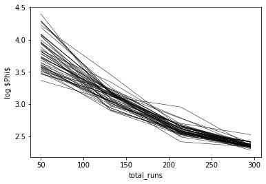
    


    
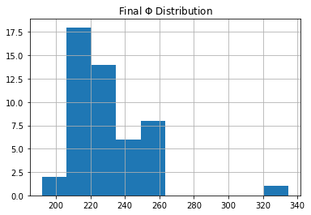
    


```python
pr_oe = pyemu.ObservationEnsemble.from_csv(pst=pst,filename=os.path.join(m_d,"freyberg_mf6.0.obs.csv"))
pt_oe = pyemu.ObservationEnsemble.from_csv(pst=pst,filename=os.path.join(m_d,"freyberg_mf6.{0}.obs.csv".format(pst.control_data.noptmax)))
noise = pyemu.ObservationEnsemble.from_csv(pst=pst,filename=os.path.join(m_d,"freyberg_mf6.obs+noise.csv"))
```

We can take a look at the distribution of Phi for both prior ensemble and posterior ensemble:


```python
fig,ax = plt.subplots(1,1)
pr_oe.phi_vector.apply(np.log10).hist(ax=ax,fc="0.5",ec="none",alpha=0.5,density=False)
pt_oe.phi_vector.apply(np.log10).hist(ax=ax,fc="b",ec="none",alpha=0.5,density=False)
_ = ax.set_xlabel("$log_{10}\\phi$")
```


    
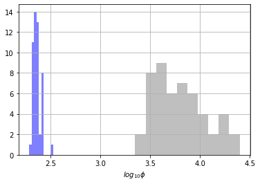
    


Finally, let's plot the obs vs sim timeseries - everyone's fav!


```python
def plot_tseries_ensembles(pr_oe, pt_oe, noise, onames=["hds","sfr"]):
    pst.try_parse_name_metadata()
    obs = pst.observation_data.copy()
    obs = obs.loc[obs.oname.apply(lambda x: x in onames)]
    obs = obs.loc[obs.obgnme.apply(lambda x: x in pst.nnz_obs_groups),:]
    obs.obgnme.unique()

    ogs = obs.obgnme.unique()
    fig,axes = plt.subplots(len(ogs),1,figsize=(10,2*len(ogs)))
    ogs.sort()
    for ax,og in zip(axes,ogs):
        oobs = obs.loc[obs.obgnme==og,:].copy()
        oobs.loc[:,"time"] = oobs.time.astype(float)
        oobs.sort_values(by="time",inplace=True)
        tvals = oobs.time.values
        onames = oobs.obsnme.values
        [ax.plot(tvals,pr_oe.loc[i,onames].values,"0.5",lw=0.5,alpha=0.5) for i in pr_oe.index]
        [ax.plot(tvals,pt_oe.loc[i,onames].values,"b",lw=0.5,alpha=0.5) for i in pt_oe.index]
        
        oobs = oobs.loc[oobs.weight>0,:]
        tvals = oobs.time.values
        onames = oobs.obsnme.values
        [ax.plot(tvals,noise.loc[i,onames].values,"r",lw=0.5,alpha=0.5) for i in noise.index]
        ax.plot(oobs.time,oobs.obsval,"r-",lw=2)
        ax.set_title(og,loc="left")
    fig.tight_layout()
    return fig
```


```python
fig = plot_tseries_ensembles(pr_oe, pt_oe, noise, onames=["hds","sfr"])
```


    
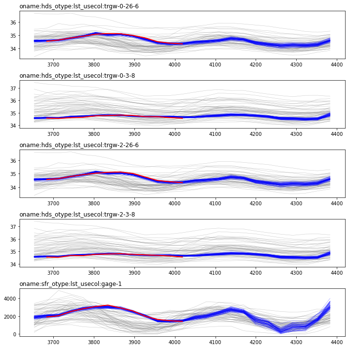
    


How do we feel about these plots?  In general, its a really (really!) good fit...is that ok?  

### optional additional filtering

apply an optional additional phi filter to remove poor fitting realizations - usually a good idea in practice


```python
thres = phi.iloc[-1,6:].quantile(0.95)
pv = pt_oe.phi_vector
keep = pv.loc[pv<thres]
if keep.shape[0] != pv.shape[0]:
    print("reducing posterior ensemble from {0} to {1} realizations".format(pv.shape[0],keep.shape[0]))
    pt_oe = pt_oe.loc[keep.index,:]
    fig,ax = plt.subplots(1,1)
    pr_oe.phi_vector.apply(np.log10).hist(ax=ax,fc="0.5",ec="none",alpha=0.5,density=False)
    pt_oe.phi_vector.apply(np.log10).hist(ax=ax,fc="b",ec="none",alpha=0.5,density=False)
    _ = ax.set_xlabel("$log_{10}\\phi$")
if pt_oe.shape[0] == 0:
    print("filtered out all posterior realization #sad")
```

    reducing posterior ensemble from 50 to 47 realizations
    


    

    


### 5. Forecasts

As usual, we bring this story back to the forecasts - after all they are why we are modelling.


```python
pst.forecast_names
```


    ['oname:sfr_otype:lst_usecol:tailwater_time:4383.5',
     'oname:sfr_otype:lst_usecol:headwater_time:4383.5',
     'oname:hds_otype:lst_usecol:trgw-0-9-1_time:4383.5',
     'part_time']


```python
def plot_forecast_hist_compare(pt_oe,pr_oe, last_pt_oe=None,last_prior=None ):
        num_plots = len(pst.forecast_names)
        num_cols = 1
        if last_pt_oe!=None:
            num_cols=2
        fig,axes = plt.subplots(num_plots, num_cols, figsize=(5*num_cols,num_plots * 2.5), sharex='row',sharey='row')
        for axs,forecast in zip(axes, pst.forecast_names):
            # plot first column with currrent outcomes
            if num_cols==1:
                axs=[axs]
            ax = axs[0]
            # just for aesthetics
            bin_cols = [pt_oe.loc[:,forecast], pr_oe.loc[:,forecast],]
            if num_cols>1:
                bin_cols.extend([last_pt_oe.loc[:,forecast],last_prior.loc[:,forecast]])
            bins=np.histogram(pd.concat(bin_cols),
                                         bins=20)[1] #get the bin edges
            pr_oe.loc[:,forecast].hist(facecolor="0.5",alpha=0.5, bins=bins, ax=ax)
            pt_oe.loc[:,forecast].hist(facecolor="b",alpha=0.5, bins=bins, ax=ax)
            ax.set_title(forecast)
            fval = pst.observation_data.loc[forecast,"obsval"]
            ax.plot([fval,fval],ax.get_ylim(),"r-")
            # plot second column with other outcomes
            if num_cols >1:
                ax = axs[1]
                last_prior.loc[:,forecast].hist(facecolor="0.5",alpha=0.5, bins=bins, ax=ax)
                last_pt_oe.loc[:,forecast].hist(facecolor="b",alpha=0.5, bins=bins, ax=ax)
                ax.set_title(forecast)
                fval = pst.observation_data.loc[forecast,"obsval"]
                ax.plot([fval,fval],ax.get_ylim(),"r-")
        # set ax column titles
        if num_cols >1:
            axes.flatten()[0].text(0.5,1.2,"Current Attempt", transform=axes.flatten()[0].transAxes, weight='bold', fontsize=12, horizontalalignment='center')
            axes.flatten()[1].text(0.5,1.2,"Previous Attempt", transform=axes.flatten()[1].transAxes, weight='bold', fontsize=12, horizontalalignment='center')
        fig.tight_layout()
        return fig
```


```python
fig = plot_forecast_hist_compare(pt_oe=pt_oe, pr_oe=pr_oe)
```


    

    


Ruh roh!  The posterior isnt covering the correct values for several forecasts. But the prior does, so that implies there is somewhere between the prior and posterior we have now that is optimal with respect to the forecasts.  Luckily, we can just load up a previous iteration of ies results and use those!


```python
iter_to_use_as_posterior = 1
pt_oe_iter = pyemu.ObservationEnsemble.from_csv(pst=pst,filename=os.path.join(m_d,"freyberg_mf6.{0}.obs.csv".\
                                                                         format(iter_to_use_as_posterior)))

```


```python
fig,ax = plt.subplots(1,1)
pr_oe.phi_vector.apply(np.log10).hist(ax=ax,fc="0.5",ec="none",alpha=0.5,density=False)
pt_oe_iter.phi_vector.apply(np.log10).hist(ax=ax,fc="b",ec="none",alpha=0.5,density=False)
_ = ax.set_xlabel("$log_{10}\phi$")
```


    
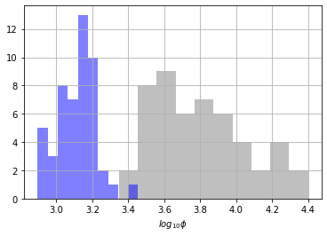
    


The posterior phi values are more similar to the prior....


```python
fig = plot_tseries_ensembles(pr_oe, pt_oe_iter,noise, onames=["hds","sfr"])
```


    
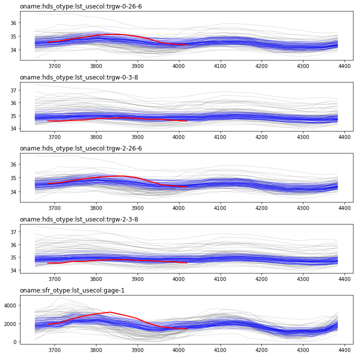
    


Now we see more variance in the simulated equivalents to the observations, meaning we arent fitting the historic observations as well...basically, we have only elimiated the extreme prior realizations - we can call this "light" conditioning or "underfitting"...

Let's see what has happened to the forecasts:


```python
fig = plot_forecast_hist_compare(pt_oe=pt_oe_iter,pr_oe=pr_oe,
                                last_pt_oe=pt_oe,last_prior=pr_oe
                                )
```


    
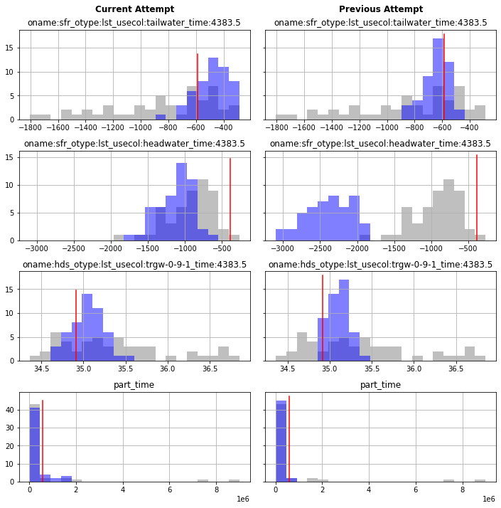
    


Ok, now things are getting interesting - is the posterior covering the truth...success?

How can fit the observations so well and yet get the wrong "answer" for several of the foreacsts?  Here we see a very important outcome:  When you are using an imperfect model (compared to the truth), the link between a good fit of historic conditions and robust forecasts is broken: a good fit doesn't mean a good forecaster.

### PESTPP-IES with automatic prior-data conflict resolution

Prior-data conflict, in the simpliest sense, means that simulated outputs from the prior parameter ensemble don't "cover" the observed values (plus optional measurement noise).  If the outputs from using lots of parameters and conservative (wide) parameter ranges (from the Prior) don't cover the observed values, then that implies we will need extreme parameter values (or extreme combinations) to reproduce these observations - another word for extreme is baised. So we shouldnt attempt parameter adjustments in the presence of prior-data conflict.  The easies way to deal with this is to simply not use conflicted observations for parameter adjustment calculations...PESTPP-IES will do this automatically for you:

# ...ther eisnt much PDC...

we can check whichh observations have PDC:


```python
pdc = pd.read_csv(os.path.join(m_d, "freyberg_mf6.pdc.csv"))
pdc.name
```


    0            ONAME:SFR_OTYPE:LST_USECOL:GAGE-1_TIME:3834.5
    1            ONAME:SFR_OTYPE:LST_USECOL:GAGE-1_TIME:3865.5
    2            ONAME:SFR_OTYPE:LST_USECOL:GAGE-1_TIME:3896.5
    3          ONAME:SFRTD_OTYPE:LST_USECOL:GAGE-1_TIME:3865.5
    4     ONAME:HDSTD_OTYPE:LST_USECOL:TRGW-0-26-6_TIME:3683.5
    5     ONAME:HDSTD_OTYPE:LST_USECOL:TRGW-0-26-6_TIME:3865.5
    6     ONAME:HDSTD_OTYPE:LST_USECOL:TRGW-2-26-6_TIME:3865.5
    7     ONAME:HDSTD_OTYPE:LST_USECOL:TRGW-2-26-6_TIME:3896.5
    8     ONAME:HDSVD_OTYPE:LST_USECOL:TRGW-0-26-6_TIME:3683.5
    9     ONAME:HDSVD_OTYPE:LST_USECOL:TRGW-0-26-6_TIME:3773.5
    10    ONAME:HDSVD_OTYPE:LST_USECOL:TRGW-0-26-6_TIME:3865.5
    11    ONAME:HDSVD_OTYPE:LST_USECOL:TRGW-0-26-6_TIME:3896.5
    12     ONAME:HDSVD_OTYPE:LST_USECOL:TRGW-0-3-8_TIME:3743.5
    13     ONAME:HDSVD_OTYPE:LST_USECOL:TRGW-0-3-8_TIME:3773.5
    14     ONAME:HDSVD_OTYPE:LST_USECOL:TRGW-0-3-8_TIME:3804.5
    15     ONAME:HDSVD_OTYPE:LST_USECOL:TRGW-0-3-8_TIME:3834.5
    16     ONAME:HDSVD_OTYPE:LST_USECOL:TRGW-0-3-8_TIME:3926.5
    17     ONAME:HDSVD_OTYPE:LST_USECOL:TRGW-0-3-8_TIME:3987.5
    Name: name, dtype: object


```python

```


```python
pst.pestpp_options["ies_drop_conflicts"] = True
pst.pestpp_options["ies_pdc_sigma_distance"] = 2.0
pst.pestpp_options["ies_no_noise"] = True
pst.write(os.path.join(t_d,"freyberg_mf6.pst"))
```

    noptmax:3, npar_adj:29653, nnz_obs:144
    


```python
pyemu.os_utils.start_workers(t_d,"pestpp-ies","freyberg_mf6.pst",num_workers=num_workers,master_dir=m_d)
```

ies records a csv file with the "adjusted" weights:


```python

```


```python
rw_obs = pd.read_csv(os.path.join(m_d,"freyberg_mf6.adjusted.obs_data.csv"), index_col=0)
rw_obs.loc[[i.lower() for i in pdc.name.tolist()]]
```


<div>
<style scoped>
    .dataframe tbody tr th:only-of-type {
        vertical-align: middle;
    }

    .dataframe tbody tr th {
        vertical-align: top;
    }

    .dataframe thead th {
        text-align: right;
    }
</style>
<table border="1" class="dataframe">
  <thead>
    <tr style="text-align: right;">
      <th></th>
      <th>value</th>
      <th>group</th>
      <th>weight</th>
    </tr>
    <tr>
      <th>name</th>
      <th></th>
      <th></th>
      <th></th>
    </tr>
  </thead>
  <tbody>
    <tr>
      <th>oname:sfr_otype:lst_usecol:gage-1_time:3834.5</th>
      <td>3244.630000</td>
      <td>oname:sfr_otype:lst_usecol:gage-1</td>
      <td>0.0</td>
    </tr>
    <tr>
      <th>oname:sfr_otype:lst_usecol:gage-1_time:3865.5</th>
      <td>2933.980000</td>
      <td>oname:sfr_otype:lst_usecol:gage-1</td>
      <td>0.0</td>
    </tr>
    <tr>
      <th>oname:sfr_otype:lst_usecol:gage-1_time:3896.5</th>
      <td>2592.890000</td>
      <td>oname:sfr_otype:lst_usecol:gage-1</td>
      <td>0.0</td>
    </tr>
    <tr>
      <th>oname:sfrtd_otype:lst_usecol:gage-1_time:3865.5</th>
      <td>935.558000</td>
      <td>oname:sfrtd_otype:lst_usecol:gage-1</td>
      <td>0.0</td>
    </tr>
    <tr>
      <th>oname:hdstd_otype:lst_usecol:trgw-0-26-6_time:3683.5</th>
      <td>-0.089834</td>
      <td>oname:hdstd_otype:lst_usecol:trgw-0-26-6</td>
      <td>20.0</td>
    </tr>
    <tr>
      <th>oname:hdstd_otype:lst_usecol:trgw-0-26-6_time:3865.5</th>
      <td>0.467423</td>
      <td>oname:hdstd_otype:lst_usecol:trgw-0-26-6</td>
      <td>0.0</td>
    </tr>
    <tr>
      <th>oname:hdstd_otype:lst_usecol:trgw-2-26-6_time:3865.5</th>
      <td>0.555868</td>
      <td>oname:hdstd_otype:lst_usecol:trgw-2-26-6</td>
      <td>0.0</td>
    </tr>
    <tr>
      <th>oname:hdstd_otype:lst_usecol:trgw-2-26-6_time:3896.5</th>
      <td>0.447572</td>
      <td>oname:hdstd_otype:lst_usecol:trgw-2-26-6</td>
      <td>0.0</td>
    </tr>
    <tr>
      <th>oname:hdsvd_otype:lst_usecol:trgw-0-26-6_time:3683.5</th>
      <td>-0.012460</td>
      <td>oname:hdsvd_otype:lst_usecol:trgw-0-26-6</td>
      <td>100.0</td>
    </tr>
    <tr>
      <th>oname:hdsvd_otype:lst_usecol:trgw-0-26-6_time:3773.5</th>
      <td>-0.004959</td>
      <td>oname:hdsvd_otype:lst_usecol:trgw-0-26-6</td>
      <td>100.0</td>
    </tr>
    <tr>
      <th>oname:hdsvd_otype:lst_usecol:trgw-0-26-6_time:3865.5</th>
      <td>-0.009928</td>
      <td>oname:hdsvd_otype:lst_usecol:trgw-0-26-6</td>
      <td>100.0</td>
    </tr>
    <tr>
      <th>oname:hdsvd_otype:lst_usecol:trgw-0-26-6_time:3896.5</th>
      <td>-0.029605</td>
      <td>oname:hdsvd_otype:lst_usecol:trgw-0-26-6</td>
      <td>0.0</td>
    </tr>
    <tr>
      <th>oname:hdsvd_otype:lst_usecol:trgw-0-3-8_time:3743.5</th>
      <td>-0.061342</td>
      <td>oname:hdsvd_otype:lst_usecol:trgw-0-3-8</td>
      <td>0.0</td>
    </tr>
    <tr>
      <th>oname:hdsvd_otype:lst_usecol:trgw-0-3-8_time:3773.5</th>
      <td>-0.015666</td>
      <td>oname:hdsvd_otype:lst_usecol:trgw-0-3-8</td>
      <td>100.0</td>
    </tr>
    <tr>
      <th>oname:hdsvd_otype:lst_usecol:trgw-0-3-8_time:3804.5</th>
      <td>-0.001889</td>
      <td>oname:hdsvd_otype:lst_usecol:trgw-0-3-8</td>
      <td>100.0</td>
    </tr>
    <tr>
      <th>oname:hdsvd_otype:lst_usecol:trgw-0-3-8_time:3834.5</th>
      <td>-0.004889</td>
      <td>oname:hdsvd_otype:lst_usecol:trgw-0-3-8</td>
      <td>100.0</td>
    </tr>
    <tr>
      <th>oname:hdsvd_otype:lst_usecol:trgw-0-3-8_time:3926.5</th>
      <td>-0.029573</td>
      <td>oname:hdsvd_otype:lst_usecol:trgw-0-3-8</td>
      <td>0.0</td>
    </tr>
    <tr>
      <th>oname:hdsvd_otype:lst_usecol:trgw-0-3-8_time:3987.5</th>
      <td>-0.017555</td>
      <td>oname:hdsvd_otype:lst_usecol:trgw-0-3-8</td>
      <td>0.0</td>
    </tr>
  </tbody>
</table>
</div>


## plot match with hist ? Plor forecasts


```python
pr_oe_pdc = pyemu.ObservationEnsemble.from_csv(pst=pst,filename=os.path.join(m_d,"freyberg_mf6.0.obs.csv"))
pt_oe_pdc = pyemu.ObservationEnsemble.from_csv(pst=pst,filename=os.path.join(m_d,"freyberg_mf6.{0}.obs.csv".format(pst.control_data.noptmax)))
noise_pdc = pyemu.ObservationEnsemble.from_csv(pst=pst,filename=os.path.join(m_d,"freyberg_mf6.obs+noise.csv"))
```


```python
fig = plot_tseries_ensembles(pr_oe_pdc, pt_oe_pdc, noise_pdc, onames=["hds","sfr"])
```


    
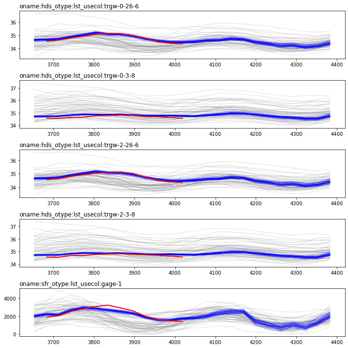
    


```python
fig = plot_forecast_hist_compare(pt_oe=pt_oe_pdc,pr_oe=pr_oe_pdc,
                                last_pt_oe=pt_oe,last_prior=pr_oe
                                )
```


    

    


# PESTPP-IES in a total error covariance workflow


```python
pst.pestpp_options["ies_save_rescov"] = True
```

Need to run IES for one iteration to get rescov:


```python
#pst.control_data.noptmax = -1
#
#pst.write(os.path.join(t_d,"freyberg_mf6.pst"))
#pyemu.os_utils.start_workers(t_d,"pestpp-ies","freyberg_mf6.pst",num_workers=num_workers,master_dir=m_d)
```


```python
res_cov_file = os.path.join(m_d,"freyberg_mf6.{0}.shrunk_res.cov".format(pst.control_data.noptmax))

res_cov = pyemu.Cov.from_ascii(res_cov_file)
x = res_cov.to_pearson().x.copy()
x[np.abs(x) < 0.2] = np.NaN
x[x==1.0] = np.NaN

fig,ax = plt.subplots(1,1,figsize=(10,10))
cb = ax.imshow(x,cmap="plasma")
plt.colorbar(cb, shrink=0.8)
```


    <matplotlib.colorbar.Colorbar at 0x202ca79a2b0>


    
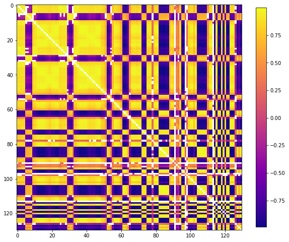
    


That would make a nice bohemain rug pattern!  Seriously tho, we see lots of correlation between residuals...so much for the "independence" assumption..

So what should we do?  Well, let's feed that covariance matrix to PESTPP-IES for the next run (an "outer" iteration).  During this run, the noise realizations that are paired with each parameter realization for the calculation of measurement phi will be drawn from this covariance matrix.  Additionally, the weights for non-zero weighted observations maybe lowered if the variance on the diagaonal of this matrix implies lower a weight (weights will never be increased).  In this way, PESTPP-IES is given information about how well it could (or couldn't) fit the observations last time.  In practice, this will keep PESTPP-IES from fitting the obseravtions as well, but more importantly, this helps prevent bias arising from irreducible residual and ultimately, leads to less biased and more covservative forecast estimates. 

Now we need to tell PESTPP-IES to use this covariance matirx and also change some options to be compatible with this mode of operation:


```python
obs=pst.observation_data
minvar = ((1./obs.loc[res_cov.names,"weight"])**2).min()
shrink = np.zeros(res_cov.shape)
np.fill_diagonal(shrink,minvar)
lamb = 2. / (pt_oe.shape[0] + 1)
lamb = 0.2
print(lamb)
shrunk = (lamb * shrink) + ((1.-lamb) * res_cov.x)
shrunk = pyemu.Cov(x=shrunk,names=res_cov.names)

# write residual covariance matrix to file
shrunk.to_ascii(os.path.join(t_d,"shrunk_obs.cov"))
x = shrunk.to_pearson().x.copy()
x[x==0.0] = np.NaN
plt.imshow(x,cmap="plasma")
plt.colorbar(cb, shrink=0.8)
```

    0.2
    


    <matplotlib.colorbar.Colorbar at 0x202db6cfb80>


    
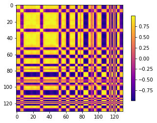
    


```python

```


```python
pst.control_data.noptmax = 3

# remove PDC resolution
pst.pestpp_options["ies_drop_conflicts"] = False
pst.pestpp_options["ies_pdc_sigma_distance"] = 2.0
# set obs ensemble noise
pst.pestpp_options["ies_no_noise"] = False
#res_cov.to_ascii(os.path.join(t_d,"shrunk_obs.cov"))
pst.pestpp_options["obscov"] = "shrunk_obs.cov"
pst.pestpp_options["ies_group_draws"] = False
```


```python
pst.write(os.path.join(t_d,"freyberg_mf6.pst"))
```

    noptmax:3, npar_adj:29653, nnz_obs:144
    


```python
pyemu.os_utils.start_workers(t_d,"pestpp-ies","freyberg_mf6.pst",num_workers=num_workers,master_dir=m_d)
```


```python
#phi = pd.read_csv(os.path.join(m_d,"freyberg_mf6.phi.actual.csv"),index_col=0)
#best_iteration= phi.loc[phi['mean']==phi['mean'].min()].index.values[0]
```


```python
pr_oe_rescov = pyemu.ObservationEnsemble.from_csv(pst=pst,filename=os.path.join(m_d,"freyberg_mf6.0.obs.csv"))
pt_oe_rescov = pyemu.ObservationEnsemble.from_csv(pst=pst,filename=os.path.join(m_d,"freyberg_mf6.{0}.obs.csv".format(pst.control_data.noptmax)))
noise_rescov = pyemu.ObservationEnsemble.from_csv(pst=pst,filename=os.path.join(m_d,"freyberg_mf6.obs+noise.csv"))
```


```python
fig = plot_tseries_ensembles(pr_oe_rescov, pt_oe_rescov, noise_rescov, onames=["hds","sfr"])
```


    
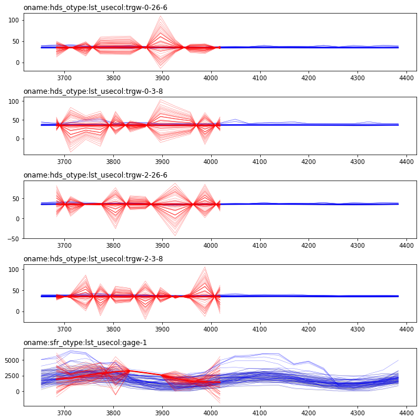
    


```python
fig = plot_forecast_hist_compare(pt_oe=pt_oe_rescov,pr_oe=pr_oe_rescov,
                                last_pt_oe=pt_oe_pdc,last_prior=pr_oe_pdc)
```


    
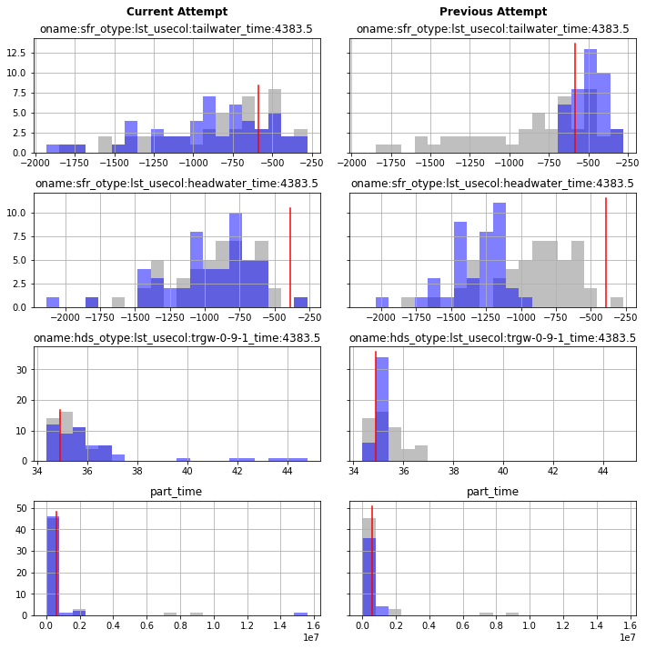
    


Check parameer posteriors and comapre to their priors
...whats this? Why are porosity values changing? tsk tsk


```python
pe_pr = pd.read_csv(os.path.join(m_d,"freyberg_mf6.0.par.csv"),index_col=0)
pe_pt = pd.read_csv(os.path.join(m_d,"freyberg_mf6.{0}.par.csv".format(pst.control_data.noptmax)),index_col=0)
par = pst.parameter_data
pdict = par.groupby("pargp").groups

d = [i for i in pst.par_groups if any(i.startswith(s) for s in ['ne'])]
pdict = {k:pdict[k] for k in pdict if k in d}

pyemu.plot_utils.ensemble_helper({"0.5":pe_pr,"b":pe_pt},plot_cols=pdict)
```


    <Figure size 576x756 with 0 Axes>


    
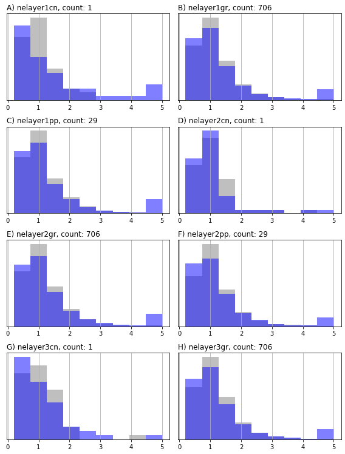
    


    
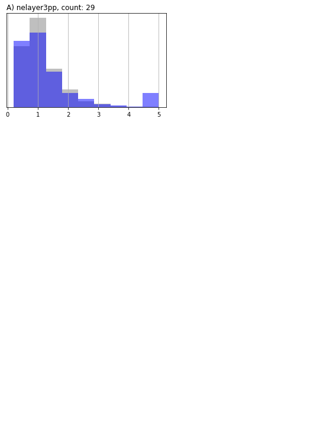
    


```python

```


```python

```


```python

```
