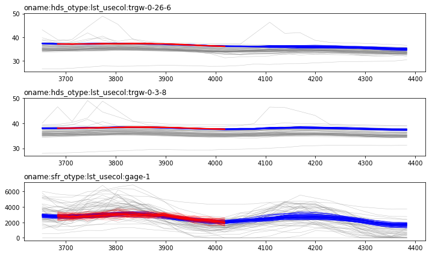
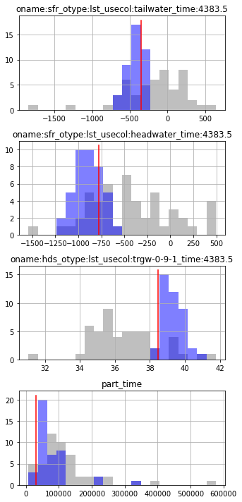
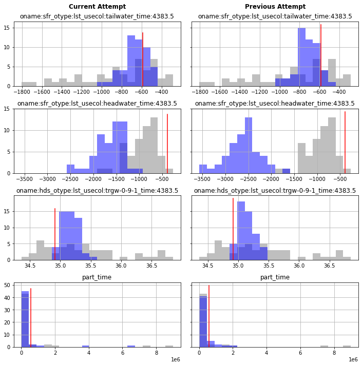
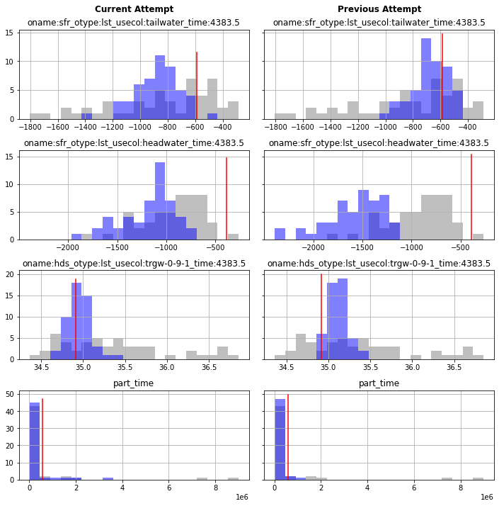

# PEST++IES - Localization

In the previous tutorial ("ies_1_basics") we introduced PEST++IES, demonstrated a rudimentary setup and explored some of the outcomes. In the current tutorial we are going to introduce "localization".

As discussed in the previous tutorial, PEST++IES does not calculate derivatives using finite parameter differences. Instead, by running the model using each member of the parameter ensemble, it calculates approximate partial derivatives from cross-covariances between parameter values and model outputs that are calculated using members of the ensemble. This formulation of the inverse problem allows estimation of a virtually unlimited set of parameters, and drastically reduces the computational burden of estimating the relation between parameters and observations.

But it is not all sunshine and rainbows.

Calculating an empirical cross-covariance between large numbers of parameters and observations, with a limited number of realizations is likely to lead to spurious cross-correlations. Because (1) the relationship between observations and parameters is estimated empirically, and (2) in most cases, the number of realizations will be significantly smaller than the number of parameters the estimated cross-covariances may contain error.

This results in some parameters being adjusted, even if there was no information in the observation dataset to require their adjustment. In other words, artificial relations between parameters and observations can emerge. This can result in the cardinal sin of underestimating of forecast uncertainty - a phenomenon referred to as "ensemble collapse". 

### Localization

To deal with these challenges we can employ "localization". Localization refers to a strategy in which only "local" covariances are allowed to emerge. In essence, a modeller defines a "local" neighbourhood around each observation, specifying the parameters which are expected to influence it. Effectively, this creates a series of "local" history matching problems using subsets of parameters and observations. Conceptually, localization allows a form of expert knowledge to be expreseed in regard to how parametes and observations are or are not related. For example, an observation of groundwater level today cannot be correlated to the recharge which will occur tomorrow (e.g. information cannot flow backwards in time), or groundwater levels cannot inform porosity parameters, etc. 

#### Localization Matrix
PEST++IES allows users to provide a localizing matrix to enforce physically plausible parameter-to-observation relations. This matrix must be preapred by the user. Matrix rows are observation names and/or observation group names, and columns are parameter names and/or parameter group names. Elements of the matrix should range between 0.0 and 1.0. A value of 0.0 removes any spurious sensitivities between the relevant observation and parameter. During this tutorial we will demosntrate how to construct such a amtrix using `pyEMU` using two localization strategies.

#### Automatic Adaptive Localization

PEST++IES also has an option to automate this process by implementing a form of `automatic adaptive localization`. When employed, during each iteration, PEST++IES calculates the empirical correlation coefficient between each parameter and each observation. A "background" or "error" distribution for this correlation coeficeint is also calcualted. By comparing (in  staitstical sense) these two, statstically significant corelations are identified and retained to construct a localization matrix. This matrix is then fed forward into the parameter adjustment process. Note taht automatic adaptive localization ncan be implemented in tandem with a user supplied localization matrix. In this manner, the automated process is only applied to non-zero elements in the user supplied matrix. We will implement this option during the current tutorial.

In practice, automatic localization doesn't resolve the level of localization that can be achieved by a matrix explicitly constructed by the user. However, it is better than no localization at all. In general, implementing some form of localization is recommended.

## The Current Tutorial

In the current notebook we are going to pick up after the "ies_1_basics" tutorial. We setup PEST++IES and ran it. We found that we can achieve great fits with historical data...but that (for some forecasts) the calculated posterior probabilities failed to cover the truth.

In this tutorial we are going to take a first stab at fixing that. We are going to implement localization to remove the potential for spurious correlations between observations and parameters incurred by using an "aproximate" partial deriviatives.  

### Admin

The next couple of cells load necessary dependencies and call a convenience function to prepare the PEST dataset folder for you. Simply press `shift+enter` to run the cells.


```python
import os
import shutil
import warnings
warnings.filterwarnings("ignore")
warnings.filterwarnings("ignore", category=DeprecationWarning) 
import pyemu
import pandas as pd
import numpy as np
import matplotlib.pyplot as plt;
import psutil

import sys
sys.path.append(os.path.join("..", "..", "dependencies"))
import pyemu
import flopy

sys.path.append("..")
import herebedragons as hbd
```

Prepare the template directory and copy across model files from the previous tutorial. Make sure you complete the previous tutorial first.


```python
# specify the temporary working folder
t_d = os.path.join('freyberg6_template')

org_t_d = os.path.join("master_ies_1")
if not os.path.exists(org_t_d):
    raise Exception("you need to run the '/freyberg_ies_1_basics.ipynb' notebook")

if os.path.exists(t_d):
    shutil.rmtree(t_d)
shutil.copytree(org_t_d,t_d)
```


    'freyberg6_template'


Load the PEST control file as a `Pst` object.


```python
pst_path = os.path.join(t_d, 'freyberg_mf6.pst')
pst = pyemu.Pst(pst_path)
assert 'observed' in pst.observation_data.columns
```

Check that we are at the right stage to run ies:


```python
assert os.path.exists(os.path.join(t_d, 'freyberg_mf6.3.pcs.csv')), "you need to run the '/freyberg_ies_1_basics.ipynb' notebook"
```

A quick reminder of the PEST++ optional control variables which have been specified:


```python
pst.pestpp_options
```


    {'forecasts': 'oname:sfr_otype:lst_usecol:tailwater_time:4383.5,oname:sfr_otype:lst_usecol:headwater_time:4383.5,oname:hds_otype:lst_usecol:trgw-0-9-1_time:4383.5,part_time',
     'ies_num_reals': 50,
     'ies_save_rescov': 'true',
     'ies_parameter_ensemble': 'prior_pe.jcb',
     'ies_observation_ensemble': 'oe.csv'}


## PEST++IES with no localization

Just as a reminder, and so we can compare the results later on, let's load in the results fmor theprevious tutorial and take a look at the (1) timeseries of measured and simulated heads, (2) the forecast probability distributions and (3) compare parameter prior and posterior distributions.


As in the previous tutorial, let's write a couple of functions to helps os plot these up.


```python
def plot_tseries_ensembles(pr_oe, pt_oe,noise, onames=["hds","sfr"]):
    pst.try_parse_name_metadata()
    obs = pst.observation_data.copy()
    obs = obs.loc[obs.oname.apply(lambda x: x in onames)]
    obs = obs.loc[obs.obgnme.apply(lambda x: x in pst.nnz_obs_groups),:]
    obs.obgnme.unique()

    ogs = obs.obgnme.unique()
    fig,axes = plt.subplots(len(ogs),1,figsize=(10,2*len(ogs)))
    ogs.sort()
    for ax,og in zip(axes,ogs):
        oobs = obs.loc[obs.obgnme==og,:].copy()
        oobs.loc[:,"time"] = oobs.time.astype(float)
        oobs.sort_values(by="time",inplace=True)
        tvals = oobs.time.values
        onames = oobs.obsnme.values
        [ax.plot(tvals,pr_oe.loc[i,onames].values,"0.5",lw=0.5,alpha=0.5) for i in pr_oe.index]
        [ax.plot(tvals,pt_oe.loc[i,onames].values,"b",lw=0.5,alpha=1) for i in pt_oe.index]
        
        oobs = oobs.loc[oobs.weight>0,:]
        tvals = oobs.time.values
        onames = oobs.obsnme.values
        [ax.plot(tvals,noise.loc[i,onames].values,"r",lw=0.5,alpha=0.5) for i in noise.index]
        ax.plot(oobs.time,oobs.obsval,"r-",lw=2)
        ax.set_title(og,loc="left")
    fig.tight_layout()
    return fig
```


```python
def plot_forecast_hist_compare(pt_oe,pr_oe, last_pt_oe=None,last_prior=None ):
        num_plots = len(pst.forecast_names)
        num_cols = 1
        if last_pt_oe!=None:
            num_cols=2
        fig,axes = plt.subplots(num_plots, num_cols, figsize=(5*num_cols,num_plots * 2.5), sharex='row',sharey='row')
        for axs,forecast in zip(axes, pst.forecast_names):
            # plot first column with currrent outcomes
            if num_cols==1:
                axs=[axs]
            ax = axs[0]
            # just for aesthetics
            bin_cols = [pt_oe.loc[:,forecast], pr_oe.loc[:,forecast],]
            if num_cols>1:
                bin_cols.extend([last_pt_oe.loc[:,forecast],last_prior.loc[:,forecast]])
            bins=np.histogram(pd.concat(bin_cols),
                                         bins=20)[1] #get the bin edges
            pr_oe.loc[:,forecast].hist(facecolor="0.5",alpha=0.5, bins=bins, ax=ax)
            pt_oe.loc[:,forecast].hist(facecolor="b",alpha=0.5, bins=bins, ax=ax)
            ax.set_title(forecast)
            fval = pst.observation_data.loc[forecast,"obsval"]
            ax.plot([fval,fval],ax.get_ylim(),"r-")
            # plot second column with other outcomes
            if num_cols >1:
                ax = axs[1]
                last_prior.loc[:,forecast].hist(facecolor="0.5",alpha=0.5, bins=bins, ax=ax)
                last_pt_oe.loc[:,forecast].hist(facecolor="b",alpha=0.5, bins=bins, ax=ax)
                ax.set_title(forecast)
                fval = pst.observation_data.loc[forecast,"obsval"]
                ax.plot([fval,fval],ax.get_ylim(),"r-")
        # set ax column titles
        if num_cols >1:
            axes.flatten()[0].text(0.5,1.2,"Current Attempt", transform=axes.flatten()[0].transAxes, weight='bold', fontsize=12, horizontalalignment='center')
            axes.flatten()[1].text(0.5,1.2,"Previous Attempt", transform=axes.flatten()[1].transAxes, weight='bold', fontsize=12, horizontalalignment='center')
        fig.tight_layout()
        return fig

```

OK, now that that is out of the way, load the obsevration ensembles from the prior, the posterior and the measuered+noise:


```python
pr_oe = pyemu.ObservationEnsemble.from_csv(pst=pst,filename=os.path.join(org_t_d,"freyberg_mf6.0.obs.csv"))
pt_oe = pyemu.ObservationEnsemble.from_csv(pst=pst,filename=os.path.join(org_t_d,"freyberg_mf6.{0}.obs.csv".format(pst.control_data.noptmax)))
noise = pyemu.ObservationEnsemble.from_csv(pst=pst,filename=os.path.join(org_t_d,"freyberg_mf6.obs+noise.csv"))
```

And _finally_ plot them up. You should be famililar with thes plots fomr the previous tutorial.


```python
fig = plot_tseries_ensembles(pr_oe, pt_oe,noise, onames=["hds","sfr"])
```


    

    


As you recall, the posterior fails to capture the truth for some forecass:


```python
fig = plot_forecast_hist_compare(pt_oe=pt_oe, pr_oe=pr_oe)
```


    

    


Right then. Here is where things get interesting. Let's take a look at the distribution of _parameters_, comparing their prior and posterior dsitributions. This will show us where the parameter adjustment process has ..well...adjusted parameters! (And by how much).

We will use  `pyemu.plot_utils.ensemble_helper()` to display histograms of parameter groupings from the prior and posterior ensembles. We could display histograms of each parameter group by passing a dictionary of parameter group names (you would probably do so in real-world applications). This will result in a pretty large plot, because we have quite  a few parameter groups. 

For the purposes of this tutorial, let's instead group parameters a bit more coarsely and just lump all parameters of the same hydraulic property together. The function in the next cell groups parmeters that share the first three letters in the parameter group name:


```python
def group_pdict(pe_pr, pe_pt):
        par = pst.parameter_data
        pdict = {}
        for string in pst.par_groups:
                prefix= string[:3] #set first 3 letters as prefix
                if prefix=='nel':
                        prefix='porosity'
                group = pdict.setdefault(prefix, [])
                parnames = par.loc[par.pargp==string, 'parnme'].tolist()
                group.extend(parnames)
        return pdict
```

Now, read in the parameter ensembles from the initial (prior) and last (posterior) PEST++IES iteration. 


```python
pe_pr = pd.read_csv(os.path.join(org_t_d,"freyberg_mf6.0.par.csv"),index_col=0)
pe_pt = pd.read_csv(os.path.join(org_t_d,"freyberg_mf6.{0}.par.csv".format(pst.control_data.noptmax)),index_col=0)
```

Let's create a dictionary of parameters "groupings" using the function we preapared above:


```python
pdict = group_pdict(pe_pr, pe_pt)
# for example:
pdict['npf'][:5]
```


    ['pname:npfklayer1gr_inst:0_ptype:gr_pstyle:m_i:0_j:0_x:125.00_y:9875.00_zone:1',
     'pname:npfklayer1gr_inst:0_ptype:gr_pstyle:m_i:0_j:1_x:375.00_y:9875.00_zone:1',
     'pname:npfklayer1gr_inst:0_ptype:gr_pstyle:m_i:0_j:2_x:625.00_y:9875.00_zone:1',
     'pname:npfklayer1gr_inst:0_ptype:gr_pstyle:m_i:0_j:3_x:875.00_y:9875.00_zone:1',
     'pname:npfklayer1gr_inst:0_ptype:gr_pstyle:m_i:0_j:4_x:1125.00_y:9875.00_zone:1']


We can now plot histograms for each of our parameter groupings in the `pdict` dictionary. The grey and blue bars are the prior and posterior parameter distribution, respectively. Where the blue bars have shifted away fro the grey bars marks parameters which have been updated during history matching.

Now, this is a pretty coarse check. But it does allow us to pick up on parameters that are changing...but which shouldn't. Take porosity parameters for example (the panel on the second row on the right: `D)porosity`). Our observation data set is only cmposed of groundwater levels and stream gage measurments. Neither of these types of masurements contain information which should inform porosity. In other words, porosity parameters should be insensitive to history matching. However, PEST++IES has adjsuted them from their prior values. A clear sign of spurrious correlation. And if it's happening for porosity, who's to say it isn't happening for other prameters as well?

Right then, let's fix this.


```python
pyemu.plot_utils.ensemble_helper({"0.5":pe_pr,"b":pe_pt},plot_cols=pdict)
```


    <Figure size 576x756 with 0 Axes>


    

    


## Simple Temporal Localization (and common sense)

As described a tthe beggining of the notebook, a user can provide PEST++IES with a localization matrix. This matrix explicilty enforces physically-plausible parameter-to-observation relations. Perhaps more importantly it enforces the non-existence of physically implausible relations. This matrix has rows that are observation names and/or observation group names, and columns that are parameter names and/or parameter group names. Elements of the matrix should range between 0.0 and 1.0. 

Right then, let's get started and add some localization. The obvious stuff is temporal localization - scenario parameters can't influence historic observations (and the inverse is true) so let's tell PEST++IES about this.  Also, as discussed, should porosity be adjusted at all given the observations we have? (Not for history matching, but yes, it should be adjusted for forecast uncertainty analysis.)

This involves several steps:
 - identify parameer names or parameter group names to specify in the matrix
 - identify observation names to specify in the matrix
 - construct a template matrix from the names
 - assign values to elements of the matrix for each parameter/observation pair

In this next section, we are going to use good ole' Python and functionality in `pyEMU` to construct such a matrix. As we constructed our PEST(++) interface using `pyemu.PstFrom` (see the "pstfrom pest setup" tutorial), we conveniently have lots of usefull metadata to draw on and help us processs parameters and observations. 

For starters, let's get the `parameter_data` and `observation_data` sections from the `Pst` control file. We are going to use them for some funcky slicing and dicing:


```python
# get par data
par = pst.parameter_data
par.inst = par.inst.astype(int)
# get obs data
obs = pst.observation_data
obs.time = obs.time.astype(float)
# temporal units are different in obs and par:
par.inst.unique(), obs.time.unique()
```


    (array([ 0,  1,  2,  3,  4,  5,  6,  7,  8,  9, 10, 11, 12, 13, 14, 15, 16,
            17, 18, 19, 20, 21, 22, 23, 24]),
     array([3652.5, 3683.5, 3712.5, 3743.5, 3773.5, 3804.5, 3834.5, 3865.5,
            3896.5, 3926.5, 3957.5, 3987.5, 4018.5, 4049.5, 4077.5, 4108.5,
            4138.5, 4169.5, 4199.5, 4230.5, 4261.5, 4291.5, 4322.5, 4352.5,
            4383.5,    nan]))


Inconveniently, temporal parameters in `par` were recorded with the "stress period number" (or `kper`) instead of model time (see the `par.inst` column). But the observations in `obs` were recorded wiht the model time (see the `obs.time` column). 

So we need to align these. We could go either way, but it is probalby more robust to align to model "time" instead of "stress period number". The next cell updates the `par` parameter data to include a column with model time that corresponds to the time at the end of the stress period at which the parameter comes into existence.


```python
# add a column for each stress period; 
# we already have spd values assocaited to paranetemr names, 
# so we will use this to associate parameters to observations in time
for kper, time in enumerate(obs.time.unique()[:-1]):
    par.loc[par.inst==int(kper), 'time'] = time
par.head()
```


<div>
<style scoped>
    .dataframe tbody tr th:only-of-type {
        vertical-align: middle;
    }

    .dataframe tbody tr th {
        vertical-align: top;
    }

    .dataframe thead th {
        text-align: right;
    }
</style>
<table border="1" class="dataframe">
  <thead>
    <tr style="text-align: right;">
      <th></th>
      <th>parnme</th>
      <th>partrans</th>
      <th>parchglim</th>
      <th>parval1</th>
      <th>parlbnd</th>
      <th>parubnd</th>
      <th>pargp</th>
      <th>scale</th>
      <th>offset</th>
      <th>dercom</th>
      <th>...</th>
      <th>i</th>
      <th>j</th>
      <th>x</th>
      <th>y</th>
      <th>zone</th>
      <th>usecol</th>
      <th>idx0</th>
      <th>idx1</th>
      <th>idx2</th>
      <th>time</th>
    </tr>
    <tr>
      <th>parnme</th>
      <th></th>
      <th></th>
      <th></th>
      <th></th>
      <th></th>
      <th></th>
      <th></th>
      <th></th>
      <th></th>
      <th></th>
      <th></th>
      <th></th>
      <th></th>
      <th></th>
      <th></th>
      <th></th>
      <th></th>
      <th></th>
      <th></th>
      <th></th>
      <th></th>
    </tr>
  </thead>
  <tbody>
    <tr>
      <th>pname:npfklayer1gr_inst:0_ptype:gr_pstyle:m_i:0_j:0_x:125.00_y:9875.00_zone:1</th>
      <td>pname:npfklayer1gr_inst:0_ptype:gr_pstyle:m_i:0_j:0_x:125.00_y:9875.00_zone:1</td>
      <td>log</td>
      <td>factor</td>
      <td>1.0</td>
      <td>0.2</td>
      <td>5.0</td>
      <td>npfklayer1gr</td>
      <td>1.0</td>
      <td>0.0</td>
      <td>1</td>
      <td>...</td>
      <td>0</td>
      <td>0</td>
      <td>125.00</td>
      <td>9875.00</td>
      <td>1</td>
      <td>NaN</td>
      <td>NaN</td>
      <td>NaN</td>
      <td>NaN</td>
      <td>3652.5</td>
    </tr>
    <tr>
      <th>pname:npfklayer1gr_inst:0_ptype:gr_pstyle:m_i:0_j:1_x:375.00_y:9875.00_zone:1</th>
      <td>pname:npfklayer1gr_inst:0_ptype:gr_pstyle:m_i:0_j:1_x:375.00_y:9875.00_zone:1</td>
      <td>log</td>
      <td>factor</td>
      <td>1.0</td>
      <td>0.2</td>
      <td>5.0</td>
      <td>npfklayer1gr</td>
      <td>1.0</td>
      <td>0.0</td>
      <td>1</td>
      <td>...</td>
      <td>0</td>
      <td>1</td>
      <td>375.00</td>
      <td>9875.00</td>
      <td>1</td>
      <td>NaN</td>
      <td>NaN</td>
      <td>NaN</td>
      <td>NaN</td>
      <td>3652.5</td>
    </tr>
    <tr>
      <th>pname:npfklayer1gr_inst:0_ptype:gr_pstyle:m_i:0_j:2_x:625.00_y:9875.00_zone:1</th>
      <td>pname:npfklayer1gr_inst:0_ptype:gr_pstyle:m_i:0_j:2_x:625.00_y:9875.00_zone:1</td>
      <td>log</td>
      <td>factor</td>
      <td>1.0</td>
      <td>0.2</td>
      <td>5.0</td>
      <td>npfklayer1gr</td>
      <td>1.0</td>
      <td>0.0</td>
      <td>1</td>
      <td>...</td>
      <td>0</td>
      <td>2</td>
      <td>625.00</td>
      <td>9875.00</td>
      <td>1</td>
      <td>NaN</td>
      <td>NaN</td>
      <td>NaN</td>
      <td>NaN</td>
      <td>3652.5</td>
    </tr>
    <tr>
      <th>pname:npfklayer1gr_inst:0_ptype:gr_pstyle:m_i:0_j:3_x:875.00_y:9875.00_zone:1</th>
      <td>pname:npfklayer1gr_inst:0_ptype:gr_pstyle:m_i:0_j:3_x:875.00_y:9875.00_zone:1</td>
      <td>log</td>
      <td>factor</td>
      <td>1.0</td>
      <td>0.2</td>
      <td>5.0</td>
      <td>npfklayer1gr</td>
      <td>1.0</td>
      <td>0.0</td>
      <td>1</td>
      <td>...</td>
      <td>0</td>
      <td>3</td>
      <td>875.00</td>
      <td>9875.00</td>
      <td>1</td>
      <td>NaN</td>
      <td>NaN</td>
      <td>NaN</td>
      <td>NaN</td>
      <td>3652.5</td>
    </tr>
    <tr>
      <th>pname:npfklayer1gr_inst:0_ptype:gr_pstyle:m_i:0_j:4_x:1125.00_y:9875.00_zone:1</th>
      <td>pname:npfklayer1gr_inst:0_ptype:gr_pstyle:m_i:0_j:4_x:1125.00_y:9875.00_zone:1</td>
      <td>log</td>
      <td>factor</td>
      <td>1.0</td>
      <td>0.2</td>
      <td>5.0</td>
      <td>npfklayer1gr</td>
      <td>1.0</td>
      <td>0.0</td>
      <td>1</td>
      <td>...</td>
      <td>0</td>
      <td>4</td>
      <td>1125.00</td>
      <td>9875.00</td>
      <td>1</td>
      <td>NaN</td>
      <td>NaN</td>
      <td>NaN</td>
      <td>NaN</td>
      <td>3652.5</td>
    </tr>
  </tbody>
</table>
<p>5 rows × 24 columns</p>
</div>


After tyding that up, let's start preparing the parameter names (or parameter group names; PEST++IES accepts either) that we are gong to use as columns in the localization matrix. 

Let's start off with the easy ones: static parameters. These are parameters which do not vary in time. Let's assume we cannot effectively rule out correlation between them and observations purely based on the time at which the observation occurs. (So things like hydraulic condutivty, storage, SFR conductance, etc.) Let's make a list of parameter group names for these types of parameters:


```python
# static parameters; these parameters will all be informed by historic obsevration data
prefixes = ['npf', 'sto', 'icstrt', 'ghb', 'sfrcondgr','sfrcondcn']
static_pargps = [i for i in pst.par_groups if any(i.startswith(s) for s in prefixes)]
# start making the list of localization matrix column names (i.e. parameter or parameter group names)
# as we dont need to do any further processing for the loc matrix, we can just use parameter group names
loc_matrix_cols = static_pargps.copy()
```

OK, so we keep going on about porosity not being informed by the data. So let's give it special attention. Let's make a list of parameter groups which should not be adjusted:


```python
# should we really be adjusting porosity? lets just make a list fo use later on
prefixes = ['ne']
dont_pargps = [i for i in pst.par_groups if any(i.startswith(s) for s in prefixes)]
# keep building up our column name list
loc_matrix_cols.extend(dont_pargps)
```

Lastly, let us make a list of parameter _names_ (not group names!) for parameters which vary over time. Why parameter _names_ and not parameter _group names_? Because some of these (namely the `wel` and `sfrgr` groups) have parameters _within_ a group which pertain to dfferent model times. So we need to drill down to explicitly asign values to specific parameters. 


```python
# temporal pars; parameters in the past cannot be informed by observations in the future
# so, an observation in stress period 2 cannot inform a rechange parameter in stress period 1, and so on...
prefixes = ['wel', 'rch', 'sfrgr']
temp_pargps = [i for i in pst.par_groups if any(i.startswith(s) for s in prefixes)]
# for the localization matrix we are going to need to go parameter by parameter, so lets get the list of parameter _names_
temporal_pars = par.loc[par.pargp.isin(temp_pargps)]
# extend the column name list
loc_matrix_cols.extend(temporal_pars.parnme.tolist())
```

Right'o. So now we have a list of parameter group and paramer names which we are going to use to construct our localization matrix: `loc_matrix_cols`. We also have a couple of sub-lists to help us select specific columns form the matrix after we have constructed it (`static_pargps`, `dont_pargps` and `temporal_pars`).

Obviously, we also have the list of observations to use as rows in the matrix - they are simply all the non-zero observations in the `pst` control file: `pst.nnz_obs_names`.

Let's get cooking! Generate a `Matrix` using the `pyemu.Matrix` class and then convert it `to_dataframe()` for easy manipulation:


```python
# generate a Matrix object with the nz_obs names as rows and parameters/par groups as columns:
loc = pyemu.Matrix.from_names(pst.nnz_obs_names,loc_matrix_cols).to_dataframe()
# just to make sure, set evry cell/element to zero
loc.loc[:,:]= 0.0
loc.head()
```


<div>
<style scoped>
    .dataframe tbody tr th:only-of-type {
        vertical-align: middle;
    }

    .dataframe tbody tr th {
        vertical-align: top;
    }

    .dataframe thead th {
        text-align: right;
    }
</style>
<table border="1" class="dataframe">
  <thead>
    <tr style="text-align: right;">
      <th></th>
      <th>npfklayer1gr</th>
      <th>npfklayer1pp</th>
      <th>npfklayer1cn</th>
      <th>npfklayer2gr</th>
      <th>npfklayer2pp</th>
      <th>npfklayer2cn</th>
      <th>npfklayer3gr</th>
      <th>npfklayer3pp</th>
      <th>npfklayer3cn</th>
      <th>npfk33layer1gr</th>
      <th>...</th>
      <th>pname:sfrgr_inst:15_ptype:gr_usecol:2_pstyle:m_idx0:0</th>
      <th>pname:sfrgr_inst:16_ptype:gr_usecol:2_pstyle:m_idx0:0</th>
      <th>pname:sfrgr_inst:17_ptype:gr_usecol:2_pstyle:m_idx0:0</th>
      <th>pname:sfrgr_inst:18_ptype:gr_usecol:2_pstyle:m_idx0:0</th>
      <th>pname:sfrgr_inst:19_ptype:gr_usecol:2_pstyle:m_idx0:0</th>
      <th>pname:sfrgr_inst:20_ptype:gr_usecol:2_pstyle:m_idx0:0</th>
      <th>pname:sfrgr_inst:21_ptype:gr_usecol:2_pstyle:m_idx0:0</th>
      <th>pname:sfrgr_inst:22_ptype:gr_usecol:2_pstyle:m_idx0:0</th>
      <th>pname:sfrgr_inst:23_ptype:gr_usecol:2_pstyle:m_idx0:0</th>
      <th>pname:sfrgr_inst:24_ptype:gr_usecol:2_pstyle:m_idx0:0</th>
    </tr>
  </thead>
  <tbody>
    <tr>
      <th>oname:hds_otype:lst_usecol:trgw-0-26-6_time:3683.5</th>
      <td>0.0</td>
      <td>0.0</td>
      <td>0.0</td>
      <td>0.0</td>
      <td>0.0</td>
      <td>0.0</td>
      <td>0.0</td>
      <td>0.0</td>
      <td>0.0</td>
      <td>0.0</td>
      <td>...</td>
      <td>0.0</td>
      <td>0.0</td>
      <td>0.0</td>
      <td>0.0</td>
      <td>0.0</td>
      <td>0.0</td>
      <td>0.0</td>
      <td>0.0</td>
      <td>0.0</td>
      <td>0.0</td>
    </tr>
    <tr>
      <th>oname:hds_otype:lst_usecol:trgw-0-26-6_time:3712.5</th>
      <td>0.0</td>
      <td>0.0</td>
      <td>0.0</td>
      <td>0.0</td>
      <td>0.0</td>
      <td>0.0</td>
      <td>0.0</td>
      <td>0.0</td>
      <td>0.0</td>
      <td>0.0</td>
      <td>...</td>
      <td>0.0</td>
      <td>0.0</td>
      <td>0.0</td>
      <td>0.0</td>
      <td>0.0</td>
      <td>0.0</td>
      <td>0.0</td>
      <td>0.0</td>
      <td>0.0</td>
      <td>0.0</td>
    </tr>
    <tr>
      <th>oname:hds_otype:lst_usecol:trgw-0-26-6_time:3743.5</th>
      <td>0.0</td>
      <td>0.0</td>
      <td>0.0</td>
      <td>0.0</td>
      <td>0.0</td>
      <td>0.0</td>
      <td>0.0</td>
      <td>0.0</td>
      <td>0.0</td>
      <td>0.0</td>
      <td>...</td>
      <td>0.0</td>
      <td>0.0</td>
      <td>0.0</td>
      <td>0.0</td>
      <td>0.0</td>
      <td>0.0</td>
      <td>0.0</td>
      <td>0.0</td>
      <td>0.0</td>
      <td>0.0</td>
    </tr>
    <tr>
      <th>oname:hds_otype:lst_usecol:trgw-0-26-6_time:3773.5</th>
      <td>0.0</td>
      <td>0.0</td>
      <td>0.0</td>
      <td>0.0</td>
      <td>0.0</td>
      <td>0.0</td>
      <td>0.0</td>
      <td>0.0</td>
      <td>0.0</td>
      <td>0.0</td>
      <td>...</td>
      <td>0.0</td>
      <td>0.0</td>
      <td>0.0</td>
      <td>0.0</td>
      <td>0.0</td>
      <td>0.0</td>
      <td>0.0</td>
      <td>0.0</td>
      <td>0.0</td>
      <td>0.0</td>
    </tr>
    <tr>
      <th>oname:hds_otype:lst_usecol:trgw-0-26-6_time:3804.5</th>
      <td>0.0</td>
      <td>0.0</td>
      <td>0.0</td>
      <td>0.0</td>
      <td>0.0</td>
      <td>0.0</td>
      <td>0.0</td>
      <td>0.0</td>
      <td>0.0</td>
      <td>0.0</td>
      <td>...</td>
      <td>0.0</td>
      <td>0.0</td>
      <td>0.0</td>
      <td>0.0</td>
      <td>0.0</td>
      <td>0.0</td>
      <td>0.0</td>
      <td>0.0</td>
      <td>0.0</td>
      <td>0.0</td>
    </tr>
  </tbody>
</table>
<p>5 rows × 18645 columns</p>
</div>


OK, now we have the startings of a localization matrix. At this moment, every element is assigned a value of 0.0 (e.g. no parameter-to-observation correlation). We will now go through and assign a value of 1.0 to parameter-observation pairs for which a physically plausible relation might exist.


```python
# we can now proceed to assign values to elements of the matrix
# assign a value of 1 to all rows for the static parameters, as they may be informed by all obsevrations
loc.loc[:,static_pargps] = 1.0
# see what that looks like
loc.loc[:,static_pargps].head()
```


<div>
<style scoped>
    .dataframe tbody tr th:only-of-type {
        vertical-align: middle;
    }

    .dataframe tbody tr th {
        vertical-align: top;
    }

    .dataframe thead th {
        text-align: right;
    }
</style>
<table border="1" class="dataframe">
  <thead>
    <tr style="text-align: right;">
      <th></th>
      <th>npfklayer1gr</th>
      <th>npfklayer1pp</th>
      <th>npfklayer1cn</th>
      <th>npfklayer2gr</th>
      <th>npfklayer2pp</th>
      <th>npfklayer2cn</th>
      <th>npfklayer3gr</th>
      <th>npfklayer3pp</th>
      <th>npfklayer3cn</th>
      <th>npfk33layer1gr</th>
      <th>...</th>
      <th>stosylayer1cn</th>
      <th>ghbcondgr</th>
      <th>ghbcondcn</th>
      <th>ghbheadgr</th>
      <th>ghbheadcn</th>
      <th>sfrcondgr</th>
      <th>sfrcondcn</th>
      <th>icstrtlayer1</th>
      <th>icstrtlayer2</th>
      <th>icstrtlayer3</th>
    </tr>
  </thead>
  <tbody>
    <tr>
      <th>oname:hds_otype:lst_usecol:trgw-0-26-6_time:3683.5</th>
      <td>1.0</td>
      <td>1.0</td>
      <td>1.0</td>
      <td>1.0</td>
      <td>1.0</td>
      <td>1.0</td>
      <td>1.0</td>
      <td>1.0</td>
      <td>1.0</td>
      <td>1.0</td>
      <td>...</td>
      <td>1.0</td>
      <td>1.0</td>
      <td>1.0</td>
      <td>1.0</td>
      <td>1.0</td>
      <td>1.0</td>
      <td>1.0</td>
      <td>1.0</td>
      <td>1.0</td>
      <td>1.0</td>
    </tr>
    <tr>
      <th>oname:hds_otype:lst_usecol:trgw-0-26-6_time:3712.5</th>
      <td>1.0</td>
      <td>1.0</td>
      <td>1.0</td>
      <td>1.0</td>
      <td>1.0</td>
      <td>1.0</td>
      <td>1.0</td>
      <td>1.0</td>
      <td>1.0</td>
      <td>1.0</td>
      <td>...</td>
      <td>1.0</td>
      <td>1.0</td>
      <td>1.0</td>
      <td>1.0</td>
      <td>1.0</td>
      <td>1.0</td>
      <td>1.0</td>
      <td>1.0</td>
      <td>1.0</td>
      <td>1.0</td>
    </tr>
    <tr>
      <th>oname:hds_otype:lst_usecol:trgw-0-26-6_time:3743.5</th>
      <td>1.0</td>
      <td>1.0</td>
      <td>1.0</td>
      <td>1.0</td>
      <td>1.0</td>
      <td>1.0</td>
      <td>1.0</td>
      <td>1.0</td>
      <td>1.0</td>
      <td>1.0</td>
      <td>...</td>
      <td>1.0</td>
      <td>1.0</td>
      <td>1.0</td>
      <td>1.0</td>
      <td>1.0</td>
      <td>1.0</td>
      <td>1.0</td>
      <td>1.0</td>
      <td>1.0</td>
      <td>1.0</td>
    </tr>
    <tr>
      <th>oname:hds_otype:lst_usecol:trgw-0-26-6_time:3773.5</th>
      <td>1.0</td>
      <td>1.0</td>
      <td>1.0</td>
      <td>1.0</td>
      <td>1.0</td>
      <td>1.0</td>
      <td>1.0</td>
      <td>1.0</td>
      <td>1.0</td>
      <td>1.0</td>
      <td>...</td>
      <td>1.0</td>
      <td>1.0</td>
      <td>1.0</td>
      <td>1.0</td>
      <td>1.0</td>
      <td>1.0</td>
      <td>1.0</td>
      <td>1.0</td>
      <td>1.0</td>
      <td>1.0</td>
    </tr>
    <tr>
      <th>oname:hds_otype:lst_usecol:trgw-0-26-6_time:3804.5</th>
      <td>1.0</td>
      <td>1.0</td>
      <td>1.0</td>
      <td>1.0</td>
      <td>1.0</td>
      <td>1.0</td>
      <td>1.0</td>
      <td>1.0</td>
      <td>1.0</td>
      <td>1.0</td>
      <td>...</td>
      <td>1.0</td>
      <td>1.0</td>
      <td>1.0</td>
      <td>1.0</td>
      <td>1.0</td>
      <td>1.0</td>
      <td>1.0</td>
      <td>1.0</td>
      <td>1.0</td>
      <td>1.0</td>
    </tr>
  </tbody>
</table>
<p>5 rows × 36 columns</p>
</div>


Here comes the tricky bit - assigning localization for time-dependent parameters. We are going to say that an observation can _only_ inform parameters that are up to 180 days in the past (e.g. 180 days before the observation). 


```python
# here comes the tricky bit, assigning localization for time-dependent parameters
# we are going to say that an observation can _only_ inform parameters that are 
# up to 180 days into the past; not in the future. Parameters that are beyond the historic period are not informed by observations
nz_obs = pst.observation_data.loc[pst.nnz_obs_names,:]
cutoff = 180
for time in nz_obs.time.unique():
    kper_obs_names = nz_obs.loc[nz_obs.time==time].obsnme.tolist()
    # get pars from the same kper and up to -180 days backward in time
    kper_par_names = temporal_pars.loc[temporal_pars.time.apply(lambda x: x>time-cutoff and x<=time)].parnme.tolist()
    # update the loc matrix
    loc.loc[kper_obs_names, kper_par_names] = 1.0
# see what that looks like:
loc.loc[kper_obs_names, kper_par_names].head()
```


<div>
<style scoped>
    .dataframe tbody tr th:only-of-type {
        vertical-align: middle;
    }

    .dataframe tbody tr th {
        vertical-align: top;
    }

    .dataframe thead th {
        text-align: right;
    }
</style>
<table border="1" class="dataframe">
  <thead>
    <tr style="text-align: right;">
      <th></th>
      <th>pname:welcst_inst:7_ptype:cn_usecol:3_pstyle:m</th>
      <th>pname:welgrd_inst:7_ptype:gr_usecol:3_pstyle:m_idx0:2_idx1:34_idx2:12</th>
      <th>pname:welgrd_inst:7_ptype:gr_usecol:3_pstyle:m_idx0:2_idx1:26_idx2:10</th>
      <th>pname:welgrd_inst:7_ptype:gr_usecol:3_pstyle:m_idx0:2_idx1:29_idx2:6</th>
      <th>pname:welgrd_inst:7_ptype:gr_usecol:3_pstyle:m_idx0:2_idx1:20_idx2:14</th>
      <th>pname:welgrd_inst:7_ptype:gr_usecol:3_pstyle:m_idx0:2_idx1:9_idx2:16</th>
      <th>pname:welgrd_inst:7_ptype:gr_usecol:3_pstyle:m_idx0:2_idx1:11_idx2:13</th>
      <th>pname:welcst_inst:8_ptype:cn_usecol:3_pstyle:m</th>
      <th>pname:welgrd_inst:8_ptype:gr_usecol:3_pstyle:m_idx0:2_idx1:34_idx2:12</th>
      <th>pname:welgrd_inst:8_ptype:gr_usecol:3_pstyle:m_idx0:2_idx1:26_idx2:10</th>
      <th>...</th>
      <th>pname:welgrd_inst:12_ptype:gr_usecol:3_pstyle:m_idx0:2_idx1:29_idx2:6</th>
      <th>pname:welgrd_inst:12_ptype:gr_usecol:3_pstyle:m_idx0:2_idx1:20_idx2:14</th>
      <th>pname:welgrd_inst:12_ptype:gr_usecol:3_pstyle:m_idx0:2_idx1:9_idx2:16</th>
      <th>pname:welgrd_inst:12_ptype:gr_usecol:3_pstyle:m_idx0:2_idx1:11_idx2:13</th>
      <th>pname:sfrgr_inst:7_ptype:gr_usecol:2_pstyle:m_idx0:0</th>
      <th>pname:sfrgr_inst:8_ptype:gr_usecol:2_pstyle:m_idx0:0</th>
      <th>pname:sfrgr_inst:9_ptype:gr_usecol:2_pstyle:m_idx0:0</th>
      <th>pname:sfrgr_inst:10_ptype:gr_usecol:2_pstyle:m_idx0:0</th>
      <th>pname:sfrgr_inst:11_ptype:gr_usecol:2_pstyle:m_idx0:0</th>
      <th>pname:sfrgr_inst:12_ptype:gr_usecol:2_pstyle:m_idx0:0</th>
    </tr>
  </thead>
  <tbody>
    <tr>
      <th>oname:hds_otype:lst_usecol:trgw-0-26-6_time:4018.5</th>
      <td>1.0</td>
      <td>1.0</td>
      <td>1.0</td>
      <td>1.0</td>
      <td>1.0</td>
      <td>1.0</td>
      <td>1.0</td>
      <td>1.0</td>
      <td>1.0</td>
      <td>1.0</td>
      <td>...</td>
      <td>1.0</td>
      <td>1.0</td>
      <td>1.0</td>
      <td>1.0</td>
      <td>1.0</td>
      <td>1.0</td>
      <td>1.0</td>
      <td>1.0</td>
      <td>1.0</td>
      <td>1.0</td>
    </tr>
    <tr>
      <th>oname:hds_otype:lst_usecol:trgw-0-3-8_time:4018.5</th>
      <td>1.0</td>
      <td>1.0</td>
      <td>1.0</td>
      <td>1.0</td>
      <td>1.0</td>
      <td>1.0</td>
      <td>1.0</td>
      <td>1.0</td>
      <td>1.0</td>
      <td>1.0</td>
      <td>...</td>
      <td>1.0</td>
      <td>1.0</td>
      <td>1.0</td>
      <td>1.0</td>
      <td>1.0</td>
      <td>1.0</td>
      <td>1.0</td>
      <td>1.0</td>
      <td>1.0</td>
      <td>1.0</td>
    </tr>
    <tr>
      <th>oname:hds_otype:lst_usecol:trgw-2-26-6_time:4018.5</th>
      <td>1.0</td>
      <td>1.0</td>
      <td>1.0</td>
      <td>1.0</td>
      <td>1.0</td>
      <td>1.0</td>
      <td>1.0</td>
      <td>1.0</td>
      <td>1.0</td>
      <td>1.0</td>
      <td>...</td>
      <td>1.0</td>
      <td>1.0</td>
      <td>1.0</td>
      <td>1.0</td>
      <td>1.0</td>
      <td>1.0</td>
      <td>1.0</td>
      <td>1.0</td>
      <td>1.0</td>
      <td>1.0</td>
    </tr>
    <tr>
      <th>oname:hds_otype:lst_usecol:trgw-2-3-8_time:4018.5</th>
      <td>1.0</td>
      <td>1.0</td>
      <td>1.0</td>
      <td>1.0</td>
      <td>1.0</td>
      <td>1.0</td>
      <td>1.0</td>
      <td>1.0</td>
      <td>1.0</td>
      <td>1.0</td>
      <td>...</td>
      <td>1.0</td>
      <td>1.0</td>
      <td>1.0</td>
      <td>1.0</td>
      <td>1.0</td>
      <td>1.0</td>
      <td>1.0</td>
      <td>1.0</td>
      <td>1.0</td>
      <td>1.0</td>
    </tr>
    <tr>
      <th>oname:sfr_otype:lst_usecol:gage-1_time:4018.5</th>
      <td>1.0</td>
      <td>1.0</td>
      <td>1.0</td>
      <td>1.0</td>
      <td>1.0</td>
      <td>1.0</td>
      <td>1.0</td>
      <td>1.0</td>
      <td>1.0</td>
      <td>1.0</td>
      <td>...</td>
      <td>1.0</td>
      <td>1.0</td>
      <td>1.0</td>
      <td>1.0</td>
      <td>1.0</td>
      <td>1.0</td>
      <td>1.0</td>
      <td>1.0</td>
      <td>1.0</td>
      <td>1.0</td>
    </tr>
  </tbody>
</table>
<p>5 rows × 48 columns</p>
</div>


OK! We should be good to go. Just a quick to check to see if we messed something up:


```python
# make sure havent done somthing silly
assert loc.loc[:,dont_pargps].sum().sum()==0
```

All good? Excellent. Let's rebuild the `Matrix` (don't tell Neo) and then write it to an external file anmed `loc.mat`:


```python
pyemu.Matrix.from_dataframe(loc).to_ascii(os.path.join(t_d,"loc.mat"))
```

Almost done! We need to tel PEST++IES what file to read. We do so by specifying the file name in the `ies_localizer()` PEST++ control variable:


```python
pst.pestpp_options["ies_localizer"] = "loc.mat"
```

Don't forget to re-write the control file!


```python
pst.write(os.path.join(t_d, 'freyberg_mf6.pst'))
```

    noptmax:3, npar_adj:29653, nnz_obs:144
    

OK, good to go. As usual, make sure to specify the number of workers that your machine can cope with. 


```python
num_workers = psutil.cpu_count(logical=False) #update this according to your resources
m_d = os.path.join('master_ies_2')
```


```python
pyemu.os_utils.start_workers(t_d, # the folder which contains the "template" PEST dataset
                            'pestpp-ies', #the PEST software version we want to run
                            'freyberg_mf6.pst', # the control file to use with PEST
                            num_workers=num_workers, #how many agents to deploy
                            worker_root='.', #where to deploy the agent directories; relative to where python is running
                            master_dir=m_d, #the manager directory
                            )
```

### Temporal Localization Outcomes

By now you should be familiar with the next few plots. Let's blast through our plots of timeseries, forecast histograms and prameter distributions.

Start with the parameter changes. Hwey whadya know! That looks a bit more reasonable, doesn't it? Porosity parameters no longer change from the prior to the posterior. Variance for temporal parameters has also changed. Excelent. At least we've removed _some_ potential for underestiating forecast uncertainty. Next check what this has done for history matching and, more importantly, the forecasts.


```python
pe_pr_tloc = pd.read_csv(os.path.join(m_d,"freyberg_mf6.0.par.csv"),index_col=0)
pe_pt_tloc = pd.read_csv(os.path.join(m_d,"freyberg_mf6.{0}.par.csv".format(pst.control_data.noptmax)),index_col=0)

pdict = group_pdict(pe_pr_tloc, pe_pt_tloc)
fig = pyemu.plot_utils.ensemble_helper({"0.5":pe_pr_tloc,"b":pe_pt_tloc},plot_cols=pdict)
```


    <Figure size 576x756 with 0 Axes>


    

    


Now read in the new posterior observation ensemble.


```python
pt_oe_tloc = pyemu.ObservationEnsemble.from_csv(pst=pst,filename=os.path.join(m_d,"freyberg_mf6.{0}.obs.csv".format(pst.control_data.noptmax)))
```

Still getting relatively decent (although not _as_ good as before) fits  with historical data.


```python
fig = plot_tseries_ensembles(pr_oe, pt_oe_tloc,noise, onames=["hds","sfr"])
```


    

    


What's happend with our ever important forecasts? Looks like we fared a bit better...but...still failing to capture all of the true values with the posterior. Not ideal.


```python
fig = plot_forecast_hist_compare(pt_oe=pt_oe_tloc, pr_oe=pr_oe, last_pt_oe=pt_oe, last_prior=pr_oe)
```


    

    


## Distance Based Localization

This is industrial strength localization that combines the temporal localization from before with a distance-based cutoff between each spatially-distributed parameter type and each spatially-discrete observation.  In this way, we are defining a "window" around each observation and only parameters that are within this window are allowed to be conditioned from said observation.  It's painful to setup and subjective (since a circular windows around each obseravtion is a coarse approximation) but in practice, it seems to yield robust forecast estimates.

For the first time now, we will be using a fully-localized solve, meaning each parameter is upgraded independently.  This means PEST++IES has to run through the upgrade calculations once for each parameter - this can be very slow.  Currently, PESTPP-IES can multithread these calculations but the optimal number of threads is very problem specific.  Through testing, 3 threads seems to be a good choice for this problem (the PEST++IES log file records the time it takes to solve groups of 1000 pars for each lambda so you can test for your problem too).

In the next few cells we are going to make use of `flopy` and some of the metadata that `pyemu.PstFrom` recorded when constructing our PEST(++) setup to calculate distances between parmaters and observations. We will do this only for groundwater level observations.


```python
# load simulation
sim = flopy.mf6.MFSimulation.load(sim_ws=t_d, verbosity_level=0)
# load flow model
gwf = sim.get_model()
```

All of our head observation names conveniently contain the layer, row and column number. This allows us to use `flopy` to obtain their `x` and `y` coordinate:


```python
# start by getting the locations of observation sites
# we will only do this for head obsevrations; other obs types in our PEST dataset arent applicable
hobs = nz_obs.loc[nz_obs.oname.isin(['hds','hdsvd','hdstd'])].copy()
hobs.loc[:,'i'] = hobs.obgnme.apply(lambda x: int(x.split('-')[-2]))
hobs.loc[:,'j'] = hobs.obgnme.apply(lambda x: int(x.split('-')[-1]))
# get x,y for cell of each obs
hobs.loc[:,'x'] = hobs.apply(lambda x: gwf.modelgrid.xcellcenters[x.i,x.j], axis=1)
hobs.loc[:,'y'] = hobs.apply(lambda x: gwf.modelgrid.ycellcenters[x.i,x.j], axis=1)
# group them for use later in identifying unique locations
hobs.loc[:,"xy"] = hobs.apply(lambda x: "{0}_{1}".format(x.x,x.y),axis=1)
hobs.head()
```


<div>
<style scoped>
    .dataframe tbody tr th:only-of-type {
        vertical-align: middle;
    }

    .dataframe tbody tr th {
        vertical-align: top;
    }

    .dataframe thead th {
        text-align: right;
    }
</style>
<table border="1" class="dataframe">
  <thead>
    <tr style="text-align: right;">
      <th></th>
      <th>obsnme</th>
      <th>obsval</th>
      <th>weight</th>
      <th>obgnme</th>
      <th>oname</th>
      <th>otype</th>
      <th>usecol</th>
      <th>time</th>
      <th>i</th>
      <th>j</th>
      <th>totim</th>
      <th>observed</th>
      <th>x</th>
      <th>y</th>
      <th>xy</th>
    </tr>
    <tr>
      <th>obsnme</th>
      <th></th>
      <th></th>
      <th></th>
      <th></th>
      <th></th>
      <th></th>
      <th></th>
      <th></th>
      <th></th>
      <th></th>
      <th></th>
      <th></th>
      <th></th>
      <th></th>
      <th></th>
    </tr>
  </thead>
  <tbody>
    <tr>
      <th>oname:hds_otype:lst_usecol:trgw-0-26-6_time:3683.5</th>
      <td>oname:hds_otype:lst_usecol:trgw-0-26-6_time:3683.5</td>
      <td>34.554179</td>
      <td>10.0</td>
      <td>oname:hds_otype:lst_usecol:trgw-0-26-6</td>
      <td>hds</td>
      <td>lst</td>
      <td>trgw-0-26-6</td>
      <td>3683.5</td>
      <td>26</td>
      <td>6</td>
      <td>NaN</td>
      <td>1.0</td>
      <td>1625.0</td>
      <td>3375.0</td>
      <td>1625.0_3375.0</td>
    </tr>
    <tr>
      <th>oname:hds_otype:lst_usecol:trgw-0-26-6_time:3712.5</th>
      <td>oname:hds_otype:lst_usecol:trgw-0-26-6_time:3712.5</td>
      <td>34.639517</td>
      <td>10.0</td>
      <td>oname:hds_otype:lst_usecol:trgw-0-26-6</td>
      <td>hds</td>
      <td>lst</td>
      <td>trgw-0-26-6</td>
      <td>3712.5</td>
      <td>26</td>
      <td>6</td>
      <td>NaN</td>
      <td>1.0</td>
      <td>1625.0</td>
      <td>3375.0</td>
      <td>1625.0_3375.0</td>
    </tr>
    <tr>
      <th>oname:hds_otype:lst_usecol:trgw-0-26-6_time:3743.5</th>
      <td>oname:hds_otype:lst_usecol:trgw-0-26-6_time:3743.5</td>
      <td>34.797994</td>
      <td>10.0</td>
      <td>oname:hds_otype:lst_usecol:trgw-0-26-6</td>
      <td>hds</td>
      <td>lst</td>
      <td>trgw-0-26-6</td>
      <td>3743.5</td>
      <td>26</td>
      <td>6</td>
      <td>NaN</td>
      <td>1.0</td>
      <td>1625.0</td>
      <td>3375.0</td>
      <td>1625.0_3375.0</td>
    </tr>
    <tr>
      <th>oname:hds_otype:lst_usecol:trgw-0-26-6_time:3773.5</th>
      <td>oname:hds_otype:lst_usecol:trgw-0-26-6_time:3773.5</td>
      <td>34.923169</td>
      <td>10.0</td>
      <td>oname:hds_otype:lst_usecol:trgw-0-26-6</td>
      <td>hds</td>
      <td>lst</td>
      <td>trgw-0-26-6</td>
      <td>3773.5</td>
      <td>26</td>
      <td>6</td>
      <td>NaN</td>
      <td>1.0</td>
      <td>1625.0</td>
      <td>3375.0</td>
      <td>1625.0_3375.0</td>
    </tr>
    <tr>
      <th>oname:hds_otype:lst_usecol:trgw-0-26-6_time:3804.5</th>
      <td>oname:hds_otype:lst_usecol:trgw-0-26-6_time:3804.5</td>
      <td>35.080453</td>
      <td>10.0</td>
      <td>oname:hds_otype:lst_usecol:trgw-0-26-6</td>
      <td>hds</td>
      <td>lst</td>
      <td>trgw-0-26-6</td>
      <td>3804.5</td>
      <td>26</td>
      <td>6</td>
      <td>NaN</td>
      <td>1.0</td>
      <td>1625.0</td>
      <td>3375.0</td>
      <td>1625.0_3375.0</td>
    </tr>
  </tbody>
</table>
</div>


We have the `x` and `y` coordinate of all grid and pilot point based parameters recorded in the `Pst` `parameter_data` section. Convenient.


```python
par.x=par.x.astype(float)
par.y=par.y.astype(float)
par.head()
```


<div>
<style scoped>
    .dataframe tbody tr th:only-of-type {
        vertical-align: middle;
    }

    .dataframe tbody tr th {
        vertical-align: top;
    }

    .dataframe thead th {
        text-align: right;
    }
</style>
<table border="1" class="dataframe">
  <thead>
    <tr style="text-align: right;">
      <th></th>
      <th>parnme</th>
      <th>partrans</th>
      <th>parchglim</th>
      <th>parval1</th>
      <th>parlbnd</th>
      <th>parubnd</th>
      <th>pargp</th>
      <th>scale</th>
      <th>offset</th>
      <th>dercom</th>
      <th>...</th>
      <th>i</th>
      <th>j</th>
      <th>x</th>
      <th>y</th>
      <th>zone</th>
      <th>usecol</th>
      <th>idx0</th>
      <th>idx1</th>
      <th>idx2</th>
      <th>time</th>
    </tr>
    <tr>
      <th>parnme</th>
      <th></th>
      <th></th>
      <th></th>
      <th></th>
      <th></th>
      <th></th>
      <th></th>
      <th></th>
      <th></th>
      <th></th>
      <th></th>
      <th></th>
      <th></th>
      <th></th>
      <th></th>
      <th></th>
      <th></th>
      <th></th>
      <th></th>
      <th></th>
      <th></th>
    </tr>
  </thead>
  <tbody>
    <tr>
      <th>pname:npfklayer1gr_inst:0_ptype:gr_pstyle:m_i:0_j:0_x:125.00_y:9875.00_zone:1</th>
      <td>pname:npfklayer1gr_inst:0_ptype:gr_pstyle:m_i:0_j:0_x:125.00_y:9875.00_zone:1</td>
      <td>log</td>
      <td>factor</td>
      <td>1.0</td>
      <td>0.2</td>
      <td>5.0</td>
      <td>npfklayer1gr</td>
      <td>1.0</td>
      <td>0.0</td>
      <td>1</td>
      <td>...</td>
      <td>0</td>
      <td>0</td>
      <td>125.0</td>
      <td>9875.0</td>
      <td>1</td>
      <td>NaN</td>
      <td>NaN</td>
      <td>NaN</td>
      <td>NaN</td>
      <td>3652.5</td>
    </tr>
    <tr>
      <th>pname:npfklayer1gr_inst:0_ptype:gr_pstyle:m_i:0_j:1_x:375.00_y:9875.00_zone:1</th>
      <td>pname:npfklayer1gr_inst:0_ptype:gr_pstyle:m_i:0_j:1_x:375.00_y:9875.00_zone:1</td>
      <td>log</td>
      <td>factor</td>
      <td>1.0</td>
      <td>0.2</td>
      <td>5.0</td>
      <td>npfklayer1gr</td>
      <td>1.0</td>
      <td>0.0</td>
      <td>1</td>
      <td>...</td>
      <td>0</td>
      <td>1</td>
      <td>375.0</td>
      <td>9875.0</td>
      <td>1</td>
      <td>NaN</td>
      <td>NaN</td>
      <td>NaN</td>
      <td>NaN</td>
      <td>3652.5</td>
    </tr>
    <tr>
      <th>pname:npfklayer1gr_inst:0_ptype:gr_pstyle:m_i:0_j:2_x:625.00_y:9875.00_zone:1</th>
      <td>pname:npfklayer1gr_inst:0_ptype:gr_pstyle:m_i:0_j:2_x:625.00_y:9875.00_zone:1</td>
      <td>log</td>
      <td>factor</td>
      <td>1.0</td>
      <td>0.2</td>
      <td>5.0</td>
      <td>npfklayer1gr</td>
      <td>1.0</td>
      <td>0.0</td>
      <td>1</td>
      <td>...</td>
      <td>0</td>
      <td>2</td>
      <td>625.0</td>
      <td>9875.0</td>
      <td>1</td>
      <td>NaN</td>
      <td>NaN</td>
      <td>NaN</td>
      <td>NaN</td>
      <td>3652.5</td>
    </tr>
    <tr>
      <th>pname:npfklayer1gr_inst:0_ptype:gr_pstyle:m_i:0_j:3_x:875.00_y:9875.00_zone:1</th>
      <td>pname:npfklayer1gr_inst:0_ptype:gr_pstyle:m_i:0_j:3_x:875.00_y:9875.00_zone:1</td>
      <td>log</td>
      <td>factor</td>
      <td>1.0</td>
      <td>0.2</td>
      <td>5.0</td>
      <td>npfklayer1gr</td>
      <td>1.0</td>
      <td>0.0</td>
      <td>1</td>
      <td>...</td>
      <td>0</td>
      <td>3</td>
      <td>875.0</td>
      <td>9875.0</td>
      <td>1</td>
      <td>NaN</td>
      <td>NaN</td>
      <td>NaN</td>
      <td>NaN</td>
      <td>3652.5</td>
    </tr>
    <tr>
      <th>pname:npfklayer1gr_inst:0_ptype:gr_pstyle:m_i:0_j:4_x:1125.00_y:9875.00_zone:1</th>
      <td>pname:npfklayer1gr_inst:0_ptype:gr_pstyle:m_i:0_j:4_x:1125.00_y:9875.00_zone:1</td>
      <td>log</td>
      <td>factor</td>
      <td>1.0</td>
      <td>0.2</td>
      <td>5.0</td>
      <td>npfklayer1gr</td>
      <td>1.0</td>
      <td>0.0</td>
      <td>1</td>
      <td>...</td>
      <td>0</td>
      <td>4</td>
      <td>1125.0</td>
      <td>9875.0</td>
      <td>1</td>
      <td>NaN</td>
      <td>NaN</td>
      <td>NaN</td>
      <td>NaN</td>
      <td>3652.5</td>
    </tr>
  </tbody>
</table>
<p>5 rows × 24 columns</p>
</div>


First, create a `Matrix` for _all_ adjsutable parameter _names_ and non-zero observations:


```python
spatial_loc = pyemu.Matrix.from_names(pst.nnz_obs_names,pst.adj_par_names).to_dataframe()
# set all elements to 1.0 to make sure all observation-parameter pairs are "active"
spatial_loc.values[:,:] = 1.0
```

Now the tricky bit. We are going to go through each obseravtion location and assign 0.0 to rows that correspond to _spatially distributed_ parameters that are further away than a specified cutoff distance (`loc_dist`). 


```python
# the cutoff distance
loc_dist = 5000.0
# prepare a set of adjustable parameter names
sadj = set(pst.adj_par_names)
#select only spatial params to avoid applying to layer-wide multiplier parameters
spatial_par = par.loc[par.x.notnull()].copy()
# group obs by location
xy_groups = hobs.groupby('xy').groups
print('Number of observation sites:',len(xy_groups))
# loop through each observation site and "blank out" correlation with parameters which are too far away
for xy,onames in xy_groups.items():
    # get the obs site x and y coords
    oname = onames[0]
    xx,yy = hobs.loc[oname,['x','y']]
    # calculate distance from obs to parameters
    spatial_par.loc[:,'dist'] = spatial_par.apply(lambda x: (x.x - xx)**2 + (x.y - yy)**2,axis=1).apply(np.sqrt)
    # select pars that are too far from obs
    too_far = spatial_par.loc[spatial_par.dist > loc_dist,"parnme"]
    # keep only adjustable pars
    too_far = too_far.loc[too_far.apply(lambda x: x in sadj)]
    # assign zero to loc matrix for parameters that are too far from obs
    spatial_loc.loc[onames, too_far] = 0.0

```

    Number of observation sites: 2
    

Now we need to update that with the temporal localization we prepared earlier:


```python
# update the the loc matrix with temporal localization that we prepared previously
temporal_parnames = temporal_pars.parnme.tolist()
spatial_loc.loc[loc.index, temporal_parnames] = loc.loc[:, temporal_parnames]
# make sure the porosity pars are not; go down to parname level to make sure 
dont_pars = set(par.loc[par.pargp.apply(lambda x: x in dont_pargps),"parnme"].tolist())
spatial_loc.loc[:,dont_pars] = 0.0
```

Always good to throw in some checks to make sure we aren't missing something:


```python
spatial_loc.loc[:, [i for i in spatial_loc.columns if ':ne' in i]].sum().sum()
```


    0.0


Right then. Rebuild the `Matrix` from teh dataframe, write it to an external file and update the relevatn PEST++ option:


```python
pyemu.Matrix.from_dataframe(spatial_loc).to_coo(os.path.join(t_d,"spatial_loc.jcb"))
pst.pestpp_options["ies_localizer"] = "spatial_loc.jcb"
```

A final consideration. 

Through localization, a complex parameter estimation problem can be turned into a series of independent parameter estimation problems. If large numbers of parameters are being adjusted, the parameter upgrade calculation process for a given lambda will require as many truncated SVD solves as there are adjustable parameters. This can require considerable numerical effort. To overcome this problem, the localized upgrade solution process in PESTP++IES has been multithreaded; this is possible in circumstances such as these where each local solve is independent of every other local solve. The use of multiple threads is invoked through the `ies_num_threads()` control variable. It should be noted that the optimal number of threads to use is  problem-specific. Furthermore, it should not exceed the number of physical cores of the host machine on which the PEST++IES master instance is running.


```python
pst.pestpp_options['ies_num_threads'] = 3 # make sure it is less than the number of physical cores on your machine
```

Rewrite the control file and deploy PEST++IES:


```python
pst.write(os.path.join(t_d,"freyberg_mf6.pst"))
```

    noptmax:3, npar_adj:29653, nnz_obs:144
    


```python
pyemu.os_utils.start_workers(t_d, # the folder which contains the "template" PEST dataset
                            'pestpp-ies', #the PEST software version we want to run
                            'freyberg_mf6.pst', # the control file to use with PEST
                            num_workers=num_workers, #how many agents to deploy
                            worker_root='.', #where to deploy the agent directories; relative to where python is running
                            master_dir=m_d, #the manager directory
                            )
```

### Spatial Localization Outcomes

You know the drill by now. Let's look at our parameter and observation distributions. 

Starting with the parameters. Perhaps a bit less change. Hard to tell at this scale. What about the observations?


```python
pe_pr_sloc = pd.read_csv(os.path.join(m_d,"freyberg_mf6.0.par.csv"),index_col=0)
pe_pt_sloc = pd.read_csv(os.path.join(m_d,"freyberg_mf6.{0}.par.csv".format(pst.control_data.noptmax)),index_col=0)

pdict = group_pdict(pe_pr_sloc, pe_pt_sloc)
fig = pyemu.plot_utils.ensemble_helper({"0.5":pe_pr_sloc,"b":pe_pt_sloc},plot_cols=pdict)
```


    <Figure size 576x756 with 0 Axes>


    

    


Read in the new posterior ensemble:


```python
pt_oe_sloc = pyemu.ObservationEnsemble.from_csv(pst=pst,filename=os.path.join(m_d,"freyberg_mf6.{0}.obs.csv".format(pst.control_data.noptmax)))
```

In this case, fits are similar to with the temporal localization:


```python
fig = plot_tseries_ensembles(pr_oe, pt_oe_sloc,noise, onames=["hds","sfr"])
```


    

    


And the ever important foreacasts...meh...a bit less variance here and there, but we are still failing to capture the truth for some forecasts. 


```python
fig = plot_forecast_hist_compare(pt_oe=pt_oe_sloc, pr_oe=pr_oe, last_pt_oe=pt_oe_tloc, last_prior=pr_oe)
```


    

    


## PEST++IES with Automatic Adaptive Localization

PEST++IES includes functionality for automatic localization.  In practice, this form of localization doesnt resolve the level of localization that more rigorous explicit localization that you get through a localization matrix.  However, its better than no localization at all. 

A localization matrix supplied by the user can be used in combination with automatic adaptive localization (autoadaloc). When doing so, autoadaloc process is restricted to to the allowed parameter-to-observation relations in the user specified localization matrix. The automated process will only ever adjust values in the localization matrix downwards (i.e. decrease the correlation coefficients).

And, just like par-by-par distance based localization above, we  need to solve the upgrade equations once for each parameter...this can take quite a bit of CPU time. Multithreading is a must.

How do we implement it? Easy peasy. Just activate the `ies_autoadaloc()` PEST++ option:


```python
#pst.pestpp_options.pop("ies_localizer") #should you wish to try autoadaloc on its onw, simply drop the loc matrix
pst.pestpp_options["ies_autoadaloc"] = True
```


```python
# these upgrade calcs take a while, so let's only do one lambda
pst.pestpp_options["ies_lambda_mults"] = 1.0
```

The one control value for `autoadaloc` is `ies_autoadaloc_sigma_distance` which is the statistical difference background or error correlation estimate and the current correlation coefficient.  Any correlation coefficient that is less than the error mean plus/minus error standard deviation times `ies_autoadaloc_sigma_distance` is treated as a non-significant correlation and is localized out. So large `ies_autoadaloc_sigma_distance` values result in stronger localization.  The default value is 1.0. 


```python
pst.pestpp_options["ies_autoadaloc_sigma_dist"] = 1
```

Cool beans. We are good to go. Just re-write the control file and let PEST++IES loose. Now, keep in mind that, even though we are using only a few hundred model runs, solving the parameter upgrade equations for a high-dimensional problem can be quite expensive. So this will take  bit longer than previous runs.


```python
pst.write(os.path.join(t_d,"freyberg_mf6.pst"))
```

    noptmax:3, npar_adj:29653, nnz_obs:144
    


```python
pyemu.os_utils.start_workers(t_d, # the folder which contains the "template" PEST dataset
                            'pestpp-ies', #the PEST software version we want to run
                            'freyberg_mf6.pst', # the control file to use with PEST
                            num_workers=num_workers, #how many agents to deploy
                            worker_root='.', #where to deploy the agent directories; relative to where python is running
                            master_dir=m_d, #the manager directory
                            )
```

### AutoAdaLoc Outcomes

Right, let's go straight for our forecasts! Have we solved this yet? Ergh - not yet. As expected, the variance for forecasts is a bit larger. And our posteriors are bit better (e.g. closer to the truth) but we are still failing to capture the truth for all forecast. So we are still failing. How depressing.


```python
pt_oe_autoloc = pyemu.ObservationEnsemble.from_csv(pst=pst,filename=os.path.join(m_d,"freyberg_mf6.{0}.obs.csv".format(pst.control_data.noptmax)))
```


```python
fig = plot_forecast_hist_compare(pt_oe=pt_oe_autoloc, 
                                pr_oe=pr_oe, 
                                last_pt_oe=pt_oe_sloc, 
                                last_prior=pr_oe)
```


    

    


Thus far we have implemented localization, a strategy to tackle spurious parameter-to-observation correlation. In doing so we reduce the potential for "ensemble colapse", a fancy term that means an "underestimate of forecast uncertainty caused by artificial parameter-to-observation relations". This solves history-matching induced through using ensemble based methods, but it does not solve a (the?) core issue - trying to "perfectly" fit data with an imperfect model will induce bias. 

Now, as we have seen, for some forecasts this is not a huge problem (these are data-driven forecasts, which are well informed by available observation data). For others, it is (these are the forecasts which are influenced by parameter combinations in the null space, that are not informed by observation data). But when undertaking modelling in the real world, we will rarely know where our forecast lies on that spectrum (probably somewhere in the middle...).  So, if we do need to undertake history matching for uncertainty reduction, we still need a strategy which keeps us from inducing bias. The next tutorial introduces two: automated prior data conflict resolution and a total error covariance workflow.
