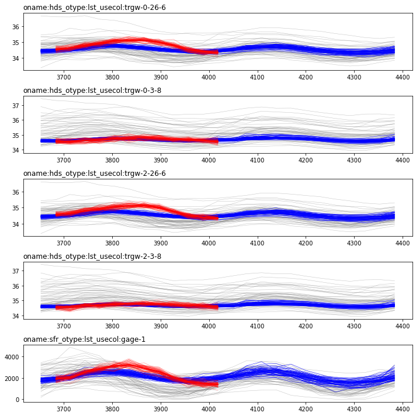
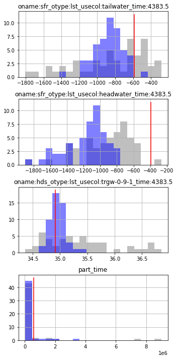
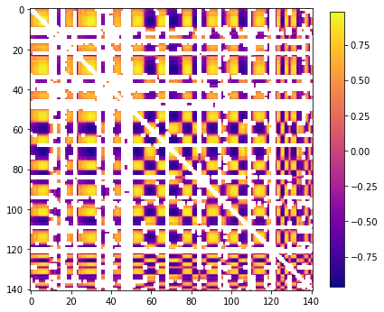
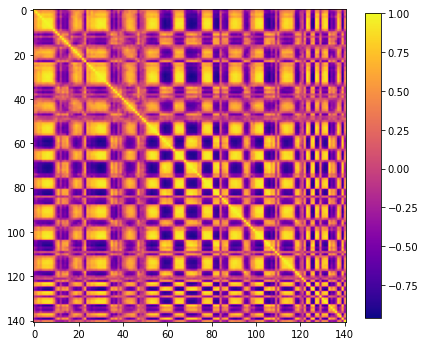
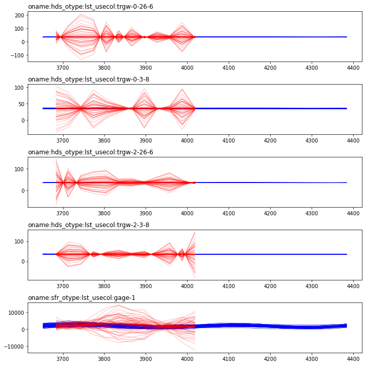
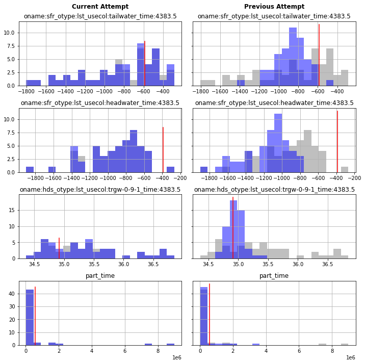

# PEST++IES - Avoiding Error Induced Bias

In a previous tutorial ("ies_1_basics") we introduced PEST++IES, demonstrated a rudimentary setup and explored some of the outcomes. In a subsequent tutorial ("ies_2_localization") we introduced localization - a strategy to resolve the emergence of spurrious non-physically based parameter-to-observation relations, incurred when using a rank deficient Jacobian matrix. 

However, we found that we were still incurring history matching induced bias in our forecasts - we were failing to capture the truth in forecast posterior probability distributions. In the current tutorial we will introduce two strategies to tackle this.

### Prior-Data Conflict
In previous tutorials we have discussed the concept of measurement noise and the assciated observation ensemble(see the "obs and weights" and "ies_1_basics" tutorials). Incorporating realizations of measurement noise in the observation ensemble allows measurement uncertainty to be carried along and transfered to forecast uncertainty. Closely related to these concepts is the concpet of prior-data conflict. 

In the most general sense, prior-data conflict (PDC) refers to occurences of simulated outputs from the prior parameter ensemble not "agreeing" with measured values (plus, optionally, measurement noise). "Agree" is used here in the statisticall sense, as a in the statistical distance between the ensemble of simulated outputs and the ensemble of measured values + noise. If these values do not agree, then this implies that parameter values (or combinations of parameters) which are very different from the prior will be required in order to reproduce these measured values. Trying to fit observations which are in conflict with the prior is quite likely to generate parameter bias, and subsequently forecast bias. #badtimes

PDC can be a sign of several things, including: 
 1. measurement errors (it is not unusual for shoddy data to make its way into a dataset), 
 2. underestimated prior parameter uncertainty (how confident are you really about those parameter ranges?), or 
 3. model structural error (the model may, almost certainly, be unable to replicate certain aspects of system behaviour).

Detecting PDC is relatively simple. PEST++IES does so automatically. It is a simple matter of simualting a prior ensemble and comparing the outputs with measured data + noise. If simulated outputs are all too far from measured values, then we have PDC. Resolving PDC is a bit more complicated. Ideally, if PDC is detected, a modeller should investigate the cause. This may involve revisting the measured dataset and investigating data quality. Or it may require a more thorough investigation of a models' ability to simulate processes or details of the natural system to understand _why_ the model is unable to represent the data. Ideally, if budget and time allow, a modeller might then go back and re-design their model or PEST setup.

Another, simpler but coarser (some would say Draconian) approach, is to just remove observations which are in conflict from the history matching dataset. This does not resolve the _cause_ of PDC. But it does avoid the _effect_ of history matching in the presence of PDC. In principle, in doing so the modeller accepts a higher posterior uncertainty so as to avoid inducing bias during history matching. (This of course assumes that the _cause_ of PDC is _not_ an underestimated prior parameter uncertainty.) PEST++IES implements automatic prior-data conflict resolution if the `ies_drop_conflicts()` PEST++ option is specified. It is usualy a good idea to make use of this option. However, dropping PDC's is not a silver bullet and it is incumbent on the user to verify it is being employed sensibly. And keep in mind: just be cause there is no PDC does not mean that the initial ensemble is valid!

### Total-Error Covariance
So far we have addressed _measurement_ noise by including realizations of noise in our observation ensembles. This ackowledges the existence of errors during data collection and carries the incurred uncertainty through to the forecast uncertainty. Inherent to this approach is the idea that a model is able to replicate measured data to a level comensurate with measurement noise. 

However, quite often that is simply not the case. Models are by definition simplifications of reality. "Simplification" implies that certain details and aspects of reality are not replicated, which incurrs error. So measurements come with error, but so do the model simulated counterpart. Trying to fit simulated and measured values to a level beyond what measurement and model error justifies is a sure path to inducing parameter bias, and potentialy forecast bias. 

So how do we avoid this dark and dreary outcome? An option is to implement the total-error covariance approach as described in [Alfonzo and Olivier (2019)](https://link.springer.com/article/10.1007/s10596-019-09889-6). 

PEST++IES has an option to record the _residual covariance matrix_ at each iteration (activated by specifying the `ies_save_rescov` option). The diagonal elements of this residual covariance matrix are the variances calculated from the residual between simulated and measured obsveration values. The off-diagonal elements contain the covariances between observation residuals. Conceptualy this covariance matrix can be thought of in the same manner as a covariance matrix of _measurement_ noise (e.g. such as the one we constructed during the "obs and weights" tutorial). But in this case the _residual_ covariance matrix expresses how well PEST++IES is able (or unable) to fit measured data. 

Thus, it becomes possible feed the _residual_ covariance matrix back to PEST++IES, as the observation noise covariance matrix. PEST++IES will generate realizations of noise  and also adjust observation weights to express the variance in this covarinace matrix. In this way, PEST++IES is given information on how well it could (or couldn't) fit observations the last time. In practice, this will keep PEST++IES from fitting observations _as well_, but more importantly, it helps prevent bias arising from attempting to reduce irreducible residuals.  

This workflow effectively treats observation noise covariance matrix as an additional "hyper-parameter" that is estimated at an "outer iteration" level. PEST++IES is run twice. The first time using observation noise covariance matrix that reflects _measurement_ noise. From this first PEST++IES run, the _residual_ covariance matrix is obtained which includes information on how well (or poorly) PEST++IES can expect to fit measured and simulated values. The PEST++IES run is then repeated, but with the _residual_ covariance matrix as the observation noise covariance matrix. Thus any bias or correlation present in the residuals of the first run is simply treated as noise in the second.

The result of the total-error covariance process should (substantially) reduce model-error-induced bias in the resulting parameter ensemble, and subsequently, any forecasts made using this ensemble. This is especially true when combined with prior-data conflict detection and resolution.

## The Current Tutorial

In the current notebook we are going to pick up after the "ies_2_localization" tutorial. Thus far we have set up PEST++IES and implemented localization, a strategy to tackle spurious parameter-to-observation correlation. 

We implemented localization with a user constructed localization matrix, as well as automatic adaptive localization. In doing so we reduced the potential for "ensemble colapse", a fancy term that means an "underestimate of forecast uncertainty caused by artificial parameter-to-observation relations". This solves history-matching bias induced by using a rank-deficient Jacobian, but it does not solve a (the?) core issue - trying to fit data with an imperfect model. 

In this tutorial we are going to implement two strategies to tackle error induced bias: automated prior-data conflict resolution and a total error covariance workflow. 

### Admin

The next couple of cells load necessary dependencies and call a convenience function to prepare the PEST dataset folder for you. Simply press `shift+enter` to run the cells.


```python
import os
import shutil
import warnings
warnings.filterwarnings("ignore")
warnings.filterwarnings("ignore", category=DeprecationWarning) 
import pyemu
import pandas as pd
import numpy as np
import matplotlib.pyplot as plt;
import psutil

import sys
sys.path.append(os.path.join("..", "..", "dependencies"))
import pyemu
import flopy

sys.path.append("..")
import herebedragons as hbd
```

Prepare the template directory and copy across model files from the previous tutorial. Make sure you complete the previous tutorial first.


```python
# specify the temporary working folder
t_d = os.path.join('freyberg6_template')

org_t_d = os.path.join("master_ies_2")
if not os.path.exists(org_t_d):
    raise Exception("you need to run the '/freyberg_ies_2_localization.ipynb' notebook")

if os.path.exists(t_d):
    shutil.rmtree(t_d)
shutil.copytree(org_t_d,t_d)
# check if you ran ies_2_loaclization
assert os.path.exists(os.path.join(t_d, 'spatial_loc.jcb')), "you need to run the '/freyberg_ies_2_localization.ipynb' notebook"
```

Load the PEST control file as a `Pst` object.


```python
pst_path = os.path.join(t_d, 'freyberg_mf6.pst')
pst = pyemu.Pst(pst_path)
assert 'observed' in pst.observation_data.columns
```

A quick reminder of the PEST++ optional control variables which have been specified. Note that the `ies_save_rescov` is activated. This option is important for later on.


```python
pst.pestpp_options
```


    {'forecasts': 'oname:sfr_otype:lst_usecol:tailwater_time:4383.5,oname:sfr_otype:lst_usecol:headwater_time:4383.5,oname:hds_otype:lst_usecol:trgw-0-9-1_time:4383.5,part_time',
     'ies_num_reals': 50,
     'ies_save_rescov': 'true',
     'ies_parameter_ensemble': 'prior_pe.jcb',
     'ies_observation_ensemble': 'oe.csv',
     'ies_localizer': 'spatial_loc.jcb',
     'ies_num_threads': 3,
     'ies_autoadaloc': 'true',
     'ies_autoadaloc_sigma_dist': 1,
     'ies_lambda_mults': 1.0}


## Where we left off

Just as a reminder, and so we can compare the results later on, let's load in the results from the previous tutorial and take a look at the (1) timeseries of measured and simulated heads and (2) the forecast probability distributions. Recall that we had implemented localization with a user specified matrix _as well_ as automatic adaptive localization.


As in the previous tutorial, let's write a couple of functions to help us plot ensembles of time series data and histograms of forecast probabilities.


```python
def plot_tseries_ensembles(pr_oe, pt_oe,noise, onames=["hds","sfr"]):
    pst.try_parse_name_metadata()
    obs = pst.observation_data.copy()
    obs = obs.loc[obs.oname.apply(lambda x: x in onames)]
    obs = obs.loc[obs.obgnme.apply(lambda x: x in pst.nnz_obs_groups),:]
    obs.obgnme.unique()

    ogs = obs.obgnme.unique()
    fig,axes = plt.subplots(len(ogs),1,figsize=(10,2*len(ogs)))
    ogs.sort()
    for ax,og in zip(axes,ogs):
        oobs = obs.loc[obs.obgnme==og,:].copy()
        oobs.loc[:,"time"] = oobs.time.astype(float)
        oobs.sort_values(by="time",inplace=True)
        tvals = oobs.time.values
        onames = oobs.obsnme.values
        [ax.plot(tvals,pr_oe.loc[i,onames].values,"0.5",lw=0.5,alpha=0.5) for i in pr_oe.index]
        [ax.plot(tvals,pt_oe.loc[i,onames].values,"b",lw=0.5,alpha=1) for i in pt_oe.index]
        
        oobs = oobs.loc[oobs.weight>0,:]
        tvals = oobs.time.values
        onames = oobs.obsnme.values
        [ax.plot(tvals,noise.loc[i,onames].values,"r",lw=0.5,alpha=0.5) for i in noise.index]
        ax.plot(oobs.time,oobs.obsval,"r-",lw=2)
        ax.set_title(og,loc="left")
    fig.tight_layout()
    return fig
```


```python
def plot_forecast_hist_compare(pt_oe,pr_oe, last_pt_oe=None,last_prior=None ):
        num_plots = len(pst.forecast_names)
        num_cols = 1
        if last_pt_oe!=None:
            num_cols=2
        fig,axes = plt.subplots(num_plots, num_cols, figsize=(5*num_cols,num_plots * 2.5), sharex='row',sharey='row')
        for axs,forecast in zip(axes, pst.forecast_names):
            # plot first column with currrent outcomes
            if num_cols==1:
                axs=[axs]
            ax = axs[0]
            # just for aesthetics
            bin_cols = [pt_oe.loc[:,forecast], pr_oe.loc[:,forecast],]
            if num_cols>1:
                bin_cols.extend([last_pt_oe.loc[:,forecast],last_prior.loc[:,forecast]])
            bins=np.histogram(pd.concat(bin_cols),
                                         bins=20)[1] #get the bin edges
            pr_oe.loc[:,forecast].hist(facecolor="0.5",alpha=0.5, bins=bins, ax=ax)
            pt_oe.loc[:,forecast].hist(facecolor="b",alpha=0.5, bins=bins, ax=ax)
            ax.set_title(forecast)
            fval = pst.observation_data.loc[forecast,"obsval"]
            ax.plot([fval,fval],ax.get_ylim(),"r-")
            # plot second column with other outcomes
            if num_cols >1:
                ax = axs[1]
                last_prior.loc[:,forecast].hist(facecolor="0.5",alpha=0.5, bins=bins, ax=ax)
                last_pt_oe.loc[:,forecast].hist(facecolor="b",alpha=0.5, bins=bins, ax=ax)
                ax.set_title(forecast)
                fval = pst.observation_data.loc[forecast,"obsval"]
                ax.plot([fval,fval],ax.get_ylim(),"r-")
        # set ax column titles
        if num_cols >1:
            axes.flatten()[0].text(0.5,1.2,"Current Attempt", transform=axes.flatten()[0].transAxes, weight='bold', fontsize=12, horizontalalignment='center')
            axes.flatten()[1].text(0.5,1.2,"Previous Attempt", transform=axes.flatten()[1].transAxes, weight='bold', fontsize=12, horizontalalignment='center')
        fig.tight_layout()
        return fig

```

OK, now that that is out of the way, load the obsevration ensembles from the prior, the posterior and the measured data + noise:


```python
pr_oe = pyemu.ObservationEnsemble.from_csv(pst=pst,filename=os.path.join(org_t_d,"freyberg_mf6.0.obs.csv"))
pt_oe = pyemu.ObservationEnsemble.from_csv(pst=pst,filename=os.path.join(org_t_d,"freyberg_mf6.{0}.obs.csv".format(pst.control_data.noptmax)))
noise = pyemu.ObservationEnsemble.from_csv(pst=pst,filename=os.path.join(org_t_d,"freyberg_mf6.obs+noise.csv"))
```

And _finally_ plot them up. You should be famililar with these plots from the previous tutorials. Red lines are measured data + noise. Blue lines are the posterior ensemble of model out puts. Grey lines are the prior of model outputs.


```python
fig = plot_tseries_ensembles(pr_oe, pt_oe,noise, onames=["hds","sfr"])
```


    

    


As you recall, the posterior fails to capture the truth for some forecasts (blue bars do not cover the red line):


```python
fig = plot_forecast_hist_compare(pt_oe=pt_oe, pr_oe=pr_oe)
```


    

    


## Automatic Prior-Data Conflict Resolution

Prior-data conflict, in the simpliest sense, means that simulated outputs from the prior parameter ensemble don't "cover" the observed values (plus optional measurement noise).  If the outputs from using lots of parameters and conservative (wide) parameter ranges (from the Prior) don't cover the observed values, then that implies we will need extreme parameter values (or extreme combinations) to reproduce these observations - another word for extreme is baised. 

So we shouldnt attempt parameter adjustments in the presence of prior-data conflict. The easies way to deal with this is to simply not use conflicted observations for parameter adjustment calculations...PEST++IES will do this automatically for you if the `ies_drop_conflicts()` option is activated.

PEST++IES makes a record of any prior-data conflicts. As we ran PEST++IES before, we can check which observations have PDC:


```python
pdc = pd.read_csv(os.path.join(org_t_d, "freyberg_mf6.pdc.csv"))
pdc.name
```


    0    ONAME:HDSTD_OTYPE:LST_USECOL:TRGW-2-26-6_TIME:3865.5
    1    ONAME:HDSVD_OTYPE:LST_USECOL:TRGW-0-26-6_TIME:3896.5
    2     ONAME:HDSVD_OTYPE:LST_USECOL:TRGW-0-3-8_TIME:3743.5
    3     ONAME:HDSVD_OTYPE:LST_USECOL:TRGW-0-3-8_TIME:3926.5
    4     ONAME:HDSVD_OTYPE:LST_USECOL:TRGW-0-3-8_TIME:3987.5
    Name: name, dtype: object


So not too many in our case. Not too concerning. Ideally we would go back and figure out why these are happening. Probably somethign to do with our "coarse" model setup (coarse in comparison to "reality").

But in this case, let's simply drop these conflicts.  Easy as:


```python
pst.pestpp_options["ies_drop_conflicts"] = True
```

Optionally, the `ies_pdc_sigma_distance()` option can be passed as a positive real number this being the number of standard deviations from the mean for both the prior and observations plus noise realizations that will be treated as point where these two distributions must overlap or “cover” each. 

If the prior realizations mean value minus `ies_pdc_sigma_distance` times the corresponding standard deviation is greater than the observations plus noise realizations mean plus `ies_pdc_sigma_distance` times the corresponding standard deviation, then the given observation is treated as conflicted (the converse of this situation is also checked).


```python
pst.pestpp_options["ies_pdc_sigma_distance"] = 2.0

```

Don't forget to re-write the control file:


```python
#pst.pestpp_options["ies_no_noise"] = True
pst.write(os.path.join(t_d,"freyberg_mf6.pst"))
```

    noptmax:3, npar_adj:29653, nnz_obs:144
    

And assign the number of workers that your machine can handle + the master directory:


```python
num_workers = psutil.cpu_count(logical=False) #update this according to your resources
m_d = os.path.join('master_ies_3')
```


```python
pyemu.os_utils.start_workers(t_d,"pestpp-ies","freyberg_mf6.pst",num_workers=num_workers,master_dir=m_d)
```

### Outcomes - Automatic PDC Resolution 

Let's check the PDC again:


```python
pdc = pd.read_csv(os.path.join(m_d, "freyberg_mf6.pdc.csv"))
pdc.head()
```


<div>
<style scoped>
    .dataframe tbody tr th:only-of-type {
        vertical-align: middle;
    }

    .dataframe tbody tr th {
        vertical-align: top;
    }

    .dataframe thead th {
        text-align: right;
    }
</style>
<table border="1" class="dataframe">
  <thead>
    <tr style="text-align: right;">
      <th></th>
      <th>name</th>
      <th>obs_mean</th>
      <th>obs_std</th>
      <th>obs_min</th>
      <th>obs_max</th>
      <th>obs_stat_min</th>
      <th>obs_stat_max</th>
      <th>sim_mean</th>
      <th>sim_std</th>
      <th>sim_min</th>
      <th>sim_max</th>
      <th>sim_stat_min</th>
      <th>sim_stat_max</th>
      <th>distance</th>
    </tr>
  </thead>
  <tbody>
    <tr>
      <th>0</th>
      <td>ONAME:HDSTD_OTYPE:LST_USECOL:TRGW-2-26-6_TIME:3865.5</td>
      <td>0.546066</td>
      <td>0.048920</td>
      <td>0.454029</td>
      <td>0.659325</td>
      <td>0.448226</td>
      <td>0.643906</td>
      <td>-0.105123</td>
      <td>0.266561</td>
      <td>-0.712393</td>
      <td>0.424195</td>
      <td>-0.638245</td>
      <td>0.428000</td>
      <td>0.029834</td>
    </tr>
    <tr>
      <th>1</th>
      <td>ONAME:HDSVD_OTYPE:LST_USECOL:TRGW-0-3-8_TIME:3743.5</td>
      <td>-0.062918</td>
      <td>0.008216</td>
      <td>-0.083237</td>
      <td>-0.046373</td>
      <td>-0.079350</td>
      <td>-0.046485</td>
      <td>0.009660</td>
      <td>0.010072</td>
      <td>-0.003398</td>
      <td>0.063068</td>
      <td>-0.010484</td>
      <td>0.029805</td>
      <td>0.042975</td>
    </tr>
    <tr>
      <th>2</th>
      <td>ONAME:HDSVD_OTYPE:LST_USECOL:TRGW-0-3-8_TIME:3926.5</td>
      <td>-0.028883</td>
      <td>0.010313</td>
      <td>-0.053058</td>
      <td>-0.000401</td>
      <td>-0.049509</td>
      <td>-0.008258</td>
      <td>0.009150</td>
      <td>0.006404</td>
      <td>0.001972</td>
      <td>0.035456</td>
      <td>-0.003658</td>
      <td>0.021958</td>
      <td>0.002373</td>
    </tr>
  </tbody>
</table>
</div>


PEST++IES records a csv file with the "adjusted" weights, should you wish to inspect them. Adjusted weights for PDC observations should be zero:


```python
rw_obs = pd.read_csv(os.path.join(m_d,"freyberg_mf6.adjusted.obs_data.csv"), index_col=0)
rw_obs.loc[[i.lower() for i in pdc.name.tolist()]]
```


<div>
<style scoped>
    .dataframe tbody tr th:only-of-type {
        vertical-align: middle;
    }

    .dataframe tbody tr th {
        vertical-align: top;
    }

    .dataframe thead th {
        text-align: right;
    }
</style>
<table border="1" class="dataframe">
  <thead>
    <tr style="text-align: right;">
      <th></th>
      <th>value</th>
      <th>group</th>
      <th>weight</th>
    </tr>
    <tr>
      <th>name</th>
      <th></th>
      <th></th>
      <th></th>
    </tr>
  </thead>
  <tbody>
    <tr>
      <th>oname:hdstd_otype:lst_usecol:trgw-2-26-6_time:3865.5</th>
      <td>0.555868</td>
      <td>oname:hdstd_otype:lst_usecol:trgw-2-26-6</td>
      <td>0.0</td>
    </tr>
    <tr>
      <th>oname:hdsvd_otype:lst_usecol:trgw-0-3-8_time:3743.5</th>
      <td>-0.061342</td>
      <td>oname:hdsvd_otype:lst_usecol:trgw-0-3-8</td>
      <td>0.0</td>
    </tr>
    <tr>
      <th>oname:hdsvd_otype:lst_usecol:trgw-0-3-8_time:3926.5</th>
      <td>-0.029573</td>
      <td>oname:hdsvd_otype:lst_usecol:trgw-0-3-8</td>
      <td>0.0</td>
    </tr>
  </tbody>
</table>
</div>


If you wish, you can check how this has influenced forecast posteriors and the match with historical data. As there was not much PDC, in this case the difference won't be very significant. For the purposes of the tutorial we shan't bother. 

## Total-Error Covariance Workflow

Right then. We have completed our first "inner" iteration loop of the total-error covariance workflow: we have obtained the residual covariance matrix after history-matching (e.g. the posterior residual). 

How did we do this? We had the `ies_save_rescov` option active. In doing so, we instructed PEST++IES to record the residual covariance matrix at each iteration. 

A reminder:


```python
pst.pestpp_options["ies_save_rescov"] = True
```

We can now choose which iteration we wish to use to generate realizations of observation noise. So let's do that. Let's go with the final iteration. First lets look at the final (e.g. posterior) resdiual covariance from the last run:


```python
# read the covariance matrix file
res_cov_file = os.path.join(m_d,"freyberg_mf6.{0}.shrunk_res.cov".format(pst.control_data.noptmax))
res_cov = pyemu.Cov.from_ascii(res_cov_file)
# calculate the Pearson correlation coeficient, a normalized measurement of the covariance, 
# such that the result always has a value between −1 and 1
x = res_cov.to_pearson().x.copy()
# blank out values lower than a threshold 
x[np.abs(x) < 0.2] = np.NaN
# blank out values of 1 e.g. the diagonal
x[x==1.0] = np.NaN
# make a cool plot
fig,ax = plt.subplots(1,1,figsize=(7,7))
cb = ax.imshow(x,cmap="plasma")
plt.colorbar(cb, shrink=0.8);
```


    

    


That would make a nice bohemain rug pattern!  Seriously though, we see lots of correlation between residuals (values close to 1 or -1)...so much for the "independence" assumption.

So what should we do?  Well, let's feed that covariance matrix to PEST++IES for the next run (an "outer" iteration).  During this run, the noise realizations that are paired with each parameter realization for the calculation of measurement Phi will be drawn from this covariance matrix.  Additionally, the weights for non-zero weighted observations maybe lowered if the variance on the diagaonal of this matrix implies lower a weight (weights will never be increased).  In this way, PESTPP-IES is given information about how well it could (or couldn't) fit the observations last time.  In practice, this will keep PEST++IES from fitting the observations as well, but more importantly, this helps prevent bias arising from irreducible residual and ultimately, leads to less biased and more conservative forecast estimates. 

Prepare a write the residual covariance matrix file:


```python
obs=pst.observation_data
minvar = ((1./obs.loc[res_cov.names,"weight"])**2).min()
shrink = np.zeros(res_cov.shape)
np.fill_diagonal(shrink,minvar)
lamb = 2. / (pt_oe.shape[0] + 1)
lamb = 0.2
print(lamb)
shrunk = (lamb * shrink) + ((1.-lamb) * res_cov.x)
shrunk = pyemu.Cov(x=shrunk,names=res_cov.names)
# write shrunk residual covariance matrix to file
shrunk.to_ascii(os.path.join(t_d,"shrunk_obs.cov"))

# plot it again
fig,ax = plt.subplots(1,1,figsize=(7,7))
x = shrunk.to_pearson().x.copy()
x[x==0.0] = np.NaN
cb=ax.imshow(x,cmap="plasma")
plt.colorbar(cb, shrink=0.8, ax=ax);
```

    0.2
    


    

    


Now we need to tell PEST++IES to use this covariance matirx and also change some options to be compatible with this mode of operation.

Just as a reminder:


```python
pst.pestpp_options
```


    {'forecasts': 'oname:sfr_otype:lst_usecol:tailwater_time:4383.5,oname:sfr_otype:lst_usecol:headwater_time:4383.5,oname:hds_otype:lst_usecol:trgw-0-9-1_time:4383.5,part_time',
     'ies_num_reals': 50,
     'ies_save_rescov': True,
     'ies_parameter_ensemble': 'prior_pe.jcb',
     'ies_observation_ensemble': 'oe.csv',
     'ies_localizer': 'spatial_loc.jcb',
     'ies_num_threads': 3,
     'ies_autoadaloc': 'true',
     'ies_autoadaloc_sigma_dist': 1,
     'ies_lambda_mults': 1.0,
     'ies_drop_conflicts': True,
     'ies_pdc_sigma_distance': 2.0}


Up untill now we have been specifying a pre-prepared observation ensemble (`'ies_observation_ensemble': 'oe.csv'`). We generated these realizations of measurments + noise in a previous tutorail (see the "freyberg obs and weights" notebook). So now we need to make sure to tell PEST++IES to use the residual covariance matrix instead. His means removing the `ies_observation_ensemble` option as well:


```python
pst.pestpp_options.pop("ies_observation_ensemble")
# see it is gone now
pst.pestpp_options
```


    {'forecasts': 'oname:sfr_otype:lst_usecol:tailwater_time:4383.5,oname:sfr_otype:lst_usecol:headwater_time:4383.5,oname:hds_otype:lst_usecol:trgw-0-9-1_time:4383.5,part_time',
     'ies_num_reals': 50,
     'ies_save_rescov': True,
     'ies_parameter_ensemble': 'prior_pe.jcb',
     'ies_localizer': 'spatial_loc.jcb',
     'ies_num_threads': 3,
     'ies_autoadaloc': 'true',
     'ies_autoadaloc_sigma_dist': 1,
     'ies_lambda_mults': 1.0,
     'ies_drop_conflicts': False,
     'ies_pdc_sigma_distance': 2.0,
     'ies_no_noise': False,
     'obscov': 'shrunk_obs.cov',
     'ies_group_draws': False}


Now assign the residual covariance matrix to the `obscov` pest++ option. We shall also disable the `ies_group_draws` option. This is usualy implemented as groups of parameters/observations are likely to have prior correlation. However, in this case, our residual covariance matrix already expresses observation correlation, so we can disable it.


```python
pst.pestpp_options["obscov"] = "shrunk_obs.cov"
pst.pestpp_options["ies_group_draws"] = False
```

In principle we should no longer have any PDC. Let's disable it so as to catch any potential silliness:


```python
# remove PDC resolution
pst.pestpp_options["ies_drop_conflicts"] = False
```


```python
pst.control_data.noptmax
```


    3


Good to go. Re-write and run this thing!


```python
pst.write(os.path.join(t_d,"freyberg_mf6.pst"))
```

    noptmax:3, npar_adj:29653, nnz_obs:144
    

As usual, make sure to specify the number of workers that your machine can cope with. 


```python
num_workers = psutil.cpu_count(logical=False) #update this according to your resources
m_d = os.path.join('master_ies_3')
```


```python
pyemu.os_utils.start_workers(t_d,"pestpp-ies","freyberg_mf6.pst",num_workers=num_workers,master_dir=m_d)
```

### Outcomes - Total-Error Covariance

Drum-roll...Let's see if we were (finally?) sucessfull. Read in the observation ensembles:


```python
pr_oe_rescov = pyemu.ObservationEnsemble.from_csv(pst=pst,filename=os.path.join(m_d,"freyberg_mf6.0.obs.csv"))
pt_oe_rescov = pyemu.ObservationEnsemble.from_csv(pst=pst,filename=os.path.join(m_d,"freyberg_mf6.{0}.obs.csv".format(pst.control_data.noptmax)))
noise_rescov = pyemu.ObservationEnsemble.from_csv(pst=pst,filename=os.path.join(m_d,"freyberg_mf6.obs+noise.csv"))
```

Before we get to the forecasts, let's take a look at the fit with historical observation time series. Yikes - that looks hectic. What's going on with our observations+noise realizations (the red lines)? Yep, that's the effect of using residual-based covariance matrix to describe observation noise. It may not be very conforting, but it is a more robust measure of how well we can expect our model to reflect those observations.  


```python
fig = plot_tseries_ensembles(pr_oe_rescov, pt_oe_rescov, noise_rescov, onames=["hds","sfr"])
```


    

    


Now, the moment of truth (pun intended). Sucess? Finally! Ok, now that is much better!  We are bracketing the truth for all forecasts - that is the first time so far.  Sweet as! However, the price of these unbiased and conservative forecasts is...more uncertainty (the range of possible outcomes for all forecasts is wider).

Is more uncertainty bad? No, it is simply the best we can do with the data and model that we have. As we have seen before, reducing the forecast through history matching any further _with this model_ will result in a biased (i.e. wrong) estimate of forecast and forecast uncertainty. 

So what can we do if we absolutely need to reduce uncertainty for the sake of usefull decision making? One option is collect more observation data. Another option is to reduce the model structural error. This might mean finer discretization (spatial and/or temporal), or simulate more/other physical processes, or increase the flexibility of the parameterization scheme, and so on.  


```python
fig = plot_forecast_hist_compare(pt_oe=pt_oe_rescov,pr_oe=pr_oe_rescov,
                                last_pt_oe=pt_oe,last_prior=pr_oe)
```


    

    


Hopefully you've made it this far. This was quite a marathon. However, we feel it it is an important marathon to endure. In this series of tutorials on PEST++IES we have gone through the basics of preparing a PEST++IES run, introduced you to several of the things that can go wrong, and most importantly, demonstrated workflows to help avoid them. 

We have shown that a good fit to historic conditions doesn't mean robust forecast estimates. This applies to any history matching/calibration context, not just PEST++IES.  Hopefully, if it wasn't already there, these tutorials have instilled in you a deep distrust of modelling and the dangers of careless use of data assimilation software. However, it's not all doom and gloom. From a theoretical standpoint, using the posterior residual covariance matrix in an outer iteration scheme is one way to find (more) robust forecast estimates, especially when a model needs to make a range of forecasts (like regional models?). 

Happy modelling!


