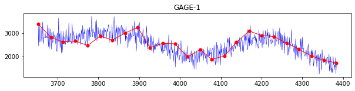
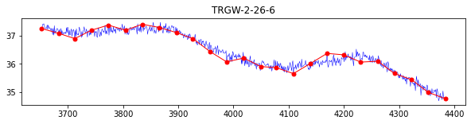
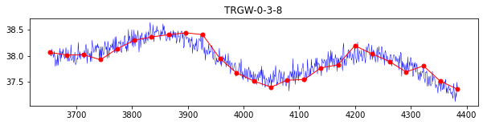
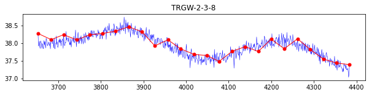
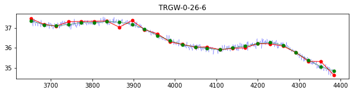
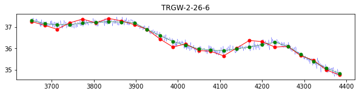
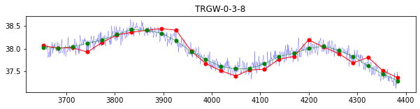
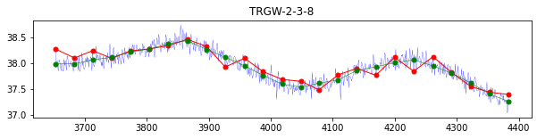
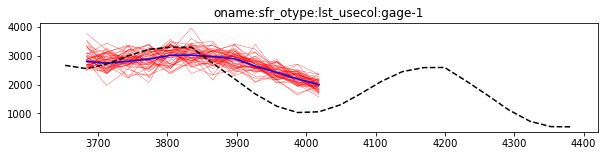
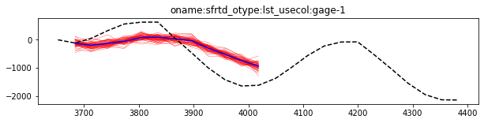

---
layout: default
title: Observation Values, Weights and Noise
parent: Decision Support Modelling with pyEMU and PEST++
nav_order: 2
---
                    # Formulating the Objective Function and The Dark Art of Weighting

The objective function expresses model-to-measurement misfit for use in the solution of an inverse problem through the *weighted squared difference between measured and simulated observations*. There is no formula for a universally "best approach" to formulate an objective function. However, the universal underlying principle is to ensure that as much information as possible is transferred to the parameters of a model, in as "safe" a way as possible (Doherty, 2015). 

**Observation Types**

In most history matching contexts a “multicomponent” objective function is recommended. Each component of this objective function is calculated on the basis of different groups of observations or of the same group of observations processed in different ways. In a nut-shell, this means as many (useful!) types of observation as are available should be included in the parameter-estimation process. This does not **just** mean different "measurement types"! It also means teasing out components *within* a given measurement type. These "secondary" components often contain information that is otherwise lost or overshadowed. 

**Observation Grouping** 

Using a multicomponent approach can extract as much information from an observation dataset as possible and transfer this information to estimated parameters. When constructing a PEST dataset, it is often usefull (and convenient) to group observations by type. This makes it easier to customize objective function design and track the flow of information from data to parameters (and subsequently to predictions). Ideally, each observation grouping should illuminate and constrain parameter estimation related to a separate aspect of the system beiong modelled (Doherty and Hunt, 2010). For example, absolute values of heads may inform parameters that control horizontal flow patterns, whilst vertical diferences between heads in different aquifers may inform parameters that control vertical flow patterns. 

**Observation Weighting**

A user must decide how to weight observations before estimating parameters with PEST(++). In some cases, it is prudent to strictly weight observations based on the inverse of the standard deviation of measurement noise. Observations with higher credibility should, without a doubt, be given more weight than those with lower credibility. However, in many history-matching contexts, model defects are just as important as noise in inducing model-to-measurement misfit as field measurements. Some types of model outputs are more affected by model imperfections than others. (Notably, the effects of imperfections on model output _differences_ are frequently less than their effects on raw model outputs.) In some cases, accommodating the "structural" nature of model-to-measurement misfit (i.e. the model is inherently better at fitting some measurements than others) is preferable rather than attempting to strictly respect the measurement credibility. 

The PEST Book (Doherty, 2015) and the USGS published report "A Guide to Using PEST for Groundwater-Model Calibration" (Doherty et al 2010) go into detail on formulating an objective function and discuss common issues with certain data-types. 

**References and Recommended Reading:**
>  - Doherty, J., (2015). Calibration and Uncertainty Analysis for Complex Environmental Models. Watermark Numerical Computing, Brisbane, Australia. ISBN: 978-0-9943786-0-6.
>  - <div class="csl-entry">White, J. T., Doherty, J. E., &#38; Hughes, J. D. (2014). Quantifying the predictive consequences of model error with linear subspace analysis. <i>Water Resources Research</i>, <i>50</i>(2), 1152–1173. https://doi.org/10.1002/2013WR014767</div>
>  - <div class="csl-entry">Doherty, J., &#38; Hunt, R. (2010). <i>Approaches to Highly Parameterized Inversion: A Guide to Using PEST for Groundwater-Model Calibration: U.S. Geological Survey Scientific Investigations Report 2010–5169</i>. https://doi.org/https://doi.org/10.3133/sir20105169</div>


### Recap: the modified-Freyberg PEST dataset

The modified Freyberg model is introduced in another tutorial notebook (see "freyberg intro to model"). The current notebook picks up following the "psfrom pest setup" notebook, in which a high-dimensional PEST dataset was constructed using `pyemu.PstFrom`. You may also wish to go through the "intro to pyemu" notebook beforehand.

We will now address assigning observation target values from "measured" data and observation weighting prior to history matching. 

Recall from the "pstfrom pest setup" notebook that we included several observation types in the history matching dataset, namely:
 - head time-series
 - river gage time-series
 - temporal differences between both heads and gage time-series
 - vertical head differences

We also included many observations of model outputs for which we do not have measured data. We kept these to make it easier to keep track of model outputs (this becomes a necessity when working with ensembles). We also included observations of "forecasts", i.e. model outputs of management interest.

The next couple of cells load necessary dependencies and call a convenience function to prepare the PEST dataset folder for you. This is the same dataset that was constructed during the "pstfrom pest setup" tutorial. 

Simply press `shift+enter` to run the cells.


```python
import os
import shutil
import warnings
warnings.filterwarnings("ignore")
warnings.filterwarnings("ignore", category=DeprecationWarning) 
import pandas as pd
import numpy as np
import matplotlib.pyplot as plt;
import matplotlib

import sys
sys.path.append(os.path.join("..", "..", "dependencies"))
import pyemu
import flopy

plt.rcParams.update({'font.size': 10})

sys.path.append("..")
import herebedragons as hbd
```


```python
# specify the temporary working folder
t_d = os.path.join('freyberg6_template')
```


```python
# use the conveninece function to get the pre-preprepared PEST dataset;
# this is the same dataset consutrcted in the "pstfrom" tutorial
if os.path.exists(t_d):
        shutil.rmtree(t_d)
org_t_d = os.path.join("..","part2_1_pstfrom_pest_setup",t_d)
if not os.path.exists(org_t_d):
    hbd.dir_cleancopy(org_d=os.path.join('..','..', 'models','freyberg_pstfrom_pest_setup'),
                    new_d=t_d)
else:
    print("using files at ",org_t_d)
    shutil.copytree(org_t_d,t_d)
```

    using files at  ..\part2_1_pstfrom_pest_setup\freyberg6_template
    

Let's load in the `Pst` control file we constructed during the "pstfrom" tutorial:


```python
pst_file = "freyberg_mf6.pst"

pst = pyemu.Pst(os.path.join(t_d, pst_file))
```

When we constructed the PEST dataset (in the "pstfrom" tutorial) we simply identified what model outputs we wanted PEST to "observe". In doing so, `pyemu.PstFrom` assigned observation target values that it found in the existing model output files. (Which conveniently allowed us to test whether out PEST setup was working correctly). All observation weights were assigned a default value of 1.0. 

As a reminder:


```python
obs = pst.observation_data
obs.head()
```


<div>
<style scoped>
    .dataframe tbody tr th:only-of-type {
        vertical-align: middle;
    }

    .dataframe tbody tr th {
        vertical-align: top;
    }

    .dataframe thead th {
        text-align: right;
    }
</style>
<table border="1" class="dataframe">
  <thead>
    <tr style="text-align: right;">
      <th></th>
      <th>obsnme</th>
      <th>obsval</th>
      <th>weight</th>
      <th>obgnme</th>
      <th>oname</th>
      <th>otype</th>
      <th>usecol</th>
      <th>time</th>
      <th>i</th>
      <th>j</th>
      <th>totim</th>
    </tr>
    <tr>
      <th>obsnme</th>
      <th></th>
      <th></th>
      <th></th>
      <th></th>
      <th></th>
      <th></th>
      <th></th>
      <th></th>
      <th></th>
      <th></th>
      <th></th>
    </tr>
  </thead>
  <tbody>
    <tr>
      <th>oname:hds_otype:lst_usecol:trgw-0-13-10_time:3652.5</th>
      <td>oname:hds_otype:lst_usecol:trgw-0-13-10_time:3652.5</td>
      <td>34.326872</td>
      <td>1.0</td>
      <td>oname:hds_otype:lst_usecol:trgw-0-13-10</td>
      <td>hds</td>
      <td>lst</td>
      <td>trgw-0-13-10</td>
      <td>3652.5</td>
      <td>NaN</td>
      <td>NaN</td>
      <td>NaN</td>
    </tr>
    <tr>
      <th>oname:hds_otype:lst_usecol:trgw-0-13-10_time:3683.5</th>
      <td>oname:hds_otype:lst_usecol:trgw-0-13-10_time:3683.5</td>
      <td>34.440950</td>
      <td>1.0</td>
      <td>oname:hds_otype:lst_usecol:trgw-0-13-10</td>
      <td>hds</td>
      <td>lst</td>
      <td>trgw-0-13-10</td>
      <td>3683.5</td>
      <td>NaN</td>
      <td>NaN</td>
      <td>NaN</td>
    </tr>
    <tr>
      <th>oname:hds_otype:lst_usecol:trgw-0-13-10_time:3712.5</th>
      <td>oname:hds_otype:lst_usecol:trgw-0-13-10_time:3712.5</td>
      <td>34.534811</td>
      <td>1.0</td>
      <td>oname:hds_otype:lst_usecol:trgw-0-13-10</td>
      <td>hds</td>
      <td>lst</td>
      <td>trgw-0-13-10</td>
      <td>3712.5</td>
      <td>NaN</td>
      <td>NaN</td>
      <td>NaN</td>
    </tr>
    <tr>
      <th>oname:hds_otype:lst_usecol:trgw-0-13-10_time:3743.5</th>
      <td>oname:hds_otype:lst_usecol:trgw-0-13-10_time:3743.5</td>
      <td>34.582875</td>
      <td>1.0</td>
      <td>oname:hds_otype:lst_usecol:trgw-0-13-10</td>
      <td>hds</td>
      <td>lst</td>
      <td>trgw-0-13-10</td>
      <td>3743.5</td>
      <td>NaN</td>
      <td>NaN</td>
      <td>NaN</td>
    </tr>
    <tr>
      <th>oname:hds_otype:lst_usecol:trgw-0-13-10_time:3773.5</th>
      <td>oname:hds_otype:lst_usecol:trgw-0-13-10_time:3773.5</td>
      <td>34.561764</td>
      <td>1.0</td>
      <td>oname:hds_otype:lst_usecol:trgw-0-13-10</td>
      <td>hds</td>
      <td>lst</td>
      <td>trgw-0-13-10</td>
      <td>3773.5</td>
      <td>NaN</td>
      <td>NaN</td>
      <td>NaN</td>
    </tr>
  </tbody>
</table>
</div>


As mentioned above, we need to do several things:
 - replace observation target values (the `obsval` column) with corresponding vallues from "measured data";
 - assign meaningfull weights to history matching target observations (the `weight` column);
 - assign zero weight to observations that should not affect history matching.

Let's start off with the basics. First set all weights to zero. We will then go through and assign meaningfull weights only to relevant target observations. 


```python
#check for nonzero weights
obs.weight.value_counts()
```


    1.0    62227
    Name: weight, dtype: int64


```python
# assign all weight zero
obs.loc[:, 'weight'] = 0

# check for non zero weights
obs.weight.unique()
```


    array([0], dtype=int64)


### Measured Data

In most data assimilation contexts you will have some relevant measured data (e.g. water levels, river flow rates, etc.) which correspond to simulated model outputs. These will probably not coincide exactly with your model outputs. Are the wells at the same coordinate as the center of the model cell? Do measurement times line up nicely with model output times? Doubt it. And if they do, are single measurements that match model output times biased? And so on... 

A modeller needs to ensure that the observation values assigned in the PEST control file are aligned with simulated model outputs. This will usually require some case-specific pre-processing. Here we are going to demonstrate __an example__ - but remember, every case is different!

First, let's access our dataset of "measured" observations.


```python
obs_csv = os.path.join('..', '..', 'models', 'daily_freyberg_mf6_truth',"obs_data.csv")
assert os.path.exists(obs_csv)
obs_data = pd.read_csv(obs_csv)
obs_data.set_index('site', inplace=True)
obs_data.iloc[:5]
```


<div>
<style scoped>
    .dataframe tbody tr th:only-of-type {
        vertical-align: middle;
    }

    .dataframe tbody tr th {
        vertical-align: top;
    }

    .dataframe thead th {
        text-align: right;
    }
</style>
<table border="1" class="dataframe">
  <thead>
    <tr style="text-align: right;">
      <th></th>
      <th>time</th>
      <th>value</th>
    </tr>
    <tr>
      <th>site</th>
      <th></th>
      <th></th>
    </tr>
  </thead>
  <tbody>
    <tr>
      <th>GAGE-1</th>
      <td>3652.5</td>
      <td>1713.876690</td>
    </tr>
    <tr>
      <th>GAGE-1</th>
      <td>3653.5</td>
      <td>2476.327373</td>
    </tr>
    <tr>
      <th>GAGE-1</th>
      <td>3654.5</td>
      <td>1505.541231</td>
    </tr>
    <tr>
      <th>GAGE-1</th>
      <td>3655.5</td>
      <td>2210.090691</td>
    </tr>
    <tr>
      <th>GAGE-1</th>
      <td>3656.5</td>
      <td>2207.018734</td>
    </tr>
  </tbody>
</table>
</div>


As you can see, we have measured data at daily intervals. But our model simulates monthly stress periods. So what observation value do we use? 

One option is to simply sample measured values from the data closest to our simulated output. The next cell does this, with a few checks along the way:


```python
#just pick the nearest to the sp end
model_times = pst.observation_data.time.dropna().astype(float).unique()
# get the list of osb names for which we have data
obs_sites =  obs_data.index.unique().tolist()

# restructure the obsevration data 
es_obs_data = []
for site in obs_sites:
    site_obs_data = obs_data.loc[site,:].copy()
    if isinstance(site_obs_data, pd.Series):
        site_obs_data.loc["site"] = site_obs_data.index.values
    elif isinstance(site_obs_data, pd.DataFrame):
        site_obs_data.loc[:,"site"] = site_obs_data.index.values
        site_obs_data.index = site_obs_data.time
        site_obs_data = site_obs_data.reindex(model_times,method="nearest")

    if site_obs_data.shape != site_obs_data.dropna().shape:
        print("broke",site)
    es_obs_data.append(site_obs_data)
es_obs_data = pd.concat(es_obs_data,axis=0,ignore_index=True)
es_obs_data.shape
```


    (125, 3)


Right then...let's plot our down-sampled measurment data and  compare it to the original high-frequency time series.

The next cell generates plots for each time series of measured data. Blue lines are the original high-frequency data. The marked red line is the down-sampled data. What do you think? Does sampeling to the "closest date" capture the behaviour of the time series? Doesn't look too good...It does not seem to capture the general trend very well.

Let's try somethign else instead.


```python
for site in obs_sites:
    #print(site)
    site_obs_data = obs_data.loc[site,:]
    es_site_obs_data = es_obs_data.loc[es_obs_data.site==site,:].copy()
    es_site_obs_data.sort_values(by="time",inplace=True)
    #print(site,site_obs_data.shape)
    fig,ax = plt.subplots(1,1,figsize=(10,2))
    ax.plot(site_obs_data.time,site_obs_data.value,"b-",lw=0.5)
    #ax.plot(es_site_obs_data.datetime,es_site_obs_data.value,'r-',lw=2)
    ax.plot(es_site_obs_data.time,es_site_obs_data.value,'r-',lw=1,marker='.',ms=10)
    ax.set_title(site)
plt.show()
```


    

    


    

    


    

    


    

    


    

    


This time, let's try using a moving-average instead. Effectively this is applying a low-pass filter to the time-series, smooting out some of the spiky noise. 

The next cell re-samples the data and then plots it. Measured data sampled using a low-pass filter is shown by the marked green line. What do you think? Better? It certainly does a better job at capturing the trends in the original data! Let's go with that.


```python
ess_obs_data = {}
for site in obs_sites:
    #print(site)
    site_obs_data = obs_data.loc[site,:].copy()
    if isinstance(site_obs_data, pd.Series):
        site_obs_data.loc["site"] = site_obs_data.index.values
    if isinstance(site_obs_data, pd.DataFrame):
        site_obs_data.loc[:,"site"] = site_obs_data.index.values
        site_obs_data.index = site_obs_data.time
        sm = site_obs_data.value.rolling(window=20,center=True,min_periods=1).mean()
        sm_site_obs_data = sm.reindex(model_times,method="nearest")
    #ess_obs_data.append(pd.DataFrame9sm_site_obs_data)
    ess_obs_data[site] = sm_site_obs_data
    
    es_site_obs_data = es_obs_data.loc[es_obs_data.site==site,:].copy()
    es_site_obs_data.sort_values(by="time",inplace=True)
    fig,ax = plt.subplots(1,1,figsize=(10,2))
    ax.plot(site_obs_data.time,site_obs_data.value,"b-",lw=0.25)
    ax.plot(es_site_obs_data.time,es_site_obs_data.value,'r-',lw=1,marker='.',ms=10)
    ax.plot(sm_site_obs_data.index,sm_site_obs_data.values,'g-',lw=0.5,marker='.',ms=10)
    ax.set_title(site)
plt.show()
ess_obs_data = pd.DataFrame(ess_obs_data)
ess_obs_data.shape
```


    

    


    

    


    

    


    

    


    

    


    (25, 5)


### Update Target Observation Values in the Control File

Right then - so, these are our smoothed-sampled observation values:


```python
ess_obs_data.head()
```


<div>
<style scoped>
    .dataframe tbody tr th:only-of-type {
        vertical-align: middle;
    }

    .dataframe tbody tr th {
        vertical-align: top;
    }

    .dataframe thead th {
        text-align: right;
    }
</style>
<table border="1" class="dataframe">
  <thead>
    <tr style="text-align: right;">
      <th></th>
      <th>GAGE-1</th>
      <th>TRGW-0-26-6</th>
      <th>TRGW-2-26-6</th>
      <th>TRGW-0-3-8</th>
      <th>TRGW-2-3-8</th>
    </tr>
    <tr>
      <th>time</th>
      <th></th>
      <th></th>
      <th></th>
      <th></th>
      <th></th>
    </tr>
  </thead>
  <tbody>
    <tr>
      <th>3652.5</th>
      <td>1998.425564</td>
      <td>34.644013</td>
      <td>34.565496</td>
      <td>34.571747</td>
      <td>34.579985</td>
    </tr>
    <tr>
      <th>3683.5</th>
      <td>1914.074438</td>
      <td>34.554179</td>
      <td>34.566638</td>
      <td>34.580241</td>
      <td>34.551542</td>
    </tr>
    <tr>
      <th>3712.5</th>
      <td>2047.803833</td>
      <td>34.639517</td>
      <td>34.636888</td>
      <td>34.559523</td>
      <td>34.534734</td>
    </tr>
    <tr>
      <th>3743.5</th>
      <td>2538.185281</td>
      <td>34.797994</td>
      <td>34.795909</td>
      <td>34.614963</td>
      <td>34.676304</td>
    </tr>
    <tr>
      <th>3773.5</th>
      <td>2840.455384</td>
      <td>34.923169</td>
      <td>34.928128</td>
      <td>34.651341</td>
      <td>34.667008</td>
    </tr>
  </tbody>
</table>
</div>


Now we are confronted with the task of getting these _processed_ measured observation values into the `Pst` control file. Once again, how you do this will end up being somewhat case-specific and will depend on how your obsveration names were constructed. For example, in our case we can use the following function (we made it a function because we are going to repeat it a few times):


```python
def update_pst_obsvals(obs_names, obs_data):
    """obs_names: list of selected obs names
       obs_data: dataframe with obs values to use in pst"""
    # for checking
    org_nnzobs = pst.nnz_obs
    # get list of times for obs name sufixes
    time_str = obs_data.index.map(lambda x: f"time:{x}").values
    # empyt list to keep track of misssing observation names
    missing=[]
    for col in obs_data.columns:
        # get obs list sufix for each column of data
        obs_sufix = col.lower()+"_"+time_str
        for string, oval, time in zip(obs_sufix,obs_data.loc[:,col].values, obs_data.index.values):
                
                if not any(string in obsnme for obsnme in obs_names):
                    missing.append(string)
                # if not, then update the pst.observation_data
                else:
                    # get a list of obsnames
                    obsnme = [ks for ks in obs_names if string in ks] 
                    assert len(obsnme) == 1,string
                    obsnme = obsnme[0]
                    # assign the obsvals
                    obs.loc[obsnme,"obsval"] = oval
                    # assign a generic weight
                    if time > 3652.5 and time <=4018.5:
                        obs.loc[obsnme,"weight"] = 1.0
    # checks
    #if (pst.nnz_obs-org_nnzobs)!=0:
    #    assert (pst.nnz_obs-org_nnzobs)==obs_data.count().sum()
    if len(missing)==0:
        print('All good.')
        print('Number of new nonzero obs:' ,pst.nnz_obs-org_nnzobs) 
        print('Number of nonzero obs:' ,pst.nnz_obs)  
    else:
        raise ValueError('The following obs are missing:\n',missing)
    
    return


```


```python
pst.nnz_obs_groups
```


    []


```python
# subselection of observaton names; this is because several groups share the same obs name sufix
obs_names = obs.loc[obs.oname.isin(['hds', 'sfr']), 'obsnme']

# run the function
update_pst_obsvals(obs_names, ess_obs_data)
```

    All good.
    Number of new nonzero obs: 60
    Number of nonzero obs: 60
    


```python
pst.nnz_obs_groups
```


    ['oname:hds_otype:lst_usecol:trgw-0-26-6',
     'oname:hds_otype:lst_usecol:trgw-0-3-8',
     'oname:hds_otype:lst_usecol:trgw-2-26-6',
     'oname:hds_otype:lst_usecol:trgw-2-3-8',
     'oname:sfr_otype:lst_usecol:gage-1']


```python
pst.observation_data.oname.unique()
```


    array(['hds', 'sfr', 'hdslay1', 'hdslay2', 'hdslay3', 'inc', 'cum',
           'sfrtd', 'hdstd', 'hdsvd', nan], dtype=object)


So that has sorted out the absolute observation groups. But remember the 'sfrtd', 'hdstd', 'hdsvd' observation groups? Yeah thats right, we also added in a bunch of other "secondary observations" (the time difference between obsevrations and vertical differences between heads measured at the same location) as well as postprocessing functions to get them from model outputs. We need to get target values for these observations into our control file as well!

Let's start by calculating the secondary values from the absolute measured values. In our case, the easiest is to populate the model output files with measured values and then call our postprocessing function.

Let's first read in the SFR model output file, just so we can see what is happening:


```python
obs_sfr = pd.read_csv(os.path.join(t_d,"sfr.csv"),
                    index_col=0)

obs_sfr.head()
```


<div>
<style scoped>
    .dataframe tbody tr th:only-of-type {
        vertical-align: middle;
    }

    .dataframe tbody tr th {
        vertical-align: top;
    }

    .dataframe thead th {
        text-align: right;
    }
</style>
<table border="1" class="dataframe">
  <thead>
    <tr style="text-align: right;">
      <th></th>
      <th>HEADWATER</th>
      <th>TAILWATER</th>
      <th>GAGE-1</th>
    </tr>
    <tr>
      <th>time</th>
      <th></th>
      <th></th>
      <th></th>
    </tr>
  </thead>
  <tbody>
    <tr>
      <th>3652.5</th>
      <td>-998.619914</td>
      <td>-1348.777573</td>
      <td>2375.319507</td>
    </tr>
    <tr>
      <th>3683.5</th>
      <td>-1272.712180</td>
      <td>-1519.339159</td>
      <td>2880.462424</td>
    </tr>
    <tr>
      <th>3712.5</th>
      <td>-1437.080948</td>
      <td>-1666.107492</td>
      <td>3187.579233</td>
    </tr>
    <tr>
      <th>3743.5</th>
      <td>-1358.139016</td>
      <td>-1655.745106</td>
      <td>3093.528575</td>
    </tr>
    <tr>
      <th>3773.5</th>
      <td>-1147.250105</td>
      <td>-1537.145771</td>
      <td>2728.430521</td>
    </tr>
  </tbody>
</table>
</div>


Now update the model output csv files with the smooth-sampled measured values:


```python
def update_obs_csv(obs_csv):
    obsdf = pd.read_csv(obs_csv, index_col=0)
    check = obsdf.copy()
    # update values in reelvant cols
    for col in ess_obs_data.columns:
        if col in obsdf.columns:
            obsdf.loc[:,col] = ess_obs_data.loc[:,col]
    # keep only measured data columns; helps for vdiff and tdiff obs later on
    #obsdf = obsdf.loc[:,[col for col in ess_obs_data.columns if col in obsdf.columns]]
    # rewrite the model output file
    obsdf.to_csv(obs_csv)
    # check 
    obsdf = pd.read_csv(obs_csv, index_col=0)
    assert (obsdf.index==check.index).all()
    return obsdf

# update the SFR obs csv
obs_srf = update_obs_csv(os.path.join(t_d,"sfr.csv"))
# update the heads obs csv
obs_hds = update_obs_csv(os.path.join(t_d,"heads.csv"))
```

OK...now we can run the postprocessing function to update the "tdiff" and "vdiff" model output csv's. Copy across the `helpers.py` we used during the `PstFrom` tutorial. Then import it and run the `process_secondary_obs()` function.


```python
shutil.copy2(os.path.join('..','part2_1_pstfrom_pest_setup', 'helpers.py'),
            os.path.join('helpers.py'))

import helpers
helpers.process_secondary_obs(ws=t_d)
```

    Secondary observation files processed.
    


```python
# the oname column in the pst.observation_data provides a usefull way to select observations in this case
obs.oname.unique()
```


    array(['hds', 'sfr', 'hdslay1', 'hdslay2', 'hdslay3', 'inc', 'cum',
           'sfrtd', 'hdstd', 'hdsvd', nan], dtype=object)


```python
org_nnzobs = pst.nnz_obs
    #if (pst.nnz_obs-org_nnzobs)!=0:
    #    assert (pst.nnz_obs-org_nnzobs)==obs_data.count().sum()
```


```python
print('Number of nonzero obs:', pst.nnz_obs)

diff_obsdict = {'sfrtd': "sfr.tdiff.csv", 
                'hdstd': "heads.tdiff.csv",
                'hdsvd': "heads.vdiff.csv"
                }

for keys, value in diff_obsdict.items():
    # get subselct of obs names
    obs_names = obs.loc[obs.oname.isin([keys]), 'obsnme']
    # get df
    obs_csv = pd.read_csv(os.path.join(t_d,value),index_col=0)
    # specify cols to use; make use of info recorded in pst.observation_data to only select cols with measured data
    usecols = list(set((map(str.upper, obs.loc[pst.nnz_obs_names,'usecol'].unique()))) & set(obs_csv.columns.tolist()))
    obs_csv = obs_csv.loc[:, usecols]
    # for checking
    org_nnz_obs_names = pst.nnz_obs_names
    # run the function
    update_pst_obsvals(obs_names,
                        obs_csv)
    # verify num of new nnz obs
    assert (pst.nnz_obs-len(org_nnz_obs_names))==12*len(usecols), [i for i in pst.nnz_obs_names if i not in org_nnz_obs_names]
```

    Number of nonzero obs: 60
    All good.
    Number of new nonzero obs: 12
    Number of nonzero obs: 72
    All good.
    Number of new nonzero obs: 48
    Number of nonzero obs: 120
    All good.
    Number of new nonzero obs: 24
    Number of nonzero obs: 144
    


```python
pst.nnz_obs_groups
```


    ['oname:hds_otype:lst_usecol:trgw-0-26-6',
     'oname:hds_otype:lst_usecol:trgw-0-3-8',
     'oname:hds_otype:lst_usecol:trgw-2-26-6',
     'oname:hds_otype:lst_usecol:trgw-2-3-8',
     'oname:sfr_otype:lst_usecol:gage-1',
     'oname:sfrtd_otype:lst_usecol:gage-1',
     'oname:hdstd_otype:lst_usecol:trgw-0-26-6',
     'oname:hdstd_otype:lst_usecol:trgw-0-3-8',
     'oname:hdstd_otype:lst_usecol:trgw-2-26-6',
     'oname:hdstd_otype:lst_usecol:trgw-2-3-8',
     'oname:hdsvd_otype:lst_usecol:trgw-0-26-6',
     'oname:hdsvd_otype:lst_usecol:trgw-0-3-8']


The next cell does some sneaky things in the background to populate `obsvals` for forecast observations just so that we can keep track of the truth. In real-world applications you might assign values that reflect decision-criteria (such as limits at which "bad things" happen, for example) simply as a convenience. For the purposes of history matching, these values have no impact. They can play a role in specifying constraints when undertaking optimisation problems.  


```python
hbd.prep_forecasts(pst)
```


```python
pst.observation_data.loc[pst.forecast_names]
```


<div>
<style scoped>
    .dataframe tbody tr th:only-of-type {
        vertical-align: middle;
    }

    .dataframe tbody tr th {
        vertical-align: top;
    }

    .dataframe thead th {
        text-align: right;
    }
</style>
<table border="1" class="dataframe">
  <thead>
    <tr style="text-align: right;">
      <th></th>
      <th>obsnme</th>
      <th>obsval</th>
      <th>weight</th>
      <th>obgnme</th>
      <th>oname</th>
      <th>otype</th>
      <th>usecol</th>
      <th>time</th>
      <th>i</th>
      <th>j</th>
      <th>totim</th>
    </tr>
    <tr>
      <th>obsnme</th>
      <th></th>
      <th></th>
      <th></th>
      <th></th>
      <th></th>
      <th></th>
      <th></th>
      <th></th>
      <th></th>
      <th></th>
      <th></th>
    </tr>
  </thead>
  <tbody>
    <tr>
      <th>oname:sfr_otype:lst_usecol:tailwater_time:4383.5</th>
      <td>oname:sfr_otype:lst_usecol:tailwater_time:4383.5</td>
      <td>-586.379558</td>
      <td>0</td>
      <td>oname:sfr_otype:lst_usecol:tailwater</td>
      <td>sfr</td>
      <td>lst</td>
      <td>tailwater</td>
      <td>4383.5</td>
      <td>NaN</td>
      <td>NaN</td>
      <td>NaN</td>
    </tr>
    <tr>
      <th>oname:sfr_otype:lst_usecol:headwater_time:4383.5</th>
      <td>oname:sfr_otype:lst_usecol:headwater_time:4383.5</td>
      <td>-388.766627</td>
      <td>0</td>
      <td>oname:sfr_otype:lst_usecol:headwater</td>
      <td>sfr</td>
      <td>lst</td>
      <td>headwater</td>
      <td>4383.5</td>
      <td>NaN</td>
      <td>NaN</td>
      <td>NaN</td>
    </tr>
    <tr>
      <th>oname:hds_otype:lst_usecol:trgw-0-9-1_time:4383.5</th>
      <td>oname:hds_otype:lst_usecol:trgw-0-9-1_time:4383.5</td>
      <td>34.913079</td>
      <td>0</td>
      <td>oname:hds_otype:lst_usecol:trgw-0-9-1</td>
      <td>hds</td>
      <td>lst</td>
      <td>trgw-0-9-1</td>
      <td>4383.5</td>
      <td>NaN</td>
      <td>NaN</td>
      <td>NaN</td>
    </tr>
    <tr>
      <th>part_time</th>
      <td>part_time</td>
      <td>583999.484800</td>
      <td>0</td>
      <td>part</td>
      <td>NaN</td>
      <td>NaN</td>
      <td>NaN</td>
      <td>NaN</td>
      <td>NaN</td>
      <td>NaN</td>
      <td>NaN</td>
    </tr>
  </tbody>
</table>
</div>


## Observation Weights

We are going to start off by taking a look at our current objective function value and the relative contributions from the various observation groups. Recall that this is the objective function value with **initial parameter values** and the default observations weights.

First off, we need to get PEST to run the model once so that the objective function can be calculated. Let's do that now. Start by reading the control file and checking that NOPTMAX is set to zero:


```python
# check noptmax
pst.control_data.noptmax
```


    0


You got a zero? Alrighty then! Let's write the uprated control file and run PEST again and see what that has done to our Phi:


```python
pst.write(os.path.join(t_d,pst_file))
```

    noptmax:0, npar_adj:12013, nnz_obs:144
    


```python
pyemu.os_utils.run("pestpp-ies.exe {0}".format(pst_file),cwd=t_d)
```

Now we need to reload the `Pst` control file so that the residuals are updated:


```python
pst = pyemu.Pst(os.path.join(t_d, pst_file))
pst.phi
```


    26308895.02141707


Jeepers - that's large! Before we race off and start running PEST to lower it we should compare simualted and measured values and take a look at the components of Phi. 

Let's start with taking a closer look. The `pst.phi_components` attribute returns a dictionary of the observation group names and their contribution to the overal value of Phi. 


```python
pst.phi_components
```


    {'cum': 0.0,
     'hdslay1_t1': 0.0,
     'hdslay1_t10': 0.0,
     'hdslay1_t11': 0.0,
     'hdslay1_t12': 0.0,
     'hdslay1_t13': 0.0,
     'hdslay1_t14': 0.0,
     'hdslay1_t15': 0.0,
     'hdslay1_t16': 0.0,
     'hdslay1_t17': 0.0,
     'hdslay1_t18': 0.0,
     'hdslay1_t19': 0.0,
     'hdslay1_t2': 0.0,
     'hdslay1_t20': 0.0,
     'hdslay1_t21': 0.0,
     'hdslay1_t22': 0.0,
     'hdslay1_t23': 0.0,
     'hdslay1_t24': 0.0,
     'hdslay1_t25': 0.0,
     'hdslay1_t3': 0.0,
     'hdslay1_t4': 0.0,
     'hdslay1_t5': 0.0,
     'hdslay1_t6': 0.0,
     'hdslay1_t7': 0.0,
     'hdslay1_t8': 0.0,
     'hdslay1_t9': 0.0,
     'hdslay2_t1': 0.0,
     'hdslay2_t10': 0.0,
     'hdslay2_t11': 0.0,
     'hdslay2_t12': 0.0,
     'hdslay2_t13': 0.0,
     'hdslay2_t14': 0.0,
     'hdslay2_t15': 0.0,
     'hdslay2_t16': 0.0,
     'hdslay2_t17': 0.0,
     'hdslay2_t18': 0.0,
     'hdslay2_t19': 0.0,
     'hdslay2_t2': 0.0,
     'hdslay2_t20': 0.0,
     'hdslay2_t21': 0.0,
     'hdslay2_t22': 0.0,
     'hdslay2_t23': 0.0,
     'hdslay2_t24': 0.0,
     'hdslay2_t25': 0.0,
     'hdslay2_t3': 0.0,
     'hdslay2_t4': 0.0,
     'hdslay2_t5': 0.0,
     'hdslay2_t6': 0.0,
     'hdslay2_t7': 0.0,
     'hdslay2_t8': 0.0,
     'hdslay2_t9': 0.0,
     'hdslay3_t1': 0.0,
     'hdslay3_t10': 0.0,
     'hdslay3_t11': 0.0,
     'hdslay3_t12': 0.0,
     'hdslay3_t13': 0.0,
     'hdslay3_t14': 0.0,
     'hdslay3_t15': 0.0,
     'hdslay3_t16': 0.0,
     'hdslay3_t17': 0.0,
     'hdslay3_t18': 0.0,
     'hdslay3_t19': 0.0,
     'hdslay3_t2': 0.0,
     'hdslay3_t20': 0.0,
     'hdslay3_t21': 0.0,
     'hdslay3_t22': 0.0,
     'hdslay3_t23': 0.0,
     'hdslay3_t24': 0.0,
     'hdslay3_t25': 0.0,
     'hdslay3_t3': 0.0,
     'hdslay3_t4': 0.0,
     'hdslay3_t5': 0.0,
     'hdslay3_t6': 0.0,
     'hdslay3_t7': 0.0,
     'hdslay3_t8': 0.0,
     'hdslay3_t9': 0.0,
     'inc': 0.0,
     'oname:cum_otype:lst_usecol:in-out': 0.0,
     'oname:cum_otype:lst_usecol:percent-discrepancy': 0.0,
     'oname:cum_otype:lst_usecol:rcha': 0.0,
     'oname:cum_otype:lst_usecol:sfr': 0.0,
     'oname:cum_otype:lst_usecol:sto-ss': 0.0,
     'oname:cum_otype:lst_usecol:sto-sy': 0.0,
     'oname:cum_otype:lst_usecol:total': 0.0,
     'oname:cum_otype:lst_usecol:wel': 0.0,
     'oname:hds_otype:lst_usecol:trgw-0-13-10': 0.0,
     'oname:hds_otype:lst_usecol:trgw-0-15-16': 0.0,
     'oname:hds_otype:lst_usecol:trgw-0-2-15': 0.0,
     'oname:hds_otype:lst_usecol:trgw-0-2-9': 0.0,
     'oname:hds_otype:lst_usecol:trgw-0-21-10': 0.0,
     'oname:hds_otype:lst_usecol:trgw-0-22-15': 0.0,
     'oname:hds_otype:lst_usecol:trgw-0-24-4': 0.0,
     'oname:hds_otype:lst_usecol:trgw-0-26-6': 4.898094521927968,
     'oname:hds_otype:lst_usecol:trgw-0-29-15': 0.0,
     'oname:hds_otype:lst_usecol:trgw-0-3-8': 0.7050208004269597,
     'oname:hds_otype:lst_usecol:trgw-0-33-7': 0.0,
     'oname:hds_otype:lst_usecol:trgw-0-34-10': 0.0,
     'oname:hds_otype:lst_usecol:trgw-0-9-1': 0.0,
     'oname:hds_otype:lst_usecol:trgw-2-13-10': 0.0,
     'oname:hds_otype:lst_usecol:trgw-2-15-16': 0.0,
     'oname:hds_otype:lst_usecol:trgw-2-2-15': 0.0,
     'oname:hds_otype:lst_usecol:trgw-2-2-9': 0.0,
     'oname:hds_otype:lst_usecol:trgw-2-21-10': 0.0,
     'oname:hds_otype:lst_usecol:trgw-2-22-15': 0.0,
     'oname:hds_otype:lst_usecol:trgw-2-24-4': 0.0,
     'oname:hds_otype:lst_usecol:trgw-2-26-6': 4.869191056599954,
     'oname:hds_otype:lst_usecol:trgw-2-29-15': 0.0,
     'oname:hds_otype:lst_usecol:trgw-2-3-8': 0.68853927829098,
     'oname:hds_otype:lst_usecol:trgw-2-33-7': 0.0,
     'oname:hds_otype:lst_usecol:trgw-2-34-10': 0.0,
     'oname:hds_otype:lst_usecol:trgw-2-9-1': 0.0,
     'oname:hdstd_otype:lst_usecol:trgw-0-13-10': 0.0,
     'oname:hdstd_otype:lst_usecol:trgw-0-15-16': 0.0,
     'oname:hdstd_otype:lst_usecol:trgw-0-2-15': 0.0,
     'oname:hdstd_otype:lst_usecol:trgw-0-2-9': 0.0,
     'oname:hdstd_otype:lst_usecol:trgw-0-21-10': 0.0,
     'oname:hdstd_otype:lst_usecol:trgw-0-22-15': 0.0,
     'oname:hdstd_otype:lst_usecol:trgw-0-24-4': 0.0,
     'oname:hdstd_otype:lst_usecol:trgw-0-26-6': 1.49327820280544,
     'oname:hdstd_otype:lst_usecol:trgw-0-29-15': 0.0,
     'oname:hdstd_otype:lst_usecol:trgw-0-3-8': 0.9759377312159214,
     'oname:hdstd_otype:lst_usecol:trgw-0-33-7': 0.0,
     'oname:hdstd_otype:lst_usecol:trgw-0-34-10': 0.0,
     'oname:hdstd_otype:lst_usecol:trgw-0-9-1': 0.0,
     'oname:hdstd_otype:lst_usecol:trgw-2-13-10': 0.0,
     'oname:hdstd_otype:lst_usecol:trgw-2-15-16': 0.0,
     'oname:hdstd_otype:lst_usecol:trgw-2-2-15': 0.0,
     'oname:hdstd_otype:lst_usecol:trgw-2-2-9': 0.0,
     'oname:hdstd_otype:lst_usecol:trgw-2-21-10': 0.0,
     'oname:hdstd_otype:lst_usecol:trgw-2-22-15': 0.0,
     'oname:hdstd_otype:lst_usecol:trgw-2-24-4': 0.0,
     'oname:hdstd_otype:lst_usecol:trgw-2-26-6': 1.830192780906995,
     'oname:hdstd_otype:lst_usecol:trgw-2-29-15': 0.0,
     'oname:hdstd_otype:lst_usecol:trgw-2-3-8': 0.9407597290573477,
     'oname:hdstd_otype:lst_usecol:trgw-2-33-7': 0.0,
     'oname:hdstd_otype:lst_usecol:trgw-2-34-10': 0.0,
     'oname:hdstd_otype:lst_usecol:trgw-2-9-1': 0.0,
     'oname:hdsvd_otype:lst_usecol:trgw-0-13-10': 0.0,
     'oname:hdsvd_otype:lst_usecol:trgw-0-15-16': 0.0,
     'oname:hdsvd_otype:lst_usecol:trgw-0-2-15': 0.0,
     'oname:hdsvd_otype:lst_usecol:trgw-0-2-9': 0.0,
     'oname:hdsvd_otype:lst_usecol:trgw-0-21-10': 0.0,
     'oname:hdsvd_otype:lst_usecol:trgw-0-22-15': 0.0,
     'oname:hdsvd_otype:lst_usecol:trgw-0-24-4': 0.0,
     'oname:hdsvd_otype:lst_usecol:trgw-0-26-6': 0.005316821370432254,
     'oname:hdsvd_otype:lst_usecol:trgw-0-29-15': 0.0,
     'oname:hdsvd_otype:lst_usecol:trgw-0-3-8': 0.008412014031608014,
     'oname:hdsvd_otype:lst_usecol:trgw-0-33-7': 0.0,
     'oname:hdsvd_otype:lst_usecol:trgw-0-34-10': 0.0,
     'oname:hdsvd_otype:lst_usecol:trgw-0-9-1': 0.0,
     'oname:inc_otype:lst_usecol:in-out': 0.0,
     'oname:inc_otype:lst_usecol:percent-discrepancy': 0.0,
     'oname:inc_otype:lst_usecol:rcha': 0.0,
     'oname:inc_otype:lst_usecol:sfr': 0.0,
     'oname:inc_otype:lst_usecol:sto-ss': 0.0,
     'oname:inc_otype:lst_usecol:sto-sy': 0.0,
     'oname:inc_otype:lst_usecol:total': 0.0,
     'oname:inc_otype:lst_usecol:wel': 0.0,
     'oname:sfr_otype:lst_usecol:gage-1': 18508632.42733321,
     'oname:sfr_otype:lst_usecol:headwater': 0.0,
     'oname:sfr_otype:lst_usecol:tailwater': 0.0,
     'oname:sfrtd_otype:lst_usecol:gage-1': 7800246.179340925,
     'oname:sfrtd_otype:lst_usecol:headwater': 0.0,
     'oname:sfrtd_otype:lst_usecol:tailwater': 0.0,
     'part': 0.0}


Unfortunately, in this case we have too many observation groups to easily display (we assigned each individual time series to its own observation group; this is a default setting in `pyemu.PstFrom`). 

So let's use `Pandas` to make help us sumamrize this information (note: `pyemu.plot_utils.res_phi_pie()` does the same thing, but it looks a bit ugly because of the large number of observation groups). To make it easier, we are going to just look at the nonzero observation groups:


```python
nnz_phi_components = {k:pst.phi_components[k] for k in pst.nnz_obs_groups}
nnz_phi_components
```


    {'oname:hds_otype:lst_usecol:trgw-0-26-6': 4.898094521927968,
     'oname:hds_otype:lst_usecol:trgw-0-3-8': 0.7050208004269597,
     'oname:hds_otype:lst_usecol:trgw-2-26-6': 4.869191056599954,
     'oname:hds_otype:lst_usecol:trgw-2-3-8': 0.68853927829098,
     'oname:sfr_otype:lst_usecol:gage-1': 18508632.42733321,
     'oname:sfrtd_otype:lst_usecol:gage-1': 7800246.179340925,
     'oname:hdstd_otype:lst_usecol:trgw-0-26-6': 1.49327820280544,
     'oname:hdstd_otype:lst_usecol:trgw-0-3-8': 0.9759377312159214,
     'oname:hdstd_otype:lst_usecol:trgw-2-26-6': 1.830192780906995,
     'oname:hdstd_otype:lst_usecol:trgw-2-3-8': 0.9407597290573477,
     'oname:hdsvd_otype:lst_usecol:trgw-0-26-6': 0.005316821370432254,
     'oname:hdsvd_otype:lst_usecol:trgw-0-3-8': 0.008412014031608014}


And while we are at it, plot these in a pie chart. 

If you wish, try displaying this with `pyemu.plot_utils.res_phi_pie()` instead. Because of the large number of columns it's not going to be pretty, but it gets the job done.


```python
phicomp = pd.Series(nnz_phi_components)
plt.pie(phicomp, labels=phicomp.index.values);
#pyemu.plot_utils.res_phi_pie(pst,);
```


    

    


Well that is certainly not ideal - phi is dominated by the SFR observation groups. Why? Because the observation values of these are much larger than those of the other observation groups...and we assigned the same weight to all of them...

Let's try error-based weighting combined with common sense (e.g. subjectivity) instead. For each observation type we will assign a weight equal to the inverse of error. Conceptualy, this error reflects our estimate of measurement noise. In practice, it reflects both measurment noise and model error.


```python
nz_obs = pst.observation_data.loc[pst.nnz_obs_names,:]
nz_obs.oname.unique()
```


    array(['hds', 'sfr', 'sfrtd', 'hdstd', 'hdsvd'], dtype=object)


```python
obs = pst.observation_data
obs.loc[nz_obs.loc[(nz_obs.oname=='hds'), 'obsnme'], 'weight'] = 1/0.1
obs.loc[nz_obs.loc[(nz_obs.oname=='hdstd'), 'obsnme'], 'weight'] = 1/0.05
obs.loc[nz_obs.loc[(nz_obs.oname=='hdsvd'), 'obsnme'], 'weight'] = 1/0.01
# fanciness alert: heteroskedasticity; error will be proportional to the obsveration value for SFR obs
obs.loc[nz_obs.loc[(nz_obs.oname=='sfr'), 'obsnme'], 'weight'] = 1/ abs(0.1 * nz_obs.loc[(nz_obs.oname=='sfr'), 'obsval'])
obs.loc[nz_obs.loc[(nz_obs.oname=='sfrtd'), 'obsnme'], 'weight'] = 1/100 #abs(0.5* nz_obs.loc[(nz_obs.oname=='sfrtd'), 'obsval'])
```

Let's take a look at how that has affected the contributions to Phi:


```python
plt.figure(figsize=(7,7))
phicomp = pd.Series({k:pst.phi_components[k] for k in pst.nnz_obs_groups})
plt.pie(phicomp, labels=phicomp.index.values);
plt.tight_layout()
```


    

    


Better! Now weights reflect the quality of the data. Another aspect to consider is if obsveration group contributions to phi are relatively balanced...do you think any of these observation groups will dominate phi (or be lost)? 

The next cell adds in a column to the `pst.observation_data` for checking purposes in subsequent tutorials. Pretend you didn't see it :)


```python
pst.observation_data.loc[pst.nnz_obs_names,'observed'] = 1
```

Don't forget to re-write the .pst file!


```python
pst.write(os.path.join(t_d,pst_file),version=2)
```

    noptmax:0, npar_adj:12013, nnz_obs:144
    

### Understanding Observation Weights and Measurement Noise

Let's visualize what these weights actually imply. 

We are going to generate an ensemble of observation values. These values will be sampled from a Gaussian distribution, in which the observation value in the `Pst` control file is the mean and the observation weights reflect the inverse of standard deviation. (See the "intro to pyemu" tutorial for an introduction to  `pyemu.ObservationEnsemble`)


```python
oe = pyemu.ObservationEnsemble.from_gaussian_draw(pst=pst, 
                                                num_reals=50) 
```

The function in the next cell does a bunch of funky things in order to plot observation time series (convenient that we stored all the necessary information in observation names, hey?). 


```python
def plot_obs_ts(pst, oe, obsgrps=pst.nnz_obs_groups):
    # get times and "measured values"
    nz_obs = pst.observation_data.loc[pst.nnz_obs_names,:].copy()
    nz_obs['time'] = nz_obs['time'].astype(float)
    nz_obs.sort_values(['obgnme','time'], inplace=True)
    
    # to plot crrent model outputs
    res = pst.res.copy()
    res['time'] = pst.observation_data['time'].astype(float)
    res.sort_values(['group','time'], inplace=True)

    for nz_group in obsgrps:
        nz_obs_group = nz_obs.loc[nz_obs.obgnme==nz_group,:]
        nz_obs_meas = res.loc[(res['group']==nz_group) & res['weight']!=0]

        fig,ax = plt.subplots(1,1,figsize=(10,2))
        
        [ax.plot(nz_obs_group.time, oe.loc[r, nz_obs_group.obsnme] ,color="r",lw=0.3) for r in oe.index]
        ax.plot(nz_obs_group.time,nz_obs_group.obsval,"b")
        ax.plot(nz_obs_meas.time, nz_obs_meas.modelled, 'k', linestyle='--')
        ax.set_title(nz_group)
    plt.show()
    return
```

Let's visualize the time series of observations for the SFR measurment types. Run the next cell.

The blue line is the time series of "field measured" values (in the control file). The red lines are time series from the observation ensemble.The dashed black line is the model output with initial parameter values. What we are saying with these weights is that any of these red lines could also have been "measured". Due to the noise (e.g. uncertainty) in our measurements, the true value can fall any where in that range.


```python
ts_obs = [i for i in pst.nnz_obs_groups if 'sfr' in i]
plot_obs_ts(pst, oe, ts_obs)
```


    

    


    

    


### An Aside: A Convenience of Error-Based Weigthing

A convenience of weighting with the inverse of the measurement uncertainty is that it is easy to know what the ideal Phi should be: it should be equal to the number of non-zero weighted observations. This of course assumes that all model-to-measurment misfit is due to *measurement* uncertainty. In practice, model error usualy plays a larger role, as we will see in other tutorials. 

Just to demonstrate what we mean, let's quickly do some math. Imagine that we have:
 - 2 observations
 - both have measured values of 1
 - with measurement standard deviation (e.g. uncertainty) of 0.25
 - therefore, they are assigned a weight of 1/0.25 = 4

So, all that we know is that the true measured values are most likely to be somewhere between 0.75 and 1.25. Therefore, the best that a modelled value should be expected to achieve is 1 +/- 0.25. 

Let's say we obtain modelled values for each of observation: 
 - 1.25
 - 0.75

 Let's calculate Phi for such a case:


```python
weight = 1/0.25
# res = (weight * (meas - sim)) ^ 2
res1 = (weight * (1 - 1.25))**2
res2 = (weight * (1 - 0.75))**2
# sum the squared weighted residuals
phi = res1 + res2
phi
```


    2.0


And there you have it, the value of Phi is equal to the number of observations. Getting a better fit than that means we are just "fitting noise".

### Back to Freyberg.

So, how many non-zero observations do we have in the dataset? Recall this number is recorded in the control file and easily accessible through the `Pst.nnz_obs` attribute. So our current Phi (see `pst.phi`) is  a bit higher than that. Hopefully history matching will help us bring it down.


```python
print('Target phi:',pst.nnz_obs)
print('Current phi:', pst.phi)
```

    Target phi: 144
    Current phi: 4436.408576252603
    

Right, so we have or observation weights sorted out. Let's just make a quick check of how model outputs and measured values compare by looking at a 1to1 plot for each observation group:


```python
figs = pst.plot(kind="1to1");
pst.res.loc[pst.nnz_obs_names,:]
plt.show()
```


    <Figure size 576x756 with 0 Axes>


    

    


    

    


    

    


### Autocorrelated Transient Noise

(Sounds like a pretty cool name for a rock n'roll band...) 

Lastly, not so common, let's also generate our observation covariance matrix. Often this step is omitted, in particular if the observation weights in the `* observation data` section reflect observation uncertainty. Here we will implement it expressly so as to demonstrate how to add autocorrelated transient noise! When is the last time you saw that in the wild?

First let us start by generating a covariance matrix, using the weights recorded in the `pst.observation_data` section. This is accomplished with `pyemu.Cov.from_observation_data()`. This will generate a covariance matrix for **all** observations in the control file, even the zero-weighted ones. 

However, we are only interested in keep the non-zero weighted observations. We can use `pyemu` convenient Matrix manipulation functions to `.get()` the covariance matrix rows/columns that we are interested in.


```python
obs = pst.observation_data

# generate cov matrix for all obs using weights in the control file
obs_cov = pyemu.Cov.from_observation_data(pst, )

# reduce cov down to only include non-zero obsverations
obs_cov = obs_cov.get(row_names=pst.nnz_obs_names, col_names=pst.nnz_obs_names, )

# side note: 
# we are saving the diagonal (e.g no correlation) obsevration uncertainty cov matrix
# to an external file for use in a later tutorial
obs_cov.to_coo(os.path.join(t_d,"obs_cov_diag.jcb"))

# make it a dataframe to make life easier
df = obs_cov.to_dataframe()

df.head()
```


<div>
<style scoped>
    .dataframe tbody tr th:only-of-type {
        vertical-align: middle;
    }

    .dataframe tbody tr th {
        vertical-align: top;
    }

    .dataframe thead th {
        text-align: right;
    }
</style>
<table border="1" class="dataframe">
  <thead>
    <tr style="text-align: right;">
      <th></th>
      <th>oname:hds_otype:lst_usecol:trgw-0-26-6_time:3683.5</th>
      <th>oname:hds_otype:lst_usecol:trgw-0-26-6_time:3712.5</th>
      <th>oname:hds_otype:lst_usecol:trgw-0-26-6_time:3743.5</th>
      <th>oname:hds_otype:lst_usecol:trgw-0-26-6_time:3773.5</th>
      <th>oname:hds_otype:lst_usecol:trgw-0-26-6_time:3804.5</th>
      <th>oname:hds_otype:lst_usecol:trgw-0-26-6_time:3834.5</th>
      <th>oname:hds_otype:lst_usecol:trgw-0-26-6_time:3865.5</th>
      <th>oname:hds_otype:lst_usecol:trgw-0-26-6_time:3896.5</th>
      <th>oname:hds_otype:lst_usecol:trgw-0-26-6_time:3926.5</th>
      <th>oname:hds_otype:lst_usecol:trgw-0-26-6_time:3957.5</th>
      <th>...</th>
      <th>oname:hdsvd_otype:lst_usecol:trgw-0-3-8_time:3743.5</th>
      <th>oname:hdsvd_otype:lst_usecol:trgw-0-3-8_time:3773.5</th>
      <th>oname:hdsvd_otype:lst_usecol:trgw-0-3-8_time:3804.5</th>
      <th>oname:hdsvd_otype:lst_usecol:trgw-0-3-8_time:3834.5</th>
      <th>oname:hdsvd_otype:lst_usecol:trgw-0-3-8_time:3865.5</th>
      <th>oname:hdsvd_otype:lst_usecol:trgw-0-3-8_time:3896.5</th>
      <th>oname:hdsvd_otype:lst_usecol:trgw-0-3-8_time:3926.5</th>
      <th>oname:hdsvd_otype:lst_usecol:trgw-0-3-8_time:3957.5</th>
      <th>oname:hdsvd_otype:lst_usecol:trgw-0-3-8_time:3987.5</th>
      <th>oname:hdsvd_otype:lst_usecol:trgw-0-3-8_time:4018.5</th>
    </tr>
  </thead>
  <tbody>
    <tr>
      <th>oname:hds_otype:lst_usecol:trgw-0-26-6_time:3683.5</th>
      <td>0.01</td>
      <td>0.00</td>
      <td>0.00</td>
      <td>0.00</td>
      <td>0.00</td>
      <td>0.0</td>
      <td>0.0</td>
      <td>0.0</td>
      <td>0.0</td>
      <td>0.0</td>
      <td>...</td>
      <td>0.0</td>
      <td>0.0</td>
      <td>0.0</td>
      <td>0.0</td>
      <td>0.0</td>
      <td>0.0</td>
      <td>0.0</td>
      <td>0.0</td>
      <td>0.0</td>
      <td>0.0</td>
    </tr>
    <tr>
      <th>oname:hds_otype:lst_usecol:trgw-0-26-6_time:3712.5</th>
      <td>0.00</td>
      <td>0.01</td>
      <td>0.00</td>
      <td>0.00</td>
      <td>0.00</td>
      <td>0.0</td>
      <td>0.0</td>
      <td>0.0</td>
      <td>0.0</td>
      <td>0.0</td>
      <td>...</td>
      <td>0.0</td>
      <td>0.0</td>
      <td>0.0</td>
      <td>0.0</td>
      <td>0.0</td>
      <td>0.0</td>
      <td>0.0</td>
      <td>0.0</td>
      <td>0.0</td>
      <td>0.0</td>
    </tr>
    <tr>
      <th>oname:hds_otype:lst_usecol:trgw-0-26-6_time:3743.5</th>
      <td>0.00</td>
      <td>0.00</td>
      <td>0.01</td>
      <td>0.00</td>
      <td>0.00</td>
      <td>0.0</td>
      <td>0.0</td>
      <td>0.0</td>
      <td>0.0</td>
      <td>0.0</td>
      <td>...</td>
      <td>0.0</td>
      <td>0.0</td>
      <td>0.0</td>
      <td>0.0</td>
      <td>0.0</td>
      <td>0.0</td>
      <td>0.0</td>
      <td>0.0</td>
      <td>0.0</td>
      <td>0.0</td>
    </tr>
    <tr>
      <th>oname:hds_otype:lst_usecol:trgw-0-26-6_time:3773.5</th>
      <td>0.00</td>
      <td>0.00</td>
      <td>0.00</td>
      <td>0.01</td>
      <td>0.00</td>
      <td>0.0</td>
      <td>0.0</td>
      <td>0.0</td>
      <td>0.0</td>
      <td>0.0</td>
      <td>...</td>
      <td>0.0</td>
      <td>0.0</td>
      <td>0.0</td>
      <td>0.0</td>
      <td>0.0</td>
      <td>0.0</td>
      <td>0.0</td>
      <td>0.0</td>
      <td>0.0</td>
      <td>0.0</td>
    </tr>
    <tr>
      <th>oname:hds_otype:lst_usecol:trgw-0-26-6_time:3804.5</th>
      <td>0.00</td>
      <td>0.00</td>
      <td>0.00</td>
      <td>0.00</td>
      <td>0.01</td>
      <td>0.0</td>
      <td>0.0</td>
      <td>0.0</td>
      <td>0.0</td>
      <td>0.0</td>
      <td>...</td>
      <td>0.0</td>
      <td>0.0</td>
      <td>0.0</td>
      <td>0.0</td>
      <td>0.0</td>
      <td>0.0</td>
      <td>0.0</td>
      <td>0.0</td>
      <td>0.0</td>
      <td>0.0</td>
    </tr>
  </tbody>
</table>
<p>5 rows × 144 columns</p>
</div>


So this returned a diagonal covariance matrix (e.g. only values in the diagonal are non-zero). This implies that there is no covariance between observation noise. 

You can plot the matrix, but due to the scale it wont look particularily interesting:


```python
plt.imshow(df.values)
plt.colorbar()
```


    <matplotlib.colorbar.Colorbar at 0x1d880683a90>


    

    


Hmm...you can kinda see something there (thats the sfr flow obs...large variance). Let's instead just look at a small part, focusing on observations that make up a single time series. 

So as you can see below, the matrix diagonal reflects individual obsevation uncertianties, whilst all the off-diagonals are zero (e.g. no correlation).


```python
obs_select = obs.loc[(obs.obgnme=='oname:hds_otype:lst_usecol:trgw-0-26-6') & (obs.weight>0)]

plt.imshow(df.loc[obs_select.obsnme,obs_select.obsnme].values)
plt.colorbar()
```


    <matplotlib.colorbar.Colorbar at 0x1d880a17b50>


    

    


But recall that most of the observations are time-series. Here we are saying "how wrong the measurement is today, has nothing to do with how wrong it was yesterday". Is that reasonable? For some noise (e.g. white noise), yes, surely. But perhaps not for all noise. So how can we express that "if my measurement was wrong yesterday, then it is *likely* to be wrong in the same way today"? Through covariance, that's how. We can use the same priciples that we employed to specfy parameter spatial/temporal covariance earlier on.

We will now demonstrate for the single time series we looked at above. 

First, construct a geostatistical structure and variogram. Here we are using a range of 90 days; for an exponential variogram `a` is range/3. From these, construct a generic covariance matrix for generic parameters with "coordinates" corresponding to the observation times. 


```python
v = pyemu.geostats.ExpVario(a=30,contribution=1.0)
x = obs_select.time.astype(float).values #np.arange(float(obs.time.values[:11].max()))
y = np.zeros_like(x)
names = ["obs_{0}".format(xx) for xx in x]
cov = v.covariance_matrix(x,y,names=names)
```

Then, scale the values in the generic covariance matrix to reflect the observation uncertainties and take a peek.

And there you have it, off-diagonal elements are no longer zero and show greater correlation between uncertainties of observation which happen closer together (it looks a bit wonky because parameter names are not ordered acording to time).


```python
x_group = cov.x.copy()
w = obs_select.weight.mean()
v = (1./w)**2
x_group *= v
df.loc[obs_select.obsnme,obs_select.obsnme] = x_group

plt.imshow(df.loc[obs_select.obsnme,obs_select.obsnme].values);
plt.colorbar();
```


    

    


Now implement to that to loop over all the non-zero time series observation groups:


```python
for obgnme in pst.nnz_obs_groups:
    obs_select = obs.loc[(obs.obgnme==obgnme) & (obs.weight>0)]

    v = pyemu.geostats.ExpVario(a=30,contribution=1.0)
    x = obs_select.time.astype(float).values #np.arange(float(obs.time.values[:11].max()))
    y = np.zeros_like(x)
    names = ["obs_{0}".format(xx) for xx in x]
    cov = v.covariance_matrix(x,y,names=names)


    x_group = cov.x.copy()
    w = obs_select.weight.mean()
    v = (1./w)**2
    x_group *= v
    df.loc[obs_select.obsnme,obs_select.obsnme] = x_group

```

And then re-construct a `Cov` object and record it to an external file:


```python
obs_cov_tv = pyemu.Cov.from_dataframe(df)
obs_cov_tv.to_coo(os.path.join(t_d,"obs_cov.jcb"))
```

If you made it this far, good on you! Let's finish with some eye candy! 


```python
x = obs_cov_tv.to_pearson().x
x[np.abs(x)<0.00001]= np.nan
plt.imshow(x);
```


    

    


beautiful!

Last thing here, let's just see what this actualy implies for our observation ensembles. As before, let's generate an ensemble of observations, but this time we pass the `obs_cov_tv` covarince matrix:


```python
oe_tv = pyemu.ObservationEnsemble.from_gaussian_draw(pst=pst, 
                                                num_reals=50,
                                                cov=obs_cov_tv) 
```

    drawing from group oname:hds_otype:lst_usecol:trgw-0-26-6
    drawing from group oname:hds_otype:lst_usecol:trgw-0-3-8
    drawing from group oname:hds_otype:lst_usecol:trgw-2-26-6
    drawing from group oname:hds_otype:lst_usecol:trgw-2-3-8
    drawing from group oname:hdstd_otype:lst_usecol:trgw-0-26-6
    drawing from group oname:hdstd_otype:lst_usecol:trgw-0-3-8
    drawing from group oname:hdstd_otype:lst_usecol:trgw-2-26-6
    drawing from group oname:hdstd_otype:lst_usecol:trgw-2-3-8
    drawing from group oname:hdsvd_otype:lst_usecol:trgw-0-26-6
    drawing from group oname:hdsvd_otype:lst_usecol:trgw-0-3-8
    drawing from group oname:sfr_otype:lst_usecol:gage-1
    drawing from group oname:sfrtd_otype:lst_usecol:gage-1
    

Let's plot the same ensemble of obs timeseries with non-correlated noise we saw earlier, just to make it easy to compare.


```python
print('Non correlated observation noise:')
plot_obs_ts(pst, oe, ts_obs)
```

    Non correlated observation noise:
    


    

    


    

    


And now the ensemble of obs timeseries with autocorrelated noise. Note how thse are smoother and less of a jumble of spaghetti.


```python
print('Autocorrelated observation noise:')
ts_obs = [i for i in pst.nnz_obs_groups if 'sfr' in i]
plot_obs_ts(pst, oe_tv, ts_obs)
```

    Autocorrelated observation noise:
    


    

    


    

    


### A Final Aside: Weighting for Visibility

(The following is an aside and does not apply for subsequent tutorials.)

As discussed above, a practical means of accommodating this situation is to weight all observation groups
such that they contribute an equal amount to the starting measurement objective function. In this
manner, no single group dominates the objective function, or is dominated by others; the information
contained in each group is therefore equally “visible” to PEST.

The `Pst.adjust_weights()` method provides a mechanism to fine tune observation weights according to their contribution to the objective function. (*Side note: the PWTADJ1 utility from the PEST-suite automates this same process of "weighting for visibility".*) 

We start by creating a dictionary of non-zero weighted observation group names and their respective contributions to the objective function. For example, we will specify that we want each group to contribute a value of 100 to the objective function. (Why 100? No particular reason. Could just as easily be 1000. Or 578. Doesn't really matter. 100 is a nice round number though.)


```python
# create a dictionary of group names and weights
balanced_groups = {grp:100 for grp in pst.nnz_obs_groups}
balanced_groups
```


    {'oname:hds_otype:lst_usecol:trgw-0-26-6': 100,
     'oname:hds_otype:lst_usecol:trgw-0-3-8': 100,
     'oname:hds_otype:lst_usecol:trgw-2-26-6': 100,
     'oname:hds_otype:lst_usecol:trgw-2-3-8': 100,
     'oname:sfr_otype:lst_usecol:gage-1': 100,
     'oname:sfrtd_otype:lst_usecol:gage-1': 100,
     'oname:hdstd_otype:lst_usecol:trgw-0-26-6': 100,
     'oname:hdstd_otype:lst_usecol:trgw-0-3-8': 100,
     'oname:hdstd_otype:lst_usecol:trgw-2-26-6': 100,
     'oname:hdstd_otype:lst_usecol:trgw-2-3-8': 100,
     'oname:hdsvd_otype:lst_usecol:trgw-0-26-6': 100,
     'oname:hdsvd_otype:lst_usecol:trgw-0-3-8': 100}


We can now use the `pst.adjust_weights()` method to adjust the observation weights in the `pst` control file object. (*Remember! This all only happens in memory. It does not get written to the PEST control file yet!*)


```python
# make all non-zero weighted groups have a contribution of 100.0
pst.adjust_weights(obsgrp_dict=balanced_groups,)
```

If we now plot the phi components again, voila! We have a nice even distribution of phi from each observation group.


```python
phicomp = pd.Series(pst.phi_components)
plt.pie(phicomp, labels=phicomp.index.values);
```


    

    


Some **caution** is required here. Observation weights and how these pertain to history-matching *versus* how they pertain to generating an observation ensemble for use with `pestpp-ies` or FOSM is a frequent source of confusion.

 - when **history-matching**, observation weights listed in the control file determine their contribution to the objective function, and therefore to the parameter estiamtion process. Here, observation weights may be assigned to reflect observation uncertainty, the balance required for equal "visibility", or other modeller-defined (and perhaps subjective...) measures of observation worth.  
 - when undertaking **uncertainty analysis**, weights should reflect idealy the inverse of obseravtion error (or the standard deviation of measurement noise). Keep this in mind when using `pestpp-glm` or `pestpp-ies`. If the observations in the control file do not have error-based weighting then (1) care is required if using `pestpp-glm` for FOSM and (2) make sure to provide an adequately prepared observation ensemble to `pestpp-ies`.


Made it this far? Congratulations! Have a cookie :)


```python

```
