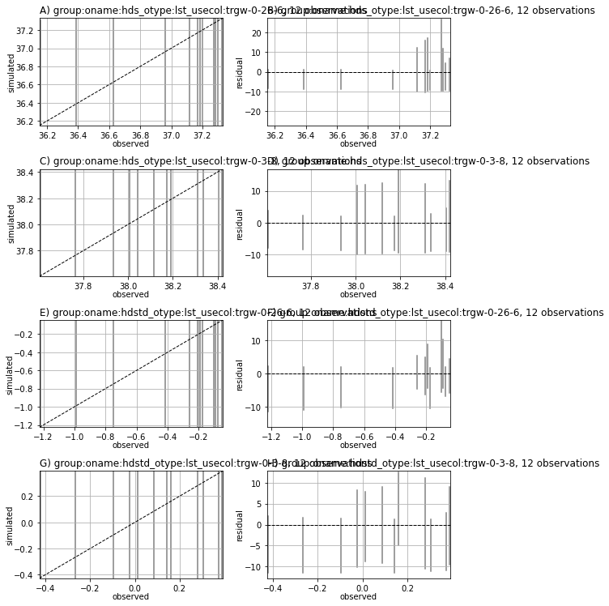
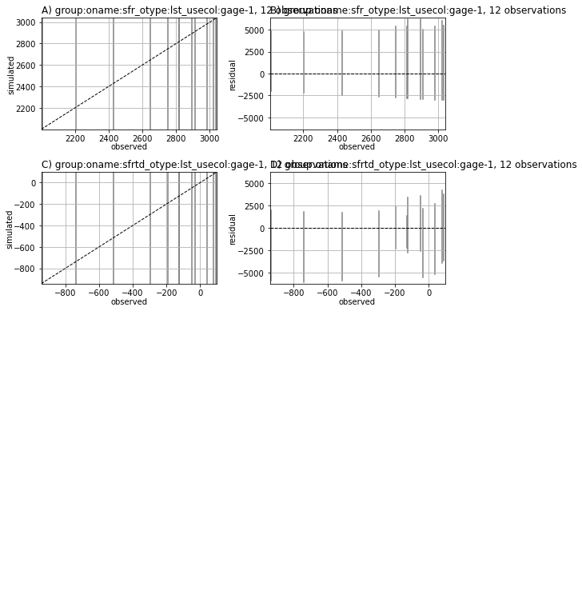
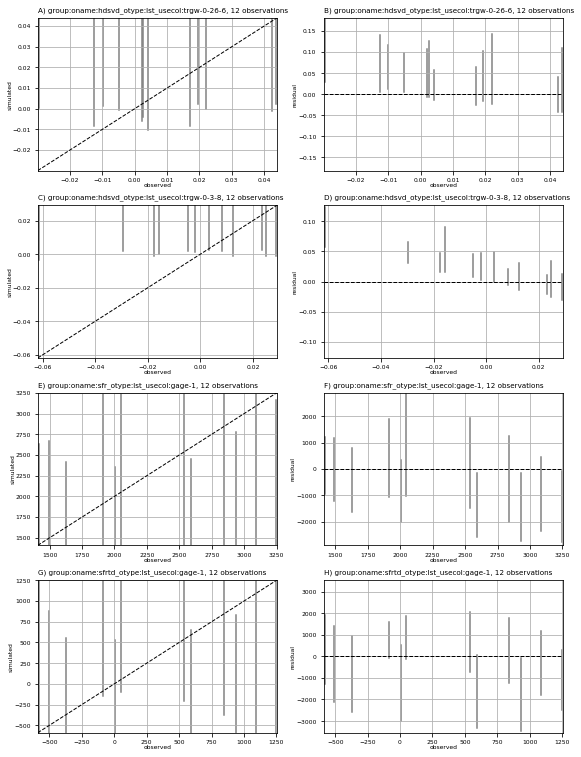
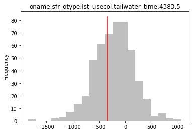
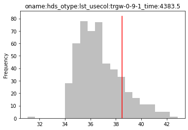
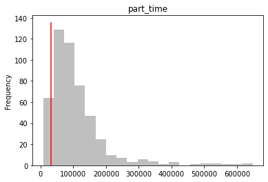
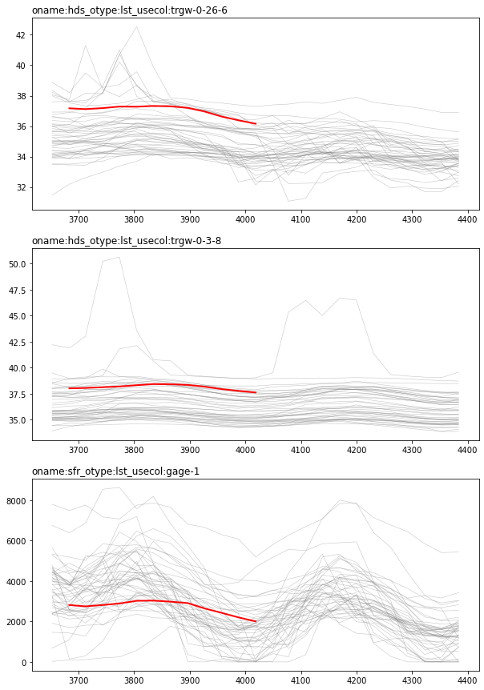
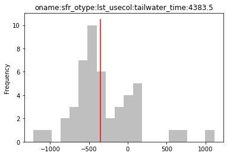
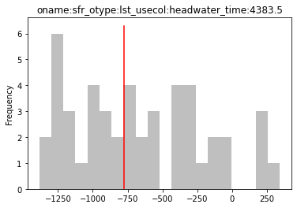
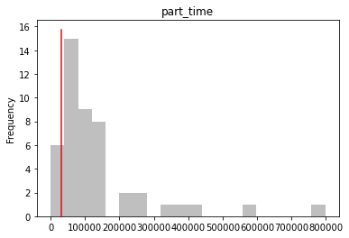

# Prior Monte Carlo

Prior-based (or "unconstrained") Monte Carlo is a usefull, but quite often underused, analysis. It is conceptually simple, does not require much in terms of algorithmic controls and forces the modeller to think about the prior parameter probability distribution - both the mean vector (i.e. the initial parameter values) and the prior parameter covariance matrix. 

The idea is simple: sample many sets of parameters (i.e. an ensemble) from a prior probability distribution and run the model forward for each realization in this ensemble and collate the results. Do not try and fit historical data (yet!). Do not throw any of the simulations out because they "do not represent historical data well". This allows us to explore the entire range of model outcomes across the (prior) range of parameter vaues. It let's us investigate model stability (e.g. can the model setup handle the parameters we are throwing at it?). It also let's us start to think critically about what observations the model will be able to match.

Sometimes, it shows us that history matching is not required - saving us a whole lot of time and effort!

In this notebook we will demonstrate:
 - how to use `pyemu` to run `pestpp` in parallel locally (that is on your machine only)
 - using `pestpp-swp` or `pestpp-ies` to undertake prior monte carlo with an existing geostatistically correlated prior parameter ensemble
 - using `pestpp-ies` to undertake prior monte carlo with an uncorrelated prior parameter ensemble 
 - post-processing stochastic model outputs

### The modified Freyberg PEST dataset

The modified Freyberg model is introduced in another tutorial notebook (see "freyberg intro to model"). The current notebook picks up following the "freyberg psfrom pest setup" notebook, in which a high-dimensional PEST dataset was constructed using `pyemu.PstFrom`. You may also wish to go through the "intro to pyemu" notebook beforehand.

The next couple of cells load necessary dependencies and call a convenience function to prepare the PEST dataset folder for you. This is the same dataset that was constructed during the "freyberg pstfrom pest setup" tutorial. Simply press `shift+enter` to run the cells.


```python
import os
import shutil
import warnings
warnings.filterwarnings("ignore")
warnings.filterwarnings("ignore", category=DeprecationWarning) 
import pandas as pd
import matplotlib.pyplot as plt;
import psutil 

import sys
sys.path.append(os.path.join("..", "..", "dependencies"))
import pyemu
import flopy

sys.path.append("..")
import herebedragons as hbd
```


```python
# specify the temporary working folder
t_d = os.path.join('freyberg6_template')

org_t_d = os.path.join("..","part2_2_obs_and_weights","freyberg6_template")
if not os.path.exists(org_t_d):
    raise Exception("you need to run the '/part2_2_obs_and_weights/freyberg_obs_and_weights.ipynb' notebook")

if os.path.exists(t_d):
    shutil.rmtree(t_d)
shutil.copytree(org_t_d,t_d)
```


    'freyberg6_template'


Load the PEST control file as a `Pst` object.


```python
pst = pyemu.Pst(os.path.join(t_d, 'freyberg_mf6.pst'))
```


```python
# check to see if obs&weights notebook has been run
if not pst.observation_data.observed.sum()>0:
    raise Exception("You need to run the '/part2_2_obs_and_weights/freyberg_obs_and_weights.ipynb' notebook")
```

Load the prior parameter ensemble we generated previously:


```python
[f for f in os.listdir(t_d) if f.endswith(".jcb")]
```


    ['obs_cov.jcb', 'obs_cov_diag.jcb', 'prior_cov.jcb', 'prior_pe.jcb']


```python
pe = pyemu.ParameterEnsemble.from_binary(pst=pst,filename=os.path.join(t_d,"prior_pe.jcb"))
pe.shape
```


    (50, 29653)


### Run the Ensemble in Parallel

Here we are going to make use of the `pestpp-swp` to execute the prior monte carlo in parallel. `pestpp-swp` is a simple parametric sweep utility to run a collection of parameter sets in parallel and collate the results.

So let's start by specifying the name of the prior parameter ensemble file that we generated previously:


```python
pst.pestpp_options['sweep_parameter_csv_file'] = 'prior_pe.jcb'

```

Then, re-write the PEST control file. If you open `freyberg_mf6.pst` in a text editor, you'll see a new PEST++ control variable has been added.


```python
pst.control_data.noptmax = 0 # this is ignored by pestpp-swp, but we can use it to do a test run below
pst.write(os.path.join(t_d, 'freyberg_mf6.pst'))
```

    noptmax:0, npar_adj:29653, nnz_obs:144
    

Always good to do the 'ole `noptmax=0` test:


```python
pyemu.os_utils.run("pestpp-ies freyberg_mf6.pst",cwd=t_d)
```

Now, we are going to run `pestpp-swp` in parallel. 

To speed up the process, you will want to distribute the workload across as many parallel agents as possible. Normally, you will want to use the same number of agents (or less) as you have available CPU cores. Most personal computers (i.e. desktops or laptops) these days have between 4 and 10 cores. Servers or HPCs may have many more cores than this. Another limitation to keep in mind is the read/write speed of your machines disk (e.g. your hard drive). PEST and the model software are going to be reading and writting lots of files. This often slows things down if agents are competing for the same resources to read/write to disk.

The first thing we will do is specify the number of agents we are going to use.

# Attention!

You must specify the number which is adequate for ***your*** machine! Make sure to assign an appropriate value for the following `num_workers` variable:


```python
num_workers = psutil.cpu_count(logical=False) #update this according to your resources
```

Next, we shall specify the PEST run-manager/master directory folder as `m_d`. This is where outcomes of the PEST run will be recorded. It should be different from the `t_d` folder, which contains the "template" of the PEST dataset. This keeps everything separate and avoids silly mistakes.


```python
m_d = os.path.join('master_priormc')
```

The following cell deploys the PEST agents and manager and then starts the run using `pestpp-swp`. Run it by pressing `shift+enter`.

If you wish to see the outputs in real-time, switch over to the terminal window (the one which you used to launch the `jupyter notebook`). There you should see `pestpp-swp`'s progress written to the terminal window in real-time. 

If you open the tutorial folder, you should also see a bunch of new folders there named `worker_0`, `worker_1`, etc. These are the agent folders. The `master_priormc` folder is where the manager is running. 

This run should take several minutes to complete (depending on the number of workers and the speed of your machine). If you get an error, make sure that your firewall or antivirus software is not blocking `pestpp-swp` from communicating with the agents (this is a common problem!).

> **Pro Tip**: Running PEST from within a `jupyter notebook` has a tendency to slow things down and hog alot of RAM. When modelling in the "real world" it is more efficient to implement workflows in scripts which you can call from the command line.


```python
pyemu.os_utils.start_workers(t_d, # the folder which contains the "template" PEST dataset
                            'pestpp-swp', #the PEST software version we want to run
                            'freyberg_mf6.pst', # the control file to use with PEST
                            num_workers=num_workers, #how many agents to deploy
                            worker_root='.', #where to deploy the agent directories; relative to where python is running
                            master_dir=m_d, #the manager directory
                            )
```

### Explore the Outcomes

By default, `pestpp-swp` writes the results of the parametric sweep to a csv file called `sweep_out.csv`.  This file has columns for each observation listed in the control file, plus columns for total phi and phi for each observation group (calculated using the weights in the control file).  It also has columns for the `input_run_id` and `failed_flag` to help you align these outputs with the inputs and also track any failed runs.


Let's check if any runs failed:


```python
obs_df = pd.read_csv(os.path.join(m_d,"sweep_out.csv"),index_col=0)
print('number of realization in the ensemble before dropping: ' + str(obs_df.shape[0]))
```

    number of realization in the ensemble before dropping: 50
    


```python
obs_df = obs_df.loc[obs_df.failed_flag==0,:]
print('number of realization in the ensemble **after** dropping: ' + str(obs_df.shape[0]))
```

    number of realization in the ensemble **after** dropping: 50
    

Are they the same? Good, that means none failed. If any had failed, this would be an opportunity to go and figure out why, by identifying the parameter realisations that failed and figuring out why they may have had trouble converging. This might lead to discovering inadequacies in the model configuration and/or parameterisation.  Better to catch them now, before spending alot of effort history matching the model... 

We can take a look at the distribution of Phi obtained for the ensemble. Some pretty high values there. But that's fine. We are not concerned with getting a "good fit" in prior MC.


```python
obs_df.phi.hist()
```


    <AxesSubplot:>


    

    


More important is to inspect whether the ***distribution*** of simulated observations encompass measured values. Our first concern is to ensure that the model is ***able*** to captured observed behaviour. If measured values do not fall within the range of simualted values, this is a sign that something ain't right and we should revisit our model or prior parameter distributions.


A quick check is to plot stochastic (ensemble-based) 1-to-1 plots. We can plot 1to1 plots for obsvervation groups using the `pyemu.plot_utils.ensemble_res_1to1()` method. However, in our case that will result in lots of plots (we have many obs groups!). 


```python
#pyemu.plot_utils.ensemble_res_1to1(obs_df, pst);
```

Feel free to uncomment the previous cell and see what happens. This can be usefull for a quick review, but for the purposes of this tutorial, let's just look at four observation groups (recall, each group is made up of a time series of observations from a single location).

Now, this plot does not look particularily pretty...but we aren't here for pretty, we are here for results! What are we concerned with? Whether the range of ensemble simulated outcomes form the prior covers the measured values. Recall that plots on the left are 1to1 plots and on the right the residuals ar edisplayed.  In both cases, a grey line represents the range of simulated values for a given observation

In plots on the right, each grey line should interesect the 1-to-1 line. In the plots on the right, each grey line should intersect the "zero-residual" line. 


```python
zero_weighted_obs_groups = [i for i in pst.obs_groups if i not in pst.nnz_obs_groups]
len(zero_weighted_obs_groups)
```


    153


```python
pyemu.plot_utils.ensemble_res_1to1(obs_df, pst, skip_groups=zero_weighted_obs_groups); 
```


    <Figure size 576x756 with 0 Axes>


    

    


    

    


    

    


As we can see above, the prior covers the "measured" values (which is good).

But hold on a second! What about measurement noise? If we are saying that it is *possible* that our measurements are wrong by a certain amount, shouldn't we make sure our model can represent conditions in which they are? Yes, of course!

No worries, `pyemu` has you covered. Let's quickly cook up an ensemble of observations with noise. (Recall we recorded a covariance matrix of observation noise during the "freyberg pstfrom pest setup" notebook; this has also been discussed in the "observation and weights" notebook.)


```python
obs_cov = pyemu.Cov.from_binary(os.path.join(t_d, 'obs_cov.jcb'))
obs_plus_noise = pyemu.ObservationEnsemble.from_gaussian_draw(pst=pst, cov=obs_cov);
```

    drawing from group oname:hds_otype:lst_usecol:trgw-0-26-6
    drawing from group oname:hds_otype:lst_usecol:trgw-0-3-8
    drawing from group oname:hds_otype:lst_usecol:trgw-2-26-6
    drawing from group oname:hds_otype:lst_usecol:trgw-2-3-8
    drawing from group oname:hdstd_otype:lst_usecol:trgw-0-26-6
    drawing from group oname:hdstd_otype:lst_usecol:trgw-0-3-8
    drawing from group oname:hdstd_otype:lst_usecol:trgw-2-26-6
    drawing from group oname:hdstd_otype:lst_usecol:trgw-2-3-8
    drawing from group oname:hdsvd_otype:lst_usecol:trgw-0-26-6
    drawing from group oname:hdsvd_otype:lst_usecol:trgw-0-3-8
    drawing from group oname:sfr_otype:lst_usecol:gage-1
    drawing from group oname:sfrtd_otype:lst_usecol:gage-1
    

OK, now let's plot that again but with observation noise. 

Aha! Good, not only do our ensemble of model outcomes cover the measured values, but they also entirely cover the range of measured values with noise (red shaded area in the plot below). 


```python
pyemu.plot_utils.ensemble_res_1to1(obs_df,
                                    pst, 
                                    skip_groups=zero_weighted_obs_groups,
                                    base_ensemble=obs_plus_noise); 
```


    <Figure size 576x756 with 0 Axes>


    

    


    

    


    

    


Another, perhaps coarser, method to quickly explore outcomes is to look at histograms of observations. 

The following figure groups obsevrations according to type (just to lump them together and make a smaller plot) and then plots histograms of observation values. Grey shaded columns represent simulated values from the prior. Red shaded columns represent the ensemble of measured values + noise. The grey columns should ideally be spread wider than the red columns.


```python
plot_cols = pst.observation_data.loc[pst.nnz_obs_names].apply(lambda x: x.usecol + " "+x.oname,axis=1).to_dict()
plot_cols = {v: [k] for k, v in plot_cols.items()}
pyemu.plot_utils.ensemble_helper({"r":obs_plus_noise,"0.5":obs_df}, 
                                  plot_cols=plot_cols,bins=20,sync_bins=True,
                                  )
plt.show();
```


    <Figure size 576x756 with 0 Axes>


    

    


    

    


Finally, let's plot the obs vs sim timeseries - everyone's fav!


```python
pst.try_parse_name_metadata()
obs = pst.observation_data.copy()
obs = obs.loc[obs.oname.apply(lambda x: x in ["hds","sfr"])]
obs = obs.loc[obs.obgnme.apply(lambda x: x in pst.nnz_obs_groups),:]
obs.obgnme.unique()
```


    array(['oname:hds_otype:lst_usecol:trgw-0-26-6',
           'oname:hds_otype:lst_usecol:trgw-0-3-8',
           'oname:hds_otype:lst_usecol:trgw-2-26-6',
           'oname:hds_otype:lst_usecol:trgw-2-3-8',
           'oname:sfr_otype:lst_usecol:gage-1'], dtype=object)


```python
ogs = obs.obgnme.unique()
fig,axes = plt.subplots(len(ogs),1,figsize=(10,5*len(ogs)))
ogs.sort()
for ax,og in zip(axes,ogs):
    oobs = obs.loc[obs.obgnme==og,:].copy()
    oobs.loc[:,"time"] = oobs.time.astype(float)
    oobs.sort_values(by="time",inplace=True)
    tvals = oobs.time.values
    onames = oobs.obsnme.values
    [ax.plot(tvals,obs_df.loc[i,onames].values,"0.5",lw=0.5,alpha=0.5) for i in obs_df.index]
    oobs = oobs.loc[oobs.weight>0,:]
    ax.plot(oobs.time,oobs.obsval,"r-",lw=2)
    ax.set_title(og,loc="left")
```


    

    


### Forecasts

As usual, we bring this story back to the forecasts - after all they are why we are modelling.


```python
pst.forecast_names
```


    ['oname:sfr_otype:lst_usecol:tailwater_time:4383.5',
     'oname:sfr_otype:lst_usecol:headwater_time:4383.5',
     'oname:hds_otype:lst_usecol:trgw-0-9-1_time:4383.5',
     'part_time']


The following cell will plot the distribution of each forecast obtained by running the prior parameter ensemble. Because we are using a synthetic model, we also have the privilege of being able to plot the "truth" (in the real world we dont know the truth of course). 

Many modelling analyses could stop here. If outcomes from a prior MC analysis show that the simulated distribution of forecasts *does not* cause some "bad-thing" to happen within an "acceptable" confidence, then you are done. No need to go and do expensive and time-consuming history-matching! 

On the other hand, if the uncertainty (e.g. variance) is unacceptably wide, then it *may* be justifiable to try to reduce forecast unertainty through history matching. But only if you have forecast-sensitive observation data, and if the model is amenable to assimilating these data! How do I know that you ask? Worry not, we will get to this in subsequent tutorials.


```python
for forecast in pst.forecast_names:
    plt.figure()
    ax = obs_df.loc[:,forecast].plot(kind="hist",color="0.5",alpha=0.5, bins=20)
    ax.set_title(forecast)
    fval = pst.observation_data.loc[forecast,"obsval"]
    ax.plot([fval,fval],ax.get_ylim(),"r-")
```


    

    


    

    


    

    


    

    


### Prior MC without Covariance

The workflow above demonstrated how to use `pestpp-swp` to undertake a "sweep" of model runs. Here, we undertook prior Monte Carlo by running models with an ensemble of parameter sets sampled from the prior parameter probability distribution. 

The same can be accomplished with `pestpp-ies` by assigning the `NOPTMAX` control variable to -1 and either providing `pestpp-ies` with a predefined parameter ensebmle (the same as we did for `pestpp-swp`) or by providing the parameter covariance matrix and allowing `pestpp-ies` to sample from the prior itself.

The next few cells do something slightly different. Here we will use `pestpp-ies` to undertake prior MC, but assuming to correlation between parameters. Here, prior parameter uncertainty is diagonal and determined solely based on the parameter bounds in the PEST control file. 

First set some `pest++` options and re-write the control file.


```python
pst.pestpp_options['ies_num_reals'] = 50
pst.control_data.noptmax = -1
pst.write(os.path.join(t_d,"freyberg_diagprior.pst"))
```

    noptmax:-1, npar_adj:29653, nnz_obs:144
    

Run `pstpp-ies`. This should take about the same amount of time as `pestpp-swp` did.


```python
m_d = "master_diagonal_prior_monte_carlo" 
pyemu.os_utils.start_workers(t_d,"pestpp-ies","freyberg_diagprior.pst",
                            num_workers=num_workers,
                            worker_root='.',
                            master_dir=m_d)
```

Now read in the results. Let's just look at the forecasts. (Feel free to repeat the plots we did above if you wish to compare them.)

So, what do you think? Did ignoring parameter covariance make our forecasts more or less robust? It seems like our prior is failing to capture some of the "true" values now. This highlights the role of connectivity and "hydraulic structures" in some groundwater predictions and the importance of having a well constructed prior. 


```python
obs_df = pd.read_csv(os.path.join(m_d,"freyberg_diagprior.0.obs.csv"),index_col=0)

pst.try_parse_name_metadata()
obs = pst.observation_data.copy()
obs = obs.loc[obs.oname.apply(lambda x: x in ["hds","sfr"])]
obs = obs.loc[obs.obgnme.apply(lambda x: x in pst.nnz_obs_groups),:]
obs.obgnme.unique()
ogs = obs.obgnme.unique()
fig,axes = plt.subplots(len(ogs),1,figsize=(10,5*len(ogs)))
ogs.sort()
for ax,og in zip(axes,ogs):
    oobs = obs.loc[obs.obgnme==og,:].copy()
    oobs.loc[:,"time"] = oobs.time.astype(float)
    oobs.sort_values(by="time",inplace=True)
    tvals = oobs.time.values
    onames = oobs.obsnme.values
    [ax.plot(tvals,obs_df.loc[i,onames].values,"0.5",lw=0.5,alpha=0.5) for i in obs_df.index]
    oobs = oobs.loc[oobs.weight>0,:]
    ax.plot(oobs.time,oobs.obsval,"r-",lw=2)
    ax.set_title(og,loc="left")

    
for forecast in pst.forecast_names:
    plt.figure()
    # plot histogram of forecast values recorded in the simulated prior observation csv
    ax = obs_df.loc[:,forecast].plot(kind="hist",color="0.5",alpha=0.5, bins=20)
    ax.set_title(forecast)
    # plot the forecast value in the "observation data"; this value happens to be the "truth"
    fval = pst.observation_data.loc[forecast,"obsval"]
    ax.plot([fval,fval],ax.get_ylim(),"r-")
```


    

    


    

    


    

    


    

    


    

    


```python

```
