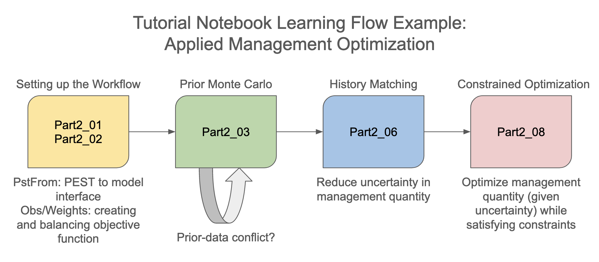

# Summary

The [GMDSI tutorial notebooks repository](https://github.com/gmdsi/GMDSI_notebooks/tree/main) provides learners with a comprehensive set of tutorials for self-guided training on decision-support groundwater modelling using Python-based tools. Although targeted at groundwater modelling, they are based around model-agnostic tools and readily transferable to other environmental modelling workflows. The tutorials are divided into three parts. The first covers fundamental theoretical concepts. These are intended as background reading for reference on an as-needed basis. Tutorials in the second part introduce learners to some of the core concepts of parameter estimation in a groundwater modelling context, as well as provide a gentle introduction to the ``PEST``, ``PEST++`` and ``pyemu`` software. Lastly, the third part demonstrates how to implement highly parameterized applied decision-support modelling workflows. The tutorials aim to provide examples of both “how to use” the software as well as “how to think” about using the software. 
A key advantage to using notebooks in this context is that the workflows described run the same code as practitioners would run on a large-scale real-world application. Using a small synthetic model facilitates rapid progression through the workflow.

# Statement of Need

Managing the environment and natural resources is often faced with making decisions on actions that trade-off between economic, social, and environmental outcomes. These decisions are often complex and rely on the use of numerical models to simulate the natural system and evaluate the outcomes of different management actions [@kelly2013]. 

Effective environmental management is often aided by using models. Such models face the challenges of limited data and the inherent simplifications of the complex natural world necessary to make them. This translates to uncertainties in critical decision-making predictions. Transparency is critical in reporting and mitigating these uncertainties, especially when significant risks accompany management outcomes [@white11rapid; @fienen2016hess]. The significance of uncertainty quantification (UQ) and parameter estimation (PE) in environmental modelling for decision support is widely acknowledged [@Anderson2015]. 

Implementing highly parameterized UQ and PE in real-world modelling can be challenging due to both theoretical complexity and practical logistics. Limited project time and funding also often hinder their application. Open-source software such as ``PEST`` [@pest] and ``PEST++`` [@whitepestpp] provide tools for undertaking UQ and PE analyses. They have been employed to tackle a diverse range of real-world decision-support problems, ranging from risk-based wellhead protection [@fienen2022risk], groundwater contaminant system remediation design [@FIENEN2024], evaluating the impact of groundwater use on river baseflow [@Foster2021],  managed aquifer recharge scheme design to protect against seawater intrusion [@Standen2022], optimizing vineyard irrigation [@KNOWLING2023108225], and many others. However, the steep learning curve associated with their use and the lack of user-friendly training materials have been a barrier to uptake. 

The uptake of Python for environmental modelling has increased in recent years, due to its open-source nature, user-friendly syntax, and extensive scientific libraries. Python-based tools have been developed to facilitate UQ and PE analyses, such as ``pyemu`` [@White_A_python_framework_2016; @white2021towards]. ``pyemu`` is a Python package that provides a framework for implementing UQ and PE analyses with ``PEST`` and ``PEST++``. It offers a range of capabilities, including parameter estimation, uncertainty analysis, and management optimization. Although initially designed for groundwater modelling, ``pyemu``'s methodologies are versatile and can be applied to diverse numerical environmental models, as long as they use text files for input and generate machine-readable outputs that can be extracted without manual intervention.

The tutorial notebooks discussed herein provide a comprehensive, self-guided, and open-source resource for learning decision-support modelling workflows with Python. They are designed to be accessible to a broad audience, including students, researchers, and practitioners who aim to undertake applied environmental decision-support modelling. 

# Story of the Project

The Groundwater Modelling Decision Support Initiative ([GMDSI](https://gmdsi.org)) is an industry-backed and industry-aligned initiative. Established in mid-2019, its primary goal is to enhance the role of groundwater modelling in groundwater management, regulatory processes, and decision-making. GMDSI promotes the improved use of modelling in decision support, with activities focused on industry engagement, education, practical examples, research, and software development. It also emphasizes the importance of tools for uncertainty quantification (UQ) and parameter estimation (PE) in these processes.

Many groundwater modelers typically rely on Graphical User Interfaces (GUIs) for their modelling needs. However, each GUI has its unique characteristics and varying degrees of compatibility with external software like ``PEST`` and ``PEST++``. Creating educational materials for these GUIs would necessitate tailoring content to each GUI's specific features, obtaining cooperation from the GUI developers themselves and potentially lagging behind the latest developments. Many GUIs are commercial products as well which limits accessibility.

Decision-support modelling often demands capabilities that surpass what current Graphical User Interfaces (GUIs) can offer. Programmatic workflows, such as those facilitated by ``pyemu``, offer advantages by reducing the time and user input required for setup and execution. Anecdotally, we have seen that more modelers are turning to Python packages like ``FloPy`` [@flopy] and ``pyemu`` [@whitepyemu] for model and ``PEST++`` setup. Unfortunately, the adoption of this approach is hindered by a steep learning curve primarily due to the scarcity of user-friendly training materials. The [GMDSI tutorial notebooks](https://github.com/gmdsi/GMDSI_notebooks/tree/main) aim to address this gap by providing a comprehensive, self-guided, and open-source resource for learning decision-support modelling workflows with Python.

The roots of the materials making up the tutorial notebooks were from a traditional, week-long classroom course curriculum developed for internal training at the US Geological Survey (USGS) by a subset of the authors of this paper. After three iterations of teaching the in-person class, the instructors concluded that the materials and approach were valuable, but came to question the level of retention by students in a 40-hour intensive setting. As a result, the authors, with support from the GMDSI, endeavored to build on the positive aspects of using Jupyter Notebooks and explore alternative teaching environments instead of week-long classes. The first major change was to add sufficient narration and explanation to the notebooks to improve possibilities for self-study. The initial design through in-person instruction was to have the notebooks serve as illustrations to assist in a narrative discussion, so bolstering of the explanatory text was necessary to help them stand alone. The next change was to refactor the organization from a strictly linear progression to the current three-part organization discussed below. This led to a hybrid model of self-study punctuated by discussion and background lectures online. 

# Contents and Instructional Design
The tutorial notebooks are structured into three main parts:

## Part 0: Introductory Background

> After completing this module, learners should be able to:
>   - Describe the structure and components of the synthetic Freyberg model.
>   - Apply the `pyemu` Python package to interface with PEST/PEST++.
>   - Discuss the mathematical concepts that underpin the PEST/PEST++ software.
> 

Part 0 serves as the foundation, providing essential background material. Learners are encouraged to reference notebooks in Part 0 to polish their understanding of concepts they encounter in Parts 1 and 2. Part 0 is not intended to be a comprehensive resource for all background material, but rather to establish a solid understanding of the basics. The explanations of mathematical concepts are intended to be accessible through visualization and descriptions related to everyday concepts and modelling concepts. 

Each notebook in Part 0 is standalone and covers a unique topic. These include:

  - Introduction to a synthetic model known as the "Freyberg" model [@freyberg]. This model is used as a consistent example throughout the tutorial exercises, allowing learners to apply concepts in a practical context.
  - An introduction to the `pyemu` Python package that is used to complement and interface with PEST/PEST++.
  - Explanation of fundamental mathematical concepts that are relevant and will be encountered throughout the tutorial notebooks.

Pre-requisites for Part 0 include a basic understanding of Python, Jupyter Notebooks, and MODFLOW 6 [@Langevin_MODFLOW_6_Modular_2022]. Familiarity with git is a bonus but not fundamental.

## Part 1: Introduction to ``PEST`` and the Gauss-Levenberg Marquardt Approach

> After completing this module, learners should be able to:
> 
> - Describe the GLM approach to parameter estimation.
> - Explain non-uniqueness, identifiability and equifinality in the context of decision-support > modelling.
> - Construct a ``PEST`` control file and interface files.
> - Understand the effect of parameterization schemes on model predictive ability.
> - Explain the difference between linear and non-linear uncertainty analysis approaches and > the value of each.

Part 1 focuses on the Gauss-Levenberg Marquardt (GLM) approach to parameter estimation and associated uncertainty analysis in a groundwater modelling context. This was the foundation of the ``PEST`` software for multiple decades and the theory continues to resonate through newer techniques.

Part 1 is designed to be accessible without strict sequential dependencies. Learners have the flexibility to explore its contents in any order that suits their preferences or needs. These include:

  - Introduction to concepts such as non-uniqueness, identifiability, and equifinality.
  - Introduction to the ``PEST`` control file and the PEST/PEST++ interface.
  - Exploring the challenges of parameterization schemes on predictive ability, as well as how to mitigate them.
  - Introducing first-order second-moment (FOSM) and prior Monte Carlo uncertainty analysis approaches.

 While Part 1 notebooks can be largely run in any order, the curriculum was initially designed to start with simple parameterization of a model and to build complexity intentionally throughout the progression of the sequence. The ramifications of simplification and the value of adding complexity are evaluated in the context of the performance of the model in forecasts made outside the parameter estimation conditions. This progression motivates the value of a highly parameterized approach which is the starting point for many new projects, as explored in Part 2.

Pre-requisites for Part 1 include a basic understanding of numerical groundwater modelling and familiarity with MODFLOW 6. Familiarity with Python and Jupyter Notebooks is assumed.

## Part 2: Python-based Decision-Support Modelling Workflows

> After completing this module, learners should be able to:
> 
> - Construct a high-dimensional ``PEST`` control file and interface files.
> - Implement GLM and ensemble-based parameter estimation and uncertainty analysis workflows > using ``PEST++`` and associated tools.
> - Apply management optimization and sequential data assimilation techniques to > decision-support groundwater modelling problems.

Part 2 expands on the foundational knowledge gained in Part 1 and delves into advanced topics related to ensemble-based parameter estimation, uncertainty analysis and optimization methods. These advanced topics include management optimization and sequential data assimilation. This approach and these advanced topics assume a highly parameterized approach, as motivated in Part 1. Topics are laid out in manner that reflects real-world workflows, with a focus on practical application of concepts and problem solving.

Part 2 is structured with a specific order for learners to follow to ensure a logical progression of topics, inline with a real-world applied workflow. Learners have the option to explore various sequences covering advanced topics, such as:

  - Prior Monte Carlo analysis
  - Highly parameterized Gauss-Levenberg Marquardt history matching and associated Data Worth analysis using First Order, Second Moment (FOSM) technique, 
  - Ensemble-based history matching and uncertainty analysis with the iterative ensemble smoother approach as implemented in ``PEST++IES``, 
  - Sequential data assimilation with ``PEST++DA``, and 
  - Single-objective and multi-objective optimization under uncertainty with ``PEST++OPT`` and ``PEST++MOU``.
 
Each of these sequences comprises multiple notebooks to be executed in a specified order. They demonstrate how to execute the workflow, interpret results, and apply the concepts to real-world problems.

In summary, the tutorial notebooks are organized to guide learners through a structured learning experience in the field of decision-support groundwater modelling. Part 0 provides foundational knowledge, while Parts 1 and 2 offer progressively advanced content. The authors attest that it is ideal to work through Parts 1 and 2 in their entirety, referring back to Part 0 for additional background. However, this amount of content requires a significant time commitment so, practically, many users will start with Part 2 and, hopefully, be able to apply the concepts to a problem of their own as they progress. In this practical case, users with a specific application or learning goal in mind may find it useful to curate notebooks from Part 2 into a comprehensive and demonstrative workflow. The flowchart below gives an example of a curated learning flow for a common decision support modelling application. Over time, referring back through Part 1 will provide a deeper understanding of some concepts and techniques taken for granted in the highly parameterized, largely ensemble-based approaches of Part 2.

Pre-requisites for Part 2 include a basic understanding of PEST/PEST++ and the ``PEST`` interface, as well as familiarity with the Freyberg model. Familiarity with Python and Jupyter Notebooks is assumed.

# Experience of use in teaching and learning situations

The notebooks were employed during the [Applied Decision Support Groundwater modelling With Python: A Guided Self-Study Course](https://gmdsi.org/blog/guided-self-study-course/) hosted by GMDSI. This self-guided course comprised 5 online sessions, each lasting 1 to 2 hours and focused on the workflows of Part 2. During each session the instructors go through a section of the tutorials and expand on some of the concepts. Sessions were recorded and can be accessed [on the GMDSI YouTube channel](https://www.youtube.com/playlist?list=PLH34FdA92dratOQVyYjURdFMOnO1ImmRV). Beyond the live online sessions, learners were encouraged to make use of the GitHub [Discussions](https://github.com/gmdsi/GMDSI_notebooks/discussions) feature to retain a search-engine findable record of common questions that persist beyond the time frame of the course . 

Feedback from the 65 students who participated in the course was anecdotal but informative. \autoref{fig:responses} summarizes the responses by 34 respondents to four questions, comprising 52%. The majority of respondents indicated a preference for this hybrid self-guided/online instruction approach over an in-person week-long intensive class. 

Open-ended feedback from the participants was generally positive and also included some constructive criticism. Participants appreciated the opportunity to ask questions and several reported hearing the discussion around other peoples' questions as being valuable and clarifying aspects of the material.  

# Acknowledgements

The tutorials were originally developed with support from the US Geological Survey (USGS) and support from USGS continues through the HyTest training project. Continued development and support is funded by the Groundwater Modelling Decision Support Initiative (GMDSI). GMDSI is jointly funded by BHP and Rio Tinto. We thank Dr. John Doherty for his tireless and pioneering efforts starting `PEST` and continuing to innovate and Dr. Randall Hunt for his leadership in `PEST` and `PEST++` applications and development and contributions to the initial curriculum for this material and the early version of the notebooks. We thank Kalle Jahn (USGS), [Ines Rodriguez](https://github.com/incsanchezro) and [codyalbertross](https://github.com/codyalbertross) who made reviews that improved this manuscript. Lastly, we thank users and stress-testers for their valuable feedback and continued community contributions to the repository.

# Disclaimer 
Any use of trade, firm, or product names is for descriptive purposes only and does not imply endorsement by the US Government.

# References
